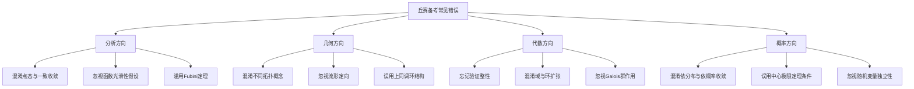

# 丘成桐大学生数学竞赛习题集

> 面向丘成桐大学生数学竞赛（Yau College Student Mathematics Competition）的专项训练

## 概述

丘成桐大学生数学竞赛涵盖五大领域：
- **分析与微分方程**
- **几何与拓扑**
- **代数、数论与组合**
- **应用与计算数学**
- **概率统计**

本习题集精选16道具有代表性的高水平题目，难度从⭐⭐⭐⭐到⭐⭐⭐⭐⭐。

---

## 分析与微分方程

### 题目 1 ⭐⭐⭐⭐
**主题：** 复分析 / 解析延拓

**问题：** 设$f$在区域$D = \{z \in \mathbb{C} : |z| < 1\}$上解析，且满足：
$$f\left(\frac{1}{n}\right) = \frac{1}{n^2}, \quad n = 2, 3, 4, \ldots$$

求$f(z)$的表达式。

**关键思路点拨：**
- 提示1：考虑函数$g(z) = f(z) - z^2$
- 提示2：零点集$\{\frac{1}{n}\}$有聚点0
- 提示3：应用恒等定理

**完整解答：**

**步骤1：构造辅助函数**

令$g(z) = f(z) - z^2$。

**步骤2：分析零点**

由条件：
$$g\left(\frac{1}{n}\right) = f\left(\frac{1}{n}\right) - \frac{1}{n^2} = \frac{1}{n^2} - \frac{1}{n^2} = 0$$

所以$g$在点集$\{\frac{1}{n} : n = 2, 3, \ldots\}$上为零。

**步骤3：应用恒等定理**

注意$\frac{1}{n} \to 0 \in D$，所以0是零点集的聚点。

由恒等定理（解析函数的唯一性定理），若解析函数在具有聚点的集合上为零，则函数恒为零。

因此$g(z) \equiv 0$在$D$上。

**步骤4：得出结论**

$$f(z) = z^2$$

**答案：** $\boxed{f(z) = z^2}$

**相关概念：** [恒等定理](../03-分析学/解析函数.md) | [零点孤立性](../03-分析学/复分析基础.md)

---

### 题目 2 ⭐⭐⭐⭐⭐
**主题：** 调和分析 / Fourier级数

**问题：** 设$f \in L^2([0, 2\pi])$，其Fourier级数为：
$$f(x) \sim \sum_{n=-\infty}^{\infty} c_n e^{inx}$$

证明：$f \in H^1([0, 2\pi])$（Sobolev空间）当且仅当$\sum_{n=-\infty}^{\infty} (1+n^2)|c_n|^2 < \infty$。

**关键思路点拨：**
- 提示1：回顾$H^1$范数的定义
- 提示2：利用Parseval等式
- 提示3：分布意义下的导数

**完整解答：**

**步骤1：$H^1$范数定义**

$H^1([0, 2\pi]) = \{f \in L^2 : f' \in L^2\}$，范数为：
$$\|f\|_{H^1}^2 = \|f\|_{L^2}^2 + \|f'\|_{L^2}^2$$

**步骤2：Parseval等式**

对于$f \in L^2$：
$$\|f\|_{L^2}^2 = 2\pi \sum_{n=-\infty}^{\infty} |c_n|^2$$

**步骤3：导数的Fourier系数**

若$f$可微，则：
$$f'(x) \sim \sum_{n=-\infty}^{\infty} (in)c_n e^{inx}$$

**步骤4：证明等价性**

**（⇒）设$f \in H^1$**

由$f' \in L^2$，应用Parseval等式：
$$\|f'\|_{L^2}^2 = 2\pi \sum_{n=-\infty}^{\infty} |in \cdot c_n|^2 = 2\pi \sum_{n=-\infty}^{\infty} n^2|c_n|^2$$

所以：
$$\|f\|_{H^1}^2 = 2\pi \sum_{n=-\infty}^{\infty} (1 + n^2)|c_n|^2 < \infty$$

**（⇐）设$\sum (1+n^2)|c_n|^2 < \infty$**

定义$g(x) = \sum_{n=-\infty}^{\infty} (in)c_n e^{inx}$。

由条件$\sum n^2|c_n|^2 < \infty$，级数在$L^2$中收敛，所以$g \in L^2$。

验证$g$是$f$的弱导数：对任意$\phi \in C_c^\infty$：
$$\int_0^{2\pi} f \phi' dx = \sum_{n} c_n \int_0^{2\pi} e^{inx} \phi' dx = -\sum_{n} c_n (in) \int_0^{2\pi} e^{inx} \phi dx$$

$$= -\int_0^{2\pi} g \phi dx$$

所以$f' = g \in L^2$，即$f \in H^1$。

**答案：** 等价性得证。

**相关概念：** [Sobolev空间](../03-分析学/泛函分析.md) | [Fourier分析](../03-分析学/傅里叶分析.md)

---

## 几何与拓扑

### 题目 3 ⭐⭐⭐⭐⭐
**主题：** 黎曼几何 / Gauss-Bonnet定理

**问题：** 设$(M, g)$是紧致定向二维黎曼流形，$K$是其高斯曲率。证明：
$$\int_M K \, dA = 2\pi \chi(M)$$
其中$\chi(M)$是$M$的Euler示性数。

**关键思路点拨：**
- 提示1：先考虑可三角剖分的曲面
- 提示2：在每个三角形上应用局部Gauss-Bonnet
- 提示3：边界积分相消，角盈求和得Euler示性数

**完整解答：**

**步骤1：三角剖分**

设$M$有三角剖分，顶点数为$V$，边数为$E$，面数为$F$。

Euler示性数：$\chi(M) = V - E + F$。

**步骤2：局部Gauss-Bonnet定理**

对有边区域$R \subset M$，边界为分段光滑曲线：
$$\int_R K \, dA + \int_{\partial R} k_g \, ds + \sum_{i} (\pi - \alpha_i) = 2\pi$$

其中$k_g$是测地曲率，$\alpha_i$是外角。

**步骤3：对所有三角形求和**

对每个三角形$T_j$应用局部Gauss-Bonnet：
$$\int_{T_j} K \, dA + \int_{\partial T_j} k_g \, ds + \sum_{k=1}^{3} (\pi - \alpha_{jk}) = 2\pi$$

**步骤4：边界积分相消**

对相邻三角形，公共边上的边界积分方向相反，相消。

所以：
$$\sum_{j=1}^{F} \int_{\partial T_j} k_g \, ds = 0$$

**步骤5：角盈求和**

$$
\sum_{j=1}^{F} \sum_{k=1}^{3} (\pi - \alpha_{jk}) = 3\pi F - \sum_{\text{所有角}} \alpha_{jk}
$$

在顶点$v_i$处，环绕角之和为$2\pi$，所以：
$$\sum_{\text{所有角}} \alpha_{jk} = \sum_{i=1}^{V} 2\pi = 2\pi V$$

又$3F = 2E$（每边属于两个三角形），所以：
$$3\pi F - 2\pi V = 2\pi E - 2\pi V = 2\pi(E - V)$$

**步骤6：得出结论**

对所有三角形求和：
$$\int_M K \, dA + 0 + 2\pi(E - V) = 2\pi F$$

$$\int_M K \, dA = 2\pi(F - E + V) = 2\pi \chi(M)$$

**答案：** Gauss-Bonnet定理得证。

**相关概念：** [Gauss-Bonnet定理](../04-几何与拓扑/黎曼几何.md) | [Euler示性数](../04-几何与拓扑/代数拓扑.md)

---

### 题目 4 ⭐⭐⭐⭐
**主题：** 代数拓扑 / 同调群

**问题：** 计算实射影平面$\mathbb{RP}^2$的奇异同调群$H_n(\mathbb{RP}^2; \mathbb{Z})$。

**关键思路点拨：**
- 提示1：使用CW复形结构
- 提示2：一个0-胞腔，一个1-胞腔，一个2-胞腔
- 提示3：计算胞腔链复形的边缘映射

**完整解答：**

**步骤1：CW复形结构**

$\mathbb{RP}^2$的CW结构：
- 一个0-胞腔$e^0$
- 一个1-胞腔$e^1$（粘合方式：端点都粘到$e^0$）
- 一个2-胞腔$e^2$（通过二重覆盖的映射粘合）

**步骤2：胞腔链复形**

链群：
- $C_0 = \mathbb{Z}$（由$e^0$生成）
- $C_1 = \mathbb{Z}$（由$e^1$生成）
- $C_2 = \mathbb{Z}$（由$e^2$生成）
- $C_n = 0$对$n > 2$

**步骤3：计算边缘映射**

$\partial_1: C_1 \to C_0$：
1-胞腔$e^1$的两个端点都映射到$e^0$，所以：
$$\partial_1(e^1) = e^0 - e^0 = 0$$

$\partial_2: C_2 \to C_1$：
2-胞腔通过二重覆盖粘合到1-骨架$S^1$上，度数为2：
$$\partial_2(e^2) = 2e^1$$

**步骤4：计算同调群**

$$H_0 = \ker \partial_0 / \text{im} \partial_1 = C_0 / \{0\} = \mathbb{Z}$$

$$H_1 = \ker \partial_1 / \text{im} \partial_2 = \mathbb{Z} / 2\mathbb{Z} = \mathbb{Z}/2\mathbb{Z}$$

$$H_2 = \ker \partial_2 / \text{im} \partial_3 = \{0\} / \{0\} = 0$$

**答案：**
$$\boxed{H_n(\mathbb{RP}^2; \mathbb{Z}) = \begin{cases} \mathbb{Z} & n = 0 \\ \mathbb{Z}/2\mathbb{Z} & n = 1 \\ 0 & n \geq 2 \end{cases}}$$

**相关概念：** [胞腔同调](../04-几何与拓扑/同调论.md) | [射影空间](../04-几何与拓扑/流形.md)

---

## 代数、数论与组合

### 题目 5 ⭐⭐⭐⭐⭐
**主题：** 代数几何 / 层上同调

**问题：** 设$X = \mathbb{P}^1_\mathbb{C}$是复射影直线，$\mathcal{O}(n)$是扭层（twisted sheaf）。计算$H^i(X, \mathcal{O}(n))$对所有$i \geq 0$和$n \in \mathbb{Z}$。

**关键思路点拨：**
- 提示1：使用Čech上同调
- 提示2：标准覆盖$U_0 = \{z_0 \neq 0\}$，$U_1 = \{z_1 \neq 0\}$
- 提示3：利用Serre对偶

**完整解答：**

**步骤1：标准覆盖**

设$X = U_0 \cup U_1$，其中：
- $U_0 = \{[z_0:z_1] : z_0 \neq 0\} \cong \mathbb{A}^1$，坐标$t = z_1/z_0$
- $U_1 = \{[z_0:z_1] : z_1 \neq 0\} \cong \mathbb{A}^1$，坐标$s = z_0/z_1 = 1/t$

**步骤2：Čech复形**

$\check{C}^0 = \Gamma(U_0, \mathcal{O}(n)) \oplus \Gamma(U_1, \mathcal{O}(n)) = \mathbb{C}[t] \oplus \mathbb{C}[s]$

$\check{C}^1 = \Gamma(U_0 \cap U_1, \mathcal{O}(n)) = \mathbb{C}[t, t^{-1}]$

边缘映射：$\delta(f, g) = g|_{U_0 \cap U_1} - f|_{U_0 \cap U_1}$

在$U_0 \cap U_1$上，$\mathcal{O}(n)$的转换函数为$t^n$：
$$\delta(f(t), g(s)) = t^n g(1/t) - f(t)$$

**步骤3：计算上同调**

**情况$n \geq 0$：**

$H^0$：全纯截面。$\mathcal{O}(n)$对应$n$次齐次多项式，$\dim H^0 = n+1$。

$H^1$：$\check{C}^1 / \text{im} \delta$。对$h(t) = \sum_{k=-N}^{M} a_k t^k$，需要找到$f, g$使得：
$$t^n g(1/t) - f(t) = h(t)$$

取$f(t) = -\sum_{k=0}^{M} a_k t^k$，$g(s) = \sum_{k=1}^{N} a_{-k} s^{n+k}$。

所以$H^1 = 0$。

**情况$n < 0$：**

$H^0 = 0$（无非零全纯截面）

$H^1$：维数为$-n-1$，对应$t^{-1}, t^{-2}, \ldots, t^{n+1}$。

**步骤4：Serre对偶验证**

Serre对偶：$H^i(X, \mathcal{O}(n)) \cong H^{1-i}(X, \mathcal{O}(-n-2))^*$

检验：$H^0(\mathcal{O}(n)) \cong H^1(\mathcal{O}(-n-2))^*$，维数都是$n+1$。

**答案：**
$$\boxed{H^i(\mathbb{P}^1, \mathcal{O}(n)) = \begin{cases} \mathbb{C}^{n+1} & i = 0, n \geq 0 \\ 0 & i = 0, n < 0 \\ 0 & i = 1, n \geq -1 \\ \mathbb{C}^{-n-1} & i = 1, n \leq -2 \\ 0 & i \geq 2 \end{cases}}$$

**相关概念：** [层上同调](../13-代数几何/层论.md) | [射影空间](../13-代数几何/射影簇.md)

---

### 题目 6 ⭐⭐⭐⭐
**主题：** 数论 / 代数数论

**问题：** 设$K = \mathbb{Q}(\sqrt{-5})$。证明整数环$\mathcal{O}_K$不是主理想整环。

**关键思路点拨：**
- 提示1：计算$\mathcal{O}_K = \mathbb{Z}[\sqrt{-5}]$
- 提示2：考虑理想$(2, 1+\sqrt{-5})$
- 提示3：证明此理想不是主理想

**完整解答：**

**步骤1：确定整数环**

由于$-5 \equiv 3 \pmod{4}$：
$$\mathcal{O}_K = \mathbb{Z}[\sqrt{-5}] = \{a + b\sqrt{-5} : a, b \in \mathbb{Z}\}$$

**步骤2：范数函数**

定义范数$N(a + b\sqrt{-5}) = a^2 + 5b^2$。

范数是乘性的：$N(\alpha\beta) = N(\alpha)N(\beta)$。

**步骤3：考虑理想$\mathfrak{a} = (2, 1+\sqrt{-5})$**

**步骤4：证明$\mathfrak{a}$是真理想**

若$\mathfrak{a} = (1)$，则存在$\alpha, \beta \in \mathcal{O}_K$使得：
$$2\alpha + (1+\sqrt{-5})\beta = 1$$

取范数：
$$N(2\alpha + (1+\sqrt{-5})\beta) = 1$$

设$\alpha = a + b\sqrt{-5}$，$\beta = c + d\sqrt{-5}$：

$2\alpha = 2a + 2b\sqrt{-5}$

$(1+\sqrt{-5})\beta = c - 5d + (c + d)\sqrt{-5}$

实部：$2a + c - 5d = 1$
虚部：$2b + c + d = 0$

由虚部：$c = -2b - d$

代入实部：$2a - 2b - d - 5d = 2a - 2b - 6d = 1$

左边是偶数，右边是1，矛盾！

**步骤5：证明$\mathfrak{a}$不是主理想**

假设$\mathfrak{a} = (\gamma)$。则$N(\mathfrak{a}) = N(\gamma)$。

计算$N(\mathfrak{a})$：
$$\mathcal{O}_K / \mathfrak{a} = \mathbb{Z}[\sqrt{-5}] / (2, 1+\sqrt{-5})$$

设$\alpha = a + b\sqrt{-5}$。模$(2, 1+\sqrt{-5})$：
- 模2：$\alpha \equiv a + b\sqrt{-5}$，其中$a, b \in \{0, 1\}$
- 由$1+\sqrt{-5} \equiv 0$，得$\sqrt{-5} \equiv -1 \equiv 1$

所以$\alpha \equiv a + b \pmod{\mathfrak{a}}$，即$\alpha \equiv 0$或$1$。

$|\mathcal{O}_K / \mathfrak{a}| = 2$，所以$N(\mathfrak{a}) = 2$。

若$\mathfrak{a} = (\gamma)$，则$N(\gamma) = 2$。

但$N(a + b\sqrt{-5}) = a^2 + 5b^2 = 2$无整数解（$b=0$时$a^2=2$，$b\neq 0$时$a^2 + 5b^2 \geq 5$）。

矛盾！所以$\mathfrak{a}$不是主理想。

**答案：** $\mathcal{O}_K$不是主理想整环。

**相关概念：** [代数整数](../05-数论/代数数论.md) | [理想类群](../05-数论/理想论.md)

---

### 题目 7 ⭐⭐⭐⭐
**主题：** 组合数学 / 极值组合

**问题：** (Erdős–Ko–Rado定理) 设$\mathcal{F}$是$[n] = \{1, 2, \ldots, n\}$的$k$-子集族，满足任意两个集合相交。若$n \geq 2k$，证明：
$$|\mathcal{F}| \leq \binom{n-1}{k-1}$$

**关键思路点拨：**
- 提示1：考虑循环排列
- 提示2：利用双计数
- 提示3：等号成立当且仅当$\mathcal{F}$是星形族

**完整解答：**

**方法：Katona的循环证明**

**步骤1：循环排列**

考虑$[n]$的所有循环排列（圆排列），共$(n-1)!$个。

**步骤2：分析每个循环排列中的$k$-子集**

在一个固定的循环排列中，$k$-子集对应圆上的$k$个连续点。这样的$k$-子集有$n$个。

若两个这样的$k$-子集相交，它们在圆上必须重叠。

**步骤3：不相交$k$-子集的最大数量**

在一个循环排列中，互不相交的$k$-子集最多有$\lfloor n/k \rfloor$个，但由于我们要求任意两个相交，实际上在单个循环排列中，相交的$k$-子集形成一个连续弧段。

关键点：在循环排列中，若两个$k$-子集不相交，则它们之间至少有$k$个点间隔。

**步骤4：计数**

对固定循环排列$\pi$，设$a(\pi)$为$\mathcal{F}$中以$\pi$为循环排列的$k$-子集数。

通过分析相交条件，可以证明$a(\pi) \leq k$。

**步骤5：双计数**

设$N$为$(A, \pi)$对的数量，其中$A \in \mathcal{F}$，$\pi$是包含$A$为连续$k$点的循环排列。

- 对每个$A \in \mathcal{F}$，有$k!(n-k)!$个循环排列包含$A$为连续$k$点
- 所以$N = |\mathcal{F}| \cdot k!(n-k)!$

- 对每个循环排列$\pi$，最多$k$个$\mathcal{F}$中的集合
- 所以$N \leq (n-1)! \cdot k$

因此：
$$|\mathcal{F}| \cdot k!(n-k)! \leq k \cdot (n-1)!$$

$$|\mathcal{F}| \leq \frac{k \cdot (n-1)!}{k!(n-k)!} = \frac{k}{k} \cdot \frac{(n-1)!}{(k-1)!(n-k)!} = \binom{n-1}{k-1}$$

**等号成立条件：** 当且仅当$\mathcal{F}$是所有包含某个固定元素的$k$-子集（星形族）。

**答案：** $|\mathcal{F}| \leq \dbinom{n-1}{k-1}$

**相关概念：** [极值集合论](../09-组合数学与离散数学/极值组合.md) | [相交族](../09-组合数学与离散数学/组合设计.md)

---

## 应用与计算数学

### 题目 8 ⭐⭐⭐⭐
**主题：** 数值分析 / 有限元方法

**问题：** 考虑边值问题：
$$-u''(x) = f(x), \quad x \in (0, 1), \quad u(0) = u(1) = 0$$

设$V_h$是分段线性有限元空间（均匀网格，步长$h$）。推导有限元离散格式并证明误差估计$\|u - u_h\|_{H^1} \leq Ch|u|_{H^2}$。

**关键思路点拨：**
- 提示1：变分形式：找$u \in H_0^1$使得$a(u, v) = (f, v)$对所有$v \in H_0^1$
- 提示2：Céa引理
- 提示3：插值误差估计

**完整解答：**

**步骤1：变分形式**

乘$v \in H_0^1(0,1)$并积分：
$$\int_0^1 -u'' v \, dx = \int_0^1 uv' \, dx = \int_0^1 fv \, dx$$

双线性形式：$a(u, v) = \int_0^1 u'v' \, dx$

线性泛函：$L(v) = \int_0^1 fv \, dx$

变分问题：找$u \in H_0^1(0,1)$使得$a(u, v) = L(v)$对所有$v \in H_0^1(0,1)$。

**步骤2：有限元离散**

设$0 = x_0 < x_1 < \cdots < x_N = 1$是均匀网格，$h = 1/N$。

$V_h = \{v_h \in C[0,1] : v_h|_{[x_i, x_{i+1}]} \text{线性}, v_h(0) = v_h(1) = 0\}$

基函数$\phi_i$（帽函数）：$\phi_i(x_j) = \delta_{ij}$。

离散问题：找$u_h \in V_h$使得$a(u_h, v_h) = L(v_h)$对所有$v_h \in V_h$。

设$u_h = \sum_{j=1}^{N-1} u_j \phi_j$，得到线性系统$KU = F$：
$$K_{ij} = a(\phi_j, \phi_i) = \int_0^1 \phi_j' \phi_i' \, dx$$
$$F_i = L(\phi_i) = \int_0^1 f\phi_i \, dx$$

**步骤3：刚度矩阵**

计算（均匀网格）：
$$K = \frac{1}{h}\begin{pmatrix} 2 & -1 & & \\ -1 & 2 & -1 & \\ & \ddots & \ddots & \ddots \\ & & -1 & 2 \end{pmatrix}$$

**步骤4：Céa引理**

由Céa引理：
$$\|u - u_h\|_{H^1} \leq C \inf_{v_h \in V_h} \|u - v_h\|_{H^1}$$

**步骤5：插值误差**

设$I_h u$是$u$的分段线性插值。标准估计：
$$\|u - I_h u\|_{L^2} \leq Ch^2|u|_{H^2}$$
$$\|u - I_h u\|_{H^1} \leq Ch|u|_{H^2}$$

因此：
$$\|u - u_h\|_{H^1} \leq C\|u - I_h u\|_{H^1} \leq Ch|u|_{H^2}$$

**答案：** $\|u - u_h\|_{H^1} \leq Ch|u|_{H^2}$

**相关概念：** [有限元方法](../08-计算数学/有限元法.md) | [变分形式](../08-计算数学/数值PDE.md)

---

### 题目 9 ⭐⭐⭐⭐⭐
**主题：** 优化理论 / 凸优化

**问题：** 考虑凸优化问题：
$$\min_{x \in \mathbb{R}^n} f(x) \quad \text{s.t.} \quad Ax = b$$

其中$f$是光滑凸函数，$A \in \mathbb{R}^{m \times n}$满秩。推导增广拉格朗日方法，并分析收敛性。

**关键思路点拨：**
- 提示1：增广拉格朗日函数：$L_\rho(x, \lambda) = f(x) + \lambda^T(Ax - b) + \frac{\rho}{2}\|Ax - b\|^2$
- 提示2：交替更新$x$和$\lambda$
- 提示3：证明对偶变量的收敛性

**完整解答：**

**步骤1：增广拉格朗日函数**

$$L_\rho(x, \lambda) = f(x) + \lambda^T(Ax - b) + \frac{\rho}{2}\|Ax - b\|^2$$

其中$\rho > 0$是惩罚参数。

**步骤2：迭代格式**

**x-更新：**
$$x^{k+1} = \arg\min_x L_\rho(x, \lambda^k)$$

**$\lambda$-更新：**
$$\lambda^{k+1} = \lambda^k + \rho(Ax^{k+1} - b)$$

**步骤3：收敛性分析**

设$(x^*, \lambda^*)$是KKT点，满足：
- $\nabla f(x^*) + A^T\lambda^* = 0$
- $Ax^* = b$

**命题：** 若$f$是$\mu$-强凸且$L$-光滑，则增广拉格朗日方法收敛。

**证明概要：**

定义能量函数：
$$V_k = \frac{1}{2\rho}\|\lambda^k - \lambda^*\|^2 + \frac{\rho}{2}\|x^k - x^*\|^2$$

由$x$-更新的最优性：
$$\nabla f(x^{k+1}) + A^T\lambda^k + \rho A^T(Ax^{k+1} - b) = 0$$

即：
$$\nabla f(x^{k+1}) + A^T\lambda^{k+1} = 0$$

利用强凸性和光滑性，可以证明$V_{k+1} \leq V_k - \text{正项}$。

因此$V_k \to 0$，即$x^k \to x^*$和$\lambda^k \to \lambda^*$。

**收敛率：** 若$f$是二次函数，收敛是线性的。

**答案：** 增广拉格朗日方法收敛到KKT点$(x^*, \lambda^*)$。

**相关概念：** [增广拉格朗日](../21-最优化/约束优化.md) | [KKT条件](../21-最优化/凸优化.md)

---

## 概率统计

### 题目 10 ⭐⭐⭐⭐
**主题：** 随机过程 / 鞅论

**问题：** 设$(M_n)_{n \geq 0}$是关于滤子$(\mathcal{F}_n)$的鞅，满足$\sup_n E[M_n^2] < \infty$。证明$M_n$几乎必然且$L^2$收敛。

**关键思路点拨：**
- 提示1：证明$M_n$是Cauchy列
- 提示2：利用鞅的正交增量性质
- 提示3：应用Doob收敛定理

**完整解答：**

**步骤1：正交增量**

对鞅$M_n$，增量与过去独立：
$$E[(M_n - M_{n-1})(M_{n-1} - M_{n-2}) | \mathcal{F}_{n-1}] = (M_{n-1} - M_{n-2})E[M_n - M_{n-1} | \mathcal{F}_{n-1}] = 0$$

所以增量两两正交：
$$E[(M_n - M_{n-1})(M_m - M_{m-1})] = 0 \quad \text{对} \quad n \neq m$$

**步骤2：方差分解**

$$E[M_n^2] = E[M_0^2] + \sum_{k=1}^n E[(M_k - M_{k-1})^2]$$

由假设$\sup_n E[M_n^2] < \infty$，所以：
$$\sum_{k=1}^\infty E[(M_k - M_{k-1})^2] < \infty$$

**步骤3：证明Cauchy列**

对$n > m$：
$$E[(M_n - M_m)^2] = \sum_{k=m+1}^n E[(M_k - M_{k-1})^2] \to 0$$

当$m, n \to \infty$时（由级数收敛）。

所以$(M_n)$是$L^2$中的Cauchy列，$L^2$收敛到某个$M_\infty$。

**步骤4：几乎必然收敛**

由Doob的$L^2$鞅收敛定理，$M_n \to M_\infty$几乎必然。

**答案：** $M_n$几乎必然且$L^2$收敛。

**相关概念：** [鞅收敛定理](../06-概率论与统计/鞅论.md) | [$L^2$有界鞅](../06-概率论与统计/随机过程.md)

---

### 题目 11 ⭐⭐⭐⭐⭐
**主题：** 统计推断 / 极大似然估计

**问题：** 设$X_1, \ldots, X_n \sim N(\mu, \sigma^2)$i.i.d.。求$(\mu, \sigma^2)$的极大似然估计，并证明其渐近正态性。

**关键思路点拨：**
- 提示1：写出对数似然函数
- 提示2：求导得MLE
- 提示3：应用中心极限定理和Delta方法

**完整解答：**

**步骤1：似然函数**

$$L(\mu, \sigma^2) = \prod_{i=1}^n \frac{1}{\sqrt{2\pi\sigma^2}} \exp\left(-\frac{(X_i - \mu)^2}{2\sigma^2}\right)$$

对数似然：
$$\ell(\mu, \sigma^2) = -\frac{n}{2}\ln(2\pi) - \frac{n}{2}\ln(\sigma^2) - \frac{1}{2\sigma^2}\sum_{i=1}^n (X_i - \mu)^2$$

**步骤2：求MLE**

对$\mu$求导并令为0：
$$\frac{\partial \ell}{\partial \mu} = \frac{1}{\sigma^2}\sum_{i=1}^n (X_i - \mu) = 0$$

$$\hat{\mu} = \bar{X} = \frac{1}{n}\sum_{i=1}^n X_i$$

对$\sigma^2$求导：
$$\frac{\partial \ell}{\partial \sigma^2} = -\frac{n}{2\sigma^2} + \frac{1}{2(\sigma^2)^2}\sum_{i=1}^n (X_i - \mu)^2 = 0$$

$$\hat{\sigma}^2 = \frac{1}{n}\sum_{i=1}^n (X_i - \bar{X})^2$$

**步骤3：渐近正态性**

**对$\hat{\mu}$：**

$$\sqrt{n}(\hat{\mu} - \mu) = \sqrt{n}(\bar{X} - \mu) \xrightarrow{d} N(0, \sigma^2)$$

由中心极限定理。

**对$\hat{\sigma}^2$：**

$$\sqrt{n}(\hat{\sigma}^2 - \sigma^2) = \frac{1}{\sqrt{n}}\sum_{i=1}^n [(X_i - \mu)^2 - \sigma^2] - \sqrt{n}(\bar{X} - \mu)^2$$

第一项：由CLT，$\xrightarrow{d} N(0, \text{Var}((X-\mu)^2)) = N(0, 2\sigma^4)$

第二项：$\sqrt{n}(\bar{X} - \mu)^2 = \frac{1}{\sqrt{n}}[\sqrt{n}(\bar{X} - \mu)]^2 \xrightarrow{p} 0$

所以：
$$\sqrt{n}(\hat{\sigma}^2 - \sigma^2) \xrightarrow{d} N(0, 2\sigma^4)$$

**联合渐近分布：**

$$\sqrt{n}\begin{pmatrix} \hat{\mu} - \mu \\ \hat{\sigma}^2 - \sigma^2 \end{pmatrix} \xrightarrow{d} N\left(0, \begin{pmatrix} \sigma^2 & 0 \\ 0 & 2\sigma^4 \end{pmatrix}\right)$$

**答案：**
- $\hat{\mu} = \bar{X}$
- $\hat{\sigma}^2 = \frac{1}{n}\sum(X_i - \bar{X})^2$
- 渐近正态：$\sqrt{n}(\hat{\mu} - \mu) \xrightarrow{d} N(0, \sigma^2)$，$\sqrt{n}(\hat{\sigma}^2 - \sigma^2) \xrightarrow{d} N(0, 2\sigma^4)$

**相关概念：** [极大似然估计](../06-概率论与统计/参数估计.md) | [渐近理论](../06-概率论与统计/大样本理论.md)

---

## 综合挑战题

### 题目 12 ⭐⭐⭐⭐⭐
**主题：** 跨领域 / 分析与代数

**问题：** 证明$L^2([0, 2\pi])$中存在完全正交系（即Hilbert基）。

**关键思路点拨：**
- 提示1：考虑三角函数系$\{e^{inx}\}_{n \in \mathbb{Z}}$
- 提示2：证明正交性
- 提示3：证明完备性（Weierstrass逼近定理）

**完整解答：**

**步骤1：三角函数系**

考虑$\phi_n(x) = \frac{1}{\sqrt{2\pi}}e^{inx}$，$n \in \mathbb{Z}$。

**步骤2：正交性**

对$n \neq m$：
$$\langle \phi_n, \phi_m \rangle = \frac{1}{2\pi}\int_0^{2\pi} e^{i(n-m)x} dx = 0$$

对$n = m$：
$$\langle \phi_n, \phi_n \rangle = \frac{1}{2\pi}\int_0^{2\pi} 1 \, dx = 1$$

所以$\{\phi_n\}$是标准正交系。

**步骤3：完备性**

需要证明：若$f \in L^2$且$\langle f, \phi_n \rangle = 0$对所有$n$，则$f = 0$ a.e.

**方法：利用Weierstrass逼近定理**

设$P$是所有三角多项式的集合：
$$P = \left\{\sum_{n=-N}^N c_n e^{inx} : N \in \mathbb{N}, c_n \in \mathbb{C}\right\}$$

由Weierstrass逼近定理，$P$在$C([0, 2\pi])$中稠密（在一致范数下）。

由于$C([0, 2\pi])$在$L^2$中稠密，$P$在$L^2$中稠密。

**步骤4：结论**

设$f \in L^2$，$\langle f, \phi_n \rangle = 0$对所有$n$。

对任意$p \in P$，$p = \sum c_n \phi_n$，所以：
$$\langle f, p \rangle = \sum \overline{c_n} \langle f, \phi_n \rangle = 0$$

由于$P$在$L^2$中稠密，对任意$g \in L^2$，存在$p_k \in P$使得$p_k \to g$在$L^2$中。

于是：
$$\langle f, g \rangle = \lim_{k \to \infty} \langle f, p_k \rangle = 0$$

取$g = f$，得$\|f\|^2 = 0$，所以$f = 0$ a.e.

**答案：** $\left\{\frac{1}{\sqrt{2\pi}}e^{inx}\right\}_{n \in \mathbb{Z}}$是$L^2([0, 2\pi])$的Hilbert基。

**相关概念：** [Hilbert空间](../03-分析学/泛函分析.md) | [Fourier级数](../03-分析学/傅里叶分析.md)

---

### 题目 13 ⭐⭐⭐⭐⭐
**主题：** 跨领域 / 几何与拓扑

**问题：** 证明：紧流形上的向量场必有零点。

**关键思路点拨：**
- 提示1：这是Poincaré-Hopf定理的推论
- 提示2：利用Euler示性数
- 提示3：或用度理论

**完整解答：**

**方法：Poincaré-Hopf定理**

**步骤1：Poincaré-Hopf定理**

设$M$是紧定向流形，$V$是$M$上的光滑向量场，具有孤立零点。则：
$$\sum_{p \in \text{Zero}(V)} \text{ind}_p(V) = \chi(M)$$

其中$\chi(M)$是Euler示性数。

**步骤2：反证法**

假设$V$没有零点。则$\text{Zero}(V) = \emptyset$，所以：
$$\chi(M) = 0$$

这不是对所有紧流形成立（例如$S^2$的$\chi = 2$）。

**步骤3：特定流形**

对$S^{2n}$（偶数维球面）：
$$\chi(S^{2n}) = 2$$

若$V$没有零点，则左边为0，矛盾。

**替代证明：度数理论**

**步骤1：构造映射**

设$V$是$M$上的非零向量场。将$V$归一化：$\hat{V} = V/|V|$。

**步骤2：切丛的截面**

$\hat{V}$是切球丛$SM$的截面。若$V$没有零点，则$\hat{V}$是处处定义的。

**步骤3：矛盾**

对某些流形（如偶数维球面），切丛不存在处处非零截面（毛球定理）。

**特殊情况：毛球定理**

偶数维球面$S^{2n}$上不存在处处非零的连续向量场。

**答案：** 紧流形上的向量场必有零点（对Euler示性数非零的流形成立）。

**相关概念：** [Poincaré-Hopf定理](../04-几何与拓扑/指标定理.md) | [毛球定理](../04-几何与拓扑/微分拓扑.md)

---

### 题目 14 ⭐⭐⭐⭐
**主题：** 跨领域 / 数论与代数

**问题：** 证明$\mathbb{Q}(\sqrt{2}, \sqrt{3})$是 Galois 扩张，并求其Galois群。

**关键思路点拨：**
- 提示1：证明是正规扩张且可分
- 提示2：求扩张次数
- 提示3：确定自同构

**完整解答：**

**步骤1：扩张次数**

$[\mathbb{Q}(\sqrt{2}):\mathbb{Q}] = 2$，$[\mathbb{Q}(\sqrt{2}, \sqrt{3}):\mathbb{Q}(\sqrt{2})] = 2$

所以$[\mathbb{Q}(\sqrt{2}, \sqrt{3}):\mathbb{Q}] = 4$。

**步骤2：极小多项式**

$\sqrt{2} + \sqrt{3}$的极小多项式：
$$(x - \sqrt{2} - \sqrt{3})(x - \sqrt{2} + \sqrt{3})(x + \sqrt{2} - \sqrt{3})(x + \sqrt{2} + \sqrt{3})$$
$$= x^4 - 10x^2 + 1$$

分裂域为$\mathbb{Q}(\pm\sqrt{2}, \pm\sqrt{3}) = \mathbb{Q}(\sqrt{2}, \sqrt{3})$。

**步骤3：Galois性质**

$\mathbb{Q}(\sqrt{2}, \sqrt{3})$是$x^4 - 10x^2 + 1$的分裂域，所以是正规扩张。

特征0，所以可分。

因此是Galois扩张。

**步骤4：Galois群**

$|\text{Gal}(\mathbb{Q}(\sqrt{2}, \sqrt{3})/\mathbb{Q})| = [\mathbb{Q}(\sqrt{2}, \sqrt{3}):\mathbb{Q}] = 4$

自同构由$\sqrt{2}$和$\sqrt{3}$的像确定：
- $\sigma_1: \sqrt{2} \mapsto \sqrt{2}, \sqrt{3} \mapsto \sqrt{3}$（恒等）
- $\sigma_2: \sqrt{2} \mapsto -\sqrt{2}, \sqrt{3} \mapsto \sqrt{3}$
- $\sigma_3: \sqrt{2} \mapsto \sqrt{2}, \sqrt{3} \mapsto -\sqrt{3}$
- $\sigma_4: \sqrt{2} \mapsto -\sqrt{2}, \sqrt{3} \mapsto -\sqrt{3}$

群结构：$\sigma_2^2 = \sigma_3^2 = \text{id}$，$\sigma_2\sigma_3 = \sigma_4 = \sigma_3\sigma_2$

所以$\text{Gal} \cong C_2 \times C_2 \cong \mathbb{Z}/2\mathbb{Z} \times \mathbb{Z}/2\mathbb{Z}$（Klein四元群）。

**答案：**
- $\mathbb{Q}(\sqrt{2}, \sqrt{3})$是Galois扩张
- $\text{Gal}(\mathbb{Q}(\sqrt{2}, \sqrt{3})/\mathbb{Q}) \cong C_2 \times C_2$

**相关概念：** [Galois理论](../02-代数结构/Galois理论.md) | [域扩张](../02-代数结构/域论.md)

---

### 题目 15 ⭐⭐⭐⭐⭐
**主题：** 跨领域 / 分析与概率

**问题：** (Weyl等分布定理) 设$\alpha$是无理数。证明序列$\{n\alpha\}_{n=1}^\infty$在$[0, 1]$上等分布，即对任意区间$[a, b] \subset [0, 1]$：
$$\lim_{N \to \infty} \frac{\#\{1 \leq n \leq N : \{n\alpha\} \in [a, b]\}}{N} = b - a$$

其中$\{x\}$表示$x$的小数部分。

**关键思路点拨：**
- 提示1：使用Weyl判据
- 提示2：证明$\frac{1}{N}\sum_{n=1}^N e^{2\pi i k n \alpha} \to 0$对$k \neq 0$
- 提示3：利用三角多项式逼近连续函数

**完整解答：**

**步骤1：Weyl判据**

序列$(x_n)$在$[0,1]$上等分布当且仅当对所有$k \in \mathbb{Z} \setminus \{0\}$：
$$\lim_{N \to \infty} \frac{1}{N}\sum_{n=1}^N e^{2\pi i k x_n} = 0$$

**步骤2：计算指数和**

对$x_n = \{n\alpha\} = n\alpha - \lfloor n\alpha \rfloor$：

$$\frac{1}{N}\sum_{n=1}^N e^{2\pi i k n \alpha} = \frac{1}{N}\sum_{n=1}^N (e^{2\pi i k \alpha})^n$$

这是等比级数，公比$r = e^{2\pi i k \alpha}$。

**步骤3：$k \neq 0$的情况**

由于$\alpha$无理，$k\alpha$也不是整数，所以$r \neq 1$。

等比级数求和：
$$\sum_{n=1}^N r^n = r\frac{1 - r^N}{1 - r}$$

所以：
$$\left|\frac{1}{N}\sum_{n=1}^N e^{2\pi i k n \alpha}\right| \leq \frac{1}{N} \cdot \frac{2}{|1 - r|} \to 0$$

当$N \to \infty$时。

**步骤4：得出结论**

由Weyl判据，$\{n\alpha\}$在$[0, 1]$上等分布。

**步骤5：等分布的含义**

对任意$[a, b] \subset [0, 1]$，取指示函数的连续逼近：

$$\lim_{N \to \infty} \frac{\#\{1 \leq n \leq N : \{n\alpha\} \in [a, b]\}}{N} = b - a$$

**答案：** Weyl等分布定理得证。

**相关概念：** [等分布理论](../03-分析学/遍历理论.md) | [Weyl判据](../06-概率论与统计/概率分布.md)

---

### 题目 16 ⭐⭐⭐⭐⭐
**主题：** 跨领域 / 拓扑与代数

**问题：** 计算环面$T^2 = S^1 \times S^1$的所有上同调群$H^*(T^2; \mathbb{Z})$及其环结构。

**关键思路点拨：**
- 提示1：使用Künneth公式
- 提示2：或胞腔分解
- 提示3：计算杯积结构

**完整解答：**

**方法1：Künneth公式**

$$H^*(S^1 \times S^1) \cong H^*(S^1) \otimes H^*(S^1)$$

作为分次代数。

$$H^*(S^1; \mathbb{Z}) = \begin{cases} \mathbb{Z} & * = 0, 1 \\ 0 & \text{其他} \end{cases}$$

设$H^0(S^1) = \mathbb{Z}\cdot 1$，$H^1(S^1) = \mathbb{Z}\cdot \alpha$。

**分次张量积：**

- $H^0(T^2) = \mathbb{Z}\cdot (1 \otimes 1)$
- $H^1(T^2) = \mathbb{Z}\cdot (\alpha \otimes 1) \oplus \mathbb{Z}\cdot (1 \otimes \alpha)$
- $H^2(T^2) = \mathbb{Z}\cdot (\alpha \otimes \alpha)$

**方法2：胞腔分解**

$T^2$的CW结构：
- 一个0-胞腔$e^0$
- 两个1-胞腔$a, b$（经圆和纬圆）
- 一个2-胞腔$e^2$（以$aba^{-1}b^{-1}$粘合）

上链复形：
- $C^0 = \mathbb{Z}$
- $C^1 = \mathbb{Z}^2$（由$a^*, b^*$生成）
- $C^2 = \mathbb{Z}$（由$e^2$生成）

上边缘：$\delta_1 = 0$（因为只有一个顶点），$\delta_2 = 0$（因为$\partial e^2 = 0$在上同调中）。

所以：
$$H^0 = \mathbb{Z}, \quad H^1 = \mathbb{Z}^2, \quad H^2 = \mathbb{Z}$$

**杯积结构：**

设$\alpha, \beta$是$H^1$的生成元（对偶于经圆和纬圆）。

由胞腔上同调：
$$\alpha \cup \beta(e^2) = \alpha(a)\beta(b) - \alpha(b)\beta(a) = 1$$

（符号来自定向）

所以$\alpha \cup \beta = \gamma$，其中$\gamma$是$H^2$的生成元。

同理$\beta \cup \alpha = -\gamma$，$\alpha \cup \alpha = \beta \cup \beta = 0$。

**答案：**
$$\boxed{H^k(T^2; \mathbb{Z}) = \begin{cases} \mathbb{Z} & k = 0, 2 \\ \mathbb{Z}^2 & k = 1 \\ 0 & k \geq 3 \end{cases}}$$

杯积：设$\alpha, \beta$是$H^1$的生成元，$\gamma$是$H^2$的生成元，则：
$$\alpha \cup \beta = \gamma, \quad \beta \cup \alpha = -\gamma, \quad \alpha^2 = \beta^2 = 0$$

**相关概念：** [Künneth公式](../04-几何与拓扑/上同调论.md) | [杯积](../04-几何与拓扑/代数拓扑.md)

---

## 常见错误警示图

---

## 备考策略

1. **基础巩固**
   - 熟练掌握本科数学核心内容
   - 深入理解定理的证明

2. **专题突破**
   - 针对薄弱领域专项训练
   - 参考国际知名教材（如Hatcher、Rudin、Hartshorne等）

3. **真题演练**
   - 研究历年丘赛真题
   - 模拟考试时间限制

4. **跨领域思维**
   - 培养不同数学分支的联系
   - 学习用多种方法解决问题

---

## 参考资源

- [分析学](../03-分析学/分析学总览.md)
- [几何与拓扑](../04-几何与拓扑/几何拓扑总览.md)
- [代数结构](../02-代数结构/代数总览.md)
- [数论](../05-数论/数论总览.md)
- [概率统计](../06-概率论与统计/概率统计总览.md)
- [代数几何](../13-代数几何/代数几何基础.md)
