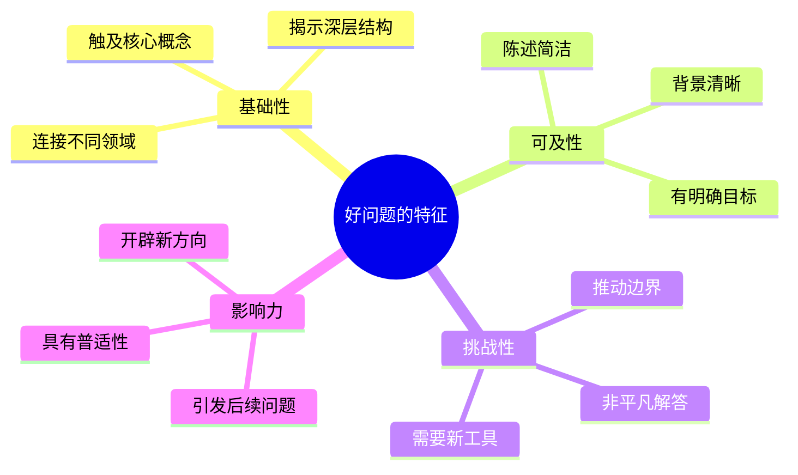
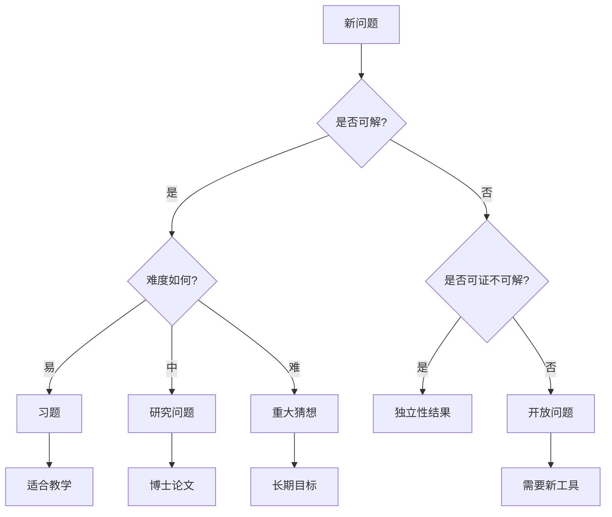

# 如何提出好问题

> 数学研究中的问题发现与构造艺术

## 概述

提出好问题是数学研究的核心能力。一个好的数学问题不仅能引导发现，还能开辟新的研究领域。本指南将系统介绍如何培养提出好问题的能力。

---

## 第一部分：好问题的特征

### 1.1 什么是好问题？



### 1.2 经典好问题示例

| 问题 | 提出者 | 影响 |
|:---:|:---:|:---:|
| 连续统假设 | Cantor | 集合论基础研究 |
| P vs NP | Cook, Levin | 计算复杂性理论 |
| 黎曼假设 | Riemann | 解析数论核心 |
| Poincaré猜想 | Poincaré | 低维拓扑革命 |
| BSD猜想 | Birch, Swinnerton-Dyer | 椭圆曲线算术 |

---

## 第二部分：问题发现的策略

### 2.1 从例子中发现模式

**策略说明：** 通过计算具体例子，发现隐藏的模式。

**示例：素数分布**

```
观察素数计数函数 π(x):
π(10) = 4
π(100) = 25
π(1000) = 168
π(10000) = 1229

模式：π(x) ≈ x/ln(x) ?
→ 素数定理
```

**练习：**
1. 计算$\sum_{k=1}^n \frac{1}{k}$与$\ln(n)$的差值
2. 观察极限行为
3. 提出关于Euler-Mascheroni常数的问题

### 2.2 从失败中提炼问题

**策略说明：** 当证明失败时，分析障碍所在。

**示例：Fermat大定理的历史**

| 年份 | 尝试 | 失败原因 | 新方向 |
|:---:|:---:|:---:|:---:|
| 1637 | Fermat声称证明 | - | 提出猜想 |
| 1847 | Kummer | 唯一因子分解失效 | 理想数理论 |
| 1983 | Faltings | Mordell猜想 | 代数几何方法 |
| 1995 | Wiles | - | 证明完成 |

### 2.3 从类比中产生灵感

**策略说明：** 在不同数学对象之间寻找类比。

**示例：数与函数的类比**

| 整数 | 多项式 | 整函数 |
|:---:|:---:|:---:|
| 素数 | 不可约多项式 | 素函数 |
| 唯一分解 | 唯一分解 | Weierstrass分解 |
| 素数定理 | 多项式计数 | Nevanlinna理论 |

**启发问题：** 多项式版本的黎曼假设是什么？

---

## 第三部分：问题构造的技术

### 3.1 推广与特殊化


**示例：从勾股定理到Fermat大定理**

- **特殊化：** $x^2 + y^2 = z^2$有无穷多整数解
- **问题：** $x^n + y^n = z^n$（$n \geq 3$）呢？
- **推广：** 椭圆曲线上的有理点

### 3.2 添加或移除条件

**技术表格：**

| 操作 | 示例 | 可能结果 |
|:---:|:---:|:---:|
| 加强条件 | 光滑函数 → 解析函数 | 更强的结论 |
| 削弱条件 | 连续 → 可测 | 更广泛的适用性 |
| 添加约束 | 紧致流形 | 有限性结论 |
| 移除约束 | 非紧致情形 | 需要新工具 |

### 3.3 维度跃迁

**一维 → 高维：**

| 一维 | 高维 | 新问题 |
|:---:|:---:|:---:|
| 微积分 | 多变量微积分 | 斯托克斯定理 |
| 代数基本定理 | 多项式映射的拓扑度 | 映射度理论 |
| 素数定理 | 素理想定理 | 代数数论 |

---

## 第四部分：问题评估框架

### 4.1 问题质量评估矩阵

| 维度 | 权重 | 评分标准 |
|:---:|:---:|:---|
| 重要性 | 25% | 对领域发展的影响 |
| 可解性 | 20% | 当前技术的可行性 |
| 原创性 | 20% | 与已知问题的区别 |
| 连通性 | 20% | 与其他领域的联系 |
| 美观性 | 15% | 陈述的优雅程度 |

### 4.2 问题分类决策树



---

## 第五部分：实践练习

### 5.1 问题生成练习

**练习1：基于已知结果**

给定：调和级数$\sum_{n=1}^\infty \frac{1}{n}$发散

生成问题：
- 移除哪些项后级数收敛？
- 稀疏化：$\sum \frac{1}{n_k}$何时收敛？
- 加权版本：$\sum \frac{a_n}{n}$的收敛条件？

**练习2：基于反例**

已知：存在处处连续处处不可微的函数

生成问题：
- 这类函数的Hausdorff维数？
- 可微点集的测度性质？
- 分数阶可微性？

### 5.2 研究日志模板

```markdown
## 日期：[YYYY-MM-DD]

### 观察
[记录计算结果、阅读发现或思考]

### 模式
[发现的模式或规律]

### 问题
[基于观察提出的问题]

### 尝试
[解决问题的方法]

### 障碍
[遇到的困难]

### 新问题
[由障碍产生的新问题]

### 参考文献
[相关文献]
```

---

## 第六部分：领域特定策略

### 6.1 代数领域

**问题来源：**

1. **分类问题**
   - 给定性质的对象有哪些？
   - 能否完全分类？

2. **结构问题**
   - 直和分解的唯一性？
   - 自同构群的结构？

3. **表示问题**
   - 如何具体实现抽象结构？
   - 表示的分类？

### 6.2 分析领域

**问题来源：**

1. **存在性问题**
   - 解是否存在？
   - 唯一性？

2. **正则性问题**
   - 解有多光滑？
   - 奇点如何分布？

3. **渐近问题**
   - 长时间行为？
   - 极限状态？

### 6.3 几何领域

**问题来源：**

1. **度量问题**
   - 哪些度量允许特定曲率？
   - 测地线的分布？

2. **拓扑问题**
   - 哪些不变量分类流形？
   - 嵌入/浸入的可能性？

3. **变分问题**
   - 极值曲面的存在性？
   - 稳定性分析？

---

## 第七部分：案例研究

### 7.1 案例：Langlands纲领的诞生

**背景：** 1967年，Robert Langlands在给Weil的信中提出一系列猜想。

**问题来源：**
1. **类比：** 数论中的L-函数 ↔ 自守形式的L-函数
2. **统一：** 连接Galois表示与自守表示
3. **桥梁：** 函子性原理

**影响：** 成为现代数学最宏大的研究纲领之一。

### 7.2 案例： mirror symmetry

**背景：** 弦理论学家发现Calabi-Yau流形的惊人对称性。

**问题转化：**
1. **物理观察：** 两种不同Calabi-Yau给出相同物理
2. **数学问题：** 辛几何（A面）与复几何（B面）的等价
3. **核心猜想：** Hodge结构的对应

---

## 第八部分：常见问题与反思

### 8.1 避免的陷阱

| 陷阱 | 表现 | 对策 |
|:---:|:---:|:---:|
| 问题过大 | 无法入手 | 分解为子问题 |
| 技术依赖 | 只关注工具 | 回归概念本质 |
| 过早证明 | 急于验证 | 充分探索反例 |
| 孤立思考 | 忽视文献 | 广泛阅读 |

### 8.2 反思清单

- [ ] 我真正理解原始问题的本质吗？
- [ ] 是否有更简单的等价表述？
- [ ] 特殊情况说明了什么？
- [ ] 与其他领域有什么联系？
- [ ] 证明的障碍在哪里？
- [ ] 如果结论不成立会怎样？

---

## 参考资源

- [数学猜想构造方法](./12-数学猜想构造方法.md)
- [反例构造艺术](./13-反例构造艺术.md)
- [证明策略决策树](./14-证明策略决策树.md)
- [数学研究方法论](../research/研究方法论.md)

---

## 练习答案框架

**练习1（调和级数变体）：**
- Erdős证明了：若$\sum \frac{1}{n_k}$收敛，则$n_k$的密度必须为0
- 深入研究：Erdős的收敛定理

**练习2（不可微函数）：**
- 布朗运动的路径几乎必然处处不可微
- 深入研究：随机分析
