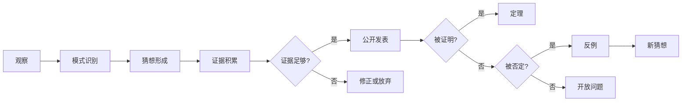
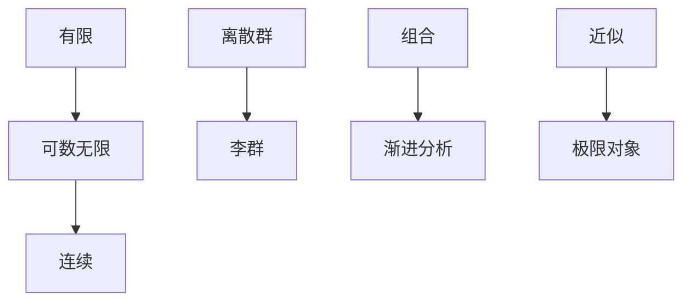
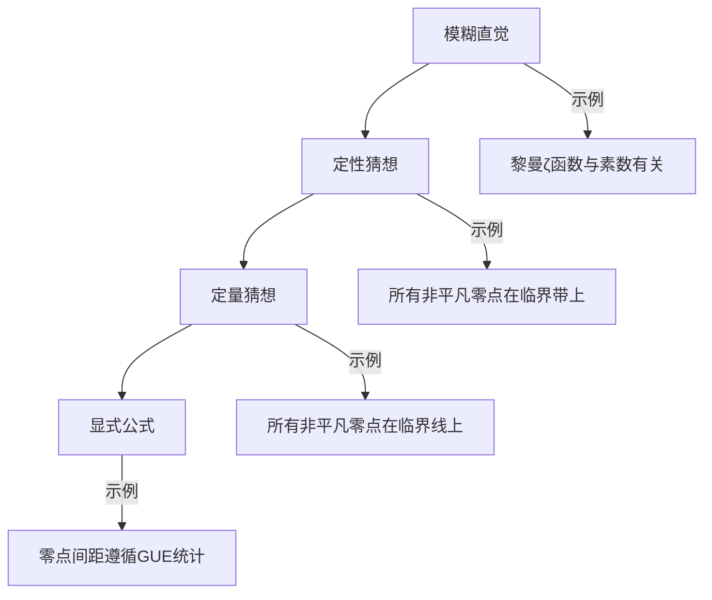

# 数学猜想构造方法

> 从观察到猜想的系统方法论

## 概述

数学猜想是连接经验观察与严格证明的桥梁。一个深刻的猜想往往能引领数十年的数学发展。本指南系统介绍如何基于观察、类比和启发式推理构造有价值的数学猜想。

---

## 第一部分：猜想的生命周期



### 经典猜想的时间线

| 猜想 | 提出 | 解决 | 历时 | 结果 |
|:---:|:---:|:---:|:---:|:---:|
| 四色定理 | 1852 | 1976 | 124年 | 证明（计算机辅助） |
| Poincaré猜想 | 1904 | 2003 | 99年 | 证明（Perelman） |
| Fermat大定理 | 1637 | 1995 | 358年 | 证明（Wiles） |
| 黎曼假设 | 1859 | - | 165年+ | 开放 |
| Collatz猜想 | 1937 | - | 87年+ | 开放 |

---

## 第二部分：猜想构造的范式

### 2.1 归纳猜想

**方法论：** 从有限观察推广到一般结论

**步骤：**
1. **计算实例**：对小的$n$值进行计算
2. **数据组织**：表格化呈现结果
3. **模式识别**：寻找数值规律
4. **公式猜测**：提出显式公式
5. **验证扩展**：测试更多案例

**示例：Legendre猜想**

```
观察：
n=1: 1²=1, 2²=4, 之间有素数2,3
n=2: 4, 9, 之间有素数5,7
n=3: 9, 16, 之间有素数11,13
n=4: 16, 25, 之间有素数17,19,23

猜想：对任意n≥1，n²与(n+1)²之间必有素数
```

**注意：** 归纳猜想的可信度随证据增加而增加，但永不成为证明。

### 2.2 类比猜想

**方法论：** 在不同数学结构间建立对应

**类比表格：**

| 整数环 ℤ | 多项式环 F[t] | 函数域 |
|:---:|:---:|:---:|
| 素数 | 不可约多项式 | 素点 |
| 唯一分解 | 唯一分解 | Weierstrass分解 |
| 中国剩余定理 | 中国剩余定理 | Mittag-Leffler |
| 狄利克雷定理 | 多项式狄利克雷 | ？？？ |

**启发式原则：**
> 若定理A在结构X中成立，且Y与X有相似性质，则定理A的类比可能在Y中成立。

**示例：Weil猜想**

| 拓扑 (Betti) | 代数几何 (Weil) |
|:---:|:---:|
| Lefschetz不动点定理 | Frobenius作用 |
| Poincaré对偶 | 函数方程 |
| Hodge理论 | 权重分解 |

### 2.3 极限过程猜想

**方法论：** 通过极限构造新对象

**常见极限过程：**



**示例：图极限理论**

- 大型图序列的极限行为
- 引出行列式方法（graphon）
- 应用：极值图论、统计物理

---

## 第三部分：构造技术详解

### 3.1 对偶化方法

**核心思想：** 每个概念有其对偶概念

**对偶表：**

| 概念 | 对偶 | 对偶化猜想 |
|:---:|:---:|:---:|
| 子空间 | 商空间 | 对偶定理 |
| 包含 | 被包含 | Galois对应 |
| 最小 | 最大 | 优化对偶 |
| 单射 | 满射 | 正合序列 |

**示例：线性规划对偶**

原始问题：$\max c^T x$，s.t. $Ax \leq b$，$x \geq 0$

对偶问题：$\min b^T y$，s.t. $A^T y \geq c$，$y \geq 0$

**猜想：** 强对偶成立（在适当条件下）

### 3.2 函子化方法

**核心思想：** 构造保持结构的映射

**函子示例：**

```
拓扑空间 X ──► 基本群 π₁(X) ──► 覆盖空间理论
     │                              │
     │ 连续映射                      │ 群同态
     ▼                              ▼
拓扑空间 Y ──► 基本群 π₁(Y) ──► 覆盖空间理论
```

**启发：** 若能将问题转化为更熟悉的范畴，可能发现新结构。

### 3.3 参数变形方法

**核心思想：** 引入参数，研究参数变化时的行为

**示例：多项式的根轨迹**

$$P_\lambda(z) = z^n + \lambda a_{n-1}z^{n-1} + \cdots + \lambda^n a_0$$

研究$\lambda \to 0$或$\lambda \to \infty$时根的行为。

**猜想生成：** 临界值对应什么代数/几何现象？

---

## 第四部分：启发式推理

### 4.1 Bayes式猜想评估

**概率模型：**

$$P(\text{猜想为真} | \text{证据}) \propto P(\text{证据} | \text{猜想}) \cdot P(\text{猜想})$$

**证据类型权重：**

| 证据类型 | 权重 | 说明 |
|:---:|:---:|:---|
| 数值验证 | +1 | $n \leq 10^6$ |
| 特殊情形证明 | +3 | 重要子类 |
| 类似结论成立 | +2 | 类比支持 |
| 部分结果 | +5 | 核心障碍清除 |
| 理论一致性 | +4 | 与已知框架相容 |
| 专家直觉 | +2 | 但需谨慎 |

### 4.2 反直觉检查清单

- [ ] 是否考虑了所有边界情况？
- [ ] 高维情形是否与低维一致？
- [ ] 离散极限是否趋于连续结果？
- [ ] 是否检查了退化情形？
- [ ] 对称性是否被充分利用？

---

## 第五部分：领域特定方法

### 5.1 数论中的猜想

**方法1：L-函数分析**

观察L-函数的零点分布：
- 临界线上的零点比例？
- 相邻零点间距统计？

**方法2：随机模型**

Cramér模型：素数像随机分布
- 预测素数间隙
- 预测孪生素数分布

**当前活跃猜想：**

| 猜想 | 支持证据 | 主要障碍 |
|:---:|:---:|:---:|
| 黎曼假设 | 10¹³+零点验证 | 缺乏结构理解 |
| 孪生素数猜想 | 有界间隙(246) | 筛法局限 |
| Goldbach猜想 | 验证到4×10¹⁸ | 圆法障碍 |

### 5.2 几何中的猜想

**方法1：维数归纳**

低维结果 → 高维猜想

**方法2：模空间研究**

研究几何对象的参数空间

**当前活跃猜想：**

| 猜想 | 内容 | 进展 |
|:---:|:---:|:---:|
| Hodge猜想 | 代数闭链表示 | 弱形式进展 |
| 标准猜想 | 代数对应 | 大部分开放 |
| 几何Langlands | 对应关系 | 函数域情形 |

### 5.3 分析中的猜想

**方法1：先验估计**

通过形式推导获得估计，再证明

**方法2：紧性论证**

近似解的极限是否是解？

**当前活跃猜想：**

| 猜想 | 内容 | 进展 |
|:---:|:---:|:---:|
| Navier-Stokes正则性 | 解的光滑性 |  Millennium Prize |
| 局部化问题 | 特征函数集中 | 部分结果 |
| Kakeya问题 | 维数估计 | 高维开放 |

---

## 第六部分：猜想的表述艺术

### 6.1 精确性层次



### 6.2 猜想模板

**模板1：存在性猜想**
> 对任意满足条件A的对象X，存在满足条件B的对象Y，使得关系C成立。

**模板2：分类猜想**
> 满足条件A的对象完全由不变量B, C, ...分类。

**模板3：渐近猜想**
> 当$n \to \infty$时，量$f(n)$渐近于$g(n)$，误差为$O(h(n))$。

**模板4：等价猜想**
> 条件A成立当且仅当条件B成立。

---

## 第七部分：实践练习

### 7.1 猜想生成工作坊

**练习1：基于数据**

给定椭圆曲线E的L-函数前10个零点，猜测：
- 零点是否在临界线上？
- 零点间距的分布？
- 与随机矩阵理论的关系？

**练习2：基于类比**

已知：紧Riemann曲面的全纯自同构群有限

猜想：高维代数簇的自同构群性质？

### 7.2 猜想评估练习

**场景：** 研究生提出了以下猜想：

> 对所有$n \times n$实矩阵$A$，若$A^3 = I$，则$A$可对角化。

**评估任务：**
1. 验证小阶矩阵（$n = 1, 2, 3$）
2. 检查已知结果（Jordan标准形）
3. 寻找反例或证明
4. 修正条件（若有必要）

**解答：** 猜想**不成立**。反例：
$$A = \begin{pmatrix} 1 & 1 & 0 \\ 0 & 1 & 1 \\ 0 & 0 & 1 \end{pmatrix}$$
满足$A^3 = I$？验证：
$$A = I + N, \quad N^3 = 0$$
$$A^3 = I + 3N + 3N^2 \neq I$$

需要满足$x^3 - 1 = 0$无重根，即特征根为$1, \omega, \omega^2$且极小多项式无重根。实际上此猜想**成立**（在$\mathbb{C}$上可对角化）。

---

## 第八部分：历史案例深度分析

### 8.1 案例：Poincaré猜想

**提出背景（1904）：**
- Poincaré研究三维流形的拓扑
- 问：同伦等价于$S^3$的流形是否同胚于$S^3$？

**猜想演化：**
- 原始形式：三维情形
- 推广形式：$n$维情形
- 微分形式：光滑情形
- 拓扑形式：连续情形

**证明历程：**
- $n \geq 5$：Smale（1961）
- $n = 4$：Freedman（1982）
- $n = 3$：Perelman（2003）

**教训：**
1. 维数对难度有本质影响
2. 不同正则性（光滑/拓扑）可能难度迥异
3. 新工具（Ricci流）至关重要

---

## 参考资源

- [如何提出好问题](./11-如何提出好问题.md)
- [反例构造艺术](./13-反例构造艺术.md)
- [证明策略决策树](./14-证明策略决策树.md)
- [数学研究方法论](../research/研究方法论.md)
