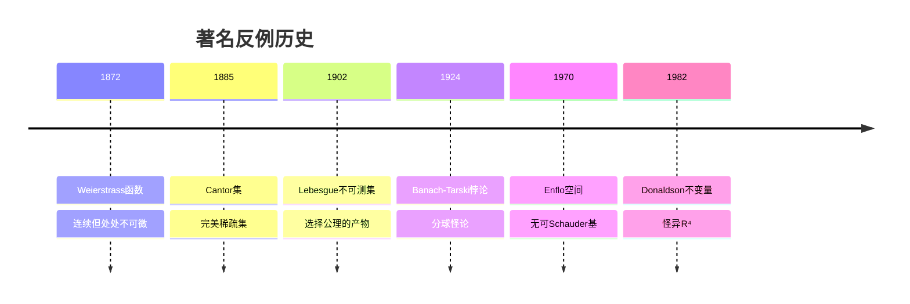
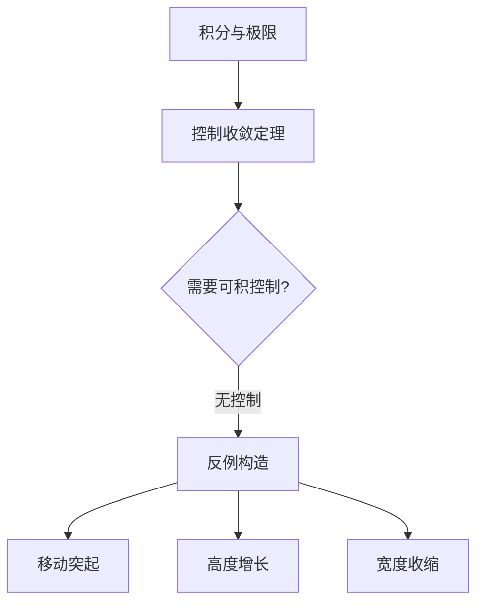
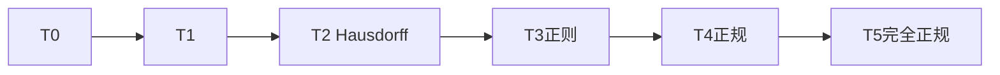

# 反例构造艺术

> 揭示数学边界的创造性技术

## 概述

反例在数学中具有双重价值：一是否定错误的猜想，二是揭示理论的精确边界。构造优美的反例既是一门技术，也是一门艺术。本指南系统介绍反例构造的方法论和技巧。

---

## 第一部分：反例的价值

### 1.1 反例 vs 证明

| 方面 | 证明定理 | 构造反例 |
|:---:|:---:|:---:|
| 目标 | 展示普遍性 | 揭示边界 |
| 方法 | 演绎推理 | 创造性构造 |
| 难度 | 系统性 | 直觉性 |
| 影响 | 扩展理论 | 修正理解 |

### 1.2 历史意义深远的反例



---

## 第二部分：反例构造策略

### 2.1 退化策略

**核心思想：** 将对象推向极端，观察性质何时失效。

**技术：**
1. **维数退化：** 高维 → 低维
2. **光滑性退化：** 光滑 → 连续 → 可测
3. **紧性退化：** 紧 → 局部紧 → 非局部紧
4. **连通性退化：** 连通 → 完全不连通

**示例：** 连续但无处可微的函数

**Weierstrass构造：**
$$W(x) = \sum_{n=0}^{\infty} a^n \cos(b^n \pi x)$$

其中$0 < a < 1$，$b$为奇整数，$ab > 1 + \frac{3}{2}\pi$。

### 2.2 组合爆炸策略

**核心思想：** 通过指数增长的复杂性破坏期望的性质。

**技术：**
1. **对角线法：** Cantor的对角线论证
2. **树构造：** 二叉树路径
3. **随机构造：** 概率方法

**示例：不可计算的实数**

- 可计算实数可数
- 实数不可数
- 因此存在（事实上绝大多数）不可计算实数

### 2.3 选择公理策略

**核心思想：** 利用选择公理构造"非构造性"反例。

**经典反例：**

| 反例 | 构造方法 | 性质 |
|:---:|:---:|:---:|
| Hamel基 | Zorn引理 | 实数作为ℚ-向量空间 |
| Vitali集 | 平移等价类 | 不可测集 |
| 良序集 | 良序定理 | 不可数集的良序 |
| Banach极限 | Hahn-Banach | 非主超滤 |

---

## 第三部分：领域特定技术

### 3.1 分析中的反例

#### 3.1.1 收敛性反例

**问题：** 逐点收敛是否保持连续性？

**反例：**
$$f_n(x) = x^n, \quad x \in [0, 1]$$

逐点收敛到：
$$f(x) = \begin{cases} 0 & x \in [0, 1) \\ 1 & x = 1 \end{cases}$$

**模式矩阵：**

| 条件 | 保持连续性？ | 反例 |
|:---:|:---:|:---:|
| 逐点收敛 | ✗ | $x^n$ |
| 一致收敛 | ✓ | - |
| 单调收敛 | ✗（需紧性） | - |
| 等度连续+逐点 | ✓ | - |

#### 3.1.2 可微性反例

**问题：** 偏导数存在是否蕴含可微？

**反例：**
$$f(x, y) = \begin{cases} \frac{xy}{x^2 + y^2} & (x, y) \neq (0, 0) \\ 0 & (x, y) = (0, 0) \end{cases}$$

在原点：偏导数存在，但函数不连续（故不可微）。

#### 3.1.3 积分与极限交换

**反例库：**



**移动突起：**
$$f_n(x) = \begin{cases} n & x \in [0, 1/n] \\ 0 & \text{否则} \end{cases}$$

$\int f_n = 1$不趋于0，但$f_n \to 0$逐点。

### 3.2 代数中的反例

#### 3.2.1 唯一分解失效

**背景：** ℤ有唯一分解，但一般环不一定。

**反例：** $\mathbb{Z}[\sqrt{-5}]$

$$6 = 2 \cdot 3 = (1 + \sqrt{-5})(1 - \sqrt{-5})$$

验证：$2, 3, 1 \pm \sqrt{-5}$都是不可约元且不相伴。

#### 3.2.2 非交换现象

**问题：** 矩阵指数是否满足$e^{A+B} = e^A e^B$？

**反例：** 
$$A = \begin{pmatrix} 0 & 1 \\ 0 & 0 \end{pmatrix}, \quad B = \begin{pmatrix} 0 & 0 \\ 1 & 0 \end{pmatrix}$$

$e^A e^B \neq e^{A+B}$（Baker-Campbell-Hausdorff公式给出修正项）。

### 3.3 拓扑中的反例

#### 3.3.1 分离公理层级



**反例：** 
- Sierpiński空间是T0但非T1
- 余有限拓扑是T1但非T2（在无限集上）
- Niemytzki平面是T4但非T5

#### 3.3.2 连通性反例

**拓扑学家的正弦曲线：**
$$S = \{(x, \sin(1/x)) : 0 < x \leq 1\} \cup \{(0, y) : -1 \leq y \leq 1\}$$

- 连通但非道路连通
- 说明连通性的微妙之处

### 3.4 组合中的反例

#### 3.4.1 Erdős的随机方法

**定理：** 存在 Ramsey 数 $R(k, k) > 2^{k/2}$ 的下界。

**证明：** 随机着色，计算单色团期望。

#### 3.4.2 设计理论反例

**Euler的36军官问题：**

- 6阶正交拉丁方不存在
- 证明了$4n+2$阶欧拉猜想不成立（除$n=1,2$外）

---

## 第四部分：构造技术详解

### 4.1 逐次逼近法

**步骤：**
1. 从简单对象开始
2. 逐步添加"病态"特征
3. 保持某些正则性
4. 极限得到反例

**示例：处处不可微函数**

$$f(x) = \sum_{n=0}^{\infty} \frac{\varphi(2^n x)}{2^n}$$

其中$\varphi$是锯齿波函数。

### 4.2 范畴论方法

**泛性质构造：**

利用范畴的泛性质构造"最一般的"反例。

**示例：** 
- 自由群：最一般的满足给定关系的群
- 张量积：最一般的双线性映射

### 4.3 对偶化反例

**技术：** 若$P$有反例，则其对偶命题$P^*$的反例往往相关。

**示例：**
- 存在满射但非分裂的模同态
- 对偶：存在单射但非分裂的模同态

---

## 第五部分：反例评估标准

### 5.1 优美性准则

| 准则 | 权重 | 说明 |
|:---:|:---:|:---|
| 简洁性 | 25% | 构造是否优雅 |
| 自然性 | 20% | 是否源于自然问题 |
| 深刻性 | 25% | 是否揭示本质 |
| 影响度 | 20% | 是否引发后续研究 |
| 普适性 | 10% | 是否可推广 |

### 5.2 反例数据库

**著名反例分类：**

```
反例库/
├── 分析/
│   ├── Weierstrass函数
│   ├── Faber多项式
│   ├── Runge现象
│   └── 无处可微连续函数
├── 代数/
│   ├── 非主理想整环
│   ├── 非交换局部化
│   └── 非唯一分解
├── 拓扑/
│   ├── 拓扑学家的正弦曲线
│   ├── 长直线
│   ├──  Warsaw圆
│   └── 伪弧
└── 逻辑/
    ├── 停机问题
    ├── Gödel语句
    └── 不可判定命题
```

---

## 第六部分：实践练习

### 6.1 反例构造挑战

**挑战1：** 构造一个函数$f: \mathbb{R} \to \mathbb{R}$，使得：
- $f$处处连续
- $f$在有理点可微
- $f$在无理点不可微

**提示：** 考虑$\sum q_n |x - r_n|$的变体。

**挑战2：** 构造拓扑空间$X$，使得：
- $X$是紧Hausdorff
- $X$完全断开
- $X$无孤立点

**答案：** Cantor集。

### 6.2 猜想检验练习

**猜想A：** 若$\sum a_n$收敛，则$\sum a_n^2$收敛。

**检验：** 尝试$a_n = (-1)^n / \sqrt{n}$。
- $\sum a_n$收敛（交错级数）
- $\sum a_n^2 = \sum 1/n$发散

**结论：** 猜想**错误**。

**猜想B：** 连续函数将连通集映为连通集。

**检验：** 这是**正确**的（连续映射保持连通性）。

---

## 第七部分：现代反例研究

### 7.1 计算复杂性中的反例

**P vs NP中的障碍：**

- 相对化：存在预言机使$P^A \neq NP^A$和$P^B = NP^B$
- 自然性：证明技术必须满足特定条件

### 7.2 几何分析中的反例

**Nash-Kuiper定理：**

$C^1$等距嵌入可以折叠，与光滑情形形成对比。

**应用：** 纸张折叠、微分几何。

---

## 参考资源

- [如何提出好问题](./11-如何提出好问题.md)
- [数学猜想构造方法](./12-数学猜想构造方法.md)
- [证明策略决策树](./14-证明策略决策树.md)
- [反例百科全书](Counterexamples in Analysis/Topology/Probability)
