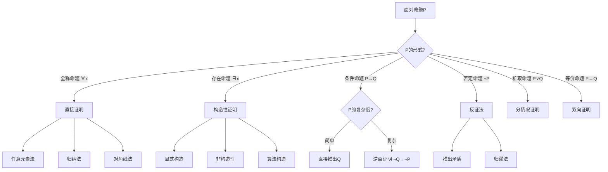
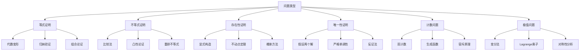
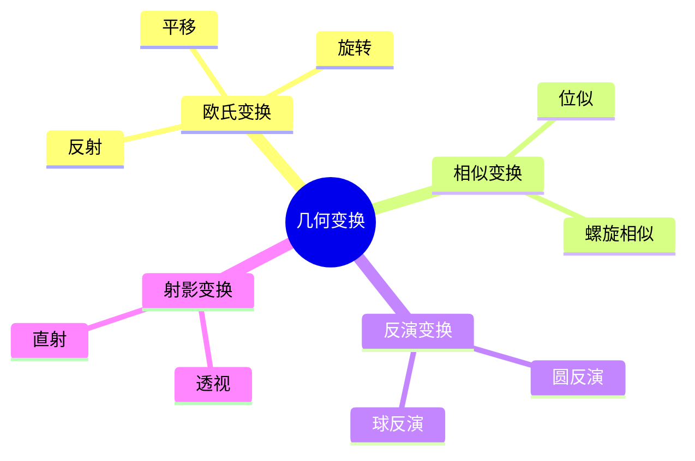
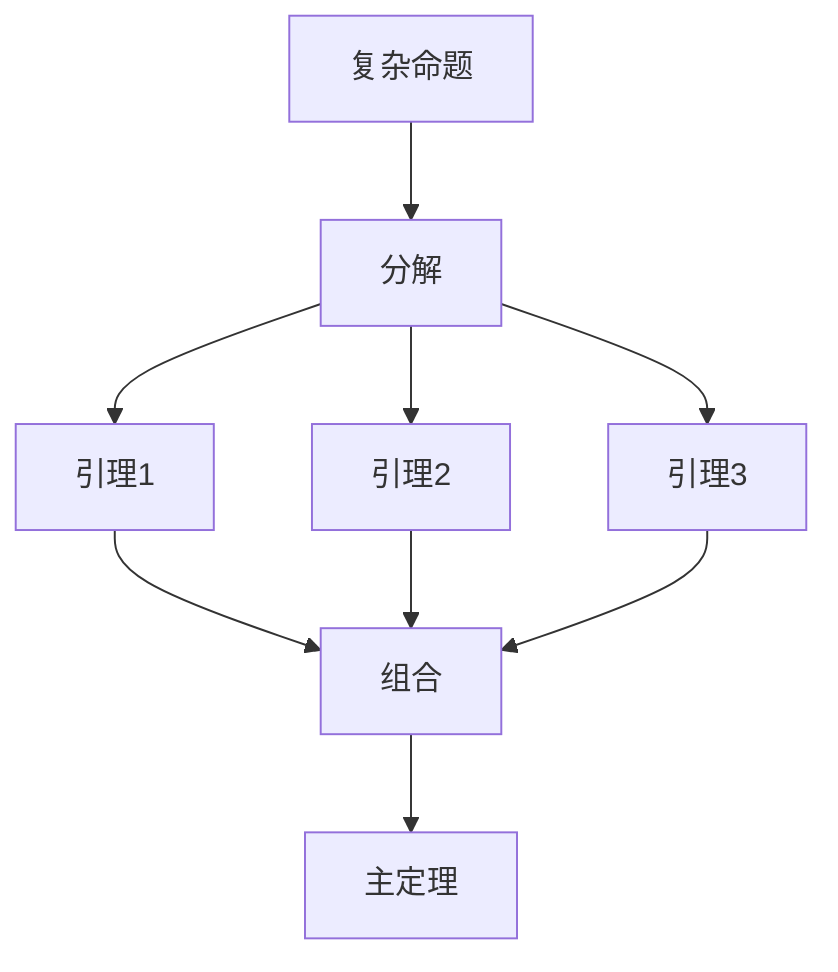
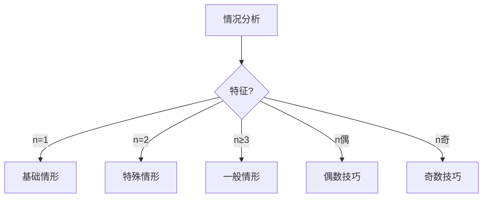
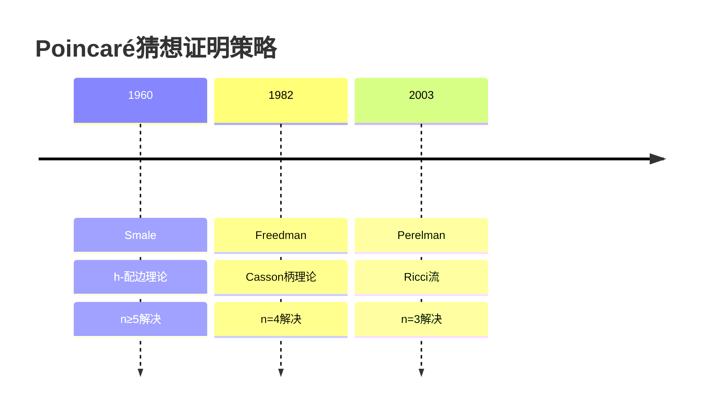

# 证明策略决策树

> 系统化证明方法的选择与应用指南

## 概述

数学证明不是机械的过程，而是需要策略选择的创造性活动。本指南提供系统化的证明策略决策框架，帮助读者在面对数学问题时选择最适合的证明方法。

---

## 第一部分：核心决策树

### 1.1 主要证明方法决策树



### 1.2 问题类型导向策略



---

## 第二部分：具体策略详解

### 2.1 直接证明法

**适用场景：** 结论明确，条件充分

**模板：**
```
目标：证明 P → Q

1. 假设 P 成立
2. [使用定义、公理、已知定理]
3. [逻辑推导]
4. 因此 Q 成立
```

**示例：** 证明√2是无理数（反证法更常用，但也可用直接法）

### 2.2 反证法

**适用场景：** 正面难以下手，否定结论提供新信息

**决策检查：**
- [ ] 结论的否定是否更易操作？
- [ ] 能否从否定推出明显矛盾？
- [ ] 是否有相关定理的逆否形式？

**模板：**
```
目标：证明 P

1. 假设 ¬P
2. [推导]
3. 得到矛盾（与已知/公理矛盾）
4. 因此 P 成立
```

### 2.3 归纳法

**适用场景：** 关于自然数的命题

**变体选择：**

| 变体 | 适用情况 | 归纳假设强度 |
|:---:|:---:|:---:|
| 简单归纳 | $P(n) \to P(n+1)$ | 仅$P(n)$ |
| 强归纳 | $P(0)\wedge\cdots\wedge P(n) \to P(n+1)$ | $P(0)$到$P(n)$ |
| 结构归纳 | 递归定义的结构 | 子结构性质 |
| 超限归纳 | 良序集 | 所有更小元素 |
| 双重归纳 | 两个参数的命题 | 适当组合 |

### 2.4 构造性证明 vs 非构造性证明

**对比：**

| 特征 | 构造性 | 非构造性 |
|:---:|:---:|:---:|
| 提供对象 | 显式给出 | 仅证明存在 |
| 计算价值 | 可计算 | 可能不可计算 |
| 方法 | 算法、公式 | 反证、概率 |
| 典型工具 | 辗转相除 | 鸽巢原理 |

**选择建议：**
- 需要算法实现 → 构造性
- 纯粹存在性 → 非构造性可能更简单
- 计算复杂性重要 → 关注构造效率

---

## 第三部分：领域特定策略

### 3.1 分析学策略

#### 3.1.1 ε-δ技术

**流程图：**
```mermaid
flowchart LR
    A[目标：f在x₀连续] --> B[给定ε>0]
    B --> C[寻找δ>0]
    C --> D[|x-x₀|<δ]
    D --> E[→|f(x)-f(x₀)|<ε]
    E --> F{成功?}
    F -->|否| G[调整δ]
    G --> C
    F -->|是| H[完成]
```

#### 3.1.2 紧性论证

**策略：**
1. 局部性质 → 有限覆盖
2. 有限子覆盖 → 整体性质

**典型应用：**
- 连续函数在紧集上有界
- 一致连续性
- 极值存在性

### 3.2 代数学策略

#### 3.2.1 同态基本定理应用

**决策流程：**
```
需要证明：商结构 ≅ 像

1. 构造同态 φ: G → H
2. 证明 φ 是满射（到目标像）
3. 确定 ker φ
4. 应用同态基本定理：G/ker φ ≅ Im φ
```

#### 3.2.2 结构定理应用

| 结构 | 分解定理 | 应用 |
|:---:|:---:|:---:|
| 有限Abel群 | 初等因子分解 | 分类 |
| 有限生成模 | 主理想整环上 | 标准形 |
| 半单代数 | Wedderburn-Artin | 表示论 |
| 紧群 | Peter-Weyl | 调和分析 |

### 3.3 几何学策略

#### 3.3.1 变换法

**可用变换：**



**选择标准：**
- 保持问题本质
- 简化图形配置
- 保持要证的性质

#### 3.3.2 坐标法 vs 综合法

| 方法 | 优势 | 劣势 | 适用 |
|:---:|:---:|:---:|:---:|
| 综合法 | 几何直观 | 技巧性强 | 竞赛、经典问题 |
| 坐标法 | 机械化 | 计算复杂 | 一般位置、算法 |
| 向量法 | 平衡 | 需选择基 | 仿射几何 |
| 复数法 | 旋转简洁 | 限于平面 | 圆、角度 |

---

## 第四部分：复杂证明的组织

### 4.1 分治策略

**分解模式：**



**分解原则：**
1. 每个引理独立有价值
2. 引理间依赖关系清晰
3. 主证明简洁，引用引理

### 4.2 案例分析

**分情况决策树：**



---

## 第五部分：启发式策略

### 5.1 工作 backwards

**技术：** 从结论倒推条件

**示例：** 证明不等式
```
目标：A ≤ B

倒推：
A ≤ B
← A - B ≤ 0
← (A - B)可分解为平方和
← ...
```

### 5.2 类比推理

**流程：**
1. 识别相似结构
2. 迁移已知技术
3. 调整适应新情境
4. 验证适用性

### 5.3 极端原理

**策略：** 考察极端情形

- 最大/最小元素
- 边界情形
- 退化情形

**应用：** 
- 存在性证明（取极值元）
- 反证法（假设存在反例，取极小的）

---

## 第六部分：验证与反思

### 6.1 证明验证清单

- [ ] 每个步骤都有充分理由
- [ ] 所有变量在使用前定义
- [ ] 隐含假设已明确
- [ ] 边界情况已检查
- [ ] 逆命题是否成立？（区分必要与充分）
- [ ] 能否简化证明？

### 6.2 证明优化

**维度：**

| 维度 | 优化目标 | 技术 |
|:---:|:---:|:---:|
| 长度 | 简洁 | 删除冗余、引用已知结果 |
| 清晰度 | 易读 | 结构分解、直观解释 |
| 一般性 | 适用范围 | 抽象化、参数化 |
| 构造性 | 可计算 | 显式算法 |

---

## 第七部分：案例研究

### 7.1 案例：素数无限性的多种证明

| 证明 | 方法 | 特点 |
|:---:|:---:|:---:|
| Euclid | 反证+构造 | 经典、简洁 |
| Euler | 解析方法 | 揭示密度 |
| Furstenberg | 拓扑 | 出人意料 |
| Erdős | 组合 | 初等但深刻 |

**策略比较：**
- Euclid：直接构造更大的素数
- Euler：利用ζ函数的欧拉乘积

### 7.2 案例：Poincaré猜想的证明路径



**教训：**
- 不同维数需要不同工具
- 新技术的开发至关重要

---

## 参考资源

- [如何提出好问题](./11-如何提出好问题.md)
- [数学猜想构造方法](./12-数学猜想构造方法.md)
- [反例构造艺术](./13-反例构造艺术.md)
- [证明技巧大全](../03-学习指南/证明技巧.md)
