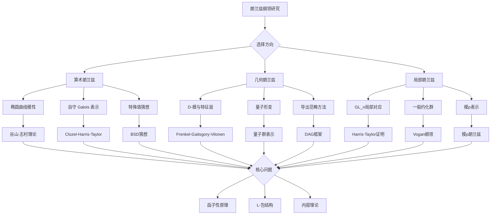

# 朗兰兹纲领探索性问题

## 概述

朗兰兹纲领（Langlands Program）是20世纪数学中最具雄心的统一性理论之一，由罗伯特·朗兰兹（Robert Langlands）在1967年提出。它将数论、代数几何、表示论和调和分析等领域深刻联系在一起，被誉为"数学的大统一理论"。

---

## 问题背景与历史

### 起源与发展

| 时间 | 里程碑 | 贡献者 |
|------|--------|--------|
| 1967 | 朗兰兹纲领雏形 | Robert Langlands |
| 1978 | 局部朗兰兹对应 | Langlands, Deligne |
| 1994 | 费马大定理证明 | Andrew Wiles |
| 1998 | 基本引理猜想 | Langlands, Shelstad |
| 2009 | 基本引理证明 | Ngô Bảo Châu |
| 2018 | 阿贝尔类域论的朗兰兹对应 | Laurent Lafforgue |

### 核心思想

朗兰兹纲领的核心是**对应原理**：
- **伽罗瓦表示**（数论侧） ↔ **自守表示**（分析侧）
- **代数簇的算术性质** ↔ **L-函数的解析性质**

---

## 习题集

### 第一组：基础对应问题

#### 问题1：局部域上的GL(2)对应

**问题陈述**：设 $F$ 是 $p$-进局部域，证明 $GL_2(F)$ 的不可约容许表示与 $F$ 的二维伽罗瓦表示之间存在双射对应。

**提示步骤**：
1. 证明超尖点表示对应于不可约伽罗瓦表示
2. 构造主系列表示的对应
3. 处理特殊表示的情形

**历史背景**：由Jacquet-Langlands在1970年建立，是局部朗兰兹对应的最基本情形。

**相关概念**：[$p$-进数](../01-基础数学/01-数论基础.md)、[代数群表示](../02-核心数学/05-代数几何.md)

#### 问题2：阿贝尔类域论的重新表述

**问题陈述**：用朗兰兹纲领的框架重新证明局部和整体类域论，并明确说明1维朗兰兹对应与经典类域论的等价性。

**核心任务**：
- 建立 $GL_1(F)$ 的特征与 $F^\times$ 的连续特征的一一对应
- 证明 Artin 互反律对应于局部和整体朗兰兹对应的兼容性
- 计算 Artin L-函数与 Hecke L-函数的恒等性

**研究价值**：这是理解朗兰兹纲领最简单但最具启发性的例子。

---

### 第二组： functoriality 问题

#### 问题3：函子性提升的构造

**问题陈述**：设 $G \subset H$ 是约化群，$\hat{G} \to \hat{H}$ 是对偶群的嵌入。对于 $G(\mathbb{A})$ 的自守表示 $\pi$，构造对应的 $H(\mathbb{A})$ 的自守表示 $\Pi$，使得它们的 $L$-函数满足：
$$L(s, \Pi, r) = L(s, \pi, r \circ \phi)$$

其中 $r: \hat{H} \to GL_n(\mathbb{C})$ 是表示，$\phi: {}^L G \to {}^L H$ 是 $L$-同态。

**已知结果**：
- $GL_2 \times GL_2 \to GL_4$（Rankin-Selberg卷积）
- $GL_2 \to GL_3$（对称平方提升）
- $GL_n \to GL_{n(n-1)/2}$（外平方提升）

**开放问题**：一般情形下的函子性提升仍是大范围开放的。

#### 问题4：内窥群的函子性

**问题陈述**：设 $G$ 是准分裂约化群，$G'$ 是其内窥群。建立从 $G'$ 到 $G$ 的函子性提升，并验证基本引理。

**关键概念**：
- 内窥群（Endoscopic group）
- 稳定轨道积分
- 几何基本引理

**进展**：Ngô Bảo Châu（吴宝珠）于2009年证明了基本引理，获2010年菲尔兹奖。

---

### 第三组：几何朗兰兹对应

#### 问题5：几何朗兰兹对应的建立

**问题陈述**：设 $X$ 是光滑射影曲线，$G$ 是约化群。建立几何朗兰兹对应：
$$\text{Bun}_G(X) \text{ 的 } D\text{-模} \longleftrightarrow {}^L G\text{-局部系统的特征层}$$

**具体要求**：
1. 定义 Hecke 函子及其作用
2. 构造 Whittaker 层作为本原对象
3. 证明 Hecke 本征性质

**历史脉络**：
- 1980s：Drinfeld对 $GL_2$ 的证明
- 2000s：Frenkel-Gaitsgory-Vilonen对 $GL_n$ 的工作
- 2020s：Gaitsgory对一般 $G$ 的突破

#### 问题6：量子几何朗兰兹

**问题陈述**：建立**量子几何朗兰兹对应**，即带水平结构（level structure）的形变：

$$\text{Bun}_G(X) \text{ 的扭曲 } D\text{-模} \leftrightarrow \text{Bun}_{{}^L G}(X) \text{ 的 } \kappa\text{-扭曲层}$$

其中 $\kappa$ 是水平和参数。

**关键步骤**：
1. 定义 Kac-Moody 代数的扭曲模
2. 构造 Wakimoto 模及其仿射 Kac-Moody 表示
3. 证明扭曲 Drinfeld-Sokolov 约化的等价性

**研究前沿**：这是当前几何朗兰兹研究最活跃的方向之一。

---

### 第四组：算术应用

#### 问题7：椭圆曲线的模性

**问题陈述**：设 $E/\mathbb{Q}$ 是椭圆曲线，证明存在权为2、水平为 $N_E$ 的模形式 $f_E$，使得：
$$L(E, s) = L(f_E, s)$$

**等价表述**：证明存在模参数化：
$$\phi: X_0(N_E) \to E$$

**历史意义**：
- 谷山-志村猜想（1955）
- Wiles证明半稳定情形（1994）
- Breuil-Conrad-Diamond-Taylor完全证明（2001）

**与朗兰兹纲领的联系**：这是2维伽罗瓦表示与 $GL_2$ 自守形式对应的特例。

#### 问题8：对称幂的解析延拓

**问题陈述**：设 $f$ 是权为 $k$、水平为 $N$ 的本原模形式。证明其对称幂 $L$-函数：
$$L(s, \text{Sym}^n f) = \prod_p \prod_{i=0}^n (1 - \alpha_p^i \beta_p^{n-i} p^{-s})^{-1}$$

可以解析延拓到整个复平面，并满足函数方程。

**已知结果**：
- $n = 1$：Hecke理论
- $n = 2$：Shimura（1975）
- $n = 3, 4$：Kim-Shahidi
- $n \geq 5$：部分结果，完整猜想仍开放

---

### 第五组：高级开放问题

#### 问题9：一般线性群的局部朗兰兹对应

**问题陈述**：对任意 $n \geq 1$ 和任意非阿基米德局部域 $F$，建立 $GL_n(F)$ 的不可约光滑表示与 $F$ 的 $n$ 维韦伊-德尔涅表示之间的双射：

$$\text{Irr}(GL_n(F)) \longleftrightarrow \{\phi: WD_F \to GL_n(\mathbb{C})\}$$

并验证该对应保持 $L$-因子和 $\varepsilon$-因子。

**进展状态**：
- Harris-Taylor (2001) 和 Henniart (2000) 分别独立证明
- 当前研究：纯化证明，寻找更自然的构造

#### 问题10：正特征整体域的朗兰兹对应

**问题陈述**：设 $F$ 是函数域（正特征整体域），证明 $GL_n(\mathbb{A}_F)$ 的本原自守表示与 $F$ 的不可约 $n$ 维伽罗瓦表示之间的双射。

**关键难点**：
- 缺乏复解析工具
- 需要使用 $\ell$-进和上同调方法
- 与几何朗兰兹的深刻联系

**突破**：Drinfeld (1980s) 对 $GL_2$，L. Lafforgue (2002，菲尔兹奖) 对 $GL_n$。

#### 问题11：数域的整体朗兰兹对应

**问题陈述**：设 $F$ 是数域，建立 $GL_n(\mathbb{A}_F)$ 的本原尖点自守表示与不可约 $n$ 维伽罗瓦表示之间的双射。

**当前状态**：
- $n = 1$：类域论（已解决）
- $n = 2$：来自谷山-志村和 Serre 猜想（已解决）
- $n \geq 3$：大范围开放

**里程碑**：
- Clozel (1990s)：自守表示的 Galois 表示构造
- Harris-Lan-Taylor-Thorne：$GL_n$ 的潜在自守性

#### 问题12：一般约化群的朗兰兹对应

**问题陈述**：对任意约化群 $G$，建立其自守表示与 ${}^L G$-值伽罗瓦表示的对应。

**挑战**：
- $L$-包（L-packet）的结构
- 内窥理论的应用
- Arthur 猜想的验证

#### 问题13：函子性原理的完整证明

**问题陈述**：证明朗兰兹函子性原理：对于任意 $L$-同态 $\phi: {}^L G \to {}^L H$，存在对应的自守形式提升映射。

**意义**：这将是朗兰兹纲领的核心定理，蕴含大量深刻的算术推论。

---

### 第六组：与其他领域的联系

#### 问题14：朗兰兹纲领与弦理论

**问题陈述**：探索几何朗兰兹对应与S-对偶（电磁对偶）的物理诠释，特别是：

1. Kapustin-Witten (2006) 的4维超杨-米尔斯理论构造
2. 拓扑扭曲与几何朗兰兹的对应
3. A-模型与B-模型的镜像对称

**研究问题**：
- 量子场论中的算子-态对应如何反映在数学中？
- 't Hooft 线与 Wilson 线的对偶如何对应于 Hecke 算子？
- 范畴化朗兰兹对应的物理起源是什么？

#### 问题15：朗兰兹纲领与同伦类型论

**问题陈述**：研究朗兰兹纲领在同伦类型论/导出代数几何框架下的表述。

**可能方向**：
1. 导出代数几何中的几何朗兰兹
2. 高阶范畴的朗兰兹对应
3. 同伦型 $L$-函数的理论

**前沿问题**：是否可以用同伦不变量的语言重新表述朗兰兹对应？

---

## Mermaid决策树：朗兰兹纲领研究路径

---

## 相关概念索引

### 核心概念
- [$L$-函数](../02-核心数学/04-数论.md)
- [自守形式](../02-核心数学/02-分析学.md)
- [伽罗瓦表示](../02-核心数学/05-代数几何.md)
- [代数群](../02-核心数学/05-代数几何.md)

### 相关技术
- [迹公式](../02-核心数学/03-几何拓扑.md)
- [代数几何](../02-核心数学/05-代数几何.md)
- [表示论](../02-核心数学/02-分析学.md)

### 延伸阅读
- [千禧年问题研究进展](../13-数学前沿/08-千禧年问题研究进展.md)
- [几何分析前沿问题](16-几何分析前沿问题.md)
- [算术几何未解难题](17-算术几何未解难题.md)

---

## 参考文献

1. R. P. Langlands, "Problems in the Theory of Automorphic Forms" (1970)
2. J. Bernstein, S. Gelbart (eds.), "An Introduction to the Langlands Program" (2003)
3. E. Frenkel, "Langlands Correspondence for Loop Groups" (2007)
4. T. Gee et al., "The Emerging $p$-adic Langlands Programme" (2010)
5. D. Gaitsgory, "Outline of the Proof of the Geometric Langlands Conjecture for GL(2)" (2020)

---

## 开放问题汇总

| 问题 | 难度 | 状态 | 重要工具 |
|------|------|------|----------|
| 函子性原理 | ★★★★★ | 开放 | 迹公式、内窥理论 |
| $GL_n$数域整体对应 | ★★★★★ | 部分开放 | Galois变形理论 |
| 一般约化群对应 | ★★★★★ | 大范围开放 | $L$-包理论 |
| 量子几何朗兰兹 | ★★★★☆ | 活跃研究 | 扭曲 $D$-模 |
| 模 $p$ 朗兰兹 | ★★★★☆ | 快速发展 | 模表示论 |

---

*本习题集最后更新：2026年4月*
*难度评级：研究级（需要博士及以上水平）*
