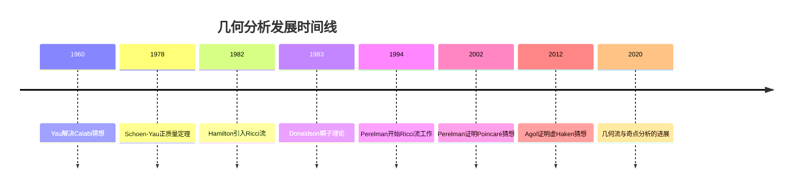
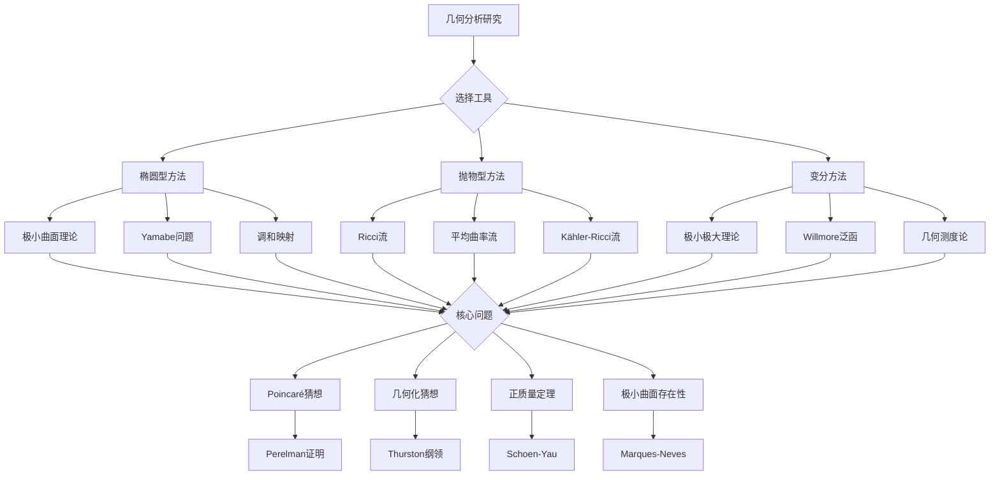

# 几何分析前沿问题

## 概述

几何分析（Geometric Analysis）是20世纪后期发展起来的数学分支，结合微分几何、偏微分方程和变分法的工具研究几何问题。从Yamabe问题到Ricci流，几何分析在解决重大数学猜想中发挥了核心作用。

---

## 问题背景与历史

### 发展里程碑

### 核心方法论

几何分析的核心工具箱：

| 工具 | 应用 | 代表人物 |
|------|------|----------|
| 极小曲面理论 | 几何变分问题 | Meeks, Ros |
| Ricci流 | 3维几何化 | Hamilton, Perelman |
| 调和映射 | 几何刚性 | Sacks-Uhlenbeck |
| Yamabe问题 | 共形几何 | Aubin, Schoen |
| 曲率流 | 凸几何 | Andrews |

---

## 习题集

### 第一组：极小曲面理论

#### 问题1：Plateau问题的多解性

**问题陈述**：设 $\Gamma$ 是 $\mathbb{R}^3$ 中的Jordan曲线，研究Plateau问题解的个数与曲线几何的关系：

$$\min\{\text{Area}(\Sigma) : \partial\Sigma = \Gamma, \Sigma \text{是圆盘型浸入}\}$$

**具体任务**：
1. 证明当 $\Gamma$ 是凸曲线时，解唯一（Radó定理）
2. 构造具有至少两个解的非凸曲线例子
3. 对于三叶结型曲线，估计解的个数下界

**历史背景**：
- 1930s：Douglas和Radó独立证明解的存在性
- 1970s：Osserman、Gulliver证明解的内部正则性
- 1980s：Pitts引入极小极大理论

**开放问题**：对于一般光滑Jordan曲线，解的个数是否有限？

#### 问题2：极小曲面的稳定性与指标

**问题陈述**：设 $\Sigma \subset \mathbb{R}^3$ 是完备极小曲面，研究其Jacobi算子：
$$L = \Delta + |A|^2$$

**核心问题**：
1. 计算Costa-Hoffman-Meeks曲面的Morse指标
2. 证明有限全曲率完备极小曲面的有限指标性
3. 研究非有限全曲率极小曲面的指标有限性

**已知结果**：
- 平面：指标 = 0
- 悬链面：指标 = 1
- Enneper曲面：指标 = 0
- Costa曲面：指标 = 5

**前沿研究**：Chodosh-Maximo (2016) 对有限拓扑完备极小曲面的指标估计。

---

### 第二组：Ricci流与几何化

#### 问题3：3维Ricci流的奇点分析

**问题陈述**：分析3维Ricci流在有限时间内的奇点形成：

$$\frac{\partial g}{\partial t} = -2\text{Ric}(g)$$

**任务清单**：
1. 证明有限时间爆破时曲率趋向无穷：$\lim_{t \to T} |\text{Rm}|(p, t) = \infty$
2. 分类I型奇点（型态A、B、C）
3. 构造II型奇点的例子
4. 证明Hamilton-Ivey曲率有界性

**关键技术**：
- Blow-up分析
- Perelman的约化体积
- 非塌缩定理

**相关概念**：[Ricci曲率](../concept/Ricci曲率.md)、[几何化猜想](../13-数学前沿/08-千禧年问题研究进展.md)

#### 问题4：Perelman的W-泛函与熵

**问题陈述**：设 $(M^n, g)$ 是闭黎曼流形，定义Perelman的W-泛函：

$$\mathcal{W}(g, f, \tau) = \int_M \left[\tau(R + |\nabla f|^2) + f - n\right] (4\pi\tau)^{-n/2} e^{-f} d\mu$$

**研究问题**：
1. 证明W-泛函在Ricci流下的单调性
2. 计算标准球面、投影空间等对称空间的 $\mu$-熵
3. 研究W-泛函与对数Sobolev不等式的关系
4. 探索W-泛函的量子力学诠释

**意义**：W-泛函是Perelman证明Poincaré猜想和几何化猜想的核心工具。

#### 问题5：4维Ricci流的奇点 surgery

**问题陈述**：研究4维Ricci流的奇点 surgery 理论：

1. 4维 Ricci 流的奇点类型分类
2. 构造 surgery 所需的球定理
3. 证明 surgery 流的长时间存在性
4. 分析 surgery 流的几何拓扑极限

**现状**：4维 Ricci 流 surgery 理论远不如3维完善，是活跃研究领域。

**关键障碍**：
- 4维奇点的复杂性
- 缺乏良好的球面定理
- 非紧性问题的困难

---

### 第三组：几何变分问题

#### 问题6：Yamabe问题的解的个数

**问题陈述**：设 $(M^n, g)$ 是紧致黎曼流形，研究Yamabe方程解的个数：

$$-\frac{4(n-1)}{n-2}\Delta u + R_g u = R u^{(n+2)/(n-2)}, \quad u > 0$$

**具体任务**：
1. 证明标准球面具有无限多解（Morse理论）
2. 对于具有正Yamabe常数的流形，证明解的唯一性（在共形类内）
3. 研究具有负Ricci曲率流形的解的个数

**历史**：
- 1960：Yamabe提出，但有错误
- 1976：Aubin证明 $n \geq 6$ 非共形平坦情形
- 1984：Schoen完全解决

#### 问题7：Willmore泛函的极小化

**问题陈述**：对于浸入曲面 $f: \Sigma \to \mathbb{R}^3$，定义Willmore泛函：

$$\mathcal{W}(f) = \int_\Sigma H^2 d\mu$$

**核心问题**：
1. 证明Willmore猜想的解决（Marques-Neves, 2012）：对于环面，$\mathcal{W} \geq 2\pi^2$
2. 研究高亏格曲面的Willmore猜想
3. 探索Willmore流的存在性和收敛性

**前沿研究**：
- Kuwert-Schätzle对Willmore流的分析
- Rivière对弱解的正则性理论
- 4维Willmore泛函的推广

---

### 第四组：正质量定理与物理应用

#### 问题8：高维正质量定理

**问题陈述**：设 $(M^n, g)$ 是渐近平坦流形，$n \geq 8$，证明正质量定理：

$$E \geq |P|$$

其中 $E$ 是ADM能量，$P$ 是ADM动量。

**证明策略**：
1. 对于旋量流形，使用Witten的旋量证明
2. 对于一般维数，使用Jang方程的层次缩减
3. 处理极小超曲面的奇点问题

**历史**：
- 1979：Schoen-Yau对 $n \leq 7$ 的证明
- 1981：Witten对旋量流形的证明
- 2017：Schoen-Yau对一般维数的证明

#### 问题9：Penrose不等式

**问题陈述**：设 $(M^3, g)$ 是渐近平坦流形，包含外陷获面，证明Penrose不等式：

$$E \geq \sqrt{\frac{A}{16\pi}}$$

其中 $A$ 是最小外陷获面的面积。

**研究进展**：
- 1997：Huisken-Ilmanen对连通外陷获面的证明（逆平均曲率流）
- 1999：Bray对一般情形的证明（共形流）
- 开放：高维Penrose不等式

**物理意义**：黑洞热力学的几何体现。

---

### 第五组：几何流的高级问题

#### 问题10：平均曲率流的奇点分析

**问题陈述**：分析平均曲率流（MCF）的奇点：

$$\frac{\partial F}{\partial t} = \vec{H}$$

**研究内容**：
1. 分类凸超曲面的奇点（球面收缩）
2. 研究圆柱型奇点的稳定性
3. 分析自闭缩解的分类
4. 探索Type II奇点的形成机制

**突破**：
- Huisken：凸超曲面收缩到点
- White：奇异集的测度估计
- Colding-Minicozzi：圆柱型奇点的稳定性

#### 问题11：Kähler-Ricci流与极小模型纲领

**问题陈述**：研究射影流形上的Kähler-Ricci流：

$$\frac{\partial \omega}{\partial t} = -\text{Ric}(\omega)$$

**核心问题**：
1. 证明流的长时间存在性（Song-Tian理论）
2. 研究有限时间爆破的几何
3. 建立与极小模型纲领的对应
4. 分析弱解的代数几何意义

**里程碑**：
- Cao：Kähler-Einstein度量存在时的收敛性
- Perelman：Fano流形的情形
- Tian-Zhang：一般射影流形

---

### 第六组：开放前沿问题

#### 问题12：极小超曲面的存在性

**问题陈述**：证明Yau关于正Ricci曲率3维流形中嵌入极小曲面的猜想：

**猜想**：每个闭3维流形包含无限多浸入极小曲面。

**进展**：
- 2017：Irie-Marques-Neves证明了一般度量下的密度
- 2018：Marques-Neves证明了无穷多嵌入极小超曲面
- 开放：对固定度量，是否存在无限多嵌入极小曲面？

#### 问题13：几何流的手术不变量

**问题陈述**：发展手术不变量理论，用于区分不同的几何流。

**问题框架**：
1. 定义手术等价关系
2. 构造手术不变量（如谱不变量）
3. 应用到3维流形的分类
4. 探索 surgery 与量子场论的联系

#### 问题14：非紧流形的几何分析

**问题陈述**：发展非紧完备流形上的几何分析理论。

**研究方向**：
1. 非紧Ricci流的长时间行为
2. 渐近几何与调和函数理论
3. 非紧极小曲面的Plateau问题
4. 无限拓扑流形的几何化

#### 问题15：几何分析与量子引力的联系

**问题陈述**：探索几何分析工具在量子引力中的应用。

**研究问题**：
1. 几何流作为重整化群流的数学描述
2. 黑洞熵的几何分析计算
3. AdS/CFT对应中的几何分析工具
4. 弦理论紧化中的Calabi-Yau几何

---

## Mermaid决策树：几何分析研究路径

---

## 已知结果与进展汇总

### 已解决重大问题

| 问题 | 解决者 | 年份 | 方法 |
|------|--------|------|------|
| Poincaré猜想 | Perelman | 2002-03 | Ricci流 |
| 几何化猜想 | Perelman等 | 2003 | Ricci流 |
| Willmore猜想 | Marques-Neves | 2012 | 极小极大理论 |
| Yau关于正质量定理的猜想 | Schoen-Yau | 1979 | 极小曲面 |

### 活跃研究前沿

| 方向 | 主要研究者 | 进展 |
|------|-----------|------|
| 4维Ricci流 surgery | Bamler, Kleiner | 发展中 |
| 极小超曲面存在性 | Marques, Neves | 重大突破 |
| 几何流与奇点 | Colding, Minicozzi | 深入发展 |
| 高维正质量定理 | Schoen, Yau | 完全解决 |

---

## 相关概念链接

- [Ricci曲率](../concept/Ricci曲率.md)
- [极小曲面](../concept/极小曲面.md)
- [几何流](../concept/几何流.md)
- [共形几何](../concept/共形几何.md)
- [PDE方法](../02-核心数学/01-代数学.md)

---

## 参考文献

1. R. Schoen, S.-T. Yau, "Lectures on Differential Geometry" (1994)
2. B. Chow et al., "The Ricci Flow: Techniques and Applications" (2007-2011)
3. G. Perelman, "The Entropy Formula for the Ricci Flow and its Geometric Applications" (2002)
4. F. Marques, A. Neves, "Min-max theory and the Willmore conjecture" (2014)
5. T. Colding, W. Minicozzi, "A Course in Minimal Surfaces" (2011)

---

*本习题集最后更新：2026年4月*
*难度评级：研究级（需要博士及以上水平）*
