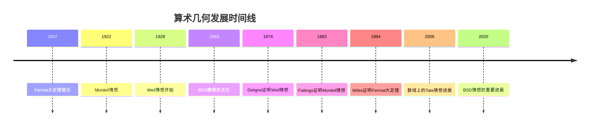
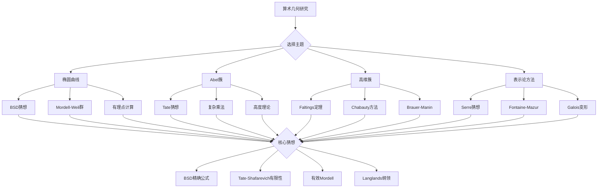

# 算术几何未解难题

## 概述

算术几何（Arithmetic Geometry）是数论与代数几何的交叉领域，研究代数簇的算术性质。从费马大定理到BSD猜想，算术几何中的问题往往具有深刻的数学美感和巨大的研究挑战。

---

## 问题背景与历史

### 发展历程

### 核心主题

| 主题 | 核心问题 | 代表成果 |
|------|----------|----------|
| 有理点 | 代数簇的有理点存在性 | Faltings定理 |
| L-函数 | 特殊值的算术意义 | BSD猜想 |
| 伽罗瓦表示 | 几何起源的表示 | Fontaine-Messing理论 |
|  motive | 上同调理论的统一 | Grothendieck纲领 |

---

## 习题集

### 第一组：BSD猜想相关问题

#### 问题1：BSD猜想的弱形式验证

**问题陈述**：设 $E/\mathbb{Q}$ 是椭圆曲线，验证BSD猜想的弱形式：

$$\text{rank } E(\mathbb{Q}) = \text{ord}_{s=1} L(E, s)$$

**具体任务**：
1. 对导子 $N < 5000$ 的所有椭圆曲线，验证弱BSD
2. 计算Rank为0、1、2的具体例子中的 $L(E, 1)$ 和 $L'(E, 1)$
3. 研究 $L(E, s)$ 在 $s=1$ 处的Taylor展开系数

**已知结果**：
- Kolyvagin (1988)：对于解析秩 $\leq 1$ 的情形，弱BSD成立
- 椭圆曲线的模性（Wiles等）保证了 $L(E, s)$ 的解析延拓
- 计算机验证：所有 $N < 5000$ 的情形

**开放问题**：解析秩 $\geq 2$ 的情形仍是大范围开放的。

#### 问题2：BSD精确公式的研究

**问题陈述**：研究BSD精确公式：

$$\lim_{s \to 1} \frac{L(E, s)}{(s-1)^r} = \frac{\Omega_E \cdot \text{Reg}_E \cdot |Ш_E| \cdot \prod_p c_p}{|E(\mathbb{Q})_{\text{tors}}|^2}$$

**研究问题**：
1. 计算特定椭圆曲线的所有BSD不变量
2. 研究Tate-Shafarevich群 $Ш$ 的结构和有限性
3. 验证 $p$-进BSD公式（Mazur-Swinnerton-Dyer）
4. 探索高维Abel簇的BSD推广

**关键难点**：
- Tate-Shafarevich群 $Ш$ 的有限性未证
- 高阶导数的计算困难
- 实period的精确计算

#### 问题3：同余数问题与BSD

**问题陈述**：研究同余数问题与BSD猜想的联系：

**同余数**：正整数 $n$ 称为同余数，如果它是某个有理边长直角三角形的面积。

**等价表述**：$n$ 是同余数当且仅当椭圆曲线 $E_n: y^2 = x^3 - n^2 x$ 的正秩。

**研究任务**：
1. 证明Tunnell定理：基于BSD的同余数判定的充分条件
2. 验证特定 $n$（如 $n = 1, 2, 3, 5, 6, 7$）的同余数性质
3. 研究同余数在算术级数中的分布

**Tunnell定理**：若 $n$ 是无平方因子的奇数，则在BSD假设下，$n$ 是同余数当且仅当：
$$\#\{(x, y, z) : 2x^2 + y^2 + 8z^2 = n\} = 2 \#\{(x, y, z) : 2x^2 + y^2 + 32z^2 = n\}$$

---

### 第二组：Mordell-Weil群相关问题

#### 问题4：椭圆曲线的高秩构造

**问题陈述**：构造具有高秩的椭圆曲线，并探索秩的界。

**具体任务**：
1. 构造 $\mathbb{Q}$ 上秩 $\geq 20$ 的椭圆曲线
2. 研究椭圆曲线族（如 $y^2 = x^3 + Dx$）的秩分布
3. 探索秩的平均分布与Goldfeld猜想
4. 研究二次扭的秩行为

**当前记录**：
- Elkies (2006)：秩 $\geq 28$ 的曲线
- 猜想：秩有上界（可能 $\leq 21$）
- Goldfeld猜想：平均秩 = 1/2

#### 问题5：Mordell-Weil群的torsion子群

**问题陈述**：刻画椭圆曲线有理点群的挠子群结构。

**Mazur定理**：$E(\mathbb{Q})_{\text{tors}}$ 只能是以下15种群之一：
$$\mathbb{Z}/n\mathbb{Z} \quad (n = 1, ..., 10, 12)$$
$$\mathbb{Z}/2\mathbb{Z} \times \mathbb{Z}/2n\mathbb{Z} \quad (n = 1, ..., 4)$$

**研究问题**：
1. 构造具有每种torsion结构的显式曲线
2. 研究二次域上的torsion结构（Kenku定理）
3. 探索数域上的uniform boundedness猜想

#### 问题6：高维Abel簇的Mordell-Weil定理

**问题陈述**：研究高维Abel簇 $A/K$ 的Mordell-Weil群 $A(K)$ 的结构。

**核心问题**：
1. 证明Mordell-Weil定理：$A(K)$ 是有限生成Abel群
2. 计算特定Abel簇的秩（如Jacobian of curves）
3. 研究descent方法与高度配对
4. 探索Selmer群的计算算法

**技术工具**：
- Galois上同调
- Theta函数理论
- Height machine

---

### 第三组：有理点与丢番图几何

#### 问题7：Faltings定理的定量版本

**问题陈述**：设 $C/\mathbb{Q}$ 是亏格 $g \geq 2$ 的曲线，给出有理点个数的有效上界。

**Faltings定理**：$C(\mathbb{Q})$ 是有限集。

**定量目标**：
1. 建立基于高度的有效上界
2. 发展Chabauty-Coleman方法的具体算法
3. 计算特定曲线（如Fermat曲线）的有理点

**已知结果**：
- Chabauty (1941)：秩 $< g$ 时，有限且可有效计算
- Coleman (1985)：$p$-进Chabauty方法
- Kim (2005)：非交换Chabauty方法

#### 问题8：Birch定理与Chatelet曲面

**问题陈述**：研究Chatelet曲面的有理点：

$$y^2 - az^2 = P(x)$$

其中 $a$ 是非平方，$P(x)$ 是可分三次多项式。

**研究内容**：
1. 证明Hasse原理的失败（反例构造）
2. 研究Brauer-Manin障碍
3. 验证Colliot-Thélène-Sansuc-Swinnerton-Dyer猜想

**历史意义**：Chatelet曲面是研究Brauer-Manin障碍的标准测试案例。

#### 问题9：有理点的Zariski稠密性

**问题陈述**：设 $X$ 是代数簇，研究 $X(\mathbb{Q})$ 在 $X$ 中的Zariski稠密性。

**核心问题**：
1. 证明Enriques曲面的有理点Zariski稠密
2. 研究K3曲面的有理点分布
3. 探索Campana的算术特殊集理论
4. 建立与Batyrev-Manin猜想的联系

---

### 第四组： motive 与周期

#### 问题10：Grothendieck周期猜想

**问题陈述**：设 $X$ 是定义在 $\overline{\mathbb{Q}}$ 上的光滑射影簇，研究其周期：

$$\text{Per}(X) = \left\{\int_\gamma \omega : \omega \in H^*_{\text{dR}}(X), \gamma \in H_*(X^{\text{an}}, \mathbb{Q})\right\}$$

**Grothendieck猜想**：周期之间的所有代数关系都来自代数闭链。

**研究问题**：
1. 验证椭圆曲线情形的周期猜想
2. 研究多重zeta值与motive的关系
3. 探索Chow motive的范畴结构
4. 建立与Tannaka范畴的联系

#### 问题11：Tate猜想与代数闭链

**问题陈述**：设 $X$ 是有限域上的光滑射影簇，研究Tate猜想：

**Tate猜想**：$\ell$-进étale上同调的代数闭链生成所有被Frobenius固定的类。

**等价表述**：$\text{rank } CH^i(X) \otimes \mathbb{Q}_\ell = \dim_{\mathbb{Q}_\ell} H^{2i}_{\text{ét}}(X, \mathbb{Q}_\ell(i))^{\text{Frob}}$

**研究任务**：
1. 验证Abel簇情形的Tate猜想（Tate, Zarhin）
2. 研究K3曲面的Tate猜想（Nygaard-Ogus, Charles）
3. 探索Tate猜想与BSD猜想的联系
4. 发展关于Tate猜想的新证据

**现状**：Tate猜想在特征 $p$ 比特征0有更多进展。

---

### 第五组：伽罗瓦表示与模性

#### 问题12：Fontaine-Mazur猜想

**问题陈述**：刻画几何起源的 $p$-进伽罗瓦表示。

**Fontaine-Mazur猜想**：$p$-进表示 $\rho: G_{\mathbb{Q}} \to GL_n(\overline{\mathbb{Q}}_p)$ 来自几何当且仅当：
1. 在所有 $p$ 以外处非分歧或潜在半稳定
2. 在 $p$ 处de Rham（或潜在半稳定）

**研究进展**：
- $n = 2$：来自谷山-志村和Serre猜想
- $n \geq 3$：Emerton, Hellmann-Schraen有重要进展
- 开放：一般情形

#### 问题13：Serre猜想与模Galois表示

**问题陈述**：研究Serre关于模Galois表示的猜想及其推广。

**原始Serre猜想**（已证）：每个奇的、不可约的模Galois表示都来自模形式。

**研究问题**：
1. 理解Khare-Wintenberger的证明策略
2. 研究Gelfand-Graev表示的模约化
3. 探索$U(3)$、$GSp(4)$等群的Serre型猜想
4. 发展模$\ell$ Langlands对应

#### 问题14：绝对Galois群的上同调

**问题陈述**：设 $G_k = \text{Gal}(\overline{k}/k)$ 是域 $k$ 的绝对Galois群，研究其连续上同调。

**核心问题**：
1. 计算 $\mathbb{Q}$ 的Milnor K-理论与Galois上同调的联系
2. 研究Bloch-Kato猜想的证明（Voevodsky定理）
3. 探索anabelian几何中的Galois表示
4. 发展与étale基本群的联系

---

### 第六组：高维簇与特殊簇

#### 问题15：Calabi-Yau簇的算术

**问题陈述**：研究Calabi-Yau簇的算术性质，特别是mirror对称的算术方面。

**研究内容**：
1. 研究Calabi-Yau超曲面的有理点计数
2. 探索zeta函数与mirror对称的关系
3. 验证特定Calabi-Yau的modularity
4. 研究算术gauge理论的联系

**具体例子**：Quintic threefold的算术性质。

---

## Mermaid决策树：算术几何研究路径

---

## 已知结果与开放问题汇总

### 已解决重大问题

| 问题 | 解决者 | 年份 |
|------|--------|------|
| Mordell猜想 | Faltings | 1983 |
| Weil猜想 | Deligne | 1974 |
| Fermat大定理 | Wiles | 1994 |
| Serre猜想 | Khare-Wintenberger | 2008 |
| 椭圆曲线的模性 | Wiles, Taylor等 | 2001 |

### 主要开放问题

| 问题 | 难度 | 状态 |
|------|------|------|
| BSD精确公式 | ★★★★★ | 大范围开放 |
| Tate-Shafarevich有限性 | ★★★★★ | 未解决 |
| Tate猜想（数域） | ★★★★★ | 大范围开放 |
| Fontaine-Mazur猜想 | ★★★★★ | 部分进展 |
| Hodge猜想 | ★★★★★ | 开放（千禧年问题） |

---

## 相关概念链接

- [椭圆曲线](../concept/椭圆曲线.md)
- [BSD猜想](../13-数学前沿/08-千禧年问题研究进展.md)
- [L-函数](../concept/L-函数.md)
- [伽罗瓦表示](../concept/伽罗瓦表示.md)
- [代数几何](../02-核心数学/05-代数几何.md)

---

## 参考文献

1. J. Silverman, "The Arithmetic of Elliptic Curves" (1986)
2. G. Faltings, "Endlichkeitssätze für abelsche Varietäten über Zahlkörpern" (1983)
3. J. Tate, "Algebraic cycles and poles of zeta functions" (1965)
4. B. Mazur, "Modular curves and the Eisenstein ideal" (1977)
5. C. Skinner, E. Urban, "The Iwasawa main conjectures for GL(2)" (2014)

---

*本习题集最后更新：2026年4月*
*难度评级：研究级（需要博士及以上水平）*
