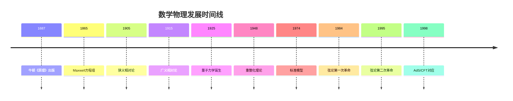
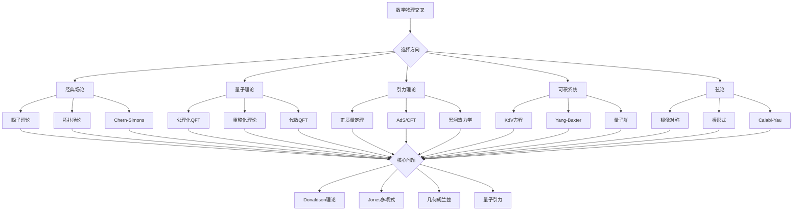

# 数学物理交叉问题

## 概述

数学与物理的交叉一直是推动两个学科发展的核心动力。从经典力学的微分方程到量子力学的泛函分析，从广义相对论的几何到弦论的代数几何，数学物理交叉问题展现了深刻的理论美感和实用价值。

---

## 问题背景与历史

### 发展脉络

### 核心交叉领域

| 领域 | 数学工具 | 物理应用 |
|------|----------|----------|
| 规范理论 | 纤维丛、代数拓扑 | 粒子物理 |
| 量子场论 | 泛函分析、表示论 | 高能物理 |
| 统计力学 | 概率论、随机过程 | 凝聚态物理 |
| 引力理论 | 黎曼几何、PDE | 宇宙学 |
| 可积系统 | 代数几何、复分析 | 场论模型 |

---

## 习题集

### 第一组：经典场论与几何

#### 问题1：Yang-Mills方程的自对偶解

**问题陈述**：在4维欧几里得空间 $\mathbb{R}^4$ 上，研究Yang-Mills方程的自对偶解（瞬子）：

$$F = \star F$$

其中 $F$ 是规范场强，$\star$ 是Hodge星算子。

**研究内容**：
1. 证明自对偶Yang-Mills方程的解自动满足Yang-Mills方程
2. 构造 $SU(2)$ BPST瞬子解：
   $$A_\mu = \frac{\rho^2 (x - a)_\nu \eta_{\mu\nu}^i \sigma^i}{(x - a)^2[(x - a)^2 + \rho^2]}$$
3. 计算瞬子数（第二陈数）：$k = \frac{1}{8\pi^2} \int \text{Tr}(F \wedge F)$
4. 研究ADHM构造与模空间结构

**历史意义**：
- Belavin-Polyakov-Schwarz-Tyupkin (1975)：首个瞬子解
- Atiyah-Drinfeld-Hitchin-Manin (1978)：瞬子的一般构造
- Donaldson (1983)：瞬子模空间与4维拓扑

#### 问题2：Chern-Simons理论与纽结不变量

**问题陈述**：研究3维Chern-Simons理论的配分函数与纽结不变量的关系。

**Chern-Simons作用量**：
$$S_{CS} = \frac{k}{4\pi} \int_M \text{Tr}\left(A \wedge dA + \frac{2}{3}A \wedge A \wedge A\right)$$

**研究任务**：
1. 证明Chern-Simons作用量在规范变换下的不变性（模整数）
2. 计算Wilson圈的期望值：$\langle W_K \rangle = \int DA \, \text{Tr}_R P\exp(i \oint_K A) \, e^{iS_{CS}}$
3. 建立与Jones多项式的联系：$\langle W_K \rangle = J_K(q)$，$q = e^{2\pi i/(k+2)}$
4. 研究Witten对Jones多项式的路径积分"证明"

**里程碑**：
- Witten (1989)：将Jones多项式与量子场论联系
- Reshetikhin-Turaev (1991)：严格数学构造

---

### 第二组：量子场论的数学基础

#### 问题3：公理化量子场论

**问题陈述**：研究Wightman公理与量子场论的数学基础。

**Wightman公理**：
1. **相对论协变性**：Poincaré群表示
2. **谱条件**：能量正定性
3. **局域性**：类空对易
4. **真空唯一性**：循环向量存在

**研究问题**：
1. 证明自由标量场满足Wightman公理
2. 构造 $P(\phi)_2$ 模型的存在性（Glimm-Jaffe）
3. 研究Yukawa模型的构造
4. 探索构造性量子场论的最新进展

**历史进展**：
- 1950s：Wightman建立公理框架
- 1960s-70s：构造性QFT的发展
- 1980s：代数QFT（Haag-Kastler）
- 2000s：因子化同调与高维代数

#### 问题4：重整化理论的数学结构

**问题陈述**：研究量子场论重整化的数学理论。

**核心问题**：
1. BPHZ重整化方案的几何解释（Connes-Kreimer）
1. 证明Feynman图的组织结构是Hopf代数
2. 研究重整化群方程的微分Galois理论
3. 探索Motivic Feynman积分理论

**Connes-Kreimer理论**：
- Feynman图构成Hopf代数 $\mathcal{H}$
- 重整化对应于Birkhoff分解
- 重整化群是一参数子群

**公式**：$\phi_+(\Gamma) = \phi(\Gamma) + \sum_{\gamma \subset \Gamma} S(\gamma) \phi(\Gamma/\gamma)$

---

### 第三组：引力与几何

#### 问题5：正质量定理的物理诠释

**问题陈述**：研究广义相对论中正质量定理的物理和数学意义。

**ADM质量**：对于渐近平坦初值 $(M^3, g, K)$：
$$E = \frac{1}{16\pi} \lim_{r \to \infty} \int_{S_r} (\partial_j g_{ij} - \partial_i g_{jj}) \nu^i d\sigma$$

**正质量定理**：$E \geq |P|$，等号当且仅当Minkowski空间。

**研究内容**：
1. 用Witten的旋量方法证明正质量定理
2. 研究Bondi质量的正性
3. 探索准局域质量的定义（Brown-York, Wang-Yau）
4. 分析黑洞热力学的几何基础

**物理意义**：
- 引力系统的总能量非负
- 真空是能量最低态
- 引力不能屏蔽（与电磁不同）

#### 问题6：Anti-de Sitter空间的共形边界

**问题陈述**：研究AdS空间的渐近结构和共形边界。

**AdS度量**（全局坐标）：
$$ds^2 = -(1 + r^2)dt^2 + \frac{dr^2}{1 + r^2} + r^2 d\Omega^2$$

**研究问题**：
1. 证明AdS空间有类时的共形边界
2. 研究AdS-CFT对应的实现
3. 分析边界上的共形场论
4. 探索全息原理的数学表述

**AdS/CFT对应**：
$$Z_{\text{grav}}[\phi_0] = \langle e^{\int \phi_0 O} \rangle_{\text{CFT}}$$

---

### 第四组：可积系统与代数结构

#### 问题7：KdV方程的代数几何解

**问题陈述**：研究KdV方程的代数几何（有限带隙）解。

**KdV方程**：
$$u_t = 6uu_x - u_{xxx}$$

**研究内容**：
1. 证明KdV是Lax方程：$\partial_t L = [P, L]$，其中 $L = -\partial_x^2 + u$
2. 用逆散射变换求解KdV
3. 构造超椭圆曲线 $y^2 = \prod_{i=1}^{2g+1}(x - \lambda_i)$ 上的解
4. 研究theta函数与有限带隙解的关系：
   $$u(x,t) = -2\partial_x^2 \ln \theta(Ux + Vt + Z)$$

**历史**：
- Gardner-Greene-Kruskal-Miura (1967)：逆散射变换
- Novikov-Dubrovin-Krichever (1970s)：代数几何方法

#### 问题8：Yang-Baxter方程与量子群

**问题陈述**：研究Yang-Baxter方程的解与量子群的关系。

**Yang-Baxter方程**：
$$R_{12}R_{13}R_{23} = R_{23}R_{13}R_{12}$$

**研究任务**：
1. 构造 $sl_2$ 的有理解：$R(u) = u + P$
2. 研究Belavin的椭圆解
3. 证明Drinfeld的量子群构造
4. 建立与纽结不变量的联系

**量子群 $U_q(sl_2)$**：
$$[H, E] = 2E, \quad [H, F] = -2F, \quad [E, F] = \frac{q^H - q^{-H}}{q - q^{-1}}$$

---

### 第五组：弦论与代数几何

#### 问题9：Calabi-Yau紧化的镜像对称

**问题陈述**：研究Calabi-Yau三fold的镜像对称。

**镜像对称猜想**：对于Calabi-Yau三fold $X$，存在镜像 $X^\vee$ 使得：
$$H^{p,q}(X) = H^{3-p,q}(X^\vee)$$

**研究内容**：
1. 构造Quintic threefold的镜像（Greene-Plesser构造）
2. 验证Hodge数的镜像对称
3. 研究Gromov-Witten理论与复结构的联系
4. 探索同调镜像对称（Kontsevich）

**关键公式**（Yukawa coupling）：
$$K_{ijk} = \int_X \Omega \wedge \partial_i \partial_j \partial_k \Omega$$

#### 问题10：弦论中的模形式

**问题陈述**：研究弦论配分函数与模形式的关系。

**研究问题**：
1. 计算环面紧化的配分函数：$Z = \text{Tr}(q^{L_0 - c/24} \bar{q}^{\bar{L}_0 - \bar{c}/24})$
2. 证明配分函数的模不变性
3. 研究Monster群与月光猜想（Borcherds）
4. 探索模形式的物理诠释

**月光猜想**：
$$J(\tau) = q^{-1} + 196884q + 21493760q^2 + \cdots$$
系数与Monster群的表示维数相关。

---

### 第六组：前沿交叉问题

#### 问题11：拓扑序与拓扑量子场论

**问题陈述**：研究凝聚态物理中拓扑序的数学描述。

**核心问题**：
1. 用TFT描述分数量子霍尔效应
2. 研究任意子激发与辫群表示
3. 构造Levin-Wen弦网模型
4. 探索拓扑量子计算的数学基础

**数学工具**：
- 融合范畴理论
- 模张量范畴
- 高阶范畴论

#### 问题12：随机矩阵与黎曼ζ函数

**问题陈述**：研究随机矩阵理论与黎曼ζ函数零点统计的惊人联系。

**Montgomery-Odlyzko定律**：
- 黎曼零点对的关联与GUE随机矩阵的特征值关联一致
- 支持Hilbert-Pólya猜想

**研究内容**：
1. 计算GUE的n点关联函数
2. 数值验证黎曼零点的统计性质
3. 研究Keating-Snaith关于ζ函数矩的猜想
4. 探索Riemann-Hilbert方法

#### 问题13：黑洞信息悖论的几何分析

**问题陈述**：从几何分析角度研究黑洞信息悖论。

**核心问题**：
1. 研究黑洞蒸发过程中的熵演化
2. 分析Page曲线与量子极值曲面
3. 探索 island formula 的数学基础
4. 研究ER=EPR猜想的数学表述

**Island公式**（Penington-Engelhardt）：
$$S(\text{rad}) = \min_{I} \text{ext} \left[\frac{\text{Area}(\partial(I \cup R))}{4G_N} + S_{\text{bulk}}(I \cup R)\right]$$

#### 问题14：几何Langlands与S-对偶

**问题陈述**：研究Kapustin-Witten对几何朗兰兹的物理解释。

**Kapustin-Witten理论**：
- 4维 $N=4$ 超杨-米尔斯理论
- S-对偶对应于Langlands对偶
- A-模型 ↔ B-模型

**研究问题**：
1. 构造拓扑扭曲的4维超杨-米尔斯
2. 证明't Hooft线与Wilson线的对偶
3. 研究范畴化朗兰兹对应的物理起源
4. 探索量子几何朗兰兹的物理诠释

#### 问题15：量子引力与随机几何

**问题陈述**：研究量子引力中随机几何的数学结构。

**研究内容**：
1. 研究Liouville量子引力（LQG）
2. 探索随机平面图与Brownian曲面
3. 分析2D量子引力的KPZ关系
4. 研究JT引力的矩阵模型描述

**KPZ公式**：
$$\Delta_0 = \frac{\Delta + \gamma^2/4 - \gamma/2}{1 - \gamma + \gamma^2/4}$$

---

## Mermaid决策树：数学物理交叉研究路径

---

## 重要定理与猜想

### 已建立的重要结果

| 结果 | 作者 | 年份 |
|------|------|------|
| Donaldson理论 | Donaldson | 1983 |
| Jones多项式与WZW | Witten | 1989 |
| BPHZ重整化的Hopf代数 | Connes-Kreimer | 1998 |
| 镜像对称（Quintic） | Givental, Lian-Liu-Yau | 1996 |
| 月光猜想证明 | Borcherds | 1992 |

### 主要开放问题

| 问题 | 领域 | 状态 |
|------|------|------|
| 质量间隙问题 | Yang-Mills | 千禧年问题 |
| 量子引力的严格构造 | 引力 | 大范围开放 |
| 4D拓扑场论的完全分类 | TFT | 活跃研究 |
| 弦论景观的数学结构 | 弦论 | 发展中 |

---

## 相关概念链接

- [规范场论](../concept/规范场论.md)
- [量子群](../concept/量子群.md)
- [Calabi-Yau](../concept/Calabi-Yau.md)
- [可积系统](../concept/可积系统.md)
- [拓扑场论](../concept/拓扑场论.md)

---

## 参考文献

1. M. Atiyah, "Geometry of Yang-Mills Fields" (1979)
2. E. Witten, "Quantum Field Theory and the Jones Polynomial" (1989)
3. A. Connes, D. Kreimer, "Renormalization in Quantum Field Theory" (1998)
4. K. Hori et al., "Mirror Symmetry" (2003)
5. J. Polchinski, "String Theory" (1998)
6. D. Gaiotto, E. Witten, "Knot Invariants from Four-Dimensional Gauge Theory" (2010)

---

*本习题集最后更新：2026年4月*
*难度评级：研究级（需要博士及以上水平）*
