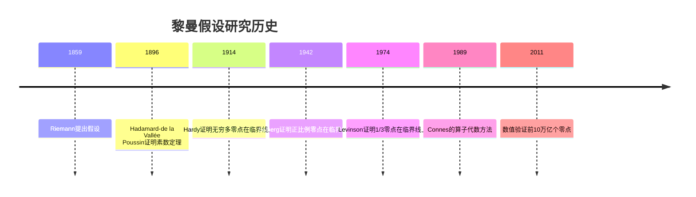
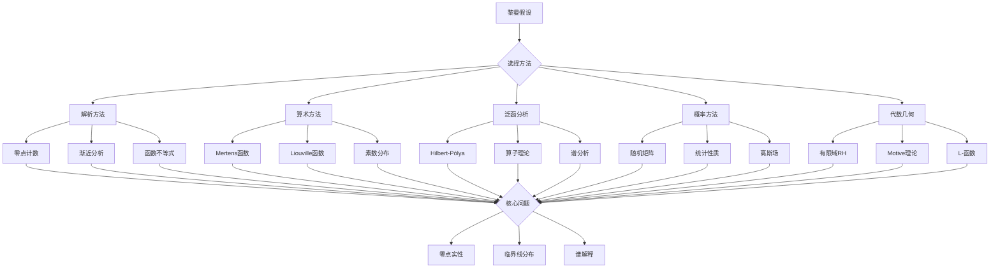

# 黎曼假设等价形式

## 概述

黎曼假设（Riemann Hypothesis, RH）是数学中最著名的未解决问题之一，被克雷数学研究所列为七大千禧年问题之一。它断言黎曼ζ函数的所有非平凡零点都位于临界线 $\text{Re}(s) = 1/2$ 上。本习题集探索RH的多种等价形式，从不同角度理解这一深刻猜想。

---

## 问题背景与历史

### 历史脉络

### 等价形式分类

| 类型 | 等价形式 | 代表人物 |
|------|----------|----------|
| 解析 | 零点分布、函数不等式 | Riemann, Weil |
| 算术 | 素数分布、算术函数 | Mertens, Liouville |
| 泛函分析 | 算子理论、谱理论 | Hilbert-Pólya, Connes |
| 概率 | 随机矩阵、统计性质 | Montgomery, Odlyzko |

---

## 习题集

### 第一组：经典等价形式

#### 问题1：Mertens函数的界

**问题陈述**：设Mertens函数为：

$$M(x) = \sum_{n \leq x} \mu(n)$$

其中 $\mu(n)$ 是Möbius函数。证明：

**等价性**：RH成立当且仅当 $M(x) = O(x^{1/2 + \varepsilon})$ 对所有 $\varepsilon > 0$ 成立。

**研究任务**：
1. 证明RH $\Rightarrow$ $M(x) = O(x^{1/2 + \varepsilon})$
2. 证明反向蕴含关系
3. 数值计算 $M(x)$ 并验证其振荡性质
4. 研究 $M(x)/\sqrt{x}$ 的极限行为

**已知结果**：
- 无条件：$M(x) = O(x \exp(-c\sqrt{\ln x}))$
- 在RH下：$M(x) = O(\sqrt{x} \ln x)$
- 猜想：$\limsup_{x \to \infty} |M(x)|/\sqrt{x} = \infty$

#### 问题2：Liouville函数的求和

**问题陈述**：设Liouville函数 $\lambda(n) = (-1)^{\Omega(n)}$，其中 $\Omega(n)$ 是素因子计数（计重数）。定义：

$$L(x) = \sum_{n \leq x} \lambda(n)$$

**等价性**：RH成立当且仅当 $L(x) = O(x^{1/2 + \varepsilon})$。

**深入问题**：
1. 证明 $L(x)$ 与 $\zeta(2s)/\zeta(s)$ 的关系
2. 研究Pólya猜想（已被否证）与RH的联系
3. 计算Turan准则：$\sum_{n \leq x} \lambda(n)/n \geq 0$ 对RH的必要性

**历史**：
- Pólya (1919)：猜想 $L(x) \leq 0$ 对所有 $x \geq 2$
- Haselgrove (1958)：证明Pólya猜想的反例存在
- Tanaka (1980)：找到第一个反例 $x = 906150257$

---

### 第二组：解析等价形式

#### 问题3：Riesz函数与分数阶积分

**问题陈述**：定义Riesz函数：

$$R(x) = \sum_{n=1}^{\infty} \frac{(-1)^{n+1} x^n}{n! \zeta(2n)}$$

**等价性**：RH成立当且仅当 $R(x) = O(x^{1/4 + \varepsilon})$。

**研究内容**：
1. 证明Riesz函数的积分表示
2. 研究其与Möbius函数的联系
3. 分析函数的渐近行为
4. 数值验证大 $x$ 时的行为

#### 问题4：Hardy函数与实零点

**问题陈述**：定义Hardy函数：

$$Z(t) = e^{i\theta(t)} \zeta(1/2 + it)$$

其中 $\theta(t)$ 是Riemann-Siegel theta函数。

**研究问题**：
1. 证明 $Z(t)$ 是实值函数
2. 证明RH等价于 $Z(t)$ 的所有零点都是实的
3. 计算Gram点并研究零点间隔
4. 分析 $Z(t)$ 的振荡性质

**Riemann-Siegel公式**：
$$Z(t) = 2\sum_{n^2 < t/2\pi} \frac{\cos(\theta(t) - t\ln n)}{\sqrt{n}} + R(t)$$

#### 问题5：ζ函数的log凸性

**问题陈述**：研究 $\zeta(s)$ 在临界线上的对数凸性。

**定理**（Weil）：设 $f(x)$ 是测试函数，定义：

$$W(f) = \int_0^{\infty} \int_0^{\infty} \frac{f(x)f(y)}{x + y} dx dy - \pi \int_0^{\infty} f(x)^2 dx$$

**等价性**：RH成立当且仅当 $W(f \star f) \geq 0$ 对所有 $f \in C_c^\infty(\mathbb{R}_+)$ 成立。

---

### 第三组：泛函分析形式

#### 问题6：Hilbert-Pólya猜想

**问题陈述**：Hilbert-Pólya猜想提出存在某个自伴算子，其特征值与ζ函数的虚部对应。

**研究框架**：
1. 设 $H$ 是Hilbert空间上的自伴算子
2. 若 $\text{spec}(H) = \{\gamma_n : \zeta(1/2 + i\gamma_n) = 0\}$
3. 则RH自动成立（自伴算子特征值实）

**探索问题**：
1. Berry-Keating猜想：$H = xp + px$
2. Connes的adele类空间方法
3. 随机矩阵与GUE的联系
4.  Montgomery对关联的统计性质

**关键公式**（Montgomery对关联）：
$$R_2(x) = 1 - \left(\frac{\sin \pi x}{\pi x}\right)^2$$

这与GUE随机矩阵的特征值对关联一致。

#### 问题7：Beurling函数空间

**问题陈述**：设 $N_\rho$ 是 $\rho > 0$ 时函数 $f(x) = \sum_{k=1}^{n} c_k \rho(\theta_k/x)$ 的空间，其中 $0 < \theta_k \leq 1$，$\rho(y) = y - \lfloor y \rfloor - 1/2$。

**Beurling定理**：RH成立当且仅当 $N_\rho$ 在 $L^2(0,1)$ 中稠密。

**研究任务**：
1. 证明该稠密性条件的必要性
2. 研究 $\rho$ 的逼近性质
3. 探索其他测试函数的选择

---

### 第四组：算术与组合形式

#### 问题8：Redheffer矩阵的行列式

**问题陈述**：定义 $n \times n$ Redheffer矩阵 $A_n$：

$$A_{ij} = \begin{cases} 1 & \text{if } j = 1 \text{或} i \mid j \\ 0 & \text{否则} \end{cases}$$

**定理**：$\det(A_n) = M(n) = \sum_{k=1}^n \mu(k)$

**等价性探索**：研究 $M(n)$ 的界与RH的关系。

#### 问题9：Farey序列与零点计数

**问题陈述**：设 $F_n$ 是阶为 $n$ 的Farey序列，即 $(0,1]$ 中分母不超过 $n$ 的所有既约分数的有序列表。

**Franel-Landau定理**：RH成立当且仅当：

$$\sum_{j=1}^{N} (\delta_j - 1/N)^2 = O(n^{-1+\varepsilon})$$

其中 $\delta_j$ 是相邻Farey分数的间距，$N = |F_n|$。

**研究内容**：
1. 计算Farey序列的分布性质
2. 研究spacing的统计行为
3. 建立与ζ函数零点的联系

---

### 第五组：概率与随机形式

#### 问题10：随机矩阵理论的联系

**问题陈述**：研究GUE随机矩阵与ζ函数零点的统计对应。

**Montgomery-Odlyzko定律**：
- ζ函数零点的最近邻间距分布与GUE矩阵特征值一致
- 支持Hilbert-Pólya猜想的某种形式

**研究问题**：
1. 计算GUE的最近邻间距分布 $p(s)$
2. 数值验证ζ函数零点的统计性质
3. 研究n点关联函数的一致性
4. 探索Keating-Snaith关于ζ函数矩的猜想

**Keating-Snaith猜想**：
$$\frac{1}{T} \int_0^T |\zeta(1/2 + it)|^{2k} dt \sim c_k (\ln T)^{k^2}$$

其中 $c_k$ 由随机矩阵理论给出。

#### 问题11：布朗运动与ζ函数

**问题陈述**：探索ζ函数与随机过程的深刻联系。

**研究内容**：
1. 研究 $\\log |\zeta(1/2 + it)|$ 的统计行为
2. 证明其与对数相关的高斯场的相似性
3. 探索Fyodorov-Hiary-Keating关于ζ函数最大值的猜想
4. 研究随机矩阵与L-函数的联系

---

### 第六组：高级等价形式

#### 问题12：Weil显式公式

**问题陈述**：设 $f$ 是测试函数，$F$ 是其Mellin变换。Weil显式公式表述为：

$$\sum_\rho F(\rho) = \int_1^\infty \left(f(x) + \frac{1}{x}f(\frac{1}{x}) - 2\frac{\hat{f}(0)}{\sqrt{x}}\right) \frac{\psi(x)}{x} dx + \cdots$$

**等价性**：RH与显式公式中某些项的正性相关。

**研究问题**：
1. 推导Weil显式公式的完整形式
2. 研究其对RH的蕴含关系
3. 探索Bombieri变体

#### 问题13：de Branges的Hilbert空间方法

**问题陈述**：de Branges提出了一个Hilbert空间框架，声称可以证明RH。

**核心构造**：
- 构造特殊的Hilbert空间 $\mathcal{H}(E)$
- 研究乘法算子的谱性质
- 探索与ζ函数零点的联系

**注意**：尽管de Branges多次声称证明，数学界普遍认为这些尝试尚未成功。但这提供了有价值的视角。

#### 问题14：Davenport-Heilbronn函数的零点

**问题陈述**：研究Davenport-Heilbronn函数：

$$f(s) = \frac{1 - i\kappa}{2} L(s, \chi_5^{(2)}) + \frac{1 + i\kappa}{2} L(s, \overline{\chi_5^{(2)}})$$

其中 $\kappa = \frac{\sqrt{10 - 2\sqrt{5}} - 2}{\sqrt{5} - 1}$。

**性质**：$f(s)$ 满足函数方程但**不**满足RH，有无穷多零点在临界线外。

**研究问题**：
1. 理解为什么这个函数破坏RH
2. 探索欧拉乘积与RH的关系
3. 研究Selberg类中RH的适用性

#### 问题15：有限域上RH的类比

**问题陈述**：研究有限域上代数曲线的黎曼假设（Weil猜想的一部分）。

**Weil定理**：对于有限域 $\mathbb{F}_q$ 上的光滑射影曲线 $C$，其zeta函数：

$$Z_C(T) = \exp\left(\sum_{n=1}^{\infty} \frac{N_n}{n} T^n\right)$$

满足RH：零点的绝对值为 $q^{-1/2}$。

**研究内容**：
1. 证明椭圆曲线情形的Weil定理
2. 研究高亏格曲线的证明
3. 探索与经典RH的类比和差异
4. 理解Deligne证明的关键思想

---

## Mermaid决策树：RH研究路径

---

## 已知结果汇总

### 零点计数结果

| 结果 | 作者 | 内容 |
|------|------|------|
| Hardy定理 | Hardy (1914) | 无穷多零点在临界线上 |
| Selberg定理 | Selberg (1942) | 正比例零点在临界线上 |
| Levinson定理 | Levinson (1974) | 至少1/3零点在临界线上 |
| Conrey定理 | Conrey (1989) | 至少40%零点在临界线上 |

### 数值验证

| 年份 | 研究者 | 验证零点数 |
|------|--------|-----------|
| 1986 | van de Lune | 1.5亿 |
| 2001 | Odlyzko | 200亿 |
| 2004 | Gourdon | 10万亿 |

---

## 相关概念链接

- [黎曼ζ函数](../concept/黎曼ζ函数.md)
- [素数定理](../concept/素数定理.md)
- [Möbius函数](../concept/Möbius函数.md)
- [随机矩阵理论](../concept/随机矩阵理论.md)
- [千禧年问题](../13-数学前沿/08-千禧年问题研究进展.md)

---

## 参考文献

1. B. Riemann, "On the Number of Primes Less Than a Given Magnitude" (1859)
2. H. Edwards, "Riemann's Zeta Function" (1974)
3. A. Ivić, "The Riemann Zeta-Function" (1985)
4. N. Katz, P. Sarnak, "Random Matrices, Frobenius Eigenvalues, and Monodromy" (1999)
5. M. du Sautoy, "The Music of the Primes" (2003)
6. A. Connes, "Trace Formula in Noncommutative Geometry" (1999)

---

*本习题集最后更新：2026年4月*
*难度评级：研究级（需要博士及以上水平）*
