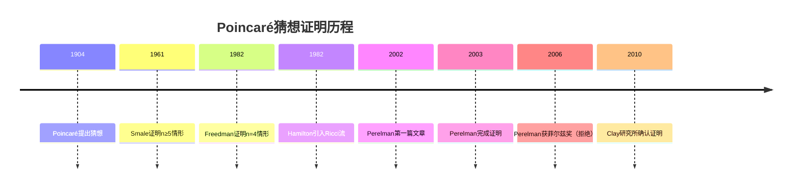
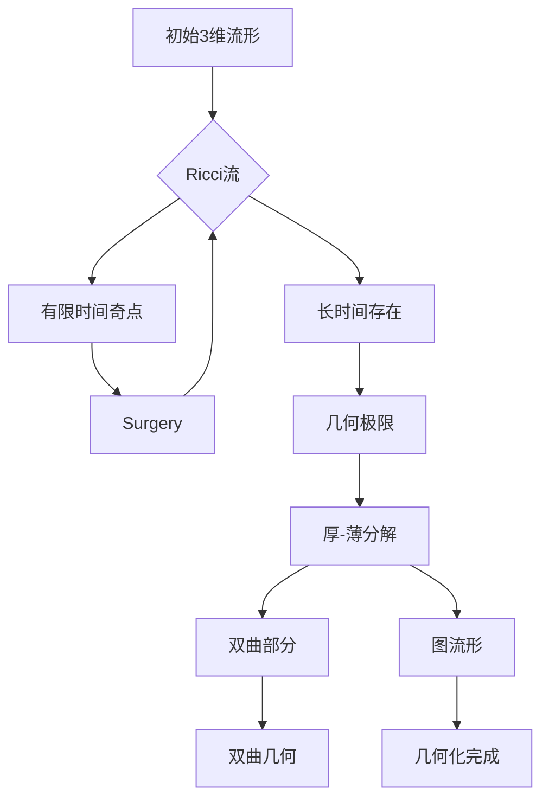
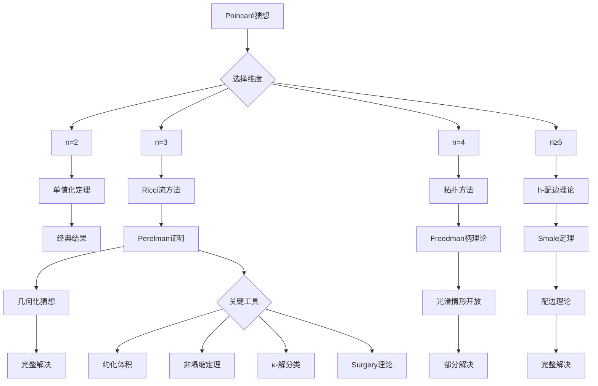

# Poincaré猜想的历史证明路径

## 概述

Poincaré猜想是20世纪数学中最著名的问题之一，由Henri Poincaré在1904年提出，最终被Grigori Perelman在2002-2003年证明。本习题集回顾这一猜想的历史发展，分析各种证明尝试，并深入理解Perelman证明的核心思想。

---

## 问题背景与历史

### 历史发展时间线

### 维度对比

| 维度 | 状态 | 证明者 | 方法 |
|------|------|--------|------|
| n=2 | 经典 | Poincaré等 | 单值化定理 |
| n=3 | 已解决 | Perelman | Ricci流 |
| n=4 | 已解决 | Freedman | Casson柄理论 |
| n≥5 | 已解决 | Smale等 | 配边理论、h-配边 |

---

## 习题集

### 第一组：Poincaré猜想基础

#### 问题1：Poincaré猜想的精确表述

**问题陈述**：给出Poincaré猜想的多种等价表述：

**版本A（基本同伦形式）**：若 $M^3$ 是闭3维流形，且 $\pi_1(M) = 0$，则 $M \cong S^3$。

**版本B（同调形式）**：若 $M^3$ 是闭3维流形，且 $H_*(M) \cong H_*(S^3)$，则 $M \cong S^3$。

**版本C（拓扑形式）**：任何与 $S^3$ 同伦等价的3维闭流形同胚于 $S^3$。

**研究任务**：
1. 证明三种表述的等价性
2. 构造满足部分条件但不满足全部的流形
3. 分析为什么维度3特殊

#### 问题2：Poincaré同调球

**问题陈述**：研究Poincaré同调球 $\Sigma(2,3,5)$，即二元二十面体空间。

**定义**：
$$\Sigma(2,3,5) = \{(z_1, z_2, z_3) \in \mathbb{C}^3 : z_1^2 + z_2^3 + z_3^5 = 0\} \cap S^5$$

**研究内容**：
1. 证明 $\pi_1(\Sigma) \neq 0$ 但 $H_*(\Sigma) \cong H_*(S^3)$
2. 计算其基本群：$\pi_1(\Sigma) \cong \text{SL}(2, 5) \cong 2\cdot A_5$
3. 理解为什么这是Poincaré猜想需要基本群平凡的原因
4. 研究Brieskorn球面的一般理论

**历史意义**：Poincaré最初提出的版本（同调球等价于 $S^3$）被此反例否定。

---

### 第二组：高维证明路径

#### 问题3：Smale的h-配边定理

**问题陈述**：研究Smale的h-配边定理及其对高维Poincaré猜想的应用。

**h-配边定理**：设 $(W; M_0, M_1)$ 是光滑h-配边（即包含 $M_0 \hookrightarrow W$ 和 $M_1 \hookrightarrow W$ 是同伦等价），且 $\dim W \geq 6$。则 $W \cong M_0 \times [0,1]$。

**推论**：维数 $n \geq 5$ 的Poincaré猜想成立。

**研究任务**：
1. 理解Morse理论在h-配边中的应用
2. 证明无不动点梯度流的存在性
3. 分析维度限制的来源
4. 探索光滑结构的唯一性

**历史**：Smale因此获得1966年菲尔兹奖。

#### 问题4：Freedman的4维拓扑

**问题陈述**：研究Freedman证明4维Poincaré猜想的拓扑技术。

**核心障碍**：4维中光滑和拓扑分类不同（Donaldson理论）。

**关键工具**：
1. Casson柄理论
2. 圆盘嵌入定理
3. 拓扑surgery理论

**研究内容**：
1. 理解Casson柄的结构
2. 分析无限构造的收敛性
3. 证明拓扑Poincaré猜想
4. 探索与光滑理论的差异

**重要现象**：
- $E_8$ 流形：拓扑平凡但光滑不平凡
- 存在怪异的 $\mathbb{R}^4$

#### 问题5：光滑4维Poincaré猜想

**问题陈述**：研究尚未解决的光滑4维Poincaré猜想：

**猜想**：若 $M^4$ 是光滑闭4维流形，且同胚于 $S^4$，则微分同胚于 $S^4$。

**研究问题**：
1. 分析已知的4维光滑障碍
2. 研究Seiberg-Witten不变量
3. 探索可能的反例构造
4. 分析与 slice-ribbon 猜想的联系

---

### 第三组：Ricci流基础

#### 问题6：Ricci流的定义与基本性质

**问题陈述**：研究Ricci流方程及其基本性质。

**Ricci流方程**：
$$\frac{\partial g_{ij}}{\partial t} = -2R_{ij}$$

**研究任务**：
1. 证明Ricci流是抛物型方程（DeTurck技巧）
2. 计算标准度量的Ricci流演化：
   - 球面：$g(t) = (1 - 2(n-1)t)g_0$，有限时间爆破
   - 欧氏空间：$g(t) = g_0$，稳态解
   - 双曲空间：$g(t) = (1 + 2(n-1)t)g_0$，膨胀
3. 推导体积演化方程：$\frac{dV}{dt} = -\int R d\mu$
4. 研究标量曲率的演化

**关键公式**：
$$\frac{\partial R}{\partial t} = \Delta R + 2|\text{Ric}|^2$$

#### 问题7：Hamilton的3维Ricci流理论

**问题陈述**：研究Hamilton开创的3维Ricci流理论。

**核心定理**：
1. **短期存在性**：任意光滑初值存在唯一短时间解
2. **导数估计**：曲率及其导数的先验估计
3. **紧性定理**：收敛子序列的存在性
4. **Harnack不等式**：曲率张量的控制

**研究内容**：
1. 证明3维中Ricci流保持正Ricci曲率
2. 研究正Ricci曲率流形的收敛性
3. 分析奇点形成的第一种情形（球面收缩）
4. 理解Hamilton-Ivey曲率有界性

**Hamilton (1982)**：正Ricci曲率的3维流形微分同胚于球面空间形式。

---

### 第四组：奇点分析与Surgery

#### 问题8：Ricci流的奇点分类

**问题陈述**：分类Ricci流的奇点类型。

**奇点形成**：当 $t \to T$ 时，$|\text{Rm}|(p,t) \to \infty$。

**分类**：

| 类型 | 曲率增长 | Blow-up极限 |
|------|----------|-------------|
| I型 | $|\text{Rm}|(T-t) \leq C$ | 梯度Ricci孤立子 |
| IIa型 | $\sup |\text{Rm}|(T-t) = \infty$ | 奇点模型 |
| IIb型 | $\sup |\text{Rm}|t = \infty$ | 非塌缩解 |
| III型 | $|\text{Rm}|t \leq C$ | 膨胀子 |

**研究任务**：
1. 证明I型奇点的渐近孤子性质
2. 构造圆柱型奇点例子
3. 研究3维的奇点模型分类
4. 理解 collapsed 与 non-collapsed 的区别

#### 问题9：Hamilton的Surgery理论

**问题陈述**：研究Hamilton发展的Ricci流surgery理论。

**手术过程**：
1. **识别奇点**：高曲率区域的局部化
2. **标准解**：切除高曲率区域
3. **粘贴**：添加标准帽子
4. **继续流**：从新初值继续演化

**研究内容**：
1. 理解颈部（neck）的结构
2. 证明标准帽子的存在性
3. 分析手术参数的选取
4. 研究手术次数的控制

**关键难点**：
- 手术可能导致精度损失
- 需要证明手术次数有限
- 几何化猜想的完整证明

---

### 第五组：Perelman的革命性贡献

#### 问题10：Perelman的约化体积

**问题陈述**：研究Perelman引入的约化体积（reduced volume）概念。

**定义**：设 $(M, g(t))$ 是Ricci流，$\tau = T - t$。约化体积：

$$\tilde{V}(\tau) = \int_M (4\pi\tau)^{-n/2} e^{-\ell(q,\tau)} d\mu_{g(\tau)}$$

其中 $\ell(q,\tau)$ 是约化距离：
$$\ell(q,\tau) = \frac{1}{2\sqrt{\tau}} \inf_\gamma \int_0^\tau \sqrt{s}(|\gamma'(s)|^2 + R(\gamma(s))) ds$$

**核心定理**：约化体积关于 $\tau$ 单调递减。

**研究任务**：
1. 证明约化体积的单调性
2. 理解约化距离的几何意义
3. 应用非塌缩定理
4. 分析古代解的分类

**意义**：这是Perelman证明Poincaré猜想的核心工具之一。

#### 问题11：非塌缩定理

**问题陈述**：研究Perelman的体积非塌缩定理。

**定理**（Perelman）：设 $(M, g(t))$ 是Ricci流，$|Rm| \leq r^{-2}$ 在 $B(p, r) \times [t-r^2, t]$ 上。若 $R \geq -r^{-2}$，则：

$$\text{Vol}(B(p, r)) \geq \kappa r^n$$

其中 $\kappa$ 依赖于维数和初值几何。

**研究内容**：
1. 证明非塌缩定理
2. 理解其对于奇点分析的重要性
3. 应用非塌缩进行blow-up分析
4. 研究κ-解的分类

#### 问题12：κ-解的分类

**问题陈述**：研究Perelman对古代解（κ-解）的分类。

**κ-解定义**：非塌缩的、非平坦的、 ancient Ricci流解。

**分类定理**（Perelman）：3维κ-解只能是：
1. 有限商的标准球面
2. 圆柱 $S^2 \times \mathbb{R}$
3. 旋转对称的Bryant孤子

**研究任务**：
1. 理解古代解的重要性
2. 分析分类证明的关键步骤
3. 研究Bryant孤子的性质
4. 应用分类于奇点分析

---

### 第六组：几何化猜想

#### 问题13：Thurston几何化猜想

**问题陈述**：研究Thurston几何化猜想及其与Poincaré猜想的关系。

**几何化猜想**：每个闭3维流形可分解为带几何结构的部分的连通和。

**八种几何**：
1. $S^3$（球面几何）
2. $\mathbb{R}^3$（欧氏几何）
3. $H^3$（双曲几何）
4. $S^2 \times \mathbb{R}$
5. $H^2 \times \mathbb{R}$
6. $\widetilde{SL}(2, \mathbb{R})$
7. Sol几何
8. Nil几何

**研究内容**：
1. 理解几何化与拓扑分解的关系
2. 分析Seifert纤维空间的几何
3. 研究双曲几何的主导地位
4. 证明几何化蕴含Poincaré猜想

#### 问题14：Perelman证明几何化概要

**问题陈述**：概述Perelman证明几何化猜想的主要步骤。

**证明概要**：

**关键定理**：
1. 手术Ricci流的长时间存在性
2. 厚部分的双曲极限
3. 薄部分的图流形结构
4. 标准空间的识别

---

### 第七组：验证与影响

#### 问题15：证明的验证与确认

**问题陈述**：研究Perelman证明的验证过程。

**验证时间线**：
1. 2002-2003：Perelman发布三篇预印本
2. 2003-2006：数学界消化和验证
3. 2006：田刚、Morgan-Tian给出详细阐述
4. 2010：Clay研究所正式确认

**研究问题**：
1. 分析证明的主要创新点
2. 理解验证过程中的挑战
3. 研究Perelman拒绝菲尔兹奖的原因
4. 探索证明对数学界的影响

---

## Mermaid决策树：Poincaré猜想证明路径

---

## 重要定理汇总

| 定理 | 作者 | 年份 | 内容 |
|------|------|------|------|
| h-配边定理 | Smale | 1961 | n≥5维Poincaré猜想 |
| 4维拓扑Poincaré | Freedman | 1982 | n=4拓扑情形 |
| Ricci流理论 | Hamilton | 1982-95 | Ricci流基础 |
| Perelman定理 | Perelman | 2002-03 | n=3完整解决 |

---

## 相关概念链接

- [Ricci流](../concept/Ricci流.md)
- [几何化猜想](../concept/几何化猜想.md)
- [3维流形](../concept/3维流形.md)
- [千禧年问题](../13-数学前沿/08-千禧年问题研究进展.md)
- [几何分析前沿问题](16-几何分析前沿问题.md)

---

## 参考文献

1. H. Poincaré, "Cinquième complément à l'analysis situs" (1904)
2. S. Smale, "Generalized Poincaré's Conjecture in Dimensions Greater Than Four" (1961)
3. M. Freedman, "The Topology of Four-Dimensional Manifolds" (1982)
4. R. Hamilton, "Three-Manifolds with Positive Ricci Curvature" (1982)
5. G. Perelman, "The Entropy Formula for the Ricci Flow" (2002)
6. G. Perelman, "Ricci Flow with Surgery on Three-Manifolds" (2003)
7. J. Morgan, G. Tian, "Ricci Flow and the Poincaré Conjecture" (2007)

---

*本习题集最后更新：2026年4月*
*难度评级：研究级（需要博士及以上水平）*
