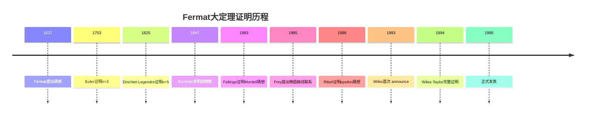
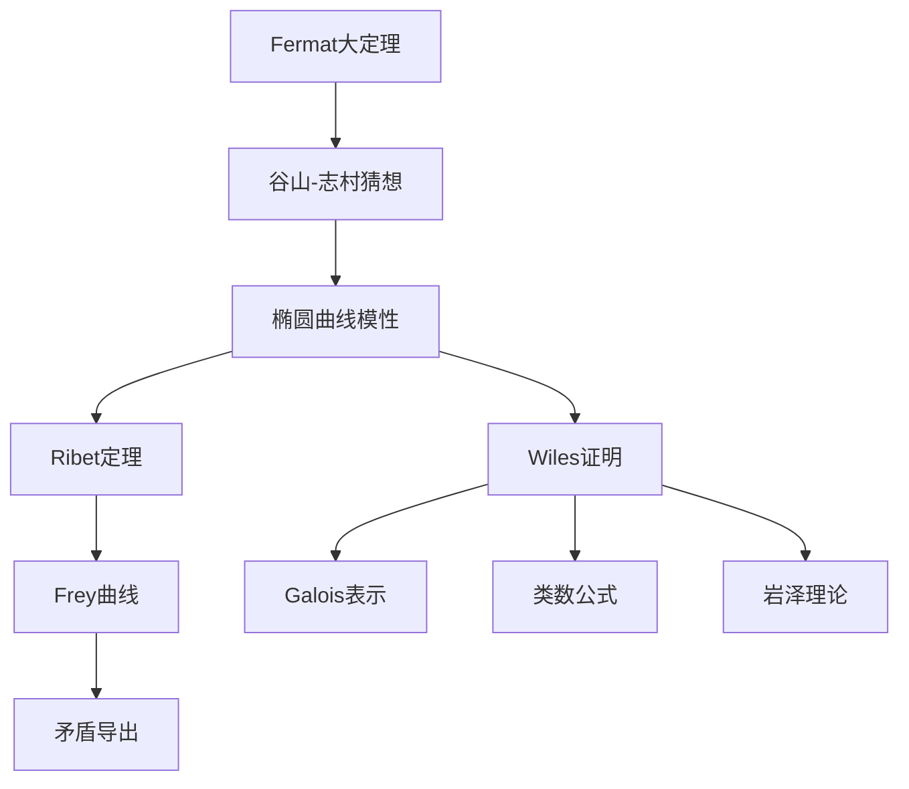
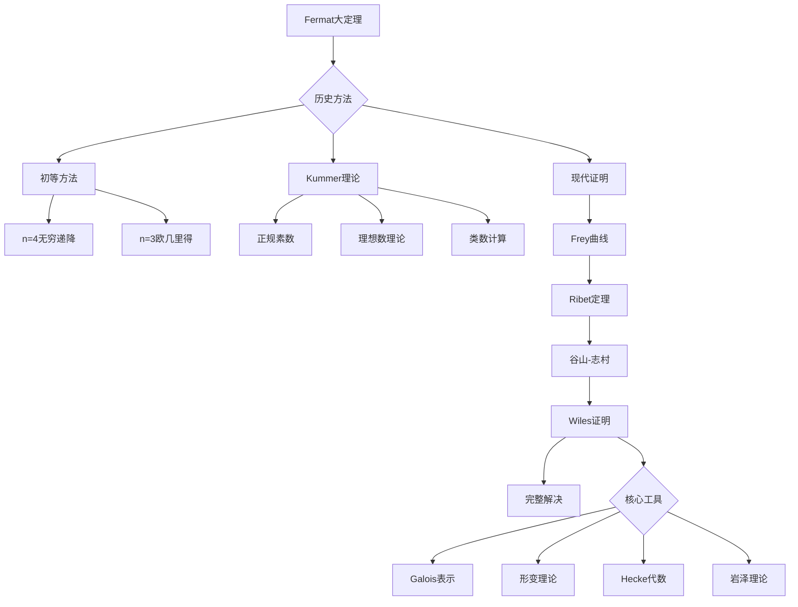

# Fermat大定理的现代化证明

## 概述

Fermat大定理（Fermat's Last Theorem, FLT）是数学史上最著名的问题之一，断言方程 $a^n + b^n = c^n$ 在 $n \geq 3$ 时没有非平凡整数解。该定理由Andrew Wiles在1994年证明，标志着20世纪数论的巅峰成就。本习题集从现代视角解析这一伟大证明。

---

## 问题背景与历史

### 历史发展

### 证明路径概览

---

## 习题集

### 第一组：经典初等方法

#### 问题1：n=4情形的无穷递降法

**问题陈述**：用Fermat的无穷递降法证明 $n=4$ 时的FLT。

**问题**：证明方程 $x^4 + y^4 = z^2$ 没有非平凡整数解。

**证明步骤**：
1. 假设存在本原解 $(x, y, z)$，$x, y, z$ 两两互素
2. 将方程重写为 $(x^2)^2 + (y^2)^2 = z^2$
3. 应用勾股数参数化：$x^2 = m^2 - n^2$，$y^2 = 2mn$，$z = m^2 + n^2$
4. 从 $x^2 = m^2 - n^2$ 得到更小的解
5. 导出矛盾

**研究任务**：
1. 详细写出无穷递降的构造
2. 证明每一步的合法性
3. 分析为什么方法对一般 $n$ 失效

#### 问题2：n=3情形的Euler证明

**问题陈述**：研究Euler对 $n=3$ 的证明。

**核心工具**：环 $\mathbb{Z}[\omega]$，其中 $\omega = e^{2\pi i/3}$。

**研究内容**：
1. 证明 $\mathbb{Z}[\omega]$ 是欧几里得整环
2. 分析单位群的结构
3. 研究唯一分解性质
4. 理解Euler证明中的缺陷（隐性假设）

**关键性质**：
- $\mathbb{Z}[\omega]$ 的范数：$N(a + b\omega) = a^2 - ab + b^2$
- 单位：$\pm 1, \pm \omega, \pm \omega^2$
- 素数分类：分歧、分裂、惰性

---

### 第二组：Kummer的理想数理论

#### 问题3：分圆域中的素数分解

**问题陈述**：研究分圆域 $\mathbb{Q}(\zeta_p)$ 中的素数分解。

**设**：$\zeta_p = e^{2\pi i/p}$，$K = \mathbb{Q}(\zeta_p)$。

**研究任务**：
1. 证明 $[K:\mathbb{Q}] = p-1$
2. 计算判别式
3. 研究小素数在 $K$ 中的分解
4. 分析 $p$ 的分歧行为

**关键定理**：$p$ 在 $\mathbb{Q}(\zeta_p)$ 中完全分歧：$(p) = (1-\zeta_p)^{p-1}$。

#### 问题4：Kummer的正规素数准则

**问题陈述**：研究Kummer关于正规素数（regular prime）的定理。

**定义**：奇素数 $p$ 称为**正规素数**，如果 $p$ 不整除 $\mathbb{Q}(\zeta_p)$ 的类数。

**Kummer定理**：若 $p$ 是正规素数，则FLT对指数 $p$ 成立。

**研究内容**：
1. 定义Bernoulli数：$\frac{t}{e^t-1} = \sum_{n=0}^{\infty} B_n \frac{t^n}{n!}$
2. 证明Kummer准则：$p$ 正规当且仅当 $p$ 不整除任何Bernoulli数 $B_2, B_4, ..., B_{p-3}$ 的分子
3. 验证 $p = 3, 5, 7, 11$ 是正规的
4. 证明 $p = 37$ 是非正规的

**已知结果**：小于100的正规素数有：3, 5, 7, 11, 13, 17, 19, 23, 29, 31, 41, 43, 47, 53, 59, 61, 67, 71, 73, 79, 83, 89, 97。

#### 问题5：理想类群与FLT

**问题陈述**：分析理想类群在Kummer证明中的作用。

**研究任务**：
1. 定义分圆域的理想类群 $Cl_K$
2. 证明Fermat方程可写为：$(x + y)(x + \zeta y)\cdots(x + \zeta^{p-1}y) = (z)^p$
3. 分析因子在理想层面的关系
4. 研究正规素数假设如何确保主理想性质

---

### 第三组：椭圆曲线基础

#### 问题6：Frey曲线的构造

**问题陈述**：设 $(a, b, c)$ 是FLT的假设解：$a^p + b^p = c^p$，构造对应的Frey椭圆曲线。

**Frey曲线**：
$$E_{a,b,c}: y^2 = x(x - a^p)(x + b^p)$$

**研究内容**：
1. 计算Frey曲线的判别式：$\Delta = 16(abc)^{2p}$
2. 计算j-不变量
3. 分析曲线的奇性
4. 证明曲线是半稳定的

**关键性质**：Frey曲线的导子具有特殊形式，与模形式有深刻联系。

#### 问题7：椭圆曲线的约化类型

**问题陈述**：研究椭圆曲线的局部性质。

**定义**：设 $E/\mathbb{Q}$ 是椭圆曲线，研究其在素数 $p$ 处的约化类型：

| 类型 | 定义 | 判别条件 |
|------|------|----------|
| 好约化 | 约化曲线是非奇异的 | $p \nmid \Delta$ |
| 乘法约化 | 节点奇点 | $p \mid \Delta$, $p \nmid c_4$ |
| 加法约化 | 尖点奇点 | $p \mid \Delta$, $p \mid c_4$ |

**研究任务**：
1. 分类Frey曲线在各素数处的约化类型
2. 分析半稳定曲线的定义
3. 研究Tate曲线的局部理论
4. 理解局部表示的性质

---

### 第四组：谷山-志村猜想

#### 问题8：模形式与L-函数

**问题陈述**：研究模形式及其L-函数的基本理论。

**模形式**：设 $f$ 是权为 $k$、水平为 $N$ 的模形式，满足：
$$f\left(\frac{az+b}{cz+d}\right) = (cz+d)^k f(z), \quad \forall \begin{pmatrix} a & b \\ c & d \end{pmatrix} \in \Gamma_0(N)$$

**研究内容**：
1. 定义Hecke算子 $T_n$
2. 研究本原模形式的性质
3. 定义L-函数：$L(f, s) = \sum_{n=1}^{\infty} \frac{a_n}{n^s}$
4. 证明函数方程

**谷山-志村猜想**：$E/\mathbb{Q}$ 是模性的，即存在模形式 $f$ 使得 $L(E, s) = L(f, s)$。

#### 问题9：模性与Galois表示

**问题陈述**：研究椭圆曲线的模性与Galois表示的联系。

**设**：$E/\mathbb{Q}$ 是椭圆曲线，$\rho_{E,p}: G_{\mathbb{Q}} \to GL_2(\mathbb{Z}_p)$ 是 $p$-进Galois表示。

**研究问题**：
1. 定义Tate模 $T_p(E)$
2. 分析Galois表示的性质
3. 陈述Serre猜想（已证）
4. 理解模性提升定理

**Ribet定理**（水平约化）：若 $E$ 是模性的，则Frey曲线（若存在）的导子将极其特殊。

---

### 第五组：Wiles证明的核心

#### 问题10：通用形变环

**问题陈述**：研究Mazur的通用形变理论。

**设定**：设 $\bar{\rho}: G_{\mathbb{Q}} \to GL_2(\mathbb{F}_p)$ 是模表示。

**研究内容**：
1. 定义形变函子
2. 证明通用形变环的存在性
3. 研究局部形变条件
4. 分析形变环的维数

**关键公式**：通用形变环 $R$ 满足：
$$\text{Hom}(R, A) \cong \{\text{形变 } \rho: G_{\mathbb{Q}} \to GL_2(A) \text{ 满足条件}\}$$

#### 问题11：Hecke代数与模性提升

**问题陈述**：研究Wiles的"R=T"定理。

**核心等式**：$R_\Sigma = \mathbb{T}_\Sigma$

其中：
- $R_\Sigma$：具有特定局部条件的通用形变环
- $\mathbb{T}_\Sigma$：Hecke代数

**研究任务**：
1. 定义合适的Hecke代数
2. 构造从 $R_\Sigma$ 到 $\mathbb{T}_\Sigma$ 的映射
3. 证明这个映射是同构
4. 理解补丁方法（patching argument）

**技术工具**：
- 伽罗瓦上同调
- Poitou-Tate对偶
- 岩泽理论
- 类数公式

#### 问题12：Wiles的数值标准

**问题陈述**：研究Wiles证明中关键的数值不等式。

**设定**：设 $\eta$ 是同余理想，$\#\mathcal{O}/\eta$ 是特定不变量。

**Wiles不等式**：证明：
$$\#\mathcal{O}/\eta \leq \#\mathfrak{p}_R/\mathfrak{p}_R^2$$

**研究内容**：
1. 理解数值标准的意义
2. 分析Selmer群的计算
3. 研究对偶Selmer群
4. 应用Poitou-Tate精确序列

---

### 第六组：证明完成与现代发展

#### 问题13：Ribet定理的详细分析

**问题陈述**：深入理解Ribet的epsilon猜想。

**定理陈述**：若谷山-志村猜想成立，则FLT成立。

**证明概要**：
1. 假设存在FLT的解 $(a, b, c)$
2. 构造Frey曲线 $E$
3. 证明 $E$ 是半稳定的
4. 应用谷山-志村得到对应的模形式
5. 使用Serre的优化导子猜想（Ribet定理）导出矛盾

**研究任务**：
1. 详细分析矛盾的产生
2. 理解水平约化的机制
3. 研究局部表示的可除性

#### 问题14：Taylor-Wiles方法的发展

**问题陈述**：研究Wiles证明的后续发展。

**发展脉络**：
1. Taylor-Wiles系统（Diamond改进）
2. Breuil-Conrad-Diamond-Taylor对一般水平的情形
3. Calegari-Geraghty对高维的推广
4. 潜在的模性（Potential Automorphy）

**研究内容**：
1. 理解Taylor-Wiles系统的构造
2. 分析补丁方法的改进
3. 研究一般谷山-志村猜想的证明

#### 问题15：FLT的现代视角

**问题陈述**：从现代数学视角重新审视FLT。

**现代框架**：
1. Langlands纲领的统一视角
2. 自守Galois表示的理论
3. p-进Hodge理论的应用
4. 完美胚空间（Perfectoid Spaces）方法

**研究问题**：
1. 探索FLT与BSD猜想的联系
2. 研究Fermat曲线的高维类比
3. 分析Wiles证明中的深层数学结构

---

## Mermaid决策树：FLT证明路径

---

## 重要定理汇总

| 定理 | 作者 | 年份 | 内容 |
|------|------|------|------|
| FLT n=3 | Euler | 1753 | 使用 $\mathbb{Z}[\omega]$ |
| Kummer定理 | Kummer | 1847 | 正规素数情形 |
| Mordell猜想 | Faltings | 1983 | Fermat曲线有穷点 |
| Ribet定理 | Ribet | 1986 | epsilon猜想 |
| 谷山-志村 | Wiles-Taylor | 1995 | 椭圆曲线模性 |

---

## 相关概念链接

- [椭圆曲线](../concept/椭圆曲线.md)
- [模形式](../concept/模形式.md)
- [谷山-志村猜想](../concept/谷山-志村猜想.md)
- [Galois表示](../concept/Galois表示.md)
- [朗兰兹纲领](15-朗兰兹纲领探索性问题.md)

---

## 参考文献

1. A. Wiles, "Modular Elliptic Curves and Fermat's Last Theorem" (1995)
2. R. Taylor, A. Wiles, "Ring-Theoretic Properties of Certain Hecke Algebras" (1995)
3. K. Ribet, "On Modular Representations of Gal(Q/Q) Arising from Modular Forms" (1990)
4. G. Frey, "Links Between Stable Elliptic Curves and Certain Diophantine Equations" (1986)
5. H. Darmon, F. Diamond, R. Taylor, "Fermat's Last Theorem" (1997)
6. S. Singh, "Fermat's Enigma" (1997)

---

*本习题集最后更新：2026年4月*
*难度评级：研究级（需要博士及以上水平）*
