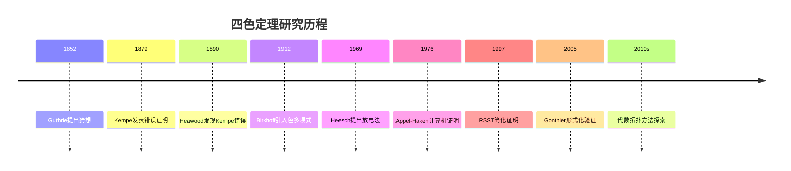
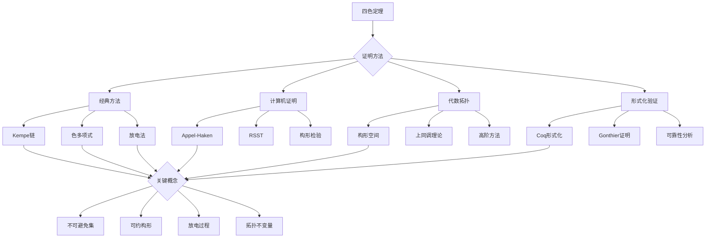

# 四色定理的代数拓扑证明

## 概述

四色定理（Four Color Theorem）是图论中最著名的问题之一，断言任何平面地图都可以用四种颜色着色，使得相邻区域颜色不同。该定理于1976年由Appel和Haken借助计算机首次证明，1997年由Robertson、Sanders、Seymour和Thomas给出更简洁的计算机证明。本习题集探索四色定理的代数拓扑视角。

---

## 问题背景与历史

### 历史发展

### 等价形式

| 形式 | 陈述 | 关键概念 |
|------|------|----------|
| 地图形式 | 平面地图4-可着色 | 对偶图 |
| 图论形式 | 平面图色数 $\leq 4$ | 顶点着色 |
| 拓扑形式 | 球面色数 $\leq 4$ | 曲面拓扑 |
| 代数形式 | 色多项式的根性质 | 色多项式 |

---

## 习题集

### 第一组：基础图论

#### 问题1：四色问题的图论表述

**问题陈述**：将四色地图问题转化为图论问题。

**对偶图构造**：
- 每个地图区域对应图的一个顶点
- 相邻区域对应的顶点间有边相连

**等价定理**：四色定理等价于：每个平面图的色数 $\chi(G) \leq 4$。

**研究任务**：
1. 证明对偶图的构造是平面图
2. 将地图着色转化为顶点着色
3. 分析面着色的特殊情况
4. 研究多面体图的性质

#### 问题2：五色定理的证明

**问题陈述**：用归纳法证明五色定理。

**五色定理**：每个平面图是5-可着色的。

**证明步骤**：
1. 证明每个平面图有度数 $\leq 5$ 的顶点
2. 对顶点数归纳
3. 移除低度顶点，归纳着色
4. 扩展回被移除顶点

**研究内容**：
1. 详细写出归纳证明
2. 分析为什么五色证明不能推广到四色
3. 研究Kempe链方法的尝试
4. 理解Kempe证明中的缺陷

---

### 第二组：色多项式理论

#### 问题3：Birkhoff色多项式

**问题陈述**：研究色多项式的定义和性质。

**定义**：图 $G$ 的色多项式 $P_G(k)$ 是用 $k$ 种颜色正常着色 $G$ 的方法数。

**递推公式**：
$$P_G(k) = P_{G-e}(k) - P_{G/e}(k)$$

其中 $G-e$ 是删边，$G/e$ 是缩边。

**研究任务**：
1. 证明递推公式
2. 计算完全图 $K_n$ 的色多项式
3. 计算树 $T_n$ 的色多项式
4. 研究色多项式的根分布

**示例**：
- $P_{K_4}(k) = k(k-1)(k-2)(k-3)$
- $P_{C_n}(k) = (k-1)^n + (-1)^n(k-1)$

#### 问题4：平面图的色多项式根

**问题陈述**：研究平面图色多项式根的性质。

**四色猜想等价形式**：若 $G$ 是平面图，则 $P_G(4) > 0$。

**研究内容**：
1. 研究色多项式的实根
2. 分析复根的分布
3. 研究Beraha数的特殊性质：$B_n = 2 + 2\cos(2\pi/n)$
4. 探索 $B_5 = \phi^2$（黄金比例）的意义

**Beraha猜想**：当 $n \to \infty$ 时，色多项式的根聚集在Beraha数附近。

---

### 第三组：放电法理论

#### 问题5：不可避免集的构造

**问题陈述**：研究放电法中的不可避免集。

**核心思想**：
1. 假设存在极小反例图
2. 分析其结构性质
3. 构造不可避免的可约构形集
4. 导出矛盾

**研究任务**：
1. 定义图的放电（discharging）过程
2. 构造初始电荷分配
3. 定义放电规则
4. 分析电荷的最终分布

**关键概念**：
- **不可免集**：任何极小反例必须包含其中某个构形
- **可约构形**：不能出现在极小反例中的子图

#### 问题6：可约构形的代数分析

**问题陈述**：用代数方法分析构形的可约性。

**D-构形**：具有特定环结构的平面图子图。

**研究内容**：
1. 定义构形的边界面
2. 分析边界上的着色扩展
3. 证明某些构形的可约性
4. 研究构形间的兼容性

**示例**：
- Birkhoff钻石是可约构形
- 放电法需要数百个可约构形

---

### 第四组：代数拓扑方法

#### 问题7：Heawood图与同调

**问题陈述**：研究Heawood图与曲面上的图嵌入。

**Heawood图**：14个顶点、21条边的三次图，是Fano平面的Levi图。

**研究内容**：
1. 证明Heawood图是Tutte 8-笼
2. 研究其在环面上的嵌入
3. 分析与色数的关系
4. 探索曲面上的色数公式

**Heawood猜想**（已证）：亏格为 $g$ 的曲面的色数：
$$\chi(S_g) = \left\lfloor \frac{7 + \sqrt{1+48g}}{2} \right\rfloor$$

#### 问题8：图的上同调理论

**问题陈述**：发展图的上同调理论框架。

**构架上同调**：为图着色问题建立代数拓扑框架。

**研究任务**：
1. 定义图的上链复形
2. 构造着色空间的拓扑
3. 研究同调群与着色数的关系
4. 探索色数的上同调判据

**关键观察**：着色空间的拓扑障碍可能与色数相关。

#### 问题9：构形空间方法

**问题陈述**：研究图着色的构形空间方法。

**构形空间**：图 $G$ 的 $k$-着色空间：
$$C(G, k) = \{f: V(G) \to \{1, ..., k\} : f(u) \neq f(v) \text{ 若 } uv \in E\}$$

**研究内容**：
1. 研究着色空间的拓扑结构
2. 分析与图性质的对应
3. 探索同伦群的信息
4. 研究着色空间的可缩性

**猜想**：平面图 $G$ 是4-可着色的当且仅当 $C(G, 4)$ 具有某种拓扑性质。

---

### 第五组：范畴论与高阶方法

#### 问题10：图着色范畴

**问题陈述**：用范畴论语言重述图着色问题。

**范畴 $\mathcal{G}$**：对象为图，态射为图同态。

**研究任务**：
1. 定义完全图 $K_k$ 作为着色"调色板"
2. 将着色表示为态射 $G \to K_k$
3. 研究范畴的积与余积
4. 探索泛性质与着色

**关键观察**：色数 $\chi(G)$ 是使得 $G \to K_k$ 存在的最小 $k$。

#### 问题11：高阶图论

**问题陈述**：探索高阶范畴与图论的联系。

**研究方向**：
1. 研究图的2-范畴结构
2. 分析高阶着色理论
3. 探索图同态的同伦理论
4. 研究无穷范畴方法

---

### 第六组：计算机证明的形式化

#### 问题12：Appel-Haken证明的结构

**问题陈述**：分析Appel-Haken证明的计算机辅助部分。

**证明概要**：
1. 证明存在1936个不可避免的可约构形
2. 对每个构形验证可约性
3. 检查放电过程的完备性

**研究任务**：
1. 理解不可避免集的构造
2. 分析可约性检验算法
3. 研究放电规则的完备性
4. 评估计算机证明的可靠性

#### 问题13：Coq形式化验证

**问题陈述**：研究Gonthier的Coq形式化证明。

**形式化证明**：使用Coq证明助手完全形式化地验证四色定理。

**研究内容**：
1. 理解形式化证明的意义
2. 研究图论的Coq形式化
3. 分析证明的可靠性
4. 探索其他定理的形式化

---

### 第七组：开放问题与扩展

#### 问题14：Hadwiger猜想

**问题陈述**：研究Hadwiger猜想与四色定理的关系。

**Hadwiger猜想**：若图 $G$ 的色数为 $k$，则 $G$ 包含 $K_k$ 作为minor。

**研究内容**：
1. 证明Hadwiger猜想蕴含四色定理
2. 研究 $k = 5, 6$ 的情形
3. 分析Robertson-Seymour图子式理论
4. 探索Wagner定理与平面图

**现状**：
- $k \leq 4$：已证（Wagner）
- $k = 5$：等价于四色定理（Wagner）
- $k = 6$：已证（Robertson-Seymour-Thomas）
- $k \geq 7$：开放

#### 问题15：列表着色与选择数

**问题陈述**：研究列表着色（list coloring）及其与四色问题的关系。

**定义**：图的列表色数 $\chi_\ell(G)$ 是给每个顶点一个颜色列表后正常着色的最小列表大小。

**研究问题**：
1. 证明平面图的列表色数 $\chi_\ell \leq 5$（Thomassen）
2. 研究 $\chi_\ell \leq 4$ 是否对所有平面图成立
3. 分析Voigt的反例
4. 探索Cauchy-Frobenius引理的应用

**结果**：
- $\chi_\ell(G) \geq \chi(G)$
- 存在平面图 $\chi = 4$ 但 $\chi_\ell > 4$
- 4-可着色平面图的列表着色仍开放

---

## Mermaid决策树：四色定理研究路径

---

## 重要结果汇总

| 结果 | 作者 | 年份 | 内容 |
|------|------|------|------|
| 五色定理 | Heawood | 1890 | 平面图5-可着色 |
| 放电法 | Heesch | 1969 | 证明框架 |
| 计算机证明 | Appel-Haken | 1976 | 使用1936个构形 |
| 简化证明 | RSST | 1997 | 使用633个构形 |
| 形式化证明 | Gonthier | 2005 | Coq完全形式化 |

---

## 相关概念链接

- [图论](../concept/图论.md)
- [平面图](../concept/平面图.md)
- [色多项式](../concept/色多项式.md)
- [代数拓扑](../concept/代数拓扑.md)
- [范畴论](../concept/范畴论.md)

---

## 参考文献

1. K. Appel, W. Haken, "Every Planar Map is Four Colorable" (1976, 1989)
2. N. Robertson, D. Sanders, P. Seymour, R. Thomas, "The Four-Color Theorem" (1997)
3. G. Gonthier, "Formal Proof—The Four-Color Theorem" (2008)
4. T. Saaty, P. Kainen, "The Four-Color Problem" (1986)
5. R. Wilson, "Four Colors Suffice" (2002)

---

*本习题集最后更新：2026年4月*
*难度评级：研究级（需要博士及以上水平）*
