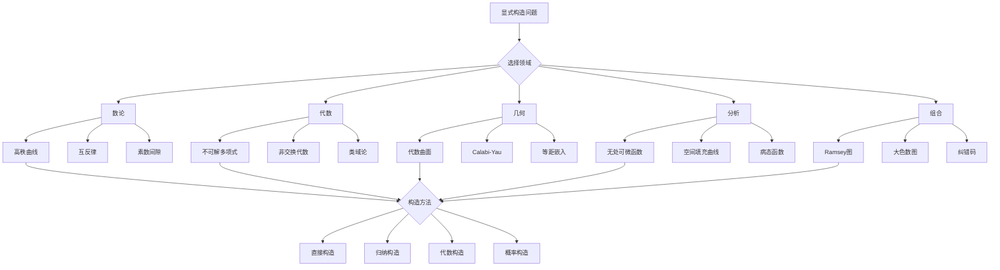

# 显式构造问题集

## 概述

显式构造是现代数学的核心能力之一。从具体例子中发现模式、验证猜想、构建反例，显式构造贯穿数学研究的各个分支。本习题集汇集了一系列需要创造性构造的高级数学问题。

---

## 构造方法论

### 构造策略分类

| 策略 | 描述 | 适用场景 |
|------|------|----------|
| 直接构造 | 按定义直接写出对象 | 简单结构 |
| 归纳构造 | 递推定义 | 无穷序列 |
| 对角线法 | Cantor经典技巧 | 不可数性证明 |
| 概率构造 | 存在性证明 | 大结构 |
| 代数构造 | 群/环/域操作 | 代数对象 |
| 几何构造 | 曲线/曲面的显式方程 | 几何对象 |

---

## 习题集

### 第一组：数论构造

#### 问题1：高次互反律的显式例子

**问题陈述**：构造具体的 $n$-次互反律例子，计算显式的Legendre符号推广。

**背景**：设 $K = \mathbb{Q}(\zeta_n)$，$\mathfrak{p}$ 是素理想，$\alpha \in \mathcal{O}_K$。

**任务**：
1. 对 $n = 3$，构造Cubic互反律的具体计算
2. 选取具体素数 $p \equiv 1 \pmod{3}$，计算 $\left(\frac{\omega}{p}\right)_3$
3. 对 $n = 4$，研究四次互反律
4. 显式计算Eisenstein整数的互反符号

**示例**：在 $\mathbb{Z}[\omega]$ 中，设 $\pi = 2 + 3\omega$，计算 $\left(\frac{1-\omega}{\pi}\right)_3$。

#### 问题2：高秩椭圆曲线的显式构造

**问题陈述**：构造具有高秩的椭圆曲线的显式方程。

**Elkies记录**：秩 $\geq 28$ 的椭圆曲线：
$$y^2 + xy + y = x^3 - x^2 - 20\cdot10^9x + 30\cdot10^{12}$$

**任务**：
1. 构造秩 $\geq 6$ 的椭圆曲线族
2. 研究 $y^2 = x^3 + Dx$ 的秩分布
3. 显式构造具有指定torsion结构的曲线
4. 计算Mordell-Weil基

**构造方法**：
- 利用模曲线
- 研究二次扭
- 分析同态的像

#### 问题3：大间隙的素数序列

**问题陈述**：构造具有大素数间隙的显式区间。

**素数间隙**：$g_n = p_{n+1} - p_n$

**任务**：
1. 证明 $n! + 2, n! + 3, ..., n! + n$ 都是合数
2. 构造更短的合数区间
3. 显式计算前 $N$ 个素数后的最大间隙
4. 研究Westzynthius构造

**Westzynthius定理**：$\limsup_{n \to \infty} \frac{g_n}{\ln p_n} = \infty$

---

### 第二组：代数构造

#### 问题4：不可解多项式的显式例子

**问题陈述**：构造5次以上不可解多项式的具体例子。

**背景**：由Galois理论，一般5次以上多项式无根式解。

**任务**：
1. 构造 $f(x) = x^5 - x + 1$，证明其Galois群是 $S_5$
2. 验证 $f(x) = x^5 - 4x + 2$ 的不可解性
3. 构造具有 $A_5$ Galois群的多项式
4. 显式计算分裂域的次数

**判定方法**：
- 模 $p$ 约化分析
- 判别式计算
- Dedekind定理

#### 问题5：非交换可除代数的构造

**问题陈述**：构造有限维非交换可除代数的显式例子。

**Hamilton四元数**：$\mathbb{H} = \mathbb{R} + \mathbb{R}i + \mathbb{R}j + \mathbb{R}k$

**任务**：
1. 构造p进域 $\mathbb{Q}_p$ 上的四元数可除代数
2. 显式构造Cyclic代数 $(L/K, \sigma, a)$
3. 研究符号代数 $(a, b)_F$
4. 构造非循环可除代数（Albert）

**显式构造**：
$$D = \mathbb{Q}_3 + \mathbb{Q}_3 i + \mathbb{Q}_3 j + \mathbb{Q}_3 k$$
其中 $i^2 = 3$，$j^2 = -1$，$ij = -ji = k$。

#### 问题6：非主理想整环的显式例子

**问题陈述**：构造不是主理想整环的Dedekind整环的显式例子。

**经典例子**：$\mathbb{Z}[\sqrt{-5}]$ 的类数为2。

**任务**：
1. 证明 $\mathbb{Z}[\sqrt{-5}]$ 不是UFD
2. 显式构造非主理想，如 $\mathfrak{p} = (2, 1 + \sqrt{-5})$
3. 计算类群的结构
4. 构造类数更大的例子

**构造方法**：
- 虚二次域的类数计算
- Minkowski界分析
- 二元二次型的对应

---

### 第三组：几何构造

#### 问题7：显式代数曲面的构造

**问题陈述**：构造具有特定拓扑性质的代数曲面的显式方程。

**任务**：
1. 构造K3曲面的显式方程
   $$X^4 + Y^4 + Z^4 + W^4 = 0 \subset \mathbb{P}^3$$
   
2. 构造Enriques曲面的显式覆盖
3. 构造具有大Picard数的曲面
4. 显式计算Hodge数

**具体例子**：Fermat四次曲面
$$x^4 + y^4 + z^4 + w^4 = 0$$
Euler特征数为24，Picard数取决于定义域。

#### 问题8：Calabi-Yau三fold的显式方程

**问题陈述**：构造Calabi-Yau三fold的显式例子。

**Quintic三fold**：
$$X = \{z_1^5 + z_2^5 + z_3^5 + z_4^5 + z_5^5 = 0\} \subset \mathbb{P}^4$$

**任务**：
1. 验证Quintic的Chern类 $c_1 = 0$
2. 计算Hodge数 $(h^{1,1}, h^{2,1}) = (1, 101)$
3. 构造orbifold Calabi-Yau
4. 显式构造Borcea-Voisin型Calabi-Yau

**轨道商例子**：
$$X = \mathbb{T}^6 / G$$
其中 $G$ 是保持全纯3-形式的有限群。

#### 问题9：嵌入曲面的显式等距嵌入

**问题陈述**：构造曲面的显式等距嵌入。

**Nash-Kuiper定理**：任何黎曼流形都有等距嵌入到欧氏空间。

**任务**：
1. 构造单位球面的显式等距嵌入
2. 构造环面的等距嵌入方程
3. 研究伪球面的显式参数化
4. 探索Weierstrass表示的应用

**Weierstrass表示**：极小曲面可表示为：
$$X(z) = \text{Re} \int^z (\frac{1}{2}(\frac{1}{G} - G)f, \frac{i}{2}(\frac{1}{G} + G)f, f) dz$$

---

### 第四组：分析构造

#### 问题10：无处可微连续函数的显式构造

**问题陈述**：构造无处可微的连续函数的具体例子。

**Weierstrass函数**：
$$W(x) = \sum_{n=0}^{\infty} a^n \cos(b^n \pi x)$$
其中 $0 < a < 1$，$ab > 1 + \frac{3}{2}\pi$。

**任务**：
1. 证明Weierstrass函数的连续性和无处可微性
2. 构造更简单的无处可微函数
3. 研究Takagi函数：$T(x) = \sum_{n=0}^{\infty} \frac{d(2^n x)}{2^n}$
4. 分析分形维数

#### 问题11：Peano曲线的显式参数化

**问题陈述**：构造填满正方形的曲线的显式参数化。

**Hilbert曲线**：
$$H: [0,1] \to [0,1]^2$$

**任务**：
1. 给出Hilbert曲线的显式递归定义
2. 构造Peano原始构造
3. 研究空间填充曲线的Holder连续性
4. 分析Lebesgue曲线的性质

**显式构造**：Hilbert曲线的L-system定义：
- A → - B F + A F A + F B -
- B → + A F - B F B - F A +

#### 问题12：处处不连续可测函数的显式构造

**问题陈述**：构造处处不连续但可测的函数。

**经典例子**：Dirichlet函数：
$$D(x) = \begin{cases} 1 & x \in \mathbb{Q} \\ 0 & x \notin \mathbb{Q} \end{cases}$$

**任务**：
1. 证明Dirichlet函数的性质
2. 构造更复杂的例子：$f(x) = \sum_{q_n < x} 2^{-n}$，其中 $\{q_n\}$ 枚举有理数
3. 研究Thomae函数：$f(p/q) = 1/q$
4. 分析Baire类函数

---

### 第五组：组合构造

#### 问题13：大Ramsey数的显式下界

**问题陈述**：构造大的Ramsey数的显式下界。

**Ramsey数**：$R(s, t)$ 是使得任意 $N$ 顶点图包含 $s$-团或 $t$-独立集的最小 $N$。

**任务**：
1. 构造显式图证明 $R(3, n) > n^{c \log n}$
2. 研究Frankl-Wilson构造
3. 分析Alon-Krivelevich-Sudakov构造
4. 构造避免小团的显式图

**概率方法下界**：$R(k, k) > 2^{k/2}$

#### 问题14：大色数小围长的图

**问题陈述**：构造具有大色数和小围长的显式图。

**Erdős定理**：存在围长 $> g$ 且色数 $> k$ 的图。

**任务**：
1. 构造围长 $\geq 5$ 且色数 $\geq k$ 的图
2. 研究Lubotzky-Phillips-Sarnak构造（Ramanujan图）
3. 分析Margulis构造
4. 显式计算色数

**构造方法**：利用代数图论和有限几何。

#### 问题15：纠错码的显式构造

**问题陈述**：构造达到Gilbert-Varshamov界的显式码。

**任务**：
1. 构造Justesen码
2. 研究代数几何码（Goppa码）
3. 分析Reed-Solomon码的显式结构
4. 构造LDPC码的显式例子

**Goppa码构造**：利用曲线 $X/\mathbb{F}_q$ 上的点和除子：
$$C(X, D, G) = \{(f(P_1), ..., f(P_n)) : f \in L(G)\}$$

---

### 第六组：集合论构造

#### 问题16：不可测集的显式构造

**问题陈述**：构造Lebesgue不可测集的显式例子。

**Vitali集**：利用选择公理构造的不可测集。

**任务**：
1. 详细构造Vitali集
2. 证明其不可测性
3. 研究Bernstein集
4. 分析Banach-Tarski悖论中的不可测集

**Vitali构造**：在 $[0,1]$ 上定义等价关系 $x \sim y$ 当 $x - y \in \mathbb{Q}$，选择每个等价类的一个代表构成集合 $V$。

#### 问题17：无显选择函数的等价关系

**问题陈述**：构造没有选择函数的等价关系。

**研究内容**：
1. 研究Luzin集的性质
2. 分析Sierpinski集的构造
3. 探索与选择公理的关系
4. 构造ZF中不可良序的集合

---

## Mermaid决策树：显式构造方法论

---

## 构造技巧汇总

| 技巧 | 描述 | 经典例子 |
|------|------|----------|
| 对角线法 | 反对角线修改 | Cantor集合 |
| 紧性论证 | 极限构造 | Tychonoff定理 |
| 群作用 | 轨道构造 | 代数曲线的自同构 |
| 覆盖空间 | 提升构造 | 万有覆盖 |
| 纤维丛 | 局部到整体 | 向量丛构造 |

---

## 相关概念链接

- [代数构造](../concept/代数构造.md)
- [几何构造](../concept/几何构造.md)
- [Galois理论](../concept/Galois理论.md)
- [代数几何](../02-核心数学/05-代数几何.md)
- [数论构造](../02-核心数学/04-数论.md)

---

## 参考文献

1. N. Elkies, "Elliptic Curves with High Rank" (2006)
2. R. Vakil, "The Rising Sea: Foundations of Algebraic Geometry" (2015)
3. G. Gonthier, "Point-Free, Set-Free Concrete Linear Algebra" (2011)
4. J. H. Conway, R. K. Guy, "The Book of Numbers" (1996)
5. N. Alon, J. Spencer, "The Probabilistic Method" (2008)

---

*本习题集最后更新：2026年4月*
*难度评级：研究级（需要博士及以上水平）*
