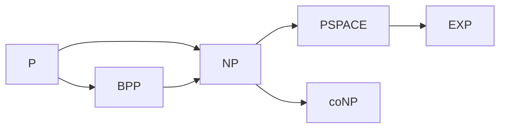
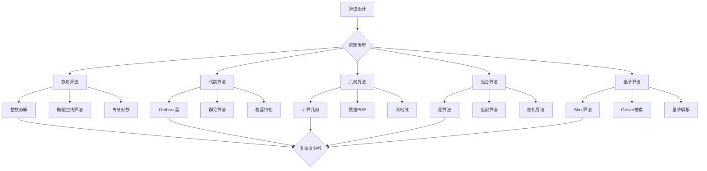

# 算法设计与分析

## 概述

算法是连接数学理论与计算实践的桥梁。从古希腊的辗转相除法到现代的量子算法，算法设计与分析构成了计算数学的核心。本习题集汇集了一系列研究级的算法问题，涵盖数论算法、代数算法、几何算法和组合算法。

---

## 算法复杂度基础

### 复杂度分类

| 类别 | 记号 | 示例 |
|------|------|------|
| 常数时间 | $O(1)$ | 数组访问 |
| 对数时间 | $O(\log n)$ | 二分查找 |
| 线性时间 | $O(n)$ | 线性扫描 |
| 线性对数 | $O(n\log n)$ | 快速排序 |
| 多项式时间 | $O(n^k)$ | 矩阵乘法 |
| 指数时间 | $O(2^n)$ | 子集枚举 |

### 复杂度类关系

---

## 习题集

### 第一组：数论算法

#### 问题1：椭圆曲线点计数的Schoof算法

**问题陈述**：实现并分析Schoof算法，用于计算椭圆曲线在有限域上的点数。

**输入**：椭圆曲线 $E: y^2 = x^3 + ax + b$ over $\mathbb{F}_q$

**输出**：$\#E(\mathbb{F}_q)$

**算法步骤**：
1. 选取素数集合 $S$，使得 $\prod_{\ell \in S} \ell > 4\sqrt{q}$
2. 对每个小素数 $\ell$，计算 $t \mod \ell$（Frobenius的迹）
3. 使用中国剩余定理重构 $t$
4. 返回 $q + 1 - t$

**任务**：
1. 证明Hasse界：$|t| \leq 2\sqrt{q}$
2. 分析算法复杂度：$O(\log^8 q)$
3. 实现Schoof-Elkies-Atkin (SEA) 改进
4. 处理特征2和3的情形

#### 问题2：整数分解的数域筛法

**问题陈述**：深入研究一般数域筛法（GNFS），这是目前最快的整数分解算法。

**GNFS框架**：
1. **多项式选择**：选取 $f(x), g(x)$ 使得 $f(m) \equiv g(m) \equiv 0 \pmod{N}$
2. **筛法**：在代数整数环和整数中寻找光滑数
3. **线性代数**：在 $\mathbb{F}_2$ 上求解线性系统
4. **平方根计算**：构造同余式 $a^2 \equiv b^2 \pmod{N}$

**研究任务**：
1. 分析多项式选择策略
2. 研究筛法效率的优化
3. 理解格基约化在多项式选择中的应用
4. 评估算法复杂度：$L_n[1/3, c]$

**复杂度**：
$$\exp\left((c + o(1))(\ln n)^{1/3}(\ln \ln n)^{2/3}\right)$$

#### 问题3：离散对数的指数演算算法

**问题陈述**：实现并分析有限域上离散对数问题的指数演算法。

**问题定义**：给定 $g, h \in \mathbb{F}_q^*$，求 $x$ 使得 $h = g^x$。

**算法步骤**：
1. **因子基选择**：选择小素数集合 $\mathcal{F}$
2. **关系收集**：找到 $g^{k_i} \equiv \prod_{p \in \mathcal{F}} p^{e_{i,p}} \pmod{q}$
3. **线性代数**：求解 $\log_g p$
4. **目标计算**：将 $h$ 表示为因子基的积

**任务**：
1. 实现基本指数演算法
2. 分析数域筛法对离散对数的改进（NFS-DL）
3. 研究椭圆曲线离散对数的特殊性（ECDLP）
4. 评估后量子密码学的安全性

---

### 第二组：代数算法

#### 问题4：Gröbner基计算的Buchberger算法

**问题陈述**：实现Buchberger算法计算多项式理想的Gröbner基。

**输入**：多项式集合 $F = \{f_1, ..., f_m\} \subset k[x_1, ..., x_n]$

**输出**：Gröbner基 $G$

**算法步骤**：
1. 初始化 $G := F$
2. 计算S-多项式 $S(f, g) = \frac{\text{lcm}(LM(f), LM(g))}{LM(f)}f - \frac{\text{lcm}(LM(f), LM(g))}{LM(g)}g$
3. 约化 $S(f, g) \mod G$
4. 若非零，加入 $G$
5. 重复直到所有S-多项式约化为0

**改进任务**：
1. 实现Buchberger判据的优化
2. 研究F4/F5算法的矩阵方法
3. 分析复杂度上界（双指数）
4. 应用Gröbner基求解代数方程组

#### 问题5：群论算法与Schreier-Sims

**问题陈述**：实现Schreier-Sims算法计算置换群的基和强生成集。

**输入**：置换群 $G = \langle S \rangle \leq S_n$

**输出**：基 $B$ 和强生成集

**算法应用**：
1. 计算群的阶
2. 判断群成员关系
3. 计算轨道和稳定子
4. 寻找正规子群

**高级任务**：
1. 实现Schreier-Sims算法的改进版本
2. 研究Bases and Strong Generating Sets (BSGS) 数据结构
3. 实现随机Schreier-Sims算法
4. 应用于大单群的计算

#### 问题6：格基约化的LLL算法

**问题陈述**：深入理解并应用Lenstra-Lenstra-Lovász格基约化算法。

**格定义**：$L = \{\sum_{i=1}^n a_i b_i : a_i \in \mathbb{Z}\}$，其中 $B = \{b_1, ..., b_n\}$ 是基。

**LLL约化条件**：
1. **尺寸约化**：$|\mu_{i,j}| \leq \frac{1}{2}$，其中 $\mu_{i,j} = \frac{b_i \cdot b_j^*}{b_j^* \cdot b_j^*}$
2. **Lovász条件**：$|b_i^*|^2 \geq (\delta - \mu_{i,i-1}^2)|b_{i-1}^*|^2$

**任务**：
1. 实现LLL算法
2. 分析算法复杂度：$O(n^4 \log B)$
3. 应用于：
   - 整数关系寻找（PSLQ）
   - 多项式因式分解
   - 密码分析（NTRU）
4. 研究BKZ算法（块Korkine-Zolotarev）

---

### 第三组：几何算法

#### 问题7：计算代数几何中的相交理论

**问题陈述**：设计算法计算代数簇的相交积。

**问题定义**：给定 $X \subset \mathbb{P}^n$ 和子簇 $Y, Z \subset X$，计算相交积 $[Y] \cdot [Z]$。

**算法方法**：
1. **Gröbner基方法**：将簇表示为理想，计算理想交
2. **Chow群计算**：用具体的环面簇测试
3. **数值方法**：同延方法（homotopy continuation）

**任务**：
1. 实现计算两个超曲面交的算法
2. 应用Bezout定理验证
3. 计算具体例子的相交重数
4. 研究交积的组合公式

#### 问题8：凸包计算算法

**问题陈述**：实现并比较不同的高维凸包算法。

**算法比较**：

| 算法 | 时间复杂度 | 空间复杂度 | 适用场景 |
|------|-----------|-----------|----------|
| Graham扫描 | $O(n \log n)$ | $O(n)$ | 2D |
| QuickHull | $O(n \log n)$ | $O(n)$ | 2D/3D |
| Gift Wrapping | $O(nh)$ | $O(n)$ | 小输出 |
| Convex Hull | $O(n^{\lfloor d/2 \rfloor})$ | $O(n^{\lfloor d/2 \rfloor})$ | d维 |

**任务**：
1. 实现QuickHull算法
2. 分析高维凸包算法（Beneath-Beyond）
3. 研究输出敏感的算法
4. 应用于Voronoi图计算

#### 问题9：最短路径与测地线算法

**问题陈述**：设计曲面上的最短路径算法。

**问题定义**：给定曲面 $S$ 和点 $p, q \in S$，计算测地线距离和路径。

**算法方法**：
1. **MMP算法**（Mitchell-Mount-Papadimitriou）：离散测地线
2. **CH算法**（Chen-Han）：窗口传播
3. **热方法**（Heat Method）：基于PDE

**任务**：
1. 实现热方法计算测地距离
2. 分析离散曲面上的算法
3. 比较不同算法的精度和效率
4. 应用于网格处理

---

### 第四组：组合算法

#### 问题10：图同构测试算法

**问题陈述**：研究图同构问题的算法，特别是Babai的拟多项式算法。

**问题定义**：给定图 $G, H$，判断是否 $G \cong H$。

**经典算法**：
1. **NAUTY**：基于个体化-精炼（individualization-refinement）
2. **Babai算法**：群论方法，复杂度 $n^{O(\log n)}$

**研究任务**：
1. 实现Weisfeiler-Lehman算法
2. 理解Babai算法的核心思想
3. 分析群同构与图同构的联系
4. 研究最新进展（图的同构有多难？）

**Babai定理**（2015）：图同构可在准多项式时间内解决。

#### 问题11：近似算法与概率方法

**问题陈述**：设计NP难问题的近似算法。

**Max-Cut问题**：给定图 $G = (V, E)$，求最大割的大小。

**Goemans-Williamson算法**：
1. **SDP松弛**：将问题松弛为半定规划
2. **随机超平面舍入**：获得近似解
3. **近似比**：$\alpha_{GW} \approx 0.878$

**任务**：
1. 实现Goemans-Williamson算法
2. 证明近似比
3. 研究Unique Games猜想下的最优性
4. 应用于其他组合优化问题

#### 问题12：随机算法与去随机化

**问题陈述**：设计随机算法并研究去随机化技术。

**多项式恒等测试（PIT）**：
给定算术电路 $C$，判断 $C \equiv 0$。

**Schwartz-Zippel引理**：
若 $f \not\equiv 0$ 是 $n$ 元 $d$ 次多项式，$S \subset \mathbb{F}$，则：
$$\Pr_{a \in S^n}[f(a) = 0] \leq \frac{d}{|S|}$$

**研究任务**：
1. 实现随机多项式恒等测试
2. 研究去随机化方法
3. 分析代数复杂性
4. 探索PIT与下界的联系

---

### 第五组：数值算法

#### 问题13：快速多极子方法（FMM）

**问题陈述**：实现快速多极子方法用于N体问题。

**问题定义**：计算 $N$ 个粒子间的相互作用：
$$\Phi_i = \sum_{j \neq i} \frac{q_j}{|r_i - r_j|}$$

**朴素算法**：$O(N^2)$

**FMM算法**：$O(N)$

**核心思想**：
1. 远场相互作用用多极展开近似
2. 近场直接计算
3. 树状数据结构（八叉树）

**任务**：
1. 实现2D FMM算法
2. 分析误差界
3. 扩展到3D和Helmholtz核
4. 应用于边界元方法

#### 问题14：稀疏矩阵算法

**问题陈述**：设计大规模稀疏线性系统的求解算法。

**问题定义**：求解 $Ax = b$，其中 $A$ 是稀疏矩阵。

**算法类别**：
1. **直接法**：稀疏Cholesky、LU分解
2. **迭代法**：共轭梯度法、GMRES
3. **预处理**：不完全LU、多重网格

**任务**：
1. 实现共轭梯度法
2. 设计多重网格预处理器
3. 分析收敛速度
4. 应用于有限元问题

#### 问题15：谱方法与快速变换

**问题陈述**：实现快速正交变换算法。

**变换列表**：

| 变换 | 复杂度 | 应用 |
|------|--------|------|
| FFT | $O(n \log n)$ | 信号处理 |
| FCT | $O(n \log n)$ | 图像压缩 |
| FWT | $O(n)$ | 小波分析 |
| NTT | $O(n \log n)$ | 多项式乘法 |

**任务**：
1. 实现Cooley-Tukey FFT算法
2. 实现数论变换（NTT）
3. 应用于快速多项式乘法
4. 研究稀疏FFT算法

---

### 第六组：量子算法

#### 问题16：Shor分解算法的实现模拟

**问题陈述**：在经典计算机上模拟Shor量子分解算法。

**算法步骤**：
1. **经典预处理**：检查平凡因子
2. **量子部分**：求阶算法
3. **经典后处理**：从阶推导因子

**量子求阶**：
$$|0\rangle|0\rangle \to \frac{1}{\sqrt{q}}\sum_{a=0}^{q-1}|a\rangle|0\rangle \to \frac{1}{\sqrt{q}}\sum_{a=0}^{q-1}|a\rangle|x^a \mod N\rangle$$

**任务**：
1. 模拟量子傅里叶变换
2. 实现求阶算法
3. 分析成功概率
4. 讨论量子纠错需求

#### 问题17：Grover搜索算法

**问题陈述**：分析Grover算法的优化与推广。

**问题定义**：在未排序数据库中搜索标记项。

**经典复杂度**：$O(N)$

**Grover量子算法**：$O(\sqrt{N})$

**研究内容**：
1. 实现Grover迭代的几何分析
2. 研究多次标记的情形
3. 分析量子计数算法
4. 探索量子行走搜索

---

## Mermaid决策树：算法设计路径

---

## 复杂度汇总

| 问题 | 最佳已知算法 | 复杂度 | 备注 |
|------|-------------|--------|------|
| 整数分解 | GNFS | $L_n[1/3, c]$ | 次指数 |
| 离散对数 | NFS-DL | $L_p[1/3, c]$ | 次指数 |
| ECDLP | Pollard-ρ | $O(\sqrt{n})$ | 指数 |
| Gröbner基 | F5 | 双指数 | 最坏情形 |
| 格最短向量 | Kannan | $n^{n/(2e)}$ | 指数 |
| 图同构 | Babai | $n^{O(\log n)}$ | 准多项式 |
| Max-Cut | GW | $0.878$ | 近似比 |

---

## 相关概念链接

- [计算复杂性](../concept/计算复杂性.md)
- [算法分析](../concept/算法分析.md)
- [量子计算](../concept/量子计算.md)
- [密码学](../concept/密码学.md)
- [数值分析](../02-核心数学/06-应用数学.md)

---

## 参考文献

1. D. Knuth, "The Art of Computer Programming" (1968-2011)
2. A. Aho, J. Hopcroft, J. Ullman, "The Design and Analysis of Computer Algorithms" (1974)
3. V. Shoup, "A Computational Introduction to Number Theory and Algebra" (2009)
4. D. Cox, J. Little, D. O'Shea, "Ideals, Varieties, and Algorithms" (2007)
5. M. Nielsen, I. Chuang, "Quantum Computation and Quantum Information" (2000)

---

*本习题集最后更新：2026年4月*
*难度评级：研究级（需要博士及以上水平）*
