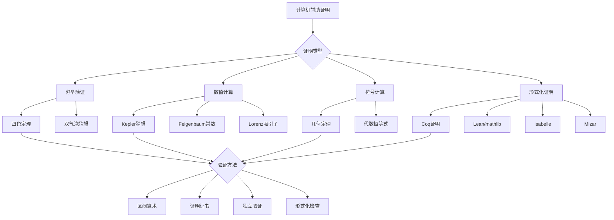

# 计算机辅助证明案例

## 概述

计算机辅助证明（Computer-Assisted Proofs）是现代数学的重要发展方向。从四色定理到Kepler猜想，从Feigenbaum常数到双气泡猜想，计算机在验证复杂数学命题中发挥着不可替代的作用。本习题集深入分析经典的计算机辅助证明案例。

---

## 计算机辅助证明的分类

### 按使用方式分类

| 类型 | 描述 | 例子 |
|------|------|------|
| 穷举验证 | 检查大量情况 | 四色定理 |
| 数值验证 | 高精度计算 | Feigenbaum常数 |
| 符号计算 | 代数操作 | 几何定理证明 |
| 形式化证明 | 完全形式化 | 四色定理（Coq） |
| 混合方法 | 多种技术结合 | Kepler猜想 |

---

## 习题集

### 第一组：四色定理

#### 问题1：Appel-Haken证明的分析

**问题陈述**：深入分析Appel-Haken的计算机辅助证明。

**证明概要**：
1. **不可避免集**：证明1936个构形构成不可避免集
2. **可约性验证**：计算机验证每个构形的可约性
3. **放电过程**：验证放电规则的完备性

**研究任务**：
1. 理解不可避免集的构造原理
2. 分析可约性检验算法
3. 评估计算机程序的可靠性
4. 讨论传统证明vs计算机证明的哲学问题

**关键数据**：
- 不可避免集大小：1936个构形
- 放电规则：487条
- 计算机运行时间：约1200小时
- 人工检查：约400页验证

#### 问题2：Robertson-Sanders-Seymour-Thomas简化证明

**问题陈述**：研究RSST对四色定理的简化证明。

**改进之处**：
1. 不可避免集减少至633个构形
2. 更简洁的放电规则（32条）
3. 更可靠的计算机验证
4. 独立的双重验证

**任务**：
1. 比较两个证明的复杂度
2. 分析简化证明的关键洞察
3. 评估可验证性的改进
4. 探索进一步简化的可能

#### 问题3：Gonthier的Coq形式化证明

**问题陈述**：研究Gonthier使用Coq证明助手的完全形式化证明。

**形式化特点**：
1. **完全形式化**：从公理出发，不依赖任何外部知识
2. **机器验证**：Coq自动验证每一步
3. **可提取程序**：可执行的正确性保证代码

**技术架构**：
```
基础库 → 图论库 → 放电理论 → 可约性 → 四色定理
```

**研究任务**：
1. 理解形式化证明的构建过程
2. 分析证明脚本的结构
3. 评估形式化vs传统证明的优劣
4. 探索其他定理的形式化

---

### 第二组：开普勒猜想

#### 问题4：Hales对开普勒猜想的证明

**问题陈述**：分析Hales使用计算机辅助证明开普勒猜想的方法。

**开普勒猜想**：在三维空间中，球的最密堆积密度为：
$$\frac{\pi}{\sqrt{18}} \approx 0.74048$$

**证明策略**：
1. **分解为有限问题**：将无穷多球堆积分解为有限种局部构型
2. **线性规划界**：为每种构型建立密度上界
3. **计算机验证**：求解约10万个线性规划问题

**关键步骤**：
1. **Voronoi分解**：空间分解为Voronoi细胞
2. **Del Star划分**：改进的分解方法
3. **线性规划**：对每个构型优化密度上界

**研究任务**：
1. 理解分解策略的数学基础
2. 分析线性规划问题的建立
3. 评估数值计算的可靠性
4. 研究Hales的Flyspeck项目（形式化验证）

#### 问题5：开普勒猜想的形式化证明

**问题陈述**：研究Flyspeck项目对开普勒猜想的形式化验证。

**项目规模**：
- 证明脚本：约200,000行
- 形式化时间：约20人年
- 验证时间：约5000小时

**技术挑战**：
1. 非线性不等式的验证
2. 区间算术的实现
3. 大规模计算的形式化

**任务**：
1. 分析形式化证明的架构
2. 理解区间算术的应用
3. 评估形式化证明的可信度
4. 探索形式化方法在其他几何问题中的应用

---

### 第三组：双气泡猜想

#### 问题6：双气泡猜想的证明

**问题陈述**：研究Hutchings、Morgan、Ritoré、Ros对双气泡猜想的证明。

**双气泡猜想**：在平面上，包围两个给定面积的最短周长图形由三个圆弧组成（两个外弧和一个内弧）。

**证明方法**：
1. **存在性**：几何测度论
2. **正则性**：曲线是圆弧
3. **拓扑分类**：枚举可能构型
4. **计算机验证**：验证所有构型的稳定性

**计算机部分**：
- 验证Jacobi场的正性
- 数值积分验证
- 不等式验证

**研究任务**：
1. 理解证明的几何思想
2. 分析计算机验证的精度
3. 扩展到高维双气泡问题
4. 研究三重气泡问题

---

### 第四组：混沌理论

#### 问题7：Feigenbaum常数的计算

**问题陈述**：研究Feigenbaum常数的计算机辅助计算。

**Feigenbaum常数**：
$$\delta = \lim_{n \to \infty} \frac{\lambda_n - \lambda_{n-1}}{\lambda_{n+1} - \lambda_n} \approx 4.6692016...$$

**计算挑战**：
1. 超稳定周期的精确计算
2. 高精度算术（数千位）
3. 收敛性分析

**证明意义**：Lanford使用计算机辅助证明了Feigenbaum猜想的某些方面。

**任务**：
1. 实现高精度Feigenbaum常数计算
2. 分析计算误差
3. 研究普适性的理论证明
4. 探索其他普适性常数

#### 问题8：Lorenz吸引子的计算机分析

**问题陈述**：研究Lorenz吸引子的计算机辅助分析。

**Lorenz系统**：
$$\begin{cases}
\dot{x} = \sigma(y - x) \\
\dot{y} = x(\rho - z) - y \\
\dot{z} = xy - \beta z
\end{cases}$$

**Tucker定理**（2002）：使用计算机辅助证明Lorenz吸引子是奇异双曲吸引子。

**证明方法**：
1. 正规形理论
2. 覆盖集（covering relations）
3. 区间算术验证
4. 计算机辅助的拓扑分析

**研究任务**：
1. 理解奇异双曲性的定义
2. 分析覆盖集方法
3. 评估数值验证的可靠性
4. 研究其他混沌系统的严格分析

---

### 第五组：形式化数学

#### 问题9：Mizar数学库分析

**问题陈述**：研究Mizar项目中的形式化数学库。

**Mizar项目**：
- 始于1973年
- 包含超过12,000个形式化定义
- 超过60,000个定理
- 覆盖数学多个分支

**特点**：
1. **可读性**：接近自然语言的输入
2. **严格性**：完全形式化验证
3. **可扩展性**：模块化库结构

**任务**：
1. 浏览Mizar数学库
2. 分析形式化证明的风格
3. 比较不同证明助手的特点
4. 探索自动形式化工具

#### 问题10：Lean数学库mathlib

**问题陈述**：研究Lean证明助手的mathlib项目。

**mathlib特点**：
- 现代类型论基础
- 大规模协作开发
- 涵盖本科到研究生水平数学

**核心组件**：
- 代数（群、环、域）
- 分析（实数、复数、测度论）
- 拓扑（拓扑空间、流形）
- 数论（素数、模算术）

**研究任务**：
1. 安装并使用Lean/matl
2. 理解类型论基础
3. 编写简单的形式化证明
4. 分析mathlib的架构设计

#### 问题11：Isabelle/HOL的形式化验证

**问题陈述**：研究Isabelle/HOL在数学形式化中的应用。

**应用案例**：
1. **素数定理**：Avigad等的形式化证明
2. **Jordan曲线定理**：Hales的形式化
3. **Goedel不完备定理**：Paulson的形式化

**技术特点**：
- 高阶逻辑（HOL）
- 自动证明搜索
- 可读证明输出

**任务**：
1. 安装Isabelle/HOL
2. 学习证明编写
3. 分析自动推理策略
4. 探索Sledgehammer工具

---

### 第六组：可靠性验证

#### 问题12：区间算术与误差控制

**问题陈述**：研究区间算术在计算机辅助证明中的应用。

**区间算术**：用区间 $[a, b]$ 代替点值进行计算，保证结果包含真值。

**基本运算**：
- $[a,b] + [c,d] = [a+c, b+d]$
- $[a,b] \cdot [c,d] = [\min(ac,ad,bc,bd), \max(ac,ad,bc,bd)]$

**应用**：
1. 证明不等式
2. 验证ODE解的存在性
3. 计算积分上界

**任务**：
1. 实现区间算术库
2. 验证经典不等式
3. 分析区间扩张问题
4. 探索仿射算术等改进

#### 问题13：证明证书与可检查性

**问题陈述**：研究计算机辅助证明中的证书概念。

**证明证书**：可由独立程序快速验证的证明摘要。

**类型**：
1. **SAT证书**：布尔可满足性证明
2. **计算机代数证书**：符号计算结果
3. **数值证书**：区间计算结果

**任务**：
1. 理解SAT求解器的证书格式
2. 设计证明证书的结构
3. 实现证书验证器
4. 分析证书的压缩与传输

#### 问题14：错误检测与证明重构

**问题陈述**：研究计算机辅助证明中的错误检测方法。

**常见错误来源**：
1. 程序漏洞
2. 数值精度不足
3. 形式化表述错误
4. 逻辑漏洞

**检测策略**：
1. 独立验证
2. 多种方法交叉检查
3. 形式化证明验证
4. 社区审查

**历史案例**：
- Hales证明开普勒猜想时的数值问题
- 四色定理证明的初步验证

**任务**：
1. 分析历史错误的教训
2. 设计冗余验证策略
3. 评估不同验证方法的可靠性
4. 建立最佳实践指南

#### 问题15：未来展望：AI辅助证明

**问题陈述**：探索人工智能在数学证明中的应用前景。

**当前进展**：
1. **自动定理证明**：Prover9、Vampire
2. **机器学习引导**：DeepMath、HOList
3. **神经定理证明**：GPT-f、LeanDojo
4. **符号-神经混合**：AlphaGeometry

**研究方向**：
1. 自动猜想生成
2. 证明搜索加速
3. 形式化证明补全
4. 自然语言到形式化翻译

**研究任务**：
1. 试用AI证明辅助工具
2. 分析当前技术的局限性
3. 预测未来发展趋势
4. 讨论人机协作的证明模式

---

## Mermaid决策树：计算机辅助证明方法论



---

## 重要案例汇总

| 定理 | 年份 | 证明者 | 技术 | 验证状态 |
|------|------|--------|------|----------|
| 四色定理 | 1976 | Appel-Haken | 穷举+计算机 | 1997年简化证明，2005年形式化 |
| 开普勒猜想 | 1998 | Hales | 线性规划+区间算术 | 2014年形式化完成 |
| 双气泡 | 2002 | Hutchings等 | 几何+数值 | 严格证明 |
| Lorenz吸引子 | 2002 | Tucker | 区间分析 | 严格证明 |
| 飞騨-千禧年问题 | 2006 | 部分解决 | 数值+符号 | 持续验证中 |

---

## 相关概念链接

- [形式化验证](../concept/形式化验证.md)
- [自动定理证明](../concept/自动定理证明.md)
- [区间算术](../concept/区间算术.md)
- [证明助手](../concept/证明助手.md)
- [四色定理](22-四色定理的代数拓扑证明.md)

---

## 参考文献

1. K. Appel, W. Haken, "Every Planar Map is Four Colorable" (1989)
2. T. Hales, "Cannonballs and Honeycombs" (2000)
3. T. Hales et al., "A Formal Proof of the Kepler Conjecture" (2017)
4. O. Lanford, "A Computer-Assisted Proof of the Feigenbaum Conjectures" (1982)
5. W. Tucker, "A Rigorous ODE Solver and Smale's 14th Problem" (2002)
6. G. Gonthier, "Formal Proof—The Four-Color Theorem" (2008)

---

*本习题集最后更新：2026年4月*
*难度评级：研究级（需要博士及以上水平）*
