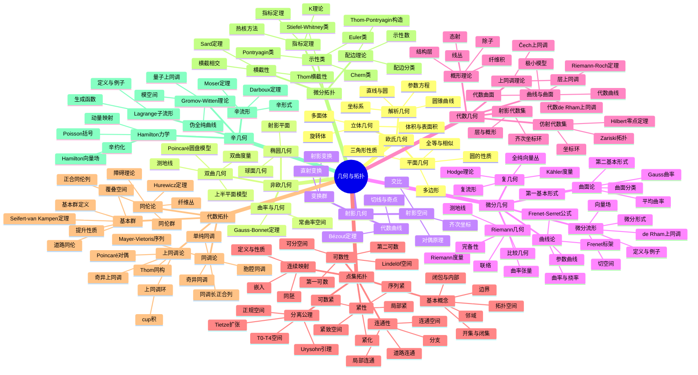
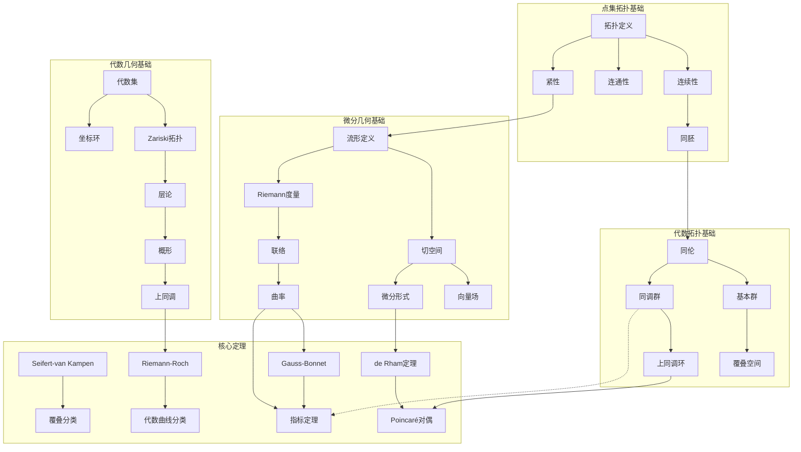
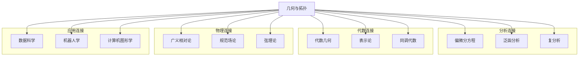
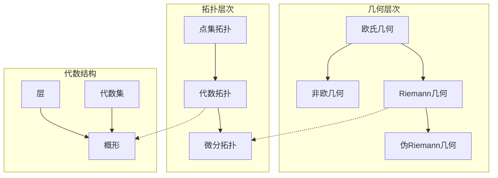

---
references:
  textbooks:
    - id: munkres_top
      type: textbook
      title: Topology
      authors:
      - James R. Munkres
      publisher: Pearson
      edition: 2nd
      year: 2000
      isbn: 978-0131816299
      msc: 54-01
      chapters: []
      url: ~
    - id: lee_ism
      type: textbook
      title: Introduction to Smooth Manifolds
      authors:
      - John M. Lee
      publisher: Springer
      edition: 2nd
      year: 2012
      isbn: 978-1441999818
      msc: 58-01
      chapters: []
      url: ~
  databases:
    - id: nlab
      type: database
      name: nLab
      entry_url: "https://ncatlab.org/nlab/show/{entry}"
      consulted_at: 2026-04-17
    - id: stacks_project
      type: database
      name: Stacks Project
      entry_url: "https://stacks.math.columbia.edu/tag/{tag}"
      consulted_at: 2026-04-17
    - id: zbmath
      type: database
      name: zbMATH Open
      entry_url: "https://zbmath.org/?q=an:{zb_id}"
      consulted_at: 2026-04-17
---
# 几何与拓扑思维导图

> 几何学研究空间的形状与结构，拓扑学研究在连续变形下不变的性质。从欧氏几何到现代代数几何，构建了丰富的数学图景。

---

## 🧠 核心概念层级关系



---

## 🔗 定理依赖关系图



---

## 📍 重要示例分布

### 拓扑经典示例
| 示例 | 概念 | 重要性 | 位置 |
|-----|------|-------|------|
| S^n球面 | 基本群计算 | ⭐⭐⭐⭐⭐ | 基本群 |
| T^n环面 | 乘积空间 | ⭐⭐⭐⭐⭐ | 基本群/同调 |
| RP^n射影空间 | 商空间 | ⭐⭐⭐⭐⭐ | 覆叠空间 |
| CP^n复射影空间 | 复结构 | ⭐⭐⭐⭐⭐ | 代数拓扑 |
| Möbius带 | 不可定向 | ⭐⭐⭐⭐ | 曲面的分类 |
| Klein瓶 | 闭曲面 | ⭐⭐⭐⭐⭐ | 基本群 |

### 微分几何示例
| 示例 | 概念 | 重要性 | 位置 |
|-----|------|-------|------|
| S²(标准) | 常正曲率 | ⭐⭐⭐⭐⭐ | 曲面论 |
| 平面 | 零曲率 | ⭐⭐⭐⭐⭐ | 曲面论 |
| 双曲平面 | 常负曲率 | ⭐⭐⭐⭐⭐ | 非欧几何 |
| 环面T² | 平坦度量 | ⭐⭐⭐⭐ | Riemann几何 |
| CP^n | Kähler流形 | ⭐⭐⭐⭐⭐ | 复几何 |

### 代数几何示例
| 示例 | 概念 | 重要性 | 位置 |
|-----|------|-------|------|
| A^n仿射空间 | 代数集基础 | ⭐⭐⭐⭐⭐ | 代数集 |
| P^n射影空间 | 紧化 | ⭐⭐⭐⭐⭐ | 射影几何 |
| 椭圆曲线 | 群结构 | ⭐⭐⭐⭐⭐ | 代数曲线 |
| Grassmannian | 模空间 | ⭐⭐⭐⭐ | 代数簇 |

---

## 🔄 与其他分支的连接点



**具体连接说明：**

| 分支 | 连接概念 | 连接深度 |
|-----|---------|---------|
| 偏微分方程 | 几何分析、指标定理 | ⭐⭐⭐⭐⭐ |
| 代数几何 | 层论、上同调、概形 | ⭐⭐⭐⭐⭐ |
| 同调代数 | 同调/上同调理论 | ⭐⭐⭐⭐⭐ |
| 表示论 | 示性类、指标定理 | ⭐⭐⭐⭐ |
| 广义相对论 | Riemann几何、曲率 | ⭐⭐⭐⭐⭐ |
| 量子场论 | 指标定理、示性类 | ⭐⭐⭐⭐⭐ |
| 弦理论 | Calabi-Yau流形、镜像对称 | ⭐⭐⭐⭐ |
| 数据科学 | 流形学习、拓扑数据分析 | ⭐⭐⭐⭐ |

---

## 📊 学习难度梯度标记

```mermaid
graph LR
    subgraph 几何基础 ⭐⭐
        A1[欧氏几何]
        A2[解析几何]
        A3[初等拓扑]
    end
    
    subgraph 本科核心 ⭐⭐⭐⭐
        B1[点集拓扑]
        B2[微分几何]
        B3[代数拓扑基础]
    end
    
    subgraph 研究生核心 ⭐⭐⭐⭐⭐
        C1[代数拓扑深入]
        C2[微分拓扑]
        C3[代数几何基础]
        C4[辛几何]
    end
    
    subgraph 研究前沿 ⭐⭐⭐⭐⭐⭐
        D1[指标定理]
        D2[镜像对称]
        D3[高阶范畴论]
        D4[Floer同调]
    end
```

### 详细难度分级

| 主题 | 入门 | 基础 | 进阶 | 高级 | 专家 |
|-----|------|------|------|------|------|
| 点集拓扑 | 基本概念 | 紧性/连通性 | 度量化 | 维数论 | 一般拓扑 |
| 代数拓扑 | 基本群 | 同调群 | 上同调环 | 谱序列 | 稳定同伦 |
| 微分几何 | 曲线/曲面 | Riemann几何 | 复几何 | 指标定理 | 几何分析 |
| 代数几何 | 代数曲线 | 层论 | 概形 | 相交理论 | 动机理论 |
| 微分拓扑 | 横截性 | 配边理论 | 示性类 | K理论 | 手术理论 |

---

## 🎯 学习路径推荐

### 经典几何拓扑路径
```
点集拓扑 → 代数拓扑（基本群+同调）→ 微分几何 → 微分拓扑 → 指标定理
```

### 代数几何路径
```
交换代数 → 代数曲线 → 层论 → 概形 → 上同调 → 高级代数几何
```

### 几何分析路径
```
微分几何 → Riemann几何 → 几何分析 → 极小曲面 → Ricci流
```

### 辛几何路径
```
微分几何 → 辛几何 → Gromov-Witten理论 → Fukaya范畴 → 同调镜像对称
```

---

## 📚 核心定理清单

### 点集拓扑核心定理
1. **Urysohn引理**：正规空间中不相交闭集可用连续函数分离
2. **Tietze扩张定理**：闭子集上的连续函数可扩张到全空间
3. **Tychonoff定理**：紧致空间的乘积紧致

### 代数拓扑核心定理
1. **Seifert-van Kampen定理**：空间并的基本群计算
2. **覆叠空间分类定理**：子群与覆叠空间的对应
3. **de Rham定理**：de Rham上同调与奇异上同调的同构
4. **Poincaré对偶**：紧致定向流形的同调与上同调对偶
5. **Thom同构**：法丛的Thom类与上同调同构

### 微分几何核心定理
1. **Frenet-Serret公式**：空间曲线的微分几何
2. **Gauss-Bonnet定理**：曲率与拓扑的关系
3. **Darboux定理**：辛流形的局部标准形
4. **Hopf-Rinow定理**：完备性与测地线延展

### 代数几何核心定理
1. **Hilbert零点定理**：代数集与理想的对应
2. **Riemann-Roch定理**：曲线上的函数空间维数公式
3. **Serre对偶**：代数簇上的对偶定理
4. **Grothendieck-Riemann-Roch**：推广的RR定理

### 微分拓扑核心定理
1. **Sard定理**：光滑映射临界值测度为零
2. **Thom横截性定理**：通有横截性
3. **指标定理**：椭圆算子的解析指标=拓扑指标

---

## 🔍 概念关系图谱



---

> 💡 **学习建议**：几何与拓扑的学习需要培养空间直觉和代数工具的双重能力。建议从具体例子（如球面、环面）出发，逐步抽象。代数拓扑提供了计算拓扑不变量的有力工具，而微分几何则强调局部与整体的关系。注意几何与分析的深度融合是现代数学的重要特征。
