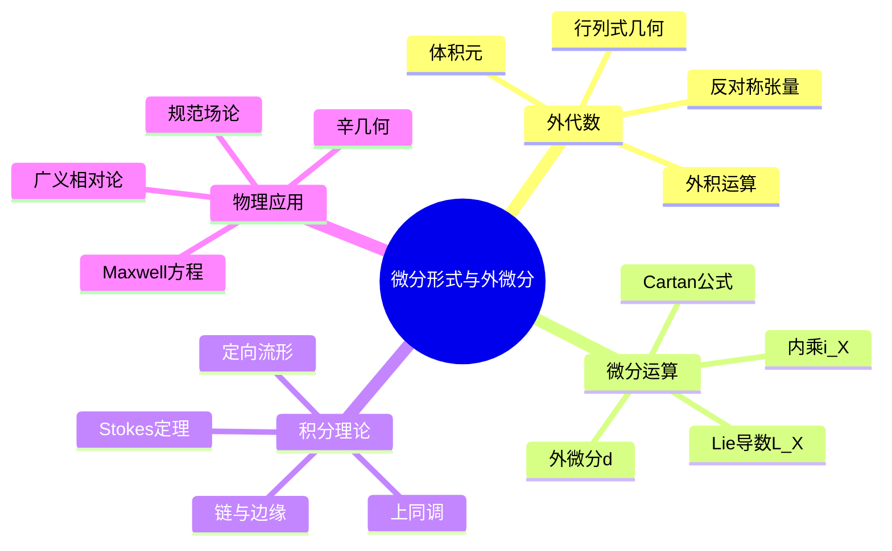

---
references:
  textbooks:
    - id: munkres_top
      type: textbook
      title: Topology
msc_primary: 51A99
      authors:
      - James R. Munkres
      publisher: Pearson
      edition: 2nd
      year: 2000
      isbn: 978-0131816299
      msc: 54-01
      chapters: 
      url: ~
    - id: lee_ism
      type: textbook
      title: Introduction to Smooth Manifolds
      authors:
      - John M. Lee
      publisher: Springer
      edition: 2nd
      year: 2012
      isbn: 978-1441999818
      msc: 58-01
      chapters: 
      url: ~
  databases:
    - id: nlab
      type: database
      name: nLab
      entry_url: "https://ncatlab.org/nlab/show/{entry}"
      consulted_at: 2026-04-17
    - id: stacks_project
      type: database
      name: Stacks Project
      entry_url: "https://stacks.math.columbia.edu/tag/{tag}"
      consulted_at: 2026-04-17
    - id: zbmath
      type: database
      name: zbMATH Open
      entry_url: "https://zbmath.org/?q=an:{zb_id}"
      consulted_at: 2026-04-17
---
# 微分形式与外微分

## 1. 概念定义

### 1.1 核心概念

**微分形式**是流形上反对称协变张量场的现代语言，它将多元微积分中的曲线积分、曲面积分、体积分统一为Stokes定理的特例。外微分运算则是导数的自然推广。

> **定义 1.1.1 (外代数)**：设 $V$ 为 $n$ 维向量空间，**外代数**（Grassmann代数）定义为
> $$\Lambda^*(V) = \bigoplus_{k=0}^n \Lambda^k(V)$$
> 其中 $\Lambda^k(V)$ 为 $V$ 上 $k$ 阶反对称张量空间，维数为 $\binom{n}{k}$。

外积（wedge积）满足：
- 反对称性：$\alpha \wedge \beta = (-1)^{kl}\beta \wedge \alpha$，$\alpha \in \Lambda^k, \beta \in \Lambda^l$
- 结合律：$(\alpha \wedge \beta) \wedge \gamma = \alpha \wedge (\beta \wedge \gamma)$

> **定义 1.1.2 (微分形式)**：光滑流形 $M$ 上的**$k$-形式**是光滑映射
> $$\omega: M \to \Lambda^k(T^*M)$$
> 即每点 $p \in M$ 赋予一个 $k$ 阶反对称协变张量。

局部坐标 $(x^1, \ldots, x^n)$ 下，$k$-形式可写为
$$\omega = \sum_{i_1 < \cdots < i_k}\omega_{i_1\cdots i_k}(x)\,dx^{i_1} \wedge \cdots \wedge dx^{i_k}$$

> **定义 1.1.3 (外微分)**：**外微分** $d: \Omega^k(M) \to \Omega^{k+1}(M)$ 定义为
> $$d\omega = \sum_{i_1 < \cdots < i_k}\sum_{j=1}^n \frac{\partial\omega_{i_1\cdots i_k}}{\partial x^j}dx^j \wedge dx^{i_1} \wedge \cdots \wedge dx^{i_k}$$

### 1.2 概念分类

```
微分形式理论
├── 外代数基础
│   ├── 张量代数
│   ├── 反对称化
│   ├── 外积运算
│   └── 内积与缩并
├── 微分形式运算
│   ├── 外微分 d
│   ├── 内乘 i_X
│   ├── Lie导数 L_X
│   └── Cartan公式
├── 积分理论
│   ├── 定向与体积元
│   ├── 形式在链上的积分
│   ├── Stokes定理
│   └── de Rham上同调
└── 应用
    ├── 电磁学（Maxwell方程）
    ├── 流体力学
    ├── 辛几何
    └── 规范场论
```

---

## 2. 定理证明

### 2.1 $d^2 = 0$

> **定理 2.1.1**：外微分满足 $d \circ d = 0$，即对任意形式 $\omega$，$d(d\omega) = 0$。

**证明**：

设 $\omega = f\,dx^I$（$I$ 为多指标），则
$$d\omega = \sum_j \frac{\partial f}{\partial x^j}dx^j \wedge dx^I$$

再微分：
\begin{align}
d(d\omega) &= \sum_j d\left(\frac{\partial f}{\partial x^j}\right) \wedge dx^j \wedge dx^I \\
&= \sum_{j,k}\frac{\partial^2 f}{\partial x^k \partial x^j}dx^k \wedge dx^j \wedge dx^I
\end{align}

由偏导数对称性 $\frac{\partial^2 f}{\partial x^k \partial x^j} = \frac{\partial^2 f}{\partial x^j \partial x^k}$，而 $dx^k \wedge dx^j = -dx^j \wedge dx^k$，故配对相消，总和为零。$\square$

### 2.2 Stokes定理

> **定理 2.2.1 (Stokes定理)**：设 $M$ 为 $n$ 维定向带边流形，$\partial M$ 为其边界（具有诱导定向），$\omega$ 为 $M$ 上的 $(n-1)$-形式，则
> $$\int_M d\omega = \int_{\partial M}\omega$$

**证明概要**（局部情形）：

设 $M = \mathbb{H}^n = \{(x^1, \ldots, x^n) : x^n \geq 0\}$，$\omega$ 具紧支集。

设 $\omega = \sum_{i=1}^n (-1)^{i-1}f_i\,dx^1 \wedge \cdots \wedge \widehat{dx^i} \wedge \cdots \wedge dx^n$，则
$$d\omega = \sum_{i=1}^n \frac{\partial f_i}{\partial x^i}dx^1 \wedge \cdots \wedge dx^n$$

计算积分：
$$\int_M d\omega = \sum_{i=1}^n \int_{\mathbb{H}^n}\frac{\partial f_i}{\partial x^i}dx^1\cdots dx^n$$

对 $i < n$：由Fubini定理和紧支集，积分为零。
对 $i = n$：
$$\int_{\mathbb{H}^n}\frac{\partial f_n}{\partial x^n}dx^1\cdots dx^n = -\int_{\mathbb{R}^{n-1}}f_n(x^1, \ldots, x^{n-1}, 0)\,dx^1\cdots dx^{n-1}$$

这正是 $\int_{\partial M}\omega$。 $\square$

### 2.3 Poincaré引理

> **定理 2.3.1 (Poincaré引理)**：在 $\mathbb{R}^n$ 中（或更一般的可缩开集上），闭形式必恰当。即若 $d\omega = 0$，则存在 $\eta$ 使 $\omega = d\eta$。

**证明**（同伦算子法）：

定义同伦算子 $K: \Omega^k(\mathbb{R}^n) \to \Omega^{k-1}(\mathbb{R}^n)$：
$$(K\omega)_x = \int_0^1 t^{k-1}(i_{\vec{R}}\omega)_{tx}\,dt$$
其中 $\vec{R} = \sum x^i\frac{\partial}{\partial x^i}$ 为径向向量场。

**关键恒等式**：$dK + Kd = \text{id}$（在 $k > 0$ 时）

若 $d\omega = 0$，则 $\omega = d(K\omega) + K(d\omega) = d(K\omega)$，故 $\omega$ 恰当。 $\square$

### 2.4 Cartan公式

> **定理 2.4.1 (Cartan魔法公式)**：对向量场 $X$ 和形式 $\omega$：
> $$\mathcal{L}_X\omega = d(i_X\omega) + i_X(d\omega) = (di_X + i_Xd)\omega$$

**证明**：验证两边满足相同的Leibniz法则且在函数和1-形式上相等。

对函数 $f$：$\mathcal{L}_Xf = X(f) = i_Xdf$，而 $di_Xf = 0$。

对1-形式 $df$：$\mathcal{L}_X(df) = d(\mathcal{L}_Xf) = d(X(f))$，而 $di_Xdf + i_Xddf = d(X(f))$。 $\square$

---

## 3. 推导过程

### 3.1 经典积分公式的统一

Stokes定理 $d$ 的维数特例：

| 维数 | 定理 | 形式语言 |
|------|------|----------|
| $n=1$ | 微积分基本定理 | $\int_a^b df = f(b) - f(a)$ |
| $n=2$ | Green定理 | $\iint_D d\omega = \oint_{\partial D}\omega$ |
| $n=3$ | Stokes定理 | $\iint_S d\omega = \oint_{\partial S}\omega$ |
| $n=3$ | 散度定理 | $\iiint_V d\omega = \iint_{\partial V}\omega$ |

### 3.2 Maxwell方程的外形式表达

设时空流形 $M^4$ 上：
- 电磁场2-形式：$F = E_i dx^i \wedge dt + \frac{1}{2}\epsilon_{ijk}B_i dx^j \wedge dx^k$
- 电流3-形式：$J = \rho\,dx \wedge dy \wedge dz - j_i dt \wedge dx^i$

**Maxwell方程**：
$$dF = 0 \quad \text{(Bianchi恒等式，无磁单极)}$$
$$d{*F} = J \quad \text{(带源Maxwell方程)}$$

其中 $*$ 为Hodge星算子。

### 3.3 de Rham上同调构造

**闭形式**：$Z^k(M) = \{\omega \in \Omega^k(M) : d\omega = 0\}$

**恰当形式**：$B^k(M) = \{\omega \in \Omega^k(M) : \omega = d\eta, \eta \in \Omega^{k-1}(M)\}$

**de Rham上同调群**：
$$H^k_{dR}(M) = Z^k(M)/B^k(M) = \frac{\text{闭 }k\text{-形式}}{\text{恰当 }k\text{-形式}}$$

**de Rham定理**：$H^k_{dR}(M) \cong H^k(M; \mathbb{R})$（与奇异上同调同构）。

---

## 4. 概念关系



### 4.1 核心概念网络

```
                    微分形式
                        │
        +---------------+---------------+
        │               │               │
    外代数运算      微分运算         积分理论
        │               │               │
    外积∧          外微分d          Stokes定理
    内积⌟          Lie导数L_X       de Rham上同调
        │               │               │
        +---------------+---------------+
                        │
              Cartan公式: L_X = di_X + i_Xd
                        │
            +-----------+-----------+
            │                       │
      Poincaré引理              Hodge理论
      (局部恰当性)              (整体调和形式)
            │                       │
            +-----------+-----------+
                        │
                de Rham定理
                (分析=拓扑)
```

---

## 5. 应用实例

### 5.1 电磁学：电荷守恒

由 $dJ = d(d{*F}) = 0$，即连续性方程：
$$\frac{\partial\rho}{\partial t} + \nabla \cdot \mathbf{j} = 0$$

积分形式：对任意闭合时空区域，流入电荷 = 流出电荷。

### 5.2 流体力学：涡度与环量

**Kelvin环量定理**：在理想流体中，沿随流体运动的闭曲线的环量守恒。

**形式化**：设 $\omega$ 为速度1-形式，涡度 $\Omega = d\omega$。由Cartan公式：
$$\mathcal{L}_X\Omega = d(i_X\Omega) = 0$$
（在正压流体且体力有势时）

### 5.3 辛几何：Hamilton力学

**辛形式**：$\omega = \sum dp_i \wedge dq^i$，满足 $d\omega = 0$（闭），且非退化。

**Hamilton向量场**：对Hamilton函数 $H$，存在唯一的 $X_H$ 使得
$$i_{X_H}\omega = dH$$

**Hamilton方程**：
$$\dot{q}^i = \frac{\partial H}{\partial p_i}, \quad \dot{p}_i = -\frac{\partial H}{\partial q^i}$$

**Liouville定理**：辛形式（相空间体积）沿Hamilton流守恒。

### 5.4 拓扑：Brouwer不动点定理

**定理**：任何连续映射 $f: D^n \to D^n$（闭球到自身）有不动点。

**形式证明概要**：
1. 假设 $f$ 无不动点，构造收缩映射 $r: D^n \to S^{n-1}$。
2. 诱导 de Rham上同调映射 $r^*: H^{n-1}(S^{n-1}) \to H^{n-1}(D^n)$。
3. 但 $H^{n-1}(S^{n-1}) \cong \mathbb{R}$ 而 $H^{n-1}(D^n) = 0$，矛盾。

### 5.5 特征类：Gauss-Bonnet定理

对紧致定向曲面 $M$：
$$\int_M K\,dA = 2\pi\chi(M)$$

其中 $K$ 为Gauss曲率，$\chi(M)$ 为Euler示性数。

**Chern-Weil理论**：曲率形式的上同调类（特征类）与度量无关，是拓扑不变量。

---

## 6. 参考文献与链接

### 6.1 经典教材

1. **Spivak, M.** (1999). *A Comprehensive Introduction to Differential Geometry* (Vol. 1). Publish or Perish.
2. **Lee, J. M.** (2012). *Introduction to Smooth Manifolds* (2nd ed.). Springer.
3. **Bott, R., & Tu, L. W.** (1982). *Differential Forms in Algebraic Topology*. Springer.
4. **Madsen, I. H., & Tornehave, J.** (1997). *From Calculus to Cohomology*. Cambridge.
5. **Arnold, V. I.** (1989). *Mathematical Methods of Classical Mechanics* (2nd ed.). Springer.

### 6.2 物理应用

1. **Frankel, T.** (2012). *The Geometry of Physics* (3rd ed.). Cambridge.
2. **Nakahara, M.** (2003). *Geometry, Topology and Physics* (2nd ed.). IOP Publishing.

### 6.3 相关概念链接

| 概念 | 链接 |
|------|------|
| 微分流形 | [../04-几何与拓扑/微分流形基础](../04-几何与拓扑/微分流形基础.md) |
| 张量分析 | [../04-几何与拓扑/张量分析](../04-几何与拓扑/张量分析.md) |
| Riemann几何 | [../04-几何与拓扑/21-Riemann几何核心概念](../04-几何与拓扑/21-Riemann几何核心概念.md) |
| 辛几何 | [../04-几何与拓扑/辛几何基础](../04-几何与拓扑/辛几何基础.md) |
| 代数拓扑 | [../04-几何与拓扑/代数拓扑基础](../04-几何与拓扑/代数拓扑基础.md) |
| 上同调理论 | [../04-几何与拓扑/上同调理论](../04-几何与拓扑/上同调理论.md) |
| 电磁理论 | [../08-数学物理/电动力学](../08-数学物理/电动力学.md) |

### 6.4 进阶主题

```
微分形式
    │
    ├──→ Hodge理论
    │       ├── Laplace算子
    │       ├── 调和形式
    │       └── Hodge分解
    │
    ├──→ 示性类
    │       ├── Chern类
    │       ├── Pontryagin类
    │       └── Euler类
    │
    ├──→ 指标定理
    │       ├── Gauss-Bonnet-Chern
    │       └── Atiyah-Singer
    │
    └──→ 超对称与几何
            ├── 超流形
            └── BV-BRST形式
```

---

## 附录：常用公式速查

### 外微分公式

| 对象 | 外微分 |
|------|--------|
| 函数 $f$ | $df = \sum \frac{\partial f}{\partial x^i}dx^i$ |
| 1-形式 $\alpha = \sum a_i dx^i$ | $d\alpha = \sum_{i<j}\left(\frac{\partial a_j}{\partial x^i} - \frac{\partial a_i}{\partial x^j}\right)dx^i \wedge dx^j$ |
| $k$-形式 $\omega \wedge \eta$ | $d(\omega \wedge \eta) = d\omega \wedge \eta + (-1)^k\omega \wedge d\eta$ |

### 坐标变换

设 $y = y(x)$，则
$$dy^i = \sum_j \frac{\partial y^i}{\partial x^j}dx^j$$
$$dx^i = \sum_j \frac{\partial x^i}{\partial y^j}dy^j$$

### 三维空间对应

| 微分形式 | 向量分析 |
|----------|----------|
| 0-形式 $f$ | 标量场 $f$ |
| 1-形式 $A_idx^i$ | 向量场 $\mathbf{A}$ |
| 2-形式 $\frac{1}{2}\epsilon_{ijk}B_idx^j \wedge dx^k$ | 向量场 $\mathbf{B}$ |
| 3-形式 $\rho\,dx \wedge dy \wedge dz$ | 标量密度 $\rho$ |
| $d$ (0→1) | $\nabla$ (梯度) |
| $d$ (1→2) | $\nabla \times$ (旋度) |
| $d$ (2→3) | $\nabla \cdot$ (散度) |
| $d^2 = 0$ | $\nabla \times (\nabla f) = 0$, $\nabla \cdot (\nabla \times \mathbf{A}) = 0$ |

---

*文档编号：20 | MSC2020分类：@ 微分形式 | 创建日期：2026年4月*
