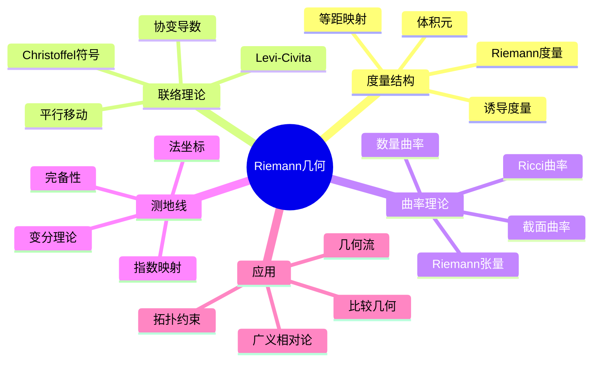

# Riemann几何核心概念

## 1. 概念定义

### 1.1 核心概念

**Riemann几何**研究带有Riemann度量（即每点给定正定内积）的光滑流形。这一几何框架是广义相对论的数学基础，也是现代微分几何的核心分支。

> **定义 1.1.1 (Riemann度量)**：光滑流形 $M$ 上的**Riemann度量** $g$ 是光滑地依赖于 $p \in M$ 的对称正定双线性形式
> $$g_p: T_pM \times T_pM \to \mathbb{R}$$
> 局部坐标 $(x^i)$ 下，度量表示为
> $$g = \sum_{i,j}g_{ij}(x)\,dx^i \otimes dx^j, \quad g_{ij} = g\left(\frac{\partial}{\partial x^i}, \frac{\partial}{\partial x^j}\right)$$
> 常记 $ds^2 = \sum_{i,j}g_{ij}dx^idx^j$。

> **定义 1.1.2 (Levi-Civita联络)**：Riemann流形 $(M, g)$ 上的**Levi-Civita联络** $\nabla$ 是唯一满足以下条件的仿射联络：
>
> 1. **无挠性**：$\nabla_XY - \nabla_YX = [X, Y]$
> 2. **度量相容**：$X(g(Y, Z)) = g(\nabla_XY, Z) + g(Y, \nabla_XZ)$

> **定义 1.1.3 (Riemann曲率张量)**：
> $$R(X, Y)Z = \nabla_X\nabla_YZ - \nabla_Y\nabla_XZ - \nabla_{[X,Y]}Z$$
> 局部坐标下的分量：$R^l_{\,kij} = dx^l(R(\partial_i, \partial_j)\partial_k)$。

> **定义 1.1.4 (测地线)**：曲线 $\gamma: I \to M$ 称为**测地线**，若其切向量沿自身平行移动
> $$\nabla_{\dot{\gamma}}\dot{\gamma} = 0$$
> 即满足测地线方程
> $$\ddot{x}^k + \Gamma^k_{ij}\dot{x}^i\dot{x}^j = 0$$

### 1.2 概念分类

```
Riemann几何核心内容
├── 度量结构
│   ├── Riemann度量定义
│   ├── 诱导度量与子流形
│   ├── 等距与等距嵌入
│   └── 体积元与积分
├── 联络理论
│   ├── 协变导数
│   ├── Levi-Civita联络
│   ├── Christoffel符号
│   └── 平行移动
├── 曲率理论
│   ├── Riemann曲率张量
│   ├── Ricci曲率
│   ├── 数量曲率
│   └── 截面曲率
├── 测地线理论
│   ├── 指数映射
│   ├── 法坐标
│   ├── 完备性
│   └── 变分理论
└── 拓扑与几何
    ├── Gauss-Bonnet定理
    ├── 比较几何
    └── 几何分析
```

---

## 2. 定理证明

### 2.1 Levi-Civita联络的存在唯一性

> **定理 2.1.1 (Levi-Civita)**：任意Riemann流形上存在唯一的无挠且度量相容的联络。

**证明**（Koszul公式）：

设 $\nabla$ 满足条件，对任意向量场 $X, Y, Z$：
\begin{align}
X(g(Y,Z)) &= g(\nabla_XY, Z) + g(Y, \nabla_XZ) \\
Y(g(Z,X)) &= g(\nabla_YZ, X) + g(Z, \nabla_YX) \\
Z(g(X,Y)) &= g(\nabla_ZX, Y) + g(X, \nabla_ZY)
\end{align}

前两项相加减去第三项：
\begin{align}
&X(g(Y,Z)) + Y(g(Z,X)) - Z(g(X,Y)) \\
&= g(\nabla_XY + \nabla_YX, Z) + g(Y, \nabla_XZ - \nabla_ZX) + g(X, \nabla_YZ - \nabla_ZY) \\
&= g(2\nabla_XY - [X,Y], Z) + g(Y, [X,Z]) + g(X, [Y,Z])
\end{align}

由此解出唯一表达式（Koszul公式）：
\begin{align}
g(\nabla_XY, Z) &= \frac{1}{2}[X(g(Y,Z)) + Y(g(Z,X)) - Z(g(X,Y)) \\
&\quad - g([X,Y], Z) - g([Y,Z], X) + g([Z,X], Y)]
\end{align}

由于 $g$ 非退化，$\nabla_XY$ 被唯一确定。验证此定义满足无挠和度量相容性即完成存在性证明。 $\square$

### 2.2 Christoffel符号公式

> **定理 2.2.1**：在局部坐标下，Levi-Civita联络的Christoffel符号为
> $$\Gamma^k_{ij} = \frac{1}{2}g^{kl}\left(\partial_i g_{jl} + \partial_j g_{il} - \partial_l g_{ij}\right)$$

### 2.3 Bianchi恒等式

> **定理 2.3.1 (Bianchi恒等式)**：
>
> 1. **第一Bianchi恒等式**：$R(X,Y)Z + R(Y,Z)X + R(Z,X)Y = 0$
> 2. **第二Bianchi恒等式**：$\nabla_W R(X,Y)Z + \nabla_X R(Y,W)Z + \nabla_Y R(W,X)Z = 0$

**证明**（第一恒等式）：
利用 $R(X,Y) = \nabla_X\nabla_Y - \nabla_Y\nabla_X - \nabla_{[X,Y]}$ 和Jacobi恒等式 $[[X,Y],Z] + [[Y,Z],X] + [[Z,X],Y] = 0$。$\square$

### 2.4 Gauss-Bonnet定理

> **定理 2.4.1 (Gauss-Bonnet-Chern)**：设 $(M^{2n}, g)$ 为紧致定向闭Riemann流形，则
> $$\int_M \text{Pf}(\Omega) = (2\pi)^n \chi(M)$$
> 其中 $\text{Pf}$ 为Pfaffian，$\Omega$ 为曲率形式。特别地，对曲面 $(n=1)$：
> $$\int_M K\,dA = 2\pi\chi(M)$$

---

## 3. 推导过程

### 3.1 曲率张量的对称性

Riemann曲率张量 $R_{ijkl} = g_{im}R^m_{\,jkl}$ 满足：

1. **反对称性**：$R_{ijkl} = -R_{jikl} = -R_{ijlk}$
2. **交换对称性**：$R_{ijkl} = R_{klij}$
3. **第一Bianchi恒等式**：$R_{ijkl} + R_{iklj} + R_{iljk} = 0$

**独立分量数**：在 $n$ 维流形上，独立分量为
$$\frac{n^2(n^2-1)}{12}$$

### 3.2 曲率缩并与Ricci张量

**Ricci张量**：$R_{ij} = R^k_{\,ikj} = g^{kl}R_{kilj}$

- 对称性：$R_{ij} = R_{ji}$
- 独立分量：$\frac{n(n+1)}{2}$

**数量曲率**：$R = g^{ij}R_{ij}$

**Einstein张量**：$G_{ij} = R_{ij} - \frac{1}{2}Rg_{ij}$（满足 $\nabla^i G_{ij} = 0$，用于广义相对论）

### 3.3 截面曲率与常曲率空间

对2维平面 $\sigma = \text{span}\{X, Y\} \subset T_pM$，**截面曲率**为
$$K(\sigma) = \frac{\langle R(X,Y)Y, X\rangle}{|X|^2|Y|^2 - \langle X,Y\rangle^2}$$

**常曲率空间**：$K(\sigma) = \text{const}$ 对所有截面成立。

| 曲率 | 模型空间 | 度量形式 |
|------|----------|----------|
| $K = 0$ | 欧氏空间 $\mathbb{R}^n$ | $ds^2 = \sum(dx^i)^2$ |
| $K = 1$ | 球面 $S^n$ | $ds^2 = \frac{4\sum(dx^i)^2}{(1+\sum(x^i)^2)^2}$ |
| $K = -1$ | 双曲空间 $H^n$ | $ds^2 = \frac{4\sum(dx^i)^2}{(1-\sum(x^i)^2)^2}$ |

### 3.4 测地线变分与Jacobi场

**变分向量场**：设 $\gamma_s$ 为测地线族，$J = \frac{\partial\gamma_s}{\partial s}|_{s=0}$ 满足**Jacobi方程**
$$\frac{D^2J}{dt^2} + R(J, \dot{\gamma})\dot{\gamma} = 0$$

**几何意义**：Jacobi场描述测地线族的无穷小分离。

**共轭点**：若存在非零Jacobi场在两端为零，则称两点共轭。

---

## 4. 概念关系



### 4.1 核心概念网络

```
                    Riemann度量 g
                         │
          +--------------+--------------+
          │                             │
    Levi-Civita联络∇                体积元dV
          │                             │
    +-----+-----+                       │
    │           │                       │
 曲率张量R   测地线方程                   │
    │           │                       │
  +--+--+       │                       │
  │     │       │                       │
Ricci   截面   指数映射               积分理论
张量Rij 曲率K   │                       │
  │     │       │                       │
  +--+--+       │                       │
     │          │                       │
数量曲率R    Hopf-Rinow              Gauss-Bonnet
     │          │                       │
     +----------+-----------+-----------+
                            │
                      比较几何定理
                    (Toponogov, Rauch)
                            │
                     几何分析应用
                  (Ricci流, 极小曲面)
```

---

## 5. 应用实例

### 5.1 广义相对论：Einstein场方程

**时空模型**：4维Lorentz流形 $(M^{3,1}, g)$（符号 $(-,+,+,+)$）

**Einstein场方程**：
$$G_{\mu\nu} + \Lambda g_{\mu\nu} = \frac{8\pi G}{c^4}T_{\mu\nu}$$

其中 $G_{\mu\nu} = R_{\mu\nu} - \frac{1}{2}Rg_{\mu\nu}$ 为Einstein张量，$T_{\mu\nu}$ 为能量-动量张量。

**真空解**（$T = 0$）：Ricci平坦条件 $R_{\mu\nu} = 0$。

**Schwarzschild解**（球对称静态）：
$$ds^2 = -\left(1-\frac{2GM}{rc^2}\right)c^2dt^2 + \left(1-\frac{2GM}{rc^2}\right)^{-1}dr^2 + r^2d\Omega^2$$

### 5.2 球面几何：测地线是大圆

球面 $S^n \subset \mathbb{R}^{n+1}$ 的标准度量由嵌入诱导。

**测地线**：满足 $\nabla_{\dot{\gamma}}\dot{\gamma} = 0$ 的曲线即为球面上的大圆。

**两定点间最短路径**：大圆弧（当不互为对径点时唯一）。

### 5.3 双曲平面：Poincaré圆盘模型

$$D^2 = \{z \in \mathbb{C} : |z| < 1\}, \quad ds^2 = \frac{4|dz|^2}{(1-|z|^2)^2}$$

**性质**：

- Gauss曲率 $K = -1$（常负曲率）
- 测地线为垂直于边界的圆弧（或直径）
- 三角形内角和 $< \pi$

**与欧氏几何对比**：

| 性质 | 欧氏平面 | 双曲平面 |
|------|----------|----------|
| 平行线 | 唯一 | 无限多 |
| 三角形内角和 | $= \pi$ | $< \pi$ |
| 相似三角形 | 存在 | 全等 |
| 圆周长 | $2\pi r$ | $2\pi\sinh r > 2\pi r$ |

### 5.4 曲面拓扑：亏格与曲率积分

**Gauss-Bonnet应用**：对亏格 $g$ 的闭曲面
$$\int_M K\,dA = 2\pi(2-2g) = 4\pi(1-g)$$

**结论**：

- 球面 ($g=0$)：总曲率为正
- 环面 ($g=1$)：总曲率为零（可平坦）
- 高亏格曲面：总曲率为负

### 5.5 曲率与拓扑：球定理

> **球定理 (Berger, Klingenberg)**：设 $(M^n, g)$ 为单连通闭Riemann流形，若截面曲率满足 $\frac{1}{4} < K \leq 1$，则 $M$ 同胚于 $S^n$。

**意义**：曲率条件限制拓扑类型。

---

## 6. 参考文献与链接

### 6.1 经典教材

1. **do Carmo, M. P.** (1992). *Riemannian Geometry*. Birkhäuser.
2. **Petersen, P.** (2006). *Riemannian Geometry* (2nd ed.). Springer.
3. **Lee, J. M.** (2018). *Introduction to Riemannian Manifolds* (2nd ed.). Springer.
4. **Gallot, S., Hulin, D., & Lafontaine, J.** (2004). *Riemannian Geometry* (3rd ed.). Springer.
5. **Chavel, I.** (2006). *Riemannian Geometry: A Modern Introduction* (2nd ed.). Cambridge.

### 6.2 广义相对论

1. **Wald, R. M.** (1984). *General Relativity*. University of Chicago Press.
2. **Hawking, S. W., & Ellis, G. F. R.** (1973). *The Large Scale Structure of Space-Time*. Cambridge.
3. **O'Neill, B.** (1983). *Semi-Riemannian Geometry*. Academic Press.

### 6.3 相关概念链接

| 概念 | 链接 |
|------|------|
| 微分流形 | [../04-几何与拓扑/微分流形基础](../04-几何与拓扑/微分流形基础.md) |
| 微分形式 | [../04-几何与拓扑/20-微分形式与外微分](../04-几何与拓扑/20-微分形式与外微分.md) |
| 张量分析 | [../04-几何与拓扑/张量分析](../04-几何与拓扑/张量分析.md) |
| 辛几何 | [../04-几何与拓扑/辛几何基础](../04-几何与拓扑/辛几何基础.md) |
| 代数拓扑 | [../04-几何与拓扑/代数拓扑基础](../04-几何与拓扑/代数拓扑基础.md) |
| 广义相对论 | [../08-数学物理/广义相对论](../08-数学物理/广义相对论.md) |
| 微分几何 | [../04-几何与拓扑/微分几何基础](../04-几何与拓扑/微分几何基础.md) |

### 6.4 进阶主题

```
Riemann几何
    │
    ├──→ 比较几何
    │       ├── Toponogov比较定理
    │       ├── Rauch比较定理
    │       └── 球面定理
    │
    ├──→ 几何分析
    │       ├── Laplace算子
    │       ├── 热核估计
    │       └── 谱几何
    │
    ├──→ Ricci流
    │       ├── Hamilton方程
    │       ├── Perelman理论
    │       └── Poincaré猜想
    │
    └──→ 特殊几何结构
            ├── Kähler几何
            ├── Sasaki几何
            └── Spin几何
```

---

## 附录：常用公式速查

### Christoffel符号

$$\Gamma^k_{ij} = \frac{1}{2}g^{kl}(\partial_i g_{jl} + \partial_j g_{il} - \partial_l g_{ij})$$

### 曲率张量公式

$$R^l_{\,kij} = \partial_i\Gamma^l_{jk} - \partial_j\Gamma^l_{ik} + \Gamma^l_{im}\Gamma^m_{jk} - \Gamma^l_{jm}\Gamma^m_{ik}$$

### Ricci张量与数量曲率

$$R_{ij} = R^k_{\,ikj}, \quad R = g^{ij}R_{ij}$$

### 变分公式

**第一变分**（弧长）：测地线是弧长的临界点。

**第二变分**：涉及曲率项 $\langle R(J, \dot{\gamma})\dot{\gamma}, J\rangle$。

### 重要恒等式

| 恒等式 | 表达式 |
|--------|--------|
| Bianchi I | $R_{ijkl} + R_{iklj} + R_{iljk} = 0$ |
| Bianchi II | $\nabla_m R_{ijkl} + \nabla_k R_{ijlm} + \nabla_l R_{ijmk} = 0$ |
| Ricci恒等式 | $2R_{ij} = g^{kl}R_{ikjl}$ |
| 收缩Bianchi | $\nabla^i G_{ij} = 0$ |

---

*文档编号：21 | MSC2020分类：53Bxx, 53Cxx Riemann几何 | 创建日期：2026年4月*
