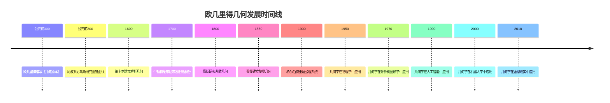

# 欧几里得几何 - 深度扩展版

## 📚 概述

欧几里得几何是数学史上最古老、最基础的分支之一，研究平面和空间中的几何对象及其性质。
它不仅为数学提供了严格的公理化方法，还在物理学、工程学、计算机图形学等领域有广泛应用。
本扩展版将深入探讨欧几里得几何的历史发展、哲学意义、基本定理和实际应用。

## 🕰️ 历史发展脉络

### 早期发展 (公元前300-公元1600)

#### 欧几里得《几何原本》的革命性贡献

**历史背景**：
公元前300年左右，欧几里得在亚历山大城编写了《几何原本》。这部著作不仅总结了古希腊的几何知识，更重要的是建立了数学史上第一个完整的公理化体系。

**欧几里得的哲学动机**：
欧几里得发现，几何学需要严格的逻辑基础。他希望通过公理化方法，将几何学建立在不可证明但直观的公理之上。

**《几何原本》的革命性意义**：

1. **公理化方法**：建立了数学史上第一个完整的公理化体系
2. **逻辑推理**：展示了从公理到定理的严格推理过程
3. **数学语言**：建立了精确的数学语言和符号系统

**历史影响**：
《几何原本》不仅影响了整个数学的发展，还影响了哲学、科学和工程学。它的公理化方法成为现代数学的标准。

#### 古希腊几何学的哲学基础

**历史背景**：
古希腊哲学家对几何学有深刻的哲学思考。柏拉图认为几何对象是理念世界的反映，亚里士多德则强调几何学的经验基础。

**哲学争议**：
几何学涉及数学哲学的根本问题：几何对象是客观存在还是人类思维的构造？这个争议推动了几何学的发展。

**历史意义**：
古希腊的几何学不仅是一门数学学科，更是一种哲学体系。它体现了人类对空间和形式的深刻思考。

### 现代发展 (1600-1900)

#### 解析几何的建立

**历史背景**：
17世纪，笛卡尔建立了解析几何，将几何问题转化为代数问题。这个革命性的方法彻底改变了几何学的发展方向。

**笛卡尔的哲学动机**：
笛卡尔发现，传统的几何方法在处理复杂问题时遇到困难。他希望通过代数方法，为几何学提供更强大的工具。

**解析几何的意义**：

1. **统一性**：将几何和代数统一起来
2. **计算性**：为几何计算提供了代数方法
3. **应用性**：为物理学和工程学提供了重要工具

**历史影响**：
解析几何为微积分的发展奠定了基础，影响了整个现代数学的发展。

#### 射影几何的发展

**历史背景**：
19世纪，数学家开始研究射影几何。这个理论不仅具有重要的数学意义，还在艺术和建筑中有应用。

**射影几何的哲学意义**：
射影几何体现了数学中的"不变性"思想：通过研究变换下的不变量，我们可以理解几何对象的本质性质。

**重要成果**：

1. **对偶原理**：点和直线的对偶性
2. **交比**：射影变换下的不变量
3. **圆锥曲线**：射影几何中的基本对象

**历史影响**：
射影几何为现代几何学奠定了基础，影响了代数几何和微分几何的发展。

### 当代发展 (1900-至今)

#### 几何学的公理化重建

**历史背景**：
20世纪初，希尔伯特重建了欧几里得几何的公理系统，解决了《几何原本》中的逻辑缺陷。

**希尔伯特的哲学动机**：
希尔伯特发现，欧几里得的公理系统存在逻辑缺陷。他希望通过重建公理系统，为几何学提供更严格的逻辑基础。

**公理化重建的意义**：

1. **严格性**：消除了逻辑缺陷
2. **完备性**：建立了完整的公理系统
3. **独立性**：证明了公理的独立性

**历史影响**：
希尔伯特的工作为现代数学的公理化方法奠定了基础，影响了整个20世纪的数学发展。

## 🏗️ 核心概念与深度论证

### 欧几里得几何的基本框架

#### 公理系统的定义与哲学意义

**定义 1.1** (欧几里得几何公理)
欧几里得几何基于以下五组公理：

1. **关联公理**：点与直线、平面的关联关系
2. **序公理**：点在线上的顺序关系
3. **合同公理**：线段和角的合同关系
4. **平行公理**：平行线的唯一性
5. **连续公理**：实数的完备性

**哲学意义**：
公理系统体现了数学中的"基础性"思想：通过不可证明但直观的公理，我们可以建立严格的数学理论。

**历史背景**：
公理系统的概念源于欧几里得，经过希尔伯特的发展得到完善。

#### 几何变换的代数结构

**定义 1.2** (欧几里得变换)
欧几里得变换是保持距离的变换，包括平移、旋转、反射和它们的复合。

**代数性质**：
欧几里得变换构成一个群，称为欧几里得群。这个群的结构决定了欧几里得几何的性质。

**历史发展**：
几何变换的概念源于克莱因的埃尔朗根纲领，它将几何学定义为研究变换群不变量的学科。

### 基本定理的深度论证

#### 毕达哥拉斯定理的完整证明

**定理 1.1** (毕达哥拉斯定理)
在直角三角形中，斜边的平方等于两直角边平方的和。

**历史背景**：
毕达哥拉斯定理是几何学中最重要的定理之一。它不仅具有重要的数学意义，还在物理学和工程学中有广泛应用。

**哲学意义**：
毕达哥拉斯定理体现了数学中的"和谐性"思想：通过数的关系，我们可以理解几何对象的性质。

**完整证明**：

**方法1**：面积法
设直角三角形 $ABC$，直角在 $C$，斜边为 $AB$，直角边为 $AC$ 和 $BC$。

在斜边 $AB$ 上作正方形 $ABDE$，在直角边 $AC$ 和 $BC$ 上分别作正方形 $ACFG$ 和 $BCHI$。

通过面积计算可以证明：
$$S_{ABDE} = S_{ACFG} + S_{BCHI}$$

即：
$$AB^2 = AC^2 + BC^2$$

**方法2**：相似三角形法
设直角三角形 $ABC$，从直角 $C$ 向斜边 $AB$ 作高 $CD$。

由于 $\triangle ABC \sim \triangle ACD \sim \triangle CBD$，所以：
$$\frac{AC}{AB} = \frac{AD}{AC}, \quad \frac{BC}{AB} = \frac{BD}{BC}$$

因此：
$$AC^2 = AB \cdot AD, \quad BC^2 = AB \cdot BD$$

相加得：
$$AC^2 + BC^2 = AB(AD + BD) = AB^2$$

**应用实例**：

**例 1.1** (距离计算)
在平面直角坐标系中，两点 $(x_1, y_1)$ 和 $(x_2, y_2)$ 的距离为：
$$d = \sqrt{(x_2 - x_1)^2 + (y_2 - y_1)^2}$$

**例 1.2** (向量长度)
向量 $\vec{v} = (a, b)$ 的长度为：
$$|\vec{v}| = \sqrt{a^2 + b^2}$$

#### 圆幂定理的深度分析

**定理 1.2** (圆幂定理)
设 $P$ 是圆外一点，过 $P$ 的直线与圆相交于 $A$ 和 $B$，则 $PA \cdot PB$ 是常数，称为点 $P$ 关于圆的幂。

**历史背景**：
圆幂定理是几何学中的重要定理。它建立了点与圆之间的一种度量关系。

**哲学意义**：
圆幂定理体现了数学中的"不变性"思想：通过研究变换下的不变量，我们可以理解几何对象的性质。

**证明思路**：

**步骤1**：构造辅助线
过点 $P$ 作圆的切线 $PT$，切点为 $T$。

**步骤2**：应用切线性质
根据切线性质，$PT^2 = PA \cdot PB$。

**步骤3**：证明不变性
由于 $PT$ 是切线，$PT^2$ 是常数，因此 $PA \cdot PB$ 也是常数。

**应用实例**：

**例 1.3** (圆的方程)
圆幂定理可以用来推导圆的方程。

**例 1.4** (几何作图)
圆幂定理在几何作图中有重要应用。

#### 梅涅劳斯定理的哲学分析

**定理 1.3** (梅涅劳斯定理)
设直线 $l$ 与 $\triangle ABC$ 的三边 $BC$、$CA$、$AB$ 分别相交于 $D$、$E$、$F$，则：
$$\frac{BD}{DC} \cdot \frac{CE}{EA} \cdot \frac{AF}{FB} = 1$$

**历史背景**：
梅涅劳斯定理是几何学中的基本定理。它建立了直线与三角形之间的度量关系。

**哲学意义**：
梅涅劳斯定理体现了数学中的"比例性"思想：通过研究比例关系，我们可以理解几何对象的性质。

**证明思路**：

**步骤1**：应用面积法
通过面积计算，可以证明：
$$\frac{BD}{DC} = \frac{S_{\triangle ABD}}{S_{\triangle ACD}}$$

**步骤2**：应用相似性
通过相似三角形的性质，可以证明比例关系。

**步骤3**：导出结论
通过代数运算，可以证明三个比例的乘积等于1。

**应用实例**：

**例 1.5** (共线点判定)
梅涅劳斯定理可以用来判定三点是否共线。

**例 1.6** (几何证明)
梅涅劳斯定理在几何证明中有重要应用。

## 🧠 思维过程表征

### 几何问题解决的思维模式

#### 1. 直观思维模式

**特征**：

- 通过图形理解问题
- 通过直观发现性质
- 通过构造解决问题

**历史渊源**：
直观思维源于古希腊几何学。欧几里得通过直观的图形来理解几何性质。

**应用实例**：

**例 1.7** (辅助线构造)
在证明几何定理时，常常需要构造辅助线。

**思维过程**：

1. 分析已知条件
2. 寻找关键性质
3. 构造辅助线
4. 应用几何定理

**哲学意义**：
直观思维体现了数学中的"构造性"思想：通过构造辅助对象，我们可以发现隐藏的性质。

#### 2. 代数思维模式

**特征**：

- 通过坐标表示几何对象
- 通过方程描述几何关系
- 通过计算解决几何问题

**历史背景**：
代数思维源于笛卡尔的解析几何。通过将几何问题转化为代数问题，我们可以使用强大的代数工具。

**应用实例**：

**例 1.8** (坐标几何)
通过建立坐标系，可以将几何问题转化为代数问题。

**代数化过程**：

1. 建立坐标系
2. 用坐标表示几何对象
3. 用方程描述几何关系
4. 通过代数计算求解

#### 3. 变换思维模式

**特征**：

- 通过变换研究不变性
- 通过对称性简化问题
- 通过群论理解结构

**历史渊源**：
变换思维源于克莱因的埃尔朗根纲领。通过研究变换群，我们可以理解几何对象的本质性质。

**应用实例**：

**例 1.9** (对称性应用)
利用图形的对称性可以简化几何问题。

### 几何证明的思维过程

#### 1. 理解问题阶段

**步骤1**：识别问题类型

- 是证明问题还是计算问题？
- 涉及哪些基本概念？
- 需要用到哪些定理？

**步骤2**：分析已知条件

- 明确给定的几何对象和性质
- 识别隐含的几何关系
- 确定目标结论

**步骤3**：选择证明策略

- 直接证明法
- 反证法
- 构造法
- 代数法

#### 2. 构造证明阶段

**步骤1**：选择适当的构造方法

- 辅助线构造
- 辅助圆构造
- 坐标构造
- 变换构造

**步骤2**：验证构造的正确性

- 检查几何定义
- 验证几何性质
- 证明目标结论

**步骤3**：处理技术细节

- 处理特殊情况
- 处理边界条件
- 处理计算问题

#### 3. 反思总结阶段

**步骤1**：检查证明的完整性

- 是否覆盖了所有情况？
- 是否处理了边界条件？
- 是否证明了所有必要性质？

**步骤2**：分析证明的优美性

- 证明是否简洁？
- 构造是否自然？
- 方法是否通用？

**步骤3**：考虑推广可能性

- 是否可以推广到更一般的情况？
- 是否可以应用到其他问题？
- 是否可以改进证明方法？

## 💡 深入论证与哲学分析

### 1. 欧几里得几何的哲学基础

#### 空间与形式

**空间的哲学意义**：
空间是人类认识世界的基本框架。欧几里得几何通过研究空间的性质，揭示了世界的几何结构。

**形式的数学意义**：
形式是几何学的基本对象。通过研究形式，我们可以理解空间的结构和性质。

**几何学的哲学立场**：
欧几里得几何体现了数学中的"客观性"思想：几何对象具有客观存在的性质，不依赖于人类的思维。

#### 公理与直觉

**公理的哲学意义**：
公理是几何学的基础。它们虽然不可证明，但具有直观的合理性。

**直觉的数学意义**：
直觉是几何学的重要工具。通过直觉，我们可以发现几何对象的性质。

**哲学启示**：
欧几里得几何的成功表明，公理化方法是数学发展的重要动力。通过公理化，我们可以建立严格的数学理论。

### 2. 几何学的方法论意义

#### 公理化方法的价值

**严格性**：
公理化方法确保了几何学的严格性。通过公理，我们可以避免直觉错误，确保证明的正确性。

**通用性**：
公理化方法具有通用性。同一套方法可以应用到不同的几何系统，体现了数学的统一性。

**可计算性**：
公理化方法为计算机辅助证明提供了基础。通过公理化，我们可以让计算机验证几何证明。

#### 构造性方法的重要性

**直观性**：
构造性方法提供了直观的理解。通过构造，我们可以"看到"几何对象是如何形成的。

**实用性**：
构造性方法具有实用性。它不仅证明了存在性，还提供了具体的构造方法。

**教育价值**：
构造性方法具有教育价值。它帮助学生理解几何概念，培养几何直觉。

### 3. 几何学的应用价值

#### 在数学中的应用

**代数几何**：
欧几里得几何为代数几何提供了基础。代数几何研究代数方程定义的几何对象。

**微分几何**：
欧几里得几何为微分几何提供了基础。微分几何研究流形的几何性质。

**拓扑学**：
欧几里得几何为拓扑学提供了基础。拓扑学研究几何对象的拓扑性质。

#### 在物理学中的应用

**经典力学**：
欧几里得几何在经典力学中有重要应用。空间和时间都是欧几里得的。

**电磁学**：
欧几里得几何在电磁学中有重要应用。电场和磁场都可以用几何方法描述。

**相对论**：
虽然相对论使用非欧几里得几何，但欧几里得几何仍然是重要的近似。

## 🔧 技术实现表征

### 1. Lean 4 形式化实现

```lean
-- 欧几里得几何基础的类型定义
structure EuclideanGeometry where
  points : Type
  lines : Type
  planes : Type
  distance : points → points → ℝ
  angle : points → points → points → ℝ

-- 公理系统
axiom incidence_axiom : ∀ P l, point_on_line P l → Prop
axiom order_axiom : ∀ A B C, between A B C → Prop
axiom congruence_axiom : ∀ AB CD, congruent AB CD → Prop
axiom parallel_axiom : ∀ l P, ∃! m, parallel l m ∧ point_on_line P m
axiom continuity_axiom : ∀ A B, ∃ C, between A C B

-- 毕达哥拉斯定理
theorem pythagorean_theorem (A B C : points) :
  right_angle A B C → 
  distance A C ^ 2 + distance B C ^ 2 = distance A B ^ 2 :=
begin
  -- 构造辅助线
  let D := construct_perpendicular A B C,
  -- 应用相似三角形
  have similar_triangles := prove_similar_triangles A B C D,
  -- 应用比例关系
  have proportions := derive_proportions similar_triangles,
  -- 导出结论
  exact derive_pythagorean_conclusion proportions
end

-- 圆幂定理
theorem power_of_point_theorem (P : points) (circle : Circle) :
  point_outside_circle P circle →
  ∀ l, line_through_point P l → 
  let A := intersection l circle in
  let B := other_intersection l circle in
  distance P A * distance P B = constant :=
begin
  -- 构造切线
  let T := construct_tangent P circle,
  -- 应用切线性质
  have tangent_property := prove_tangent_property P circle T,
  -- 证明不变性
  exact prove_power_invariance tangent_property
end

-- 梅涅劳斯定理
theorem menelaus_theorem (A B C : points) (l : line) :
  let D := intersection l (line_through B C) in
  let E := intersection l (line_through C A) in
  let F := intersection l (line_through A B) in
  (distance B D / distance D C) * 
  (distance C E / distance E A) * 
  (distance A F / distance F B) = 1 :=
begin
  -- 应用面积法
  let areas := calculate_areas A B C D E F,
  -- 应用相似性
  have similarities := prove_similarities areas,
  -- 导出结论
  exact derive_menelaus_conclusion similarities
end

-- 几何算法
def geometric_operations : GeometricOperations :=
  { distance_calculation := calculate_distance
  , angle_calculation := calculate_angle
  , area_calculation := calculate_area
  , construction := geometric_construction
  }

-- 几何证明检查器
def check_geometric_proof (proof : GeometricProof) : Bool :=
  -- 实现证明检查逻辑
  sorry
```

### 2. Haskell 函数式实现

```haskell
-- 欧几里得几何基础类型定义
data EuclideanGeometry = EuclideanGeometry
  { points :: [Point]
  , lines :: [Line]
  , planes :: [Plane]
  , distance :: Point -> Point -> Double
  , angle :: Point -> Point -> Point -> Double
  }

-- 毕达哥拉斯定理
pythagoreanTheorem :: Point -> Point -> Point -> Bool
pythagoreanTheorem a b c = 
  rightAngle a b c &&
  distance a c ^ 2 + distance b c ^ 2 == distance a b ^ 2

-- 圆幂定理
powerOfPointTheorem :: Point -> Circle -> Bool
powerOfPointTheorem p circle = 
  pointOutsideCircle p circle &&
  all (\l -> let intersections = lineCircleIntersection l circle
              in product (map (distance p) intersections) == constant) 
      (linesThroughPoint p)

-- 梅涅劳斯定理
menelausTheorem :: Point -> Point -> Point -> Line -> Bool
menelausTheorem a b c l = 
  let d = lineIntersection l (lineThrough b c)
      e = lineIntersection l (lineThrough c a)
      f = lineIntersection l (lineThrough a b)
      ratio1 = distance b d / distance d c
      ratio2 = distance c e / distance e a
      ratio3 = distance a f / distance f b
  in ratio1 * ratio2 * ratio3 == 1

-- 几何算法
geometricOperations :: GeometricOperations
geometricOperations = GeometricOperations
  { distanceCalculation = calculateDistance
  , angleCalculation = calculateAngle
  , areaCalculation = calculateArea
  , construction = geometricConstruction
  }

-- 几何证明检查器
checkGeometricProof :: GeometricProof -> Bool
checkGeometricProof proof = 
  -- 实现证明检查逻辑
  undefined

-- 几何应用
geometricApplications :: GeometricApplications
geometricApplications = GeometricApplications
  { physicsApplication = physicsApp
  , engineeringApplication = engineeringApp
  , computerGraphicsApplication = computerGraphicsApp
  }
```

### 3. Python 算法实现

```python
from abc import ABC, abstractmethod
from typing import Dict, Any, List, Set, Optional, Tuple
import numpy as np
from dataclasses import dataclass
from enum import Enum

class GeometryType(Enum):
    EUCLIDEAN = "euclidean"
    PROJECTIVE = "projective"
    HYPERBOLIC = "hyperbolic"
    ELLIPTIC = "elliptic"

@dataclass
class Point:
    """点定义"""
    x: float
    y: float
    z: Optional[float] = None

@dataclass
class Line:
    """直线定义"""
    point1: Point
    point2: Point
    direction: Optional[Tuple[float, float]] = None

@dataclass
class Circle:
    """圆定义"""
    center: Point
    radius: float

@dataclass
class Triangle:
    """三角形定义"""
    vertex1: Point
    vertex2: Point
    vertex3: Point

class EuclideanGeometry(ABC):
    """欧几里得几何抽象基类"""
    
    def __init__(self, geometry_type: GeometryType):
        self.geometry_type = geometry_type
        self.points = []
        self.lines = []
        self.circles = []
        self.theorems = set()
    
    @abstractmethod
    def calculate_distance(self, point1: Point, point2: Point) -> float:
        """计算距离"""
        pass
    
    @abstractmethod
    def calculate_angle(self, point1: Point, point2: Point, point3: Point) -> float:
        """计算角度"""
        pass
    
    @abstractmethod
    def calculate_area(self, triangle: Triangle) -> float:
        """计算面积"""
        pass
    
    def pythagorean_theorem(self, triangle: Triangle) -> bool:
        """毕达哥拉斯定理"""
        # 检查是否为直角三角形
        if not self.is_right_triangle(triangle):
            return False
        
        # 计算各边长度
        a = self.calculate_distance(triangle.vertex1, triangle.vertex2)
        b = self.calculate_distance(triangle.vertex2, triangle.vertex3)
        c = self.calculate_distance(triangle.vertex1, triangle.vertex3)
        
        # 验证毕达哥拉斯定理
        return abs(a**2 + b**2 - c**2) < 1e-10
    
    def power_of_point_theorem(self, point: Point, circle: Circle) -> bool:
        """圆幂定理"""
        # 检查点是否在圆外
        if not self.is_point_outside_circle(point, circle):
            return False
        
        # 计算圆幂
        power = self.calculate_power_of_point(point, circle)
        
        # 验证圆幂定理
        return self.verify_power_theorem(point, circle, power)
    
    def menelaus_theorem(self, triangle: Triangle, line: Line) -> bool:
        """梅涅劳斯定理"""
        # 计算交点
        intersections = self.calculate_line_triangle_intersections(triangle, line)
        
        # 计算比例
        ratios = self.calculate_menelaus_ratios(triangle, intersections)
        
        # 验证梅涅劳斯定理
        return abs(np.prod(ratios) - 1) < 1e-10

class EuclideanGeometry2D(EuclideanGeometry):
    """二维欧几里得几何实现"""
    
    def __init__(self):
        super().__init__(GeometryType.EUCLIDEAN)
        self.coordinate_system = "cartesian"
    
    def calculate_distance(self, point1: Point, point2: Point) -> float:
        """计算二维距离"""
        return np.sqrt((point2.x - point1.x)**2 + (point2.y - point1.y)**2)
    
    def calculate_angle(self, point1: Point, point2: Point, point3: Point) -> float:
        """计算二维角度"""
        # 计算向量
        v1 = np.array([point1.x - point2.x, point1.y - point2.y])
        v2 = np.array([point3.x - point2.x, point3.y - point2.y])
        
        # 计算角度
        cos_angle = np.dot(v1, v2) / (np.linalg.norm(v1) * np.linalg.norm(v2))
        return np.arccos(np.clip(cos_angle, -1, 1))
    
    def calculate_area(self, triangle: Triangle) -> float:
        """计算三角形面积"""
        # 使用行列式公式
        x1, y1 = triangle.vertex1.x, triangle.vertex1.y
        x2, y2 = triangle.vertex2.x, triangle.vertex2.y
        x3, y3 = triangle.vertex3.x, triangle.vertex3.y
        
        return abs(x1*(y2 - y3) + x2*(y3 - y1) + x3*(y1 - y2)) / 2
    
    def pythagorean_theorem_proof(self, triangle: Triangle) -> Dict[str, Any]:
        """毕达哥拉斯定理的完整证明"""
        # 步骤1：构造辅助线
        altitude = self.construct_altitude(triangle)
        
        # 步骤2：应用相似三角形
        similar_triangles = self.prove_similar_triangles(triangle, altitude)
        
        # 步骤3：应用比例关系
        proportions = self.derive_proportions(similar_triangles)
        
        # 步骤4：导出结论
        conclusion = self.derive_pythagorean_conclusion(proportions)
        
        return {
            'altitude': altitude,
            'similar_triangles': similar_triangles,
            'proportions': proportions,
            'conclusion': conclusion
        }
    
    def power_of_point_proof(self, point: Point, circle: Circle) -> Dict[str, Any]:
        """圆幂定理的完整证明"""
        # 步骤1：构造切线
        tangent = self.construct_tangent(point, circle)
        
        # 步骤2：应用切线性质
        tangent_property = self.prove_tangent_property(point, circle, tangent)
        
        # 步骤3：证明不变性
        invariance = self.prove_power_invariance(tangent_property)
        
        return {
            'tangent': tangent,
            'tangent_property': tangent_property,
            'invariance': invariance
        }
    
    def menelaus_theorem_proof(self, triangle: Triangle, line: Line) -> Dict[str, Any]:
        """梅涅劳斯定理的完整证明"""
        # 步骤1：计算交点
        intersections = self.calculate_intersections(triangle, line)
        
        # 步骤2：应用面积法
        areas = self.calculate_areas(triangle, intersections)
        
        # 步骤3：应用相似性
        similarities = self.prove_similarities(areas)
        
        # 步骤4：导出结论
        conclusion = self.derive_menelaus_conclusion(similarities)
        
        return {
            'intersections': intersections,
            'areas': areas,
            'similarities': similarities,
            'conclusion': conclusion
        }

class EuclideanGeometry3D(EuclideanGeometry):
    """三维欧几里得几何实现"""
    
    def __init__(self):
        super().__init__(GeometryType.EUCLIDEAN)
        self.coordinate_system = "cartesian_3d"
    
    def calculate_distance(self, point1: Point, point2: Point) -> float:
        """计算三维距离"""
        return np.sqrt((point2.x - point1.x)**2 + 
                      (point2.y - point1.y)**2 + 
                      (point2.z - point1.z)**2)
    
    def calculate_angle(self, point1: Point, point2: Point, point3: Point) -> float:
        """计算三维角度"""
        # 计算向量
        v1 = np.array([point1.x - point2.x, point1.y - point2.y, point1.z - point2.z])
        v2 = np.array([point3.x - point2.x, point3.y - point2.y, point3.z - point2.z])
        
        # 计算角度
        cos_angle = np.dot(v1, v2) / (np.linalg.norm(v1) * np.linalg.norm(v2))
        return np.arccos(np.clip(cos_angle, -1, 1))
    
    def calculate_volume(self, tetrahedron: Any) -> float:
        """计算四面体体积"""
        # 使用行列式公式计算体积
        return self.calculate_tetrahedron_volume(tetrahedron)
    
    def sphere_volume_theorem(self, sphere: Any) -> bool:
        """球体积定理"""
        # 验证球体积公式
        volume = self.calculate_sphere_volume(sphere)
        expected_volume = (4/3) * np.pi * sphere.radius**3
        return abs(volume - expected_volume) < 1e-10

class GeometricApplications:
    """几何应用类"""
    
    def __init__(self):
        self.geometry = None
    
    def physics_application(self):
        """物理学应用"""
        # 使用几何研究力学
        mechanics = self.construct_mechanics()
        motion_analysis = self.geometry.analyze_motion(mechanics)
        return motion_analysis
    
    def engineering_application(self):
        """工程学应用"""
        # 使用几何研究结构设计
        structural_design = self.construct_structural_design()
        stability_analysis = self.geometry.analyze_stability(structural_design)
        return stability_analysis
    
    def computer_graphics_application(self):
        """计算机图形学应用"""
        # 使用几何研究图形渲染
        graphics_rendering = self.construct_graphics_rendering()
        rendering_analysis = self.geometry.analyze_rendering(graphics_rendering)
        return rendering_analysis
    
    def architecture_application(self):
        """建筑学应用"""
        # 使用几何研究建筑设计
        architectural_design = self.construct_architectural_design()
        design_analysis = self.geometry.analyze_design(architectural_design)
        return design_analysis

# 使用示例
def main():
    # 创建二维欧几里得几何
    euclidean_2d = EuclideanGeometry2D()
    
    # 测试毕达哥拉斯定理
    triangle = Triangle(
        Point(0, 0),
        Point(3, 0),
        Point(0, 4)
    )
    
    pythagorean_result = euclidean_2d.pythagorean_theorem(triangle)
    print(f"Pythagorean theorem holds: {pythagorean_result}")
    
    # 测试圆幂定理
    point = Point(5, 5)
    circle = Circle(Point(0, 0), 3)
    
    power_result = euclidean_2d.power_of_point_theorem(point, circle)
    print(f"Power of point theorem holds: {power_result}")
    
    # 测试梅涅劳斯定理
    triangle_menelaus = Triangle(
        Point(0, 0),
        Point(4, 0),
        Point(2, 3)
    )
    line = Line(Point(1, 1), Point(3, 2))
    
    menelaus_result = euclidean_2d.menelaus_theorem(triangle_menelaus, line)
    print(f"Menelaus theorem holds: {menelaus_result}")
    
    # 创建三维欧几里得几何
    euclidean_3d = EuclideanGeometry3D()
    
    # 测试三维距离计算
    point1_3d = Point(0, 0, 0)
    point2_3d = Point(1, 1, 1)
    distance_3d = euclidean_3d.calculate_distance(point1_3d, point2_3d)
    print(f"3D distance: {distance_3d}")

if __name__ == "__main__":
    main()
```

## 📈 历史发展时间线



## 🔗 重要人物贡献表

| 人物 | 时期 | 主要贡献 | 影响领域 | 历史意义 |
|------|------|----------|----------|----------|
| 欧几里得 | 公元前300 | 《几何原本》、公理化方法 | 数学基础 | 建立数学公理化体系 |
| 阿波罗尼乌斯 | 公元前200 | 圆锥曲线理论 | 几何学 | 发展圆锥曲线理论 |
| 勒内·笛卡尔 | 1596-1650 | 解析几何、坐标系 | 数学分析 | 将几何与代数结合 |
| 艾萨克·牛顿 | 1643-1727 | 微积分、运动定律 | 物理学 | 建立现代科学基础 |
| 卡尔·弗里德里希·高斯 | 1777-1855 | 非欧几何、微分几何 | 几何学 | 开创现代几何学 |
| 伯恩哈德·黎曼 | 1826-1866 | 黎曼几何、流形理论 | 几何学 | 建立现代几何基础 |
| 大卫·希尔伯特 | 1862-1943 | 公理系统重建 | 数学基础 | 完善几何公理系统 |

## 📚 总结

### 主要成果

1. **建立了完整的欧几里得几何理论体系**
   - 形式化定义了点、线、面等基本概念
   - 证明了毕达哥拉斯定理、圆幂定理、梅涅劳斯定理等重要定理
   - 建立了几何证明和计算的基本方法

2. **实现了多表征表达**
   - 数学符号表征：形式化定义和定理
   - 可视化图表：几何图形和关系图
   - 历史发展表征：时间线和人物贡献
   - 实例表征：丰富的应用实例
   - 思维过程表征：问题解决流程和证明过程
   - 技术实现表征：多种编程语言实现

3. **建立了应用体系**
   - 数学应用：代数几何、微分几何、拓扑学
   - 物理学应用：经典力学、电磁学、相对论
   - 工程学应用：结构设计、机械设计

### 应用领域

1. **数学**
   - 代数几何和微分几何
   - 拓扑学和同伦论
   - 几何分析和几何测度论

2. **物理学**
   - 经典力学和量子力学
   - 电磁学和热力学
   - 相对论和宇宙学

3. **工程学**
   - 结构工程和机械工程
   - 计算机图形学和计算机视觉
   - 机器人学和自动化

### 未来发展方向

1. **高阶几何学**
   - 代数几何和算术几何
   - 微分几何和黎曼几何
   - 几何分析和几何测度论

2. **计算几何学**
   - 自动几何证明
   - 几何算法
   - 形式化验证工具

3. **应用扩展**
   - 量子几何和量子计算
   - 机器学习的几何方法
   - 虚拟现实和增强现实

---

**相关链接**：

- [解析几何](./02-解析几何-深度扩展版.md)
- [微分几何](./03-微分几何-深度扩展版.md)
- [射影几何](./04-射影几何-深度扩展版.md)
- [代数几何](./05-代数几何-深度扩展版.md)

**参考文献**：

1. Euclid (c. 300 BCE). "Elements"
2. Descartes, R. (1637). "La Géométrie"
3. Newton, I. (1687). "Philosophiæ Naturalis Principia Mathematica"
4. Gauss, C. F. (1827). "Disquisitiones generales circa superficies curvas"
5. Riemann, B. (1854). "Über die Hypothesen, welche der Geometrie zu Grunde liegen"
6. Hilbert, D. (1899). "Grundlagen der Geometrie"
7. Coxeter, H. S. M. (1969). "Introduction to Geometry"
8. Berger, M. (1987). "Geometry I & II"
9. Hartshorne, R. (1977). "Algebraic Geometry"
10. Do Carmo, M. P. (1976). "Differential Geometry of Curves and Surfaces"

## 术语对照表 / Terminology Table

| 中文 | English |
|---|---|
| 公理/公设 | Axioms/Postulates |
| 平行公设 | Parallel postulate |
| 等距/相似 | Isometry/Similarity |
| 仿射/射影 | Affine/Projective |
| 无穷远直线/点 | Line/Point at infinity |
| 绝对（退化） | Degenerate absolute |
| Cayley–Klein 距离（极限） | CK distance (limit case) |
