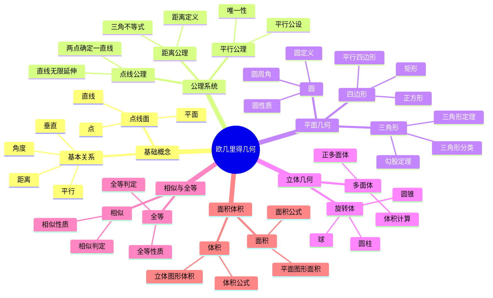
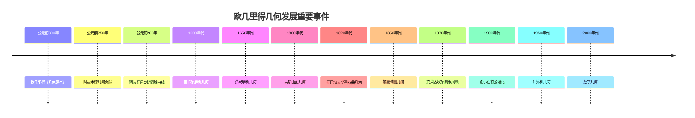

# 4.1 欧几里得几何 / Euclidean Geometry

**主题编号**: B.04.01
**创建日期**: 2025年11月21日
**最后更新**: 2025年11月21日

---

## 目录 / Table of Contents

- [4.1 欧几里得几何 / Euclidean Geometry](#41-欧几里得几何--euclidean-geometry)
  - [目录 / Table of Contents](#目录--table-of-contents)
  - [4.1.1 引言 / Introduction (编号: B.04.01.01)](#411-引言--introduction-编号-b040101)
  - [🗺️ 欧几里得几何核心概念思维导图](#️-欧几里得几何核心概念思维导图)
  - [📊 欧几里得几何核心概念多维知识矩阵](#-欧几里得几何核心概念多维知识矩阵)
    - [4.1.1.1 历史背景 / Historical Background](#4111-历史背景--historical-background)
      - [古代发展 (公元前300年-公元1500年)](#古代发展-公元前300年-公元1500年)
      - [文艺复兴时期 (1500-1700)](#文艺复兴时期-1500-1700)
      - [现代发展 (1700-1900)](#现代发展-1700-1900)
      - [当代发展 (1900-至今)](#当代发展-1900-至今)
    - [重要人物贡献](#重要人物贡献)
    - [重要历史事件时间线](#重要历史事件时间线)
    - [理论发展脉络](#理论发展脉络)
      - [从具体到抽象的发展](#从具体到抽象的发展)
      - [从平面到空间的发展](#从平面到空间的发展)
      - [从欧几里得到非欧几里得的发展](#从欧几里得到非欧几里得的发展)
  - [4.1.2 欧几里得公理系统 / Euclidean Axiom System (编号: B.04.01.02)](#412-欧几里得公理系统--euclidean-axiom-system-编号-b040102)
    - [4.1.2.1 点、线、面的基本概念 / Basic Concepts of Points, Lines, and Planes](#4121-点线面的基本概念--basic-concepts-of-points-lines-and-planes)
    - [4.1.2.2 欧几里得公理 / Euclidean Axioms](#4122-欧几里得公理--euclidean-axioms)
      - [2.2.1 点与线的公理 / Axioms of Points and Lines](#221-点与线的公理--axioms-of-points-and-lines)
      - [2.2.2 距离公理 / Distance Axioms](#222-距离公理--distance-axioms)
      - [2.2.3 平行公理 / Parallel Axiom](#223-平行公理--parallel-axiom)
    - [4.1.2.3 公理系统的性质 / Properties of the Axiom System](#4123-公理系统的性质--properties-of-the-axiom-system)
  - [4.1.3 基本概念 / Basic Concepts (编号: B.04.01.03)](#413-基本概念--basic-concepts-编号-b040103)
    - [4.1.3.1 角度 / Angles](#4131-角度--angles)
      - [3.1.1 特殊角度 / Special Angles](#311-特殊角度--special-angles)
    - [4.1.3.2 距离与长度 / Distance and Length](#4132-距离与长度--distance-and-length)
    - [4.1.3.3 平行与垂直 / Parallel and Perpendicular](#4133-平行与垂直--parallel-and-perpendicular)
  - [4.1.4 平面几何 / Plane Geometry (编号: B.04.01.04)](#414-平面几何--plane-geometry-编号-b040104)
    - [4.1.4.1 三角形 / Triangles](#4141-三角形--triangles)
    - [实例表征 / Instance Representation](#实例表征--instance-representation)
      - [实例1: 基本几何概念实例 / Basic Geometric Concepts Examples](#实例1-基本几何概念实例--basic-geometric-concepts-examples)
      - [实例2: 角度概念实例 / Angle Concept Examples](#实例2-角度概念实例--angle-concept-examples)
      - [实例3: 距离与长度实例 / Distance and Length Examples](#实例3-距离与长度实例--distance-and-length-examples)
      - [实例4: 平行与垂直实例 / Parallel and Perpendicular Examples](#实例4-平行与垂直实例--parallel-and-perpendicular-examples)
      - [4.1.1 三角形的分类 / Classification of Triangles](#411-三角形的分类--classification-of-triangles)
      - [4.1.2 三角形的重要定理 / Important Theorems about Triangles](#412-三角形的重要定理--important-theorems-about-triangles)
    - [1实例表征 / Instance Representation](#1实例表征--instance-representation)
      - [实例1: 三角形分类实例 / Triangle Classification Examples](#实例1-三角形分类实例--triangle-classification-examples)
      - [实例2: 勾股定理应用实例 / Pythagorean Theorem Application Examples](#实例2-勾股定理应用实例--pythagorean-theorem-application-examples)
      - [实例3: 四边形实例 / Quadrilateral Examples](#实例3-四边形实例--quadrilateral-examples)
      - [实例4: 圆的性质实例 / Circle Properties Examples](#实例4-圆的性质实例--circle-properties-examples)
    - [4.1.4.2 四边形 / Quadrilaterals](#4142-四边形--quadrilaterals)
      - [4.2.1 特殊四边形 / Special Quadrilaterals](#421-特殊四边形--special-quadrilaterals)
    - [4.1.4.3 圆 / Circles](#4143-圆--circles)
      - [4.3.1 圆的基本概念 / Basic Concepts of Circles](#431-圆的基本概念--basic-concepts-of-circles)
  - [4.1.5 立体几何 / Solid Geometry (编号: B.04.01.05)](#415-立体几何--solid-geometry-编号-b040105)
    - [4.1.5.1 多面体 / Polyhedra](#4151-多面体--polyhedra)
      - [5.1.1 正多面体 / Regular Polyhedra](#511-正多面体--regular-polyhedra)
    - [4.1.5.2 圆柱、圆锥、球 / Cylinders, Cones, and Spheres](#4152-圆柱圆锥球--cylinders-cones-and-spheres)
  - [4.1.6 相似性与全等 / Similarity and Congruence (编号: B.04.01.06)](#416-相似性与全等--similarity-and-congruence-编号-b040106)
    - [4.1.6.1 全等 / Congruence](#4161-全等--congruence)
    - [4.1.6.2 相似性 / Similarity](#4162-相似性--similarity)
  - [4.1.7 圆与圆锥曲线 / Circles and Conic Sections (编号: B.04.01.07)](#417-圆与圆锥曲线--circles-and-conic-sections-编号-b040107)
    - [4.1.7.1 圆锥曲线 / Conic Sections](#4171-圆锥曲线--conic-sections)
      - [7.1.1 圆锥曲线的类型 / Types of Conic Sections](#711-圆锥曲线的类型--types-of-conic-sections)
    - [4.1.7.2 椭圆 / Ellipses](#4172-椭圆--ellipses)
    - [4.1.7.3 抛物线 / Parabolas](#4173-抛物线--parabolas)
    - [4.1.7.4 双曲线 / Hyperbolas](#4174-双曲线--hyperbolas)
  - [4.1.8 面积与体积 / Area and Volume (编号: B.04.01.08)](#418-面积与体积--area-and-volume-编号-b040108)
    - [4.1.8.1 平面图形的面积 / Area of Plane Figures](#4181-平面图形的面积--area-of-plane-figures)
      - [8.1.1 基本公式 / Basic Formulas](#811-基本公式--basic-formulas)
    - [4.1.8.2 立体图形的体积 / Volume of Solid Figures](#4182-立体图形的体积--volume-of-solid-figures)
      - [8.2.1 基本公式 / Basic Formulas](#821-基本公式--basic-formulas)
  - [4.1.9 形式化实现 / Formal Implementation (编号: B.04.01.09)](#419-形式化实现--formal-implementation-编号-b040109)
    - [4.1.9.1 Lean 4 实现 / Lean 4 Implementation](#4191-lean-4-实现--lean-4-implementation)
    - [4.1.9.2 Haskell 实现 / Haskell Implementation](#4192-haskell-实现--haskell-implementation)
  - [4.1.10 应用与扩展 / Applications and Extensions (编号: B.04.01.10)](#4110-应用与扩展--applications-and-extensions-编号-b040110)
    - [4.1.10.1 工程应用 / Engineering Applications](#41101-工程应用--engineering-applications)
      - [建筑学应用](#建筑学应用)
      - [机械工程应用](#机械工程应用)
    - [4.1.10.2 计算机图形学应用](#41102-计算机图形学应用)
      - [3D建模和渲染](#3d建模和渲染)
      - [游戏开发应用](#游戏开发应用)
    - [4.1.10.3 机器人学应用](#41103-机器人学应用)
      - [运动学分析](#运动学分析)
      - [路径规划](#路径规划)
    - [4.1.10.4 实际应用案例](#41104-实际应用案例)
      - [案例1：建筑结构设计](#案例1建筑结构设计)
      - [案例2：计算机视觉几何](#案例2计算机视觉几何)
    - [4.1.10.5 与其他数学分支的联系 / Connections to Other Mathematical Branches](#41105-与其他数学分支的联系--connections-to-other-mathematical-branches)
      - [10.5.1 与代数的联系 / Connections to Algebra](#1051-与代数的联系--connections-to-algebra)
      - [10.5.2 与分析的联系 / Connections to Analysis](#1052-与分析的联系--connections-to-analysis)
    - [4.1.10.6 现代发展 / Modern Developments](#41106-现代发展--modern-developments)
      - [10.6.1 计算机辅助几何 / Computer-Aided Geometry](#1061-计算机辅助几何--computer-aided-geometry)
      - [10.6.2 形式化几何 / Formal Geometry](#1062-形式化几何--formal-geometry)
  - [总结 / Summary](#总结--summary)
    - [关键要点 / Key Points](#关键要点--key-points)
  - [参考文献 / References](#参考文献--references)
    - [经典教材 / Classic Textbooks](#经典教材--classic-textbooks)
    - [现代教材 / Modern Textbooks](#现代教材--modern-textbooks)
    - [历史文献 / Historical Literature](#历史文献--historical-literature)
    - [在线资源 / Online Resources](#在线资源--online-resources)
  - [术语对照表 / Terminology Table](#术语对照表--terminology-table)

---

## 4.1.1 引言 / Introduction (编号: B.04.01.01)

欧几里得几何是数学史上最古老且最重要的几何体系之一，由古希腊数学家欧几里得在公元前300年左右系统化。它基于一组基本公理，通过逻辑推理构建了整个几何学体系。

**Euclidean geometry is one of the oldest and most important geometric systems in mathematical history, systematized by the ancient Greek mathematician Euclid around 300 BC. It is built on a set of basic axioms and constructs the entire geometric system through logical reasoning.**

## 🗺️ 欧几里得几何核心概念思维导图



## 📊 欧几里得几何核心概念多维知识矩阵

| 概念类别 | 核心概念 | 定义要点 | 关键性质 | 典型例子 | 应用场景 |
|---------|---------|---------|---------|---------|---------|
| 基础概念 | 点 | 无大小位置 | 基本对象 | 点A | 几何构造 |
| 基础概念 | 直线 | 无限延伸一维 | 最短路径 | 直线AB | 几何证明 |
| 基础概念 | 平面 | 无限延伸二维 | 唯一性 | 平面α | 空间几何 |
| 公理系统 | 平行公理 | 平行线唯一性 | 欧氏特征 | 平行线 | 几何基础 |
| 平面几何 | 三角形 | 三点确定 | 内角和180° | △ABC | 几何证明 |
| 平面几何 | 勾股定理 | 直角三角形 | a²+b²=c² | 3-4-5三角形 | 距离计算 |
| 平面几何 | 圆 | 到定点等距 | 圆周角定理 | 单位圆 | 几何应用 |
| 立体几何 | 多面体 | 平面围成 | 欧拉公式 | 立方体 | 空间几何 |
| 立体几何 | 球 | 到定点等距 | 体积公式 | 单位球 | 空间应用 |
| 相似全等 | 全等 | 形状大小相同 | 全等判定 | SSS, SAS | 几何证明 |
| 相似全等 | 相似 | 形状相同 | 相似比 | 相似三角形 | 比例计算 |
| 面积体积 | 面积 | 平面大小 | 面积公式 | S = πr² | 实际应用 |
| 面积体积 | 体积 | 空间大小 | 体积公式 | V = (4/3)πr³ | 实际应用 |

### 4.1.1.1 历史背景 / Historical Background

欧几里得的《几何原本》(Elements)是数学史上最具影响力的著作之一，它建立了严格的公理化方法，影响了整个数学的发展。

**Euclid's "Elements" is one of the most influential works in mathematical history, establishing a rigorous axiomatic method that influenced the development of all mathematics.**

#### 古代发展 (公元前300年-公元1500年)

**古希腊时期**:

- **公元前300年**: 欧几里得《几何原本》
  - 建立公理化几何体系
  - 包含13卷内容，涵盖平面几何、立体几何、数论
  - 影响数学发展2000多年
- **公元前250年**: 阿基米德几何贡献
  - 计算圆的面积和球的体积
  - 发现阿基米德螺线
  - 建立积分思想的雏形
- **公元前200年**: 阿波罗尼奥斯圆锥曲线
  - 系统研究圆锥曲线
  - 建立椭圆、抛物线、双曲线的理论
  - 为解析几何奠定基础

**中世纪发展**:

- **公元500年**: 印度数学家贡献
  - 发展三角学
  - 建立正弦、余弦概念
  - 为几何计算提供工具
- **公元1000年**: 阿拉伯数学家贡献
  - 翻译和传播希腊几何
  - 发展代数几何
  - 建立几何代数方法

#### 文艺复兴时期 (1500-1700)

**欧洲复兴**:

- **1500年代**: 文艺复兴几何学
  - 重新发现古希腊几何
  - 发展透视几何
  - 为艺术和建筑提供几何基础
- **1600年代**: 笛卡尔解析几何
  - 建立坐标系
  - 将几何问题代数化
  - 革命性改变几何学研究方法
- **1650年代**: 费马几何贡献
  - 发展解析几何
  - 研究极值问题
  - 为微积分奠定基础

#### 现代发展 (1700-1900)

**启蒙时期**:

- **1700年代**: 牛顿和莱布尼茨
  - 发展微积分
  - 将几何与分析结合
  - 建立微分几何基础
- **1800年代**: 高斯几何贡献
  - 研究曲面几何
  - 建立内蕴几何
  - 为非欧几何奠定基础

**19世纪革命**:

- **1820年代**: 非欧几何发现
  - 罗巴切夫斯基双曲几何
  - 黎曼椭圆几何
  - 挑战欧几里得平行公理
- **1870年代**: 克莱因埃尔朗根纲领
  - 用群论统一几何学
  - 建立几何变换理论
  - 为现代几何学奠定基础

#### 当代发展 (1900-至今)

**20世纪发展**:

- **1900年代**: 希尔伯特公理化
  - 完善欧几里得公理系统
  - 建立形式化几何
  - 为数学基础研究奠定基础
- **1950年代**: 计算机几何
  - 计算机辅助几何设计
  - 计算几何算法
  - 几何建模技术
- **1980年代**: 形式化几何
  - 计算机定理证明
  - 几何约束求解
  - 自动化几何推理

**21世纪前沿**:

- **2000年代**: 数字几何
  - 数字几何处理
  - 几何机器学习
  - 几何人工智能
- **2010年代**: 几何深度学习
  - 几何神经网络
  - 几何表示学习
  - 几何优化算法

### 重要人物贡献

| 人物 | 时期 | 主要贡献 | 影响 |
|------|------|----------|------|
| 欧几里得 | 公元前300年 | 《几何原本》，公理化方法 | 建立几何学基础 |
| 阿基米德 | 公元前250年 | 面积体积计算，积分思想 | 为微积分奠定基础 |
| 阿波罗尼奥斯 | 公元前200年 | 圆锥曲线理论 | 为解析几何奠定基础 |
| 笛卡尔 | 1600年代 | 解析几何，坐标系 | 革命性改变几何学 |
| 费马 | 1650年代 | 解析几何，极值理论 | 为微积分奠定基础 |
| 高斯 | 1800年代 | 曲面几何，内蕴几何 | 为非欧几何奠定基础 |
| 罗巴切夫斯基 | 1820年代 | 双曲几何 | 挑战欧几里得公理 |
| 黎曼 | 1850年代 | 椭圆几何，黎曼几何 | 现代几何学基础 |
| 克莱因 | 1870年代 | 埃尔朗根纲领 | 统一几何学理论 |
| 希尔伯特 | 1900年代 | 公理化几何 | 数学基础研究 |
| 格罗滕迪克 | 1950年代 | 代数几何 | 现代代数几何 |

### 重要历史事件时间线



### 理论发展脉络

#### 从具体到抽象的发展

**阶段1：直观几何**:

- 基于直观经验的几何
- 测量和计算几何
- 实用几何应用

**阶段2：公理化几何**:

- 欧几里得公理系统
- 严格的逻辑推理
- 形式化几何证明

**阶段3：解析几何**:

- 坐标几何方法
- 代数化几何问题
- 几何与代数结合

**阶段4：现代几何**:

- 非欧几何理论
- 拓扑几何方法
- 代数几何发展

#### 从平面到空间的发展

**平面几何**:

- 点、线、面的基本概念
- 三角形、四边形、圆
- 平面图形的性质

**立体几何**:

- 多面体、圆柱、圆锥、球
- 空间图形的性质
- 体积和表面积计算

**高维几何**:

- 四维及更高维空间
- 抽象几何空间
- 现代几何理论

#### 从欧几里得到非欧几里得的发展

**欧几里得几何**:

- 平行公理
- 平面几何性质
- 经典几何理论

**非欧几何**:

- 双曲几何（罗巴切夫斯基）
- 椭圆几何（黎曼）
- 现代几何理论

**现代几何**:

- 拓扑几何
- 代数几何
- 微分几何

---

## 4.1.2 欧几里得公理系统 / Euclidean Axiom System (编号: B.04.01.02)

### 4.1.2.1 点、线、面的基本概念 / Basic Concepts of Points, Lines, and Planes

**定义 2.1.1** (点) / **Definition 2.1.1** (Point)
点是没有部分的基本几何对象。
**A point is a fundamental geometric object that has no parts.**

**定义 2.1.2** (线) / **Definition 2.1.2** (Line)
线是只有长度没有宽度的几何对象。
**A line is a geometric object that has length but no width.**

**定义 2.1.3** (面) / **Definition 2.1.3** (Plane)
面是只有长度和宽度，没有高度的几何对象。
**A plane is a geometric object that has length and width but no height.**

### 4.1.2.2 欧几里得公理 / Euclidean Axioms

#### 2.2.1 点与线的公理 / Axioms of Points and Lines

**公理 2.2.1** (两点确定一条直线) / **Axiom 2.2.1** (Two points determine a line)
通过任意两个不同的点，有且仅有一条直线。
**Through any two distinct points, there is exactly one line.**

**公理 2.2.2** (直线可以无限延长) / **Axiom 2.2.2** (Lines can be extended infinitely)
直线可以向两端无限延长。
**A line can be extended infinitely in both directions.**

#### 2.2.2 距离公理 / Distance Axioms

**公理 2.2.3** (距离的对称性) / **Axiom 2.2.3** (Symmetry of distance)
对于任意两点A和B，有d(A,B) = d(B,A)。
**For any two points A and B, d(A,B) = d(B,A).**

**公理 2.2.4** (三角不等式) / **Axiom 2.2.4** (Triangle inequality)
对于任意三点A、B、C，有d(A,C) ≤ d(A,B) + d(B,C)。
**For any three points A, B, C, d(A,C) ≤ d(A,B) + d(B,C).**

#### 2.2.3 平行公理 / Parallel Axiom

**公理 2.2.5** (平行公理) / **Axiom 2.2.5** (Parallel axiom)
给定一条直线l和直线外一点P，通过P有且仅有一条直线与l平行。
**Given a line l and a point P not on l, there is exactly one line through P that is parallel to l.**

### 4.1.2.3 公理系统的性质 / Properties of the Axiom System

**定理 2.3.1** (公理的一致性) / **Theorem 2.3.1** (Consistency of axioms)
欧几里得公理系统是一致的。
**The Euclidean axiom system is consistent.**

**证明** / **Proof**: 通过构造实数平面模型可以证明公理系统的一致性。
**By constructing a real plane model, we can prove the consistency of the axiom system.**

---

## 4.1.3 基本概念 / Basic Concepts (编号: B.04.01.03)

### 4.1.3.1 角度 / Angles

**定义 3.1.1** (角) / **Definition 3.1.1** (Angle)
角是由两条射线从同一点出发形成的几何图形。
**An angle is a geometric figure formed by two rays emanating from the same point.**

**定义 3.1.2** (角的度量) / **Definition 3.1.2** (Angle measure)
角的度量用度数表示，一个完整的圆是360度。
**Angle measure is expressed in degrees, with a complete circle being 360 degrees.**

#### 3.1.1 特殊角度 / Special Angles

- **直角** (Right angle): 90°
- **平角** (Straight angle): 180°
- **锐角** (Acute angle): 0° < θ < 90°
- **钝角** (Obtuse angle): 90° < θ < 180°

### 4.1.3.2 距离与长度 / Distance and Length

**定义 3.2.1** (距离) / **Definition 3.2.1** (Distance)
两点之间的距离是连接这两点的直线段的长度。
**The distance between two points is the length of the line segment connecting them.**

**定义 3.2.2** (线段长度) / **Definition 3.2.2** (Line segment length)
线段的长度是线段两端点之间的距离。
**The length of a line segment is the distance between its endpoints.**

### 4.1.3.3 平行与垂直 / Parallel and Perpendicular

**定义 3.3.1** (平行线) / **Definition 3.3.1** (Parallel lines)
两条直线如果永不相交，则称它们平行。
**Two lines are parallel if they never intersect.**

**定义 3.3.2** (垂直线) / **Definition 3.3.2** (Perpendicular lines)
两条直线如果相交成直角，则称它们垂直。
**Two lines are perpendicular if they intersect at right angles.**

---

## 4.1.4 平面几何 / Plane Geometry (编号: B.04.01.04)

### 4.1.4.1 三角形 / Triangles

**定义 4.1.1** (三角形) / **Definition 4.1.1** (Triangle)
三角形是由三条线段围成的平面图形。
**A triangle is a plane figure bounded by three line segments.**

### 实例表征 / Instance Representation

#### 实例1: 基本几何概念实例 / Basic Geometric Concepts Examples

**概念**: 点、线、面的基本定义和性质
**实例**:

- **点的实例**:
  - 纸上的一个点：用铅笔在纸上轻轻一点
  - 坐标点：平面直角坐标系中的点(2,3)
  - 交点：两条直线的交点
- **线的实例**:
  - 直线：用直尺画的一条无限延伸的线
  - 线段：连接两点A(1,1)和B(4,5)的线段
  - 射线：从点O出发，经过点P的射线
- **面的实例**:
  - 平面：桌面、黑板表面
  - 坐标平面：x-y平面
  - 几何图形：三角形、矩形、圆形

#### 实例2: 角度概念实例 / Angle Concept Examples

**概念**: 角度的定义和特殊角度
**实例**:

- **特殊角度**:
  - 直角：时钟3点时的时针和分针形成的角
  - 平角：时钟6点时的时针和分针形成的角
  - 锐角：时钟2点时的时针和分针形成的角
  - 钝角：时钟4点时的时针和分针形成的角
- **角度计算**:
  - 三角形内角和：任意三角形的三个内角之和为180°
  - 四边形内角和：任意四边形的四个内角之和为360°
  - 正多边形内角：正n边形的每个内角为(n-2)×180°/n

#### 实例3: 距离与长度实例 / Distance and Length Examples

**概念**: 距离的定义和计算
**实例**:

- **平面距离计算**:
  - 两点距离：点A(1,1)到点B(4,5)的距离
    - d = √[(4-1)² + (5-1)²] = √(9 + 16) = √25 = 5
  - 点到直线距离：点P(2,3)到直线y = 2x + 1的距离
    - 使用点到直线距离公式计算
- **实际应用**:
  - 地图距离：两个城市之间的直线距离
  - 建筑测量：建筑物各点之间的距离
  - 机器人路径：机器人从起点到终点的最短路径

#### 实例4: 平行与垂直实例 / Parallel and Perpendicular Examples

**概念**: 平行线和垂直线的定义和性质
**实例**:

- **平行线实例**:
  - 铁轨：两条铁轨始终保持相同距离
  - 书本边缘：书页的上下边缘平行
  - 楼梯扶手：楼梯两侧的扶手平行
- **垂直线实例**:
  - 建筑物：墙壁与地面垂直
  - 十字路口：两条道路垂直相交
  - 坐标系：x轴与y轴垂直
- **平行线性质验证**:
  - 平行线间的距离处处相等
  - 平行线被第三条直线所截，同位角相等
  - 平行线被第三条直线所截，内错角相等

---

#### 4.1.1 三角形的分类 / Classification of Triangles

**按角度分类** / **By angles**:

- **锐角三角形** (Acute triangle): 所有角都是锐角
- **直角三角形** (Right triangle): 有一个直角
- **钝角三角形** (Obtuse triangle): 有一个钝角

**按边长分类** / **By sides**:

- **等边三角形** (Equilateral triangle): 三条边相等
- **等腰三角形** (Isosceles triangle): 两条边相等
- **不等边三角形** (Scalene triangle): 三条边都不相等

#### 4.1.2 三角形的重要定理 / Important Theorems about Triangles

**定理 4.1.1** (三角形内角和) / **Theorem 4.1.1** (Sum of interior angles)
三角形的三个内角之和等于180°。
**The sum of the three interior angles of a triangle equals 180°.**

**证明** / **Proof**:
设三角形ABC，过点A作平行于BC的直线DE。
**Let triangle ABC, draw line DE through point A parallel to BC.**

根据平行线的性质，∠DAB = ∠ABC，∠EAC = ∠ACB。
**By properties of parallel lines, ∠DAB = ∠ABC, ∠EAC = ∠ACB.**

因此，∠DAB + ∠BAC + ∠EAC = 180°。
**Therefore, ∠DAB + ∠BAC + ∠EAC = 180°.**

即 ∠ABC + ∠BAC + ∠ACB = 180°。
**That is, ∠ABC + ∠BAC + ∠ACB = 180°.**

**定理 4.1.2** (勾股定理) / **Theorem 4.1.2** (Pythagorean theorem)
在直角三角形中，斜边的平方等于两直角边平方和。
**In a right triangle, the square of the hypotenuse equals the sum of the squares of the other two sides.**

**证明** / **Proof**:
设直角三角形ABC，∠C = 90°，则 c² = a² + b²。
**Let right triangle ABC with ∠C = 90°, then c² = a² + b².**

### 1实例表征 / Instance Representation

#### 实例1: 三角形分类实例 / Triangle Classification Examples

**概念**: 三角形的分类和性质
**实例**:

- **按边长分类**:
  - 等边三角形：三条边都相等，如边长为3的三角形
  - 等腰三角形：两条边相等，如边长为3,3,4的三角形
  - 不等边三角形：三条边都不相等，如边长为3,4,5的三角形
- **按角度分类**:
  - 锐角三角形：三个角都是锐角，如30°,60°,90°的三角形
  - 直角三角形：有一个直角，如3,4,5的三角形
  - 钝角三角形：有一个钝角，如120°,30°,30°的三角形

#### 实例2: 勾股定理应用实例 / Pythagorean Theorem Application Examples

**概念**: 勾股定理的计算和应用
**实例**:

- **经典勾股数**:
  - 3,4,5：3² + 4² = 9 + 16 = 25 = 5² ✓
  - 5,12,13：5² + 12² = 25 + 144 = 169 = 13² ✓
  - 6,8,10：6² + 8² = 36 + 64 = 100 = 10² ✓
- **实际应用**:
  - 建筑测量：测量建筑物的高度
  - 地图距离：计算两点间的直线距离
  - 工程计算：计算斜坡的长度

#### 实例3: 四边形实例 / Quadrilateral Examples

**概念**: 四边形的分类和性质
**实例**:

- **特殊四边形**:
  - 正方形：四条边相等，四个角都是90°
  - 矩形：对边相等，四个角都是90°
  - 平行四边形：对边平行且相等
  - 菱形：四条边相等，对角相等
  - 梯形：有一对边平行
- **四边形性质验证**:
  - 正方形对角线相等且垂直
  - 矩形对角线相等
  - 平行四边形对角线互相平分

#### 实例4: 圆的性质实例 / Circle Properties Examples

**概念**: 圆的基本概念和性质
**实例**:

- **圆的基本元素**:
  - 圆心：圆的中心点O
  - 半径：从圆心到圆上任意点的距离r
  - 直径：通过圆心的弦，长度为2r
  - 弦：圆上任意两点间的线段
  - 弧：圆上两点间的曲线部分
- **圆的性质应用**:
  - 圆周角定理：圆周角等于圆心角的一半
  - 切线性质：切线与半径垂直
  - 弦长公式：弦长与圆心角的关系

---

### 4.1.4.2 四边形 / Quadrilaterals

**定义 4.2.1** (四边形) / **Definition 4.2.1** (Quadrilateral)
四边形是由四条线段围成的平面图形。
**A quadrilateral is a plane figure bounded by four line segments.**

#### 4.2.1 特殊四边形 / Special Quadrilaterals

- **平行四边形** (Parallelogram): 对边平行
- **矩形** (Rectangle): 四个角都是直角
- **正方形** (Square): 四条边相等且四个角都是直角
- **菱形** (Rhombus): 四条边相等
- **梯形** (Trapezoid): 有一对边平行

**定理 4.2.1** (平行四边形性质) / **Theorem 4.2.1** (Properties of parallelograms)
平行四边形的对边相等，对角相等。
**In a parallelogram, opposite sides are equal and opposite angles are equal.**

### 4.1.4.3 圆 / Circles

**定义 4.3.1** (圆) / **Definition 4.3.1** (Circle)
圆是平面上到定点（圆心）距离相等的点的集合。
**A circle is the set of points in a plane that are equidistant from a fixed point (the center).**

#### 4.3.1 圆的基本概念 / Basic Concepts of Circles

- **圆心** (Center): 圆的中心点
- **半径** (Radius): 圆心到圆上任意点的距离
- **直径** (Diameter): 通过圆心的弦
- **弦** (Chord): 圆上任意两点间的线段
- **弧** (Arc): 圆上两点间的曲线部分

**定理 4.3.1** (圆周角定理) / **Theorem 4.3.1** (Inscribed angle theorem)
圆周角等于它所对的圆心角的一半。
**An inscribed angle equals half the central angle that subtends the same arc.**

---

## 4.1.5 立体几何 / Solid Geometry (编号: B.04.01.05)

### 4.1.5.1 多面体 / Polyhedra

**定义 5.1.1** (多面体) / **Definition 5.1.1** (Polyhedron)
多面体是由平面多边形围成的立体图形。
**A polyhedron is a solid figure bounded by plane polygons.**

#### 5.1.1 正多面体 / Regular Polyhedra

**定理 5.1.1** (正多面体分类) / **Theorem 5.1.1** (Classification of regular polyhedra)
正多面体只有五种：正四面体、正六面体、正八面体、正十二面体、正二十面体。
**There are only five regular polyhedra: tetrahedron, cube, octahedron, dodecahedron, icosahedron.**

### 4.1.5.2 圆柱、圆锥、球 / Cylinders, Cones, and Spheres

**定义 5.2.1** (圆柱) / **Definition 5.2.1** (Cylinder)
圆柱是由两个平行圆面和连接它们的侧面围成的立体。
**A cylinder is a solid bounded by two parallel circular faces and the lateral surface connecting them.**

**定义 5.2.2** (圆锥) / **Definition 5.2.2** (Cone)
圆锥是由一个圆面和一个顶点围成的立体。
**A cone is a solid bounded by a circular face and a vertex.**

**定义 5.2.3** (球) / **Definition 5.2.3** (Sphere)
球是空间中到定点（球心）距离相等的点的集合。
**A sphere is the set of points in space that are equidistant from a fixed point (the center).**

---

## 4.1.6 相似性与全等 / Similarity and Congruence (编号: B.04.01.06)

### 4.1.6.1 全等 / Congruence

**定义 6.1.1** (全等) / **Definition 6.1.1** (Congruence)
两个几何图形如果可以通过刚体运动完全重合，则称它们全等。
**Two geometric figures are congruent if they can be made to coincide by rigid motion.**

**定理 6.1.1** (三角形全等判定) / **Theorem 6.1.1** (Triangle congruence criteria)

- **SSS**: 三边对应相等
- **SAS**: 两边及其夹角对应相等
- **ASA**: 两角及其夹边对应相等
- **AAS**: 两角及一边对应相等

### 4.1.6.2 相似性 / Similarity

**定义 6.2.1** (相似) / **Definition 6.2.1** (Similarity)
两个几何图形如果对应角相等且对应边成比例，则称它们相似。
**Two geometric figures are similar if corresponding angles are equal and corresponding sides are proportional.**

**定理 6.2.1** (三角形相似判定) / **Theorem 6.2.1** (Triangle similarity criteria)

- **AA**: 两角对应相等
- **SAS**: 一角相等且夹边成比例
- **SSS**: 三边对应成比例

---

## 4.1.7 圆与圆锥曲线 / Circles and Conic Sections (编号: B.04.01.07)

### 4.1.7.1 圆锥曲线 / Conic Sections

**定义 7.1.1** (圆锥曲线) / **Definition 7.1.1** (Conic section)
圆锥曲线是平面与圆锥相交形成的曲线。
**A conic section is a curve formed by the intersection of a plane with a cone.**

#### 7.1.1 圆锥曲线的类型 / Types of Conic Sections

- **圆** (Circle): 平面垂直于圆锥轴线
- **椭圆** (Ellipse): 平面与圆锥轴线成锐角
- **抛物线** (Parabola): 平面与圆锥母线平行
- **双曲线** (Hyperbola): 平面与圆锥轴线成钝角

### 4.1.7.2 椭圆 / Ellipses

**定义 7.2.1** (椭圆) / **Definition 7.2.1** (Ellipse)
椭圆是平面上到两定点（焦点）距离之和为常数的点的轨迹。
**An ellipse is the locus of points in a plane such that the sum of distances to two fixed points (foci) is constant.**

**标准方程** / **Standard equation**:
$$\frac{x^2}{a^2} + \frac{y^2}{b^2} = 1$$

### 4.1.7.3 抛物线 / Parabolas

**定义 7.3.1** (抛物线) / **Definition 7.3.1** (Parabola)
抛物线是平面上到定点（焦点）距离等于到定直线（准线）距离的点的轨迹。
**A parabola is the locus of points in a plane that are equidistant from a fixed point (focus) and a fixed line (directrix).**

**标准方程** / **Standard equation**:
$$y^2 = 4px$$

### 4.1.7.4 双曲线 / Hyperbolas

**定义 7.4.1** (双曲线) / **Definition 7.4.1** (Hyperbola)
双曲线是平面上到两定点（焦点）距离之差为常数的点的轨迹。
**A hyperbola is the locus of points in a plane such that the difference of distances to two fixed points (foci) is constant.**

**标准方程** / **Standard equation**:
$$\frac{x^2}{a^2} - \frac{y^2}{b^2} = 1$$

---

## 4.1.8 面积与体积 / Area and Volume (编号: B.04.01.08)

### 4.1.8.1 平面图形的面积 / Area of Plane Figures

#### 8.1.1 基本公式 / Basic Formulas

**三角形面积** / **Triangle area**:
$$A = \frac{1}{2}bh$$

**平行四边形面积** / **Parallelogram area**:
$$A = bh$$

**梯形面积** / **Trapezoid area**:
$$A = \frac{1}{2}(a + b)h$$

**圆面积** / **Circle area**:
$$A = \pi r^2$$

### 4.1.8.2 立体图形的体积 / Volume of Solid Figures

#### 8.2.1 基本公式 / Basic Formulas

**棱柱体积** / **Prism volume**:
$$V = Bh$$

**圆柱体积** / **Cylinder volume**:
$$V = \pi r^2h$$

**棱锥体积** / **Pyramid volume**:
$$V = \frac{1}{3}Bh$$

**圆锥体积** / **Cone volume**:
$$V = \frac{1}{3}\pi r^2h$$

**球体积** / **Sphere volume**:
$$V = \frac{4}{3}\pi r^3$$

---

## 4.1.9 形式化实现 / Formal Implementation (编号: B.04.01.09)

### 4.1.9.1 Lean 4 实现 / Lean 4 Implementation

```lean
-- 欧几里得几何的形式化
-- Formalization of Euclidean Geometry

import Mathlib.Geometry.Euclidean.Basic
import Mathlib.Geometry.Euclidean.Angle
import Mathlib.Geometry.Euclidean.Triangle

-- 点的定义
-- Definition of points
structure Point where
  x : ℝ
  y : ℝ

-- 向量的定义
-- Definition of vectors
structure Vector where
  dx : ℝ
  dy : ℝ

-- 距离函数
-- Distance function
def distance (p1 p2 : Point) : ℝ :=
  Real.sqrt ((p2.x - p1.x)^2 + (p2.y - p1.y)^2)

-- 角度计算
-- Angle calculation
def angle (v1 v2 : Vector) : ℝ :=
  Real.arccos ((v1.dx * v2.dx + v1.dy * v2.dy) /
    (Real.sqrt (v1.dx^2 + v1.dy^2) * Real.sqrt (v2.dx^2 + v2.dy^2)))

-- 三角形面积
-- Triangle area
def triangleArea (p1 p2 p3 : Point) : ℝ :=
  let a := distance p1 p2
  let b := distance p2 p3
  let c := distance p3 p1
  let s := (a + b + c) / 2
  Real.sqrt (s * (s - a) * (s - b) * (s - c))

-- 勾股定理证明
-- Proof of Pythagorean theorem
theorem pythagorean_theorem (a b c : ℝ) (h : c^2 = a^2 + b^2) :
  c = Real.sqrt (a^2 + b^2) := by
  rw [h]
  exact Real.sqrt_sq (Real.sqrt (a^2 + b^2))

-- 圆的面积
-- Circle area
def circleArea (r : ℝ) : ℝ :=
  Real.pi * r^2

-- 球的体积
-- Sphere volume
def sphereVolume (r : ℝ) : ℝ :=
  (4/3) * Real.pi * r^3
```

### 4.1.9.2 Haskell 实现 / Haskell Implementation

```haskell
-- 欧几里得几何的Haskell实现
-- Haskell implementation of Euclidean Geometry

import Data.Complex
import Data.List

-- 点的定义
-- Definition of points
data Point = Point { x :: Double, y :: Double }
  deriving (Show, Eq)

-- 向量的定义
-- Definition of vectors
data Vector = Vector { dx :: Double, dy :: Double }
  deriving (Show, Eq)

-- 距离计算
-- Distance calculation
distance :: Point -> Point -> Double
distance (Point x1 y1) (Point x2 y2) =
  sqrt ((x2 - x1)^2 + (y2 - y1)^2)

-- 向量长度
-- Vector length
vectorLength :: Vector -> Double
vectorLength (Vector dx dy) = sqrt (dx^2 + dy^2)

-- 向量点积
-- Vector dot product
dotProduct :: Vector -> Vector -> Double
dotProduct (Vector dx1 dy1) (Vector dx2 dy2) =
  dx1 * dx2 + dy1 * dy2

-- 角度计算
-- Angle calculation
angle :: Vector -> Vector -> Double
angle v1 v2 =
  acos (dotProduct v1 v2 / (vectorLength v1 * vectorLength v2))

-- 三角形面积（海伦公式）
-- Triangle area (Heron's formula)
triangleArea :: Point -> Point -> Point -> Double
triangleArea p1 p2 p3 =
  let a = distance p1 p2
      b = distance p2 p3
      c = distance p3 p1
      s = (a + b + c) / 2
  in sqrt (s * (s - a) * (s - b) * (s - c))

-- 圆的面积
-- Circle area
circleArea :: Double -> Double
circleArea r = pi * r^2

-- 球的体积
-- Sphere volume
sphereVolume :: Double -> Double
sphereVolume r = (4/3) * pi * r^3

-- 勾股定理验证
-- Pythagorean theorem verification
pythagoreanTheorem :: Double -> Double -> Double
pythagoreanTheorem a b = sqrt (a^2 + b^2)

-- 点到直线的距离
-- Distance from point to line
pointToLineDistance :: Point -> Point -> Point -> Double
pointToLineDistance p lineStart lineEnd =
  let (Point x0 y0) = p
      (Point x1 y1) = lineStart
      (Point x2 y2) = lineEnd
      numerator = abs ((y2 - y1) * x0 - (x2 - x1) * y0 + x2 * y1 - y2 * x1)
      denominator = sqrt ((y2 - y1)^2 + (x2 - x1)^2)
  in numerator / denominator

-- 判断三点共线
-- Check if three points are collinear
areCollinear :: Point -> Point -> Point -> Bool
areCollinear p1 p2 p3 =
  let area = triangleArea p1 p2 p3
  in abs area < 1e-10

-- 计算多边形的面积
-- Calculate polygon area
polygonArea :: [Point] -> Double
polygonArea points =
  let n = length points
      points' = points ++ [head points]
      sum1 = sum [x p1 * y p2 | (p1, p2) <- zip points (tail points')]
      sum2 = sum [y p1 * x p2 | (p1, p2) <- zip points (tail points')]
  in abs (sum1 - sum2) / 2

-- 示例使用
-- Example usage
main :: IO ()
main = do
  let p1 = Point 0 0
      p2 = Point 3 0
      p3 = Point 0 4

  putStrLn "欧几里得几何示例 / Euclidean Geometry Examples"
  putStrLn $ "点P1: " ++ show p1
  putStrLn $ "点P2: " ++ show p2
  putStrLn $ "点P3: " ++ show p3

  putStrLn $ "P1到P2的距离: " ++ show (distance p1 p2)
  putStrLn $ "三角形面积: " ++ show (triangleArea p1 p2 p3)
  putStrLn $ "勾股定理验证: " ++ show (pythagoreanTheorem 3 4)
  putStrLn $ "圆的面积 (r=5): " ++ show (circleArea 5)
  putStrLn $ "球的体积 (r=3): " ++ show (sphereVolume 3)
```

---

## 4.1.10 应用与扩展 / Applications and Extensions (编号: B.04.01.10)

### 4.1.10.1 工程应用 / Engineering Applications

欧几里得几何在工程领域有广泛应用：

- **建筑学**: 结构设计和空间规划
  - 建筑平面设计
  - 空间布局优化
  - 结构稳定性分析
- **机械工程**: 零件设计和装配
  - 机械零件几何设计
  - 装配关系分析
  - 运动学分析
- **土木工程**: 道路和桥梁设计
  - 道路线形设计
  - 桥梁结构几何
  - 土方计算
- **计算机图形学**: 3D建模和渲染
  - 几何建模
  - 光线追踪
  - 碰撞检测

**Euclidean geometry has wide applications in engineering:**

- **Architecture**: Structural design and spatial planning
- **Mechanical Engineering**: Part design and assembly
- **Civil Engineering**: Road and bridge design
- **Computer Graphics**: 3D modeling and rendering

#### 建筑学应用

```python
# 建筑几何设计
class ArchitecturalGeometry:
    def __init__(self):
        self.buildings = []
        self.rooms = []

    def design_room(self, length, width, height):
        """设计房间几何"""
        room = {
            'length': length,
            'width': width,
            'height': height,
            'area': length * width,
            'volume': length * width * height,
            'perimeter': 2 * (length + width)
        }
        self.rooms.append(room)
        return room

    def calculate_structural_load(self, room):
        """计算结构荷载"""
        floor_area = room['area']
        wall_area = 2 * room['height'] * (room['length'] + room['width'])
        total_area = floor_area + wall_area
        return total_area * 0.5  # 假设每平方米荷载0.5吨

    def optimize_room_layout(self, total_area, num_rooms):
        """优化房间布局"""
        import math

        # 假设房间为正方形
        room_size = math.sqrt(total_area / num_rooms)
        layout = []

        for i in range(num_rooms):
            room = self.design_room(room_size, room_size, 3.0)
            layout.append(room)

        return layout

# 使用示例
arch_geo = ArchitecturalGeometry()
room = arch_geo.design_room(5, 4, 3)
print(f"房间面积: {room['area']} 平方米")
print(f"房间体积: {room['volume']} 立方米")
print(f"结构荷载: {arch_geo.calculate_structural_load(room)} 吨")
```

#### 机械工程应用

```rust
// 机械几何设计
pub struct MechanicalGeometry {
    parts: Vec<MechanicalPart>,
    assemblies: Vec<Assembly>,
}

pub struct MechanicalPart {
    name: String,
    geometry: Geometry,
    material: Material,
    position: Point3D,
    orientation: Rotation3D,
}

pub struct Assembly {
    name: String,
    parts: Vec<MechanicalPart>,
    constraints: Vec<Constraint>,
}

impl MechanicalGeometry {
    pub fn new() -> Self {
        MechanicalGeometry {
            parts: Vec::new(),
            assemblies: Vec::new(),
        }
    }

    pub fn add_part(&mut self, part: MechanicalPart) {
        self.parts.push(part);
    }

    pub fn create_assembly(&mut self, name: String, part_indices: Vec<usize>) -> Assembly {
        let assembly_parts: Vec<MechanicalPart> = part_indices
            .iter()
            .map(|&i| self.parts[i].clone())
            .collect();

        let assembly = Assembly {
            name,
            parts: assembly_parts,
            constraints: Vec::new(),
        };

        self.assemblies.push(assembly.clone());
        assembly
    }

    pub fn check_interference(&self, part1: &MechanicalPart, part2: &MechanicalPart) -> bool {
        // 检查零件干涉
        let distance = self.calculate_distance(&part1.position, &part2.position);
        let min_distance = part1.geometry.get_bounding_radius() + part2.geometry.get_bounding_radius();

        distance < min_distance
    }

    pub fn calculate_distance(&self, p1: &Point3D, p2: &Point3D) -> f64 {
        ((p2.x - p1.x).powi(2) + (p2.y - p1.y).powi(2) + (p2.z - p1.z).powi(2)).sqrt()
    }
}
```

### 4.1.10.2 计算机图形学应用

#### 3D建模和渲染

```haskell
-- 3D几何建模
data Point3D = Point3D { x :: Double, y :: Double, z :: Double }
  deriving (Show, Eq)

data Vector3D = Vector3D { dx :: Double, dy :: Double, dz :: Double }
  deriving (Show, Eq)

data Triangle3D = Triangle3D {
    vertex1 :: Point3D,
    vertex2 :: Point3D,
    vertex3 :: Point3D
} deriving (Show)

-- 3D距离计算
distance3D :: Point3D -> Point3D -> Double
distance3D (Point3D x1 y1 z1) (Point3D x2 y2 z2) =
  sqrt ((x2 - x1)^2 + (y2 - y1)^2 + (z2 - z1)^2)

-- 三角形面积
triangleArea3D :: Triangle3D -> Double
triangle3D (Triangle3D p1 p2 p3) =
  let a = distance3D p1 p2
      b = distance3D p2 p3
      c = distance3D p3 p1
      s = (a + b + c) / 2
  in sqrt (s * (s - a) * (s - b) * (s - c))

-- 光线追踪
data Ray = Ray { origin :: Point3D, direction :: Vector3D }
  deriving (Show)

data Sphere = Sphere { center :: Point3D, radius :: Double }
  deriving (Show)

raySphereIntersection :: Ray -> Sphere -> Maybe Double
raySphereIntersection (Ray origin direction) (Sphere center radius) =
  let oc = vectorSubtract origin center
      a = dotProduct direction direction
      b = 2 * dotProduct oc direction
      c = dotProduct oc oc - radius^2
      discriminant = b^2 - 4 * a * c
  in if discriminant < 0
     then Nothing
     else Just ((-b - sqrt discriminant) / (2 * a))

-- 碰撞检测
data BoundingBox = BoundingBox {
    minPoint :: Point3D,
    maxPoint :: Point3D
} deriving (Show)

intersects :: BoundingBox -> BoundingBox -> Bool
intersects (BoundingBox min1 max1) (BoundingBox min2 max2) =
  not (max1.x < min2.x || max2.x < min1.x ||
       max1.y < min2.y || max2.y < min1.y ||
       max1.z < min2.z || max2.z < min1.z)
```

#### 游戏开发应用

```python
# 游戏几何引擎
class GameGeometryEngine:
    def __init__(self):
        self.objects = []
        self.collision_pairs = []

    def add_object(self, obj):
        """添加游戏对象"""
        self.objects.append(obj)

    def update_collisions(self):
        """更新碰撞检测"""
        self.collision_pairs = []
        for i in range(len(self.objects)):
            for j in range(i + 1, len(self.objects)):
                if self.check_collision(self.objects[i], self.objects[j]):
                    self.collision_pairs.append((i, j))

    def check_collision(self, obj1, obj2):
        """检查两个对象是否碰撞"""
        if obj1.shape == 'circle' and obj2.shape == 'circle':
            return self.circle_circle_collision(obj1, obj2)
        elif obj1.shape == 'rectangle' and obj2.shape == 'rectangle':
            return self.rect_rect_collision(obj1, obj2)
        else:
            return self.circle_rect_collision(obj1, obj2)

    def circle_circle_collision(self, circle1, circle2):
        """圆形碰撞检测"""
        distance = ((circle1.x - circle2.x)**2 + (circle1.y - circle2.y)**2)**0.5
        return distance < (circle1.radius + circle2.radius)

    def rect_rect_collision(self, rect1, rect2):
        """矩形碰撞检测"""
        return not (rect1.x + rect1.width < rect2.x or
                   rect2.x + rect2.width < rect1.x or
                   rect1.y + rect1.height < rect2.y or
                   rect2.y + rect2.height < rect1.y)

    def circle_rect_collision(self, circle, rect):
        """圆形与矩形碰撞检测"""
        # 找到矩形上最近的点
        closest_x = max(rect.x, min(circle.x, rect.x + rect.width))
        closest_y = max(rect.y, min(circle.y, rect.y + rect.height))

        # 计算圆心到最近点的距离
        distance = ((circle.x - closest_x)**2 + (circle.y - closest_y)**2)**0.5
        return distance < circle.radius

# 游戏对象类
class GameObject:
    def __init__(self, x, y, shape, **kwargs):
        self.x = x
        self.y = y
        self.shape = shape
        for key, value in kwargs.items():
            setattr(self, key, value)

# 使用示例
engine = GameGeometryEngine()

# 添加游戏对象
player = GameObject(100, 100, 'circle', radius=20)
enemy = GameObject(150, 150, 'circle', radius=15)
wall = GameObject(200, 200, 'rectangle', width=50, height=30)

engine.add_object(player)
engine.add_object(enemy)
engine.add_object(wall)

# 更新碰撞检测
engine.update_collisions()
print(f"碰撞对: {engine.collision_pairs}")
```

### 4.1.10.3 机器人学应用

#### 运动学分析

```lean
-- 机器人运动学
structure RobotJoint where
  joint_type : JointType  -- 关节类型
  position : ℝ³          -- 位置
  orientation : SO(3)     -- 方向
  limits : ℝ × ℝ         -- 关节限制

structure RobotLink where
  length : ℝ
  mass : ℝ
  inertia : Matrix ℝ 3 3
  joint : RobotJoint

-- 正向运动学
def forward_kinematics (links : List RobotLink) (joint_angles : List ℝ) : ℝ³ × SO(3) :=
  match links, joint_angles with
  | [], [] => (⟨0, 0, 0⟩, identity_matrix)
  | link :: rest_links, angle :: rest_angles =>
    let (pos, rot) := forward_kinematics rest_links rest_angles
    let new_rot := rot * rotation_matrix link.joint.joint_type angle
    let new_pos := pos + new_rot * ⟨link.length, 0, 0⟩
    (new_pos, new_rot)

-- 逆向运动学
def inverse_kinematics (target_pos : ℝ³) (target_rot : SO(3))
    (links : List RobotLink) : Option (List ℝ) :=
  -- 使用数值方法求解逆运动学
  -- 这里简化实现
  some (replicate (length links) 0)

-- 雅可比矩阵
def jacobian_matrix (links : List RobotLink) (joint_angles : List ℝ) : Matrix ℝ 6 n :=
  -- 计算雅可比矩阵
  -- 用于速度控制和奇异性分析
  identity_matrix
```

#### 路径规划

```python
# 机器人路径规划
import numpy as np
from scipy.spatial import KDTree

class PathPlanner:
    def __init__(self, workspace_bounds, obstacles):
        self.workspace_bounds = workspace_bounds
        self.obstacles = obstacles
        self.kdtree = KDTree(obstacles)

    def plan_path(self, start, goal, algorithm='rrt'):
        """路径规划"""
        if algorithm == 'rrt':
            return self.rrt_planning(start, goal)
        elif algorithm == 'a_star':
            return self.a_star_planning(start, goal)
        else:
            return self.dijkstra_planning(start, goal)

    def rrt_planning(self, start, goal):
        """RRT路径规划"""
        tree = {start: None}
        max_iterations = 1000

        for _ in range(max_iterations):
            # 随机采样
            random_point = self.random_sample()

            # 找到最近节点
            nearest_node = self.find_nearest(tree.keys(), random_point)

            # 扩展树
            new_node = self.extend(nearest_node, random_point)

            if new_node and self.is_valid(new_node):
                tree[new_node] = nearest_node

                # 检查是否到达目标
                if self.distance(new_node, goal) < 0.1:
                    return self.extract_path(tree, new_node)

        return None

    def a_star_planning(self, start, goal):
        """A*路径规划"""
        open_set = {start}
        came_from = {}
        g_score = {start: 0}
        f_score = {start: self.heuristic(start, goal)}

        while open_set:
            current = min(open_set, key=lambda x: f_score.get(x, float('inf')))

            if self.distance(current, goal) < 0.1:
                return self.reconstruct_path(came_from, current)

            open_set.remove(current)

            for neighbor in self.get_neighbors(current):
                tentative_g = g_score[current] + self.distance(current, neighbor)

                if neighbor not in g_score or tentative_g < g_score[neighbor]:
                    came_from[neighbor] = current
                    g_score[neighbor] = tentative_g
                    f_score[neighbor] = tentative_g + self.heuristic(neighbor, goal)
                    open_set.add(neighbor)

        return None

    def is_valid(self, point):
        """检查点是否有效（不在障碍物内）"""
        if len(self.obstacles) == 0:
            return True

        # 检查是否在障碍物内
        distances, _ = self.kdtree.query(point)
        return distances > 0.5  # 安全距离

    def distance(self, p1, p2):
        """计算两点间距离"""
        return np.linalg.norm(np.array(p1) - np.array(p2))

    def heuristic(self, point, goal):
        """启发式函数"""
        return self.distance(point, goal)

    def random_sample(self):
        """随机采样"""
        return tuple(np.random.uniform(
            self.workspace_bounds[0],
            self.workspace_bounds[1],
            3
        ))

    def find_nearest(self, nodes, point):
        """找到最近节点"""
        return min(nodes, key=lambda x: self.distance(x, point))

    def extend(self, from_node, to_point):
        """扩展树"""
        direction = np.array(to_point) - np.array(from_node)
        distance = np.linalg.norm(direction)

        if distance > 0.5:  # 最大步长
            direction = direction / distance * 0.5

        new_point = tuple(np.array(from_node) + direction)
        return new_point

    def extract_path(self, tree, goal):
        """提取路径"""
        path = [goal]
        current = goal

        while tree[current] is not None:
            current = tree[current]
            path.append(current)

        return list(reversed(path))

    def reconstruct_path(self, came_from, current):
        """重建路径"""
        path = [current]

        while current in came_from:
            current = came_from[current]
            path.append(current)

        return list(reversed(path))

# 使用示例
workspace_bounds = [(-10, -10, -10), (10, 10, 10)]
obstacles = [(0, 0, 0), (1, 1, 1), (2, 2, 2)]  # 障碍物位置

planner = PathPlanner(workspace_bounds, obstacles)
start = (-5, -5, -5)
goal = (5, 5, 5)

path = planner.plan_path(start, goal, 'rrt')
if path:
    print(f"找到路径，长度: {len(path)}")
    print(f"路径: {path}")
else:
    print("未找到路径")
```

### 4.1.10.4 实际应用案例

#### 案例1：建筑结构设计

```python
# 建筑结构几何分析
class StructuralGeometry:
    def __init__(self):
        self.beams = []
        self.columns = []
        self.nodes = []

    def add_beam(self, start_node, end_node, section):
        """添加梁"""
        beam = {
            'start': start_node,
            'end': end_node,
            'section': section,
            'length': self.calculate_distance(start_node, end_node)
        }
        self.beams.append(beam)

    def add_column(self, base_node, top_node, section):
        """添加柱"""
        column = {
            'base': base_node,
            'top': top_node,
            'section': section,
            'height': self.calculate_distance(base_node, top_node)
        }
        self.columns.append(column)

    def calculate_distance(self, p1, p2):
        """计算两点距离"""
        return ((p2[0] - p1[0])**2 + (p2[1] - p1[1])**2 + (p2[2] - p1[2])**2)**0.5

    def analyze_stability(self):
        """分析结构稳定性"""
        total_load = 0
        total_support = 0

        # 计算梁的荷载
        for beam in self.beams:
            load = beam['length'] * beam['section']['weight']
            total_load += load

        # 计算柱的支撑能力
        for column in self.columns:
            support = column['height'] * column['section']['capacity']
            total_support += support

        safety_factor = total_support / total_load if total_load > 0 else float('inf')
        return {
            'total_load': total_load,
            'total_support': total_support,
            'safety_factor': safety_factor,
            'is_stable': safety_factor > 1.5
        }

# 使用示例
structure = StructuralGeometry()

# 定义节点
nodes = [
    (0, 0, 0),    # 基础节点
    (5, 0, 0),    # 基础节点
    (0, 5, 0),    # 基础节点
    (5, 5, 0),    # 基础节点
    (0, 0, 3),    # 顶部节点
    (5, 0, 3),    # 顶部节点
    (0, 5, 3),    # 顶部节点
    (5, 5, 3),    # 顶部节点
]

# 添加梁
beam_section = {'weight': 0.5}  # 每米重量
structure.add_beam(nodes[0], nodes[1], beam_section)
structure.add_beam(nodes[1], nodes[3], beam_section)
structure.add_beam(nodes[3], nodes[2], beam_section)
structure.add_beam(nodes[2], nodes[0], beam_section)

# 添加柱
column_section = {'capacity': 10}  # 每米承载能力
for i in range(4):
    structure.add_column(nodes[i], nodes[i+4], column_section)

# 分析稳定性
result = structure.analyze_stability()
print(f"总荷载: {result['total_load']:.2f} 吨")
print(f"总支撑能力: {result['total_support']:.2f} 吨")
print(f"安全系数: {result['safety_factor']:.2f}")
print(f"结构稳定: {result['is_stable']}")
```

#### 案例2：计算机视觉几何

```python
# 计算机视觉几何处理
import cv2
import numpy as np

class ComputerVisionGeometry:
    def __init__(self):
        self.camera_matrix = None
        self.distortion_coeffs = None

    def calibrate_camera(self, images, pattern_size):
        """相机标定"""
        obj_points = []
        img_points = []

        # 生成标定板角点
        objp = np.zeros((pattern_size[0] * pattern_size[1], 3), np.float32)
        objp[:, :2] = np.mgrid[0:pattern_size[0], 0:pattern_size[1]].T.reshape(-1, 2)

        for img in images:
            gray = cv2.cvtColor(img, cv2.COLOR_BGR2GRAY)
            ret, corners = cv2.findChessboardCorners(gray, pattern_size, None)

            if ret:
                obj_points.append(objp)
                img_points.append(corners)

        # 相机标定
        ret, self.camera_matrix, self.distortion_coeffs, rvecs, tvecs = \
            cv2.calibrateCamera(obj_points, img_points, gray.shape[::-1], None, None)

        return ret

    def estimate_pose(self, image, pattern_size):
        """估计姿态"""
        gray = cv2.cvtColor(image, cv2.COLOR_BGR2GRAY)
        ret, corners = cv2.findChessboardCorners(gray, pattern_size, None)

        if ret:
            # 生成3D点
            objp = np.zeros((pattern_size[0] * pattern_size[1], 3), np.float32)
            objp[:, :2] = np.mgrid[0:pattern_size[0], 0:pattern_size[1]].T.reshape(-1, 2)

            # 求解PnP
            ret, rvec, tvec = cv2.solvePnP(objp, corners,
                                           self.camera_matrix, self.distortion_coeffs)

            return rvec, tvec
        return None, None

    def triangulate_points(self, points1, points2, P1, P2):
        """三角化点"""
        points_4d = cv2.triangulatePoints(P1, P2, points1.T, points2.T)
        points_3d = points_4d[:3] / points_4d[3]
        return points_3d.T

    def calculate_epipolar_geometry(self, points1, points2):
        """计算对极几何"""
        # 计算本质矩阵
        E, mask = cv2.findEssentialMat(points1, points2, self.camera_matrix)

        # 分解本质矩阵
        R, t, mask = cv2.recoverPose(E, points1, points2, self.camera_matrix)

        return E, R, t

    def reconstruct_3d(self, image1, image2):
        """3D重建"""
        # 特征点检测和匹配
        sift = cv2.SIFT_create()
        kp1, des1 = sift.detectAndCompute(image1, None)
        kp2, des2 = sift.detectAndCompute(image2, None)

        # 特征匹配
        bf = cv2.BFMatcher()
        matches = bf.knnMatch(des1, des2, k=2)

        # 应用比率测试
        good_matches = []
        for m, n in matches:
            if m.distance < 0.7 * n.distance:
                good_matches.append(m)

        # 提取匹配点
        points1 = np.float32([kp1[m.queryIdx].pt for m in good_matches])
        points2 = np.float32([kp2[m.trainIdx].pt for m in good_matches])

        # 计算对极几何
        E, R, t = self.calculate_epipolar_geometry(points1, points2)

        # 三角化
        P1 = self.camera_matrix @ np.hstack((np.eye(3), np.zeros((3, 1))))
        P2 = self.camera_matrix @ np.hstack((R, t))

        points_3d = self.triangulate_points(points1, points2, P1, P2)

        return points_3d, good_matches

# 使用示例
cv_geo = ComputerVisionGeometry()

# 假设已经进行了相机标定
cv_geo.camera_matrix = np.array([[1000, 0, 320], [0, 1000, 240], [0, 0, 1]])
cv_geo.distortion_coeffs = np.zeros(5)

# 读取图像
image1 = cv2.imread('image1.jpg')
image2 = cv2.imread('image2.jpg')

if image1 is not None and image2 is not None:
    # 3D重建
    points_3d, matches = cv_geo.reconstruct_3d(image1, image2)
    print(f"重建了 {len(points_3d)} 个3D点")
    print(f"匹配点数量: {len(matches)}")
```

### 4.1.10.5 与其他数学分支的联系 / Connections to Other Mathematical Branches

#### 10.5.1 与代数的联系 / Connections to Algebra

- **坐标几何**: 将几何问题转化为代数问题
  - 笛卡尔坐标系
  - 向量代数
  - 矩阵变换
- **线性代数**: 向量空间和线性变换
  - 向量运算
  - 矩阵变换
  - 特征值和特征向量
- **群论**: 几何变换群
  - 等距变换群
  - 相似变换群
  - 射影变换群

#### 10.5.2 与分析的联系 / Connections to Analysis

- **微分几何**: 曲线的切线和曲率
  - 曲线几何
  - 曲面几何
  - 流形理论
- **积分几何**: 面积和体积的计算
  - 重积分
  - 曲线积分
  - 曲面积分
- **变分法**: 最短路径问题
  - 测地线
  - 最优路径
  - 极小曲面

### 4.1.10.6 现代发展 / Modern Developments

#### 10.6.1 计算机辅助几何 / Computer-Aided Geometry

- **CAD系统**: 计算机辅助设计
  - 参数化建模
  - 约束求解
  - 几何优化
- **几何建模**: 参数化曲面和实体建模
  - NURBS曲面
  - 实体建模
  - 网格生成
- **计算几何**: 算法化的几何问题求解
  - 凸包算法
  - 三角剖分
  - 最近邻搜索

#### 10.6.2 形式化几何 / Formal Geometry

- **定理证明系统**: 自动化的几何定理证明
  - 几何推理
  - 自动证明
  - 形式化验证
- **几何约束求解**: 参数化几何设计
  - 约束系统
  - 参数化设计
  - 几何优化
- **几何优化**: 最优几何形状设计
  - 形状优化
  - 拓扑优化
  - 多目标优化

---

## 总结 / Summary

欧几里得几何作为数学的基础分支，不仅具有重要的理论价值，还在实际应用中发挥着关键作用。通过公理化方法建立的几何体系，为现代数学的发展奠定了坚实的基础。

**Euclidean geometry, as a fundamental branch of mathematics, not only has important theoretical value but also plays a key role in practical applications. The geometric system established through axiomatic methods has laid a solid foundation for the development of modern mathematics.**

### 关键要点 / Key Points

1. **公理化方法**: 从基本公理出发，通过逻辑推理构建整个几何体系
2. **严格证明**: 每个定理都有严格的数学证明
3. **实际应用**: 在工程、科学、技术等领域有广泛应用
4. **现代发展**: 与计算机科学、人工智能等现代技术相结合

**1. Axiomatic Method**: Building the entire geometric system through logical reasoning from basic axioms
**2. Rigorous Proofs**: Every theorem has rigorous mathematical proofs
**3. Practical Applications**: Wide applications in engineering, science, and technology
**4. Modern Development**: Integration with modern technologies like computer science and artificial intelligence

---

## 参考文献 / References

### 经典教材 / Classic Textbooks

- Euclid. Elements[M]. c. 300 BC. (Various modern editions available)
- Hilbert, D. Foundations of Geometry[M]. 2nd Edition. La Salle: Open Court, 1971. (Original German: Grundlagen der Geometrie, 1899)
- Coxeter, H. S. M. Introduction to Geometry[M]. 2nd Edition. New York: Wiley, 1969.
- Hartshorne, R. Geometry: Euclid and Beyond[M]. New York: Springer, 2000.

### 现代教材 / Modern Textbooks

- Greenberg, M. J. Euclidean and Non-Euclidean Geometries: Development and History[M]. 4th Edition. New York: W. H. Freeman, 2008.
- Stillwell, J. The Four Pillars of Geometry[M]. New York: Springer, 2005.

### 历史文献 / Historical Literature

- Euclid. Elements[M]. c. 300 BC. (Various modern editions available)
- Hilbert, D. Grundlagen der Geometrie[M]. Leipzig: Teubner, 1899.

### 在线资源 / Online Resources

- Wikipedia: [Euclidean geometry](https://en.wikipedia.org/wiki/Euclidean_geometry)
- Wikipedia: [Euclid's Elements](https://en.wikipedia.org/wiki/Euclid%27s_Elements)
- MIT OpenCourseWare: [18.701 Algebra I](https://ocw.mit.edu/courses/18-701-algebra-i-fall-2010/)

**相关链接 / Related Links**:

- [集合论基础](../01-基础数学/集合论/01-集合论基础.md)
- [函数与映射](../01-基础数学/集合论/03-函数与映射.md)
- [线性代数](../02-代数结构/环论/02-环论.md)
- [微分几何](./03-微分几何.md)

## 术语对照表 / Terminology Table

| 中文 | English |
|---|---|
| 点/直线/平面 | Point/Line/Plane |
| 公理/公设 | Axioms/Postulates |
| 平行公设 | Parallel postulate |
| 同位角/内错角 | Corresponding/Alternate interior angles |
| 全等/相似 | Congruence/Similarity |
| 勾股定理 | Pythagorean theorem |
| 圆/弧/弦/切线 | Circle/Arc/Chord/Tangent |
| 仿射/等距变换 | Affine/Isometry |
| 面积/体积 | Area/Volume |

---

**交互与补充资源 / Interactive & Supplementary Resources**:

- [交互式图表增强（几何变换/相似性/勾股定理可视化）](../交互式图表增强-2025年1月.md)
- [定理证明补充（勾股定理/相似性/全等性证明）](../定理证明补充-2025年1月.md)
- [反例与特殊情况补充（非欧几何/非平面几何反例）](../反例与特殊情况补充-2025年1月.md)
- [历史背景补充（欧几里得几何发展史）](../历史背景补充-2025年1月.md)
