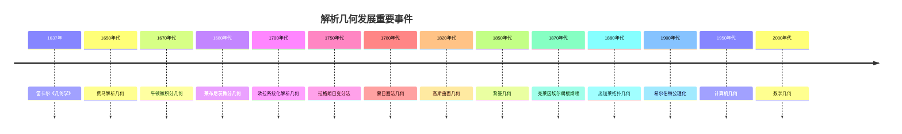

# 解析几何 / Analytic Geometry

## 目录 / Table of Contents

- [解析几何 / Analytic Geometry](#解析几何--analytic-geometry)
  - [目录 / Table of Contents](#目录--table-of-contents)
  - [1. 引言 / Introduction](#1-引言--introduction)
    - [1.1 历史背景 / Historical Background](#11-历史背景--historical-background)
      - [早期发展 (1600-1700)](#早期发展-1600-1700)
      - [系统化发展 (1700-1800)](#系统化发展-1700-1800)
      - [现代发展 (1800-1900)](#现代发展-1800-1900)
      - [当代发展 (1900-至今)](#当代发展-1900-至今)
    - [重要人物贡献](#重要人物贡献)
    - [重要历史事件时间线](#重要历史事件时间线)
    - [理论发展脉络](#理论发展脉络)
      - [从平面到空间的发展](#从平面到空间的发展)
      - [从代数到分析的发展](#从代数到分析的发展)
      - [从具体到抽象的发展](#从具体到抽象的发展)
  - [2. 坐标系统 / Coordinate Systems](#2-坐标系统--coordinate-systems)
    - [2.1 笛卡尔坐标系 / Cartesian Coordinate System](#21-笛卡尔坐标系--cartesian-coordinate-system)
      - [2.1.1 平面笛卡尔坐标系 / Plane Cartesian Coordinate System](#211-平面笛卡尔坐标系--plane-cartesian-coordinate-system)
      - [2.1.2 空间笛卡尔坐标系 / Space Cartesian Coordinate System](#212-空间笛卡尔坐标系--space-cartesian-coordinate-system)
    - [2.2 极坐标系 / Polar Coordinate System](#22-极坐标系--polar-coordinate-system)
      - [2.2.1 极坐标与笛卡尔坐标的转换 / Conversion between Polar and Cartesian Coordinates](#221-极坐标与笛卡尔坐标的转换--conversion-between-polar-and-cartesian-coordinates)
    - [2.3 其他坐标系统 / Other Coordinate Systems](#23-其他坐标系统--other-coordinate-systems)
      - [2.3.1 柱坐标系 / Cylindrical Coordinate System](#231-柱坐标系--cylindrical-coordinate-system)
      - [2.3.2 球坐标系 / Spherical Coordinate System](#232-球坐标系--spherical-coordinate-system)
  - [3. 直线与平面 / Lines and Planes](#3-直线与平面--lines-and-planes)
    - [3.1 直线的方程 / Equations of Lines](#31-直线的方程--equations-of-lines)
      - [3.1.1 点斜式 / Point-Slope Form](#311-点斜式--point-slope-form)
      - [3.1.2 斜截式 / Slope-Intercept Form](#312-斜截式--slope-intercept-form)
      - [3.1.3 一般式 / General Form](#313-一般式--general-form)
      - [3.1.4 两点式 / Two-Point Form](#314-两点式--two-point-form)
    - [3.2 直线的性质 / Properties of Lines](#32-直线的性质--properties-of-lines)
      - [3.2.1 斜率 / Slope](#321-斜率--slope)
      - [3.2.2 平行与垂直 / Parallel and Perpendicular](#322-平行与垂直--parallel-and-perpendicular)
    - [3.3 点到直线的距离 / Distance from Point to Line](#33-点到直线的距离--distance-from-point-to-line)
    - [3.4 平面方程 / Equations of Planes](#34-平面方程--equations-of-planes)
      - [3.4.1 点法式 / Point-Normal Form](#341-点法式--point-normal-form)
      - [3.4.2 一般式 / General Form](#342-一般式--general-form)
  - [4. 圆与圆锥曲线 / Circles and Conic Sections](#4-圆与圆锥曲线--circles-and-conic-sections)
    - [4.1 圆的方程 / Equations of Circles](#41-圆的方程--equations-of-circles)
      - [4.1.1 标准方程 / Standard Equation](#411-标准方程--standard-equation)
      - [4.1.2 一般方程 / General Equation](#412-一般方程--general-equation)
    - [4.2 椭圆 / Ellipses](#42-椭圆--ellipses)
      - [4.2.1 椭圆的标准方程 / Standard Equation of Ellipse](#421-椭圆的标准方程--standard-equation-of-ellipse)
      - [4.2.2 椭圆的性质 / Properties of Ellipses](#422-椭圆的性质--properties-of-ellipses)
    - [4.3 抛物线 / Parabolas](#43-抛物线--parabolas)
      - [4.3.1 抛物线的标准方程 / Standard Equation of Parabola](#431-抛物线的标准方程--standard-equation-of-parabola)
      - [4.3.2 抛物线的性质 / Properties of Parabolas](#432-抛物线的性质--properties-of-parabolas)
    - [4.4 双曲线 / Hyperbolas](#44-双曲线--hyperbolas)
      - [4.4.1 双曲线的标准方程 / Standard Equation of Hyperbola](#441-双曲线的标准方程--standard-equation-of-hyperbola)
      - [4.4.2 双曲线的性质 / Properties of Hyperbolas](#442-双曲线的性质--properties-of-hyperbolas)
  - [5. 向量几何 / Vector Geometry](#5-向量几何--vector-geometry)
    - [5.1 向量的基本概念 / Basic Concepts of Vectors](#51-向量的基本概念--basic-concepts-of-vectors)
      - [5.1.1 向量的表示 / Vector Representation](#511-向量的表示--vector-representation)
    - [5.2 向量的运算 / Vector Operations](#52-向量的运算--vector-operations)
      - [5.2.1 向量加法 / Vector Addition](#521-向量加法--vector-addition)
      - [5.2.2 向量数乘 / Scalar Multiplication](#522-向量数乘--scalar-multiplication)
      - [5.2.3 向量点积 / Vector Dot Product](#523-向量点积--vector-dot-product)
      - [5.2.4 向量叉积 / Vector Cross Product](#524-向量叉积--vector-cross-product)
    - [5.3 向量的几何应用 / Geometric Applications of Vectors](#53-向量的几何应用--geometric-applications-of-vectors)
      - [5.3.1 直线方程 / Line Equations](#531-直线方程--line-equations)
      - [5.3.2 平面方程 / Plane Equations](#532-平面方程--plane-equations)
  - [6. 空间几何 / Space Geometry](#6-空间几何--space-geometry)
    - [6.1 空间直线 / Space Lines](#61-空间直线--space-lines)
      - [6.1.1 空间直线的方程 / Equations of Space Lines](#611-空间直线的方程--equations-of-space-lines)
    - [6.2 空间平面 / Space Planes](#62-空间平面--space-planes)
      - [6.2.1 空间平面的方程 / Equations of Space Planes](#621-空间平面的方程--equations-of-space-planes)
    - [6.3 空间曲面 / Space Surfaces](#63-空间曲面--space-surfaces)
      - [6.3.1 球面 / Spheres](#631-球面--spheres)
      - [6.3.2 圆柱面 / Cylinders](#632-圆柱面--cylinders)
      - [6.3.3 圆锥面 / Cones](#633-圆锥面--cones)
  - [7. 参数方程 / Parametric Equations](#7-参数方程--parametric-equations)
    - [7.1 参数方程的基本概念 / Basic Concepts of Parametric Equations](#71-参数方程的基本概念--basic-concepts-of-parametric-equations)
      - [7.1.1 平面曲线的参数方程 / Parametric Equations of Plane Curves](#711-平面曲线的参数方程--parametric-equations-of-plane-curves)
    - [7.2 常见曲线的参数方程 / Parametric Equations of Common Curves](#72-常见曲线的参数方程--parametric-equations-of-common-curves)
      - [7.2.1 直线的参数方程 / Parametric Equation of Line](#721-直线的参数方程--parametric-equation-of-line)
      - [7.2.2 圆的参数方程 / Parametric Equation of Circle](#722-圆的参数方程--parametric-equation-of-circle)
      - [7.2.3 椭圆的参数方程 / Parametric Equation of Ellipse](#723-椭圆的参数方程--parametric-equation-of-ellipse)
    - [7.3 参数方程的导数 / Derivatives of Parametric Equations](#73-参数方程的导数--derivatives-of-parametric-equations)
  - [8. 极坐标 / Polar Coordinates](#8-极坐标--polar-coordinates)
    - [8.1 极坐标方程 / Polar Equations](#81-极坐标方程--polar-equations)
      - [8.1.1 直线的极坐标方程 / Polar Equation of Line](#811-直线的极坐标方程--polar-equation-of-line)
      - [8.1.2 圆的极坐标方程 / Polar Equation of Circle](#812-圆的极坐标方程--polar-equation-of-circle)
    - [8.2 极坐标下的面积 / Area in Polar Coordinates](#82-极坐标下的面积--area-in-polar-coordinates)
    - [8.3 极坐标下的弧长 / Arc Length in Polar Coordinates](#83-极坐标下的弧长--arc-length-in-polar-coordinates)
  - [9. 思维过程表征 / Thinking Process Representation](#9-思维过程表征--thinking-process-representation)
    - [9.1 解析几何问题解决流程 / Problem-Solving Process in Analytic Geometry](#91-解析几何问题解决流程--problem-solving-process-in-analytic-geometry)
      - [9.1.1 一般问题解决策略 / General Problem-Solving Strategy](#911-一般问题解决策略--general-problem-solving-strategy)
      - [9.1.2 具体问题类型分析 / Specific Problem Type Analysis](#912-具体问题类型分析--specific-problem-type-analysis)
    - [9.2 证明思维过程 / Proof Thinking Process](#92-证明思维过程--proof-thinking-process)
      - [9.2.1 距离公式证明 / Distance Formula Proof](#921-距离公式证明--distance-formula-proof)
      - [9.2.2 圆的方程证明 / Circle Equation Proof](#922-圆的方程证明--circle-equation-proof)
    - [9.3 概念理解步骤 / Concept Understanding Steps](#93-概念理解步骤--concept-understanding-steps)
      - [9.3.1 坐标系概念理解 / Coordinate System Concept Understanding](#931-坐标系概念理解--coordinate-system-concept-understanding)
      - [9.3.2 向量概念理解 / Vector Concept Understanding](#932-向量概念理解--vector-concept-understanding)
    - [9.4 问题解决策略 / Problem-Solving Strategies](#94-问题解决策略--problem-solving-strategies)
      - [9.4.1 参数化策略 / Parametrization Strategy](#941-参数化策略--parametrization-strategy)
      - [9.4.2 对称性策略 / Symmetry Strategy](#942-对称性策略--symmetry-strategy)
      - [9.4.3 变换策略 / Transformation Strategy](#943-变换策略--transformation-strategy)
    - [9.5 算法思维分析 / Algorithmic Thinking Analysis](#95-算法思维分析--algorithmic-thinking-analysis)
      - [9.5.1 几何算法设计 / Geometric Algorithm Design](#951-几何算法设计--geometric-algorithm-design)
      - [9.5.2 数值计算策略 / Numerical Computation Strategy](#952-数值计算策略--numerical-computation-strategy)
  - [10. 形式化实现 / Formal Implementation](#10-形式化实现--formal-implementation)
    - [10.1 Lean 4 实现 / Lean 4 Implementation](#101-lean-4-实现--lean-4-implementation)
    - [10.2 Haskell 实现 / Haskell Implementation](#102-haskell-实现--haskell-implementation)
    - [10.3 Rust 实现 / Rust Implementation](#103-rust-实现--rust-implementation)
    - [10.4 Python 算法实现 / Python Algorithm Implementation](#104-python-算法实现--python-algorithm-implementation)
  - [总结 / Summary](#总结--summary)
    - [关键要点 / Key Points](#关键要点--key-points)

---

## 1. 引言 / Introduction

解析几何是几何学与代数学的结合，通过引入坐标系统，将几何问题转化为代数问题。这种方法由法国数学家笛卡尔在17世纪创立，为现代数学的发展奠定了基础。

**Analytic geometry is the combination of geometry and algebra, transforming geometric problems into algebraic problems by introducing coordinate systems. This method was founded by the French mathematician Descartes in the 17th century and laid the foundation for the development of modern mathematics.**

### 1.1 历史背景 / Historical Background

笛卡尔的《几何学》(La Géométrie, 1637)是解析几何的奠基之作，他引入了坐标系统，将几何图形与代数方程联系起来。

**Descartes' "La Géométrie" (1637) is the foundational work of analytic geometry, where he introduced coordinate systems and connected geometric figures with algebraic equations.**

#### 早期发展 (1600-1700)

**笛卡尔时代**:

- **1637年**: 笛卡尔《几何学》发表
  - 引入坐标系统
  - 建立几何与代数的联系
  - 为解析几何奠定基础
- **1650年代**: 费马解析几何贡献
  - 独立发展坐标几何
  - 研究圆锥曲线
  - 为微积分奠定基础
- **1670年代**: 牛顿几何贡献
  - 发展微积分几何
  - 研究曲线几何
  - 建立微分几何基础

**早期应用**:

- **1680年代**: 莱布尼茨几何贡献
  - 发展微分几何
  - 建立坐标几何
  - 为现代几何奠定基础
- **1690年代**: 伯努利家族贡献
  - 研究曲线几何
  - 发展变分法
  - 为分析几何奠定基础

#### 系统化发展 (1700-1800)

**18世纪发展**:

- **1700年代**: 欧拉几何贡献
  - 系统化解析几何
  - 研究空间几何
  - 建立现代几何基础
- **1750年代**: 拉格朗日几何贡献
  - 发展变分法
  - 研究力学几何
  - 为现代分析奠定基础
- **1780年代**: 蒙日几何贡献
  - 发展画法几何
  - 研究投影几何
  - 为工程几何奠定基础

**应用扩展**:

- **1790年代**: 拉普拉斯几何贡献
  - 研究天体几何
  - 发展概率几何
  - 为现代科学奠定基础

#### 现代发展 (1800-1900)

**19世纪革命**:

- **1820年代**: 高斯几何贡献
  - 研究曲面几何
  - 建立内蕴几何
  - 为非欧几何奠定基础
- **1850年代**: 黎曼几何贡献
  - 建立黎曼几何
  - 研究流形几何
  - 为现代几何奠定基础
- **1870年代**: 克莱因埃尔朗根纲领
  - 用群论统一几何学
  - 建立几何变换理论
  - 为现代几何学奠定基础

**应用发展**:

- **1880年代**: 庞加莱几何贡献
  - 研究拓扑几何
  - 发展同伦论
  - 为现代拓扑奠定基础

#### 当代发展 (1900-至今)

**20世纪发展**:

- **1900年代**: 希尔伯特公理化
  - 完善几何公理系统
  - 建立形式化几何
  - 为数学基础研究奠定基础
- **1950年代**: 计算机几何
  - 计算机辅助几何设计
  - 计算几何算法
  - 几何建模技术
- **1980年代**: 形式化几何
  - 计算机定理证明
  - 几何约束求解
  - 自动化几何推理

**21世纪前沿**:

- **2000年代**: 数字几何
  - 数字几何处理
  - 几何机器学习
  - 几何人工智能
- **2010年代**: 几何深度学习
  - 几何神经网络
  - 几何表示学习
  - 几何优化算法

### 重要人物贡献

| 人物 | 时期 | 主要贡献 | 影响 |
|------|------|----------|------|
| 笛卡尔 | 1637 | 解析几何，坐标系统 | 建立解析几何基础 |
| 费马 | 1650s | 解析几何，极值理论 | 为微积分奠定基础 |
| 牛顿 | 1670s | 微积分几何，曲线几何 | 建立微分几何基础 |
| 莱布尼茨 | 1680s | 微分几何，坐标几何 | 为现代几何奠定基础 |
| 欧拉 | 1700s | 系统化解析几何 | 建立现代几何基础 |
| 拉格朗日 | 1750s | 变分法，力学几何 | 为现代分析奠定基础 |
| 蒙日 | 1780s | 画法几何，投影几何 | 为工程几何奠定基础 |
| 高斯 | 1820s | 曲面几何，内蕴几何 | 为非欧几何奠定基础 |
| 黎曼 | 1850s | 黎曼几何，流形几何 | 现代几何学基础 |
| 克莱因 | 1870s | 埃尔朗根纲领 | 统一几何学理论 |
| 庞加莱 | 1880s | 拓扑几何，同伦论 | 为现代拓扑奠定基础 |
| 希尔伯特 | 1900s | 公理化几何 | 数学基础研究 |

### 重要历史事件时间线



### 理论发展脉络

#### 从平面到空间的发展

**平面解析几何**:

- 笛卡尔坐标系
- 直线和圆的方程
- 圆锥曲线理论
- 平面几何性质

**空间解析几何**:

- 三维坐标系
- 直线和平面方程
- 空间曲面理论
- 空间几何性质

**高维解析几何**:

- n维坐标系
- 超平面理论
- 高维几何性质
- 抽象几何空间

#### 从代数到分析的发展

**代数几何**:

- 多项式方程
- 代数曲线
- 代数曲面
- 代数几何理论

**分析几何**:

- 微分几何
- 积分几何
- 变分几何
- 现代几何理论

**现代几何**:

- 拓扑几何
- 微分拓扑
- 代数拓扑
- 现代几何理论

#### 从具体到抽象的发展

**具体几何**:

- 欧几里得几何
- 坐标几何
- 投影几何
- 经典几何理论

**抽象几何**:

- 非欧几何
- 拓扑几何
- 代数几何
- 现代几何理论

**现代几何**:

- 微分几何
- 代数几何
- 拓扑几何
- 现代几何理论

---

## 2. 坐标系统 / Coordinate Systems

### 2.1 笛卡尔坐标系 / Cartesian Coordinate System

**定义 2.1.1** (笛卡尔坐标系) / **Definition 2.1.1** (Cartesian coordinate system)
笛卡尔坐标系是由两条相互垂直的数轴构成的坐标系统。
**A Cartesian coordinate system is a coordinate system consisting of two mutually perpendicular number axes.**

#### 2.1.1 平面笛卡尔坐标系 / Plane Cartesian Coordinate System

在平面中，笛卡尔坐标系由两条相互垂直的直线（x轴和y轴）构成，它们的交点称为原点。

**In the plane, a Cartesian coordinate system consists of two mutually perpendicular lines (x-axis and y-axis), and their intersection is called the origin.**

**坐标表示** / **Coordinate representation**:

- 点P的坐标: P(x, y)
- x: 横坐标 (abscissa)
- y: 纵坐标 (ordinate)

#### 2.1.2 空间笛卡尔坐标系 / Space Cartesian Coordinate System

在三维空间中，笛卡尔坐标系由三条相互垂直的直线（x轴、y轴和z轴）构成。

**In three-dimensional space, a Cartesian coordinate system consists of three mutually perpendicular lines (x-axis, y-axis, and z-axis).**

**坐标表示** / **Coordinate representation**:

- 点P的坐标: P(x, y, z)
- x: x坐标
- y: y坐标  
- z: z坐标

### 2.2 极坐标系 / Polar Coordinate System

**定义 2.2.1** (极坐标系) / **Definition 2.2.1** (Polar coordinate system)
极坐标系是由一个固定点（极点）和一条固定直线（极轴）构成的坐标系统。
**A polar coordinate system is a coordinate system consisting of a fixed point (pole) and a fixed line (polar axis).**

**坐标表示** / **Coordinate representation**:

- 点P的坐标: P(r, θ)
- r: 极径 (distance from pole)
- θ: 极角 (angle from polar axis)

#### 2.2.1 极坐标与笛卡尔坐标的转换 / Conversion between Polar and Cartesian Coordinates

**极坐标转笛卡尔坐标** / **Polar to Cartesian**:
$$x = r \cos \theta$$
$$y = r \sin \theta$$

**笛卡尔坐标转极坐标** / **Cartesian to Polar**:
$$r = \sqrt{x^2 + y^2}$$
$$\theta = \arctan\left(\frac{y}{x}\right)$$

### 2.3 其他坐标系统 / Other Coordinate Systems

#### 2.3.1 柱坐标系 / Cylindrical Coordinate System

**定义 2.3.1** (柱坐标系) / **Definition 2.3.1** (Cylindrical coordinate system)
柱坐标系是极坐标系在三维空间的推广。
**Cylindrical coordinate system is the extension of polar coordinate system to three-dimensional space.**

**坐标表示** / **Coordinate representation**:

- 点P的坐标: P(r, θ, z)
- r: 径向距离
- θ: 方位角
- z: 高度

#### 2.3.2 球坐标系 / Spherical Coordinate System

**定义 2.3.2** (球坐标系) / **Definition 2.3.2** (Spherical coordinate system)
球坐标系是描述三维空间中点位置的另一种坐标系统。
**Spherical coordinate system is another coordinate system for describing point positions in three-dimensional space.**

**坐标表示** / **Coordinate representation**:

- 点P的坐标: P(r, θ, φ)
- r: 径向距离
- θ: 方位角
- φ: 仰角

---

## 3. 直线与平面 / Lines and Planes

### 3.1 直线的方程 / Equations of Lines

#### 3.1.1 点斜式 / Point-Slope Form

**定义 3.1.1** (点斜式) / **Definition 3.1.1** (Point-slope form)
已知直线上一点P₁(x₁, y₁)和斜率k，直线的方程为：
**Given a point P₁(x₁, y₁) on the line and slope k, the equation of the line is:**

$$y - y_1 = k(x - x_1)$$

#### 3.1.2 斜截式 / Slope-Intercept Form

**定义 3.1.2** (斜截式) / **Definition 3.1.2** (Slope-intercept form)
直线的斜截式方程为：
**The slope-intercept form of a line is:**

$$y = kx + b$$

其中k是斜率，b是y轴截距。
**where k is the slope and b is the y-intercept.**

#### 3.1.3 一般式 / General Form

**定义 3.1.3** (一般式) / **Definition 3.1.3** (General form)
直线的一般式方程为：
**The general form of a line is:**

$$Ax + By + C = 0$$

其中A、B、C是常数，且A和B不同时为零。
**where A, B, C are constants and A and B are not both zero.**

#### 3.1.4 两点式 / Two-Point Form

**定义 3.1.4** (两点式) / **Definition 3.1.4** (Two-point form)
已知直线上两点P₁(x₁, y₁)和P₂(x₂, y₂)，直线的方程为：
**Given two points P₁(x₁, y₁) and P₂(x₂, y₂) on the line, the equation of the line is:**

$$\frac{y - y_1}{y_2 - y_1} = \frac{x - x_1}{x_2 - x_1}$$

### 3.2 直线的性质 / Properties of Lines

#### 3.2.1 斜率 / Slope

**定义 3.2.1** (斜率) / **Definition 3.2.1** (Slope)
直线的斜率定义为：
**The slope of a line is defined as:**

$$k = \frac{y_2 - y_1}{x_2 - x_1}$$

#### 3.2.2 平行与垂直 / Parallel and Perpendicular

**定理 3.2.1** (平行直线) / **Theorem 3.2.1** (Parallel lines)
两条直线平行的充要条件是它们的斜率相等。
**Two lines are parallel if and only if their slopes are equal.**

**定理 3.2.2** (垂直直线) / **Theorem 3.2.2** (Perpendicular lines)
两条直线垂直的充要条件是它们的斜率乘积为-1。
**Two lines are perpendicular if and only if the product of their slopes is -1.**

### 3.3 点到直线的距离 / Distance from Point to Line

**定理 3.3.1** (点到直线距离公式) / **Theorem 3.3.1** (Distance from point to line formula)
点P(x₀, y₀)到直线Ax + By + C = 0的距离为：
**The distance from point P(x₀, y₀) to line Ax + By + C = 0 is:**

$$d = \frac{|Ax_0 + By_0 + C|}{\sqrt{A^2 + B^2}}$$

**证明** / **Proof**:
设直线上的点Q(x, y)，则向量PQ = (x - x₀, y - y₀)。
**Let Q(x, y) be a point on the line, then vector PQ = (x - x₀, y - y₀).**

由于Q在直线上，有Ax + By + C = 0。
**Since Q is on the line, Ax + By + C = 0.**

距离d = |PQ|的最小值，通过拉格朗日乘数法可得上述公式。
**The distance d = |PQ| is minimized, and the above formula can be obtained by Lagrange multipliers.**

### 3.4 平面方程 / Equations of Planes

#### 3.4.1 点法式 / Point-Normal Form

**定义 3.4.1** (点法式) / **Definition 3.4.1** (Point-normal form)
已知平面上一点P₀(x₀, y₀, z₀)和法向量n = (A, B, C)，平面的方程为：
**Given a point P₀(x₀, y₀, z₀) on the plane and normal vector n = (A, B, C), the equation of the plane is:**

$$A(x - x_0) + B(y - y_0) + C(z - z_0) = 0$$

#### 3.4.2 一般式 / General Form

**定义 3.4.2** (一般式) / **Definition 3.4.2** (General form)
平面的一般式方程为：
**The general form of a plane is:**

$$Ax + By + Cz + D = 0$$

其中A、B、C、D是常数，且A、B、C不同时为零。
**where A, B, C, D are constants and A, B, C are not all zero.**

---

## 4. 圆与圆锥曲线 / Circles and Conic Sections

### 4.1 圆的方程 / Equations of Circles

#### 4.1.1 标准方程 / Standard Equation

**定义 4.1.1** (圆的标准方程) / **Definition 4.1.1** (Standard equation of circle)
圆心为(h, k)，半径为r的圆的标准方程为：
**The standard equation of a circle with center (h, k) and radius r is:**

$$(x - h)^2 + (y - k)^2 = r^2$$

#### 4.1.2 一般方程 / General Equation

**定义 4.1.2** (圆的一般方程) / **Definition 4.1.2** (General equation of circle)
圆的一般方程为：
**The general equation of a circle is:**

$$x^2 + y^2 + Dx + Ey + F = 0$$

其中D、E、F是常数，且D² + E² - 4F > 0。
**where D, E, F are constants and D² + E² - 4F > 0.**

### 4.2 椭圆 / Ellipses

**定义 4.2.1** (椭圆) / **Definition 4.2.1** (Ellipse)
椭圆是平面上到两定点（焦点）距离之和为常数的点的轨迹。
**An ellipse is the locus of points in a plane such that the sum of distances to two fixed points (foci) is constant.**

#### 4.2.1 椭圆的标准方程 / Standard Equation of Ellipse

**标准方程** / **Standard equation**:
$$\frac{(x - h)^2}{a^2} + \frac{(y - k)^2}{b^2} = 1$$

其中(h, k)是椭圆中心，a是长半轴，b是短半轴。
**where (h, k) is the center, a is the semi-major axis, and b is the semi-minor axis.**

#### 4.2.2 椭圆的性质 / Properties of Ellipses

- **焦点**: F₁(h - c, k), F₂(h + c, k)，其中c² = a² - b²
- **离心率**: e = c/a
- **面积**: A = πab

### 4.3 抛物线 / Parabolas

**定义 4.3.1** (抛物线) / **Definition 4.3.1** (Parabola)
抛物线是平面上到定点（焦点）距离等于到定直线（准线）距离的点的轨迹。
**A parabola is the locus of points in a plane that are equidistant from a fixed point (focus) and a fixed line (directrix).**

#### 4.3.1 抛物线的标准方程 / Standard Equation of Parabola

**标准方程** / **Standard equation**:
$$(y - k)^2 = 4p(x - h)$$

其中(h, k)是顶点，p是焦点到顶点的距离。
**where (h, k) is the vertex and p is the distance from focus to vertex.**

#### 4.3.2 抛物线的性质 / Properties of Parabolas

- **焦点**: F(h + p, k)
- **准线**: x = h - p
- **对称轴**: y = k

### 4.4 双曲线 / Hyperbolas

**定义 4.4.1** (双曲线) / **Definition 4.4.1** (Hyperbola)
双曲线是平面上到两定点（焦点）距离之差为常数的点的轨迹。
**A hyperbola is the locus of points in a plane such that the difference of distances to two fixed points (foci) is constant.**

#### 4.4.1 双曲线的标准方程 / Standard Equation of Hyperbola

**标准方程** / **Standard equation**:
$$\frac{(x - h)^2}{a^2} - \frac{(y - k)^2}{b^2} = 1$$

其中(h, k)是双曲线中心，a是实半轴，b是虚半轴。
**where (h, k) is the center, a is the semi-major axis, and b is the semi-minor axis.**

#### 4.4.2 双曲线的性质 / Properties of Hyperbolas

- **焦点**: F₁(h - c, k), F₂(h + c, k)，其中c² = a² + b²
- **离心率**: e = c/a
- **渐近线**: y - k = ±(b/a)(x - h)

---

## 5. 向量几何 / Vector Geometry

### 5.1 向量的基本概念 / Basic Concepts of Vectors

**定义 5.1.1** (向量) / **Definition 5.1.1** (Vector)
向量是既有大小又有方向的量。
**A vector is a quantity that has both magnitude and direction.**

#### 5.1.1 向量的表示 / Vector Representation

**坐标表示** / **Coordinate representation**:

- 二维向量: v = (v₁, v₂)
- 三维向量: v = (v₁, v₂, v₃)

**几何表示** / **Geometric representation**:

- 有向线段表示向量
- 向量的起点和终点

### 5.2 向量的运算 / Vector Operations

#### 5.2.1 向量加法 / Vector Addition

**定义 5.2.1** (向量加法) / **Definition 5.2.1** (Vector addition)
两个向量a = (a₁, a₂)和b = (b₁, b₂)的和为：
**The sum of two vectors a = (a₁, a₂) and b = (b₁, b₂) is:**

$$a + b = (a_1 + b_1, a_2 + b_2)$$

#### 5.2.2 向量数乘 / Scalar Multiplication

**定义 5.2.2** (向量数乘) / **Definition 5.2.2** (Scalar multiplication)
向量a = (a₁, a₂)与标量k的数乘为：
**The scalar multiplication of vector a = (a₁, a₂) and scalar k is:**

$$ka = (ka_1, ka_2)$$

#### 5.2.3 向量点积 / Vector Dot Product

**定义 5.2.3** (向量点积) / **Definition 5.2.3** (Vector dot product)
两个向量a = (a₁, a₂)和b = (b₁, b₂)的点积为：
**The dot product of two vectors a = (a₁, a₂) and b = (b₁, b₂) is:**

$$a \cdot b = a_1b_1 + a_2b_2$$

#### 5.2.4 向量叉积 / Vector Cross Product

**定义 5.2.4** (向量叉积) / **Definition 5.2.4** (Vector cross product)
两个三维向量a = (a₁, a₂, a₃)和b = (b₁, b₂, b₃)的叉积为：
**The cross product of two three-dimensional vectors a = (a₁, a₂, a₃) and b = (b₁, b₂, b₃) is:**

$$a \times b = (a_2b_3 - a_3b_2, a_3b_1 - a_1b_3, a_1b_2 - a_2b_1)$$

### 5.3 向量的几何应用 / Geometric Applications of Vectors

#### 5.3.1 直线方程 / Line Equations

**参数方程** / **Parametric equation**:
$$r = r_0 + tv$$

其中r₀是直线上一点，v是方向向量，t是参数。
**where r₀ is a point on the line, v is the direction vector, and t is the parameter.**

#### 5.3.2 平面方程 / Plane Equations

**点法式** / **Point-normal form**:
$$(r - r_0) \cdot n = 0$$

其中r₀是平面上一点，n是法向量。
**where r₀ is a point on the plane and n is the normal vector.**

---

## 6. 空间几何 / Space Geometry

### 6.1 空间直线 / Space Lines

#### 6.1.1 空间直线的方程 / Equations of Space Lines

**参数方程** / **Parametric equation**:
$$x = x_0 + at$$
$$y = y_0 + bt$$
$$z = z_0 + ct$$

其中(x₀, y₀, z₀)是直线上一点，(a, b, c)是方向向量。
**where (x₀, y₀, z₀) is a point on the line and (a, b, c) is the direction vector.**

**对称式方程** / **Symmetric equation**:
$$\frac{x - x_0}{a} = \frac{y - y_0}{b} = \frac{z - z_0}{c}$$

### 6.2 空间平面 / Space Planes

#### 6.2.1 空间平面的方程 / Equations of Space Planes

**一般式** / **General form**:
$$Ax + By + Cz + D = 0$$

**点法式** / **Point-normal form**:
$$A(x - x_0) + B(y - y_0) + C(z - z_0) = 0$$

### 6.3 空间曲面 / Space Surfaces

#### 6.3.1 球面 / Spheres

**标准方程** / **Standard equation**:
$$(x - h)^2 + (y - k)^2 + (z - l)^2 = r^2$$

其中(h, k, l)是球心，r是半径。
**where (h, k, l) is the center and r is the radius.**

#### 6.3.2 圆柱面 / Cylinders

**标准方程** / **Standard equation**:
$$(x - h)^2 + (y - k)^2 = r^2$$

这是一个以z轴为轴的圆柱面。
**This is a cylinder with z-axis as its axis.**

#### 6.3.3 圆锥面 / Cones

**标准方程** / **Standard equation**:
$$z^2 = c^2(x^2 + y^2)$$

这是一个以z轴为轴的圆锥面。
**This is a cone with z-axis as its axis.**

---

## 7. 参数方程 / Parametric Equations

### 7.1 参数方程的基本概念 / Basic Concepts of Parametric Equations

**定义 7.1.1** (参数方程) / **Definition 7.1.1** (Parametric equation)
参数方程是用参数表示变量关系的方程。
**A parametric equation is an equation that expresses variable relationships using parameters.**

#### 7.1.1 平面曲线的参数方程 / Parametric Equations of Plane Curves

**一般形式** / **General form**:
$$x = f(t)$$
$$y = g(t)$$

其中t是参数，f(t)和g(t)是参数t的函数。
**where t is the parameter, and f(t) and g(t) are functions of parameter t.**

### 7.2 常见曲线的参数方程 / Parametric Equations of Common Curves

#### 7.2.1 直线的参数方程 / Parametric Equation of Line

$$x = x_0 + at$$
$$y = y_0 + bt$$

其中(x₀, y₀)是直线上一点，(a, b)是方向向量。
**where (x₀, y₀) is a point on the line and (a, b) is the direction vector.**

#### 7.2.2 圆的参数方程 / Parametric Equation of Circle

$$x = h + r\cos t$$
$$y = k + r\sin t$$

其中(h, k)是圆心，r是半径，t ∈ [0, 2π]。
**where (h, k) is the center, r is the radius, and t ∈ [0, 2π].**

#### 7.2.3 椭圆的参数方程 / Parametric Equation of Ellipse

$$x = h + a\cos t$$
$$y = k + b\sin t$$

其中(h, k)是椭圆中心，a和b是半轴长，t ∈ [0, 2π]。
**where (h, k) is the center, a and b are semi-axes, and t ∈ [0, 2π].**

### 7.3 参数方程的导数 / Derivatives of Parametric Equations

**定理 7.3.1** (参数方程的导数) / **Theorem 7.3.1** (Derivatives of parametric equations)
如果x = f(t), y = g(t)，则：
**If x = f(t), y = g(t), then:**

$$\frac{dy}{dx} = \frac{g'(t)}{f'(t)}$$

---

## 8. 极坐标 / Polar Coordinates

### 8.1 极坐标方程 / Polar Equations

#### 8.1.1 直线的极坐标方程 / Polar Equation of Line

**一般形式** / **General form**:
$$r\cos(\theta - \alpha) = p$$

其中p是原点到直线的距离，α是法线与极轴的夹角。
**where p is the distance from origin to line, and α is the angle between normal and polar axis.**

#### 8.1.2 圆的极坐标方程 / Polar Equation of Circle

**标准形式** / **Standard form**:
$$r = 2a\cos(\theta - \alpha)$$

其中a是圆的半径，α是圆心角。
**where a is the radius and α is the center angle.**

### 8.2 极坐标下的面积 / Area in Polar Coordinates

**定理 8.2.1** (极坐标面积公式) / **Theorem 8.2.1** (Polar area formula)
由极坐标方程r = f(θ)围成的区域面积为：
**The area bounded by polar equation r = f(θ) is:**

$$A = \frac{1}{2}\int_{\alpha}^{\beta} [f(\theta)]^2 d\theta$$

### 8.3 极坐标下的弧长 / Arc Length in Polar Coordinates

**定理 8.3.1** (极坐标弧长公式) / **Theorem 8.3.1** (Polar arc length formula)
极坐标曲线r = f(θ)的弧长为：
**The arc length of polar curve r = f(θ) is:**

$$L = \int_{\alpha}^{\beta} \sqrt{[f(\theta)]^2 + [f'(\theta)]^2} d\theta$$

---

## 9. 思维过程表征 / Thinking Process Representation

### 9.1 解析几何问题解决流程 / Problem-Solving Process in Analytic Geometry

#### 9.1.1 一般问题解决策略 / General Problem-Solving Strategy

**步骤1: 问题分析 / Step 1: Problem Analysis**:

- 识别几何对象类型（点、线、面、曲线）
- 确定坐标系选择（笛卡尔、极坐标、参数坐标）
- 分析已知条件和求解目标

**步骤2: 坐标系统建立 / Step 2: Coordinate System Setup**:

- 选择合适的坐标系
- 建立坐标轴和单位
- 确定几何对象在坐标系中的表示

**步骤3: 代数化转换 / Step 3: Algebraic Transformation**:

- 将几何条件转化为代数方程
- 建立方程组或不等式
- 确定变量和参数

**步骤4: 代数求解 / Step 4: Algebraic Solution**:

- 解方程组或不等式
- 计算数值结果
- 验证解的合理性

**步骤5: 几何解释 / Step 5: Geometric Interpretation**:

- 将代数结果转化为几何结论
- 验证几何意义
- 总结最终答案

#### 9.1.2 具体问题类型分析 / Specific Problem Type Analysis

**直线问题解决流程 / Line Problem Solving Process**:

1. **问题识别**: 确定是直线方程、位置关系还是距离问题
2. **条件分析**: 提取已知点、斜率、截距等信息
3. **方程建立**: 根据条件选择合适的直线方程形式
4. **求解计算**: 利用代数方法求解未知量
5. **结果验证**: 检查解的几何合理性

**圆锥曲线问题解决流程 / Conic Section Problem Solving Process**:

1. **曲线识别**: 确定是圆、椭圆、抛物线还是双曲线
2. **标准形式**: 将方程化为标准形式
3. **参数确定**: 计算焦点、顶点、离心率等参数
4. **性质分析**: 分析曲线的几何性质
5. **应用计算**: 根据具体问题进行计算

### 9.2 证明思维过程 / Proof Thinking Process

#### 9.2.1 距离公式证明 / Distance Formula Proof

**问题**: 证明两点间距离公式 $d = \sqrt{(x_2-x_1)^2 + (y_2-y_1)^2}$

**思维过程**:

1. **几何理解**: 两点间距离是连接两点的直线段长度
2. **坐标表示**: 在笛卡尔坐标系中表示两点坐标
3. **直角三角形**: 利用坐标差构造直角三角形
4. **勾股定理**: 应用勾股定理计算斜边长度
5. **公式推导**: 得到距离公式的代数表达式

**证明步骤**:

```markdown
设两点 P₁(x₁, y₁) 和 P₂(x₂, y₂)
构造直角三角形，直角边长为 |x₂-x₁| 和 |y₂-y₁|
根据勾股定理：d² = (x₂-x₁)² + (y₂-y₁)²
因此：d = √[(x₂-x₁)² + (y₂-y₁)²]
```

#### 9.2.2 圆的方程证明 / Circle Equation Proof

**问题**: 证明圆心为(h, k)，半径为r的圆的方程为 (x-h)² + (y-k)² = r²

**思维过程**:

1. **定义理解**: 圆是到定点（圆心）距离相等的点的集合
2. **距离条件**: 圆上任意点到圆心的距离等于半径
3. **坐标表示**: 用坐标表示距离条件
4. **方程建立**: 将距离条件转化为代数方程
5. **标准形式**: 整理得到标准方程

**证明步骤**:

```markdown
设圆心为 C(h, k)，半径为 r
圆上任意点 P(x, y) 到圆心的距离为 r
根据距离公式：√[(x-h)² + (y-k)²] = r
平方两边：(x-h)² + (y-k)² = r²
```

### 9.3 概念理解步骤 / Concept Understanding Steps

#### 9.3.1 坐标系概念理解 / Coordinate System Concept Understanding

**步骤1: 直观理解 / Step 1: Intuitive Understanding**:

- 理解坐标系的几何意义
- 掌握坐标轴和单位的概念
- 学会在坐标系中定位点

**步骤2: 代数表示 / Step 2: Algebraic Representation**:

- 学会用有序数对表示点
- 理解坐标变换的概念
- 掌握不同坐标系间的转换

**步骤3: 几何应用 / Step 3: Geometric Application**:

- 学会用坐标表示几何对象
- 理解几何性质的代数表达
- 掌握几何问题的代数解法

#### 9.3.2 向量概念理解 / Vector Concept Understanding

**步骤1: 物理理解 / Step 1: Physical Understanding**:

- 理解向量作为有向线段的物理意义
- 掌握向量的方向和大小概念
- 学会向量的图形表示

**步骤2: 代数表示 / Step 2: Algebraic Representation**:

- 学会用坐标表示向量
- 理解向量的代数运算
- 掌握向量的线性组合

**步骤3: 几何应用 / Step 3: Geometric Application**:

- 学会用向量表示几何对象
- 理解向量运算的几何意义
- 掌握向量方法解决几何问题

### 9.4 问题解决策略 / Problem-Solving Strategies

#### 9.4.1 参数化策略 / Parametrization Strategy

**适用场景**: 复杂曲线和曲面的表示
**策略步骤**:

1. 选择合适的参数
2. 建立参数方程
3. 利用参数性质简化问题
4. 通过参数变化分析几何性质

**示例**: 圆的参数方程

```markdown
圆心为(h, k)，半径为r的圆的参数方程：
x = h + r cos θ
y = k + r sin θ
其中θ为参数，0 ≤ θ < 2π
```

#### 9.4.2 对称性策略 / Symmetry Strategy

**适用场景**: 具有对称性的几何问题
**策略步骤**:

1. 识别几何对象的对称性
2. 利用对称性简化计算
3. 通过对称性验证结果
4. 利用对称性优化解法

**示例**: 椭圆的性质

```markdown
椭圆关于x轴、y轴和原点对称
利用对称性可以简化椭圆上点的计算
对称性也用于验证椭圆方程的正确性
```

#### 9.4.3 变换策略 / Transformation Strategy

**适用场景**: 复杂几何问题的简化
**策略步骤**:

1. 选择合适的几何变换
2. 将原问题转化为简单问题
3. 在简单情况下求解
4. 通过逆变换得到原问题的解

**示例**: 圆锥曲线的标准化

```markdown
通过坐标变换将一般圆锥曲线方程
ax² + by² + cx + dy + e = 0
化为标准形式，便于分析几何性质
```

### 9.5 算法思维分析 / Algorithmic Thinking Analysis

#### 9.5.1 几何算法设计 / Geometric Algorithm Design

**算法设计原则**:

1. **精确性**: 确保算法的数学正确性
2. **效率性**: 优化计算复杂度
3. **稳定性**: 保证数值计算的稳定性
4. **通用性**: 设计适用于多种情况的算法

**示例算法**: 点到直线距离计算

```markdown
输入: 点P(x₀, y₀)，直线ax + by + c = 0
输出: 距离d
算法:
1. 计算分子: |ax₀ + by₀ + c|
2. 计算分母: √(a² + b²)
3. 返回: d = 分子/分母
```

#### 9.5.2 数值计算策略 / Numerical Computation Strategy

**数值稳定性考虑**:

1. **避免除零**: 检查分母是否为零
2. **精度控制**: 使用适当的数值精度
3. **误差分析**: 估计计算误差
4. **条件数分析**: 分析问题的敏感性

**示例**: 直线斜率计算

```markdown
斜率公式: k = (y₂-y₁)/(x₂-x₁)
数值稳定性考虑:
1. 检查分母|x₂-x₁|是否接近零
2. 使用条件判断避免除零错误
3. 考虑使用反正切函数提高精度
```

---

## 10. 形式化实现 / Formal Implementation

### 10.1 Lean 4 实现 / Lean 4 Implementation

```lean
-- 解析几何的形式化实现
-- Formal implementation of Analytic Geometry

import Mathlib.Geometry.Euclidean.Basic
import Mathlib.LinearAlgebra.Basic
import Mathlib.Analysis.Calculus.Deriv

-- 点的定义
-- Definition of points
structure Point2D where
  x : ℝ
  y : ℝ

structure Point3D where
  x : ℝ
  y : ℝ
  z : ℝ

-- 向量的定义
-- Definition of vectors
structure Vector2D where
  dx : ℝ
  dy : ℝ

structure Vector3D where
  dx : ℝ
  dy : ℝ
  dz : ℝ

-- 距离计算
-- Distance calculation
def distance2D (p1 p2 : Point2D) : ℝ :=
  Real.sqrt ((p2.x - p1.x)^2 + (p2.y - p1.y)^2)

def distance3D (p1 p2 : Point3D) : ℝ :=
  Real.sqrt ((p2.x - p1.x)^2 + (p2.y - p1.y)^2 + (p2.z - p1.z)^2)

-- 向量运算
-- Vector operations
def vectorAdd2D (v1 v2 : Vector2D) : Vector2D :=
  { dx := v1.dx + v2.dx, dy := v1.dy + v2.dy }

def vectorDot2D (v1 v2 : Vector2D) : ℝ :=
  v1.dx * v2.dx + v1.dy * v2.dy

def vectorCross3D (v1 v2 : Vector3D) : Vector3D :=
  { dx := v1.dy * v2.dz - v1.dz * v2.dy
    dy := v1.dz * v2.dx - v1.dx * v2.dz
    dz := v1.dx * v2.dy - v1.dy * v2.dx }

-- 直线方程
-- Line equation
def lineSlope (p1 p2 : Point2D) : ℝ :=
  (p2.y - p1.y) / (p2.x - p1.x)

def lineEquation (p : Point2D) (slope : ℝ) : ℝ → ℝ :=
  fun x => p.y + slope * (x - p.x)

-- 圆的方程
-- Circle equation
def circleEquation (center : Point2D) (radius : ℝ) : Point2D → Prop :=
  fun p => distance2D center p = radius

-- 点到直线距离
-- Distance from point to line
def pointToLineDistance (p : Point2D) (A B C : ℝ) : ℝ :=
  abs (A * p.x + B * p.y + C) / Real.sqrt (A^2 + B^2)

-- 椭圆方程
-- Ellipse equation
def ellipseEquation (center : Point2D) (a b : ℝ) : Point2D → Prop :=
  fun p => 
    let dx := p.x - center.x
    let dy := p.y - center.y
    (dx^2 / a^2) + (dy^2 / b^2) = 1

-- 参数方程
-- Parametric equations
def circleParametric (center : Point2D) (radius : ℝ) : ℝ → Point2D :=
  fun t => 
    { x := center.x + radius * Real.cos t
      y := center.y + radius * Real.sin t }

def ellipseParametric (center : Point2D) (a b : ℝ) : ℝ → Point2D :=
  fun t => 
    { x := center.x + a * Real.cos t
      y := center.y + b * Real.sin t }

-- 极坐标转换
-- Polar coordinate conversion
def cartesianToPolar (p : Point2D) : ℝ × ℝ :=
  (Real.sqrt (p.x^2 + p.y^2), Real.atan2 p.y p.x)

def polarToCartesian (r θ : ℝ) : Point2D :=
  { x := r * Real.cos θ, y := r * Real.sin θ }
```

### 10.2 Haskell 实现 / Haskell Implementation

```haskell
-- 解析几何的Haskell实现
-- Haskell implementation of Analytic Geometry

import Data.Complex
import Data.List
import Data.Maybe

-- 点的定义
-- Definition of points
data Point2D = Point2D { x :: Double, y :: Double }
  deriving (Show, Eq)

data Point3D = Point3D { x3 :: Double, y3 :: Double, z3 :: Double }
  deriving (Show, Eq)

-- 向量的定义
-- Definition of vectors
data Vector2D = Vector2D { dx :: Double, dy :: Double }
  deriving (Show, Eq)

data Vector3D = Vector3D { dx3 :: Double, dy3 :: Double, dz3 :: Double }
  deriving (Show, Eq)

-- 距离计算
-- Distance calculation
distance2D :: Point2D -> Point2D -> Double
distance2D (Point2D x1 y1) (Point2D x2 y2) = 
  sqrt ((x2 - x1)^2 + (y2 - y1)^2)

distance3D :: Point3D -> Point3D -> Double
distance3D (Point3D x1 y1 z1) (Point3D x2 y2 z2) = 
  sqrt ((x2 - x1)^2 + (y2 - y1)^2 + (z2 - z1)^2)

-- 向量运算
-- Vector operations
vectorAdd2D :: Vector2D -> Vector2D -> Vector2D
vectorAdd2D (Vector2D dx1 dy1) (Vector2D dx2 dy2) = 
  Vector2D (dx1 + dx2) (dy1 + dy2)

vectorDot2D :: Vector2D -> Vector2D -> Double
vectorDot2D (Vector2D dx1 dy1) (Vector2D dx2 dy2) = 
  dx1 * dx2 + dy1 * dy2

vectorCross3D :: Vector3D -> Vector3D -> Vector3D
vectorCross3D (Vector3D dx1 dy1 dz1) (Vector2D dx2 dy2 dz2) = 
  Vector3D (dy1 * dz2 - dz1 * dy2) 
           (dz1 * dx2 - dx1 * dz2) 
           (dx1 * dy2 - dy1 * dx2)

-- 直线方程
-- Line equation
lineSlope :: Point2D -> Point2D -> Maybe Double
lineSlope (Point2D x1 y1) (Point2D x2 y2) = 
  if x2 == x1 then Nothing else Just ((y2 - y1) / (x2 - x1))

lineEquation :: Point2D -> Double -> Double -> Double
lineEquation (Point2D x0 y0) slope x = 
  y0 + slope * (x - x0)

-- 圆的方程
-- Circle equation
circleEquation :: Point2D -> Double -> Point2D -> Bool
circleEquation center radius point = 
  abs (distance2D center point - radius) < 1e-10

-- 点到直线距离
-- Distance from point to line
pointToLineDistance :: Point2D -> Double -> Double -> Double -> Double
pointToLineDistance (Point2D x0 y0) A B C = 
  abs (A * x0 + B * y0 + C) / sqrt (A^2 + B^2)

-- 椭圆方程
-- Ellipse equation
ellipseEquation :: Point2D -> Double -> Double -> Point2D -> Bool
ellipseEquation (Point2D h k) a b (Point2D x y) = 
  let dx = x - h
      dy = y - k
  in abs ((dx^2 / a^2) + (dy^2 / b^2) - 1) < 1e-10

-- 参数方程
-- Parametric equations
circleParametric :: Point2D -> Double -> Double -> Point2D
circleParametric (Point2D h k) radius t = 
  Point2D (h + radius * cos t) (k + radius * sin t)

ellipseParametric :: Point2D -> Double -> Double -> Double -> Point2D
ellipseParametric (Point2D h k) a b t = 
  Point2D (h + a * cos t) (k + b * sin t)

-- 极坐标转换
-- Polar coordinate conversion
cartesianToPolar :: Point2D -> (Double, Double)
cartesianToPolar (Point2D x y) = 
  (sqrt (x^2 + y^2), atan2 y x)

polarToCartesian :: Double -> Double -> Point2D
polarToCartesian r theta = 
  Point2D { x = r * cos theta, y = r * sin theta }

-- 圆锥曲线
-- Conic sections
parabolaEquation :: Point2D -> Double -> Point2D -> Bool
parabolaEquation (Point2D h k) p (Point2D x y) = 
  abs ((y - k)^2 - 4 * p * (x - h)) < 1e-10

hyperbolaEquation :: Point2D -> Double -> Double -> Point2D -> Bool
hyperbolaEquation (Point2D h k) a b (Point2D x y) = 
  let dx = x - h
      dy = y - k
  in abs ((dx^2 / a^2) - (dy^2 / b^2) - 1) < 1e-10

-- 示例使用
-- Example usage
main :: IO ()
main = do
  let p1 = Point2D 0 0
      p2 = Point2D 3 4
      center = Point2D 1 1
      radius = 5
      
  putStrLn "解析几何示例 / Analytic Geometry Examples"
  putStrLn $ "点P1: " ++ show p1
  putStrLn $ "点P2: " ++ show p2
  putStrLn $ "两点距离: " ++ show (distance2D p1 p2)
  putStrLn $ "圆心: " ++ show center
  putStrLn $ "半径: " ++ show radius
  putStrLn $ "点(2,2)在圆上: " ++ show (circleEquation center radius (Point2D 2 2))
  putStrLn $ "极坐标转换: " ++ show (cartesianToPolar p2)
```

### 10.3 Rust 实现 / Rust Implementation

```rust
// 解析几何的Rust实现
// Rust implementation of Analytic Geometry

use std::f64::consts::PI;

// 数据类型定义
// Data type definitions
#[derive(Debug, Clone, Copy)]
struct Point2D {
    x: f64,
    y: f64,
}

#[derive(Debug, Clone, Copy)]
struct Point3D {
    x: f64,
    y: f64,
    z: f64,
}

#[derive(Debug, Clone, Copy)]
struct Vector2D {
    dx: f64,
    dy: f64,
}

#[derive(Debug, Clone, Copy)]
struct Vector3D {
    dx: f64,
    dy: f64,
    dz: f64,
}

// 距离计算
// Distance calculation
impl Point2D {
    fn distance_to(&self, other: &Point2D) -> f64 {
        let dx = other.x - self.x;
        let dy = other.y - self.y;
        (dx * dx + dy * dy).sqrt()
    }
}

impl Point3D {
    fn distance_to(&self, other: &Point3D) -> f64 {
        let dx = other.x - self.x;
        let dy = other.y - self.y;
        let dz = other.z - self.z;
        (dx * dx + dy * dy + dz * dz).sqrt()
    }
}

// 向量运算
// Vector operations
impl Vector2D {
    fn add(&self, other: &Vector2D) -> Vector2D {
        Vector2D {
            dx: self.dx + other.dx,
            dy: self.dy + other.dy,
        }
    }
    
    fn dot(&self, other: &Vector2D) -> f64 {
        self.dx * other.dx + self.dy * other.dy
    }
    
    fn magnitude(&self) -> f64 {
        (self.dx * self.dx + self.dy * self.dy).sqrt()
    }
}

impl Vector3D {
    fn cross(&self, other: &Vector3D) -> Vector3D {
        Vector3D {
            dx: self.dy * other.dz - self.dz * other.dy,
            dy: self.dz * other.dx - self.dx * other.dz,
            dz: self.dx * other.dy - self.dy * other.dx,
        }
    }
    
    fn dot(&self, other: &Vector3D) -> f64 {
        self.dx * other.dx + self.dy * other.dy + self.dz * other.dz
    }
}

// 几何对象
// Geometric objects
struct Line {
    point: Point2D,
    slope: f64,
}

struct Circle {
    center: Point2D,
    radius: f64,
}

struct Ellipse {
    center: Point2D,
    a: f64,  // 长半轴
    b: f64,  // 短半轴
}

// 直线实现
// Line implementation
impl Line {
    fn new(point: Point2D, slope: f64) -> Line {
        Line { point, slope }
    }
    
    fn from_points(p1: &Point2D, p2: &Point2D) -> Option<Line> {
        let dx = p2.x - p1.x;
        if dx.abs() < 1e-10 {
            None  // 垂直线
        } else {
            let slope = (p2.y - p1.y) / dx;
            Some(Line::new(*p1, slope))
        }
    }
    
    fn y_at(&self, x: f64) -> f64 {
        self.point.y + self.slope * (x - self.point.x)
    }
    
    fn distance_to_point(&self, point: &Point2D) -> f64 {
        // 点到直线距离：|ax + by + c| / sqrt(a² + b²)
        let a = -self.slope;
        let b = 1.0;
        let c = self.point.y - self.slope * self.point.x;
        
        (a * point.x + b * point.y + c).abs() / (a * a + b * b).sqrt()
    }
}

// 圆实现
// Circle implementation
impl Circle {
    fn new(center: Point2D, radius: f64) -> Circle {
        Circle { center, radius }
    }
    
    fn contains_point(&self, point: &Point2D) -> bool {
        let distance = self.center.distance_to(point);
        (distance - self.radius).abs() < 1e-10
    }
    
    fn parametric_point(&self, angle: f64) -> Point2D {
        Point2D {
            x: self.center.x + self.radius * angle.cos(),
            y: self.center.y + self.radius * angle.sin(),
        }
    }
}

// 椭圆实现
// Ellipse implementation
impl Ellipse {
    fn new(center: Point2D, a: f64, b: f64) -> Ellipse {
        Ellipse { center, a, b }
    }
    
    fn contains_point(&self, point: &Point2D) -> bool {
        let dx = point.x - self.center.x;
        let dy = point.y - self.center.y;
        let value = (dx * dx) / (self.a * self.a) + (dy * dy) / (self.b * self.b);
        (value - 1.0).abs() < 1e-10
    }
    
    fn parametric_point(&self, angle: f64) -> Point2D {
        Point2D {
            x: self.center.x + self.a * angle.cos(),
            y: self.center.y + self.b * angle.sin(),
        }
    }
}

// 坐标转换
// Coordinate transformations
fn cartesian_to_polar(point: &Point2D) -> (f64, f64) {
    let r = (point.x * point.x + point.y * point.y).sqrt();
    let theta = point.y.atan2(point.x);
    (r, theta)
}

fn polar_to_cartesian(r: f64, theta: f64) -> Point2D {
    Point2D {
        x: r * theta.cos(),
        y: r * theta.sin(),
    }
}

// 示例使用
// Example usage
fn main() {
    let p1 = Point2D { x: 0.0, y: 0.0 };
    let p2 = Point2D { x: 3.0, y: 4.0 };
    let center = Point2D { x: 1.0, y: 1.0 };
    let radius = 5.0;
    
    println!("解析几何示例 / Analytic Geometry Examples");
    println!("点P1: {:?}", p1);
    println!("点P2: {:?}", p2);
    println!("两点距离: {:.4}", p1.distance_to(&p2));
    
    let circle = Circle::new(center, radius);
    let test_point = Point2D { x: 2.0, y: 2.0 };
    println!("圆心: {:?}", center);
    println!("半径: {:.4}", radius);
    println!("点(2,2)在圆上: {}", circle.contains_point(&test_point));
    
    let (r, theta) = cartesian_to_polar(&p2);
    println!("极坐标转换: r={:.4}, θ={:.4}", r, theta);
    
    // 椭圆示例
    let ellipse = Ellipse::new(center, 3.0, 2.0);
    let ellipse_point = ellipse.parametric_point(PI / 4.0);
    println!("椭圆参数点: {:?}", ellipse_point);
}
```

### 10.4 Python 算法实现 / Python Algorithm Implementation

```python
# 解析几何的Python算法实现
# Python algorithm implementation of Analytic Geometry

import numpy as np
import matplotlib.pyplot as plt
from typing import Tuple, List, Optional
from dataclasses import dataclass
import math

# 数据类型定义
# Data type definitions
@dataclass
class Point2D:
    x: float
    y: float
    
    def __str__(self):
        return f"Point2D({self.x:.4f}, {self.y:.4f})"

@dataclass
class Point3D:
    x: float
    y: float
    z: float
    
    def __str__(self):
        return f"Point3D({self.x:.4f}, {self.y:.4f}, {self.z:.4f})"

@dataclass
class Vector2D:
    dx: float
    dy: float
    
    def __str__(self):
        return f"Vector2D({self.dx:.4f}, {self.dy:.4f})"

@dataclass
class Vector3D:
    dx: float
    dy: float
    dz: float
    
    def __str__(self):
        return f"Vector3D({self.dx:.4f}, {self.dy:.4f}, {self.dz:.4f})"

# 几何计算类
# Geometric calculation class
class AnalyticGeometry:
    
    @staticmethod
    def distance_2d(p1: Point2D, p2: Point2D) -> float:
        """计算两点间距离"""
        dx = p2.x - p1.x
        dy = p2.y - p1.y
        return math.sqrt(dx*dx + dy*dy)
    
    @staticmethod
    def distance_3d(p1: Point3D, p2: Point3D) -> float:
        """计算三维两点间距离"""
        dx = p2.x - p1.x
        dy = p2.y - p1.y
        dz = p2.z - p1.z
        return math.sqrt(dx*dx + dy*dy + dz*dz)
    
    @staticmethod
    def vector_add_2d(v1: Vector2D, v2: Vector2D) -> Vector2D:
        """向量加法"""
        return Vector2D(v1.dx + v2.dx, v1.dy + v2.dy)
    
    @staticmethod
    def vector_dot_2d(v1: Vector2D, v2: Vector2D) -> float:
        """向量点积"""
        return v1.dx * v2.dx + v1.dy * v2.dy
    
    @staticmethod
    def vector_cross_3d(v1: Vector3D, v2: Vector3D) -> Vector3D:
        """三维向量叉积"""
        return Vector3D(
            v1.dy * v2.dz - v1.dz * v2.dy,
            v1.dz * v2.dx - v1.dx * v2.dz,
            v1.dx * v2.dy - v1.dy * v2.dx
        )

# 直线类
# Line class
class Line:
    def __init__(self, point: Point2D, slope: float):
        self.point = point
        self.slope = slope
    
    @classmethod
    def from_points(cls, p1: Point2D, p2: Point2D) -> Optional['Line']:
        """从两点创建直线"""
        dx = p2.x - p1.x
        if abs(dx) < 1e-10:
            return None  # 垂直线
        slope = (p2.y - p1.y) / dx
        return cls(p1, slope)
    
    def y_at(self, x: float) -> float:
        """计算直线上某点的y坐标"""
        return self.point.y + self.slope * (x - self.point.x)
    
    def distance_to_point(self, point: Point2D) -> float:
        """计算点到直线的距离"""
        # 直线方程：ax + by + c = 0
        a = -self.slope
        b = 1.0
        c = self.point.y - self.slope * self.point.x
        
        numerator = abs(a * point.x + b * point.y + c)
        denominator = math.sqrt(a*a + b*b)
        return numerator / denominator
    
    def intersection_with(self, other: 'Line') -> Optional[Point2D]:
        """计算两直线交点"""
        if abs(self.slope - other.slope) < 1e-10:
            return None  # 平行线
        
        # 解线性方程组
        x = (other.point.y - self.point.y + self.slope * self.point.x - other.slope * other.point.x) / (self.slope - other.slope)
        y = self.y_at(x)
        return Point2D(x, y)

# 圆类
# Circle class
class Circle:
    def __init__(self, center: Point2D, radius: float):
        self.center = center
        self.radius = radius
    
    def contains_point(self, point: Point2D) -> bool:
        """判断点是否在圆上"""
        distance = AnalyticGeometry.distance_2d(self.center, point)
        return abs(distance - self.radius) < 1e-10
    
    def parametric_point(self, angle: float) -> Point2D:
        """计算参数方程对应的点"""
        x = self.center.x + self.radius * math.cos(angle)
        y = self.center.y + self.radius * math.sin(angle)
        return Point2D(x, y)
    
    def area(self) -> float:
        """计算圆的面积"""
        return math.pi * self.radius * self.radius
    
    def circumference(self) -> float:
        """计算圆的周长"""
        return 2 * math.pi * self.radius

# 椭圆类
# Ellipse class
class Ellipse:
    def __init__(self, center: Point2D, a: float, b: float):
        self.center = center
        self.a = a  # 长半轴
        self.b = b  # 短半轴
    
    def contains_point(self, point: Point2D) -> bool:
        """判断点是否在椭圆上"""
        dx = point.x - self.center.x
        dy = point.y - self.center.y
        value = (dx*dx) / (self.a*self.a) + (dy*dy) / (self.b*self.b)
        return abs(value - 1.0) < 1e-10
    
    def parametric_point(self, angle: float) -> Point2D:
        """计算参数方程对应的点"""
        x = self.center.x + self.a * math.cos(angle)
        y = self.center.y + self.b * math.sin(angle)
        return Point2D(x, y)
    
    def area(self) -> float:
        """计算椭圆的面积"""
        return math.pi * self.a * self.b
    
    def eccentricity(self) -> float:
        """计算椭圆的离心率"""
        return math.sqrt(1 - (self.b*self.b) / (self.a*self.a))

# 坐标转换函数
# Coordinate transformation functions
def cartesian_to_polar(point: Point2D) -> Tuple[float, float]:
    """笛卡尔坐标转极坐标"""
    r = math.sqrt(point.x*point.x + point.y*point.y)
    theta = math.atan2(point.y, point.x)
    return (r, theta)

def polar_to_cartesian(r: float, theta: float) -> Point2D:
    """极坐标转笛卡尔坐标"""
    x = r * math.cos(theta)
    y = r * math.sin(theta)
    return Point2D(x, y)

# 可视化函数
# Visualization functions
def plot_circle(circle: Circle, num_points: int = 100):
    """绘制圆"""
    angles = np.linspace(0, 2*math.pi, num_points)
    x_coords = [circle.center.x + circle.radius * math.cos(angle) for angle in angles]
    y_coords = [circle.center.y + circle.radius * math.sin(angle) for angle in angles]
    
    plt.plot(x_coords, y_coords, 'b-', label=f'Circle (r={circle.radius:.2f})')
    plt.plot(circle.center.x, circle.center.y, 'ro', label='Center')
    plt.axis('equal')
    plt.grid(True)
    plt.legend()

def plot_ellipse(ellipse: Ellipse, num_points: int = 100):
    """绘制椭圆"""
    angles = np.linspace(0, 2*math.pi, num_points)
    x_coords = [ellipse.center.x + ellipse.a * math.cos(angle) for angle in angles]
    y_coords = [ellipse.center.y + ellipse.b * math.sin(angle) for angle in angles]
    
    plt.plot(x_coords, y_coords, 'g-', label=f'Ellipse (a={ellipse.a:.2f}, b={ellipse.b:.2f})')
    plt.plot(ellipse.center.x, ellipse.center.y, 'ro', label='Center')
    plt.axis('equal')
    plt.grid(True)
    plt.legend()

# 示例使用
# Example usage
def main():
    print("解析几何Python算法示例 / Analytic Geometry Python Examples")
    
    # 基本计算
    p1 = Point2D(0, 0)
    p2 = Point2D(3, 4)
    distance = AnalyticGeometry.distance_2d(p1, p2)
    print(f"点P1: {p1}")
    print(f"点P2: {p2}")
    print(f"两点距离: {distance:.4f}")
    
    # 直线计算
    line = Line.from_points(p1, p2)
    if line:
        print(f"直线斜率: {line.slope:.4f}")
        test_point = Point2D(1, 1)
        distance_to_line = line.distance_to_point(test_point)
        print(f"点(1,1)到直线距离: {distance_to_line:.4f}")
    
    # 圆计算
    center = Point2D(1, 1)
    radius = 5
    circle = Circle(center, radius)
    test_point = Point2D(2, 2)
    print(f"圆心: {center}")
    print(f"半径: {radius}")
    print(f"点(2,2)在圆上: {circle.contains_point(test_point)}")
    print(f"圆面积: {circle.area():.4f}")
    
    # 椭圆计算
    ellipse = Ellipse(center, 3, 2)
    print(f"椭圆面积: {ellipse.area():.4f}")
    print(f"椭圆离心率: {ellipse.eccentricity():.4f}")
    
    # 坐标转换
    polar_coords = cartesian_to_polar(p2)
    print(f"极坐标转换: r={polar_coords[0]:.4f}, θ={polar_coords[1]:.4f}")
    
    # 可视化
    plt.figure(figsize=(10, 8))
    plt.subplot(1, 2, 1)
    plot_circle(circle)
    plt.title('Circle Visualization')
    
    plt.subplot(1, 2, 2)
    plot_ellipse(ellipse)
    plt.title('Ellipse Visualization')
    
    plt.tight_layout()
    plt.show()

if __name__ == "__main__":
    main()
```

---

## 总结 / Summary

解析几何作为几何学的重要分支，通过代数方法研究几何对象，为现代数学和科学提供了强大的工具。通过建立坐标系、将几何问题转化为代数问题，我们可以精确地描述和分析各种几何对象，并在各个领域中找到广泛的应用。

**Analytic geometry, as an important branch of geometry, studies geometric objects through algebraic methods, providing powerful tools for modern mathematics and science. By establishing coordinate systems and transforming geometric problems into algebraic problems, we can precisely describe and analyze various geometric objects and find wide applications in various fields.**

### 关键要点 / Key Points

1. **坐标系**: 为几何对象提供代数表示的基础
2. **直线**: 通过线性方程描述直线的性质
3. **圆锥曲线**: 圆、椭圆、抛物线、双曲线的代数表示
4. **向量**: 几何对象的代数化表示
5. **参数方程**: 描述复杂曲线的有效方法
6. **极坐标**: 处理旋转对称问题的有力工具
7. **实际应用**: 在工程、物理、计算机图形学等领域广泛应用

**1. Coordinate Systems**: Provide algebraic representation foundation for geometric objects
**2. Lines**: Describe line properties through linear equations
**3. Conic Sections**: Algebraic representation of circles, ellipses, parabolas, hyperbolas
**4. Vectors**: Algebraic representation of geometric objects
**5. Parametric Equations**: Effective method for describing complex curves
**6. Polar Coordinates**: Powerful tool for handling rotationally symmetric problems
**7. Practical Applications**: Wide applications in engineering, physics, computer graphics, etc.

---

**参考文献 / References**:

1. Coxeter, H.S.M. "Introduction to Geometry". Wiley, 1969.
2. Berger, M. "Geometry I". Springer, 1987.
3. Berger, M. "Geometry II". Springer, 1987.
4. Pedoe, D. "Geometry: A Comprehensive Course". Dover, 1988.
5. Salmon, G. "A Treatise on Conic Sections". Chelsea, 1954.
6. Coolidge, J.L. "A History of the Conic Sections and Quadric Surfaces". Dover, 1968.
7. Struik, D.J. "Lectures on Classical Differential Geometry". Dover, 1988.
8. O'Neill, B. "Elementary Differential Geometry". Academic Press, 1966.
9. Do Carmo, M.P. "Differential Geometry of Curves and Surfaces". Prentice-Hall, 1976.
10. Pressley, A. "Elementary Differential Geometry". Springer, 2001.

**相关链接 / Related Links**:

- [欧几里得几何](01-欧几里得几何.md)
- [微分几何](03-微分几何.md)
- [射影几何](04-射影几何.md)
- [代数几何](05-代数几何.md)
- [拓扑几何](06-拓扑几何.md)
- [点集拓扑](../05-拓扑学/01-点集拓扑.md)
- [代数拓扑](../05-拓扑学/02-代数拓扑.md)
- [微分拓扑](../05-拓扑学/03-微分拓扑.md)
- [群论](../02-代数结构/01-群论.md)
- [环论](../02-代数结构/02-环论.md)
- [域论](../02-代数结构/03-域论.md)
- [范畴论](../02-代数结构/06-范畴论.md)
- [实分析](../03-分析学/01-实分析.md)
- [复分析](../03-分析学/02-复分析.md)
- [泛函分析](../03-分析学/03-泛函分析.md)
- [集合论](../01-基础数学/01-集合论基础.md)
- [函数与映射](../01-基础数学/03-函数与映射.md)
- [关系与等价](../01-基础数学/04-关系与等价.md)

**高级主题链接 / Advanced Topics Links**:

- [代数几何高级主题](../11-高级数学/01-代数几何高级主题.md)
- [导出代数几何](../11-高级数学/05-导出代数几何.md)
- [高阶代数几何](../11-高级数学/17-高阶代数几何.md)
- [现代代数几何前沿](../11-高级数学/21-现代代数几何前沿.md)
- [几何朗兰兹纲领](../11-高级数学/12-几何朗兰兹纲领.md)
- [量子几何朗兰兹纲领](../11-高级数学/13-量子几何朗兰兹纲领.md)
- [范畴化朗兰兹纲领](../11-高级数学/14-范畴化朗兰兹纲领.md)
- [无穷范畴理论](../11-高级数学/06-无穷范畴理论.md)
- [现代几何学前沿](../11-高级数学/20-现代几何学前沿.md)
- [现代几何学前沿-扩展版](../11-高级数学/23-现代几何学前沿-扩展版.md)

---
