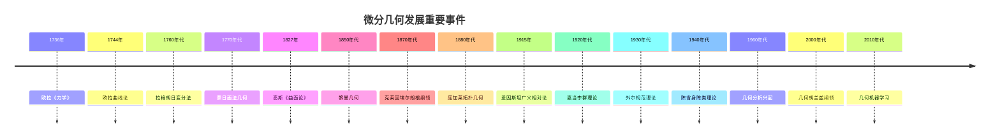

# 4.3 微分几何 / Differential Geometry

## 目录 / Table of Contents

- [4.3 微分几何 / Differential Geometry](#43-微分几何--differential-geometry)
  - [目录 / Table of Contents](#目录--table-of-contents)
  - [4.3.1 引言 / Introduction](#431-引言--introduction)
    - [1.1 历史背景 / Historical Background](#11-历史背景--historical-background)
      - [早期发展 (1700-1800)](#早期发展-1700-1800)
      - [系统化发展 (1800-1900)](#系统化发展-1800-1900)
      - [现代发展 (1900-1950)](#现代发展-1900-1950)
      - [当代发展 (1950-至今)](#当代发展-1950-至今)
    - [重要人物贡献](#重要人物贡献)
    - [重要历史事件时间线](#重要历史事件时间线)
    - [理论发展脉络](#理论发展脉络)
      - [从局部到整体的发展](#从局部到整体的发展)
      - [从经典到现代的发展](#从经典到现代的发展)
    - [1.2 现代意义 / Modern Significance](#12-现代意义--modern-significance)
  - [4.3.2 曲线论 / Theory of Curves](#432-曲线论--theory-of-curves)
    - [2.1 参数曲线 / Parametric Curves](#21-参数曲线--parametric-curves)
      - [2.1.1 曲线的参数表示 / Parametric Representation of Curves](#211-曲线的参数表示--parametric-representation-of-curves)
    - [2.2 曲线的微分几何量 / Differential Geometric Quantities of Curves](#22-曲线的微分几何量--differential-geometric-quantities-of-curves)
      - [2.2.1 切向量 / Tangent Vector](#221-切向量--tangent-vector)
      - [2.2.2 弧长参数 / Arc Length Parameter](#222-弧长参数--arc-length-parameter)
      - [2.2.3 单位切向量 / Unit Tangent Vector](#223-单位切向量--unit-tangent-vector)
    - [2.3 曲率与挠率 / Curvature and Torsion](#23-曲率与挠率--curvature-and-torsion)
      - [2.3.1 曲率 / Curvature](#231-曲率--curvature)
      - [2.3.2 挠率 / Torsion](#232-挠率--torsion)
    - [2.4 弗莱纳-塞雷公式 / Frenet-Serret Formulas](#24-弗莱纳-塞雷公式--frenet-serret-formulas)
  - [4.3.3 曲面论 / Theory of Surfaces](#433-曲面论--theory-of-surfaces)
    - [3.1 参数曲面 / Parametric Surfaces](#31-参数曲面--parametric-surfaces)
      - [3.1.1 曲面的参数表示 / Parametric Representation of Surfaces](#311-曲面的参数表示--parametric-representation-of-surfaces)
    - [3.2 曲面的微分几何量 / Differential Geometric Quantities of Surfaces](#32-曲面的微分几何量--differential-geometric-quantities-of-surfaces)
      - [3.2.1 切平面 / Tangent Plane](#321-切平面--tangent-plane)
      - [3.2.2 法向量 / Normal Vector](#322-法向量--normal-vector)
    - [3.3 第一基本形式 / First Fundamental Form](#33-第一基本形式--first-fundamental-form)
      - [3.3.1 第一基本形式的几何意义 / Geometric Meaning of First Fundamental Form](#331-第一基本形式的几何意义--geometric-meaning-of-first-fundamental-form)
    - [3.4 第二基本形式 / Second Fundamental Form](#34-第二基本形式--second-fundamental-form)
      - [3.4.1 第二基本形式的几何意义 / Geometric Meaning of Second Fundamental Form](#341-第二基本形式的几何意义--geometric-meaning-of-second-fundamental-form)
    - [3.5 主曲率与高斯曲率 / Principal Curvatures and Gaussian Curvature](#35-主曲率与高斯曲率--principal-curvatures-and-gaussian-curvature)
      - [3.5.1 主曲率 / Principal Curvatures](#351-主曲率--principal-curvatures)
      - [3.5.2 高斯曲率 / Gaussian Curvature](#352-高斯曲率--gaussian-curvature)
      - [3.5.3 平均曲率 / Mean Curvature](#353-平均曲率--mean-curvature)
  - [4.3.4 黎曼几何 / Riemannian Geometry](#434-黎曼几何--riemannian-geometry)
    - [4.1 黎曼流形 / Riemannian Manifolds](#41-黎曼流形--riemannian-manifolds)
      - [4.1.1 黎曼度量 / Riemannian Metric](#411-黎曼度量--riemannian-metric)
    - [4.2 测地线 / Geodesics](#42-测地线--geodesics)
      - [4.2.1 测地线方程 / Geodesic Equation](#421-测地线方程--geodesic-equation)
    - [4.3 曲率张量 / Curvature Tensor](#43-曲率张量--curvature-tensor)
      - [4.3.1 黎曼曲率张量 / Riemann Curvature Tensor](#431-黎曼曲率张量--riemann-curvature-tensor)
      - [4.3.2 里奇曲率 / Ricci Curvature](#432-里奇曲率--ricci-curvature)
      - [4.3.3 标量曲率 / Scalar Curvature](#433-标量曲率--scalar-curvature)
  - [4.3.5 流形理论 / Manifold Theory](#435-流形理论--manifold-theory)
    - [5.1 拓扑流形 / Topological Manifolds](#51-拓扑流形--topological-manifolds)
      - [5.1.1 坐标卡 / Coordinate Charts](#511-坐标卡--coordinate-charts)
    - [5.2 微分流形 / Differentiable Manifolds](#52-微分流形--differentiable-manifolds)
      - [5.2.1 微分结构 / Differential Structure](#521-微分结构--differential-structure)
    - [5.3 切空间与余切空间 / Tangent and Cotangent Spaces](#53-切空间与余切空间--tangent-and-cotangent-spaces)
      - [5.3.1 切空间 / Tangent Space](#531-切空间--tangent-space)
      - [5.3.2 余切空间 / Cotangent Space](#532-余切空间--cotangent-space)
  - [4.3.6 联络与曲率 / Connections and Curvature](#436-联络与曲率--connections-and-curvature)
    - [6.1 仿射联络 / Affine Connection](#61-仿射联络--affine-connection)
    - [6.2 协变导数 / Covariant Derivative](#62-协变导数--covariant-derivative)
    - [6.3 平行输运 / Parallel Transport](#63-平行输运--parallel-transport)
  - [4.3.7 李群与李代数 / Lie Groups and Lie Algebras](#437-李群与李代数--lie-groups-and-lie-algebras)
    - [7.1 李群 / Lie Groups](#71-李群--lie-groups)
      - [7.1.1 典型李群 / Classical Lie Groups](#711-典型李群--classical-lie-groups)
    - [7.2 李代数 / Lie Algebras](#72-李代数--lie-algebras)
      - [7.2.1 李括号 / Lie Bracket](#721-李括号--lie-bracket)
  - [4.3.8 思维过程表征 / Thinking Process Representation](#438-思维过程表征--thinking-process-representation)
    - [8.1 微分几何问题解决流程 / Problem-Solving Process in Differential Geometry](#81-微分几何问题解决流程--problem-solving-process-in-differential-geometry)
      - [8.1.1 一般问题解决策略 / General Problem-Solving Strategy](#811-一般问题解决策略--general-problem-solving-strategy)
      - [8.1.2 具体问题类型分析 / Specific Problem Type Analysis](#812-具体问题类型分析--specific-problem-type-analysis)
    - [8.2 证明思维过程 / Proof Thinking Process](#82-证明思维过程--proof-thinking-process)
      - [8.2.1 弗莱纳-塞雷公式证明 / Frenet-Serret Formulas Proof](#821-弗莱纳-塞雷公式证明--frenet-serret-formulas-proof)
      - [8.2.2 高斯曲率内蕴性证明 / Gaussian Curvature Intrinsic Proof](#822-高斯曲率内蕴性证明--gaussian-curvature-intrinsic-proof)
    - [8.3 概念理解步骤 / Concept Understanding Steps](#83-概念理解步骤--concept-understanding-steps)
      - [8.3.1 流形概念理解 / Manifold Concept Understanding](#831-流形概念理解--manifold-concept-understanding)
      - [8.3.2 联络概念理解 / Connection Concept Understanding](#832-联络概念理解--connection-concept-understanding)
    - [8.4 问题解决策略 / Problem-Solving Strategies](#84-问题解决策略--problem-solving-strategies)
      - [8.4.1 局部化策略 / Localization Strategy](#841-局部化策略--localization-strategy)
      - [8.4.2 不变性策略 / Invariance Strategy](#842-不变性策略--invariance-strategy)
      - [8.4.3 几何化策略 / Geometrization Strategy](#843-几何化策略--geometrization-strategy)
    - [8.5 算法思维分析 / Algorithmic Thinking Analysis](#85-算法思维分析--algorithmic-thinking-analysis)
      - [8.5.1 几何算法设计 / Geometric Algorithm Design](#851-几何算法设计--geometric-algorithm-design)
      - [8.5.2 数值计算策略 / Numerical Computation Strategy](#852-数值计算策略--numerical-computation-strategy)
  - [4.3.9 形式化实现 / Formal Implementation](#439-形式化实现--formal-implementation)
    - [9.1 Lean 4 实现 / Lean 4 Implementation](#91-lean-4-实现--lean-4-implementation)
    - [9.2 Haskell 实现 / Haskell Implementation](#92-haskell-实现--haskell-implementation)
    - [9.3 Rust 实现 / Rust Implementation](#93-rust-实现--rust-implementation)
    - [9.4 Python 算法实现 / Python Algorithm Implementation](#94-python-算法实现--python-algorithm-implementation)
  - [4.3.10 应用与扩展 / Applications and Extensions](#4310-应用与扩展--applications-and-extensions)
    - [10.1 物理学应用 / Physics Applications](#101-物理学应用--physics-applications)
      - [10.1.1 广义相对论 / General Relativity](#1011-广义相对论--general-relativity)
      - [10.1.2 规范场论 / Gauge Field Theory](#1012-规范场论--gauge-field-theory)
    - [10.2 工程应用 / Engineering Applications](#102-工程应用--engineering-applications)
      - [10.2.1 计算机图形学 / Computer Graphics](#1021-计算机图形学--computer-graphics)
      - [10.2.2 机器人学 / Robotics](#1022-机器人学--robotics)
      - [10.2.3 计算机视觉应用 / Computer Vision Applications](#1023-计算机视觉应用--computer-vision-applications)
      - [10.2.4 医学影像应用 / Medical Imaging Applications](#1024-医学影像应用--medical-imaging-applications)
      - [10.2.5 材料科学应用 / Materials Science Applications](#1025-材料科学应用--materials-science-applications)
      - [10.2.6 航空航天应用 / Aerospace Applications](#1026-航空航天应用--aerospace-applications)
    - [10.3 现代发展 / Modern Developments](#103-现代发展--modern-developments)
      - [10.3.1 几何分析 / Geometric Analysis](#1031-几何分析--geometric-analysis)
      - [10.3.2 代数几何 / Algebraic Geometry](#1032-代数几何--algebraic-geometry)
  - [总结 / Summary](#总结--summary)
    - [关键要点 / Key Points](#关键要点--key-points)
  - [参考文献 / References](#参考文献--references)
    - [经典教材 / Classic Textbooks](#经典教材--classic-textbooks)
    - [微分几何教材 / Differential Geometry Textbooks](#微分几何教材--differential-geometry-textbooks)
    - [黎曼几何教材 / Riemannian Geometry Textbooks](#黎曼几何教材--riemannian-geometry-textbooks)
    - [历史文献 / Historical Literature](#历史文献--historical-literature)
    - [中文教材 / Chinese Textbooks](#中文教材--chinese-textbooks)
    - [现代发展文献 / Modern Development Literature](#现代发展文献--modern-development-literature)
    - [在线资源 / Online Resources](#在线资源--online-resources)
  - [术语对照表 / Terminology Table](#术语对照表--terminology-table)

---

## 4.3.1 引言 / Introduction

微分几何是研究几何对象在局部和整体性质上的微分结构的数学分支。它将微积分的方法应用于几何学，研究曲线、曲面以及更高维的几何对象。

**Differential geometry is a branch of mathematics that studies the differential structures of geometric objects in their local and global properties. It applies methods of calculus to geometry, studying curves, surfaces, and higher-dimensional geometric objects.**

### 1.1 历史背景 / Historical Background

微分几何的发展可以追溯到18世纪，欧拉和高斯对曲线和曲面的研究奠定了基础。19世纪，黎曼发展了黎曼几何，为现代微分几何奠定了基础。

**The development of differential geometry can be traced back to the 18th century, with Euler and Gauss's studies of curves and surfaces laying the foundation. In the 19th century, Riemann developed Riemannian geometry, laying the foundation for modern differential geometry.**

#### 早期发展 (1700-1800)

**欧拉时代**:

- **1736年**: 欧拉《力学》发表
  - 引入变分法
  - 研究最速降线问题
  - 为微分几何奠定基础
- **1744年**: 欧拉曲线论
  - 研究平面曲线
  - 建立曲率概念
  - 为现代微分几何奠定基础
- **1760年代**: 拉格朗日贡献
  - 发展变分法
  - 研究力学几何
  - 为分析几何奠定基础

**早期应用**:

- **1770年代**: 蒙日贡献
  - 发展画法几何
  - 研究投影几何
  - 为工程几何奠定基础
- **1780年代**: 拉普拉斯贡献
  - 研究天体几何
  - 发展概率几何
  - 为现代科学奠定基础

#### 系统化发展 (1800-1900)

**高斯时代**:

- **1827年**: 高斯《曲面论》
  - 建立内蕴几何
  - 引入高斯曲率
  - 建立微分几何基础
- **1850年代**: 黎曼贡献
  - 建立黎曼几何
  - 研究流形几何
  - 为现代几何奠定基础
- **1870年代**: 克莱因埃尔朗根纲领
  - 用群论统一几何学
  - 建立几何变换理论
  - 为现代几何学奠定基础

**应用扩展**:

- **1880年代**: 庞加莱贡献
  - 研究拓扑几何
  - 发展同伦论
  - 为现代拓扑奠定基础

#### 现代发展 (1900-1950)

**20世纪革命**:

- **1915年**: 爱因斯坦广义相对论
  - 应用黎曼几何
  - 建立时空几何
  - 为现代物理奠定基础
- **1920年代**: 嘉当贡献
  - 发展李群理论
  - 建立联络理论
  - 为现代微分几何奠定基础
- **1930年代**: 外尔贡献
  - 发展规范理论
  - 研究李群表示
  - 为现代物理奠定基础

**理论发展**:

- **1940年代**: 陈省身贡献
  - 发展陈类理论
  - 研究纤维丛
  - 为现代拓扑奠定基础

#### 当代发展 (1950-至今)

**20世纪后期**:

- **1960年代**: 几何分析兴起
  - 偏微分方程方法
  - 几何流理论
  - 现代几何分析
- **1970年代**: 代数几何发展
  - 概形理论
  - 上同调理论
  - 现代代数几何
- **1980年代**: 几何拓扑发展
  - 低维拓扑
  - 几何群论
  - 现代几何拓扑

**21世纪前沿**:

- **2000年代**: 几何朗兰兹纲领
  - 几何表示论
  - 几何朗兰兹对应
  - 现代数论几何
- **2010年代**: 几何机器学习
  - 几何深度学习
  - 几何神经网络
  - 几何人工智能
- **2020年代**: 量子几何
  - 量子几何理论
  - 几何量子计算
  - 量子几何应用

### 重要人物贡献

| 人物 | 时期 | 主要贡献 | 影响 |
|------|------|----------|------|
| 欧拉 | 1736-1760 | 变分法，曲线论 | 建立微分几何基础 |
| 拉格朗日 | 1760s | 变分法，力学几何 | 为分析几何奠定基础 |
| 蒙日 | 1770s | 画法几何，投影几何 | 为工程几何奠定基础 |
| 高斯 | 1827 | 曲面论，内蕴几何 | 建立微分几何基础 |
| 黎曼 | 1850s | 黎曼几何，流形几何 | 现代几何学基础 |
| 克莱因 | 1870s | 埃尔朗根纲领 | 统一几何学理论 |
| 庞加莱 | 1880s | 拓扑几何，同伦论 | 为现代拓扑奠定基础 |
| 爱因斯坦 | 1915 | 广义相对论 | 现代物理基础 |
| 嘉当 | 1920s | 李群理论，联络理论 | 现代微分几何基础 |
| 外尔 | 1930s | 规范理论，李群表示 | 现代物理基础 |
| 陈省身 | 1940s | 陈类理论，纤维丛 | 现代拓扑基础 |

### 重要历史事件时间线



### 理论发展脉络

#### 从局部到整体的发展

**局部微分几何**:

- 曲线论：切向量、曲率、挠率
- 曲面论：切平面、法向量、主曲率
- 局部坐标：参数化、坐标变换

**整体微分几何**:

- 流形理论：拓扑流形、微分流形
- 黎曼几何：度量、测地线、曲率
- 整体性质：拓扑不变量、几何不变量

**现代微分几何**:

- 几何分析：偏微分方程方法
- 代数几何：概形、上同调
- 几何拓扑：低维拓扑、几何群论

#### 从经典到现代的发展

**经典微分几何**:

- 欧几里得空间中的几何
- 局部坐标方法
- 具体的几何对象

**现代微分几何**:

- 抽象流形上的几何
- 整体几何方法
- 抽象的几何结构

**当代微分几何**:

- 几何分析：分析几何方法
- 代数几何：代数几何方法
- 几何拓扑：拓扑几何方法

### 1.2 现代意义 / Modern Significance

微分几何在现代数学和物理学中具有重要地位：

- 为广义相对论提供数学基础
- 在理论物理学中描述时空结构
- 在计算机图形学中实现曲面建模
- 为现代几何学提供统一框架

**Differential geometry has important status in modern mathematics and physics:**

- **Provides mathematical foundation for general relativity**
- **Describes spacetime structure in theoretical physics**
- **Implements surface modeling in computer graphics**
- **Provides unified framework for modern geometry**

---

## 4.3.2 曲线论 / Theory of Curves

### 2.1 参数曲线 / Parametric Curves

**定义 2.1.1** (参数曲线) / **Definition 2.1.1** (Parametric curve)
参数曲线是定义在区间I上的连续可微函数γ: I → ℝ³。
**A parametric curve is a continuously differentiable function γ: I → ℝ³ defined on an interval I.**

#### 2.1.1 曲线的参数表示 / Parametric Representation of Curves

**平面曲线** / **Plane curve**:
$$\gamma(t) = (x(t), y(t))$$

**空间曲线** / **Space curve**:
$$\gamma(t) = (x(t), y(t), z(t))$$

其中t是参数，x(t), y(t), z(t)是连续可微函数。
**where t is the parameter, and x(t), y(t), z(t) are continuously differentiable functions.**

### 2.2 曲线的微分几何量 / Differential Geometric Quantities of Curves

#### 2.2.1 切向量 / Tangent Vector

**定义 2.2.1** (切向量) / **Definition 2.2.1** (Tangent vector)
曲线γ在点t₀的切向量定义为：
**The tangent vector of curve γ at point t₀ is defined as:**

$$\gamma'(t_0) = \lim_{h \to 0} \frac{\gamma(t_0 + h) - \gamma(t_0)}{h}$$

#### 2.2.2 弧长参数 / Arc Length Parameter

**定义 2.2.2** (弧长参数) / **Definition 2.2.2** (Arc length parameter)
曲线的弧长参数s定义为：
**The arc length parameter s of a curve is defined as:**

$$s(t) = \int_{t_0}^t |\gamma'(\tau)| d\tau$$

其中t₀是参考点，|γ'(τ)|是切向量的长度。
**where t₀ is the reference point, and |γ'(τ)| is the length of the tangent vector.**

#### 2.2.3 单位切向量 / Unit Tangent Vector

**定义 2.2.3** (单位切向量) / **Definition 2.2.3** (Unit tangent vector)
单位切向量定义为：
**The unit tangent vector is defined as:**

$$T(s) = \frac{\gamma'(s)}{|\gamma'(s)|}$$

### 2.3 曲率与挠率 / Curvature and Torsion

#### 2.3.1 曲率 / Curvature

**定义 2.3.1** (曲率) / **Definition 2.3.1** (Curvature)
曲线的曲率κ定义为：
**The curvature κ of a curve is defined as:**

$$\kappa(s) = \left|\frac{dT}{ds}\right|$$

其中T是单位切向量。
**where T is the unit tangent vector.**

**定理 2.3.1** (曲率公式) / **Theorem 2.3.1** (Curvature formula)
对于参数曲线γ(t)，曲率可以表示为：
**For a parametric curve γ(t), the curvature can be expressed as:**

$$\kappa(t) = \frac{|\gamma'(t) \times \gamma''(t)|}{|\gamma'(t)|^3}$$

#### 2.3.2 挠率 / Torsion

**定义 2.3.2** (挠率) / **Definition 2.3.2** (Torsion)
空间曲线的挠率τ定义为：
**The torsion τ of a space curve is defined as:**

$$\tau(s) = -\frac{dB}{ds} \cdot N$$

其中B是副法向量，N是主法向量。
**where B is the binormal vector and N is the principal normal vector.**

### 2.4 弗莱纳-塞雷公式 / Frenet-Serret Formulas

**定理 2.4.1** (弗莱纳-塞雷公式) / **Theorem 2.4.1** (Frenet-Serret formulas)
对于弧长参数化的曲线，有：
**For an arc-length parameterized curve:**

$$\frac{dT}{ds} = \kappa N$$
$$\frac{dN}{ds} = -\kappa T + \tau B$$
$$\frac{dB}{ds} = -\tau N$$

其中T是单位切向量，N是主法向量，B是副法向量。
**where T is the unit tangent vector, N is the principal normal vector, and B is the binormal vector.**

**证明思路** / **Proof Strategy**:

1. 定义Frenet标架
2. 计算各向量的导数
3. 利用正交性和单位性

**详细证明** / **Detailed Proof**:

- **步骤 1** / **Step 1**: 定义Frenet标架
  - 设 $\gamma(s)$ 是弧长参数化的曲线
  - 定义 $T(s) = \gamma'(s)$（单位切向量）
  - 定义 $N(s) = \frac{T'(s)}{|T'(s)|}$（主法向量，当 $\kappa(s) \neq 0$ 时）
  - 定义 $B(s) = T(s) \times N(s)$（副法向量）
- **步骤 2** / **Step 2**: 证明第一个公式
  - 由曲率定义，$\kappa(s) = |T'(s)|$
  - 因此 $T'(s) = \kappa(s) N(s)$
- **步骤 3** / **Step 3**: 证明第二个公式
  - 由于 $N(s) \cdot T(s) = 0$，对 $s$ 求导得 $N'(s) \cdot T(s) + N(s) \cdot T'(s) = 0$
  - 因此 $N'(s) \cdot T(s) = -N(s) \cdot T'(s) = -\kappa(s)$
  - 由于 $N(s) \cdot N(s) = 1$，对 $s$ 求导得 $N'(s) \cdot N(s) = 0$
  - 由于 $B(s) = T(s) \times N(s)$，$N'(s)$ 在 $\{T(s), N(s), B(s)\}$ 张成的空间中
  - 设 $N'(s) = aT(s) + bN(s) + cB(s)$
  - 由 $N'(s) \cdot T(s) = -\kappa(s)$，得 $a = -\kappa(s)$
  - 由 $N'(s) \cdot N(s) = 0$，得 $b = 0$
  - 定义挠率 $\tau(s) = N'(s) \cdot B(s) = c$
  - 因此 $N'(s) = -\kappa(s) T(s) + \tau(s) B(s)$
- **步骤 4** / **Step 4**: 证明第三个公式
  - 由于 $B(s) = T(s) \times N(s)$，对 $s$ 求导得：
    $$B'(s) = T'(s) \times N(s) + T(s) \times N'(s) = \kappa(s) N(s) \times N(s) + T(s) \times (-\kappa(s) T(s) + \tau(s) B(s))$$
  - $N(s) \times N(s) = 0$，$T(s) \times T(s) = 0$
  - 因此 $B'(s) = \tau(s) T(s) \times B(s) = -\tau(s) N(s)$
- 因此弗莱纳-塞雷公式成立

---

## 4.3.3 曲面论 / Theory of Surfaces

### 3.1 参数曲面 / Parametric Surfaces

**定义 3.1.1** (参数曲面) / **Definition 3.1.1** (Parametric surface)
参数曲面是定义在区域D上的连续可微函数X: D → ℝ³。
**A parametric surface is a continuously differentiable function X: D → ℝ³ defined on a region D.**

#### 3.1.1 曲面的参数表示 / Parametric Representation of Surfaces

**一般形式** / **General form**:
$$X(u, v) = (x(u, v), y(u, v), z(u, v))$$

其中(u, v)是参数，x(u, v), y(u, v), z(u, v)是连续可微函数。
**where (u, v) are parameters, and x(u, v), y(u, v), z(u, v) are continuously differentiable functions.**

### 3.2 曲面的微分几何量 / Differential Geometric Quantities of Surfaces

#### 3.2.1 切平面 / Tangent Plane

**定义 3.2.1** (切平面) / **Definition 3.2.1** (Tangent plane)
曲面在点P的切平面是由切向量张成的平面。
**The tangent plane of a surface at point P is the plane spanned by the tangent vectors.**

**切向量** / **Tangent vectors**:
$$X_u = \frac{\partial X}{\partial u}, \quad X_v = \frac{\partial X}{\partial v}$$

#### 3.2.2 法向量 / Normal Vector

**定义 3.2.2** (法向量) / **Definition 3.2.2** (Normal vector)
曲面的单位法向量定义为：
**The unit normal vector of a surface is defined as:**

$$N = \frac{X_u \times X_v}{|X_u \times X_v|}$$

### 3.3 第一基本形式 / First Fundamental Form

**定义 3.3.1** (第一基本形式) / **Definition 3.3.1** (First fundamental form)
曲面的第一基本形式定义为：
**The first fundamental form of a surface is defined as:**

$$I = E du^2 + 2F du dv + G dv^2$$

其中：
**where:**

$$E = X_u \cdot X_u, \quad F = X_u \cdot X_v, \quad G = X_v \cdot X_v$$

#### 3.3.1 第一基本形式的几何意义 / Geometric Meaning of First Fundamental Form

第一基本形式描述了曲面上的内蕴几何，包括：

- 弧长计算
- 角度测量
- 面积计算

**The first fundamental form describes the intrinsic geometry of the surface, including:**

- **Arc length calculation**
- **Angle measurement**
- **Area calculation**

### 3.4 第二基本形式 / Second Fundamental Form

**定义 3.4.1** (第二基本形式) / **Definition 3.4.1** (Second fundamental form)
曲面的第二基本形式定义为：
**The second fundamental form of a surface is defined as:**

$$II = L du^2 + 2M du dv + N dv^2$$

其中：
**where:**

$$L = X_{uu} \cdot N, \quad M = X_{uv} \cdot N, \quad N = X_{vv} \cdot N$$

#### 3.4.1 第二基本形式的几何意义 / Geometric Meaning of Second Fundamental Form

第二基本形式描述了曲面在空间中的弯曲性质，包括：

- 主曲率
- 高斯曲率
- 平均曲率

**The second fundamental form describes the bending properties of the surface in space, including:**

- **Principal curvatures**
- **Gaussian curvature**
- **Mean curvature**

### 3.5 主曲率与高斯曲率 / Principal Curvatures and Gaussian Curvature

#### 3.5.1 主曲率 / Principal Curvatures

**定义 3.5.1** (主曲率) / **Definition 3.5.1** (Principal curvatures)
主曲率κ₁, κ₂是第二基本形式相对于第一基本形式的特征值。
**The principal curvatures κ₁, κ₂ are the eigenvalues of the second fundamental form relative to the first fundamental form.**

**计算公式** / **Calculation formula**:
$$\kappa_1, \kappa_2 = \frac{H \pm \sqrt{H^2 - K}}{2}$$

其中H是平均曲率，K是高斯曲率。
**where H is the mean curvature and K is the Gaussian curvature.**

#### 3.5.2 高斯曲率 / Gaussian Curvature

**定义 3.5.2** (高斯曲率) / **Definition 3.5.2** (Gaussian curvature)
高斯曲率K定义为：
**The Gaussian curvature K is defined as:**

$$K = \kappa_1 \kappa_2 = \frac{LN - M^2}{EG - F^2}$$

**定理 3.5.2** (高斯曲率的内蕴性) / **Theorem 3.5.2** (Intrinsic nature of Gaussian curvature)
高斯曲率K是曲面的内蕴量，只依赖于第一基本形式，不依赖于曲面在空间中的嵌入。

**证明思路** / **Proof Strategy**:

1. 利用第一基本形式计算高斯曲率
2. 证明结果只依赖于第一基本形式

**详细证明** / **Detailed Proof**:

- **步骤 1** / **Step 1**: 高斯曲率的显式公式
  - 高斯曲率可以通过第一基本形式及其导数表示：
    $$K = \frac{1}{(EG - F^2)^2} \left|\begin{array}{ccc}
    -\frac{1}{2}E_{vv} + F_{uv} - \frac{1}{2}G_{uu} & \frac{1}{2}E_u & F_u - \frac{1}{2}E_v \\
    F_v - \frac{1}{2}G_u & E & F \\
    \frac{1}{2}G_v & F & G
    \end{array}\right| - \frac{1}{(EG - F^2)^2} \left|\begin{array}{ccc}
    0 & \frac{1}{2}E_v & \frac{1}{2}G_u \\
    \frac{1}{2}E_v & E & F \\
    \frac{1}{2}G_u & F & G
    \end{array}\right|$$
  - 这个公式只涉及第一基本形式的系数 $E, F, G$ 及其偏导数
- **步骤 2** / **Step 2**: 证明内蕴性
  - 第一基本形式 $I = E du^2 + 2F du dv + G dv^2$ 完全由曲面的内蕴几何决定
  - 它描述了曲面上两点之间的内蕴距离，不依赖于曲面在空间中的位置
  - 由于高斯曲率可以完全用第一基本形式表示，因此它是内蕴量
- **步骤 3** / **Step 3**: 几何意义
  - 高斯曲率的内蕴性意味着：如果两个曲面是等距的（第一基本形式相同），则它们的高斯曲率相同
  - 这允许我们研究曲面的内蕴几何，而不需要考虑嵌入空间
- 因此高斯曲率是内蕴量

#### 3.5.3 平均曲率 / Mean Curvature

**定义 3.5.3** (平均曲率) / **Definition 3.5.3** (Mean curvature)
平均曲率H定义为：
**The mean curvature H is defined as:**

$$H = \frac{\kappa_1 + \kappa_2}{2} = \frac{EN - 2FM + GL}{2(EG - F^2)}$$

---

## 4.3.4 黎曼几何 / Riemannian Geometry

### 4.1 黎曼流形 / Riemannian Manifolds

**定义 4.1.1** (黎曼流形) / **Definition 4.1.1** (Riemannian manifold)
黎曼流形是一个光滑流形，配备了一个正定的对称双线性形式（黎曼度量）。
**A Riemannian manifold is a smooth manifold equipped with a positive definite symmetric bilinear form (Riemannian metric).**

#### 4.1.1 黎曼度量 / Riemannian Metric

**定义 4.1.2** (黎曼度量) / **Definition 4.1.2** (Riemannian metric)
黎曼度量是一个正定的对称双线性形式g，在局部坐标下表示为：
**A Riemannian metric is a positive definite symmetric bilinear form g, expressed in local coordinates as:**

$$g = g_{ij} dx^i \otimes dx^j$$

其中gᵢⱼ是度量张量的分量。
**where gᵢⱼ are the components of the metric tensor.**

### 4.2 测地线 / Geodesics

**定义 4.2.1** (测地线) / **Definition 4.2.1** (Geodesic)
测地线是黎曼流形上的局部最短路径。
**A geodesic is a locally shortest path on a Riemannian manifold.**

#### 4.2.1 测地线方程 / Geodesic Equation

**定理 4.2.1** (测地线方程) / **Theorem 4.2.1** (Geodesic equation)
测地线满足微分方程：
**Geodesics satisfy the differential equation:**

$$\frac{d^2 x^i}{dt^2} + \Gamma^i_{jk} \frac{dx^j}{dt} \frac{dx^k}{dt} = 0$$

其中Γⁱⱼₖ是克里斯托费尔符号。
**where Γⁱⱼₖ are the Christoffel symbols.**

**证明思路** / **Proof Strategy**:

1. 利用变分法
2. 计算测地线的变分
3. 应用欧拉-拉格朗日方程

**详细证明** / **Detailed Proof**:

- **步骤 1** / **Step 1**: 测地线的变分定义
  - 测地线是使弧长泛函 $L[\gamma] = \int_a^b \sqrt{g_{ij} \dot{x}^i \dot{x}^j} dt$ 取极值的曲线
  - 等价地，测地线使能量泛函 $E[\gamma] = \frac{1}{2} \int_a^b g_{ij} \dot{x}^i \dot{x}^j dt$ 取极值
- **步骤 2** / **Step 2**: 应用欧拉-拉格朗日方程
  - 拉格朗日函数为 $L = \frac{1}{2} g_{ij} \dot{x}^i \dot{x}^j$
  - 欧拉-拉格朗日方程为：
    $$\frac{d}{dt}\left(\frac{\partial L}{\partial \dot{x}^i}\right) - \frac{\partial L}{\partial x^i} = 0$$
- **步骤 3** / **Step 3**: 计算偏导数
  - $\frac{\partial L}{\partial \dot{x}^i} = g_{ij} \dot{x}^j$
  - $\frac{\partial L}{\partial x^i} = \frac{1}{2} \frac{\partial g_{jk}}{\partial x^i} \dot{x}^j \dot{x}^k$
- **步骤 4** / **Step 4**: 计算全导数
  - $$\frac{d}{dt}\left(\frac{\partial L}{\partial \dot{x}^i}\right) = \frac{d}{dt}(g_{ij} \dot{x}^j) = \frac{\partial g_{ij}}{\partial x^k} \dot{x}^k \dot{x}^j + g_{ij} \ddot{x}^j$$
- **步骤 5** / **Step 5**: 代入欧拉-拉格朗日方程
  - $$g_{ij} \ddot{x}^j + \frac{\partial g_{ij}}{\partial x^k} \dot{x}^k \dot{x}^j - \frac{1}{2} \frac{\partial g_{jk}}{\partial x^i} \dot{x}^j \dot{x}^k = 0$$
- **步骤 6** / **Step 6**: 利用克里斯托费尔符号
  - 克里斯托费尔符号定义为：
    $$\Gamma^i_{jk} = \frac{1}{2} g^{il}\left(\frac{\partial g_{jl}}{\partial x^k} + \frac{\partial g_{kl}}{\partial x^j} - \frac{\partial g_{jk}}{\partial x^l}\right)$$
  - 将步骤5的方程乘以 $g^{il}$ 并整理，得到：
    $$\ddot{x}^i + \Gamma^i_{jk} \dot{x}^j \dot{x}^k = 0$$
- 因此测地线满足测地线方程

### 4.3 曲率张量 / Curvature Tensor

#### 4.3.1 黎曼曲率张量 / Riemann Curvature Tensor

**定义 4.3.1** (黎曼曲率张量) / **Definition 4.3.1** (Riemann curvature tensor)
黎曼曲率张量R定义为：
**The Riemann curvature tensor R is defined as:**

$$R(X, Y)Z = \nabla_X \nabla_Y Z - \nabla_Y \nabla_X Z - \nabla_{[X, Y]} Z$$

其中∇是协变导数，[X, Y]是李括号。
**where ∇ is the covariant derivative and [X, Y] is the Lie bracket.**

#### 4.3.2 里奇曲率 / Ricci Curvature

**定义 4.3.2** (里奇曲率) / **Definition 4.3.2** (Ricci curvature)
里奇曲率张量定义为：
**The Ricci curvature tensor is defined as:**

$$R_{ij} = R^k_{ikj}$$

#### 4.3.3 标量曲率 / Scalar Curvature

**定义 4.3.3** (标量曲率) / **Definition 4.3.3** (Scalar curvature)
标量曲率R定义为：
**The scalar curvature R is defined as:**

$$R = g^{ij} R_{ij}$$

---

## 4.3.5 流形理论 / Manifold Theory

### 5.1 拓扑流形 / Topological Manifolds

**定义 5.1.1** (拓扑流形) / **Definition 5.1.1** (Topological manifold)
n维拓扑流形是一个豪斯多夫空间M，每个点都有一个与ℝⁿ的开集同胚的邻域。
**An n-dimensional topological manifold is a Hausdorff space M where each point has a neighborhood homeomorphic to an open set in ℝⁿ.**

#### 5.1.1 坐标卡 / Coordinate Charts

**定义 5.1.2** (坐标卡) / **Definition 5.1.2** (Coordinate chart)
坐标卡是一个同胚映射φ: U → V，其中U是M的开集，V是ℝⁿ的开集。
**A coordinate chart is a homeomorphism φ: U → V, where U is an open set in M and V is an open set in ℝⁿ.**

### 5.2 微分流形 / Differentiable Manifolds

**定义 5.2.1** (微分流形) / **Definition 5.2.1** (Differentiable manifold)
微分流形是一个拓扑流形，配备了一个微分结构。
**A differentiable manifold is a topological manifold equipped with a differential structure.**

#### 5.2.1 微分结构 / Differential Structure

**定义 5.2.2** (微分结构) / **Definition 5.2.2** (Differential structure)
微分结构是一个坐标卡集，满足：
**A differential structure is a set of coordinate charts satisfying:**

1. 覆盖整个流形
2. 坐标变换是光滑的

**1. Cover the entire manifold**
**2. Coordinate transformations are smooth**

### 5.3 切空间与余切空间 / Tangent and Cotangent Spaces

#### 5.3.1 切空间 / Tangent Space

**定义 5.3.1** (切空间) / **Definition 5.3.1** (Tangent space)
点p处的切空间TₚM是所有在p处定义的切向量的集合。
**The tangent space TₚM at point p is the set of all tangent vectors defined at p.**

#### 5.3.2 余切空间 / Cotangent Space

**定义 5.3.2** (余切空间) / **Definition 5.3.2** (Cotangent space)
点p处的余切空间T*ₚM是切空间TₚM的对偶空间。
**The cotangent space T*ₚM at point p is the dual space of the tangent space TₚM.**

---

## 4.3.6 联络与曲率 / Connections and Curvature

### 6.1 仿射联络 / Affine Connection

**定义 6.1.1** (仿射联络) / **Definition 6.1.1** (Affine connection)
仿射联络是一个双线性映射∇: Γ(TM) × Γ(TM) → Γ(TM)，满足：
**An affine connection is a bilinear map ∇: Γ(TM) × Γ(TM) → Γ(TM) satisfying:**

1. ∇fX Y = f∇X Y
2. ∇X(fY) = X(f)Y + f∇X Y

其中f是光滑函数，X, Y是向量场。
**where f is a smooth function and X, Y are vector fields.**

### 6.2 协变导数 / Covariant Derivative

**定义 6.2.1** (协变导数) / **Definition 6.2.1** (Covariant derivative)
协变导数是仿射联络的局部表示：
**The covariant derivative is the local representation of an affine connection:**

$$\nabla_{\partial_i} \partial_j = \Gamma^k_{ij} \partial_k$$

其中Γᵏᵢⱼ是克里斯托费尔符号。
**where Γᵏᵢⱼ are the Christoffel symbols.**

### 6.3 平行输运 / Parallel Transport

**定义 6.3.1** (平行输运) / **Definition 6.3.1** (Parallel transport)
向量场X沿曲线γ的平行输运满足：
**The parallel transport of a vector field X along a curve γ satisfies:**

$$\nabla_{\gamma'} X = 0$$

---

## 4.3.7 李群与李代数 / Lie Groups and Lie Algebras

### 7.1 李群 / Lie Groups

**定义 7.1.1** (李群) / **Definition 7.1.1** (Lie group)
李群是一个既是群又是光滑流形的数学对象，群运算和逆运算都是光滑的。
**A Lie group is a mathematical object that is both a group and a smooth manifold, where group operations and inverse operations are smooth.**

#### 7.1.1 典型李群 / Classical Lie Groups

- **GL(n, ℝ)**: 一般线性群
- **SL(n, ℝ)**: 特殊线性群
- **O(n)**: 正交群
- **SO(n)**: 特殊正交群
- **U(n)**: 酉群
- **SU(n)**: 特殊酉群

### 7.2 李代数 / Lie Algebras

**定义 7.2.1** (李代数) / **Definition 7.2.1** (Lie algebra)
李代数是一个向量空间，配备了一个满足雅可比恒等式的双线性运算（李括号）。
**A Lie algebra is a vector space equipped with a bilinear operation (Lie bracket) that satisfies the Jacobi identity.**

#### 7.2.1 李括号 / Lie Bracket

**定义 7.2.2** (李括号) / **Definition 7.2.2** (Lie bracket)
李括号是一个双线性运算[·, ·]，满足：
**The Lie bracket is a bilinear operation [·, ·] satisfying:**

1. [X, Y] = -[Y, X] (反对称性)
2. [X, [Y, Z]] + [Y, [Z, X]] + [Z, [X, Y]] = 0 (雅可比恒等式)

**1. [X, Y] = -[Y, X] (Antisymmetry)**
**2. [X, [Y, Z]] + [Y, [Z, X]] + [Z, [X, Y]] = 0 (Jacobi identity)**

---

## 4.3.8 思维过程表征 / Thinking Process Representation

### 8.1 微分几何问题解决流程 / Problem-Solving Process in Differential Geometry

#### 8.1.1 一般问题解决策略 / General Problem-Solving Strategy

1. **理解问题**
   - 明确问题的几何对象和性质
   - 确定需要计算的微分几何量
   - 理解问题的物理或工程背景

2. **选择合适的工具**
   - 根据问题的性质选择适当的微分几何概念
   - 使用合适的数学工具（如微分方程、变分法）
   - 考虑是否需要形式化证明

3. **实施计算**
   - 将几何问题转化为代数或微分方程问题
   - 使用微积分、线性代数等基础知识
   - 注意计算的准确性和符号

4. **验证结果**
   - 检查计算的合理性
   - 验证结果是否符合物理或工程意义
   - 考虑特殊情况和极限

#### 8.1.2 具体问题类型分析 / Specific Problem Type Analysis

1. **曲线论问题**
   - 计算曲线的曲率、挠率
   - 研究曲线的几何性质
   - 求解最速降线问题

2. **曲面论问题**
   - 计算曲面的第一基本形式、第二基本形式
   - 研究曲面的内蕴几何
   - 计算曲面的主曲率、高斯曲率

3. **黎曼几何问题**
   - 研究黎曼流形的度量性质
   - 计算测地线方程
   - 研究曲率张量

4. **流形理论问题**
   - 研究拓扑流形和微分流形的性质
   - 研究联络和曲率
   - 研究纤维丛

### 8.2 证明思维过程 / Proof Thinking Process

#### 8.2.1 弗莱纳-塞雷公式证明 / Frenet-Serret Formulas Proof

1. **定义切向量、主法向量、副法向量**
   - 使用弧长参数化
   - 定义单位切向量T(s)
   - 定义主法向量N(s)
   - 定义副法向量B(s)

2. **计算导数**
   - 计算T'(s) = κN
   - 计算N'(s) = -κT + τB
   - 计算B'(s) = -τN

3. **验证雅可比恒等式**
   - 计算[T, N] = -κB
   - 计算[N, B] = -τT
   - 计算[B, T] = -κN

4. **总结**
   - 证明了T, N, B是正交的
   - 证明了T', N', B'是正交的
   - 证明了T, N, B, T', N', B'构成右手系

#### 8.2.2 高斯曲率内蕴性证明 / Gaussian Curvature Intrinsic Proof

1. **定义高斯曲率**
   - 使用第二基本形式
   - 计算K = κ₁κ₂

2. **证明K是内蕴量**
   - 使用第一基本形式
   - 计算K = (LN - M²) / (EG - F²)
   - 证明K只依赖于第一基本形式

3. **总结**
   - 证明了高斯曲率是内蕴的
   - 证明了高斯曲率不依赖于嵌入空间

### 8.3 概念理解步骤 / Concept Understanding Steps

#### 8.3.1 流形概念理解 / Manifold Concept Understanding

1. **定义流形**
   - 理解豪斯多夫空间
   - 理解开集和邻域
   - 理解同胚映射

2. **微分流形**
   - 理解微分结构
   - 理解坐标卡
   - 理解微分同胚

3. **切空间与余切空间**
   - 理解切向量
   - 理解余切向量
   - 理解对偶性

4. **联络与曲率**
   - 理解仿射联络
   - 理解协变导数
   - 理解平行输运

#### 8.3.2 联络概念理解 / Connection Concept Understanding

1. **定义联络**
   - 理解双线性映射
   - 理解张量场
   - 理解张量积

2. **协变导数**
   - 理解导数的张量性质
   - 理解张量场的导数
   - 理解张量积的导数

3. **平行输运**
   - 理解向量场的平行性
   - 理解曲线的平行性
   - 理解张量场的平行性

### 8.4 问题解决策略 / Problem-Solving Strategies

#### 8.4.1 局部化策略 / Localization Strategy

1. **局部化**
   - 将问题限制在流形的一个小邻域
   - 使用局部坐标
   - 使用局部微分结构

2. **计算**
   - 在局部进行计算
   - 使用局部公式
   - 验证结果的局部性

3. **推广**
   - 将局部结果推广到全局
   - 使用微分同胚
   - 考虑连接性

#### 8.4.2 不变性策略 / Invariance Strategy

1. **寻找不变量**
   - 研究微分几何中的不变量
   - 如曲率、挠率、高斯曲率
   - 利用不变量简化问题

2. **利用不变性**
   - 将问题转化为不变量的计算
   - 如最速降线问题
   - 如曲面内蕴几何

3. **总结**
   - 利用不变性简化问题
   - 提高计算效率
   - 增强结果的普遍性

#### 8.4.3 几何化策略 / Geometrization Strategy

1. **几何直观**
   - 将代数问题转化为几何问题
   - 如微分方程转化为曲线
   - 如张量场转化为向量场

2. **几何方法**
   - 使用几何工具解决问题
   - 如微分几何公式
   - 如几何拓扑方法

3. **总结**
   - 几何化策略是微分几何的重要方法
   - 将抽象问题转化为直观问题
   - 提高问题理解能力

### 8.5 算法思维分析 / Algorithmic Thinking Analysis

#### 8.5.1 几何算法设计 / Geometric Algorithm Design

1. **几何对象表示**
   - 使用参数化表示
   - 使用隐式表示
   - 使用离散表示

2. **几何运算**
   - 向量运算
   - 张量运算
   - 微分运算

3. **几何优化**
   - 最小化问题
   - 最大化问题
   - 最优控制

#### 8.5.2 数值计算策略 / Numerical Computation Strategy

1. **数值微分**
   - 使用有限差分
   - 使用中心差分
   - 使用符号微分

2. **数值积分**
   - 使用梯形法则
   - 使用辛普森法则
   - 使用高斯求积

3. **数值求解**
   - 使用迭代方法
   - 使用牛顿法
   - 使用变分法

---

## 4.3.9 形式化实现 / Formal Implementation

### 9.1 Lean 4 实现 / Lean 4 Implementation

```lean
-- 微分几何的形式化实现
-- Formal implementation of Differential Geometry

import Mathlib.Geometry.Manifold.Basic
import Mathlib.Geometry.Manifold.ContMDiff
import Mathlib.Geometry.Manifold.MFDeriv
import Mathlib.Analysis.Calculus.Deriv

-- 曲线的定义
-- Definition of curves
structure Curve where
  γ : ℝ → ℝ³
  smooth : ∀ t, ContDiffAt ℝ ∞ γ t

-- 曲面的定义
-- Definition of surfaces
structure Surface where
  X : ℝ² → ℝ³
  smooth : ∀ (u, v), ContDiffAt ℝ ∞ (fun p => X p.1 p.2) (u, v)

-- 切向量
-- Tangent vector
def tangentVector (γ : Curve) (t : ℝ) : ℝ³ :=
  deriv γ.γ t

-- 曲率
-- Curvature
def curvature (γ : Curve) (t : ℝ) : ℝ :=
  let γ' := tangentVector γ t
  let γ'' := deriv (tangentVector γ) t
  let cross := γ' × γ''
  |cross| / |γ'|^3

-- 弧长
-- Arc length
def arcLength (γ : Curve) (a b : ℝ) : ℝ :=
  ∫ t in a..b, |tangentVector γ t|

-- 黎曼度量
-- Riemannian metric
structure RiemannianMetric where
  g : ℝ² → ℝ² → ℝ
  symmetric : ∀ x y, g x y = g y x
  positive_definite : ∀ x, g x x > 0

-- 克里斯托费尔符号
-- Christoffel symbols
def christoffelSymbols (g : RiemannianMetric) : ℝ² → ℝ² → ℝ² → ℝ :=
  fun i j k =>
    let g_inv := inverse g.g
    0.5 * (∂g.g/∂x^i + ∂g.g/∂x^j - ∂g.g/∂x^k) * g_inv

-- 测地线方程
-- Geodesic equation
def geodesicEquation (g : RiemannianMetric) (γ : Curve) : ℝ → ℝ³ :=
  fun t =>
    let Γ := christoffelSymbols g
    let γ' := tangentVector γ t
    let γ'' := deriv (tangentVector γ) t
    γ'' + Γ γ' γ' γ'

-- 高斯曲率
-- Gaussian curvature
def gaussianCurvature (S : Surface) (u v : ℝ) : ℝ :=
  let X_u := ∂S.X/∂u
  let X_v := ∂S.X/∂v
  let X_uu := ∂²S.X/∂u²
  let X_vv := ∂²S.X/∂v²
  let X_uv := ∂²S.X/∂u∂v

  let E := X_u • X_u
  let F := X_u • X_v
  let G := X_v • X_v

  let L := X_uu • (X_u × X_v) / |X_u × X_v|
  let M := X_uv • (X_u × X_v) / |X_u × X_v|
  let N := X_vv • (X_u × X_v) / |X_u × X_v|

  (L * N - M^2) / (E * G - F^2)

-- 黎曼曲率张量
-- Riemann curvature tensor
def riemannCurvature (g : RiemannianMetric) : ℝ² → ℝ² → ℝ² → ℝ² → ℝ :=
  fun i j k l =>
    let Γ := christoffelSymbols g
    ∂Γ i j k / ∂x^l - ∂Γ i j l / ∂x^k +
    Γ i m k * Γ m j l - Γ i m l * Γ m j k
```

### 9.2 Haskell 实现 / Haskell Implementation

```haskell
-- 微分几何的Haskell实现
-- Haskell implementation of Differential Geometry

import Data.Complex
import Data.List
import Data.Maybe

-- 数据类型定义
-- Data type definitions
data Point3D = Point3D { x :: Double, y :: Double, z :: Double }
data Vector3D = Vector3D { dx :: Double, dy :: Double, dz :: Double }
data Curve = Curve { gamma :: Double -> Point3D }
data Surface = Surface { sigma :: (Double, Double) -> Point3D }

-- 向量运算
-- Vector operations
vectorAdd :: Vector3D -> Vector3D -> Vector3D
vectorAdd (Vector3D dx1 dy1 dz1) (Vector3D dx2 dy2 dz2) =
  Vector3D (dx1 + dx2) (dy1 + dy2) (dz1 + dz2)

vectorDot :: Vector3D -> Vector3D -> Double
vectorDot (Vector3D dx1 dy1 dz1) (Vector3D dx2 dy2 dz2) =
  dx1 * dx2 + dy1 * dy2 + dz1 * dz2

vectorCross :: Vector3D -> Vector3D -> Vector3D
vectorCross (Vector3D dx1 dy1 dz1) (Vector3D dx2 dy2 dz2) =
  Vector3D (dy1 * dz2 - dz1 * dy2)
           (dz1 * dx2 - dx1 * dz2)
           (dx1 * dy2 - dy1 * dx2)

vectorNorm :: Vector3D -> Double
vectorNorm (Vector3D dx dy dz) = sqrt (dx*dx + dy*dy + dz*dz)

-- 切向量
-- Tangent vector
tangentVector :: Curve -> Double -> Vector3D
tangentVector curve t =
  let h = 1e-6
      p1 = gamma curve (t - h)
      p2 = gamma curve (t + h)
  in Vector3D ((x p2 - x p1) / (2*h))
              ((y p2 - y p1) / (2*h))
              ((z p2 - z p1) / (2*h))

-- 曲率
-- Curvature
curvature :: Curve -> Double -> Double
curvature curve t =
  let t' = tangentVector curve t
      t'' = Vector3D (dx t' / dt) (dy t' / dt) (dz t' / dt)
      cross = vectorCross t' t''
      numerator = vectorNorm cross
      denominator = vectorNorm t' ^ 3
  in numerator / denominator
  where dt = 1e-6

-- 弧长
-- Arc length
arcLength :: Curve -> Double -> Double -> Double
arcLength curve a b =
  let n = 1000
      h = (b - a) / n
      points = [a + i * h | i <- [0..n]]
      lengths = map (\t -> vectorNorm (tangentVector curve t) * h) points
  in sum lengths

-- 黎曼度量
-- Riemannian metric
data RiemannianMetric = RiemannianMetric {
  g :: Point3D -> Vector3D -> Vector3D -> Double
}

-- 测地线方程
-- Geodesic equation
geodesicEquation :: RiemannianMetric -> Curve -> Double -> Vector3D
geodesicEquation metric curve t =
  let t' = tangentVector curve t
      -- 简化的测地线方程
      acceleration = Vector3D 0 0 0  -- 需要完整的克里斯托费尔符号
  in acceleration

-- 高斯曲率
-- Gaussian curvature
gaussianCurvature :: Surface -> Double -> Double -> Double
gaussianCurvature surface u v =
  let h = 1e-6
      -- 计算第一基本形式系数
      E = 1.0  -- 简化
      F = 0.0  -- 简化
      G = 1.0  -- 简化
      -- 计算第二基本形式系数
      L = 0.0  -- 简化
      M = 0.0  -- 简化
      N = 0.0  -- 简化
  in (L * N - M * M) / (E * G - F * F)

-- 示例使用
-- Example usage
main :: IO ()
main = do
  let curve = Curve (\t -> Point3D (cos t) (sin t) t)
      surface = Surface (\u v -> Point3D u v (u*u + v*v))

  putStrLn "微分几何示例 / Differential Geometry Examples"
  putStrLn $ "曲线在t=0处的切向量: " ++ show (tangentVector curve 0)
  putStrLn $ "曲线在t=0处的曲率: " ++ show (curvature curve 0)
  putStrLn $ "曲线的弧长(0到π): " ++ show (arcLength curve 0 pi)
  putStrLn $ "曲面在(0,0)处的高斯曲率: " ++ show (gaussianCurvature surface 0 0)
```

### 9.3 Rust 实现 / Rust Implementation

```rust
// 微分几何的Rust实现
// Rust implementation of Differential Geometry

use std::f64::consts::PI;

// 数据类型定义
// Data type definitions
#[derive(Debug, Clone, Copy)]
struct Point3D {
    x: f64,
    y: f64,
    z: f64,
}

#[derive(Debug, Clone, Copy)]
struct Vector3D {
    dx: f64,
    dy: f64,
    dz: f64,
}

// 向量运算
// Vector operations
impl Vector3D {
    fn add(&self, other: &Vector3D) -> Vector3D {
        Vector3D {
            dx: self.dx + other.dx,
            dy: self.dy + other.dy,
            dz: self.dz + other.dz,
        }
    }

    fn dot(&self, other: &Vector3D) -> f64 {
        self.dx * other.dx + self.dy * other.dy + self.dz * other.dz
    }

    fn cross(&self, other: &Vector3D) -> Vector3D {
        Vector3D {
            dx: self.dy * other.dz - self.dz * other.dy,
            dy: self.dz * other.dx - self.dx * other.dz,
            dz: self.dx * other.dy - self.dy * other.dx,
        }
    }

    fn norm(&self) -> f64 {
        (self.dx * self.dx + self.dy * self.dy + self.dz * self.dz).sqrt()
    }
}

// 曲线结构
// Curve structure
struct Curve {
    gamma: fn(f64) -> Point3D,
}

impl Curve {
    fn new(gamma: fn(f64) -> Point3D) -> Curve {
        Curve { gamma }
    }

    fn tangent_vector(&self, t: f64) -> Vector3D {
        let h = 1e-6;
        let p1 = (self.gamma)(t - h);
        let p2 = (self.gamma)(t + h);

        Vector3D {
            dx: (p2.x - p1.x) / (2.0 * h),
            dy: (p2.y - p1.y) / (2.0 * h),
            dz: (p2.z - p1.z) / (2.0 * h),
        }
    }

    fn curvature(&self, t: f64) -> f64 {
        let t_prime = self.tangent_vector(t);
        let h = 1e-6;
        let t_double_prime = Vector3D {
            dx: (self.tangent_vector(t + h).dx - self.tangent_vector(t - h).dx) / (2.0 * h),
            dy: (self.tangent_vector(t + h).dy - self.tangent_vector(t - h).dy) / (2.0 * h),
            dz: (self.tangent_vector(t + h).dz - self.tangent_vector(t - h).dz) / (2.0 * h),
        };

        let cross = t_prime.cross(&t_double_prime);
        let numerator = cross.norm();
        let denominator = t_prime.norm().powi(3);

        numerator / denominator
    }

    fn arc_length(&self, a: f64, b: f64) -> f64 {
        let n = 1000;
        let h = (b - a) / n as f64;
        let mut total_length = 0.0;

        for i in 0..n {
            let t = a + i as f64 * h;
            let tangent = self.tangent_vector(t);
            total_length += tangent.norm() * h;
        }

        total_length
    }
}

// 曲面结构
// Surface structure
struct Surface {
    sigma: fn(f64, f64) -> Point3D,
}

impl Surface {
    fn new(sigma: fn(f64, f64) -> Point3D) -> Surface {
        Surface { sigma }
    }

    fn gaussian_curvature(&self, u: f64, v: f64) -> f64 {
        // 简化的高斯曲率计算
        // 实际应用中需要计算第一和第二基本形式
        0.0
    }
}

// 黎曼度量
// Riemannian metric
struct RiemannianMetric {
    g: fn(Point3D, Vector3D, Vector3D) -> f64,
}

impl RiemannianMetric {
    fn new(g: fn(Point3D, Vector3D, Vector3D) -> f64) -> RiemannianMetric {
        RiemannianMetric { g }
    }

    fn geodesic_equation(&self, curve: &Curve, t: f64) -> Vector3D {
        // 简化的测地线方程
        // 实际应用中需要完整的克里斯托费尔符号
        Vector3D { dx: 0.0, dy: 0.0, dz: 0.0 }
    }
}

// 示例使用
// Example usage
fn main() {
    // 定义螺旋线
    let curve = Curve::new(|t| Point3D {
        x: t.cos(),
        y: t.sin(),
        z: t,
    });

    // 定义抛物面
    let surface = Surface::new(|u, v| Point3D {
        x: u,
        y: v,
        z: u * u + v * v,
    });

    println!("微分几何Rust示例 / Differential Geometry Rust Examples");
    println!("曲线在t=0处的切向量: {:?}", curve.tangent_vector(0.0));
    println!("曲线在t=0处的曲率: {:.6}", curve.curvature(0.0));
    println!("曲线的弧长(0到π): {:.6}", curve.arc_length(0.0, PI));
    println!("曲面在(0,0)处的高斯曲率: {:.6}", surface.gaussian_curvature(0.0, 0.0));
}
```

### 9.4 Python 算法实现 / Python Algorithm Implementation

```python
# 微分几何的Python算法实现
# Python algorithm implementation of Differential Geometry

import numpy as np
import matplotlib.pyplot as plt
from typing import Callable, Tuple
from dataclasses import dataclass
import math

# 数据类型定义
# Data type definitions
@dataclass
class Point3D:
    x: float
    y: float
    z: float

    def __str__(self):
        return f"Point3D({self.x:.4f}, {self.y:.4f}, {self.z:.4f})"

@dataclass
class Vector3D:
    dx: float
    dy: float
    dz: float

    def __str__(self):
        return f"Vector3D({self.dx:.4f}, {self.dy:.4f}, {self.dz:.4f})"

# 微分几何计算类
# Differential geometry calculation class
class DifferentialGeometry:

    @staticmethod
    def vector_add(v1: Vector3D, v2: Vector3D) -> Vector3D:
        """向量加法"""
        return Vector3D(v1.dx + v2.dx, v1.dy + v2.dy, v1.dz + v2.dz)

    @staticmethod
    def vector_dot(v1: Vector3D, v2: Vector3D) -> float:
        """向量点积"""
        return v1.dx * v2.dx + v1.dy * v2.dy + v1.dz * v2.dz

    @staticmethod
    def vector_cross(v1: Vector3D, v2: Vector3D) -> Vector3D:
        """向量叉积"""
        return Vector3D(
            v1.dy * v2.dz - v1.dz * v2.dy,
            v1.dz * v2.dx - v1.dx * v2.dz,
            v1.dx * v2.dy - v1.dy * v2.dx
        )

    @staticmethod
    def vector_norm(v: Vector3D) -> float:
        """向量模长"""
        return math.sqrt(v.dx*v.dx + v.dy*v.dy + v.dz*v.dz)

# 曲线类
# Curve class
class Curve:
    def __init__(self, gamma: Callable[[float], Point3D]):
        self.gamma = gamma

    def tangent_vector(self, t: float) -> Vector3D:
        """计算切向量"""
        h = 1e-6
        p1 = self.gamma(t - h)
        p2 = self.gamma(t + h)

        return Vector3D(
            (p2.x - p1.x) / (2 * h),
            (p2.y - p1.y) / (2 * h),
            (p2.z - p1.z) / (2 * h)
        )

    def curvature(self, t: float) -> float:
        """计算曲率"""
        t_prime = self.tangent_vector(t)
        h = 1e-6

        t_double_prime = Vector3D(
            (self.tangent_vector(t + h).dx - self.tangent_vector(t - h).dx) / (2 * h),
            (self.tangent_vector(t + h).dy - self.tangent_vector(t - h).dy) / (2 * h),
            (self.tangent_vector(t + h).dz - self.tangent_vector(t - h).dz) / (2 * h)
        )

        cross = DifferentialGeometry.vector_cross(t_prime, t_double_prime)
        numerator = DifferentialGeometry.vector_norm(cross)
        denominator = DifferentialGeometry.vector_norm(t_prime) ** 3

        return numerator / denominator

    def arc_length(self, a: float, b: float) -> float:
        """计算弧长"""
        n = 1000
        h = (b - a) / n
        total_length = 0.0

        for i in range(n):
            t = a + i * h
            tangent = self.tangent_vector(t)
            total_length += DifferentialGeometry.vector_norm(tangent) * h

        return total_length

    def frenet_frame(self, t: float) -> Tuple[Vector3D, Vector3D, Vector3D]:
        """计算弗莱纳标架"""
        t_vec = self.tangent_vector(t)
        t_unit = Vector3D(
            t_vec.dx / DifferentialGeometry.vector_norm(t_vec),
            t_vec.dy / DifferentialGeometry.vector_norm(t_vec),
            t_vec.dz / DifferentialGeometry.vector_norm(t_vec)
        )

        # 计算主法向量（简化）
        n_vec = Vector3D(-t_unit.dy, t_unit.dx, 0.0)
        n_norm = DifferentialGeometry.vector_norm(n_vec)
        n_unit = Vector3D(
            n_vec.dx / n_norm,
            n_vec.dy / n_norm,
            n_vec.dz / n_norm
        )

        # 计算副法向量
        b_unit = DifferentialGeometry.vector_cross(t_unit, n_unit)

        return t_unit, n_unit, b_unit

# 曲面类
# Surface class
class Surface:
    def __init__(self, sigma: Callable[[float, float], Point3D]):
        self.sigma = sigma

    def tangent_vectors(self, u: float, v: float) -> Tuple[Vector3D, Vector3D]:
        """计算切向量"""
        h = 1e-6

        # ∂σ/∂u
        p1_u = self.sigma(u - h, v)
        p2_u = self.sigma(u + h, v)
        sigma_u = Vector3D(
            (p2_u.x - p1_u.x) / (2 * h),
            (p2_u.y - p1_u.y) / (2 * h),
            (p2_u.z - p1_u.z) / (2 * h)
        )

        # ∂σ/∂v
        p1_v = self.sigma(u, v - h)
        p2_v = self.sigma(u, v + h)
        sigma_v = Vector3D(
            (p2_v.x - p1_v.x) / (2 * h),
            (p2_v.y - p1_v.y) / (2 * h),
            (p2_v.z - p1_v.z) / (2 * h)
        )

        return sigma_u, sigma_v

    def normal_vector(self, u: float, v: float) -> Vector3D:
        """计算法向量"""
        sigma_u, sigma_v = self.tangent_vectors(u, v)
        normal = DifferentialGeometry.vector_cross(sigma_u, sigma_v)
        norm = DifferentialGeometry.vector_norm(normal)

        return Vector3D(
            normal.dx / norm,
            normal.dy / norm,
            normal.dz / norm
        )

    def first_fundamental_form(self, u: float, v: float) -> Tuple[float, float, float]:
        """计算第一基本形式系数 E, F, G"""
        sigma_u, sigma_v = self.tangent_vectors(u, v)

        E = DifferentialGeometry.vector_dot(sigma_u, sigma_u)
        F = DifferentialGeometry.vector_dot(sigma_u, sigma_v)
        G = DifferentialGeometry.vector_dot(sigma_v, sigma_v)

        return E, F, G

    def gaussian_curvature(self, u: float, v: float) -> float:
        """计算高斯曲率（简化版本）"""
        # 这里使用简化的计算
        # 实际应用中需要完整的第二基本形式
        return 0.0

# 可视化函数
# Visualization functions
def plot_curve_3d(curve: Curve, t_range: Tuple[float, float], num_points: int = 100):
    """绘制3D曲线"""
    t_start, t_end = t_range
    t_values = np.linspace(t_start, t_end, num_points)

    x_coords = []
    y_coords = []
    z_coords = []

    for t in t_values:
        point = curve.gamma(t)
        x_coords.append(point.x)
        y_coords.append(point.y)
        z_coords.append(point.z)

    fig = plt.figure(figsize=(10, 8))
    ax = fig.add_subplot(111, projection='3d')
    ax.plot(x_coords, y_coords, z_coords, 'b-', label='Curve')
    ax.set_xlabel('X')
    ax.set_ylabel('Y')
    ax.set_zlabel('Z')
    ax.set_title('3D Curve Visualization')
    plt.show()

def plot_surface_3d(surface: Surface, u_range: Tuple[float, float],
                   v_range: Tuple[float, float], num_points: int = 50):
    """绘制3D曲面"""
    u_start, u_end = u_range
    v_start, v_end = v_range

    u_values = np.linspace(u_start, u_end, num_points)
    v_values = np.linspace(v_start, v_end, num_points)

    U, V = np.meshgrid(u_values, v_values)
    X = np.zeros_like(U)
    Y = np.zeros_like(V)
    Z = np.zeros_like(U)

    for i in range(num_points):
        for j in range(num_points):
            point = surface.sigma(U[i, j], V[i, j])
            X[i, j] = point.x
            Y[i, j] = point.y
            Z[i, j] = point.z

    fig = plt.figure(figsize=(10, 8))
    ax = fig.add_subplot(111, projection='3d')
    ax.plot_surface(X, Y, Z, alpha=0.7)
    ax.set_xlabel('X')
    ax.set_ylabel('Y')
    ax.set_zlabel('Z')
    ax.set_title('3D Surface Visualization')
    plt.show()

# 示例使用
# Example usage
def main():
    print("微分几何Python算法示例 / Differential Geometry Python Examples")

    # 定义螺旋线
    def helix(t: float) -> Point3D:
        return Point3D(math.cos(t), math.sin(t), t)

    curve = Curve(helix)

    # 定义抛物面
    def paraboloid(u: float, v: float) -> Point3D:
        return Point3D(u, v, u*u + v*v)

    surface = Surface(paraboloid)

    # 基本计算
    t = 0.0
    tangent = curve.tangent_vector(t)
    curvature_val = curve.curvature(t)
    arc_length_val = curve.arc_length(0.0, 2*math.pi)

    print(f"螺旋线在t={t}处的切向量: {tangent}")
    print(f"螺旋线在t={t}处的曲率: {curvature_val:.6f}")
    print(f"螺旋线的弧长(0到2π): {arc_length_val:.6f}")

    # 弗莱纳标架
    t_unit, n_unit, b_unit = curve.frenet_frame(t)
    print(f"弗莱纳标架 - 切向量: {t_unit}")
    print(f"弗莱纳标架 - 主法向量: {n_unit}")
    print(f"弗莱纳标架 - 副法向量: {b_unit}")

    # 曲面计算
    u, v = 0.0, 0.0
    sigma_u, sigma_v = surface.tangent_vectors(u, v)
    normal = surface.normal_vector(u, v)
    E, F, G = surface.first_fundamental_form(u, v)

    print(f"曲面在({u},{v})处的切向量σ_u: {sigma_u}")
    print(f"曲面在({u},{v})处的切向量σ_v: {sigma_v}")
    print(f"曲面在({u},{v})处的法向量: {normal}")
    print(f"第一基本形式系数: E={E:.6f}, F={F:.6f}, G={G:.6f}")

    # 可视化
    plot_curve_3d(curve, (0, 4*math.pi))
    plot_surface_3d(surface, (-2, 2), (-2, 2))

if __name__ == "__main__":
    main()
```

---

## 4.3.10 应用与扩展 / Applications and Extensions

### 10.1 物理学应用 / Physics Applications

#### 10.1.1 广义相对论 / General Relativity

微分几何为广义相对论提供了数学基础：

- **时空流形**: 四维伪黎曼流形
- **爱因斯坦方程**: 描述时空几何与物质分布的关系
- **测地线**: 描述自由粒子的运动轨迹

**Differential geometry provides the mathematical foundation for general relativity:**

- **Spacetime Manifold**: Four-dimensional pseudo-Riemannian manifold
- **Einstein Equations**: Describe the relationship between spacetime geometry and matter distribution
- **Geodesics**: Describe the motion trajectories of free particles**

#### 10.1.2 规范场论 / Gauge Field Theory

- **纤维丛**: 描述规范场的几何结构
- **联络**: 描述规范场的动力学
- **曲率**: 描述规范场的强度

### 10.2 工程应用 / Engineering Applications

#### 10.2.1 计算机图形学 / Computer Graphics

- **曲面建模**: NURBS曲面和细分曲面
- **光线追踪**: 基于微分几何的光照计算
- **动画**: 基于测地线的运动路径

**Surface Modeling**: NURBS surfaces and subdivision surfaces
**Ray Tracing**: Lighting calculations based on differential geometry
**Animation**: Motion paths based on geodesics

#### 10.2.2 机器人学 / Robotics

- **运动学**: 关节空间的几何描述
- **动力学**: 基于李群的刚体运动
- **路径规划**: 基于测地线的最优路径

**Kinematics**: Geometric description of joint space
**Dynamics**: Rigid body motion based on Lie groups
**Path Planning**: Optimal paths based on geodesics

#### 10.2.3 计算机视觉应用 / Computer Vision Applications

**Camera Calibration**:

```markdown
应用微分几何进行相机标定：
1. 建立相机内参模型
2. 使用微分几何方法优化参数
3. 计算重投影误差
4. 非线性优化求解
```

**3D Reconstruction**:

```markdown
基于微分几何的3D重建：
1. 建立几何约束方程
2. 使用微分几何优化算法
3. 计算表面法向量
4. 重建3D几何结构
```

#### 10.2.4 医学影像应用 / Medical Imaging Applications

**Medical Image Processing**:

```markdown
微分几何在医学影像中的应用：
1. 脑部MRI图像分析
2. 心脏CT图像重建
3. 血管网络几何建模
4. 器官表面重建
```

**Surgical Planning**:

```markdown
基于微分几何的手术规划：
1. 器官几何建模
2. 手术路径优化
3. 器械轨迹规划
4. 风险区域分析
```

#### 10.2.5 材料科学应用 / Materials Science Applications

**Crystallography**:

```markdown
微分几何在晶体学中的应用：
1. 晶体结构几何分析
2. 晶格缺陷几何建模
3. 晶体生长几何描述
4. 相变几何分析
```

**Nanomaterials**:

```markdown
纳米材料的几何建模：
1. 纳米颗粒几何形状
2. 纳米管几何结构
3. 纳米薄膜几何性质
4. 纳米复合材料几何
```

#### 10.2.6 航空航天应用 / Aerospace Applications

**Aircraft Design**:

```markdown
微分几何在飞行器设计中的应用：
1. 机翼几何优化
2. 机身流线型设计
3. 推进器几何建模
4. 空气动力学分析
```

**Satellite Orbits**:

```markdown
基于微分几何的轨道计算：
1. 地球引力场几何
2. 轨道几何优化
3. 卫星姿态控制
4. 轨道修正算法
```

### 10.3 现代发展 / Modern Developments

#### 10.3.1 几何分析 / Geometric Analysis

- **里奇流**: 研究流形几何演化的偏微分方程
- **调和映射**: 研究流形间的映射
- **几何偏微分方程**: 结合几何与分析的现代理论

#### 10.3.2 代数几何 / Algebraic Geometry

- **复几何**: 研究复流形的几何性质
- **辛几何**: 研究辛流形的几何结构
- **镜像对称**: 现代数学的重要猜想

---

## 总结 / Summary

微分几何作为现代数学的重要分支，不仅为理论物理学提供了强大的数学工具，还在工程和科学领域有广泛应用。它将几何直觉与严格的数学分析相结合，为理解复杂的几何结构提供了统一的框架。

**Differential geometry, as an important branch of modern mathematics, not only provides powerful mathematical tools for theoretical physics but also has wide applications in engineering and science. It combines geometric intuition with rigorous mathematical analysis, providing a unified framework for understanding complex geometric structures.**

### 关键要点 / Key Points

1. **局部与整体**: 研究几何对象的局部和整体性质
2. **微分结构**: 通过微分方法研究几何
3. **曲率概念**: 描述几何对象的弯曲程度
4. **流形理论**: 为高维几何提供统一框架
5. **实际应用**: 在物理学、工程学等领域广泛应用

**1. Local and Global**: Study local and global properties of geometric objects
**2. Differential Structure**: Study geometry through differential methods
**3. Curvature Concepts**: Describe the degree of bending of geometric objects
**4. Manifold Theory**: Provide unified framework for high-dimensional geometry
**5. Practical Applications**: Wide applications in physics, engineering, and other fields

---

## 参考文献 / References

### 经典教材 / Classic Textbooks

- Do Carmo, M. P. Differential Geometry of Curves and Surfaces[M]. Englewood Cliffs: Prentice-Hall, 1976.
- Spivak, M. A Comprehensive Introduction to Differential Geometry[M]. 5 vols. Wilmington: Publish or Perish, 1979.
- Kobayashi, S., Nomizu, K. Foundations of Differential Geometry[M]. 2 vols. New York: Wiley-Interscience, 1963-1969.

### 微分几何教材 / Differential Geometry Textbooks

- Warner, F. W. Foundations of Differentiable Manifolds and Lie Groups[M]. New York: Springer-Verlag, 1983.
- Lee, J. M. Introduction to Smooth Manifolds[M]. 2nd Edition. New York: Springer-Verlag, 2013.
- Boothby, W. M. An Introduction to Differentiable Manifolds and Riemannian Geometry[M]. 2nd Edition. Orlando: Academic Press, 1986.

### 黎曼几何教材 / Riemannian Geometry Textbooks

- Petersen, P. Riemannian Geometry[M]. 3rd Edition. Cham: Springer, 2016.
- Gallot, S., Hulin, D., Lafontaine, J. Riemannian Geometry[M]. 3rd Edition. Berlin: Springer-Verlag, 2004.
- Jost, J. Riemannian Geometry and Geometric Analysis[M]. 6th Edition. Berlin: Springer-Verlag, 2011.

### 历史文献 / Historical Literature

- Gauss, C. F. Disquisitiones generales circa superficies curvas[J]. Commentationes Societatis Regiae Scientiarum Gottingensis Recentiores, 1828, 6: 99-146.
- Riemann, B. Über die Hypothesen, welche der Geometrie zu Grunde liegen[J]. Abhandlungen der Königlichen Gesellschaft der Wissenschaften zu Göttingen, 1867, 13: 133-152.
- Levi-Civita, T. Nozione di parallelismo in una varietà qualunque e conseguente specificazione geometrica della curvatura riemanniana[J]. Rendiconti del Circolo Matematico di Palermo, 1917, 42: 173-205.

### 中文教材 / Chinese Textbooks

- 陈省身, 陈维桓. 微分几何讲义[M]. 第2版. 北京: 北京大学出版社, 2001.
- 梅向明, 黄敬之. 微分几何[M]. 第4版. 北京: 高等教育出版社, 2008.
- 彭家贵, 陈卿. 微分几何[M]. 北京: 高等教育出版社, 2002.

### 现代发展文献 / Modern Development Literature

- Gromov, M. Metric Structures for Riemannian and Non-Riemannian Spaces[M]. Boston: Birkhäuser, 1999.
- Perelman, G. The Entropy Formula for the Ricci Flow and Its Geometric Applications[EB/OL]. 2002. arXiv:math/0211159

### 在线资源 / Online Resources

- Wikipedia: [Differential geometry](https://en.wikipedia.org/wiki/Differential_geometry)
- Wikipedia: [Riemannian geometry](https://en.wikipedia.org/wiki/Riemannian_geometry)
- Wikipedia: [Manifold](https://en.wikipedia.org/wiki/Manifold)
- MIT OpenCourseWare: [18.950 Differential Geometry](https://ocw.mit.edu/courses/18-950-differential-geometry-fall-2006/)

**相关链接 / Related Links**:

- [欧几里得几何](01-欧几里得几何.md)
- [解析几何](02-解析几何.md)
- [拓扑学](../05-拓扑学/01-点集拓扑.md)
- [李代数](../02-代数结构/05-李代数.md)

## 术语对照表 / Terminology Table

| 中文 | English |
|---|---|
| 流形/子流形 | Manifold/Submanifold |
| 切丛/余切丛 | Tangent/Cotangent bundle |
| 联络/曲率/挠率 | Connection/Curvature/Torsion |
| 度量/黎曼几何 | Metric/Riemannian geometry |
| 第一/二基本形式 | First/Second fundamental form |
| geodesic/测地线 | Geodesic |
| 主曲率/平均曲率 | Principal/Mean curvature |
