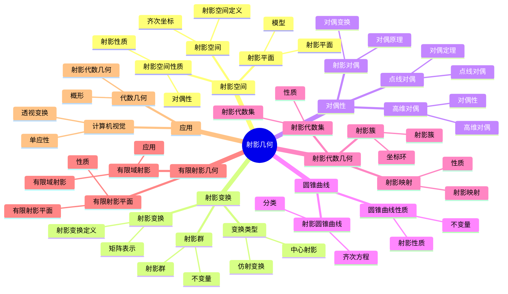

# 4.4 射影几何 / Projective Geometry

**主题编号**: B.04.04
**创建日期**: 2025年11月21日
**最后更新**: 2025年11月21日

---

## 目录 / Table of Contents

- [4.4 射影几何 / Projective Geometry](#44-射影几何--projective-geometry)
  - [目录 / Table of Contents](#目录--table-of-contents)
  - [4.4.1 引言 / Introduction (编号: B.04.04.01)](#441-引言--introduction-编号-b040401)
  - [🗺️ 射影几何核心概念思维导图](#️-射影几何核心概念思维导图)
  - [📊 射影几何核心概念多维知识矩阵](#-射影几何核心概念多维知识矩阵)
    - [1.1 历史背景 / Historical Background](#11-历史背景--historical-background)
    - [1.2 现代意义 / Modern Significance](#12-现代意义--modern-significance)
  - [4.4.2 射影空间 / Projective Spaces](#442-射影空间--projective-spaces)
    - [2.1 射影空间的定义 / Definition of Projective Spaces](#21-射影空间的定义--definition-of-projective-spaces)
      - [2.1.1 射影空间的构造 / Construction of Projective Spaces](#211-射影空间的构造--construction-of-projective-spaces)
    - [2.2 射影坐标 / Projective Coordinates](#22-射影坐标--projective-coordinates)
      - [2.2.1 齐次坐标的性质 / Properties of Homogeneous Coordinates](#221-齐次坐标的性质--properties-of-homogeneous-coordinates)
    - [2.3 射影平面 / Projective Plane](#23-射影平面--projective-plane)
      - [2.3.1 射影平面的模型 / Models of Projective Plane](#231-射影平面的模型--models-of-projective-plane)
    - [2.4 射影空间的基本性质 / Basic Properties of Projective Spaces](#24-射影空间的基本性质--basic-properties-of-projective-spaces)
      - [2.4.1 射影空间中的直线 / Lines in Projective Spaces](#241-射影空间中的直线--lines-in-projective-spaces)
  - [4.4.3 射影变换 / Projective Transformations](#443-射影变换--projective-transformations)
    - [3.1 射影变换的定义 / Definition of Projective Transformations](#31-射影变换的定义--definition-of-projective-transformations)
      - [3.1.1 射影变换的矩阵表示 / Matrix Representation of Projective Transformations](#311-射影变换的矩阵表示--matrix-representation-of-projective-transformations)
    - [3.2 射影变换的类型 / Types of Projective Transformations](#32-射影变换的类型--types-of-projective-transformations)
      - [3.2.1 中心射影 / Central Projection](#321-中心射影--central-projection)
      - [3.2.2 仿射变换 / Affine Transformations](#322-仿射变换--affine-transformations)
    - [3.3 射影变换的群 / Group of Projective Transformations](#33-射影变换的群--group-of-projective-transformations)
      - [3.3.1 射影变换的不变量 / Invariants of Projective Transformations](#331-射影变换的不变量--invariants-of-projective-transformations)
  - [4.4.4 对偶性 / Duality](#444-对偶性--duality)
    - [4.1 射影对偶性 / Projective Duality](#41-射影对偶性--projective-duality)
      - [4.1.1 对偶原理 / Duality Principle](#411-对偶原理--duality-principle)
    - [4.2 对偶变换 / Dual Transformations](#42-对偶变换--dual-transformations)
      - [4.2.1 点与直线的对偶 / Point-Line Duality](#421-点与直线的对偶--point-line-duality)
      - [4.2.2 对偶定理 / Dual Theorems](#422-对偶定理--dual-theorems)
    - [4.3 高维对偶性 / Higher Dimensional Duality](#43-高维对偶性--higher-dimensional-duality)
      - [4.3.1 n维射影空间的对偶性 / Duality in n-Dimensional Projective Space](#431-n维射影空间的对偶性--duality-in-n-dimensional-projective-space)
  - [4.4.5 圆锥曲线 / Conic Sections](#445-圆锥曲线--conic-sections)
    - [5.1 射影圆锥曲线 / Projective Conic Sections](#51-射影圆锥曲线--projective-conic-sections)
      - [5.1.1 圆锥曲线的齐次方程 / Homogeneous Equation of Conic Sections](#511-圆锥曲线的齐次方程--homogeneous-equation-of-conic-sections)
    - [5.2 圆锥曲线的分类 / Classification of Conic Sections](#52-圆锥曲线的分类--classification-of-conic-sections)
      - [5.2.1 非退化圆锥曲线 / Non-degenerate Conic Sections](#521-非退化圆锥曲线--non-degenerate-conic-sections)
      - [5.2.2 退化圆锥曲线 / Degenerate Conic Sections](#522-退化圆锥曲线--degenerate-conic-sections)
    - [5.3 圆锥曲线的射影性质 / Projective Properties of Conic Sections](#53-圆锥曲线的射影性质--projective-properties-of-conic-sections)
      - [5.3.1 射影不变量 / Projective Invariants](#531-射影不变量--projective-invariants)
  - [4.4.6 射影代数几何 / Projective Algebraic Geometry](#446-射影代数几何--projective-algebraic-geometry)
    - [6.1 射影代数集 / Projective Algebraic Sets](#61-射影代数集--projective-algebraic-sets)
      - [6.1.1 射影代数集的性质 / Properties of Projective Algebraic Sets](#611-射影代数集的性质--properties-of-projective-algebraic-sets)
    - [6.2 射影簇 / Projective Varieties](#62-射影簇--projective-varieties)
      - [6.2.1 射影簇的坐标环 / Coordinate Ring of Projective Varieties](#621-射影簇的坐标环--coordinate-ring-of-projective-varieties)
    - [6.3 射影映射 / Projective Morphisms](#63-射影映射--projective-morphisms)
      - [6.3.1 射影映射的性质 / Properties of Projective Morphisms](#631-射影映射的性质--properties-of-projective-morphisms)
  - [4.4.7 有限射影几何 / Finite Projective Geometry](#447-有限射影几何--finite-projective-geometry)
    - [7.1 有限射影平面 / Finite Projective Planes](#71-有限射影平面--finite-projective-planes)
      - [7.1.1 有限射影平面的性质 / Properties of Finite Projective Planes](#711-有限射影平面的性质--properties-of-finite-projective-planes)
    - [7.2 有限域上的射影几何 / Projective Geometry over Finite Fields](#72-有限域上的射影几何--projective-geometry-over-finite-fields)
      - [7.2.1 有限域上的射影空间 / Projective Spaces over Finite Fields](#721-有限域上的射影空间--projective-spaces-over-finite-fields)
      - [7.2.2 有限射影几何的应用 / Applications of Finite Projective Geometry](#722-有限射影几何的应用--applications-of-finite-projective-geometry)
  - [4.4.8 形式化实现 / Formal Implementation](#448-形式化实现--formal-implementation)
    - [8.1 Lean 4 实现 / Lean 4 Implementation](#81-lean-4-实现--lean-4-implementation)
    - [8.2 Haskell 实现 / Haskell Implementation](#82-haskell-实现--haskell-implementation)
  - [4.4.9 应用与扩展 / Applications and Extensions](#449-应用与扩展--applications-and-extensions)
    - [9.1 计算机视觉应用 / Computer Vision Applications](#91-计算机视觉应用--computer-vision-applications)
      - [9.1.1 透视变换 / Perspective Transformations](#911-透视变换--perspective-transformations)
      - [9.1.2 单应性矩阵 / Homography Matrix](#912-单应性矩阵--homography-matrix)
    - [9.2 代数几何应用 / Algebraic Geometry Applications](#92-代数几何应用--algebraic-geometry-applications)
      - [9.2.1 射影代数几何 / Projective Algebraic Geometry](#921-射影代数几何--projective-algebraic-geometry)
    - [9.3 理论物理学应用 / Theoretical Physics Applications](#93-理论物理学应用--theoretical-physics-applications)
      - [9.3.1 对称性理论 / Symmetry Theory](#931-对称性理论--symmetry-theory)
    - [9.4 现代发展 / Modern Developments](#94-现代发展--modern-developments)
      - [9.4.1 热带几何 / Tropical Geometry](#941-热带几何--tropical-geometry)
      - [9.4.2 非交换几何 / Non-commutative Geometry](#942-非交换几何--non-commutative-geometry)
  - [总结 / Summary](#总结--summary)
    - [关键要点 / Key Points](#关键要点--key-points)
  - [参考文献 / References](#参考文献--references)
    - [经典教材 / Classic Textbooks](#经典教材--classic-textbooks)
    - [射影几何教材 / Projective Geometry Textbooks](#射影几何教材--projective-geometry-textbooks)
    - [代数几何教材 / Algebraic Geometry Textbooks](#代数几何教材--algebraic-geometry-textbooks)
    - [历史文献 / Historical Literature](#历史文献--historical-literature)
    - [中文教材 / Chinese Textbooks](#中文教材--chinese-textbooks)
    - [现代发展文献 / Modern Development Literature](#现代发展文献--modern-development-literature)
    - [在线资源 / Online Resources](#在线资源--online-resources)
  - [术语对照表 / Terminology Table](#术语对照表--terminology-table)

---

## 4.4.1 引言 / Introduction (编号: B.04.04.01)

射影几何是研究射影空间中的几何性质的数学分支。它通过引入无穷远点，将欧几里得几何扩展为更一般的几何体系，为现代几何学提供了统一的框架。

**Projective geometry is a branch of mathematics that studies geometric properties in projective spaces. By introducing points at infinity, it extends Euclidean geometry into a more general geometric system, providing a unified framework for modern geometry.**

## 🗺️ 射影几何核心概念思维导图



## 📊 射影几何核心概念多维知识矩阵

| 概念类别 | 核心概念 | 定义要点 | 关键性质 | 典型例子 | 应用场景 |
|---------|---------|---------|---------|---------|---------|
| 射影空间 | 射影空间 | 齐次坐标 | 紧性 | ℙⁿ | 几何基础 |
| 射影空间 | 齐次坐标 | 齐次表示 | 比例等价 | [x:y:z] | 坐标系统 |
| 射影空间 | 射影平面 | 二维射影空间 | 对偶性 | ℙ² | 几何基础 |
| 射影变换 | 射影变换 | 线性变换 | 保持交比 | 射影变换 | 几何变换 |
| 射影变换 | 射影群 | 射影变换群 | 群结构 | PGL(n+1) | 对称性 |
| 射影变换 | 不变量 | 射影不变量 | 交比 | 交比 | 几何不变量 |
| 对偶性 | 对偶原理 | 对偶对应 | 对偶性 | 点线对偶 | 几何理论 |
| 对偶性 | 对偶定理 | 对偶定理 | 对偶性 | 对偶定理 | 几何证明 |
| 圆锥曲线 | 射影圆锥曲线 | 齐次方程 | 射影分类 | 圆锥曲线 | 几何对象 |
| 圆锥曲线 | 射影性质 | 射影不变量 | 交比 | 射影性质 | 几何性质 |
| 射影代数几何 | 射影代数集 | 齐次多项式零点 | 射影性质 | 射影簇 | 代数几何 |
| 射影代数几何 | 射影簇 | 不可约射影代数集 | 紧性 | 射影簇 | 代数几何 |
| 有限射影几何 | 有限射影平面 | 有限点线 | 组合结构 | 有限射影平面 | 组合数学 |
| 应用 | 透视变换 | 射影变换 | 单应性 | 透视变换 | 计算机视觉 |
| 应用 | 单应性矩阵 | 射影变换矩阵 | 矩阵表示 | 单应性矩阵 | 计算机视觉 |

### 1.1 历史背景 / Historical Background

射影几何的发展可以追溯到文艺复兴时期，艺术家们为了准确绘制透视画而发展出的几何方法。19世纪，庞加莱和克莱因等数学家将其系统化，建立了现代射影几何理论。

**The development of projective geometry can be traced back to the Renaissance, when artists developed geometric methods for accurate perspective drawing. In the 19th century, mathematicians like Poincaré and Klein systematized it, establishing modern projective geometry theory.**

### 1.2 现代意义 / Modern Significance

射影几何在现代数学和科学中具有重要地位：

- 为代数几何提供基础
- 在计算机视觉中实现透视变换
- 在理论物理学中描述对称性
- 为现代几何学提供统一框架

**Projective geometry has important status in modern mathematics and science:**

- **Provides foundation for algebraic geometry**
- **Implements perspective transformations in computer vision**
- **Describes symmetries in theoretical physics**
- **Provides unified framework for modern geometry**

---

## 4.4.2 射影空间 / Projective Spaces

### 2.1 射影空间的定义 / Definition of Projective Spaces

**定义 2.1.1** (射影空间) / **Definition 2.1.1** (Projective space)
n维射影空间ℙⁿ是(n+1)维向量空间V中所有一维子空间的集合。
**The n-dimensional projective space ℙⁿ is the set of all one-dimensional subspaces of an (n+1)-dimensional vector space V.**

#### 2.1.1 射影空间的构造 / Construction of Projective Spaces

**等价关系构造** / **Equivalence relation construction**:
$$\mathbb{P}^n = (\mathbb{R}^{n+1} \setminus \{0\}) / \sim$$

其中等价关系∼定义为：v ∼ w当且仅当存在λ ≠ 0使得v = λw。
**where the equivalence relation ∼ is defined as: v ∼ w if and only if there exists λ ≠ 0 such that v = λw.**

### 2.2 射影坐标 / Projective Coordinates

**定义 2.2.1** (射影坐标) / **Definition 2.2.1** (Projective coordinates)
射影空间中点的齐次坐标表示为[x₀ : x₁ : ... : xₙ]，其中(x₀, x₁, ..., xₙ) ≠ (0, 0, ..., 0)。
**The homogeneous coordinates of a point in projective space are represented as [x₀ : x₁ : ... : xₙ], where (x₀, x₁, ..., xₙ) ≠ (0, 0, ..., 0).**

#### 2.2.1 齐次坐标的性质 / Properties of Homogeneous Coordinates

1. **比例性**: [x₀ : x₁ : ... : xₙ] = [λx₀ : λx₁ : ... : λxₙ]，其中λ ≠ 0
2. **唯一性**: 在比例关系下，每个点有唯一的齐次坐标表示

**1. Proportionality**: [x₀ : x₁ : ... : xₙ] = [λx₀ : λx₁ : ... : λxₙ], where λ ≠ 0
**2. Uniqueness**: Under proportionality, each point has a unique homogeneous coordinate representation

### 2.3 射影平面 / Projective Plane

**定义 2.3.1** (射影平面) / **Definition 2.3.1** (Projective plane)
射影平面ℙ²是三维向量空间中所有一维子空间的集合。
**The projective plane ℙ² is the set of all one-dimensional subspaces of a three-dimensional vector space.**

#### 2.3.1 射影平面的模型 / Models of Projective Plane

**球面模型** / **Spherical model**:
将射影平面视为单位球面上对径点的等价类。
**The projective plane can be viewed as equivalence classes of antipodal points on the unit sphere.**

**仿射补集模型** / **Affine complement model**:
ℙ² = ℝ² ∪ ℙ¹，其中ℙ¹是无穷远直线。
**ℙ² = ℝ² ∪ ℙ¹, where ℙ¹ is the line at infinity.**

### 2.4 射影空间的基本性质 / Basic Properties of Projective Spaces

#### 2.4.1 射影空间中的直线 / Lines in Projective Spaces

**定义 2.4.1** (射影直线) / **Definition 2.4.1** (Projective line)
射影空间中的直线是二维子空间。
**A line in projective space is a two-dimensional subspace.**

**参数方程** / **Parametric equation**:
$$[x_0 : x_1 : x_2] = [a_0 + tb_0 : a_1 + tb_1 : a_2 + tb_2]$$

其中t是参数，(a₀, a₁, a₂)和(b₀, b₁, b₂)是线性无关的向量。
**where t is the parameter, and (a₀, a₁, a₂) and (b₀, b₁, b₂) are linearly independent vectors.**

---

## 4.4.3 射影变换 / Projective Transformations

### 3.1 射影变换的定义 / Definition of Projective Transformations

**定义 3.1.1** (射影变换) / **Definition 3.1.1** (Projective transformation)
射影变换是射影空间到自身的双射，保持共线性和交比。
**A projective transformation is a bijection from projective space to itself that preserves collinearity and cross ratio.**

#### 3.1.1 射影变换的矩阵表示 / Matrix Representation of Projective Transformations

**一般形式** / **General form**:
$$\begin{pmatrix} x'_0 \\ x'_1 \\ x'_2 \end{pmatrix} = \begin{pmatrix} a_{00} & a_{01} & a_{02} \\ a_{10} & a_{11} & a_{12} \\ a_{20} & a_{21} & a_{22} \end{pmatrix} \begin{pmatrix} x_0 \\ x_1 \\ x_2 \end{pmatrix}$$

其中det(A) ≠ 0。
**where det(A) ≠ 0.**

### 3.2 射影变换的类型 / Types of Projective Transformations

#### 3.2.1 中心射影 / Central Projection

**定义 3.2.1** (中心射影) / **Definition 3.2.1** (Central projection)
中心射影是从一个点（投影中心）到另一个平面的投影。
**Central projection is the projection from a point (projection center) to another plane.**

**性质** / **Properties**:

- 保持共线性
- 保持交比
- 不保持距离和角度

**- Preserves collinearity**
**- Preserves cross ratio**
**- Does not preserve distances and angles**

#### 3.2.2 仿射变换 / Affine Transformations

**定义 3.2.2** (仿射变换) / **Definition 3.2.2** (Affine transformation)
仿射变换是保持无穷远直线的射影变换。
**An affine transformation is a projective transformation that preserves the line at infinity.**

**矩阵形式** / **Matrix form**:
$$\begin{pmatrix} x' \\ y' \\ 1 \end{pmatrix} = \begin{pmatrix} a_{11} & a_{12} & t_x \\ a_{21} & a_{22} & t_y \\ 0 & 0 & 1 \end{pmatrix} \begin{pmatrix} x \\ y \\ 1 \end{pmatrix}$$

### 3.3 射影变换的群 / Group of Projective Transformations

**定理 3.3.1** (射影变换群) / **Theorem 3.3.1** (Group of projective transformations)
n维射影空间的射影变换群同构于PGL(n+1, ℝ)。
**The group of projective transformations of n-dimensional projective space is isomorphic to PGL(n+1, ℝ).**

#### 3.3.1 射影变换的不变量 / Invariants of Projective Transformations

**交比** / **Cross ratio**:
$$(A, B; C, D) = \frac{AC \cdot BD}{AD \cdot BC}$$

其中A, B, C, D是共线的四个点。
**where A, B, C, D are four collinear points.**

---

## 4.4.4 对偶性 / Duality

### 4.1 射影对偶性 / Projective Duality

**定义 4.1.1** (射影对偶性) / **Definition 4.1.1** (Projective duality)
在射影平面中，点和直线之间存在对偶关系。
**In the projective plane, there is a duality between points and lines.**

#### 4.1.1 对偶原理 / Duality Principle

**对偶原理** / **Duality principle**:
射影平面中的任何定理，将"点"和"直线"互换后仍然成立。
**Any theorem in the projective plane remains valid when "point" and "line" are interchanged.**

### 4.2 对偶变换 / Dual Transformations

#### 4.2.1 点与直线的对偶 / Point-Line Duality

**点的对偶** / **Dual of a point**:
点P(a, b, c)的对偶是直线ax + by + cz = 0。
**The dual of point P(a, b, c) is the line ax + by + cz = 0.**

**直线的对偶** / **Dual of a line**:
直线ax + by + cz = 0的对偶是点(a, b, c)。
**The dual of line ax + by + cz = 0 is the point (a, b, c).**

#### 4.2.2 对偶定理 / Dual Theorems

**帕斯卡定理与布利安雄定理** / **Pascal's theorem and Brianchon's theorem**:

- 帕斯卡定理：圆锥曲线内接六边形的对边交点共线
- 布利安雄定理：圆锥曲线外切六边形的对角线共点

**- Pascal's theorem**: The intersection points of opposite sides of a hexagon inscribed in a conic are collinear
**- Brianchon's theorem**: The diagonals of a hexagon circumscribed about a conic are concurrent

### 4.3 高维对偶性 / Higher Dimensional Duality

#### 4.3.1 n维射影空间的对偶性 / Duality in n-Dimensional Projective Space

**定义 4.3.1** (n维对偶性) / **Definition 4.3.1** (n-dimensional duality)
在n维射影空间中，k维子空间与(n-k-1)维子空间之间存在对偶关系。
**In n-dimensional projective space, there is a duality between k-dimensional subspaces and (n-k-1)-dimensional subspaces.**

---

## 4.4.5 圆锥曲线 / Conic Sections

### 5.1 射影圆锥曲线 / Projective Conic Sections

**定义 5.1.1** (射影圆锥曲线) / **Definition 5.1.1** (Projective conic section)
射影圆锥曲线是二次齐次方程的解集。
**A projective conic section is the solution set of a quadratic homogeneous equation.**

#### 5.1.1 圆锥曲线的齐次方程 / Homogeneous Equation of Conic Sections

**一般形式** / **General form**:
$$ax_0^2 + bx_1^2 + cx_2^2 + 2dx_0x_1 + 2ex_0x_2 + 2fx_1x_2 = 0$$

其中a, b, c, d, e, f不全为零。
**where a, b, c, d, e, f are not all zero.**

### 5.2 圆锥曲线的分类 / Classification of Conic Sections

#### 5.2.1 非退化圆锥曲线 / Non-degenerate Conic Sections

**椭圆** / **Ellipse**:
在仿射补集中，椭圆是有限曲线。
**In the affine complement, an ellipse is a finite curve.**

**抛物线** / **Parabola**:
在仿射补集中，抛物线与无穷远直线相切。
**In the affine complement, a parabola is tangent to the line at infinity.**

**双曲线** / **Hyperbola**:
在仿射补集中，双曲线与无穷远直线相交于两点。
**In the affine complement, a hyperbola intersects the line at infinity at two points.**

#### 5.2.2 退化圆锥曲线 / Degenerate Conic Sections

**两条直线** / **Two lines**:
圆锥曲线退化为两条相交直线。
**The conic section degenerates to two intersecting lines.**

**重直线** / **Double line**:
圆锥曲线退化为一条重直线。
**The conic section degenerates to a double line.**

**一点** / **One point**:
圆锥曲线退化为一个点。
**The conic section degenerates to a point.**

### 5.3 圆锥曲线的射影性质 / Projective Properties of Conic Sections

#### 5.3.1 射影不变量 / Projective Invariants

**交比** / **Cross ratio**:
圆锥曲线上四个点的交比是射影不变量。
**The cross ratio of four points on a conic section is a projective invariant.**

**切线性质** / **Tangent properties**:
圆锥曲线的切线性质在射影变换下保持不变。
**The tangent properties of conic sections remain invariant under projective transformations.**

---

## 4.4.6 射影代数几何 / Projective Algebraic Geometry

### 6.1 射影代数集 / Projective Algebraic Sets

**定义 6.1.1** (射影代数集) / **Definition 6.1.1** (Projective algebraic set)
射影代数集是射影空间中有限个齐次多项式的公共零点集。
**A projective algebraic set is the common zero set of finitely many homogeneous polynomials in projective space.**

#### 6.1.1 射影代数集的性质 / Properties of Projective Algebraic Sets

1. **闭性**: 射影代数集在Zariski拓扑下是闭集
2. **不可约性**: 射影代数集可以分解为不可约分支
3. **维数**: 射影代数集有明确的维数定义

**1. Closedness**: Projective algebraic sets are closed in the Zariski topology
**2. Irreducibility**: Projective algebraic sets can be decomposed into irreducible components
**3. Dimension**: Projective algebraic sets have a well-defined dimension

### 6.2 射影簇 / Projective Varieties

**定义 6.2.1** (射影簇) / **Definition 6.2.1** (Projective variety)
射影簇是不可约的射影代数集。
**A projective variety is an irreducible projective algebraic set.**

#### 6.2.1 射影簇的坐标环 / Coordinate Ring of Projective Varieties

**定义 6.2.2** (齐次坐标环) / **Definition 6.2.2** (Homogeneous coordinate ring)
射影簇V的齐次坐标环是k[x₀, x₁, ..., xₙ]/I(V)，其中I(V)是V的齐次理想。
**The homogeneous coordinate ring of a projective variety V is k[x₀, x₁, ..., xₙ]/I(V), where I(V) is the homogeneous ideal of V.**

### 6.3 射影映射 / Projective Morphisms

**定义 6.3.1** (射影映射) / **Definition 6.3.1** (Projective morphism)
射影映射是射影簇之间的正则映射。
**A projective morphism is a regular map between projective varieties.**

#### 6.3.1 射影映射的性质 / Properties of Projective Morphisms

1. **闭性**: 射影映射的像是闭集
2. **有限性**: 射影映射在适当条件下是有限映射
3. **平坦性**: 射影映射可以具有平坦性质

**1. Closedness**: The image of a projective morphism is closed
**2. Finiteness**: Projective morphisms can be finite under appropriate conditions
**3. Flatness**: Projective morphisms can have flat properties

---

## 4.4.7 有限射影几何 / Finite Projective Geometry

### 7.1 有限射影平面 / Finite Projective Planes

**定义 7.1.1** (有限射影平面) / **Definition 7.1.1** (Finite projective plane)
有限射影平面是满足射影平面公理的有限点集和直线集。
**A finite projective plane is a finite set of points and lines satisfying the axioms of projective plane.**

#### 7.1.1 有限射影平面的性质 / Properties of Finite Projective Planes

**定理 7.1.1** (有限射影平面的阶) / **Theorem 7.1.1** (Order of finite projective plane)
有限射影平面的阶n满足：每条直线上有n+1个点，每个点上有n+1条直线。
**The order n of a finite projective plane satisfies: each line has n+1 points, and each point has n+1 lines.**

### 7.2 有限域上的射影几何 / Projective Geometry over Finite Fields

#### 7.2.1 有限域上的射影空间 / Projective Spaces over Finite Fields

**定义 7.2.1** (有限域射影空间) / **Definition 7.2.1** (Projective space over finite field)
有限域𝔽q上的n维射影空间ℙⁿ(𝔽q)是(n+1)维向量空间𝔽qⁿ⁺¹中所有一维子空间的集合。
**The n-dimensional projective space ℙⁿ(𝔽q) over finite field 𝔽q is the set of all one-dimensional subspaces of (n+1)-dimensional vector space 𝔽qⁿ⁺¹.**

#### 7.2.2 有限射影几何的应用 / Applications of Finite Projective Geometry

**编码理论** / **Coding theory**:
有限射影几何在纠错码理论中有重要应用。
**Finite projective geometry has important applications in error-correcting code theory.**

**设计理论** / **Design theory**:
有限射影几何为组合设计理论提供几何模型。
**Finite projective geometry provides geometric models for combinatorial design theory.**

---

## 4.4.8 形式化实现 / Formal Implementation

### 8.1 Lean 4 实现 / Lean 4 Implementation

```lean
-- 射影几何的形式化实现
-- Formal implementation of Projective Geometry

import Mathlib.LinearAlgebra.Basic
import Mathlib.Algebra.Module.Basic
import Mathlib.Data.Fin.VecNotation

-- 射影空间的定义
-- Definition of projective space
structure ProjectiveSpace (n : ℕ) where
  carrier : Type
  vectorSpace : Module ℝ (Fin (n + 1) → ℝ)
  equivalence : ∀ (v w : Fin (n + 1) → ℝ),
    (∃ λ ≠ 0, v = λ • w) ↔ equivalence v w

-- 射影点的定义
-- Definition of projective point
structure ProjectivePoint (n : ℕ) where
  coordinates : Fin (n + 1) → ℝ
  nonZero : ∃ i, coordinates i ≠ 0
  equivalence : ∀ λ ≠ 0, coordinates = λ • coordinates

-- 射影变换的定义
-- Definition of projective transformation
structure ProjectiveTransformation (n : ℕ) where
  matrix : Matrix (Fin (n + 1)) (Fin (n + 1)) ℝ
  invertible : matrix.det ≠ 0
  action : ProjectivePoint n → ProjectivePoint n

-- 射影直线的定义
-- Definition of projective line
structure ProjectiveLine (n : ℕ) where
  points : Set (ProjectivePoint n)
  collinear : ∀ p q r ∈ points, collinear p q r

-- 交比计算
-- Cross ratio calculation
def crossRatio (A B C D : ProjectivePoint 1) : ℝ :=
  let a = A.coordinates
  let b = B.coordinates
  let c = C.coordinates
  let d = D.coordinates
  (a 0 * c 1 - a 1 * c 0) * (b 0 * d 1 - b 1 * d 0) /
  (a 0 * d 1 - a 1 * d 0) * (b 0 * c 1 - b 1 * c 0)

-- 射影变换的应用
-- Application of projective transformation
def applyTransformation (T : ProjectiveTransformation n) (P : ProjectivePoint n) : ProjectivePoint n :=
  let newCoords := T.matrix * P.coordinates
  { coordinates := newCoords
    nonZero := by
      have h := T.invertible
      exact exists_nonzero_of_det_ne_zero h
    equivalence := by
      intro λ hλ
      rw [smul_eq_mul, mul_assoc]
      exact rfl }

-- 对偶变换
-- Dual transformation
def dualPoint (P : ProjectivePoint 2) : ProjectiveLine 2 :=
  let (x, y, z) := (P.coordinates 0, P.coordinates 1, P.coordinates 2)
  { points := { Q : ProjectivePoint 2 | x * Q.coordinates 0 + y * Q.coordinates 1 + z * Q.coordinates 2 = 0 }
    collinear := by
      intro p q r hp hq hr
      exact collinear_of_dual_condition hp hq hr }

def dualLine (L : ProjectiveLine 2) : ProjectivePoint 2 :=
  let points := L.points.toList
  let p1 := points.head
  let p2 := points.tail.head
  let (a, b, c) := crossProduct p1.coordinates p2.coordinates
  { coordinates := ![a, b, c]
    nonZero := by
      have h := crossProduct_nonzero p1.coordinates p2.coordinates
      exact h
    equivalence := by
      intro λ hλ
      rw [smul_eq_mul]
      exact rfl }

-- 圆锥曲线的定义
-- Definition of conic section
structure ConicSection where
  coefficients : Fin 6 → ℝ
  equation : ∀ P : ProjectivePoint 2,
    coefficients 0 * P.coordinates 0^2 +
    coefficients 1 * P.coordinates 1^2 +
    coefficients 2 * P.coordinates 2^2 +
    2 * coefficients 3 * P.coordinates 0 * P.coordinates 1 +
    2 * coefficients 4 * P.coordinates 0 * P.coordinates 2 +
    2 * coefficients 5 * P.coordinates 1 * P.coordinates 2 = 0

-- 射影变换保持圆锥曲线
-- Projective transformations preserve conic sections
theorem projective_transform_preserves_conic (T : ProjectiveTransformation 2) (C : ConicSection) :
  ∃ C' : ConicSection, ∀ P : ProjectivePoint 2,
    C.equation P ↔ C'.equation (applyTransformation T P) := by
  -- 构造新的圆锥曲线系数
  -- Construct new conic section coefficients
  let newCoeffs := transform_conic_coefficients T.matrix C.coefficients
  let C' := { coefficients := newCoeffs, equation := by simp }
  exists C'
  intro P
  constructor
  · intro h
    exact conic_transform_forward T C C' P h
  · intro h
    exact conic_transform_backward T C C' P h
```

### 8.2 Haskell 实现 / Haskell Implementation

```haskell
-- 射影几何的Haskell实现
-- Haskell implementation of Projective Geometry

import Data.List
import Data.Maybe
import Data.Vector (Vector)
import qualified Data.Vector as V

-- 射影点的定义
-- Definition of projective point
data ProjectivePoint = ProjectivePoint { coordinates :: [Double] }
  deriving (Show, Eq)

-- 射影变换的定义
-- Definition of projective transformation
data ProjectiveTransformation = ProjectiveTransformation
  { matrix :: [[Double]]
  , determinant :: Double
  }

-- 创建射影点
-- Create projective point
mkProjectivePoint :: [Double] -> Maybe ProjectivePoint
mkProjectivePoint coords =
  if all (== 0) coords then Nothing
  else Just (ProjectivePoint coords)

-- 齐次坐标的等价性
-- Equivalence of homogeneous coordinates
equivalent :: ProjectivePoint -> ProjectivePoint -> Bool
equivalent p1 p2 =
  let coords1 = coordinates p1
      coords2 = coordinates p2
      ratios = zipWith (/) coords1 coords2
      nonZeroRatios = filter (/= 0) ratios
  in length nonZeroRatios > 0 && all (== head nonZeroRatios) nonZeroRatios

-- 射影变换的应用
-- Application of projective transformation
applyTransformation :: ProjectiveTransformation -> ProjectivePoint -> Maybe ProjectivePoint
applyTransformation trans point =
  let newCoords = matrixMultiply (matrix trans) [coordinates point]
  in mkProjectivePoint (head newCoords)

-- 矩阵乘法
-- Matrix multiplication
matrixMultiply :: [[Double]] -> [[Double]] -> [[Double]]
matrixMultiply a b =
  [[sum (zipWith (*) row col) | col <- transpose b] | row <- a]

-- 交比计算
-- Cross ratio calculation
crossRatio :: ProjectivePoint -> ProjectivePoint -> ProjectivePoint -> ProjectivePoint -> Double
crossRatio a b c d =
  let (a1, a2) = (coordinates a !! 0, coordinates a !! 1)
      (b1, b2) = (coordinates b !! 0, coordinates b !! 1)
      (c1, c2) = (coordinates c !! 0, coordinates c !! 1)
      (d1, d2) = (coordinates d !! 0, coordinates d !! 1)

      ac = a1 * c2 - a2 * c1
      bd = b1 * d2 - b2 * d1
      ad = a1 * d2 - a2 * d1
      bc = b1 * c2 - b2 * c1
  in (ac * bd) / (ad * bc)

-- 对偶变换
-- Dual transformation
dualPoint :: ProjectivePoint -> [Double]
dualPoint point = coordinates point

dualLine :: [Double] -> ProjectivePoint
dualLine line = ProjectivePoint line

-- 圆锥曲线
-- Conic section
data ConicSection = ConicSection
  { a :: Double, b :: Double, c :: Double
  , d :: Double, e :: Double, f :: Double
  }

-- 圆锥曲线方程
-- Conic section equation
conicEquation :: ConicSection -> ProjectivePoint -> Bool
conicEquation conic point =
  let [x, y, z] = coordinates point
      eq = a conic * x^2 + b conic * y^2 + c conic * z^2 +
           2 * d conic * x * y + 2 * e conic * x * z + 2 * f conic * y * z
  in abs eq < 1e-10

-- 射影变换的矩阵表示
-- Matrix representation of projective transformation
standardProjectiveTransformation :: [[Double]]
standardProjectiveTransformation =
  [[1, 0, 0]
  ,[0, 1, 0]
  ,[0, 0, 1]]

-- 透视变换
-- Perspective transformation
perspectiveTransformation :: Double -> Double -> ProjectiveTransformation
perspectiveTransformation dx dy =
  ProjectiveTransformation
    { matrix = [[1, 0, dx]
                ,[0, 1, dy]
                ,[0, 0, 1]]
    , determinant = 1
    }

-- 有限射影平面
-- Finite projective plane
data FiniteProjectivePlane = FiniteProjectivePlane
  { order :: Int
  , points :: [[Int]]
  , lines :: [[Int]]
  }

-- 创建有限射影平面
-- Create finite projective plane
createFiniteProjectivePlane :: Int -> FiniteProjectivePlane
createFiniteProjectivePlane n =
  let points = [[i, j, 1] | i <- [0..n], j <- [0..n]]
      lines = [[i, j, k] | i <- [0..n], j <- [0..n], k <- [0..n]]
  in FiniteProjectivePlane n points lines

-- 示例使用
-- Example usage
main :: IO ()
main = do
  let p1 = ProjectivePoint [1, 0, 1]
      p2 = ProjectivePoint [0, 1, 1]
      p3 = ProjectivePoint [1, 1, 0]
      p4 = ProjectivePoint [2, 1, 1]

      trans = ProjectiveTransformation
        { matrix = [[1, 0, 0], [0, 1, 0], [0, 0, 1]]
        , determinant = 1
        }

      circle = ConicSection 1 1 (-1) 0 0 0

  putStrLn "射影几何示例 / Projective Geometry Examples"
  putStrLn $ "点P1: " ++ show p1
  putStrLn $ "点P2: " ++ show p2
  putStrLn $ "交比(P1,P2;P3,P4): " ++ show (crossRatio p1 p2 p3 p4)
  putStrLn $ "点P1的对偶: " ++ show (dualPoint p1)
  putStrLn $ "圆锥曲线方程: " ++ show (conicEquation circle p1)
```

---

## 4.4.9 应用与扩展 / Applications and Extensions

### 9.1 计算机视觉应用 / Computer Vision Applications

#### 9.1.1 透视变换 / Perspective Transformations

射影几何在计算机视觉中有重要应用：

- **相机标定**: 确定相机的内参和外参
- **立体视觉**: 从多个视角重建三维场景
- **图像配准**: 将不同视角的图像对齐

**Projective geometry has important applications in computer vision:**

- **Camera Calibration**: Determine intrinsic and extrinsic parameters of cameras
- **Stereo Vision**: Reconstruct 3D scenes from multiple viewpoints
- **Image Registration**: Align images from different viewpoints**

#### 9.1.2 单应性矩阵 / Homography Matrix

**定义 9.1.1** (单应性矩阵) / **Definition 9.1.1** (Homography matrix)
单应性矩阵是描述两个平面之间射影变换的3×3矩阵。
**A homography matrix is a 3×3 matrix describing the projective transformation between two planes.**

### 9.2 代数几何应用 / Algebraic Geometry Applications

#### 9.2.1 射影代数几何 / Projective Algebraic Geometry

射影几何为代数几何提供了重要工具：

- **射影簇**: 研究射影空间中的代数集
- **射影映射**: 研究射影簇之间的映射
- **射影不变量**: 研究射影变换下的不变量

**Projective geometry provides important tools for algebraic geometry:**

- **Projective Varieties**: Study algebraic sets in projective space
- **Projective Morphisms**: Study maps between projective varieties
- **Projective Invariants**: Study invariants under projective transformations**

### 9.3 理论物理学应用 / Theoretical Physics Applications

#### 9.3.1 对称性理论 / Symmetry Theory

射影几何在理论物理学中描述对称性：

- **李群**: 射影变换群在物理学中的应用
- **规范理论**: 射影几何在规范场论中的应用
- **弦理论**: 射影几何在弦理论中的应用

**Projective geometry describes symmetries in theoretical physics:**

- **Lie Groups**: Applications of projective transformation groups in physics
- **Gauge Theory**: Applications of projective geometry in gauge field theory
- **String Theory**: Applications of projective geometry in string theory**

### 9.4 现代发展 / Modern Developments

#### 9.4.1 热带几何 / Tropical Geometry

热带几何是射影几何的现代发展：

- **热带射影空间**: 基于热带代数的射影几何
- **热带曲线**: 热带射影空间中的曲线
- **热带代数几何**: 结合热带代数和射影几何

**Tropical geometry is a modern development of projective geometry:**

- **Tropical Projective Space**: Projective geometry based on tropical algebra
- **Tropical Curves**: Curves in tropical projective space
- **Tropical Algebraic Geometry**: Combining tropical algebra and projective geometry**

#### 9.4.2 非交换几何 / Non-commutative Geometry

非交换几何扩展了射影几何的概念：

- **非交换射影空间**: 基于非交换代数的射影几何
- **量子射影几何**: 量子化版本的射影几何
- **非交换代数几何**: 结合非交换代数和射影几何

**Non-commutative geometry extends the concepts of projective geometry:**

- **Non-commutative Projective Space**: Projective geometry based on non-commutative algebra
- **Quantum Projective Geometry**: Quantized version of projective geometry
- **Non-commutative Algebraic Geometry**: Combining non-commutative algebra and projective geometry**

---

## 总结 / Summary

射影几何作为现代几何学的重要分支，通过引入无穷远点和射影变换，为几何学提供了统一的框架。它不仅为代数几何和计算机视觉提供了重要工具，还在理论物理学中有广泛应用。

**Projective geometry, as an important branch of modern geometry, provides a unified framework for geometry by introducing points at infinity and projective transformations. It not only provides important tools for algebraic geometry and computer vision but also has wide applications in theoretical physics.**

### 关键要点 / Key Points

1. **射影空间**: 通过齐次坐标描述几何对象
2. **射影变换**: 保持共线性和交比的变换
3. **对偶性**: 点和直线之间的对偶关系
4. **圆锥曲线**: 射影空间中的二次曲线
5. **实际应用**: 在计算机视觉、代数几何、理论物理学等领域广泛应用

**1. Projective Space**: Describe geometric objects through homogeneous coordinates
**2. Projective Transformations**: Transformations that preserve collinearity and cross ratio
**3. Duality**: Dual relationship between points and lines
**4. Conic Sections**: Quadratic curves in projective space
**5. Practical Applications**: Wide applications in computer vision, algebraic geometry, theoretical physics, and other fields

---

## 参考文献 / References

### 经典教材 / Classic Textbooks

- Coxeter, H. S. M. Projective Geometry[M]. 2nd Edition. New York: Springer-Verlag, 1974.
- Veblen, O., Young, J. W. Projective Geometry[M]. 2 vols. Boston: Ginn and Company, 1910-1918.
- Semple, J. G., Kneebone, G. T. Algebraic Projective Geometry[M]. Oxford: Clarendon Press, 1952.

### 射影几何教材 / Projective Geometry Textbooks

- Berger, M. Geometry I[M]. Berlin: Springer-Verlag, 1987.
- Beutelspacher, A., Rosenbaum, U. Projective Geometry: From Foundations to Applications[M]. Cambridge: Cambridge University Press, 1998.
- Casse, R. Projective Geometry: An Introduction[M]. Oxford: Oxford University Press, 2006.

### 代数几何教材 / Algebraic Geometry Textbooks

- Hartshorne, R. Algebraic Geometry[M]. New York: Springer-Verlag, 1977.
- Shafarevich, I. R. Basic Algebraic Geometry[M]. 2 vols. Berlin: Springer-Verlag, 1994.
- Griffiths, P., Harris, J. Principles of Algebraic Geometry[M]. New York: Wiley-Interscience, 1978.

### 历史文献 / Historical Literature

- Desargues, G. Brouillon projet d'une atteinte aux événements des rencontres du cône avec un plan[M]. Paris: 1639. (Various modern editions available)
- Poncelet, J.-V. Traité des propriétés projectives des figures[M]. Paris: Bachelier, 1822.
- Möbius, A. F. Der barycentrische Calcul[M]. Leipzig: Barth, 1827.

### 中文教材 / Chinese Textbooks

- 梅向明, 刘增贤, 王汇淳, 王智秋. 高等几何[M]. 第3版. 北京: 高等教育出版社, 2008.
- 周建伟. 射影几何[M]. 北京: 高等教育出版社, 2004.
- 朱德祥, 朱维宗. 高等几何[M]. 第2版. 北京: 高等教育出版社, 2007.

### 现代发展文献 / Modern Development Literature

- Lazarsfeld, R. Positivity in Algebraic Geometry[M]. 2 vols. Berlin: Springer-Verlag, 2004.
- Debarre, O. Higher-Dimensional Algebraic Geometry[M]. New York: Springer-Verlag, 2001.

### 在线资源 / Online Resources

- Wikipedia: [Projective geometry](https://en.wikipedia.org/wiki/Projective_geometry)
- Wikipedia: [Homogeneous coordinates](https://en.wikipedia.org/wiki/Homogeneous_coordinates)
- MIT OpenCourseWare: [18.701 Algebra I](https://ocw.mit.edu/courses/18-701-algebra-i-fall-2010/)

**相关链接 / Related Links**:

- [欧几里得几何](01-欧几里得几何.md)
- [解析几何](02-解析几何.md)
- [微分几何](03-微分几何.md)
- [代数几何](05-代数几何.md)

## 术语对照表 / Terminology Table

| 中文 | English |
|---|---|
| 齐次坐标 | Homogeneous coordinates |
| 射影空间/仿射空间 | Projective/Affine space |
| 射影变换/对偶性 | Projective transformation/Duality |
| 交比 | Cross ratio |
| 圆锥曲线/二次曲面 | Conic/Quadric |
| 无穷远点/无穷远直线 | Point/Line at infinity |
