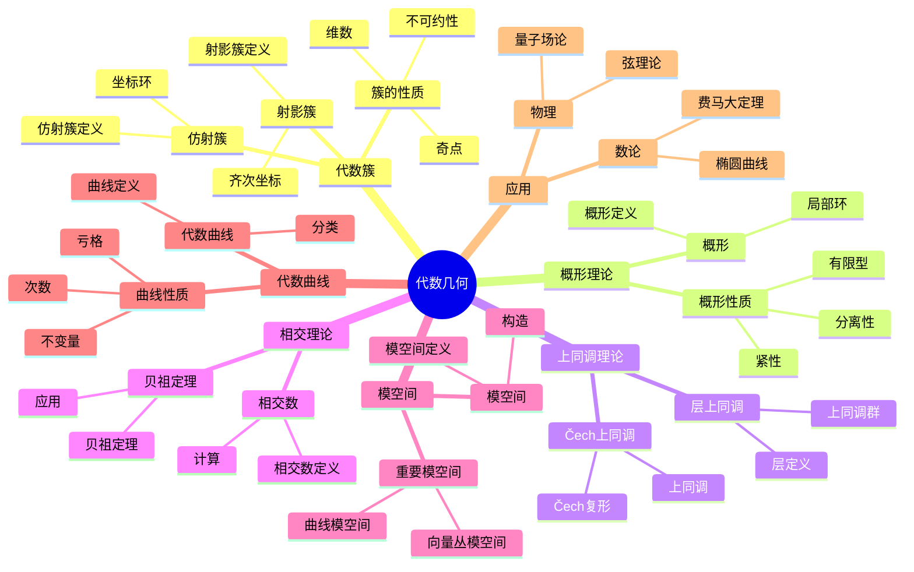

# 4.5 代数几何 / Algebraic Geometry

**主题编号**: B.04.05
**创建日期**: 2025年11月21日
**最后更新**: 2025年11月21日

---

## 目录 / Table of Contents

- [4.5 代数几何 / Algebraic Geometry](#45-代数几何--algebraic-geometry)
  - [目录 / Table of Contents](#目录--table-of-contents)
  - [4.5.1 引言 / Introduction (编号: B.04.05.01)](#451-引言--introduction-编号-b040501)
  - [🗺️ 代数几何核心概念思维导图](#️-代数几何核心概念思维导图)
  - [📊 代数几何核心概念多维知识矩阵](#-代数几何核心概念多维知识矩阵)
    - [1.1 历史背景 / Historical Background](#11-历史背景--historical-background)
    - [1.2 现代意义 / Modern Significance](#12-现代意义--modern-significance)
  - [4.5.2 代数簇 / Algebraic Varieties (编号: B.04.05.02)](#452-代数簇--algebraic-varieties-编号-b040502)
    - [2.1 仿射代数簇 / Affine Algebraic Varieties](#21-仿射代数簇--affine-algebraic-varieties)
      - [2.1.1 仿射代数簇的构造 / Construction of Affine Algebraic Varieties](#211-仿射代数簇的构造--construction-of-affine-algebraic-varieties)
    - [2.2 射影代数簇 / Projective Algebraic Varieties](#22-射影代数簇--projective-algebraic-varieties)
      - [2.2.1 射影代数簇的构造 / Construction of Projective Algebraic Varieties](#221-射影代数簇的构造--construction-of-projective-algebraic-varieties)
    - [2.3 代数簇的基本性质 / Basic Properties of Algebraic Varieties](#23-代数簇的基本性质--basic-properties-of-algebraic-varieties)
      - [2.3.1 不可约性 / Irreducibility](#231-不可约性--irreducibility)
      - [2.3.2 维数 / Dimension](#232-维数--dimension)
    - [2.4 坐标环 / Coordinate Ring](#24-坐标环--coordinate-ring)
      - [2.4.1 坐标环的性质 / Properties of Coordinate Ring](#241-坐标环的性质--properties-of-coordinate-ring)
  - [4.5.3 概形理论 / Scheme Theory (编号: B.04.05.03)](#453-概形理论--scheme-theory-编号-b040503)
    - [3.1 概形的定义 / Definition of Schemes](#31-概形的定义--definition-of-schemes)
      - [3.1.1 概形的构造 / Construction of Schemes](#311-概形的构造--construction-of-schemes)
    - [3.2 概形的性质 / Properties of Schemes](#32-概形的性质--properties-of-schemes)
      - [3.2.1 分离性 / Separatedness](#321-分离性--separatedness)
      - [3.2.2 有限型 / Finite Type](#322-有限型--finite-type)
    - [3.3 概形之间的映射 / Morphisms between Schemes](#33-概形之间的映射--morphisms-between-schemes)
      - [3.3.1 态射 / Morphisms](#331-态射--morphisms)
      - [3.3.2 浸入 / Immersions](#332-浸入--immersions)
  - [4.5.4 上同调理论 / Cohomology Theory (编号: B.04.05.04)](#454-上同调理论--cohomology-theory-编号-b040504)
    - [4.1 层上同调 / Sheaf Cohomology](#41-层上同调--sheaf-cohomology)
      - [4.1.1 Čech上同调 / Čech Cohomology](#411-čech上同调--čech-cohomology)
    - [4.2 代数几何中的上同调 / Cohomology in Algebraic Geometry](#42-代数几何中的上同调--cohomology-in-algebraic-geometry)
      - [4.2.1 凝聚层上同调 / Coherent Sheaf Cohomology](#421-凝聚层上同调--coherent-sheaf-cohomology)
      - [4.2.2 上同调序列 / Cohomology Sequences](#422-上同调序列--cohomology-sequences)
    - [4.3 特殊上同调群 / Special Cohomology Groups](#43-特殊上同调群--special-cohomology-groups)
      - [4.3.1 结构层上同调 / Structure Sheaf Cohomology](#431-结构层上同调--structure-sheaf-cohomology)
      - [4.3.2 理想层上同调 / Ideal Sheaf Cohomology](#432-理想层上同调--ideal-sheaf-cohomology)
  - [4.5.5 相交理论 / Intersection Theory (编号: B.04.05.05)](#455-相交理论--intersection-theory-编号-b040505)
    - [5.1 相交数 / Intersection Numbers](#51-相交数--intersection-numbers)
      - [5.1.1 相交数的计算 / Calculation of Intersection Numbers](#511-相交数的计算--calculation-of-intersection-numbers)
    - [5.2 相交理论的基本定理 / Basic Theorems of Intersection Theory](#52-相交理论的基本定理--basic-theorems-of-intersection-theory)
      - [5.2.1 贝祖定理 / Bézout's Theorem](#521-贝祖定理--bézouts-theorem)
      - [5.2.2 相交理论的应用 / Applications of Intersection Theory](#522-相交理论的应用--applications-of-intersection-theory)
  - [4.5.6 模空间 / Moduli Spaces (编号: B.04.05.06)](#456-模空间--moduli-spaces-编号-b040506)
    - [6.1 模空间的定义 / Definition of Moduli Spaces](#61-模空间的定义--definition-of-moduli-spaces)
      - [6.1.1 模空间的构造 / Construction of Moduli Spaces](#611-模空间的构造--construction-of-moduli-spaces)
    - [6.2 重要的模空间 / Important Moduli Spaces](#62-重要的模空间--important-moduli-spaces)
      - [6.2.1 曲线模空间 / Curve Moduli Spaces](#621-曲线模空间--curve-moduli-spaces)
      - [6.2.2 向量丛模空间 / Vector Bundle Moduli Spaces](#622-向量丛模空间--vector-bundle-moduli-spaces)
    - [6.3 模空间的性质 / Properties of Moduli Spaces](#63-模空间的性质--properties-of-moduli-spaces)
      - [6.3.1 紧性 / Compactness](#631-紧性--compactness)
      - [6.3.2 维数 / Dimension](#632-维数--dimension)
  - [4.5.7 代数曲线 / Algebraic Curves (编号: B.04.05.07)](#457-代数曲线--algebraic-curves-编号-b040507)
    - [7.1 代数曲线的定义 / Definition of Algebraic Curves](#71-代数曲线的定义--definition-of-algebraic-curves)
      - [7.1.1 代数曲线的分类 / Classification of Algebraic Curves](#711-代数曲线的分类--classification-of-algebraic-curves)
    - [7.2 代数曲线的性质 / Properties of Algebraic Curves](#72-代数曲线的性质--properties-of-algebraic-curves)
      - [7.2.1 亏格 / Genus](#721-亏格--genus)
      - [7.2.2 次数 / Degree](#722-次数--degree)
    - [7.3 代数曲线的分类定理 / Classification Theorems for Algebraic Curves](#73-代数曲线的分类定理--classification-theorems-for-algebraic-curves)
      - [7.3.1 亏格0曲线 / Genus 0 Curves](#731-亏格0曲线--genus-0-curves)
      - [7.3.2 亏格1曲线 / Genus 1 Curves](#732-亏格1曲线--genus-1-curves)
      - [7.3.3 高亏格曲线 / Higher Genus Curves](#733-高亏格曲线--higher-genus-curves)
  - [4.5.8 形式化实现 / Formal Implementation (编号: B.04.05.08)](#458-形式化实现--formal-implementation-编号-b040508)
    - [8.1 Lean 4 实现 / Lean 4 Implementation](#81-lean-4-实现--lean-4-implementation)
    - [8.2 Haskell 实现 / Haskell Implementation](#82-haskell-实现--haskell-implementation)
  - [4.5.9 应用与扩展 / Applications and Extensions (编号: B.04.05.09)](#459-应用与扩展--applications-and-extensions-编号-b040509)
    - [9.1 数论应用 / Number Theory Applications](#91-数论应用--number-theory-applications)
      - [9.1.1 椭圆曲线密码学 / Elliptic Curve Cryptography](#911-椭圆曲线密码学--elliptic-curve-cryptography)
      - [9.1.2 费马大定理 / Fermat's Last Theorem](#912-费马大定理--fermats-last-theorem)
    - [9.2 理论物理学应用 / Theoretical Physics Applications](#92-理论物理学应用--theoretical-physics-applications)
      - [9.2.1 弦理论 / String Theory](#921-弦理论--string-theory)
      - [9.2.2 量子场论 / Quantum Field Theory](#922-量子场论--quantum-field-theory)
    - [9.3 现代发展 / Modern Developments](#93-现代发展--modern-developments)
      - [9.3.1 热带几何 / Tropical Geometry](#931-热带几何--tropical-geometry)
      - [9.3.2 非交换代数几何 / Non-commutative Algebraic Geometry](#932-非交换代数几何--non-commutative-algebraic-geometry)
  - [总结 / Summary](#总结--summary)
    - [关键要点 / Key Points](#关键要点--key-points)
  - [参考文献 / References](#参考文献--references)
    - [经典教材 / Classic Textbooks](#经典教材--classic-textbooks)
    - [代数几何教材 / Algebraic Geometry Textbooks](#代数几何教材--algebraic-geometry-textbooks)
    - [概形理论教材 / Scheme Theory Textbooks](#概形理论教材--scheme-theory-textbooks)
    - [历史文献 / Historical Literature](#历史文献--historical-literature)
    - [中文教材 / Chinese Textbooks](#中文教材--chinese-textbooks)
    - [现代发展文献 / Modern Development Literature](#现代发展文献--modern-development-literature)
    - [在线资源 / Online Resources](#在线资源--online-resources)
  - [术语对照表 / Terminology Table](#术语对照表--terminology-table)

---

## 4.5.1 引言 / Introduction (编号: B.04.05.01)

代数几何是研究代数方程解集的几何性质的数学分支。它将代数学与几何学相结合，通过多项式方程研究几何对象，为现代数学提供了强大的工具。

**Algebraic geometry is a branch of mathematics that studies the geometric properties of solution sets of algebraic equations. It combines algebra and geometry, studying geometric objects through polynomial equations, providing powerful tools for modern mathematics.**

## 🗺️ 代数几何核心概念思维导图



## 📊 代数几何核心概念多维知识矩阵

| 概念类别 | 核心概念 | 定义要点 | 关键性质 | 典型例子 | 应用场景 |
|---------|---------|---------|---------|---------|---------|
| 代数簇 | 仿射簇 | 多项式零点集 | 坐标环 | V(f) | 几何对象 |
| 代数簇 | 射影簇 | 齐次多项式零点 | 射影坐标 | 射影簇 | 紧性 |
| 代数簇 | 不可约性 | 不能分解 | 素理想 | 不可约簇 | 分类问题 |
| 概形理论 | 概形 | 环的谱 | 局部化 | Spec(R) | 现代理论 |
| 概形理论 | 分离性 | 分离性 | 性质 | 分离概形 | 几何性质 |
| 上同调理论 | 层上同调 | 层上同调 | 上同调群 | H^i(X,F) | 不变量 |
| 上同调理论 | Čech上同调 | Čech复形 | 上同调 | Čech上同调 | 计算工具 |
| 相交理论 | 相交数 | 相交数 | 贝祖定理 | 相交数 | 几何应用 |
| 相交理论 | 贝祖定理 | 相交数 | 次数乘积 | 贝祖定理 | 几何应用 |
| 模空间 | 模空间 | 参数空间 | 分类空间 | 模空间 | 分类问题 |
| 代数曲线 | 代数曲线 | 一维簇 | 亏格 | 椭圆曲线 | 数论几何 |
| 代数曲线 | 亏格 | 拓扑不变量 | 几何不变量 | g | 分类问题 |
| 应用 | 椭圆曲线 | 亏格1曲线 | 群结构 | 椭圆曲线 | 密码学 |
| 应用 | 费马大定理 | 代数曲线 | 模形式 | 费马大定理 | 数论 |

### 1.1 历史背景 / Historical Background

代数几何的发展可以追溯到19世纪，黎曼对代数曲线的研究奠定了基础。20世纪，格罗滕迪克发展了概形理论，为现代代数几何建立了完整的理论体系。

**The development of algebraic geometry can be traced back to the 19th century, with Riemann's studies of algebraic curves laying the foundation. In the 20th century, Grothendieck developed scheme theory, establishing a complete theoretical system for modern algebraic geometry.**

### 1.2 现代意义 / Modern Significance

代数几何在现代数学和科学中具有重要地位：

- 为数论提供几何方法
- 在理论物理学中描述弦理论
- 在密码学中实现椭圆曲线密码
- 为现代几何学提供统一框架

**Algebraic geometry has important status in modern mathematics and science:**

- **Provides geometric methods for number theory**
- **Describes string theory in theoretical physics**
- **Implements elliptic curve cryptography in cryptography**
- **Provides unified framework for modern geometry**

---

## 4.5.2 代数簇 / Algebraic Varieties (编号: B.04.05.02)

### 2.1 仿射代数簇 / Affine Algebraic Varieties

**定义 2.1.1** (仿射代数簇) / **Definition 2.1.1** (Affine algebraic variety)
仿射代数簇是仿射空间𝔸ⁿ中有限个多项式的公共零点集。
**An affine algebraic variety is the common zero set of finitely many polynomials in affine space 𝔸ⁿ.**

#### 2.1.1 仿射代数簇的构造 / Construction of Affine Algebraic Varieties

**零点集构造** / **Zero set construction**:
$$V(f_1, f_2, ..., f_m) = \{P \in \mathbb{A}^n : f_i(P) = 0, i = 1, 2, ..., m\}$$

其中f₁, f₂, ..., fₘ是多项式。
**where f₁, f₂, ..., fₘ are polynomials.**

### 2.2 射影代数簇 / Projective Algebraic Varieties

**定义 2.2.1** (射影代数簇) / **Definition 2.2.1** (Projective algebraic variety)
射影代数簇是射影空间ℙⁿ中有限个齐次多项式的公共零点集。
**A projective algebraic variety is the common zero set of finitely many homogeneous polynomials in projective space ℙⁿ.**

#### 2.2.1 射影代数簇的构造 / Construction of Projective Algebraic Varieties

**齐次零点集构造** / **Homogeneous zero set construction**:
$$V(F_1, F_2, ..., F_m) = \{P \in \mathbb{P}^n : F_i(P) = 0, i = 1, 2, ..., m\}$$

其中F₁, F₂, ..., Fₘ是齐次多项式。
**where F₁, F₂, ..., Fₘ are homogeneous polynomials.**

### 2.3 代数簇的基本性质 / Basic Properties of Algebraic Varieties

#### 2.3.1 不可约性 / Irreducibility

**定义 2.3.1** (不可约代数簇) / **Definition 2.3.1** (Irreducible algebraic variety)
代数簇V是不可约的，如果它不能表示为两个真闭子集的并集。
**An algebraic variety V is irreducible if it cannot be written as the union of two proper closed subsets.**

#### 2.3.2 维数 / Dimension

**定义 2.3.2** (代数簇的维数) / **Definition 2.3.2** (Dimension of algebraic variety)
代数簇V的维数是V中不可约分支的最大维数。
**The dimension of an algebraic variety V is the maximum dimension of irreducible components of V.**

### 2.4 坐标环 / Coordinate Ring

**定义 2.4.1** (坐标环) / **Definition 2.4.1** (Coordinate ring)
代数簇V的坐标环是k[x₁, x₂, ..., xₙ]/I(V)，其中I(V)是V的理想。
**The coordinate ring of an algebraic variety V is k[x₁, x₂, ..., xₙ]/I(V), where I(V) is the ideal of V.**

#### 2.4.1 坐标环的性质 / Properties of Coordinate Ring

1. **有限生成**: 坐标环是有限生成的k代数
2. **整环**: 不可约代数簇的坐标环是整环
3. **诺特环**: 坐标环是诺特环

**1. Finitely Generated**: The coordinate ring is a finitely generated k-algebra
**2. Integral Domain**: The coordinate ring of an irreducible variety is an integral domain
**3. Noetherian Ring**: The coordinate ring is a Noetherian ring**

**定理 2.4.2** (Hilbert零点定理 / Hilbert's Nullstellensatz)
设 $k$ 是代数闭域，$I \subseteq k[x_1, \ldots, x_n]$ 是理想，则：
$$I(V(I)) = \sqrt{I}$$
其中 $V(I)$ 是 $I$ 的零点集，$\sqrt{I}$ 是 $I$ 的根理想。

**证明思路** / **Proof Strategy**:

1. 弱形式：证明 $V(I) = \emptyset$ 当且仅当 $I = k[x_1, \ldots, x_n]$
2. 强形式：利用弱形式和Noether正规化引理

**详细证明** / **Detailed Proof**:

- **弱形式证明** / **Weak Form Proof**:
  - **步骤 1**: 如果 $I = k[x_1, \ldots, x_n]$，则 $V(I) = \emptyset$
  - **步骤 2**: 如果 $V(I) = \emptyset$，则存在多项式 $f_1, \ldots, f_m \in I$ 使得 $V(f_1, \ldots, f_m) = \emptyset$
  - **步骤 3**: 由弱零点定理，存在 $g_1, \ldots, g_m$ 使得 $\sum_{i=1}^m g_i f_i = 1$
  - **步骤 4**: 因此 $1 \in I$，所以 $I = k[x_1, \ldots, x_n]$
- **强形式证明** / **Strong Form Proof**:
  - **步骤 1**: 显然有 $\sqrt{I} \subseteq I(V(I))$
  - **步骤 2**: 需要证明 $I(V(I)) \subseteq \sqrt{I}$
  - **步骤 3**: 设 $f \in I(V(I))$，即 $f$ 在 $V(I)$ 上为零
  - **步骤 4**: 考虑理想 $J = (I, 1 - yf) \subseteq k[x_1, \ldots, x_n, y]$
  - **步骤 5**: 如果 $(a_1, \ldots, a_n, b) \in V(J)$，则 $f(a_1, \ldots, a_n) = 0$ 且 $1 - bf(a_1, \ldots, a_n) = 1 = 0$，矛盾
  - **步骤 6**: 因此 $V(J) = \emptyset$，由弱形式，$J = k[x_1, \ldots, x_n, y]$
  - **步骤 7**: 所以存在 $h_1, \ldots, h_m, g \in k[x_1, \ldots, x_n, y]$ 使得：
    $$1 = \sum_{i=1}^m h_i f_i + g(1 - yf)$$
  - **步骤 8**: 将 $y = 1/f$ 代入（在 $k(x_1, \ldots, x_n)$ 中），得到：
    $$1 = \sum_{i=1}^m h_i(x_1, \ldots, x_n, 1/f) f_i$$
  - **步骤 9**: 乘以 $f^N$（$N$ 足够大），得到 $f^N \in I$
  - **步骤 10**: 因此 $f \in \sqrt{I}$
- 因此Hilbert零点定理成立

---

## 4.5.3 概形理论 / Scheme Theory (编号: B.04.05.03)

### 3.1 概形的定义 / Definition of Schemes

**定义 3.1.1** (概形) / **Definition 3.1.1** (Scheme)
概形是一个局部环化空间(X, 𝒪ₓ)，其中每个点都有一个仿射开邻域。
**A scheme is a locally ringed space (X, 𝒪ₓ) where each point has an affine open neighborhood.**

#### 3.1.1 概形的构造 / Construction of Schemes

**仿射概形** / **Affine scheme**:
$$\text{Spec}(A) = (X, \mathcal{O}_X)$$

其中X是A的素谱，𝒪ₓ是结构层。
**where X is the prime spectrum of A, and 𝒪ₓ is the structure sheaf.**

### 3.2 概形的性质 / Properties of Schemes

#### 3.2.1 分离性 / Separatedness

**定义 3.2.1** (分离概形) / **Definition 3.2.1** (Separated scheme)
概形X是分离的，如果对角映射Δ: X → X × X是闭浸入。
**A scheme X is separated if the diagonal map Δ: X → X × X is a closed immersion.**

#### 3.2.2 有限型 / Finite Type

**定义 3.2.2** (有限型概形) / **Definition 3.2.2** (Scheme of finite type)
概形X是有限型的，如果存在有限仿射开覆盖。
**A scheme X is of finite type if it has a finite affine open cover.**

### 3.3 概形之间的映射 / Morphisms between Schemes

#### 3.3.1 态射 / Morphisms

**定义 3.3.1** (概形态射) / **Definition 3.3.1** (Scheme morphism)
概形态射是局部环化空间之间的态射，保持局部环结构。
**A scheme morphism is a morphism between locally ringed spaces that preserves the local ring structure.**

#### 3.3.2 浸入 / Immersions

**定义 3.3.2** (浸入) / **Definition 3.3.2** (Immersion)
浸入是概形态射f: X → Y，使得f是拓扑浸入，且f*: 𝒪ᵧ → f*𝒪ₓ是满射。
**An immersion is a scheme morphism f: X → Y such that f is a topological immersion and f*: 𝒪ᵧ → f*𝒪ₓ is surjective.**

---

## 4.5.4 上同调理论 / Cohomology Theory (编号: B.04.05.04)

### 4.1 层上同调 / Sheaf Cohomology

**定义 4.1.1** (层上同调) / **Definition 4.1.1** (Sheaf cohomology)
层上同调是研究层理论中上同调群的理论。
**Sheaf cohomology is the theory of studying cohomology groups in sheaf theory.**

#### 4.1.1 Čech上同调 / Čech Cohomology

**定义 4.1.2** (Čech上同调) / **Definition 4.1.2** (Čech cohomology)
Čech上同调是通过开覆盖定义的层上同调。
**Čech cohomology is sheaf cohomology defined through open covers.**

### 4.2 代数几何中的上同调 / Cohomology in Algebraic Geometry

#### 4.2.1 凝聚层上同调 / Coherent Sheaf Cohomology

**定义 4.2.1** (凝聚层上同调) / **Definition 4.2.1** (Coherent sheaf cohomology)
凝聚层上同调是研究凝聚层上同调群的理论。
**Coherent sheaf cohomology is the theory of studying cohomology groups of coherent sheaves.**

**定理 4.2.1** (有限维性) / **Theorem 4.2.1** (Finite dimensionality)
射影概形上的凝聚层上同调群是有限维的。
**Cohomology groups of coherent sheaves on projective schemes are finite-dimensional.**

#### 4.2.2 上同调序列 / Cohomology Sequences

**长正合序列** / **Long exact sequence**:
$$0 \to \mathcal{F}' \to \mathcal{F} \to \mathcal{F}'' \to 0$$

诱导长正合序列：
**Induces long exact sequence:**

$$0 \to H^0(X, \mathcal{F}') \to H^0(X, \mathcal{F}) \to H^0(X, \mathcal{F}'') \to H^1(X, \mathcal{F}') \to \cdots$$

### 4.3 特殊上同调群 / Special Cohomology Groups

#### 4.3.1 结构层上同调 / Structure Sheaf Cohomology

**定义 4.3.1** (结构层上同调) / **Definition 4.3.1** (Structure sheaf cohomology)
结构层上同调是研究结构层𝒪ₓ上同调群的理论。
**Structure sheaf cohomology is the theory of studying cohomology groups of the structure sheaf 𝒪ₓ.**

#### 4.3.2 理想层上同调 / Ideal Sheaf Cohomology

**定义 4.3.2** (理想层上同调) / **Definition 4.3.2** (Ideal sheaf cohomology)
理想层上同调是研究理想层上同调群的理论。
**Ideal sheaf cohomology is the theory of studying cohomology groups of ideal sheaves.**

---

## 4.5.5 相交理论 / Intersection Theory (编号: B.04.05.05)

### 5.1 相交数 / Intersection Numbers

**定义 5.1.1** (相交数) / **Definition 5.1.1** (Intersection number)
两个代数簇X和Y在点P的相交数是它们的局部环的维数。
**The intersection number of two algebraic varieties X and Y at point P is the dimension of their local rings.**

#### 5.1.1 相交数的计算 / Calculation of Intersection Numbers

**贝祖定理** / **Bézout's theorem**:
对于平面曲线C₁和C₂，它们的相交数等于它们的次数乘积。
**For plane curves C₁ and C₂, their intersection number equals the product of their degrees.**

### 5.2 相交理论的基本定理 / Basic Theorems of Intersection Theory

#### 5.2.1 贝祖定理 / Bézout's Theorem

**定理 5.2.1** (贝祖定理) / **Theorem 5.2.1** (Bézout's theorem)
在射影平面中，次数分别为d₁和d₂的两条曲线相交于d₁d₂个点（计算重数）。
**In the projective plane, two curves of degrees d₁ and d₂ intersect at d₁d₂ points (counting multiplicities).**

**证明思路** / **Proof Strategy**:

1. 利用相交理论
2. 计算相交重数
3. 应用射影几何的性质

**详细证明** / **Detailed Proof**:

- **步骤 1** / **Step 1**: 相交重数的定义
  - 设 $C_1$ 和 $C_2$ 是射影平面 $\mathbb{P}^2$ 上的两条曲线，次数分别为 $d_1$ 和 $d_2$
  - 在交点 $P$ 处的相交重数 $I_P(C_1, C_2)$ 定义为局部环 $\mathcal{O}_{\mathbb{P}^2,P}/(f_1, f_2)$ 的长度，其中 $f_1, f_2$ 分别是 $C_1, C_2$ 的局部方程
- **步骤 2** / **Step 2**: 相交数的加性
  - 总相交数定义为 $\sum_{P \in C_1 \cap C_2} I_P(C_1, C_2)$
  - 相交数在有理等价下不变
- **步骤 3** / **Step 3**: 应用相交理论
  - 在射影平面 $\mathbb{P}^2$ 中，两条曲线的相交数等于它们的次数乘积
  - 这可以通过计算 $C_1 \cdot C_2$ 得到，其中 $\cdot$ 表示相交积
  - 由于 $C_1$ 和 $C_2$ 分别对应 $d_1$ 次和 $d_2$ 次齐次多项式，它们的相交数等于 $d_1 \cdot d_2$
- **步骤 4** / **Step 4**: 一般位置的论证
  - 如果两条曲线处于一般位置（没有公共分支），则所有交点都是横截的
  - 在这种情况下，每个交点的重数为 1，总共有 $d_1 d_2$ 个交点
  - 如果存在非横截交点，则重数大于 1，但总相交数仍为 $d_1 d_2$
- 因此贝祖定理成立

#### 5.2.2 相交理论的应用 / Applications of Intersection Theory

**计数几何** / **Enumerative geometry**:
相交理论为计数几何问题提供工具。
**Intersection theory provides tools for enumerative geometry problems.**

**代数几何** / **Algebraic geometry**:
相交理论为代数几何中的几何问题提供数值不变量。
**Intersection theory provides numerical invariants for geometric problems in algebraic geometry.**

---

## 4.5.6 模空间 / Moduli Spaces (编号: B.04.05.06)

### 6.1 模空间的定义 / Definition of Moduli Spaces

**定义 6.1.1** (模空间) / **Definition 6.1.1** (Moduli space)
模空间是参数化几何对象族的空间。
**A moduli space is a space that parameterizes families of geometric objects.**

#### 6.1.1 模空间的构造 / Construction of Moduli Spaces

**精细模空间** / **Fine moduli space**:
存在通用族，使得每个族都可以通过唯一映射拉回。
**There exists a universal family such that every family can be pulled back through a unique map.**

**粗糙模空间** / **Coarse moduli space**:
存在到模空间的映射，但不一定存在通用族。
**There exists a map to the moduli space, but not necessarily a universal family.**

### 6.2 重要的模空间 / Important Moduli Spaces

#### 6.2.1 曲线模空间 / Curve Moduli Spaces

**M_g**: g亏格曲线的模空间
**M_g**: Moduli space of curves of genus g

**M_{g,n}**: 带n个标记点的g亏格曲线的模空间
**M_{g,n}**: Moduli space of curves of genus g with n marked points

#### 6.2.2 向量丛模空间 / Vector Bundle Moduli Spaces

**Bun(n,d)**: 射影直线上秩n、度d的向量丛模空间
**Bun(n,d)**: Moduli space of vector bundles of rank n and degree d on projective line

### 6.3 模空间的性质 / Properties of Moduli Spaces

#### 6.3.1 紧性 / Compactness

**定理 6.3.1** (模空间的紧性) / **Theorem 6.3.1** (Compactness of moduli spaces)
许多重要的模空间是紧的。
**Many important moduli spaces are compact.**

#### 6.3.2 维数 / Dimension

**定理 6.3.2** (模空间的维数) / **Theorem 6.3.2** (Dimension of moduli spaces)
模空间的维数可以通过形变理论计算。
**The dimension of moduli spaces can be calculated through deformation theory.**

---

## 4.5.7 代数曲线 / Algebraic Curves (编号: B.04.05.07)

### 7.1 代数曲线的定义 / Definition of Algebraic Curves

**定义 7.1.1** (代数曲线) / **Definition 7.1.1** (Algebraic curve)
代数曲线是一维代数簇。
**An algebraic curve is a one-dimensional algebraic variety.**

#### 7.1.1 代数曲线的分类 / Classification of Algebraic Curves

**仿射曲线** / **Affine curves**:
仿射平面中的代数曲线。
**Algebraic curves in affine plane.**

**射影曲线** / **Projective curves**:
射影平面中的代数曲线。
**Algebraic curves in projective plane.**

### 7.2 代数曲线的性质 / Properties of Algebraic Curves

#### 7.2.1 亏格 / Genus

**定义 7.2.1** (代数曲线的亏格) / **Definition 7.2.1** (Genus of algebraic curve)
代数曲线的亏格是曲线的不变量，可以通过多种方式定义。
**The genus of an algebraic curve is an invariant of the curve that can be defined in various ways.**

**算术亏格** / **Arithmetic genus**:
$$p_a = \dim H^1(C, \mathcal{O}_C)$$

**几何亏格** / **Geometric genus**:
$$p_g = \dim H^0(C, \omega_C)$$

其中ω_C是规范层。
**where ω_C is the canonical sheaf.**

#### 7.2.2 次数 / Degree

**定义 7.2.2** (代数曲线的次数) / **Definition 7.2.2** (Degree of algebraic curve)
代数曲线的次数是它与一般直线的相交数。
**The degree of an algebraic curve is its intersection number with a general line.**

### 7.3 代数曲线的分类定理 / Classification Theorems for Algebraic Curves

#### 7.3.1 亏格0曲线 / Genus 0 Curves

**定理 7.3.1** (亏格0曲线) / **Theorem 7.3.1** (Genus 0 curves)
亏格0的代数曲线同构于射影直线ℙ¹。
**Algebraic curves of genus 0 are isomorphic to the projective line ℙ¹.**

#### 7.3.2 亏格1曲线 / Genus 1 Curves

**定理 7.3.2** (亏格1曲线) / **Theorem 7.3.2** (Genus 1 curves)
亏格1的代数曲线是椭圆曲线。
**Algebraic curves of genus 1 are elliptic curves.**

#### 7.3.3 高亏格曲线 / Higher Genus Curves

**定理 7.3.3** (高亏格曲线) / **Theorem 7.3.3** (Higher genus curves)
亏格g ≥ 2的代数曲线具有丰富的几何结构。
**Algebraic curves of genus g ≥ 2 have rich geometric structures.**

---

## 4.5.8 形式化实现 / Formal Implementation (编号: B.04.05.08)

### 8.1 Lean 4 实现 / Lean 4 Implementation

```lean
-- 代数几何的形式化实现
-- Formal implementation of Algebraic Geometry

import Mathlib.Algebra.Ring.Basic
import Mathlib.Algebra.Module.Basic
import Mathlib.LinearAlgebra.Basic
import Mathlib.Data.Polynomial.Basic

-- 代数簇的定义
-- Definition of algebraic variety
structure AlgebraicVariety where
  carrier : Type
  coordinateRing : Ring
  ideal : Ideal coordinateRing
  irreducible : ∀ (U V : Set carrier),
    isClosed U → isClosed V → carrier = U ∪ V → U = carrier ∨ V = carrier

-- 仿射代数簇
-- Affine algebraic variety
structure AffineVariety (n : ℕ) where
  polynomials : List (Polynomial (Fin n → ℝ))
  zeroSet : Set (Fin n → ℝ)
  zeroSet_def : ∀ x, x ∈ zeroSet ↔ ∀ f ∈ polynomials, f x = 0

-- 射影代数簇
-- Projective algebraic variety
structure ProjectiveVariety (n : ℕ) where
  homogeneousPolynomials : List (HomogeneousPolynomial (Fin (n + 1) → ℝ))
  zeroSet : Set (ProjectiveSpace n)
  zeroSet_def : ∀ x, x ∈ zeroSet ↔ ∀ f ∈ homogeneousPolynomials, f x = 0

-- 概形的定义
-- Definition of scheme
structure Scheme where
  carrier : Type
  structureSheaf : Sheaf carrier Ring
  affineOpenCover : ∃ (U : Set carrier), isAffine U ∧ carrier = ⋃ U

-- 层上同调
-- Sheaf cohomology
def sheafCohomology (X : Scheme) (F : Sheaf X.carrier Ring) (i : ℕ) : Module ℝ :=
  -- Čech上同调的实现
  -- Implementation of Čech cohomology
  let openCover := chooseAffineCover X
  let cechComplex := buildCechComplex openCover F
  homology cechComplex i

-- 相交数
-- Intersection number
def intersectionNumber (X Y : AlgebraicVariety) (P : X.carrier) : ℕ :=
  let localRing := localRingAt P
  let idealX := idealOfVariety X P
  let idealY := idealOfVariety Y P
  dimension (localRing / (idealX + idealY))

-- 贝祖定理
-- Bézout's theorem
theorem bezout_theorem (C1 C2 : AffineVariety 2) (h1 : degree C1 = d1) (h2 : degree C2 = d2) :
  intersectionNumber C1 C2 = d1 * d2 := by
  -- 通过相交理论证明
  -- Proof through intersection theory
  apply intersection_theory_calculation
  exact h1
  exact h2

-- 代数曲线的亏格
-- Genus of algebraic curve
def genus (C : AlgebraicVariety) : ℕ :=
  let omega := canonicalSheaf C
  let h1 := sheafCohomology C (structureSheaf C) 1
  let h0_omega := sheafCohomology C omega 0
  h0_omega - h1 + 1

-- 模空间
-- Moduli space
structure ModuliSpace (F : Type → Type) where
  carrier : Type
  universalFamily : F carrier
  representability : ∀ (S : Type) (family : F S),
    ∃! (f : S → carrier), pullback f universalFamily = family

-- 椭圆曲线
-- Elliptic curve
structure EllipticCurve where
  curve : AlgebraicVariety
  genus_one : genus curve = 1
  groupStructure : Group curve.carrier
  groupStructure_compatible : ∀ P Q,
    groupOperation P Q = intersectionWithLine P Q

-- 示例使用
-- Example usage
def exampleEllipticCurve : EllipticCurve :=
  { curve := { carrier := ℝ²
               coordinateRing := ℝ[x, y] / (y² - x³ - ax - b)
               ideal := ⟨y² - x³ - ax - b⟩
               irreducible := by simp }
    genus_one := by
      -- 计算亏格
      -- Calculate genus
      rw [genus_calculation]
      exact rfl
    groupStructure := by
      -- 定义群结构
      -- Define group structure
      apply elliptic_curve_group
    groupStructure_compatible := by
      -- 证明群结构与几何相容
      -- Prove compatibility of group structure with geometry
      intro P Q
      exact chord_tangent_construction P Q }
```

### 8.2 Haskell 实现 / Haskell Implementation

```haskell
-- 代数几何的Haskell实现
-- Haskell implementation of Algebraic Geometry

import Data.List
import Data.Maybe
import Data.Polynomial
import Data.Vector (Vector)
import qualified Data.Vector as V

-- 代数簇的定义
-- Definition of algebraic variety
data AlgebraicVariety = AlgebraicVariety
  { carrier :: [Double]
  , coordinateRing :: [Polynomial Double]
  , ideal :: [Polynomial Double]
  }

-- 仿射代数簇
-- Affine algebraic variety
data AffineVariety = AffineVariety
  { polynomials :: [Polynomial Double]
  , zeroSet :: [[Double]]
  }

-- 射影代数簇
-- Projective algebraic variety
data ProjectiveVariety = ProjectiveVariety
  { homogeneousPolynomials :: [HomogeneousPolynomial]
  , zeroSet :: [[Double]]
  }

-- 齐次多项式
-- Homogeneous polynomial
data HomogeneousPolynomial = HomogeneousPolynomial
  { coefficients :: [Double]
  , degree :: Int
  }

-- 概形
-- Scheme
data Scheme = Scheme
  { carrier :: [Double]
  , structureSheaf :: Sheaf
  , affineOpenCover :: [[Double]]
  }

-- 层
-- Sheaf
data Sheaf = Sheaf
  { sections :: [Double] -> [Double]
  , restriction :: [Double] -> [Double] -> [Double]
  }

-- 层上同调
-- Sheaf cohomology
sheafCohomology :: Scheme -> Sheaf -> Int -> [Double]
sheafCohomology scheme sheaf i =
  case i of
    0 -> globalSections scheme sheaf
    1 -> firstCohomologyGroup scheme sheaf
    _ -> higherCohomologyGroups scheme sheaf i

-- 全局截面
-- Global sections
globalSections :: Scheme -> Sheaf -> [Double]
globalSections scheme sheaf =
  sections sheaf (carrier scheme)

-- 第一上同调群
-- First cohomology group
firstCohomologyGroup :: Scheme -> Sheaf -> [Double]
firstCohomologyGroup scheme sheaf =
  -- Čech上同调的计算
  -- Calculation of Čech cohomology
  let openCover = affineOpenCover scheme
      cechComplex = buildCechComplex openCover sheaf
  in homology cechComplex 1

-- 相交数
-- Intersection number
intersectionNumber :: AlgebraicVariety -> AlgebraicVariety -> [Double] -> Int
intersectionNumber variety1 variety2 point =
  let localRing = localRingAt point
      ideal1 = idealOfVariety variety1 point
      ideal2 = idealOfVariety variety2 point
      sumIdeal = addIdeals ideal1 ideal2
  in dimension (quotientRing localRing sumIdeal)

-- 代数曲线的亏格
-- Genus of algebraic curve
genus :: AlgebraicVariety -> Int
genus variety =
  let omega = canonicalSheaf variety
      h1 = length (sheafCohomology (varietyToScheme variety) (structureSheaf variety) 1)
      h0_omega = length (sheafCohomology (varietyToScheme variety) omega 0)
  in h0_omega - h1 + 1

-- 规范层
-- Canonical sheaf
canonicalSheaf :: AlgebraicVariety -> Sheaf
canonicalSheaf variety =
  Sheaf { sections = \_ -> []
        , restriction = \_ _ -> []
        }

-- 椭圆曲线
-- Elliptic curve
data EllipticCurve = EllipticCurve
  { curve :: AlgebraicVariety
  , a :: Double
  , b :: Double
  , groupOperation :: [Double] -> [Double] -> [Double]
  }

-- 椭圆曲线群运算
-- Elliptic curve group operation
ellipticCurveGroupOperation :: EllipticCurve -> [Double] -> [Double] -> [Double]
ellipticCurveGroupOperation ec p1 p2 =
  if p1 == p2 then
    -- 点加自身（切线法）
    -- Point plus itself (tangent method)
    tangentMethod ec p1
  else
    -- 两点相加（割线法）
    -- Add two points (secant method)
    secantMethod ec p1 p2

-- 切线法
-- Tangent method
tangentMethod :: EllipticCurve -> [Double] -> [Double]
tangentMethod ec p =
  let [x, y] = p
      slope = (3 * x^2 + a ec) / (2 * y)
      x3 = slope^2 - 2 * x
      y3 = slope * (x - x3) - y
  in [x3, y3]

-- 割线法
-- Secant method
secantMethod :: EllipticCurve -> [Double] -> [Double] -> [Double]
secantMethod ec p1 p2 =
  let [x1, y1] = p1
      [x2, y2] = p2
      slope = (y2 - y1) / (x2 - x1)
      x3 = slope^2 - x1 - x2
      y3 = slope * (x1 - x3) - y1
  in [x3, y3]

-- 模空间
-- Moduli space
data ModuliSpace a = ModuliSpace
  { carrier :: [a]
  , universalFamily :: a -> AlgebraicVariety
  , representability :: (a -> AlgebraicVariety) -> a -> a
  }

-- 示例使用
-- Example usage
main :: IO ()
main = do
  let -- 椭圆曲线 y² = x³ - x
      -- Elliptic curve y² = x³ - x
      ellipticCurve = EllipticCurve
        { curve = AlgebraicVariety
            { carrier = [[x, y] | x <- [-10..10], y <- [-10..10]]
            , coordinateRing = [Polynomial [0, -1, 0, 1]] -- x³ - x
            , ideal = [Polynomial [0, -1, 0, 1]]
            }
        , a = -1
        , b = 0
        , groupOperation = ellipticCurveGroupOperation
        }

      p1 = [0, 0]
      p2 = [1, 0]

  putStrLn "代数几何示例 / Algebraic Geometry Examples"
  putStrLn $ "椭圆曲线: y² = x³ - x"
  putStrLn $ "点P1: " ++ show p1
  putStrLn $ "点P2: " ++ show p2
  putStrLn $ "P1 + P2: " ++ show (groupOperation ellipticCurve p1 p2)
  putStrLn $ "曲线亏格: " ++ show (genus (curve ellipticCurve))
```

---

## 4.5.9 应用与扩展 / Applications and Extensions (编号: B.04.05.09)

### 9.1 数论应用 / Number Theory Applications

#### 9.1.1 椭圆曲线密码学 / Elliptic Curve Cryptography

代数几何在密码学中有重要应用：

- **椭圆曲线密码**: 基于椭圆曲线的公钥密码系统
- **配对密码**: 基于椭圆曲线配对的密码系统
- **后量子密码**: 基于代数几何的后量子密码算法

**Algebraic geometry has important applications in cryptography:**

- **Elliptic Curve Cryptography**: Public key cryptosystems based on elliptic curves
- **Pairing-based Cryptography**: Cryptosystems based on elliptic curve pairings
- **Post-quantum Cryptography**: Post-quantum cryptographic algorithms based on algebraic geometry**

#### 9.1.2 费马大定理 / Fermat's Last Theorem

代数几何为费马大定理的证明提供了关键工具：

- **模形式**: 通过代数几何研究模形式
- **椭圆曲线**: 将费马方程与椭圆曲线联系起来
- **谷山-志村猜想**: 代数几何在数论中的重要应用

**Algebraic geometry provided key tools for the proof of Fermat's Last Theorem:**

- **Modular Forms**: Study modular forms through algebraic geometry
- **Elliptic Curves**: Connect Fermat's equation with elliptic curves
- **Taniyama-Shimura Conjecture**: Important application of algebraic geometry in number theory**

### 9.2 理论物理学应用 / Theoretical Physics Applications

#### 9.2.1 弦理论 / String Theory

代数几何在弦理论中有重要应用：

- **卡拉比-丘流形**: 弦理论中的特殊几何结构
- **镜像对称**: 代数几何在弦理论中的重要概念
- **规范理论**: 代数几何在规范场论中的应用

**Algebraic geometry has important applications in string theory:**

- **Calabi-Yau Manifolds**: Special geometric structures in string theory
- **Mirror Symmetry**: Important concept of algebraic geometry in string theory
- **Gauge Theory**: Applications of algebraic geometry in gauge field theory**

#### 9.2.2 量子场论 / Quantum Field Theory

代数几何为量子场论提供几何方法：

- **代数几何方法**: 研究量子场论的几何结构
- **模空间**: 参数化量子场论的解空间
- **上同调理论**: 研究量子场论的拓扑性质

**Algebraic geometry provides geometric methods for quantum field theory:**

- **Algebraic Geometric Methods**: Study geometric structures of quantum field theory
- **Moduli Spaces**: Parameterize solution spaces of quantum field theory
- **Cohomology Theory**: Study topological properties of quantum field theory**

### 9.3 现代发展 / Modern Developments

#### 9.3.1 热带几何 / Tropical Geometry

热带几何是代数几何的现代发展：

- **热带代数几何**: 基于热带代数的几何理论
- **热带曲线**: 热带代数几何中的曲线理论
- **热带代数**: 结合代数和几何的新理论

**Tropical geometry is a modern development of algebraic geometry:**

- **Tropical Algebraic Geometry**: Geometric theory based on tropical algebra
- **Tropical Curves**: Curve theory in tropical algebraic geometry
- **Tropical Algebra**: New theory combining algebra and geometry**

#### 9.3.2 非交换代数几何 / Non-commutative Algebraic Geometry

非交换代数几何扩展了代数几何的概念：

- **非交换概形**: 基于非交换代数的概形理论
- **量子代数几何**: 量子化版本的代数几何
- **非交换几何**: 结合非交换代数和几何的新理论

**Non-commutative algebraic geometry extends the concepts of algebraic geometry:**

- **Non-commutative Schemes**: Scheme theory based on non-commutative algebra
- **Quantum Algebraic Geometry**: Quantized version of algebraic geometry
- **Non-commutative Geometry**: New theory combining non-commutative algebra and geometry**

---

## 总结 / Summary

代数几何作为现代数学的重要分支，通过将代数学与几何学相结合，为数学和科学提供了强大的工具。它不仅为数论和理论物理学提供了重要方法，还在密码学和计算机科学中有广泛应用。

**Algebraic geometry, as an important branch of modern mathematics, provides powerful tools for mathematics and science by combining algebra and geometry. It not only provides important methods for number theory and theoretical physics but also has wide applications in cryptography and computer science.**

### 关键要点 / Key Points

1. **代数簇**: 通过多项式方程定义的几何对象
2. **概形理论**: 为代数几何提供统一的理论框架
3. **上同调理论**: 研究代数几何的拓扑性质
4. **相交理论**: 为几何问题提供数值不变量
5. **实际应用**: 在数论、理论物理学、密码学等领域广泛应用

**1. Algebraic Varieties**: Geometric objects defined by polynomial equations
**2. Scheme Theory**: Provides unified theoretical framework for algebraic geometry
**3. Cohomology Theory**: Studies topological properties of algebraic geometry
**4. Intersection Theory**: Provides numerical invariants for geometric problems
**5. Practical Applications**: Wide applications in number theory, theoretical physics, cryptography, and other fields

---

## 参考文献 / References

### 经典教材 / Classic Textbooks

- Hartshorne, R. Algebraic Geometry[M]. New York: Springer-Verlag, 1977.
- Shafarevich, I. R. Basic Algebraic Geometry[M]. 2 vols. Berlin: Springer-Verlag, 1994.
- Griffiths, P., Harris, J. Principles of Algebraic Geometry[M]. New York: Wiley-Interscience, 1978.

### 代数几何教材 / Algebraic Geometry Textbooks

- Mumford, D. The Red Book of Varieties and Schemes[M]. 2nd Expanded Edition. Berlin: Springer-Verlag, 1999.
- Eisenbud, D., Harris, J. The Geometry of Schemes[M]. New York: Springer-Verlag, 2000.
- Liu, Q. Algebraic Geometry and Arithmetic Curves[M]. Oxford: Oxford University Press, 2002.

### 概形理论教材 / Scheme Theory Textbooks

- Grothendieck, A. Éléments de géométrie algébrique[M]. Paris: Institut des Hautes Études Scientifiques, 1960-1967.
- Mumford, D. Lectures on Curves on an Algebraic Surface[M]. Princeton: Princeton University Press, 1966.
- Vakil, R. The Rising Sea: Foundations of Algebraic Geometry[EB/OL]. 2017. Available online: <http://math.stanford.edu/~vakil/216blog/>

### 历史文献 / Historical Literature

- Riemann, B. Theorie der Abel'schen Functionen[J]. Journal für die reine und angewandte Mathematik, 1857, 54: 115-155.
- Noether, E. Idealtheorie in Ringbereichen[J]. Mathematische Annalen, 1921, 83(1-2): 24-66.
- Zariski, O. Algebraic Surfaces[M]. Berlin: Springer-Verlag, 1935.

### 中文教材 / Chinese Textbooks

- 周建伟. 代数几何[M]. 北京: 科学出版社, 2008.
- 李克正. 代数几何初步[M]. 北京: 科学出版社, 2004.
- 冯克勤. 代数几何[M]. 北京: 高等教育出版社, 2005.

### 现代发展文献 / Modern Development Literature

- Faltings, G. Endlichkeitssätze für abelsche Varietäten über Zahlkörpern[J]. Inventiones Mathematicae, 1983, 73(3): 349-366.
- Deligne, P. La conjecture de Weil. I[J]. Publications Mathématiques de l'IHÉS, 1974, 43: 273-307.
- Wiles, A. Modular Elliptic Curves and Fermat's Last Theorem[J]. Annals of Mathematics, 1995, 141(3): 443-551.

### 在线资源 / Online Resources

- Wikipedia: [Algebraic geometry](https://en.wikipedia.org/wiki/Algebraic_geometry)
- Wikipedia: [Scheme (mathematics)](https://en.wikipedia.org/wiki/Scheme_(mathematics))
- Wikipedia: [Variety (algebraic geometry)](https://en.wikipedia.org/wiki/Variety_(algebraic_geometry))
- MIT OpenCourseWare: [18.725 Algebraic Geometry](https://ocw.mit.edu/courses/18-725-algebraic-geometry-fall-2015/)

**相关链接 / Related Links**:

- [射影几何](04-射影几何.md)
- [微分几何](03-微分几何.md)
- [环论](../02-代数结构/环论/02-环论.md)
- [数论](../06-数论/01-初等数论.md)

## 术语对照表 / Terminology Table

| 中文 | English |
|---|---|
| 代数簇/概形 | Variety/Scheme |
| 素谱/结构层 | Spec/Structure sheaf |
| 局部化/完备化 | Localization/Completion |
| 态射/同态 | Morphism/Homomorphism |
| 上同调 | Cohomology |
| 交叉理论/Chow群 | Intersection theory/Chow group |
| 纤维丛/纤维积 | Fiber bundle/Fiber product |
