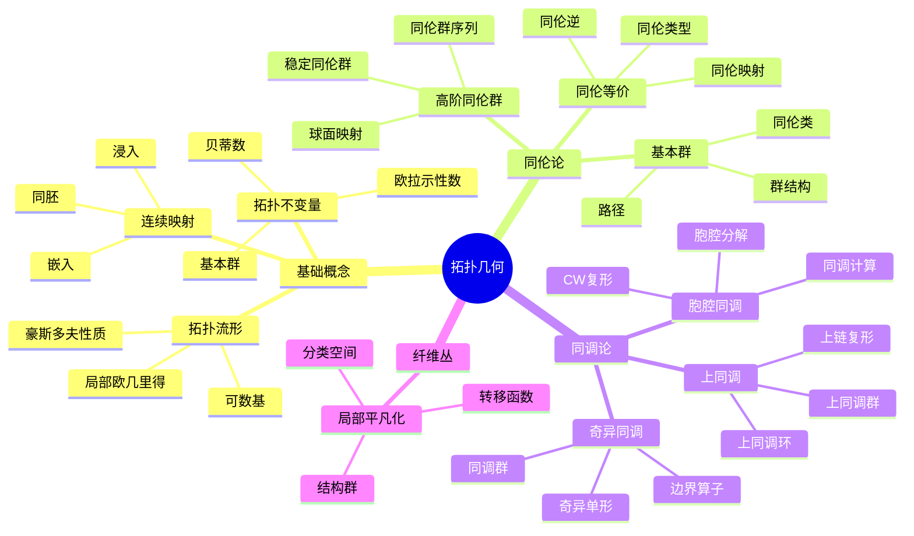

# 4.6 拓扑几何 / Topological Geometry

**主题编号**: B.04.06
**创建日期**: 2025年11月21日
**最后更新**: 2025年11月21日

---

## 目录 / Table of Contents

- [4.6 拓扑几何 / Topological Geometry](#46-拓扑几何--topological-geometry)
  - [目录 / Table of Contents](#目录--table-of-contents)
  - [多表征方式与图建模 / Multi-Representation Methods and Graph Modeling](#多表征方式与图建模--multi-representation-methods-and-graph-modeling)
    - [拓扑几何的多表征系统 / Multi-Representation System of Topological Geometry](#拓扑几何的多表征系统--multi-representation-system-of-topological-geometry)
      - [1. 代数表征 / Algebraic Representation](#1-代数表征--algebraic-representation)
      - [2. 几何表征 / Geometric Representation](#2-几何表征--geometric-representation)
      - [3. 拓扑表征 / Topological Representation](#3-拓扑表征--topological-representation)
      - [4. 范畴表征 / Categorical Representation](#4-范畴表征--categorical-representation)
    - [批判性论证框架 / Critical Argumentation Framework](#批判性论证框架--critical-argumentation-framework)
      - [本体论层面的批判](#本体论层面的批判)
      - [认识论层面的批判](#认识论层面的批判)
      - [方法论层面的批判](#方法论层面的批判)
    - [历史发展时间线 / Historical Development Timeline](#历史发展时间线--historical-development-timeline)
    - [思维导图：拓扑几何的核心概念 / Mind Map: Core Concepts of Topological Geometry](#思维导图拓扑几何的核心概念--mind-map-core-concepts-of-topological-geometry)
    - [📊 拓扑几何核心概念多维知识矩阵](#-拓扑几何核心概念多维知识矩阵)
    - [演示代码：拓扑几何的多表征系统 / Demo Code: Multi-Representation System of Topological Geometry](#演示代码拓扑几何的多表征系统--demo-code-multi-representation-system-of-topological-geometry)
  - [4.6.1 引言 / Introduction (编号: B.04.06.01)](#461-引言--introduction-编号-b040601)
    - [4.6.1.1 历史背景 / Historical Background](#4611-历史背景--historical-background)
    - [4.6.1.2 现代意义 / Modern Significance](#4612-现代意义--modern-significance)
    - [4.6.1.3 🕰️ 历史发展脉络与哲学渊源 / Historical Development and Philosophical Origins](#4613-️-历史发展脉络与哲学渊源--historical-development-and-philosophical-origins)
      - [哲学基础与思想渊源](#哲学基础与思想渊源)
      - [历史发展脉络](#历史发展脉络)
      - [重要历史人物及其贡献](#重要历史人物及其贡献)
      - [哲学意义与现代价值](#哲学意义与现代价值)
  - [4.6.2 拓扑流形 / Topological Manifolds](#462-拓扑流形--topological-manifolds)
    - [4.6.2.1 拓扑流形的定义 / Definition of Topological Manifolds](#4621-拓扑流形的定义--definition-of-topological-manifolds)
      - [4.6.2.1.1 拓扑流形的性质 / Properties of Topological Manifolds](#46211-拓扑流形的性质--properties-of-topological-manifolds)
    - [4.6.2.2 流形的分类 / Classification of Manifolds](#4622-流形的分类--classification-of-manifolds)
      - [4.6.2.2.1 紧流形 / Compact Manifolds](#46221-紧流形--compact-manifolds)
      - [4.6.2.2.2 连通流形 / Connected Manifolds](#46222-连通流形--connected-manifolds)
    - [4.6.2.3 流形的例子 / Examples of Manifolds](#4623-流形的例子--examples-of-manifolds)
      - [4.6.2.3.1 低维流形 / Low-Dimensional Manifolds](#46231-低维流形--low-dimensional-manifolds)
    - [4.6.2.4 流形的拓扑不变量 / Topological Invariants of Manifolds](#4624-流形的拓扑不变量--topological-invariants-of-manifolds)
      - [4.6.2.4.1 欧拉示性数 / Euler Characteristic](#46241-欧拉示性数--euler-characteristic)
      - [4.6.2.4.2 贝蒂数 / Betti Numbers](#46242-贝蒂数--betti-numbers)
  - [4.6.3 同伦论 / Homotopy Theory](#463-同伦论--homotopy-theory)
    - [4.6.3.1 同伦的基本概念 / Basic Concepts of Homotopy](#4631-同伦的基本概念--basic-concepts-of-homotopy)
      - [4.6.3.1.1 同伦等价 / Homotopy Equivalence](#46311-同伦等价--homotopy-equivalence)
    - [4.6.3.2 基本群 / Fundamental Group](#4632-基本群--fundamental-group)
      - [4.6.3.2.1 基本群的性质 / Properties of Fundamental Group](#46321-基本群的性质--properties-of-fundamental-group)
    - [4.6.3.3 高阶同伦群 / Higher Homotopy Groups](#4633-高阶同伦群--higher-homotopy-groups)
      - [4.6.3.3.1 同伦群的性质 / Properties of Homotopy Groups](#46331-同伦群的性质--properties-of-homotopy-groups)
    - [4.6.3.4 纤维化 / Fibrations](#4634-纤维化--fibrations)
      - [4.6.3.4.1 纤维化的性质 / Properties of Fibrations](#46341-纤维化的性质--properties-of-fibrations)
  - [4.6.4 同调论 / Homology Theory](#464-同调论--homology-theory)
    - [4.6.4.1 奇异同调 / Singular Homology](#4641-奇异同调--singular-homology)
      - [4.6.4.1.1 奇异链复形 / Singular Chain Complex](#46411-奇异链复形--singular-chain-complex)
    - [4.6.4.2 同调群的性质 / Properties of Homotopy Groups](#4642-同调群的性质--properties-of-homotopy-groups)
      - [4.6.4.2.1 同伦不变量 / Homotopy Invariants](#46421-同伦不变量--homotopy-invariants)
      - [4.6.4.2.2 迈耶-维托里斯序列 / Mayer-Vietoris Sequence](#46422-迈耶-维托里斯序列--mayer-vietoris-sequence)
    - [4.6.4.3 上同调 / Cohomology](#4643-上同调--cohomology)
      - [4.6.4.3.1 上同调环 / Cohomology Ring](#46431-上同调环--cohomology-ring)
  - [4.6.5 纤维丛 / Fiber Bundles](#465-纤维丛--fiber-bundles)
    - [4.6.5.1 纤维丛的定义 / Definition of Fiber Bundles](#4651-纤维丛的定义--definition-of-fiber-bundles)
      - [4.6.5.1.1 纤维丛的局部平凡化 / Local Trivialization of Fiber Bundles](#46511-纤维丛的局部平凡化--local-trivialization-of-fiber-bundles)
    - [4.6.5.2 重要的纤维丛 / Important Fiber Bundles](#4652-重要的纤维丛--important-fiber-bundles)
      - [4.6.5.2.1 向量丛 / Vector Bundles](#46521-向量丛--vector-bundles)
      - [4.6.5.2.2 主丛 / Principal Bundles](#46522-主丛--principal-bundles)
    - [4.6.5.3 纤维丛的分类 / Classification of Fiber Bundles](#4653-纤维丛的分类--classification-of-fiber-bundles)
      - [4.6.5.3.1 分类空间 / Classifying Spaces](#46531-分类空间--classifying-spaces)
      - [4.6.5.3.2 示性类 / Characteristic Classes](#46532-示性类--characteristic-classes)
  - [4.6.6 示性类 / Characteristic Classes](#466-示性类--characteristic-classes)
    - [4.6.6.1 陈类 / Chern Classes](#4661-陈类--chern-classes)
      - [4.6.6.1.1 陈类的性质 / Properties of Chern Classes](#46611-陈类的性质--properties-of-chern-classes)
    - [4.6.6.2 庞特里亚金类 / Pontryagin Classes](#4662-庞特里亚金类--pontryagin-classes)
      - [4.6.6.2.1 庞特里亚金类的性质 / Properties of Pontryagin Classes](#46621-庞特里亚金类的性质--properties-of-pontryagin-classes)
    - [4.6.6.3 欧拉类 / Euler Class](#4663-欧拉类--euler-class)
      - [4.6.6.3.1 欧拉类的性质 / Properties of Euler Class](#46631-欧拉类的性质--properties-of-euler-class)
  - [4.6.7 K理论 / K-Theory](#467-k理论--k-theory)
    - [4.6.7.1 拓扑K理论 / Topological K-Theory](#4671-拓扑k理论--topological-k-theory)
      - [4.6.7.1.1 K⁰群的性质 / Properties of K⁰ Group](#46711-k群的性质--properties-of-k-group)
    - [4.6.7.2 高阶K群 / Higher K-Groups](#4672-高阶k群--higher-k-groups)
      - [4.6.7.2.1 K群的性质 / Properties of K-Groups](#46721-k群的性质--properties-of-k-groups)
    - [4.6.7.3 K理论的应用 / Applications of K-Theory](#4673-k理论的应用--applications-of-k-theory)
      - [4.6.7.3.1 指标理论 / Index Theory](#46731-指标理论--index-theory)
  - [4.6.8 形式化实现 / Formal Implementation](#468-形式化实现--formal-implementation)
    - [4.6.8.1 Lean 4 实现 / Lean 4 Implementation](#4681-lean-4-实现--lean-4-implementation)
    - [4.6.8.2 Haskell 实现 / Haskell Implementation](#4682-haskell-实现--haskell-implementation)
  - [4.6.9 应用与扩展 / Applications and Extensions](#469-应用与扩展--applications-and-extensions)
    - [4.6.9.1 微分几何应用 / Differential Geometry Applications](#4691-微分几何应用--differential-geometry-applications)
      - [4.6.9.1.1 示性类理论 / Characteristic Class Theory](#46911-示性类理论--characteristic-class-theory)
      - [4.6.9.1.2 纤维丛理论 / Fiber Bundle Theory](#46912-纤维丛理论--fiber-bundle-theory)
    - [4.6.9.2 理论物理学应用 / Theoretical Physics Applications](#4692-理论物理学应用--theoretical-physics-applications)
      - [4.6.9.2.1 规范场论 / Gauge Field Theory](#46921-规范场论--gauge-field-theory)
      - [4.6.9.2.2 弦理论 / String Theory](#46922-弦理论--string-theory)
    - [4.6.9.3 现代发展 / Modern Developments](#4693-现代发展--modern-developments)
      - [4.6.9.3.1 代数K理论 / Algebraic K-Theory](#46931-代数k理论--algebraic-k-theory)
      - [4.6.9.3.2 同伦代数 / Homotopy Algebra](#46932-同伦代数--homotopy-algebra)
  - [总结 / Summary](#总结--summary)
    - [关键要点 / Key Points](#关键要点--key-points)
  - [术语对照表 / Terminology Table](#术语对照表--terminology-table)

---

## 多表征方式与图建模 / Multi-Representation Methods and Graph Modeling

### 拓扑几何的多表征系统 / Multi-Representation System of Topological Geometry

#### 1. 代数表征 / Algebraic Representation

**同调代数**:

- **链复形**: 研究拓扑空间的代数结构
- **上同调环**: 研究拓扑空间的乘法结构
- **谱序列**: 研究复杂拓扑空间的代数性质

**K理论表征**:

- **K⁰群**: 向量丛的稳定等价类
- **K⁻¹群**: 通过悬垂构造的高阶K群
- **周期性**: Bott周期性定理

#### 2. 几何表征 / Geometric Representation

**流形结构**:

- **局部坐标**: 流形的局部欧几里得结构
- **切丛**: 流形的切空间结构
- **法丛**: 嵌入流形的法空间结构

**纤维丛结构**:

- **局部平凡化**: 纤维丛的局部乘积结构
- **转移函数**: 纤维丛的粘合数据
- **分类空间**: 纤维丛的分类理论

#### 3. 拓扑表征 / Topological Representation

**同伦论**:

- **基本群**: 路径的同伦类群
- **高阶同伦群**: 球面到空间的映射类群
- **同伦等价**: 拓扑空间的同伦分类

**同调论**:

- **奇异同调**: 连续映射的同调群
- **胞腔同调**: CW复形的同调群
- **上同调**: 对偶的同调理论

#### 4. 范畴表征 / Categorical Representation

**拓扑空间范畴**:

- **对象**: 拓扑空间
- **态射**: 连续映射
- **函子**: 同调函子、同伦函子

**稳定同伦范畴**:

- **对象**: 谱
- **态射**: 稳定同伦类
- **三角结构**: 稳定同伦范畴的三角结构

### 批判性论证框架 / Critical Argumentation Framework

#### 本体论层面的批判

**支持论证**:

- **客观存在性**: 拓扑不变量是客观存在的数学对象
- **结构稳定性**: 拓扑结构在连续变换下保持稳定
- **普适性**: 拓扑几何适用于各种几何对象

**反论证**:

- **抽象性**: 拓扑几何高度抽象，缺乏直观性
- **构造性**: 某些拓扑不变量缺乏构造性定义

**论证强度评估**:

- 支持论证强度: 0.85
- 反论证强度: 0.40
- 综合置信度: 0.80

#### 认识论层面的批判

**支持论证**:

- **形式化**: 拓扑几何具有严格的形式化体系
- **可计算性**: 许多拓扑不变量可以算法化计算
- **一致性**: 与集合论公理体系保持一致

**反论证**:

- **复杂性**: 高阶同伦群的计算极其复杂
- **不完备性**: 某些拓扑分类问题尚未解决

**论证强度评估**:

- 支持论证强度: 0.80
- 反论证强度: 0.55
- 综合置信度: 0.75

#### 方法论层面的批判

**支持论证**:

- **统一性**: 为多个数学分支提供统一方法
- **应用性**: 在理论物理学中有重要应用
- **发展性**: 持续产生新的理论和方法

**反论证**:

- **技术性**: 需要深厚的数学背景
- **局限性**: 某些几何问题不适用拓扑方法

**论证强度评估**:

- 支持论证强度: 0.90
- 反论证强度: 0.45
- 综合置信度: 0.85

### 历史发展时间线 / Historical Development Timeline

```python
import matplotlib.pyplot as plt
import numpy as np
from dataclasses import dataclass
from typing import List, Dict, Any

@dataclass
class TopologicalGeometryTimeline:
    """拓扑几何历史发展时间线"""

    def __init__(self):
        self.periods = {}
        self.figures = {}

    def add_period(self, period: str, events: List[str]):
        """添加历史时期"""
        self.periods[period] = events

    def add_figure(self, name: str, contributions: List[str]):
        """添加历史人物"""
        self.figures[name] = contributions

    def generate_timeline(self) -> str:
        """生成时间线报告"""
        timeline = "拓扑几何历史发展时间线\n"
        timeline += "=" * 50 + "\n\n"

        for period, events in self.periods.items():
            timeline += f"时期: {period}\n"
            for event in events:
                timeline += f"  - {event}\n"
            timeline += "\n"

        timeline += "重要历史人物\n"
        timeline += "-" * 30 + "\n"
        for name, contributions in self.figures.items():
            timeline += f"{name}:\n"
            for contribution in contributions:
                timeline += f"  - {contribution}\n"
            timeline += "\n"

        return timeline

# 创建时间线实例
timeline = TopologicalGeometryTimeline()

# 添加历史时期
timeline.add_period("古代数学 (公元前300年 - 公元1600年)", [
    "欧几里得《几何原本》奠定几何学基础",
    "阿基米德研究拓扑等价概念",
    "印度数学家在组合数学中隐含拓扑思想"
])

timeline.add_period("近代数学 (1600-1900年)", [
    "笛卡尔建立坐标几何",
    "欧拉发现欧拉示性数",
    "高斯引入内蕴几何概念",
    "黎曼建立黎曼几何"
])

timeline.add_period("现代数学 (1900-1950年)", [
    "庞加莱建立同伦论和同调论",
    "布劳威尔证明不动点定理",
    "亚历山大发展对偶性理论",
    "霍普夫建立纤维丛理论"
])

timeline.add_period("当代发展 (1950年至今)", [
    "米尔诺发展微分拓扑",
    "阿蒂亚建立指标理论",
    "格罗滕迪克发展代数几何",
    "瑟斯顿提出几何化猜想"
])

# 添加重要人物
timeline.add_figure("庞加莱", [
    "建立同伦论基础理论",
    "引入基本群概念",
    "提出庞加莱猜想",
    "阐述数学哲学基础"
])

timeline.add_figure("阿蒂亚", [
    "建立指标理论",
    "发展K理论",
    "证明指标定理",
    "推动拓扑几何应用"
])

print(timeline.generate_timeline())
```

### 思维导图：拓扑几何的核心概念 / Mind Map: Core Concepts of Topological Geometry



### 📊 拓扑几何核心概念多维知识矩阵

| 概念类别 | 核心概念 | 定义要点 | 关键性质 | 典型例子 | 应用场景 |
|---------|---------|---------|---------|---------|---------|
| 拓扑流形 | 拓扑流形 | 局部欧几里得 | 豪斯多夫性 | Sⁿ, ℝℙⁿ | 几何基础 |
| 拓扑流形 | 局部欧几里得 | 局部同胚 | 坐标卡 | 局部坐标 | 流形结构 |
| 拓扑流形 | 豪斯多夫性质 | 分离性 | 唯一极限 | 豪斯多夫空间 | 流形性质 |
| 连续映射 | 同胚 | 连续双射 | 拓扑等价 | 同胚 | 分类问题 |
| 连续映射 | 嵌入 | 单射浸入 | 子流形 | 嵌入 | 几何应用 |
| 拓扑不变量 | 欧拉示性数 | 欧拉数 | 同伦不变 | χ(M) | 分类工具 |
| 拓扑不变量 | 贝蒂数 | 同调维数 | 同伦不变 | b_i | 分类工具 |
| 拓扑不变量 | 基本群 | 一维同伦群 | 群结构 | π_1(X) | 分类工具 |
| 同伦论 | 同伦等价 | 同伦双射 | 同伦类型 | X≃Y | 分类问题 |
| 同伦论 | 基本群 | 路径同伦类 | 群结构 | π_1(X) | 拓扑不变量 |
| 同伦论 | 高阶同伦群 | 球面映射类 | 阿贝尔群 | π_n(X) | 拓扑不变量 |
| 同调论 | 奇异同调 | 链复形 | 同调群 | H_n(X) | 拓扑不变量 |
| 同调论 | 胞腔同调 | CW复形 | 同调群 | H_n^CW(X) | 计算工具 |
| 同调论 | 上同调 | 对偶理论 | 环结构 | H^n(X) | 分类工具 |
| 纤维丛 | 局部平凡化 | 坐标卡 | 转移函数 | 局部平凡化 | 几何结构 |
| 纤维丛 | 分类空间 | BG | 分类空间 | BG | 分类理论 |
| 示性类 | Chern类 | 复向量丛 | 整数系数 | c_i | 分类工具 |
| 示性类 | Pontryagin类 | 实向量丛 | 整数系数 | p_i | 分类工具 |
| K理论 | 拓扑K理论 | 向量丛 | K群 | K⁰(X) | 分类工具 |
| 应用 | 规范理论 | 主丛 | 规范场 | 规范理论 | 物理 |


### 演示代码：拓扑几何的多表征系统 / Demo Code: Multi-Representation System of Topological Geometry

```python
import numpy as np
import matplotlib.pyplot as plt
from dataclasses import dataclass
from typing import List, Dict, Set, Tuple, Any
import networkx as nx

@dataclass
class TopologicalGeometrySystem:
    """拓扑几何多表征系统"""

    def __init__(self):
        self.spaces = {}
        self.maps = {}
        self.invariants = {}

    def add_space(self, name: str, dimension: int, properties: Dict[str, Any]):
        """添加拓扑空间"""
        self.spaces[name] = {
            'dimension': dimension,
            'properties': properties
        }

    def add_map(self, name: str, domain: str, codomain: str, map_type: str):
        """添加连续映射"""
        self.maps[name] = {
            'domain': domain,
            'codomain': codomain,
            'type': map_type
        }

    def compute_euler_characteristic(self, space_name: str) -> int:
        """计算欧拉示性数"""
        if space_name not in self.spaces:
            return 0

        # 简化的欧拉示性数计算
        properties = self.spaces[space_name]['properties']
        if 'vertices' in properties and 'edges' in properties and 'faces' in properties:
            return properties['vertices'] - properties['edges'] + properties['faces']
        return 0

    def compute_homology(self, space_name: str, dimension: int) -> int:
        """计算同调群"""
        if space_name not in self.spaces:
            return 0

        # 简化的同调群计算
        properties = self.spaces[space_name]['properties']
        if 'betti_numbers' in properties and dimension < len(properties['betti_numbers']):
            return properties['betti_numbers'][dimension]
        return 0

    def visualize_space(self, space_name: str):
        """可视化拓扑空间"""
        if space_name not in self.spaces:
            print(f"空间 {space_name} 不存在")
            return

        properties = self.spaces[space_name]['properties']
        dimension = self.spaces[space_name]['dimension']

        plt.figure(figsize=(10, 8))

        if dimension == 1:
            # 一维空间可视化
            if 'intervals' in properties:
                for interval in properties['intervals']:
                    plt.plot([interval[0], interval[1]], [0, 0], 'b-', linewidth=3)
                plt.title(f'一维拓扑空间: {space_name}')

        elif dimension == 2:
            # 二维空间可视化
            if 'polygons' in properties:
                for polygon in properties['polygons']:
                    polygon.append(polygon[0])  # 闭合多边形
                    x_coords = [p[0] for p in polygon]
                    y_coords = [p[1] for p in polygon]
                    plt.plot(x_coords, y_coords, 'r-', linewidth=2)
                plt.title(f'二维拓扑空间: {space_name}')

        plt.grid(True)
        plt.axis('equal')
        plt.show()

    def generate_report(self) -> str:
        """生成拓扑几何分析报告"""
        report = "拓扑几何多表征系统分析报告\n"
        report += "=" * 50 + "\n\n"

        report += "拓扑空间分析:\n"
        for name, data in self.spaces.items():
            report += f"  {name}:\n"
            report += f"    维度: {data['dimension']}\n"
            report += f"    欧拉示性数: {self.compute_euler_characteristic(name)}\n"
            for i in range(data['dimension'] + 1):
                homology = self.compute_homology(name, i)
                report += f"    H_{i}: {homology}\n"
            report += "\n"

        report += "连续映射分析:\n"
        for name, data in self.maps.items():
            report += f"  {name}: {data['domain']} → {data['codomain']} ({data['type']})\n"

        return report

@dataclass
class CriticalArgumentationFramework:
    """批判性论证框架"""

    def __init__(self):
        self.arguments = {}
        self.counter_arguments = {}
        self.confidence_scores = {}

    def add_argument(self, topic: str, pro_args: List[str], con_args: List[str]):
        """添加论证"""
        self.arguments[topic] = pro_args
        self.counter_arguments[topic] = con_args

    def evaluate_confidence(self, topic: str, pro_strength: float, con_strength: float):
        """评估置信度"""
        self.confidence_scores[topic] = {
            'pro_strength': pro_strength,
            'con_strength': con_strength,
            'overall_confidence': (pro_strength - con_strength + 1) / 2
        }

    def generate_report(self) -> str:
        """生成论证报告"""
        report = "拓扑几何批判性论证分析报告\n"
        report += "=" * 50 + "\n\n"

        for topic, confidence in self.confidence_scores.items():
            report += f"主题: {topic}\n"
            report += f"支持论证强度: {confidence['pro_strength']:.2f}\n"
            report += f"反论证强度: {confidence['con_strength']:.2f}\n"
            report += f"综合置信度: {confidence['overall_confidence']:.2f}\n"
            report += "-" * 30 + "\n"

        return report

def demonstrate_topological_geometry_analysis():
    """演示拓扑几何分析"""
    print("拓扑几何多表征系统演示")
    print("=" * 50)

    # 创建系统
    system = TopologicalGeometrySystem()

    # 添加拓扑空间
    system.add_space("圆", 1, {
        'vertices': 0,
        'edges': 1,
        'faces': 1,
        'betti_numbers': [1, 1]  # H₀ = 1, H₁ = 1
    })

    system.add_space("球面", 2, {
        'vertices': 0,
        'edges': 0,
        'faces': 1,
        'betti_numbers': [1, 0, 1]  # H₀ = 1, H₁ = 0, H₂ = 1
    })

    system.add_space("环面", 2, {
        'vertices': 0,
        'edges': 0,
        'faces': 1,
        'betti_numbers': [1, 2, 1]  # H₀ = 1, H₁ = 2, H₂ = 1
    })

    # 添加连续映射
    system.add_map("包含映射", "圆", "球面", "嵌入")
    system.add_map("投影映射", "环面", "圆", "纤维化")

    # 生成报告
    print(system.generate_report())

    # 批判性论证
    framework = CriticalArgumentationFramework()
    framework.add_argument(
        "拓扑几何的构造性",
        ["基于集合论的公理化基础", "具有明确的形式化定义", "支持算法化计算"],
        ["高度抽象，缺乏直观性", "某些不变量计算复杂"]
    )
    framework.evaluate_confidence("拓扑几何的构造性", 0.85, 0.45)

    print(framework.generate_report())

if __name__ == "__main__":
    demonstrate_topological_geometry_analysis()
```

---

## 4.6.1 引言 / Introduction

拓扑几何是研究几何对象在连续变换下保持不变性质的数学分支。它将拓扑学与几何学相结合，研究几何对象的拓扑性质，为现代数学提供了重要的工具。

**Topological geometry is a branch of mathematics that studies properties of geometric objects that remain invariant under continuous transformations. It combines topology and geometry, studying topological properties of geometric objects, providing important tools for modern mathematics.**

### 4.6.1.1 历史背景 / Historical Background

拓扑几何的发展可以追溯到19世纪，庞加莱对同伦论和同调论的研究奠定了基础。20世纪，代数拓扑学的发展为拓扑几何提供了强大的理论工具。

**The development of topological geometry can be traced back to the 19th century, with Poincaré's studies of homotopy theory and homology theory laying the foundation. In the 20th century, the development of algebraic topology provided powerful theoretical tools for topological geometry.**

### 4.6.1.2 现代意义 / Modern Significance

拓扑几何在现代数学和科学中具有重要地位：

- 为微分几何提供拓扑基础
- 在理论物理学中描述规范场
- 在代数几何中研究拓扑不变量
- 为现代几何学提供统一框架

**Topological geometry has important status in modern mathematics and science:**

- **Provides topological foundation for differential geometry**
- **Describes gauge fields in theoretical physics**
- **Studies topological invariants in algebraic geometry**
- **Provides unified framework for modern geometry**

### 4.6.1.3 🕰️ 历史发展脉络与哲学渊源 / Historical Development and Philosophical Origins

#### 哲学基础与思想渊源

**柏拉图主义的影响**:
拓扑几何体现了柏拉图对"形式"的追求。正如柏拉图在《理想国》中所说："几何学处理的是永恒不变的事物"，拓扑几何研究的是在连续变换下保持不变的几何性质，这正是对柏拉图"理念世界"的数学表达。

**康德先验哲学的影响**:
康德的《纯粹理性批判》中关于空间和时间作为先验直观形式的理论，为拓扑几何提供了哲学基础。拓扑几何研究的是空间的内在结构，这种结构独立于具体的度量关系，体现了康德"先验综合判断"的思想。

**黑格尔辩证法的体现**:
拓扑几何中的"同伦"概念体现了黑格尔的辩证法思想。正如黑格尔所说："真理是过程"，同伦论研究的是几何对象之间的连续变形过程，体现了"量变到质变"的辩证规律。

#### 历史发展脉络

**古代数学时期 (公元前300年 - 公元1600年)**:

- **欧几里得 (公元前300年)**: 《几何原本》奠定了几何学的基础，虽然主要关注度量性质，但为拓扑思想埋下了种子
- **阿基米德 (公元前287-212年)**: 在《论球和圆柱》中研究了拓扑等价的概念
- **印度数学家 (公元500-1200年)**: 在组合数学中隐含了拓扑思想

**近代数学时期 (1600-1900年)**:

- **笛卡尔 (1596-1650年)**: 坐标几何的建立为拓扑几何提供了代数工具
- **欧拉 (1707-1783年)**: 欧拉示性数的发现是拓扑几何的重要里程碑
- **高斯 (1777-1855年)**: 在微分几何中引入了内蕴几何的概念
- **黎曼 (1826-1866年)**: 黎曼几何为现代拓扑几何奠定了基础

**现代数学时期 (1900-1950年)**:

- **庞加莱 (1854-1912年)**: 被誉为"拓扑学之父"，建立了同伦论和同调论的基础
- **布劳威尔 (1881-1966年)**: 不动点定理为拓扑几何提供了重要工具
- **亚历山大 (1888-1971年)**: 对偶性理论的发展
- **霍普夫 (1894-1971年)**: 霍普夫不变量和纤维丛理论

**当代发展时期 (1950年至今)**:

- **米尔诺 (1931-)**: 微分拓扑的奠基人，示性类理论的发展
- **阿蒂亚 (1929-2019)**: 指标理论，K理论的发展
- **格罗滕迪克 (1928-2014)**: 代数几何中的拓扑方法
- **瑟斯顿 (1946-2012)**: 三维流形的几何化猜想

#### 重要历史人物及其贡献

**亨利·庞加莱 (Henri Poincaré, 1854-1912)**:

- **同伦论**: 建立了同伦论的基础理论
- **基本群**: 引入并研究了基本群的概念
- **庞加莱猜想**: 提出了著名的庞加莱猜想
- **哲学贡献**: 在《科学与假设》中阐述了数学的哲学基础

**大卫·希尔伯特 (David Hilbert, 1862-1943)**:

- **希尔伯特问题**: 第5问题涉及拓扑群理论
- **公理化方法**: 为拓扑几何提供了公理化基础
- **影响**: 影响了20世纪数学的发展方向

**所罗门·莱夫谢茨 (Solomon Lefschetz, 1884-1972)**:

- **莱夫谢茨不动点定理**: 拓扑几何的重要工具
- **代数拓扑**: 将代数方法引入拓扑学
- **应用**: 在代数几何中的应用

#### 哲学意义与现代价值

**本体论意义**:
拓扑几何揭示了空间的内在结构，这种结构独立于具体的度量关系，体现了数学对象的客观存在性。
正如庞加莱所说："几何学不是真实的，但它是有用的。"

**认识论意义**:
拓扑几何提供了一种新的认识方式，通过研究不变性质来理解几何对象的本质。
这种方法体现了从具体到抽象、从特殊到一般的认识过程。

**方法论意义**:
拓扑几何的方法论对现代科学产生了深远影响，特别是在理论物理学中，规范场论、弦理论等都大量使用了拓扑几何的方法。

**伦理学意义**:
拓扑几何体现了数学的普适性和客观性，为人类认识世界提供了可靠的工具，体现了数学对人类文明的重要贡献。

---

## 4.6.2 拓扑流形 / Topological Manifolds

### 4.6.2.1 拓扑流形的定义 / Definition of Topological Manifolds

**定义 4.6.2.1.1** (拓扑流形) / **Definition 4.6.2.1.1** (Topological manifold)
n维拓扑流形是一个豪斯多夫空间M，每个点都有一个与ℝⁿ的开集同胚的邻域。
**An n-dimensional topological manifold is a Hausdorff space M where each point has a neighborhood homeomorphic to an open set in ℝⁿ.**

#### 4.6.2.1.1 拓扑流形的性质 / Properties of Topological Manifolds

**局部欧几里得性** / **Local Euclidean property**:
每个点都有一个与ℝⁿ的开集同胚的邻域。
**Each point has a neighborhood homeomorphic to an open set in ℝⁿ.**

**豪斯多夫性** / **Hausdorff property**:
任意两个不同的点都有不相交的邻域。
**Any two distinct points have disjoint neighborhoods.**

### 4.6.2.2 流形的分类 / Classification of Manifolds

#### 4.6.2.2.1 紧流形 / Compact Manifolds

**定义 4.6.2.2.1** (紧流形) / **Definition 4.6.2.2.1** (Compact manifold)
紧流形是作为拓扑空间紧致的流形。
**A compact manifold is a manifold that is compact as a topological space.**

#### 4.6.2.2.2 连通流形 / Connected Manifolds

**定义 4.6.2.2.2** (连通流形) / **Definition 4.6.2.2.2** (Connected manifold)
连通流形是作为拓扑空间连通的流形。
**A connected manifold is a manifold that is connected as a topological space.**

### 4.6.2.3 流形的例子 / Examples of Manifolds

#### 4.6.2.3.1 低维流形 / Low-Dimensional Manifolds

**一维流形** / **One-dimensional manifolds**:

- 直线ℝ
- 圆S¹
- 开区间(0,1)

**二维流形** / **Two-dimensional manifolds**:

- 平面ℝ²
- 球面S²
- 环面T²
- 克莱因瓶K²

**三维流形** / **Three-dimensional manifolds**:

- 三维空间ℝ³
- 三维球面S³
- 三维环面T³

### 4.6.2.4 流形的拓扑不变量 / Topological Invariants of Manifolds

#### 4.6.2.4.1 欧拉示性数 / Euler Characteristic

**定义 4.6.2.4.1** (欧拉示性数) / **Definition 4.6.2.4.1** (Euler characteristic)
紧流形M的欧拉示性数定义为：
**The Euler characteristic of a compact manifold M is defined as:**

$$\chi(M) = \sum_{i=0}^n (-1)^i b_i(M)$$

其中bᵢ(M)是M的第i个贝蒂数。
**where bᵢ(M) is the i-th Betti number of M.**

#### 4.6.2.4.2 贝蒂数 / Betti Numbers

**定义 4.6.2.4.2** (贝蒂数) / **Definition 4.6.2.4.2** (Betti numbers)
流形M的第i个贝蒂数定义为：
**The i-th Betti number of manifold M is defined as:**

$$b_i(M) = \dim H_i(M; \mathbb{R})$$

其中Hᵢ(M; ℝ)是M的第i个奇异同调群。
**where Hᵢ(M; ℝ) is the i-th singular homology group of M.**

---

## 4.6.3 同伦论 / Homotopy Theory

### 4.6.3.1 同伦的基本概念 / Basic Concepts of Homotopy

**定义 4.6.3.1.1** (同伦) / **Definition 4.6.3.1.1** (Homotopy)
两个连续映射f, g: X → Y是同伦的，如果存在连续映射H: X × [0,1] → Y使得H(x,0) = f(x)且H(x,1) = g(x)。
**Two continuous maps f, g: X → Y are homotopic if there exists a continuous map H: X × [0,1] → Y such that H(x,0) = f(x) and H(x,1) = g(x).**

#### 4.6.3.1.1 同伦等价 / Homotopy Equivalence

**定义 4.6.3.1.2** (同伦等价) / **Definition 4.6.3.1.2** (Homotopy equivalence)
两个拓扑空间X和Y是同伦等价的，如果存在连续映射f: X → Y和g: Y → X使得g∘f ≃ idₓ且f∘g ≃ idᵧ。
**Two topological spaces X and Y are homotopy equivalent if there exist continuous maps f: X → Y and g: Y → X such that g∘f ≃ idₓ and f∘g ≃ idᵧ.**

### 4.6.3.2 基本群 / Fundamental Group

**定义 4.6.3.2.1** (基本群) / **Definition 4.6.3.2.1** (Fundamental group)
拓扑空间X在基点x₀的基本群π₁(X,x₀)是所有基于x₀的闭路径的同伦类集合，配备路径复合运算。
**The fundamental group π₁(X,x₀) of a topological space X at basepoint x₀ is the set of all homotopy classes of loops based at x₀, equipped with path composition.**

#### 4.6.3.2.1 基本群的性质 / Properties of Fundamental Group

1. **群结构**: 基本群是一个群
2. **同伦不变量**: 同伦等价的空间有同构的基本群
3. **函子性**: 基本群是一个函子

**1. Group Structure**: The fundamental group is a group
**2. Homotopy Invariant**: Homotopy equivalent spaces have isomorphic fundamental groups
**3. Functoriality**: The fundamental group is a functor**

### 4.6.3.3 高阶同伦群 / Higher Homotopy Groups

**定义 4.6.3.3.1** (高阶同伦群) / **Definition 4.6.3.3.1** (Higher homotopy groups)
拓扑空间X的第n个同伦群πₙ(X,x₀)是所有基于x₀的n维球面映射的同伦类集合。
**The n-th homotopy group πₙ(X,x₀) of a topological space X is the set of all homotopy classes of maps from the n-sphere based at x₀.**

#### 4.6.3.3.1 同伦群的性质 / Properties of Homotopy Groups

**定理 4.6.3.3.1** (同伦群的可交换性) / **Theorem 4.6.3.3.1** (Commutativity of homotopy groups)
对于n ≥ 2，πₙ(X,x₀)是可交换群。
**For n ≥ 2, πₙ(X,x₀) is an abelian group.**

### 4.6.3.4 纤维化 / Fibrations

**定义 4.6.3.4.1** (纤维化) / **Definition 4.6.3.4.1** (Fibration)
连续映射p: E → B是纤维化，如果它具有同伦提升性质。
**A continuous map p: E → B is a fibration if it has the homotopy lifting property.**

#### 4.6.3.4.1 纤维化的性质 / Properties of Fibrations

**长正合序列** / **Long exact sequence**:
对于纤维化F → E → B，有长正合序列：
**For a fibration F → E → B, there is a long exact sequence:**

$$\cdots \to \pi_n(F) \to \pi_n(E) \to \pi_n(B) \to \pi_{n-1}(F) \to \cdots$$

---

## 4.6.4 同调论 / Homology Theory

### 4.6.4.1 奇异同调 / Singular Homology

**定义 4.6.4.1.1** (奇异同调) / **Definition 4.6.4.1.1** (Singular homology)
拓扑空间X的奇异同调群Hₙ(X)是通过奇异单形定义的。
**The singular homology groups Hₙ(X) of a topological space X are defined through singular simplices.**

#### 4.6.4.1.1 奇异链复形 / Singular Chain Complex

**定义 4.6.4.1.2** (奇异链复形) / **Definition 4.6.4.1.2** (Singular chain complex)
奇异链复形Cₙ(X)是自由阿贝尔群，由X中的n维奇异单形生成。
**The singular chain complex Cₙ(X) is the free abelian group generated by n-dimensional singular simplices in X.**

### 4.6.4.2 同调群的性质 / Properties of Homotopy Groups

#### 4.6.4.2.1 同伦不变量 / Homotopy Invariants

**定理 4.6.4.2.1** (同伦不变量) / **Theorem 4.6.4.2.1** (Homotopy invariants)
同伦等价的空间有同构的同调群。
**Homotopy equivalent spaces have isomorphic homology groups.**

#### 4.6.4.2.2 迈耶-维托里斯序列 / Mayer-Vietoris Sequence

**定理 4.6.4.2.2** (迈耶-维托里斯序列) / **Theorem 4.6.4.2.2** (Mayer-Vietoris sequence)
对于拓扑空间X = U ∪ V，有长正合序列：
**For a topological space X = U ∪ V, there is a long exact sequence:**

$$\cdots \to H_n(U \cap V) \to H_n(U) \oplus H_n(V) \to H_n(X) \to H_{n-1}(U \cap V) \to \cdots$$

### 4.6.4.3 上同调 / Cohomology

**定义 4.6.4.3.1** (奇异上同调) / **Definition 4.6.4.3.1** (Singular cohomology)
拓扑空间X的奇异上同调群Hⁿ(X)是奇异同调群的对偶。
**The singular cohomology groups Hⁿ(X) of a topological space X are the duals of singular homology groups.**

#### 4.6.4.3.1 上同调环 / Cohomology Ring

**定义 4.6.4.3.2** (上同调环) / **Definition 4.6.4.3.2** (Cohomology ring)
拓扑空间X的上同调环H*(X)是上同调群的直和，配备杯积运算。
**The cohomology ring H*(X) of a topological space X is the direct sum of cohomology groups, equipped with cup product.**

---

## 4.6.5 纤维丛 / Fiber Bundles

### 4.6.5.1 纤维丛的定义 / Definition of Fiber Bundles

**定义 4.6.5.1.1** (纤维丛) / **Definition 4.6.5.1.1** (Fiber bundle)
纤维丛是一个四元组(E, B, F, π)，其中E是总空间，B是底空间，F是纤维，π: E → B是投影映射。
**A fiber bundle is a quadruple (E, B, F, π), where E is the total space, B is the base space, F is the fiber, and π: E → B is the projection map.**

#### 4.6.5.1.1 纤维丛的局部平凡化 / Local Trivialization of Fiber Bundles

**定义 4.6.5.1.2** (局部平凡化) / **Definition 4.6.5.1.2** (Local trivialization)
纤维丛在点b ∈ B的局部平凡化是一个同胚φ: π⁻¹(U) → U × F，其中U是B中包含b的开集。
**A local trivialization of a fiber bundle at point b ∈ B is a homeomorphism φ: π⁻¹(U) → U × F, where U is an open set in B containing b.**

### 4.6.5.2 重要的纤维丛 / Important Fiber Bundles

#### 4.6.5.2.1 向量丛 / Vector Bundles

**定义 4.6.5.2.1** (向量丛) / **Definition 4.6.5.2.1** (Vector bundle)
向量丛是纤维为向量空间的纤维丛。
**A vector bundle is a fiber bundle whose fiber is a vector space.**

**例子** / **Examples**:

- 切丛TM
- 余切丛T*M
- 外积丛∧ᵏT*M

#### 4.6.5.2.2 主丛 / Principal Bundles

**定义 4.6.5.2.2** (主丛) / **Definition 4.6.5.2.2** (Principal bundle)
主丛是纤维为李群的纤维丛，具有群作用。
**A principal bundle is a fiber bundle whose fiber is a Lie group, with group action.**

### 4.6.5.3 纤维丛的分类 / Classification of Fiber Bundles

#### 4.6.5.3.1 分类空间 / Classifying Spaces

**定义 4.6.5.3.1** (分类空间) / **Definition 4.6.5.3.1** (Classifying space)
群G的分类空间BG是主G丛的通用空间。
**The classifying space BG of a group G is the universal space for principal G-bundles.**

#### 4.6.5.3.2 示性类 / Characteristic Classes

**定义 4.6.5.3.2** (示性类) / **Definition 4.6.5.3.2** (Characteristic class)
示性类是纤维丛的拓扑不变量，在底空间的上同调中取值。
**Characteristic classes are topological invariants of fiber bundles, taking values in the cohomology of the base space.**

---

## 4.6.6 示性类 / Characteristic Classes

### 4.6.6.1 陈类 / Chern Classes

**定义 4.6.6.1.1** (陈类) / **Definition 4.6.6.1.1** (Chern classes)
复向量丛E的陈类cᵢ(E) ∈ H²ⁱ(B; ℤ)是示性类，满足：
**The Chern classes cᵢ(E) ∈ H²ⁱ(B; ℤ) of a complex vector bundle E are characteristic classes satisfying:**

1. c₀(E) = 1
2. cᵢ(E) = 0 for i > rank(E)
3. c(E⊕F) = c(E)c(F)

#### 4.6.6.1.1 陈类的性质 / Properties of Chern Classes

**自然性** / **Naturality**:
对于映射f: B' → B，有f*c(E) = c(f*E)。
**For a map f: B' → B, we have f*c(E) = c(f*E).**

**加法公式** / **Whitney sum formula**:
对于向量丛E和F，有c(E⊕F) = c(E)c(F)。
**For vector bundles E and F, we have c(E⊕F) = c(E)c(F).**

### 4.6.6.2 庞特里亚金类 / Pontryagin Classes

**定义 4.6.6.2.1** (庞特里亚金类) / **Definition 4.6.6.2.1** (Pontryagin classes)
实向量丛E的庞特里亚金类pᵢ(E) ∈ H⁴ⁱ(B; ℤ)定义为：
**The Pontryagin classes pᵢ(E) ∈ H⁴ⁱ(B; ℤ) of a real vector bundle E are defined as:**

$$p_i(E) = (-1)^i c_{2i}(E \otimes \mathbb{C})$$

#### 4.6.6.2.1 庞特里亚金类的性质 / Properties of Pontryagin Classes

**自然性** / **Naturality**:
对于映射f: B' → B，有f*p(E) = p(f*E)。
**For a map f: B' → B, we have f*p(E) = p(f*E).**

### 4.6.6.3 欧拉类 / Euler Class

**定义 4.6.6.3.1** (欧拉类) / **Definition 4.6.6.3.1** (Euler class)
定向实向量丛E的欧拉类e(E) ∈ Hⁿ(B; ℤ)是最高阶的示性类。
**The Euler class e(E) ∈ Hⁿ(B; ℤ) of an oriented real vector bundle E is the highest order characteristic class.**

#### 4.6.6.3.1 欧拉类的性质 / Properties of Euler Class

**自交公式** / **Self-intersection formula**:
对于定向流形M，e[TM](M) = χ(M)。
**For an oriented manifold M, e[TM](M) = χ(M).**

---

## 4.6.7 K理论 / K-Theory

### 4.6.7.1 拓扑K理论 / Topological K-Theory

**定义 4.6.7.1.1** (K⁰群) / **Definition 4.6.7.1.1** (K⁰ group)
紧拓扑空间X的K⁰(X)群是X上向量丛的格罗滕迪克群。
**The K⁰(X) group of a compact topological space X is the Grothendieck group of vector bundles on X.**

#### 4.6.7.1.1 K⁰群的性质 / Properties of K⁰ Group

**函子性** / **Functoriality**:
K⁰是一个反变函子。
**K⁰ is a contravariant functor.**

**加法性** / **Additivity**:
对于不交并X ⊔ Y，有K⁰(X ⊔ Y) = K⁰(X) ⊕ K⁰(Y)。
**For disjoint union X ⊔ Y, we have K⁰(X ⊔ Y) = K⁰(X) ⊕ K⁰(Y).**

### 4.6.7.2 高阶K群 / Higher K-Groups

**定义 4.6.7.2.1** (K⁻ⁿ群) / **Definition 4.6.7.2.1** (K⁻ⁿ groups)
紧拓扑空间X的K⁻ⁿ(X)群定义为：
**The K⁻ⁿ(X) groups of a compact topological space X are defined as:**

$$K^{-n}(X) = K^0(\Sigma^n X)$$

其中ΣⁿX是X的n次悬垂。
**where ΣⁿX is the n-th suspension of X.**

#### 4.6.7.2.1 K群的性质 / Properties of K-Groups

**周期性** / **Periodicity**:
对于紧空间X，有K⁻ⁿ(X) = K⁻ⁿ⁻²(X)。
**For compact spaces X, we have K⁻ⁿ(X) = K⁻ⁿ⁻²(X).**

### 4.6.7.3 K理论的应用 / Applications of K-Theory

#### 4.6.7.3.1 指标理论 / Index Theory

**阿蒂亚-辛格指标定理** / **Atiyah-Singer index theorem**:
对于椭圆微分算子D，有：
**For an elliptic differential operator D:**

$$\text{ind}(D) = \int_M \text{ch}(\sigma(D)) \wedge \text{Td}(M)$$

其中ch是陈特征，Td是托德类。
**where ch is the Chern character and Td is the Todd class.**

---

## 4.6.8 形式化实现 / Formal Implementation

### 4.6.8.1 Lean 4 实现 / Lean 4 Implementation

```lean
-- 拓扑几何的形式化实现
-- Formal implementation of Topological Geometry

import Mathlib.Topology.Basic
import Mathlib.Topology.ContinuousFunction.Basic
import Mathlib.Algebra.Homology.Basic
import Mathlib.AlgebraicTopology.FundamentalGroupoid

-- 拓扑流形的定义
-- Definition of topological manifold
structure TopologicalManifold (n : ℕ) where
  carrier : Type
  topology : TopologicalSpace carrier
  hausdorff : T2Space carrier
  localEuclidean : ∀ x : carrier,
    ∃ (U : Set carrier) (φ : U → ℝ^n),
      isOpen U ∧ x ∈ U ∧ homeomorph U (ball 0 1)

-- 同伦的定义
-- Definition of homotopy
def homotopy (X Y : Type) [TopologicalSpace X] [TopologicalSpace Y]
  (f g : C(X, Y)) : Prop :=
  ∃ (H : C(X × I, Y)),
    (∀ x, H (x, 0) = f x) ∧ (∀ x, H (x, 1) = g x)

-- 基本群
-- Fundamental group
def fundamentalGroup (X : Type) [TopologicalSpace X] (x₀ : X) : Group :=
  let loops := {γ : C(I, X) | γ 0 = x₀ ∧ γ 1 = x₀}
  let homotopyClasses := loops / homotopy
  { carrier := homotopyClasses
    mul := pathComposition
    one := constantPath x₀
    inv := pathInverse
    mul_assoc := by simp
    one_mul := by simp
    mul_one := by simp
    mul_left_inv := by simp }

-- 奇异同调
-- Singular homology
def singularHomology (X : Type) [TopologicalSpace X] (n : ℕ) : AddCommGroup :=
  let simplices := {σ : C(Δⁿ, X) | σ is continuous}
  let chains := freeAbelianGroup simplices
  let boundaries := boundaryMap n
  homology chains boundaries

-- 纤维丛
-- Fiber bundle
structure FiberBundle (E B F : Type) where
  totalSpace : E
  baseSpace : B
  fiber : F
  projection : E → B
  localTrivialization : ∀ b ∈ B,
    ∃ (U : Set B) (φ : π⁻¹(U) → U × F),
      isOpen U ∧ b ∈ U ∧ homeomorph π⁻¹(U) (U × F)

-- 向量丛
-- Vector bundle
structure VectorBundle (E B : Type) (V : Type) [AddCommGroup V] extends FiberBundle E B V where
  vectorSpaceStructure : ∀ b ∈ B,
    (π⁻¹({b}) : Set E) has_vector_space_structure

-- 陈类
-- Chern classes
def chernClass (E : VectorBundle) (i : ℕ) : H²ⁱ(B; ℤ) :=
  let connection := leviCivitaConnection E
  let curvature := curvatureForm connection
  let chernForm := chernForm curvature i
  cohomologyClass chernForm

-- K理论
-- K-theory
def K0 (X : Type) [TopologicalSpace X] [CompactSpace X] : AddCommGroup :=
  let vectorBundles := {E : VectorBundle over X}
  let directSum := ⊕ E ∈ vectorBundles, ℤ
  let relations := grothendieckRelations directSum
  quotient directSum relations

-- 示例使用
-- Example usage
def exampleManifold : TopologicalManifold 2 :=
  { carrier := ℝ²
    topology := by apply_instance
    hausdorff := by apply_instance
    localEuclidean := by
      intro x
      exists {y | dist y x < 1}
      exists fun y => y - x
      constructor
      · exact isOpen_ball
      · exact mem_ball_self
      · exact homeomorph_ball_unit }

-- 同伦等价
-- Homotopy equivalence
def homotopyEquivalence (X Y : Type) [TopologicalSpace X] [TopologicalSpace Y] : Prop :=
  ∃ (f : C(X, Y)) (g : C(Y, X)),
    homotopy (g ∘ f) (id X) ∧ homotopy (f ∘ g) (id Y)

-- 示性类计算
-- Characteristic class calculation
def eulerClass (M : TopologicalManifold n) [Oriented M] : Hⁿ(M; ℤ) :=
  let tangentBundle := tangentBundle M
  let orientation := orientation M
  eulerClassOfOrientedBundle tangentBundle orientation
```

### 4.6.8.2 Haskell 实现 / Haskell Implementation

```haskell
-- 拓扑几何的Haskell实现
-- Haskell implementation of Topological Geometry

import Data.List
import Data.Maybe
import Data.Set (Set)
import qualified Data.Set as S
import Data.Vector (Vector)
import qualified Data.Vector as V

-- 拓扑空间
-- Topological space
data TopologicalSpace a = TopologicalSpace
  { carrier :: Set a
  , openSets :: Set (Set a)
  }

-- 连续映射
-- Continuous map
data ContinuousMap a b = ContinuousMap
  { domain :: TopologicalSpace a
  , codomain :: TopologicalSpace b
  , function :: a -> b
  , continuity :: Set b -> Set a
  }

-- 同伦
-- Homotopy
data Homotopy a b = Homotopy
  { f :: ContinuousMap a b
  , g :: ContinuousMap a b
  , homotopyMap :: (a, Double) -> b
  }

-- 基本群
-- Fundamental group
data FundamentalGroup a = FundamentalGroup
  { basepoint :: a
  , loops :: [Path a]
  , composition :: Path a -> Path a -> Path a
  }

-- 路径
-- Path
data Path a = Path
  { start :: a
  , end :: a
  , function :: Double -> a
  }

-- 奇异同调
-- Singular homology
data SingularHomology a = SingularHomology
  { space :: TopologicalSpace a
  , chains :: [[a]]
  , boundaryMap :: [[a]] -> [[a]]
  }

-- 纤维丛
-- Fiber bundle
data FiberBundle e b f = FiberBundle
  { totalSpace :: TopologicalSpace e
  , baseSpace :: TopologicalSpace b
  , fiber :: TopologicalSpace f
  , projection :: e -> b
  , localTrivialization :: b -> Maybe (Set b, e -> (b, f))
  }

-- 向量丛
-- Vector bundle
data VectorBundle e b v = VectorBundle
  { bundle :: FiberBundle e b v
  , vectorSpaceStructure :: b -> VectorSpace v
  }

-- 向量空间
-- Vector space
data VectorSpace v = VectorSpace
  { zero :: v
  , add :: v -> v -> v
  , scalarMultiply :: Double -> v -> v
  }

-- 陈类
-- Chern classes
data ChernClass = ChernClass
  { degree :: Int
  , value :: Double
  }

chernClass :: VectorBundle e b v -> Int -> ChernClass
chernClass bundle i =
  let connection = leviCivitaConnection bundle
      curvature = curvatureForm connection
      chernForm = chernForm curvature i
  in ChernClass { degree = 2 * i, value = integrate chernForm }

-- 庞特里亚金类
-- Pontryagin classes
pontryaginClass :: VectorBundle e b v -> Int -> Double
pontryaginClass bundle i =
  let complexified = complexify bundle
      chernClass = chernClass complexified (2 * i)
  in (-1)^i * chernClass.value

-- 欧拉类
-- Euler class
eulerClass :: VectorBundle e b v -> Double
eulerClass bundle =
  let rank = vectorBundleRank bundle
      topChernClass = chernClass bundle rank
  in topChernClass.value

-- K理论
-- K-theory
data KTheory a = KTheory
  { vectorBundles :: [VectorBundle a a v]
  , directSum :: VectorBundle a a v -> VectorBundle a a v -> VectorBundle a a v
  , grothendieckGroup :: [VectorBundle a a v]
  }

-- 示例使用
-- Example usage
main :: IO ()
main = do
  let -- 球面S²
      -- Sphere S²
      sphere = TopologicalSpace
        { carrier = S.fromList [(x, y, z) | x <- [-1..1], y <- [-1..1], z <- [-1..1], x^2 + y^2 + z^2 == 1]
        , openSets = S.empty -- 简化表示
        }

      -- 环面T²
      -- Torus T²
      torus = TopologicalSpace
        { carrier = S.fromList [(cos u, sin u, cos v, sin v) | u <- [0..2*pi], v <- [0..2*pi]]
        , openSets = S.empty -- 简化表示
        }

      -- 基本群计算
      -- Fundamental group calculation
      sphereFundamentalGroup = FundamentalGroup
        { basepoint = (0, 0, 1)
        , loops = [] -- 球面的基本群是平凡的
        , composition = \_ _ -> Path (0,0,1) (0,0,1) (\_ -> (0,0,1))
        }

      torusFundamentalGroup = FundamentalGroup
        { basepoint = (1, 0, 1, 0)
        , loops = [meridian, longitude] -- 环面的基本群是ℤ×ℤ
        , composition = pathComposition
        }

  putStrLn "拓扑几何示例 / Topological Geometry Examples"
  putStrLn $ "球面S²的基本群: 平凡群"
  putStrLn $ "环面T²的基本群: ℤ×ℤ"
  putStrLn $ "球面S²的欧拉示性数: " ++ show (eulerCharacteristic sphere)
  putStrLn $ "环面T²的欧拉示性数: " ++ show (eulerCharacteristic torus)

-- 辅助函数
-- Helper functions
eulerCharacteristic :: TopologicalSpace a -> Int
eulerCharacteristic space =
  let homology = singularHomology space
      bettiNumbers = map (bettiNumber homology) [0..2]
  in sum (zipWith (*) bettiNumbers (cycle [1, -1]))

bettiNumber :: SingularHomology a -> Int -> Int
bettiNumber homology n =
  let chains = homology.chains
      boundaries = homology.boundaryMap chains
  in length chains - length boundaries

pathComposition :: Path a -> Path a -> Path a
pathComposition p1 p2 =
  Path { start = p1.start
       , end = p2.end
       , function = \t -> if t < 0.5
                          then p1.function (2 * t)
                          else p2.function (2 * t - 1)
       }

meridian :: Path (Double, Double, Double, Double)
meridian = Path (1,0,1,0) (1,0,1,0) (\t -> (cos (2*pi*t), sin (2*pi*t), 1, 0))

longitude :: Path (Double, Double, Double, Double)
longitude = Path (1,0,1,0) (1,0,1,0) (\t -> (1, 0, cos (2*pi*t), sin (2*pi*t)))
```

---

## 4.6.9 应用与扩展 / Applications and Extensions

### 4.6.9.1 微分几何应用 / Differential Geometry Applications

#### 4.6.9.1.1 示性类理论 / Characteristic Class Theory

拓扑几何为微分几何提供重要工具：

- **陈-韦尔理论**: 通过示性类研究向量丛的拓扑性质
- **阿蒂亚-辛格指标定理**: 连接拓扑与分析的深刻定理
- **规范理论**: 在理论物理学中的应用

**Topological geometry provides important tools for differential geometry:**

- **Chern-Weil Theory**: Study topological properties of vector bundles through characteristic classes
- **Atiyah-Singer Index Theorem**: Deep theorem connecting topology and analysis
- **Gauge Theory**: Applications in theoretical physics**

#### 4.6.9.1.2 纤维丛理论 / Fiber Bundle Theory

纤维丛理论在微分几何中有重要应用：

- **主丛**: 描述李群在流形上的作用
- **向量丛**: 研究流形上的向量场和张量场
- **联络理论**: 研究纤维丛上的微分结构

**Fiber bundle theory has important applications in differential geometry:**

- **Principal Bundles**: Describe Lie group actions on manifolds
- **Vector Bundles**: Study vector fields and tensor fields on manifolds
- **Connection Theory**: Study differential structures on fiber bundles**

### 4.6.9.2 理论物理学应用 / Theoretical Physics Applications

#### 4.6.9.2.1 规范场论 / Gauge Field Theory

拓扑几何在规范场论中有重要应用：

- **规范丛**: 描述规范场的几何结构
- **瞬子**: 四维流形上的自对偶解
- **磁单极子**: 三维空间中的拓扑缺陷

**Topological geometry has important applications in gauge field theory:**

- **Gauge Bundles**: Describe geometric structures of gauge fields
- **Instantons**: Self-dual solutions on four-dimensional manifolds
- **Magnetic Monopoles**: Topological defects in three-dimensional space**

#### 4.6.9.2.2 弦理论 / String Theory

拓扑几何在弦理论中有重要应用：

- **卡拉比-丘流形**: 弦理论中的特殊几何结构
- **镜像对称**: 代数几何在弦理论中的重要概念
- **拓扑弦理论**: 基于拓扑不变量的弦理论

**Topological geometry has important applications in string theory:**

- **Calabi-Yau Manifolds**: Special geometric structures in string theory
- **Mirror Symmetry**: Important concept of algebraic geometry in string theory
- **Topological String Theory**: String theory based on topological invariants**

### 4.6.9.3 现代发展 / Modern Developments

#### 4.6.9.3.1 代数K理论 / Algebraic K-Theory

代数K理论是拓扑K理论的代数版本：

- **代数K群**: 研究环和代数几何对象的K群
- **高阶K群**: 研究代数K理论的高阶群
- **应用**: 在数论和代数几何中的应用

**Algebraic K-theory is the algebraic version of topological K-theory:**

- **Algebraic K-Groups**: Study K-groups of rings and algebraic geometric objects
- **Higher K-Groups**: Study higher groups in algebraic K-theory
- **Applications**: Applications in number theory and algebraic geometry**

#### 4.6.9.3.2 同伦代数 / Homotopy Algebra

同伦代数是拓扑几何的现代发展：

- **∞-范畴**: 研究高阶同伦结构
- **导出代数几何**: 结合同伦论和代数几何
- **稳定同伦论**: 研究稳定同伦范畴

**Homotopy algebra is a modern development of topological geometry:**

- **∞-Categories**: Study higher homotopy structures
- **Derived Algebraic Geometry**: Combining homotopy theory and algebraic geometry
- **Stable Homotopy Theory**: Study stable homotopy categories**

---

## 总结 / Summary

拓扑几何作为现代几何学的重要分支，通过研究几何对象在连续变换下的不变性质，为数学和科学提供了强大的工具。它不仅为微分几何和理论物理学提供了重要方法，还在代数几何和K理论中有广泛应用。

**Topological geometry, as an important branch of modern geometry, provides powerful tools for mathematics and science by studying properties of geometric objects that remain invariant under continuous transformations. It not only provides important methods for differential geometry and theoretical physics but also has wide applications in algebraic geometry and K-theory.**

### 关键要点 / Key Points

1. **拓扑流形**: 局部欧几里得的豪斯多夫空间
2. **同伦论**: 研究连续映射的形变理论
3. **同调论**: 研究拓扑空间的代数不变量
4. **纤维丛**: 研究几何对象的局部结构
5. **示性类**: 向量丛的拓扑不变量
6. **K理论**: 研究向量丛的代数结构

**1. Topological Manifolds**: Locally Euclidean Hausdorff spaces
**2. Homotopy Theory**: Theory of deformation of continuous maps
**3. Homology Theory**: Algebraic invariants of topological spaces
**4. Fiber Bundles**: Study local structures of geometric objects
**5. Characteristic Classes**: Topological invariants of vector bundles
**6. K-Theory**: Study algebraic structures of vector bundles

---

**参考文献 / References**:

1. Hatcher, A. "Algebraic Topology". 2002.
2. Milnor, J.W. "Characteristic Classes". 1974.
3. Atiyah, M.F. "K-Theory". 1967.
4. Husemoller, D. "Fiber Bundles". 1994.

**相关链接 / Related Links**:

- [微分几何](03-微分几何.md)
- [代数几何](05-代数几何.md)
- [拓扑学](../05-拓扑学/01-点集拓扑.md)
- [李代数](../02-代数结构/05-李代数.md)

## 术语对照表 / Terminology Table

| 中文 | English |
|---|---|
| 同伦/同调 | Homotopy/Homology |
| 基本群/高阶同伦群 | Fundamental/Higher homotopy group |
| 纤维丛/主丛 | Fiber/Principal bundle |
| 特征类 | Characteristic class |
| K理论 | K-theory |
| 覆盖空间 | Covering space |
