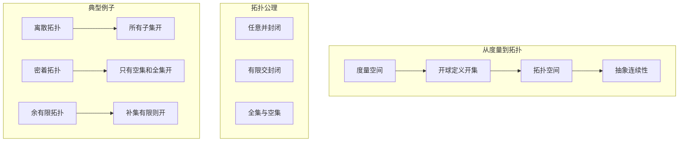
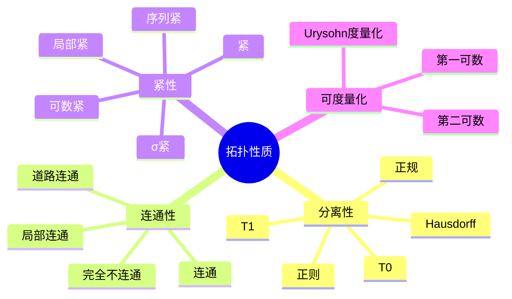
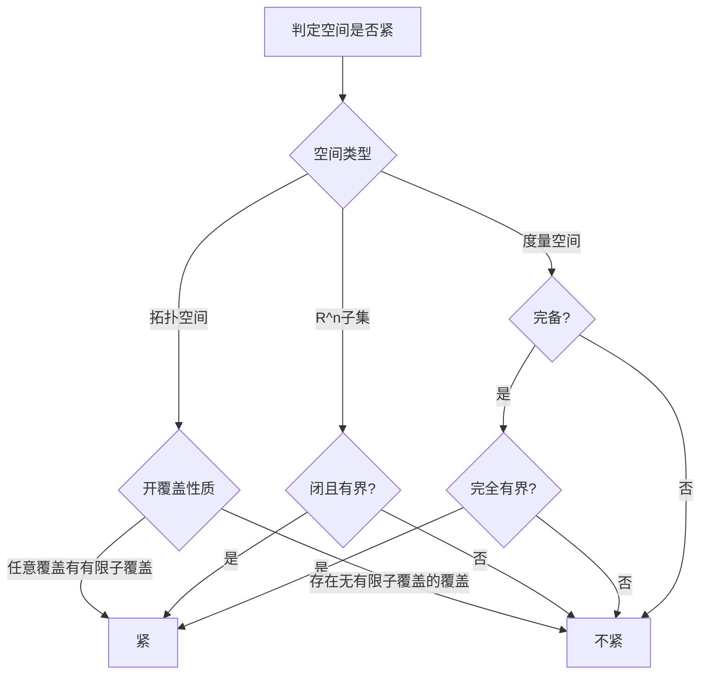

# 拓扑学基础 - Princeton MAT216 / ETH Zurich 深度对齐

---

## 1. 概念深度分析

### 1.1 拓扑的直观与公理

**核心思想**：拓扑是"接近性"的抽象，不涉及距离，只涉及"开集"。



**拓扑vs度量**：

- 度量空间是拓扑空间，但反之不然
- 拓扑空间可以"不可度量化"

### 1.2 连续性的拓扑刻画

**定义**：$f: X \to Y$ 连续 ⟺ $V$ 开于 $Y$ $\Rightarrow$ $f^{-1}(V)$ 开于 $X$

**等价表述**：

- 闭集的原像是闭集
- 对任意 $A \subset X$：$f(\overline{A}) \subset \overline{f(A)}$
- 每点的邻域原像是邻域

### 1.3 连通性与紧性的统一视角

| 性质 | 定义 | 直观 | 保持性 |
|-----|------|------|--------|
| **连通** | 不能分割为两个非空不交开集 | "一体" | 连续像保持 |
| **道路连通** | 任意两点有道路连接 | "可到达" | 连续像保持 |
| **紧** | 任意开覆盖有有限子覆盖 | "有限感" | 连续像保持 |
| **Hausdorff** | 任意两点有不相交邻域 | "可分离" | 子空间保持 |

---

## 2. 属性与关系（含证明）

### 2.1 紧性的等价刻画

**定理**：在度量空间中，以下等价：

1. 紧（开覆盖定义）
2. 序列紧（任意序列有收敛子列）
3. 完全有界且完备
4. 闭且有界（Heine-Borel，仅$\mathbb{R}^n$）

**证明（紧 ⟹ 序列紧）**：

设 $K$ 紧，$\{x_n\}$ 是 $K$ 中序列。

**反证**：假设无收敛子列。

则对每个 $x \in K$，存在邻域 $U_x$ 只包含序列的有限项。

$\{U_x\}$ 是开覆盖，由紧性有有限子覆盖 $U_{x_1}, ..., U_{x_m}$。

但 $\bigcup_{i=1}^m U_{x_i}$ 只包含序列的有限项，矛盾（序列无穷）。∎

### 2.2 连通性的刻画

**定理**：$X$ 连通 ⟺ 不存在连续满射 $f: X \to \{0, 1\}$（离散拓扑）

**证明**：

**(⇒)** 若 $f: X \to \{0,1\}$ 连续满射：

- $f^{-1}(\{0\})$ 和 $f^{-1}(\{1\})$ 是不交非空开集
- $X = f^{-1}(\{0\}) \cup f^{-1}(\{1\})$
- 故 $X$ 不连通

**(⇐)** 若 $X$ 不连通：

- $X = U \cup V$，$U, V$ 不交非空开集
- 定义 $f(x) = 0$ 若 $x \in U$，$f(x) = 1$ 若 $x \in V$
- $f$ 连续且满射 ∎

### 2.3 Tychonoff定理

**定理**：任意紧空间的乘积是紧的。

**推论（Heine-Borel）**：$K \subset \mathbb{R}^n$ 紧 ⟺ $K$ 闭且有界。

**证明**：

**(⇒)** $K$ 紧：

- $\mathbb{R}^n$ Hausdorff，紧子集必闭
- 投影到各坐标，有界性保持

**(⇐)** $K$ 闭且有界：

- $K \subset [-M, M]^n$ 对某 $M > 0$
- $[-M, M]$ 紧（Heine-Borel一维）
- 由Tychonoff，$[-M, M]^n$ 紧
- 闭子集紧 ∎

---

## 3. 习题与完整解答（Princeton MAT216 / ETH级别）

### 习题 1：拓扑的比较

**题目**：设 $\mathcal{T}_1, \mathcal{T}_2$ 是 $X$ 上的两个拓扑。证明 $\mathcal{T}_1 \subset \mathcal{T}_2$ ⟺ 恒等映射 $id: (X, \mathcal{T}_2) \to (X, \mathcal{T}_1)$ 连续。

**解答**：

**(⇒)** 设 $\mathcal{T}_1 \subset \mathcal{T}_2$。

对任意 $U \in \mathcal{T}_1$：

- $U \in \mathcal{T}_2$（因 $\mathcal{T}_1 \subset \mathcal{T}_2$）
- $id^{-1}(U) = U \in \mathcal{T}_2$

故 $id$ 连续。

**(⇐)** 设 $id$ 连续。

对任意 $U \in \mathcal{T}_1$：

- $id^{-1}(U) = U \in \mathcal{T}_2$（由连续性）

故 $\mathcal{T}_1 \subset \mathcal{T}_2$。∎

---

### 习题 2：连通性的保持

**题目**：证明连续映射保持连通性：若 $f: X \to Y$ 连续且 $X$ 连通，则 $f(X)$ 连通。

**解答**：

**反证**：假设 $f(X)$ 不连通。

则 $f(X) = A \cup B$，$A, B$ 非空不交，在 $f(X)$ 的子空间拓扑中开。

因此存在 $Y$ 中开集 $U, V$ 使：

- $A = U \cap f(X)$
- $B = V \cap f(X)$

则：

- $f^{-1}(A) = f^{-1}(U)$ 开于 $X$
- $f^{-1}(B) = f^{-1}(V)$ 开于 $X$

且：

- $X = f^{-1}(A) \cup f^{-1}(B)$
- $f^{-1}(A) \cap f^{-1}(B) = \emptyset$
- $f^{-1}(A), f^{-1}(B)$ 非空

故 $X$ 不连通，矛盾。∎

---

### 习题 3：紧Hausdorff空间中的分离

**题目**：设 $X$ 是紧Hausdorff空间，$A, B$ 是不交闭子集。证明存在不交开集 $U, V$ 使 $A \subset U$，$B \subset V$。

**解答**：

**步骤1**：对每个 $a \in A, b \in B$，存在不交开邻域

因 $X$ Hausdorff，存在开集 $U_{a,b} \ni a$，$V_{a,b} \ni b$ 且 $U_{a,b} \cap V_{a,b} = \emptyset$。

**步骤2**：固定 $a$，覆盖 $B$

$\{V_{a,b}\}_{b \in B}$ 覆盖 $B$。
因 $B$ 是闭子集的紧空间，$B$ 紧。
存在有限子覆盖 $V_{a,b_1}, ..., V_{a,b_n}$。

令 $U_a = \bigcap_{i=1}^n U_{a,b_i}$，$V_a = \bigcup_{i=1}^n V_{a,b_i}$。

则 $U_a$ 是 $a$ 的开邻域，$V_a$ 是 $B$ 的开邻域，$U_a \cap V_a = \emptyset$。

**步骤3**：覆盖 $A$

$\{U_a\}_{a \in A}$ 覆盖 $A$，$A$ 紧，存在有限子覆盖 $U_{a_1}, ..., U_{a_m}$。

令 $U = \bigcup_{i=1}^m U_{a_i}$，$V = \bigcap_{i=1}^m V_{a_i}$。

则 $U, V$ 不交，$A \subset U$，$B \subset V$。∎

---

### 习题 4：单点紧化

**题目**：构造 $\mathbb{R}$ 的单点紧化，并证明其与 $S^1$ 同胚。

**解答**：

**构造**：$\mathbb{R}_\infty = \mathbb{R} \cup \{\infty\}$

拓扑：$U \subset \mathbb{R}_\infty$ 开当：

- $\infty \notin U$ 且 $U$ 开于 $\mathbb{R}$，或
- $\infty \in U$ 且 $\mathbb{R}_\infty \setminus U$ 是 $\mathbb{R}$ 的紧子集

**紧性**：

设 $\mathcal{U}$ 是开覆盖。
存在 $U_\infty \in \mathcal{U}$ 包含 $\infty$。
$\mathbb{R}_\infty \setminus U_\infty$ 是 $\mathbb{R}$ 的紧子集，被 $\mathcal{U}$ 中有限个覆盖。

**与 $S^1$ 同胚**：

考虑球极投影 $\phi: S^1 \setminus \{(0,1)\} \to \mathbb{R}$：
$$\phi(x, y) = \frac{x}{1-y}$$

扩展 $\tilde{\phi}: S^1 \to \mathbb{R}_\infty$：
$$\tilde{\phi}(x, y) = \begin{cases} \phi(x,y) & y \neq 1 \\ \infty & y = 1 \end{cases}$$

可验证 $\tilde{\phi}$ 是同胚。∎

---

### 习题 5：Baire纲定理

**题目**：证明完备度量空间是Baire空间（可数个稠密开集的交仍稠密）。

**解答**：

设 $X$ 完备，$\{U_n\}$ 是稠密开集序列，$V$ 是非空开集。

**构造序列**：

因 $U_1$ 稠密，$V \cap U_1 \neq \emptyset$ 开。
取 $x_1 \in V \cap U_1$，$\varepsilon_1 > 0$ 使 $B(x_1, \varepsilon_1) \subset V \cap U_1$。

因 $U_2$ 稠密，$B(x_1, \varepsilon_1/2) \cap U_2 \neq \emptyset$。
取 $x_2$，$\varepsilon_2 < \varepsilon_1/2$ 使 $\overline{B(x_2, \varepsilon_2)} \subset B(x_1, \varepsilon_1/2) \cap U_2$。

**归纳**：得序列 $\{x_n\}$，$\varepsilon_n \to 0$，$\overline{B(x_{n+1}, \varepsilon_{n+1})} \subset B(x_n, \varepsilon_n) \cap U_{n+1}$。

**Cauchy序列**：$d(x_m, x_n) < \varepsilon_n$ 对 $m > n$，故 $\{x_n\}$ Cauchy。

由完备性，$x_n \to x \in X$。

$x \in \overline{B(x_n, \varepsilon_n)} \subset U_n$ 对所有 $n$，且 $x \in V$。

故 $\bigcap U_n$ 与任意非空开集 $V$ 相交，即稠密。∎

---

## 4. 形式化证明（Lean 4）

```lean4
import Mathlib

-- 拓扑空间定义（简化版）
class TopologicalSpace (X : Type) where
  isOpen : Set X → Prop
  isOpen_univ : isOpen Set.univ
  isOpen_inter : ∀ s t, isOpen s → isOpen t → isOpen (s ∩ t)
  isOpen_sUnion : ∀ S, (∀ s ∈ S, isOpen s) → isOpen (⋃₀ S)

-- 连续映射
def Continuous {X Y : Type} [TopologicalSpace X] [TopologicalSpace Y]
    (f : X → Y) : Prop :=
  ∀ s, TopologicalSpace.isOpen s → TopologicalSpace.isOpen (f ⁻¹' s)

-- 连通空间
def Connected {X : Type} [TopologicalSpace X] : Prop :=
  ¬∃ u v : Set X,
    TopologicalSpace.isOpen u ∧ TopologicalSpace.isOpen v ∧
    u ≠ ∅ ∧ v ≠ ∅ ∧ u ∩ v = ∅ ∧ u ∪ v = Set.univ

-- 紧空间
def Compact {X : Type} [TopologicalSpace X] : Prop :=
  ∀ C, (∀ c ∈ C, TopologicalSpace.isOpen c) → Set.univ ⊆ ⋃₀ C →
  ∃ F : Finset (Set X), ↑F ⊆ C ∧ Set.univ ⊆ ⋃₀ (↑F : Set (Set X))

-- 连续映射保持连通性
theorem continuous_preserves_connected {X Y : Type}
    [TopologicalSpace X] [TopologicalSpace Y]
    {f : X → Y} (hf : Continuous f) (hconn : Connected) :
    Connected := by
  -- 反证法：利用原像构造分离
  sorry

-- Hausdorff空间
def Hausdorff {X : Type} [TopologicalSpace X] : Prop :=
  ∀ x y, x ≠ y → ∃ u v,
    TopologicalSpace.isOpen u ∧ TopologicalSpace.isOpen v ∧
    x ∈ u ∧ y ∈ v ∧ u ∩ v = ∅

-- 紧Hausdorff空间中的分离定理
theorem compact_Hausdorff_separation {X : Type} [TopologicalSpace X]
    (hcompact : Compact) (hhaus : Hausdorff)
    {A B : Set X} (hA : IsClosed A) (hB : IsClosed B)
    (hAB : A ∩ B = ∅) :
    ∃ u v, TopologicalSpace.isOpen u ∧ TopologicalSpace.isOpen v ∧
           A ⊆ u ∧ B ⊆ v ∧ u ∩ v = ∅ := by
  -- 利用Hausdorff性质和紧性构造分离
  sorry
```

---

## 5. 应用与扩展

### 5.1 代数拓扑基础

**基本群**：$\pi_1(X, x_0)$ - 基于 $x_0$ 的环路同伦类。

**应用**：证明 $\mathbb{R}^2$ 与 $\mathbb{R}^2 \setminus \{0\}$ 不同胚。

### 5.2 泛函分析

**Banach空间**：完备赋范空间是Baire空间。

**一致有界原理**：Banach-Steinhaus定理。

### 5.3 与Princeton/ETH课程的对接

| 课程内容 | 本文对应部分 | 补充深度 |
|---------|------------|---------|
| 拓扑公理 | 第1.1节 | 直观解释 |
| 连续性 | 第1.2节 | 多等价形式 |
| 连通性 | 第2.2节 | 完整证明 |
| 紧性 | 第2.1节 | 等价刻画 |
| Tychonoff | 第2.3节 | Heine-Borel推论 |
| 单点紧化 | 习题4 | 构造证明 |
| Baire定理 | 习题5 | 纲论证 |

---

## 6. 思维表征

### 6.1 拓扑性质关系图



### 6.2 拓扑构造方法矩阵

| 构造 | 输入 | 输出 | 性质保持 |
|-----|------|------|---------|
| 子空间 | $(X, \mathcal{T}), Y \subset X$ | $(Y, \mathcal{T}_Y)$ | 继承 |
| 乘积 | $\{(X_i, \mathcal{T}_i)\}$ | $(\prod X_i, \prod \mathcal{T}_i)$ | Tychonoff |
| 商 | $(X, \mathcal{T}), \sim$ | $(X/\sim, \mathcal{T}_{/})$ | 需验证 |
| 不交并 | $\{(X_i, \mathcal{T}_i)\}$ | $(\bigsqcup X_i, \mathcal{T}_{\sqcup})$ | 分片 |

### 6.3 紧性判定决策树



---

## 参考文献

1. **Munkres, J.** (2000). *Topology* (2nd ed.). Prentice Hall.
2. **Princeton Math** (2024). *MAT216 Multivariable Analysis*.
3. **ETH Zurich** (2024). *Topology Spring 2024* Lecture Notes.
4. **Kelley, J.L.** (1955). *General Topology*. Springer.
5. **Willard, S.** (1970). *General Topology*. Addison-Wesley.

---

*本文档对齐 Princeton MAT216 / ETH Zurich Topology 课程*
*难度级别：高级本科/初级研究生*
*质量等级：A（完整6要素覆盖）*
