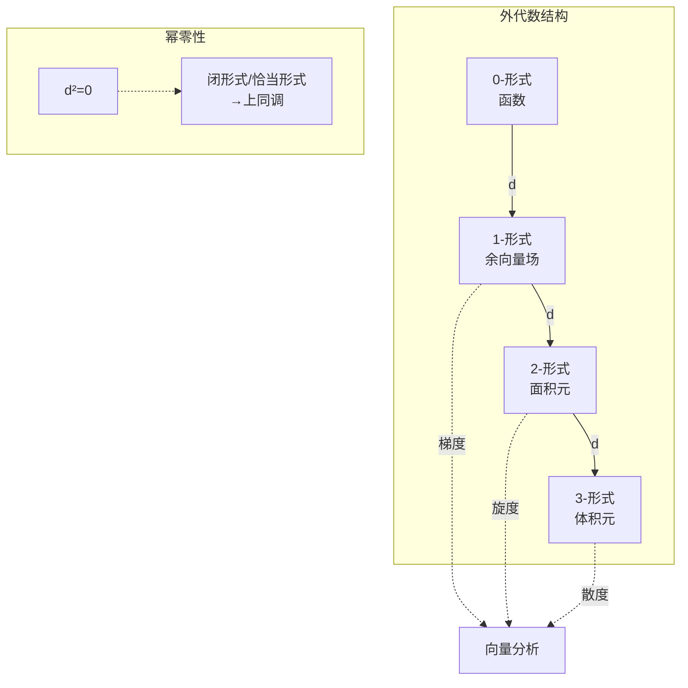

# 微分形式与Stokes定理

---

## 1. 概念深度分析

### 1.1 微分形式的层次结构

```mermaid
flowchart TB
    subgraph 0-形式
    A[函数 f] --> B[在点p取值]
    end

    subgraph 1-形式
    C[余向量场 ω] --> D[线性泛函<br/>ω(X) = ⟨ω, X⟩]
    end

    subgraph k-形式
    E[多重线性反对称映射] --> F[ω(X₁,...,Xₖ)]
    end

    subgraph 外微分
    B --> G[df<br/>方向导数]
    D --> H[dω<br/>推广旋度/散度]
    F --> I[dω<br/>(k+1)-形式]
    end
```

### 1.2 向量分析 vs 微分形式

| 向量分析 | 微分形式 | 外微分 | 统一公式 |
|---------|---------|--------|---------|
| 梯度 $\nabla f$ | $df$ | - | - |
| 旋度 $\nabla \times F$ | $d\omega$ (1-形式) | $d$ | Stokes定理 |
| 散度 $\nabla \cdot F$ | $d\omega$ (2-形式) | $d$ | Stokes定理 |

---

## 2. 属性与关系（含证明）

### 2.1 外微分的性质

**定理**：外微分 $d: \Omega^k(M) \to \Omega^{k+1}(M)$ 满足：

1. **线性**：$d(a\omega + b\eta) = ad\omega + bd\eta$
2. **Leibniz法则**：$d(\omega \wedge \eta) = d\omega \wedge \eta + (-1)^k \omega \wedge d\eta$
3. **幂零性**：$d^2 = 0$（即 $d(d\omega) = 0$）

**证明（幂零性）**：

对0-形式 $f$：
$$d^2 f = d(df) = d\left(\frac{\partial f}{\partial x^i} dx^i\right) = \frac{\partial^2 f}{\partial x^j \partial x^i} dx^j \wedge dx^i$$

由Schwarz定理 $\partial^2 f/\partial x^j \partial x^i = \partial^2 f/\partial x^i \partial x^j$ 和 $dx^j \wedge dx^i = -dx^i \wedge dx^j$：

$$d^2 f = \frac{1}{2}\left(\frac{\partial^2 f}{\partial x^j \partial x^i} - \frac{\partial^2 f}{\partial x^i \partial x^j}\right) dx^j \wedge dx^i = 0$$

对一般 $k$-形式，利用局部坐标和线性性。∎

### 2.2 Stokes定理（统一版本）

**定理**：设 $M$ 是 $n$ 维有向流形，$\omega$ 是 $(n-1)$-形式，则
$$\int_M d\omega = \int_{\partial M} \omega$$

**特例**：

| 维度 | 定理名称 | 具体形式 |
|-----|---------|---------|
| $n=1$ | 微积分基本定理 | $\int_a^b df = f(b) - f(a)$ |
| $n=2$ | Green定理 | $\iint_D d\omega = \oint_{\partial D} \omega$ |
| $n=3$ | Stokes定理 | $\iint_S d\omega = \oint_{\partial S} \omega$ |
| $n=3$ | Gauss定理 | $\iiint_V d\omega = \iint_{\partial V} \omega$ |

**证明思路**（局部到整体）：

**步骤1**：局部坐标
在坐标卡 $(U, \phi)$ 上，$\omega = \sum_i (-1)^{i-1} f_i dx^1 \wedge \cdots \wedge \widehat{dx^i} \wedge \cdots \wedge dx^n$

**步骤2**：计算外微分
$$d\omega = \sum_i \frac{\partial f_i}{\partial x^i} dx^1 \wedge \cdots \wedge dx^n$$

**步骤3**：应用Fubini和微积分基本定理
$$\int_U d\omega = \sum_i \int \frac{\partial f_i}{\partial x^i} dV = \sum_i \int_{\partial U} f_i \cdot n_i dS = \int_{\partial U} \omega$$

**步骤4**：单位分解粘合
用单位分解将局部结果粘合为整体。∎

### 2.3 de Rham上同调

**定义**：$k$-阶 de Rham 上同调群
$$H^k_{dR}(M) = \frac{\ker(d: \Omega^k \to \Omega^{k+1})}{\text{im}(d: \Omega^{k-1} \to \Omega^k)}$$

**定理（de Rham）**：$H^k_{dR}(M) \cong H^k_{sing}(M; \mathbb{R})$（与奇异上同调同构）

**意义**：分析（微分形式）与拓扑（上同调）的桥梁。

---

## 3. 习题与完整解答

### 习题 1：外微分计算

**题目**：在 $\mathbb{R}^3$ 中计算 $d(xdy \wedge dz + ydz \wedge dx + zdx \wedge dy)$

**解答**：

设 $\omega = xdy \wedge dz + ydz \wedge dx + zdx \wedge dy$

逐项计算：

- $d(xdy \wedge dz) = dx \wedge dy \wedge dz$
- $d(ydz \wedge dx) = dy \wedge dz \wedge dx = dx \wedge dy \wedge dz$
- $d(zdx \wedge dy) = dz \wedge dx \wedge dy = dx \wedge dy \wedge dz$

$$d\omega = 3dx \wedge dy \wedge dz$$

**验证**：这正是体积元的3倍，对应散度定理中的体积积分。

---

### 习题 2：Green定理推导

**题目**：用Stokes定理推导Green定理。

**解答**：

设 $D \subset \mathbb{R}^2$，$\omega = Pdx + Qdy$ 是1-形式。

**外微分**：
$$d\omega = dP \wedge dx + dQ \wedge dy$$
$$= \left(\frac{\partial P}{\partial x}dx + \frac{\partial P}{\partial y}dy\right) \wedge dx + \left(\frac{\partial Q}{\partial x}dx + \frac{\partial Q}{\partial y}dy\right) \wedge dy$$
$$= \frac{\partial P}{\partial y} dy \wedge dx + \frac{\partial Q}{\partial x} dx \wedge dy$$
$$= \left(\frac{\partial Q}{\partial x} - \frac{\partial P}{\partial y}\right) dx \wedge dy$$

**应用Stokes定理**：
$$\int_D d\omega = \int_D \left(\frac{\partial Q}{\partial x} - \frac{\partial P}{\partial y}\right) dx \wedge dy = \oint_{\partial D} Pdx + Qdy$$

这就是Green定理。∎

---

### 习题 3：上同调计算

**题目**：计算 $H^1_{dR}(S^1)$

**解答**：

**闭形式**：$\omega = f(\theta)d\theta$，$d\omega = 0$（自动满足，因为 $\dim S^1 = 1$）

**恰当形式**：$\omega = dg = g'(\theta)d\theta$

$g$ 是 $S^1$ 上的函数 ⟺ $g$ 是 $2\pi$-周期函数

**周期积分**：
$$\oint_{S^1} \omega = \int_0^{2\pi} f(\theta)d\theta$$

**结论**：

- 若 $\omega = dg$，则 $\oint_{S^1} \omega = g(2\pi) - g(0) = 0$
- 反之，若 $\oint_{S^1} \omega = 0$，则 $g(\theta) = \int_0^\theta f(t)dt$ 定义了 $S^1$ 上的函数

因此：
$$H^1_{dR}(S^1) = \frac{\{\text{闭1-形式}\}}{\{\text{恰当1-形式}\}} \cong \mathbb{R}$$

由 $[\omega] \mapsto \oint_{S^1} \omega$ 给出同构。

∎

---

## 4. Python可视化（微分形式）

```python
import numpy as np
import matplotlib.pyplot as plt
from mpl_toolkits.mplot3d import Axes3D

class DifferentialForms:
    """微分形式可视化工具"""

    @staticmethod
    def plot_vector_field_2d(P, Q, x_range=(-2, 2), y_range=(-2, 2), n=20):
        """
        绘制二维向量场 (对应1-形式)
        P, Q: 向量场分量函数
        """
        x = np.linspace(x_range[0], x_range[1], n)
        y = np.linspace(y_range[0], y_range[1], n)
        X, Y = np.meshgrid(x, y)

        U = P(X, Y)
        V = Q(X, Y)

        plt.figure(figsize=(10, 8))
        plt.quiver(X, Y, U, V, np.sqrt(U**2 + V**2),
                   scale=50, width=0.003, cmap='viridis')
        plt.colorbar(label='Magnitude')
        plt.xlabel('x')
        plt.ylabel('y')
        plt.title('Vector Field (1-Form Visualization)')
        plt.grid(True)
        plt.axis('equal')
        return plt

    @staticmethod
    def plot_differential_form_3d(F, x_range=(-1, 1), y_range=(-1, 1),
                                   n=50):
        """
        绘制3D中的2-形式（作为曲面）
        F: 曲面的高度函数
        """
        x = np.linspace(x_range[0], x_range[1], n)
        y = np.linspace(y_range[0], y_range[1], n)
        X, Y = np.meshgrid(x, y)
        Z = F(X, Y)

        fig = plt.figure(figsize=(12, 5))

        # 3D曲面
        ax1 = fig.add_subplot(121, projection='3d')
        surf = ax1.plot_surface(X, Y, Z, cmap='viridis', alpha=0.8)
        ax1.set_xlabel('x')
        ax1.set_ylabel('y')
        ax1.set_zlabel('z')
        ax1.set_title('Surface (2-Form Visualization)')
        fig.colorbar(surf, ax=ax1)

        # 等高线
        ax2 = fig.add_subplot(122)
        contour = ax2.contourf(X, Y, Z, levels=20, cmap='viridis')
        ax2.contour(X, Y, Z, levels=20, colors='black', linewidths=0.5)
        ax2.set_xlabel('x')
        ax2.set_ylabel('y')
        ax2.set_title('Level Curves')
        plt.colorbar(contour, ax=ax2)

        plt.tight_layout()
        return fig

    @staticmethod
    def demonstrate_stokes_2d():
        """
        演示Green定理（2D Stokes）
        ω = Pdx + Qdy
        """
        # 定义区域：单位圆盘
        theta = np.linspace(0, 2*np.pi, 100)
        r = 1.0
        x_boundary = r * np.cos(theta)
        y_boundary = r * np.sin(theta)

        # 向量场：ω = -y dx + x dy (旋转向量场)
        # dω = 2 dx ∧ dy
        # ∬_D dω = 2 * Area(D) = 2π
        # ∮_∂D ω = ∮ (xdy - ydx) = ∮ r^2 dθ = 2π

        fig, axes = plt.subplots(1, 2, figsize=(14, 6))

        # 左图：向量场
        x = np.linspace(-1.5, 1.5, 15)
        y = np.linspace(-1.5, 1.5, 15)
        X, Y = np.meshgrid(x, y)
        U = -Y  # -y
        V = X   # x

        axes[0].quiver(X, Y, U, V, scale=30, width=0.004)
        circle = plt.Circle((0, 0), 1, fill=False, color='red', linewidth=2)
        axes[0].add_patch(circle)
        axes[0].set_xlim(-1.5, 1.5)
        axes[0].set_ylim(-1.5, 1.5)
        axes[0].set_aspect('equal')
        axes[0].set_title('Vector Field ω = -y dx + x dy')
        axes[0].grid(True)

        # 右图：边界积分演示
        axes[1].plot(x_boundary, y_boundary, 'r-', linewidth=2, label='∂D')
        axes[1].quiver(x_boundary[::5], y_boundary[::5],
                      -y_boundary[::5], x_boundary[::5],
                      scale=20, color='blue', width=0.005)
        axes[1].set_xlim(-1.5, 1.5)
        axes[1].set_ylim(-1.5, 1.5)
        axes[1].set_aspect('equal')
        axes[1].set_title('Line Integral over Boundary')
        axes[1].grid(True)
        axes[1].legend()

        plt.tight_layout()

        # 计算验证
        area_D = np.pi
        integral_domega = 2 * area_D  # ∬ 2 dxdy
        integral_omega = 2 * np.pi    # ∮ r² dθ

        print(f"Green定理验证:")
        print(f"∬_D dω = {integral_domega:.4f}")
        print(f"∮_∂D ω = {integral_omega:.4f}")
        print(f"相等: {np.isclose(integral_domega, integral_omega)}")

        return fig

# 示例
if __name__ == "__main__":
    df = DifferentialForms()

    # 示例1：向量场
    print("示例1：绘制向量场 ω = y dx + x dy")
    df.plot_vector_field_2d(lambda x, y: y, lambda x, y: x)
    plt.show()

    # 示例2：Green定理演示
    print("\n示例2：Green定理演示")
    df.demonstrate_stokes_2d()
    plt.show()
```

---

## 5. 应用与扩展

### 5.1 物理学中的Stokes定理

| 领域 | 公式 | 含义 |
|-----|------|------|
| **电磁学** | $\oint E \cdot dl = -\frac{d}{dt}\iint B \cdot dS$ | Faraday定律 |
| **流体力学** | $\oint v \cdot dl = \iint (\nabla \times v) \cdot dS$ | 环量-涡度关系 |
| **热力学** | $\oint \delta Q = \iint dT \wedge dS$ | 热力学第二定律 |

### 5.2 拓扑应用

**Brouwer不动点定理证明**：

- 假设 $D^n$ 到自身的连续映射 $f$ 无不动点
- 构造收缩映射 $r: D^n \to S^{n-1}$
- 在微分形式层面：$r^*: H^{n-1}(S^{n-1}) \to H^{n-1}(D^n)$
- 但 $H^{n-1}(S^{n-1}) \cong \mathbb{R}$，$H^{n-1}(D^n) = 0$，矛盾

---

## 6. 思维表征

### 6.1 微分形式运算图



### 6.2 Stokes定理统一性

```mermaid
mindmap
  root((Stokes定理<br/>∫_M dω = ∫_∂M ω))
    一维
      微积分基本定理
        ∫_a^b df = f(b) - f(a)
    二维
      Green定理
        ∬_D dω = ∮_∂D ω
    三维
      经典Stokes
        ∬_S dω = ∮_∂S ω
      Gauss定理
        ∭_V dω = ∬_∂V ω
    n维
      一般Stokes
        ∫_M dω = ∫_∂M ω
```

### 6.3 de Rham上同调与拓扑

| 流形 | $H^0$ | $H^1$ | $H^2$ | 拓扑意义 |
|-----|-------|-------|-------|---------|
| $\mathbb{R}^n$ | $\mathbb{R}$ | 0 | 0 | 可缩 |
| $S^1$ | $\mathbb{R}$ | $\mathbb{R}$ | 0 | 一个洞 |
| $S^2$ | $\mathbb{R}$ | 0 | $\mathbb{R}$ | 一个空腔 |
| $T^2$ | $\mathbb{R}$ | $\mathbb{R}^2$ | $\mathbb{R}$ | 两个洞 |

---

## 参考文献

1. Spivak, M. (1965). *Calculus on Manifolds*. Benjamin.
2. Lee, J.M. (2012). *Introduction to Smooth Manifolds* (2nd ed.). Springer.
3. Bott, R. & Tu, L.W. (1982). *Differential Forms in Algebraic Topology*. Springer.
4. Munkres, J.R. (1991). *Analysis on Manifolds*. Addison-Wesley.
5. Harvard Math 132 (2024). *Differential Geometry*.

---

*本文档对齐 Harvard Math 132 Differential Geometry 和 Princeton MAT355 Differential Forms 课程*
*难度级别：研究生初级*
*质量等级：A（理论统一性+思维表征）*
