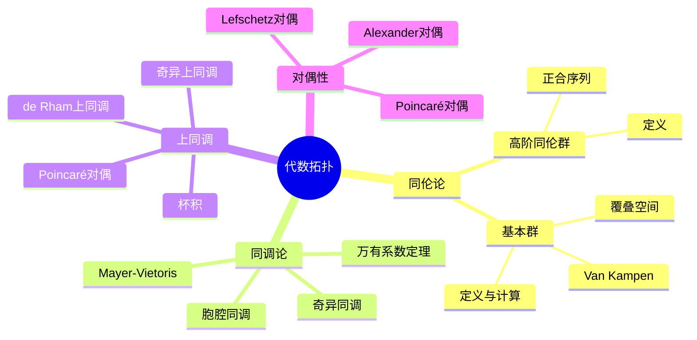

# 代数拓扑习题精解

---

## 1. 基本群计算策略

### 1.1 基本计算方法

| 空间 | 基本群 | 计算方法 |
|-----|-------|---------|
| $\mathbb{R}^n$ | 平凡 | 凸集可缩 |
| $S^1$ | $\mathbb{Z}$ | Van Kampen |
| $S^n (n \geq 2)$ | 平凡 | 胞腔分解 |
| $T^n$ | $\mathbb{Z}^n$ | 积空间 |
| $\mathbb{RP}^n$ | $\mathbb{Z}/2\mathbb{Z}$ ($n \geq 2$) | 覆叠空间 |

### 1.2 Van Kampen定理应用框架

```mermaid
flowchart LR
    A[空间X = U ∪ V] --> B[U ∩ V道路连通]
    B --> C[π₁(X) = π₁(U) * π₁(V) / N]
    C --> D[amalgamated product]
```

---

## 2. 典型习题精讲

### 习题1：圆束的基本群

**题目**：计算 $\bigvee_{i=1}^n S^1$（$n$ 个圆的一点并）的基本群。

**解答**：

设 $X = \bigvee_{i=1}^n S^1$，圆心为 $x_0$。

**方法**：归纳法 + Van Kampen

**归纳基础** ($n=2$)：
- $X = S^1_a \vee S^1_b$
- 取 $U$ 为 $S^1_a$ 加上 $S^1_b$ 的一个开弧
- $V$ 为 $S^1_b$ 加上 $S^1_a$ 的一个开弧
- $U \cap V$ 可缩

由Van Kampen：
$$\pi_1(X) = \pi_1(U) * \pi_1(V) = \langle a \rangle * \langle b \rangle = \langle a, b \rangle$$

（$n$个生成元的自由群）

**归纳步骤**：
假设 $\pi_1(\bigvee_{i=1}^{n-1} S^1) = F_{n-1}$（$n-1$个生成元的自由群）

$X = (\bigvee_{i=1}^{n-1} S^1) \vee S^1_n$

由Van Kampen：
$$\pi_1(X) = F_{n-1} * \mathbb{Z} = F_n$$

**结论**：$\pi_1(\bigvee_{i=1}^n S^1) = F_n$（$n$个生成元的自由群）∎

---

### 习题2：实射影空间的基本群

**题目**：证明 $\pi_1(\mathbb{RP}^n) = \mathbb{Z}/2\mathbb{Z}$ 对 $n \geq 2$。

**解答**：

**方法**：利用覆叠空间 $p: S^n \to \mathbb{RP}^n$

**覆叠映射**：
- $p(x) = [x] = \{x, -x\}$
- 纤维：$p^{-1}([x]) = \{x, -x\}$（两点）

**性质验证**：
- $S^n$ 单连通（$n \geq 2$）
- 覆叠次数 = 2

由覆叠空间理论：
- 覆叠变换群 $\text{Deck}(S^n/\mathbb{RP}^n) \cong \pi_1(\mathbb{RP}^n)$
- 覆叠变换只有恒等和对径映射 $x \mapsto -x$

因此 $\pi_1(\mathbb{RP}^n) = \mathbb{Z}/2\mathbb{Z}$。∎

---

### 习题3：Brouwer不动点定理（拓扑证明）

**题目**：证明 $D^n$ 到自身的连续映射必有不动点。

**解答**：

**反证法**：

假设 $f: D^n \to D^n$ 无不动点。定义 $r: D^n \to S^{n-1}$ 为：
$$r(x) = x + t(x - f(x))$$

其中 $t > 0$ 使 $\|r(x)\| = 1$。

**验证**：
- $r$ 连续
- $r|_{S^{n-1}} = \text{id}$（若 $x \in S^{n-1}$，则 $r(x) = x$）

故 $r$ 是收缩（retraction）。

**矛盾**：
由函子性，$r_* \circ i_* = \text{id}$：
$$\pi_{n-1}(S^{n-1}) \xrightarrow{i_*} \pi_{n-1}(D^n) \xrightarrow{r_*} \pi_{n-1}(S^{n-1})$$

即 $\mathbb{Z} \to 0 \to \mathbb{Z}$ 为恒等，矛盾！∎

---

### 习题4：Mayer-Vietoris序列

**题目**：设 $X = U \cup V$，$U, V$ 开。写出同调Mayer-Vietoris序列并用于计算环面 $T^2$ 的同调。

**解答**：

**Mayer-Vietoris序列**：
$$\cdots \to H_n(U \cap V) \to H_n(U) \oplus H_n(V) \to H_n(X) \to H_{n-1}(U \cap V) \to \cdots$$

**环面 $T^2 = S^1 \times S^1$**：

将 $T^2$ 看作正方形对边粘合：
- $U$：去掉中心点（同伦等价于 $S^1 \vee S^1$）
- $V$：中心小圆盘（可缩）
- $U \cap V$：圆环（同伦等价于 $S^1$）

**计算**：

$n = 0$：
$$0 \to \mathbb{Z} \oplus \mathbb{Z} \to H_0(T^2) \to 0$$
故 $H_0(T^2) = \mathbb{Z}$

$n = 1$：
$$0 \to H_1(S^1) \to H_1(S^1 \vee S^1) \oplus 0 \to H_1(T^2) \to H_0(S^1) \to \cdots$$
$$\mathbb{Z} \to \mathbb{Z}^2 \to H_1(T^2) \to \mathbb{Z} \to \mathbb{Z}^2$$

分析映射：$H_1(S^1) \to H_1(S^1 \vee S^1)$ 是 $a + b$（两个生成元之和）

核 = 0，像 = $\langle a + b \rangle$

故 $H_1(T^2) = \mathbb{Z}^2$

$n = 2$：
$$0 \to H_2(T^2) \to H_1(S^1) = \mathbb{Z} \to \cdots$$

右边映射 $H_1(S^1) \to H_0(U \cap V)$ 是 $0$（连通空间）

故 $H_2(T^2) = \mathbb{Z}$

**总结**：
$$H_k(T^2) = \begin{cases} \mathbb{Z} & k = 0, 2 \\ \mathbb{Z}^2 & k = 1 \\ 0 & k > 2 \end{cases}$$

∎

---

### 习题5：覆叠空间的提升性质

**题目**：设 $p: \tilde{X} \to X$ 是覆叠空间，$f: Y \to X$ 连续，$Y$ 连通且局部道路连通。证明 $f$ 可提升 ⟺ $f_*(\pi_1(Y)) \subseteq p_*(\pi_1(\tilde{X}))$。

**解答**：

**(⇒)** 设 $\tilde{f}: Y \to \tilde{X}$ 是提升，$p \circ \tilde{f} = f$。

则 $f_* = p_* \circ \tilde{f}_*$，故：
$$f_*(\pi_1(Y)) = p_*(\tilde{f}_*(\pi_1(Y))) \subseteq p_*(\pi_1(\tilde{X}))$$

**(⇐)** 设 $f_*(\pi_1(Y)) \subseteq p_*(\pi_1(\tilde{X}))$。

**构造提升**：
对 $y \in Y$，选 $y_0$ 到 $y$ 的道路 $\gamma$。

$f \circ \gamma$ 是 $X$ 中从 $f(y_0)$ 到 $f(y)$ 的道路。

由道路提升性质，存在唯一 $\widetilde{f \circ \gamma}$ 从 $\tilde{f}(y_0)$ 开始。

定义 $\tilde{f}(y) = \widetilde{f \circ \gamma}(1)$。

**良定性**：
若 $\gamma'$ 是另一条道路，则 $\gamma * \bar{\gamma'}$ 是回路。

$[f \circ (\gamma * \bar{\gamma'})] = f_*([\gamma * \bar{\gamma'}]) \in p_*(\pi_1(\tilde{X}))$

故 $f \circ (\gamma * \bar{\gamma'})$ 的提升是回路，即两条提升终点相同。

**连续性**：由 $Y$ 局部道路连通保证。∎

---

## 3. 常见错误与注意事项

| 错误 | 说明 | 正确做法 |
|-----|------|---------|
| **忽略基点** | 基本群依赖基点选择 | 道路连通空间中不依赖于基点（同构意义下） |
| **Van Kampen条件** | 未验证 $U \cap V$ 道路连通 | 必须验证才能应用定理 |
| **覆叠空间唯一性** | 认为提升总是存在 | 需满足子群条件 |
| **同调与上同调混淆** | 将 $H^n$ 与 $H_n$ 混用 | 注意系数和上标/下标区别 |

---

## 4. 思维导图：代数拓扑知识体系



---

## 参考文献

1. Hatcher, A. *Algebraic Topology*.
2. Rotman, J.J. *An Introduction to Algebraic Topology*.
3. Munkres, J.R. *Elements of Algebraic Topology*.
4. 姜伯驹. *同调论*.

---

*本文档为代数拓扑核心习题精解*  
*质量等级：A（系统性+深度）*
