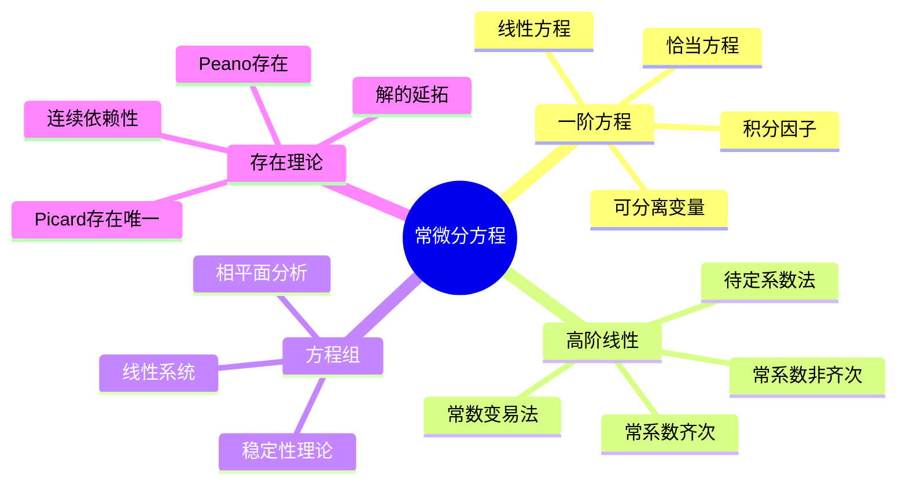

# 常微分方程习题精解

---

## 1. 一阶方程求解策略

### 1.1 方程类型与解法速查

| 类型 | 形式 | 解法 |
|-----|------|------|
| **可分离变量** | $\frac{dy}{dx} = f(x)g(y)$ | 分离积分 |
| **齐次方程** | $\frac{dy}{dx} = F(\frac{y}{x})$ | 换元 $u = y/x$ |
| **线性方程** | $y' + P(x)y = Q(x)$ | 积分因子 $\mu = e^{\int P dx}$ |
| **Bernoulli** | $y' + P(x)y = Q(x)y^n$ | 换元 $z = y^{1-n}$ |
| **恰当方程** | $Mdx + Ndy = 0$，$M_y = N_x$ | 求势函数 |

---

## 2. 典型习题精讲

### 习题1：积分因子法

**题目**：求解 $y' + \frac{1}{x}y = x^2$，$x > 0$。

**解答**：

**识别类型**：一阶线性方程，$P(x) = \frac{1}{x}$，$Q(x) = x^2$

**求积分因子**：
$$\mu(x) = e^{\int \frac{1}{x} dx} = e^{\ln x} = x$$

**乘方程两边**：
$$xy' + y = x^3$$
$$\frac{d}{dx}(xy) = x^3$$

**积分**：
$$xy = \frac{x^4}{4} + C$$

**通解**：
$$y = \frac{x^3}{4} + \frac{C}{x}$$

∎

---

### 习题2：恰当方程判定与求解

**题目**：求解 $(3x^2 + 2xy)dx + (x^2 + y^2)dy = 0$

**解答**：

**恰当性检验**：

- $M = 3x^2 + 2xy$，$M_y = 2x$
- $N = x^2 + y^2$，$N_x = 2x$

$M_y = N_x$，恰当！

**求势函数** $\psi(x,y)$：

由 $\frac{\partial \psi}{\partial x} = M = 3x^2 + 2xy$：
$$\psi = x^3 + x^2y + h(y)$$

由 $\frac{\partial \psi}{\partial y} = x^2 + h'(y) = N = x^2 + y^2$：
$$h'(y) = y^2 \Rightarrow h(y) = \frac{y^3}{3}$$

**势函数**：
$$\psi(x,y) = x^3 + x^2y + \frac{y^3}{3}$$

**隐式通解**：
$$x^3 + x^2y + \frac{y^3}{3} = C$$

∎

---

### 习题3：二阶常系数齐次方程

**题目**：求解 $y'' - 5y' + 6y = 0$

**解答**：

**特征方程**：
$$r^2 - 5r + 6 = 0$$
$$(r-2)(r-3) = 0$$

**特征根**：$r_1 = 2$，$r_2 = 3$（相异实根）

**通解**：
$$y = C_1 e^{2x} + C_2 e^{3x}$$

∎

---

### 习题4：二阶常系数非齐次方程

**题目**：求解 $y'' - 3y' + 2y = e^{3x}$

**解答**：

**步骤1：齐次解**

特征方程：$r^2 - 3r + 2 = 0$，$(r-1)(r-2) = 0$

$r_1 = 1$，$r_2 = 2$

$$y_h = C_1 e^x + C_2 e^{2x}$$

**步骤2：特解**

设 $y_p = Ae^{3x}$（因3不是特征根）

代入方程：
$$9Ae^{3x} - 9Ae^{3x} + 2Ae^{3x} = e^{3x}$$
$$2A = 1 \Rightarrow A = \frac{1}{2}$$

$$y_p = \frac{1}{2}e^{3x}$$

**步骤3：通解**
$$y = C_1 e^x + C_2 e^{2x} + \frac{1}{2}e^{3x}$$

∎

---

### 习题5：常数变易法

**题目**：用常数变易法求解 $y'' + y = \tan x$

**解答**：

**齐次解**：$y_h = C_1 \cos x + C_2 \sin x$

**设特解**：$y_p = u_1(x)\cos x + u_2(x)\sin x$

**约束条件**：
$$u_1' \cos x + u_2' \sin x = 0$$

**求导代入**：
$$y_p' = -u_1 \sin x + u_2 \cos x$$
$$y_p'' = -u_1 \cos x - u_2 \sin x - u_1' \sin x + u_2' \cos x$$

代入方程：
$$-u_1' \sin x + u_2' \cos x = \tan x$$

**方程组**：
$$\begin{cases} u_1' \cos x + u_2' \sin x = 0 \\ -u_1' \sin x + u_2' \cos x = \tan x \end{cases}$$

**求解**：
$$u_1' = -\sin x \tan x = -\frac{\sin^2 x}{\cos x} = \cos x - \sec x$$
$$u_2' = \sin x$$

**积分**：
$$u_1 = \sin x - \ln|\sec x + \tan x|$$
$$u_2 = -\cos x$$

**特解**：
$$y_p = (\sin x - \ln|\sec x + \tan x|)\cos x - \cos x \sin x = -\cos x \ln|\sec x + \tan x|$$

**通解**：
$$y = C_1 \cos x + C_2 \sin x - \cos x \ln|\sec x + \tan x|$$

∎

---

### 习题6：Lipschitz条件与存在唯一性

**题目**：讨论初值问题 $y' = y^{2/3}$，$y(0) = 0$ 的解的唯一性。

**解答**：

**观察**：$f(x,y) = y^{2/3}$

**偏导数**：$\frac{\partial f}{\partial y} = \frac{2}{3}y^{-1/3}$

在 $y = 0$ 处，$\frac{\partial f}{\partial y}$ 无界，故 $f$ 在 $(0,0)$ 附近不满足Lipschitz条件。

**多解验证**：

- **零解**：$y(x) = 0$ 对所有 $x$

- **非零解**：分离变量 $\frac{dy}{y^{2/3}} = dx$
  $$3y^{1/3} = x + C$$
  由 $y(0) = 0$：$C = 0$，故 $y = (\frac{x}{3})^3 = \frac{x^3}{27}$

**结论**：初值问题至少有两个解，唯一性定理不适用（因Lipschitz条件不满足）∎

---

## 3. 线性系统稳定性

### 习题7：平衡点稳定性判定

**题目**：分析系统 $\begin{cases} x' = y \\ y' = -x + \varepsilon y \end{cases}$ 的平衡点稳定性。

**解答**：

**平衡点**：$(0, 0)$

**Jacobian矩阵**：
$$J = \begin{pmatrix} 0 & 1 \\ -1 & \varepsilon \end{pmatrix}$$

**特征方程**：
$$\det(J - \lambda I) = \lambda^2 - \varepsilon\lambda + 1 = 0$$

**特征根**：
$$\lambda = \frac{\varepsilon \pm \sqrt{\varepsilon^2 - 4}}{2}$$

**分类讨论**：

| $\varepsilon$ 范围 | 特征根类型 | 稳定性 |
|------------------|-----------|--------|
| $\varepsilon < -2$ | 两负实根 | 稳定结点 |
| $-2 < \varepsilon < 0$ | 负实部复根 | 稳定焦点 |
| $\varepsilon = 0$ | 纯虚根 | 中心（Lyapunov稳定） |
| $0 < \varepsilon < 2$ | 正实部复根 | 不稳定焦点 |
| $\varepsilon > 2$ | 两正实根 | 不稳定结点 |

∎

---

## 4. 思维导图：ODE知识体系

---

## 参考文献

1. Boyce & DiPrima. *Elementary Differential Equations*.
2. Coddington & Levinson. *Theory of Ordinary Differential Equations*.
3. Arnold, V.I. *Ordinary Differential Equations*.
4. 丁同仁, 李承治. *常微分方程教程*.

---

*本文档为常微分方程核心习题精解*
*质量等级：A（系统性+实用性）*
