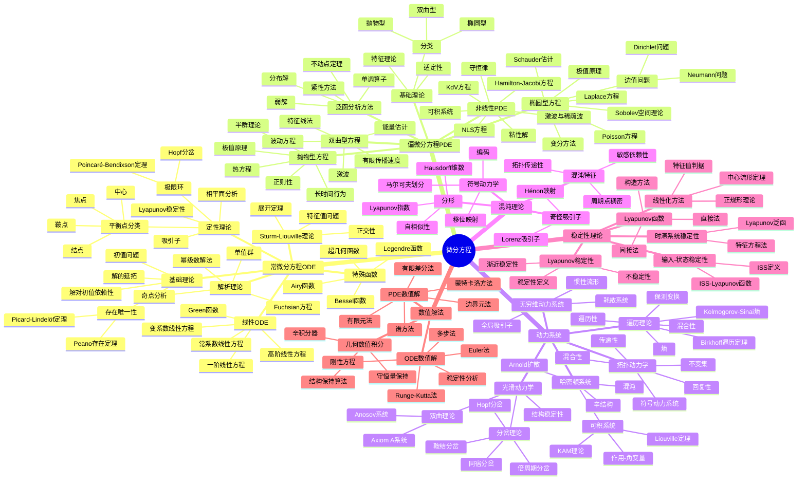
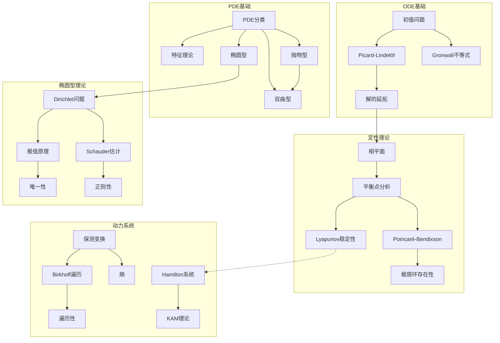
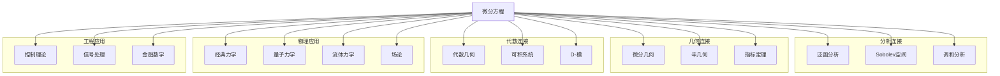
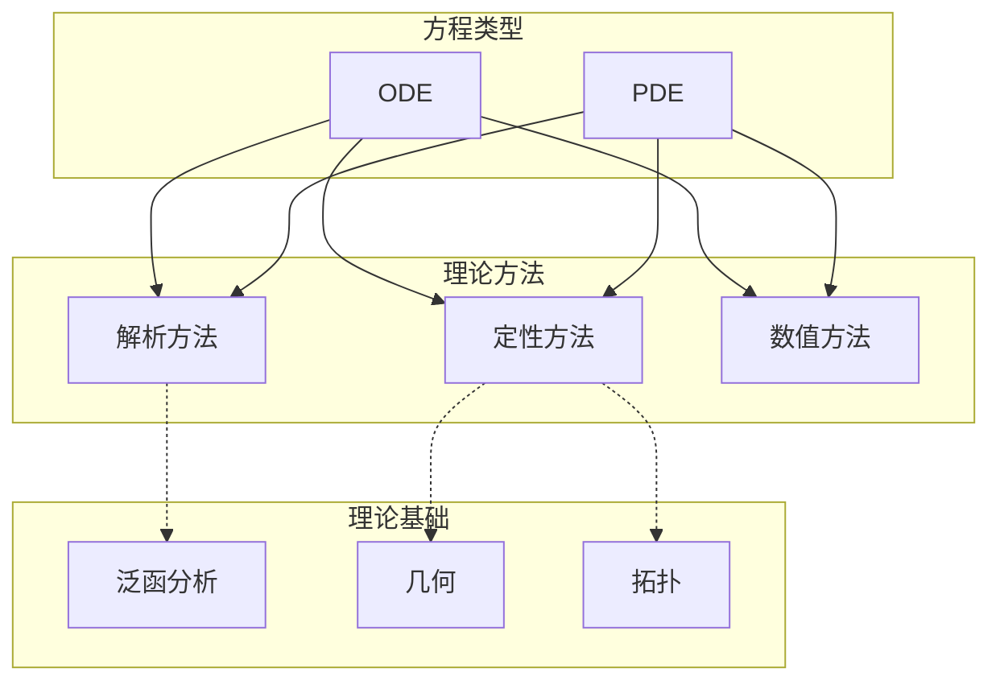

# 微分方程思维导图

> 微分方程研究变化率的数学描述，从常微分方程到偏微分方程，再到动力系统理论，是连接数学与应用的核心桥梁。

---

## 🧠 核心概念层级关系



---

## 🔗 定理依赖关系图



---

## 📍 重要示例分布

### ODE经典示例

| 示例 | 概念 | 重要性 | 位置 |
|-----|------|-------|------|
| y'=y | 指数增长 | ⭐⭐⭐⭐ | 一阶方程 |
| y'=-y | 指数衰减 | ⭐⭐⭐⭐ | 一阶方程 |
| y'=y² | 爆破解 | ⭐⭐⭐⭐ | 非线性ODE |
| 简谐振子 | 周期解 | ⭐⭐⭐⭐⭐ | 二阶线性 |
| 阻尼振子 | 稳定性 | ⭐⭐⭐⭐⭐ | 定性理论 |
| van der Pol方程 | 极限环 | ⭐⭐⭐⭐⭐ | 非线性振动 |
| Lorenz方程 | 混沌 | ⭐⭐⭐⭐⭐ | 三维ODE |

### PDE经典示例

| 示例 | 概念 | 重要性 | 位置 |
|-----|------|-------|------|
| Laplace方程 | 椭圆型原型 | ⭐⭐⭐⭐⭐ | 椭圆型PDE |
| 热方程 | 抛物型原型 | ⭐⭐⭐⭐⭐ | 抛物型PDE |
| 波动方程 | 双曲型原型 | ⭐⭐⭐⭐⭐ | 双曲型PDE |
| Burgers方程 | 激波 | ⭐⭐⭐⭐⭐ | 守恒律 |
| KdV方程 | 孤子 | ⭐⭐⭐⭐⭐ | 可积系统 |
| Schrödinger方程 | 量子力学 | ⭐⭐⭐⭐⭐ | 应用PDE |

### 动力系统示例

| 示例 | 概念 | 重要性 | 位置 |
|-----|------|-------|------|
| 圆周旋转 | 遍历性 | ⭐⭐⭐⭐⭐ | 遍历理论 |
| 帐篷映射 | 混沌 | ⭐⭐⭐⭐⭐ | 一维动力学 |
| Logistic映射 | 倍周期分岔 | ⭐⭐⭐⭐⭐ | 分岔理论 |
| Hénon映射 | 奇怪吸引子 | ⭐⭐⭐⭐⭐ | 二维动力学 |
| 标准映射 | KAM理论 | ⭐⭐⭐⭐ | Hamilton系统 |

---

## 🔄 与其他分支的连接点



**具体连接说明：**

| 分支 | 连接概念 | 连接深度 |
|-----|---------|---------|
| 泛函分析 | Sobolev空间、算子理论 | ⭐⭐⭐⭐⭐ |
| 微分几何 | 流形上的ODE、测地线 | ⭐⭐⭐⭐⭐ |
| 辛几何 | Hamilton系统 | ⭐⭐⭐⭐⭐ |
| 代数几何 | 可积系统、D-模 | ⭐⭐⭐⭐ |
| 概率论 | 随机微分方程 | ⭐⭐⭐⭐⭐ |
| 物理 | 场方程、运动方程 | ⭐⭐⭐⭐⭐ |
| 控制论 | 稳定性、最优控制 | ⭐⭐⭐⭐⭐ |
| 数值分析 | 数值解法、科学计算 | ⭐⭐⭐⭐⭐ |

---

## 📊 学习难度梯度标记

```mermaid
graph LR
    subgraph 基础ODE ⭐⭐⭐
        A1[一阶ODE]
        A2[线性ODE]
        A3[定性理论入门]
    end

    subgraph 高级ODE ⭐⭐⭐⭐
        B1[稳定性理论]
        B2[摄动方法]
        B3[动力系统入门]
    end

    subgraph PDE基础 ⭐⭐⭐⭐
        C1[波动方程]
        C2[热方程]
        C3[Laplace方程]
    end

    subgraph PDE进阶 ⭐⭐⭐⭐⭐
        D1[椭圆型理论]
        D2[双曲型守恒律]
        D3[非线性PDE]
    end

    subgraph 动力系统深入 ⭐⭐⭐⭐⭐⭐
        E1[遍历理论]
        E2[双曲理论]
        E3[KAM理论]
    end
```

### 详细难度分级

| 主题 | 入门 | 基础 | 进阶 | 高级 | 专家 |
|-----|------|------|------|------|------|
| 常微分方程 | 可分离方程 | 线性理论 | 稳定性 | 分岔理论 | 混沌理论 |
| 偏微分方程 | 经典解 | 弱解 | Sobolev空间 | 非线性方法 | 几何PDE |
| 动力系统 | 相平面 | 稳定性 | 遍历理论 | 双曲理论 | 哈密顿动力学 |
| 数值方法 | Euler法 | RK方法 | 有限元 | 谱方法 | 高阶格式 |

---

## 🎯 学习路径推荐

### 经典ODE路径

```
初值问题 → 线性ODE → 定性理论 → 稳定性 → 分岔 → 混沌
```

### PDE分析路径

```
经典PDE → Sobolev空间 → 弱解 → 椭圆理论 → 抛物/双曲理论 → 非线性PDE
```

### 动力系统路径

```
ODE定性理论 → 拓扑动力学 → 遍历理论 → 光滑动力学 → KAM理论
```

### 应用数学路径

```
ODE/PDE基础 → 数值方法 → 科学计算 → 具体应用
```

---

## 📚 核心定理清单

### ODE核心定理

1. **Picard-Lindelöf定理**：Lipschitz条件下初值问题解的存在唯一性
2. **Peano存在定理**：连续条件下解的存在性
3. **Gronwall不等式**：解的估计与唯一性
4. **Poincaré-Bendixson定理**：二维系统极限环存在性
5. **Lyapunov稳定性定理**：稳定性判据

### PDE核心定理

1. **极值原理**：椭圆/抛物型方程解的最大值在边界取到
2. **能量估计**：双曲型方程解的先验估计
3. **Lax-Milgram定理**：椭圆型方程弱解存在性
4. **Sobolev嵌入定理**：Sobolev空间的嵌入关系
5. **Hölder正则性**：椭圆型方程解的正则性

### 动力系统核心定理

1. **Birkhoff遍历定理**：遍历平均的存在性
2. **Poincaré回复定理**：保测系统的回复性
3. **KAM定理**：近可积哈密顿系统的稳定性
4. **结构稳定性定理**：双曲系统的结构稳定性
5. **Smale马蹄定理**：混沌的存在性

---

## 🔍 概念关系图谱



---

> 💡 **学习建议**：微分方程是数学与物理、工程最紧密联系的领域之一。建议学习者重视具体例子和物理背景，理解方程背后的"故事"。同时，现代PDE理论需要扎实的泛函分析基础，而动力系统则需要几何直觉。数值模拟是理解微分方程行为的有力工具，建议结合理论学习与数值实验。
