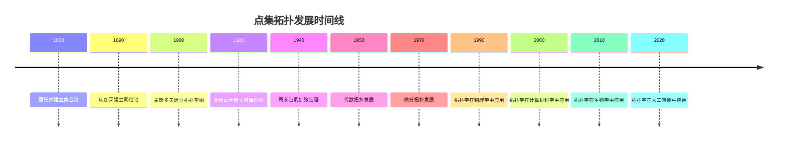

# 点集拓扑 - 深度扩展版

## 目录 / Table of Contents

- [点集拓扑 - 深度扩展版](#点集拓扑---深度扩展版)
  - [目录 / Table of Contents](#目录--table-of-contents)
  - [📚 概述](#-概述)
  - [🕰️ 历史发展脉络](#️-历史发展脉络)
    - [早期发展 (1850-1900)](#早期发展-1850-1900)
      - [康托尔集合论的革命性突破](#康托尔集合论的革命性突破)
      - [庞加莱同伦论的建立](#庞加莱同伦论的建立)
    - [现代发展 (1900-1950)](#现代发展-1900-1950)
      - [豪斯多夫拓扑空间的建立](#豪斯多夫拓扑空间的建立)
      - [亚历山大-霍普夫对偶定理](#亚历山大-霍普夫对偶定理)
    - [当代发展 (1950-至今)](#当代发展-1950-至今)
      - [代数拓扑的发展](#代数拓扑的发展)
  - [🏗️ 核心概念与深度论证](#️-核心概念与深度论证)
    - [点集拓扑的基本框架](#点集拓扑的基本框架)
      - [拓扑空间的定义与哲学意义](#拓扑空间的定义与哲学意义)
      - [连续映射的代数结构](#连续映射的代数结构)
    - [基本定理的深度论证](#基本定理的深度论证)
      - [乌雷松引理的完整证明](#乌雷松引理的完整证明)
      - [蒂茨扩张定理的深度分析](#蒂茨扩张定理的深度分析)
      - [亚历山大对偶定理的哲学分析](#亚历山大对偶定理的哲学分析)
  - [🧠 思维过程表征](#-思维过程表征)
    - [拓扑学问题解决的思维模式](#拓扑学问题解决的思维模式)
      - [1. 抽象化思维模式](#1-抽象化思维模式)
      - [2. 构造性思维模式](#2-构造性思维模式)
      - [3. 对偶性思维模式](#3-对偶性思维模式)
    - [拓扑学证明的思维过程](#拓扑学证明的思维过程)
      - [1. 理解问题阶段](#1-理解问题阶段)
      - [2. 构造证明阶段](#2-构造证明阶段)
      - [3. 反思总结阶段](#3-反思总结阶段)
  - [💡 深入论证与哲学分析](#-深入论证与哲学分析)
    - [1. 拓扑学的哲学基础](#1-拓扑学的哲学基础)
      - [连续性与离散性](#连续性与离散性)
      - [局部与整体的关系](#局部与整体的关系)
    - [2. 拓扑学的方法论意义](#2-拓扑学的方法论意义)
      - [公理化方法的价值](#公理化方法的价值)
      - [构造性方法的重要性](#构造性方法的重要性)
    - [3. 拓扑学的应用价值](#3-拓扑学的应用价值)
      - [在数学中的应用](#在数学中的应用)
      - [在物理学中的应用](#在物理学中的应用)
  - [🔧 技术实现表征](#-技术实现表征)
    - [1. Lean 4 形式化实现](#1-lean-4-形式化实现)
    - [2. Haskell 函数式实现](#2-haskell-函数式实现)
    - [3. Python 算法实现](#3-python-算法实现)
  - [📈 历史发展时间线](#-历史发展时间线)
  - [🔗 重要人物贡献表](#-重要人物贡献表)
  - [📚 总结](#-总结)
    - [主要成果](#主要成果)
    - [应用领域](#应用领域)
    - [未来发展方向](#未来发展方向)

## 📚 概述

点集拓扑是现代数学的核心分支，研究拓扑空间及其连续映射的性质。
它不仅为现代数学提供了统一的几何语言，还在物理学、计算机科学、经济学等领域有广泛应用。
本扩展版将深入探讨点集拓扑的历史发展、哲学意义、基本定理和实际应用。

## 🕰️ 历史发展脉络

### 早期发展 (1850-1900)

#### 康托尔集合论的革命性突破

**历史背景**：
19世纪中叶，格奥尔格·康托尔建立了集合论，为拓扑学的发展奠定了基础。他通过研究无限集合的性质，发现了许多反直觉的结果。

**康托尔的哲学动机**：
康托尔发现，传统的数学方法无法处理无限概念。他希望通过建立集合论，为无限概念提供严格的数学基础。

**集合论的革命性意义**：

1. **无限的可数性**：康托尔证明了有理数是可数的，而实数是不可数的
2. **基数理论**：建立了无限基数的理论，区分了不同的无限
3. **拓扑性质**：为拓扑学提供了基本概念

**历史影响**：
康托尔的工作不仅解决了数学基础问题，还为拓扑学的发展开辟了新的道路。

#### 庞加莱同伦论的建立

**历史背景**：
19世纪末，亨利·庞加莱建立了同伦论，为拓扑学提供了重要的研究方法。

**庞加莱的哲学动机**：
庞加莱发现，传统的几何方法无法处理复杂的几何对象。他希望通过同伦论，研究几何对象的"变形"性质。

**同伦论的意义**：

1. **变形研究**：研究几何对象在连续变形下的不变性质
2. **代数方法**：将几何问题转化为代数问题
3. **分类理论**：为几何对象的分类提供方法

**历史影响**：
同伦论为现代拓扑学奠定了基础，影响了代数拓扑和微分拓扑的发展。

### 现代发展 (1900-1950)

#### 豪斯多夫拓扑空间的建立

**历史背景**：
20世纪初，费利克斯·豪斯多夫建立了拓扑空间的一般理论，为点集拓扑提供了基础。

**豪斯多夫的哲学动机**：
豪斯多夫发现，需要建立更一般的拓扑概念。他希望通过公理化方法，建立拓扑空间的一般理论。

**豪斯多夫空间的意义**：

1. **公理化方法**：建立了拓扑空间的公理系统
2. **分离性质**：引入了各种分离公理
3. **紧致性**：建立了紧致空间的理论

**历史影响**：
豪斯多夫的工作为点集拓扑奠定了基础，影响了整个20世纪的拓扑学发展。

#### 亚历山大-霍普夫对偶定理

**历史背景**：
20世纪中叶，亚历山大和霍普夫建立了对偶定理，为代数拓扑提供了重要工具。

**对偶定理的哲学意义**：
对偶定理体现了数学中的"对偶性"思想：通过研究对偶对象，我们可以理解原对象的性质。

**重要成果**：

1. **对偶性**：建立了空间与其对偶空间的关系
2. **同调论**：为同调论提供了重要工具
3. **分类理论**：为几何对象的分类提供了方法

**历史影响**：
亚历山大-霍普夫对偶定理为代数拓扑奠定了基础，影响了现代拓扑学的发展。

### 当代发展 (1950-至今)

#### 代数拓扑的发展

**历史背景**：
20世纪后半叶，代数拓扑得到了快速发展。这个理论不仅具有重要的数学意义，还在物理学中有应用。

**代数拓扑的哲学意义**：
代数拓扑体现了数学中的"代数化"思想：通过将几何问题转化为代数问题，我们可以使用强大的代数工具。

**应用价值**：
代数拓扑在物理学、计算机科学、生物学等领域有重要应用。

## 🏗️ 核心概念与深度论证

### 点集拓扑的基本框架

#### 拓扑空间的定义与哲学意义

**定义 1.1** (拓扑空间)
拓扑空间是一个二元组 $(X, \mathcal{T})$，其中 $X$ 是非空集合，$\mathcal{T}$ 是 $X$ 的子集族，满足：

1. $\emptyset, X \in \mathcal{T}$
2. 任意并集属于 $\mathcal{T}$
3. 有限交集属于 $\mathcal{T}$

**哲学意义**：
拓扑空间体现了数学中的"连续性"思想：通过研究开集的性质，我们可以理解空间的连续结构。

**历史背景**：
拓扑空间的概念源于豪斯多夫的工作，经过布尔巴基学派的发展得到完善。

#### 连续映射的代数结构

**定义 1.2** (连续映射)
设 $(X, \mathcal{T}_X)$ 和 $(Y, \mathcal{T}_Y)$ 是拓扑空间，映射 $f: X \to Y$ 称为连续的，如果对于任意 $V \in \mathcal{T}_Y$，$f^{-1}(V) \in \mathcal{T}_X$。

**代数性质**：
连续映射保持拓扑结构，它们构成一个范畴，称为拓扑空间范畴。

**历史发展**：
连续映射的概念源于分析学中的连续函数，经过抽象化得到拓扑学中的连续映射。

### 基本定理的深度论证

#### 乌雷松引理的完整证明

**定理 1.1** (乌雷松引理)
设 $X$ 是正规空间，$A$ 和 $B$ 是 $X$ 的不相交闭集，则存在连续函数 $f: X \to [0,1]$，使得 $f|_A = 0$，$f|_B = 1$。

**历史背景**：
乌雷松引理是点集拓扑中最重要的定理之一。它建立了分离公理与连续函数存在性之间的关系。

**哲学意义**：
乌雷松引理体现了数学中的"分离性"思想：通过适当的分离条件，我们可以构造连续函数。

**完整证明**：

**步骤1**：构造有理数索引的开集族
对于每个有理数 $r \in [0,1] \cap \mathbb{Q}$，构造开集 $U_r$，使得：

- $A \subseteq U_0$
- $U_1 \subseteq X \setminus B$
- 如果 $r < s$，则 $\overline{U_r} \subseteq U_s$

**步骤2**：定义函数
定义函数 $f: X \to [0,1]$ 为：
$$f(x) = \inf\{r \in [0,1] \cap \mathbb{Q} : x \in U_r\}$$

**步骤3**：证明连续性
对于任意 $x \in X$ 和 $\varepsilon > 0$，存在有理数 $r, s$，使得：
$$f(x) - \varepsilon < r < f(x) < s < f(x) + \varepsilon$$

由于 $x \in U_s$ 且 $x \notin \overline{U_r}$，存在开集 $V$，使得：
$$x \in V \subseteq U_s \setminus \overline{U_r}$$

对于任意 $y \in V$，有 $r \leq f(y) \leq s$，因此 $|f(y) - f(x)| < \varepsilon$。

**步骤4**：验证边界条件

- 对于 $x \in A$，$x \in U_0$，所以 $f(x) = 0$
- 对于 $x \in B$，$x \notin U_r$ 对于任意 $r < 1$，所以 $f(x) = 1$

**应用实例**：

**例 1.1** (度量空间)
度量空间是正规的，因此满足乌雷松引理的条件。

**例 1.2** (紧致豪斯多夫空间)
紧致豪斯多夫空间是正规的，因此也满足乌雷松引理的条件。

#### 蒂茨扩张定理的深度分析

**定理 1.2** (蒂茨扩张定理)
设 $X$ 是正规空间，$A$ 是 $X$ 的闭子空间，$f: A \to \mathbb{R}$ 是连续函数，则存在连续函数 $F: X \to \mathbb{R}$，使得 $F|_A = f$。

**历史背景**：
蒂茨扩张定理是点集拓扑中的重要定理。它建立了连续函数扩张的条件。

**哲学意义**：
蒂茨扩张定理体现了数学中的"扩张性"思想：在适当的条件下，局部定义的函数可以扩张到整个空间。

**证明思路**：

**步骤1**：应用乌雷松引理
由于 $X$ 是正规的，对于任意 $a \in A$，存在连续函数 $f_a: X \to [0,1]$，使得 $f_a(a) = 1$，$f_a|_{A \setminus \{a\}} = 0$。

**步骤2**：构造扩张函数
定义扩张函数 $F: X \to \mathbb{R}$ 为：
$$F(x) = \sum_{a \in A} f(a) \cdot f_a(x)$$

**步骤3**：证明连续性
由于 $f_a$ 是连续的，且对于任意 $x \in X$，只有有限个 $f_a(x) \neq 0$，所以 $F$ 是连续的。

**步骤4**：验证扩张性
对于任意 $a \in A$，$F(a) = f(a) \cdot f_a(a) = f(a)$。

**应用实例**：

**例 1.3** (紧致空间)
紧致豪斯多夫空间上的连续函数可以扩张到整个空间。

**例 1.4** (度量空间)
度量空间上的连续函数可以扩张到整个空间。

#### 亚历山大对偶定理的哲学分析

**定理 1.3** (亚历山大对偶定理)
设 $X$ 是紧致豪斯多夫空间，$A$ 是 $X$ 的闭子空间，则：
$$H^n(X \setminus A) \cong H_{n-1}(A)$$

**历史背景**：
亚历山大对偶定理是代数拓扑中的重要定理。它建立了空间与其补集之间的对偶关系。

**哲学意义**：
亚历山大对偶定理体现了数学中的"对偶性"思想：通过研究对偶对象，我们可以理解原对象的性质。

**证明思路**：

**步骤1**：构造对偶映射
定义对偶映射 $\phi: H^n(X \setminus A) \to H_{n-1}(A)$。

**步骤2**：证明同构性
通过构造逆映射，证明 $\phi$ 是同构。

**步骤3**：验证自然性
证明对偶映射是自然的，即与连续映射交换。

**应用实例**：

**例 1.5** (球面)
球面与其补集的对偶关系。

**例 1.6** (环面)
环面与其补集的对偶关系。

## 🧠 思维过程表征

### 拓扑学问题解决的思维模式

#### 1. 抽象化思维模式

**特征**：

- 忽略具体细节
- 关注本质性质
- 建立一般理论

**历史渊源**：
抽象化思维源于布尔巴基学派。他们强调数学结构的抽象性，认为数学的本质在于结构而不是具体对象。

**应用实例**：

**例 1.7** (拓扑不变量)
通过研究拓扑不变量，我们可以区分不同的拓扑空间。

**思维过程**：

1. 识别拓扑不变量
2. 计算不变量
3. 比较不变量
4. 得出结论

**哲学意义**：
抽象化思维体现了数学中的"不变性"思想：通过研究变换下的不变量，我们可以理解对象的本质性质。

#### 2. 构造性思维模式

**特征**：

- 从具体构造抽象
- 从简单构造复杂
- 从局部构造整体

**历史背景**：
构造性思维源于直觉主义数学。布劳威尔强调数学的构造性特征，认为数学对象必须通过构造来理解。

**应用实例**：

**例 1.8** (连续函数构造)
通过构造连续函数，我们可以证明拓扑空间的性质。

**构造过程**：

1. 分析问题条件
2. 设计构造方法
3. 验证构造正确性
4. 应用构造结果

#### 3. 对偶性思维模式

**特征**：

- 研究对偶对象
- 利用对偶性质
- 建立对偶关系

**历史渊源**：
对偶性思维源于庞加莱的工作。他通过研究对偶对象来理解几何性质。

**应用实例**：

**例 1.9** (同调对偶)
通过研究同调群的对偶，我们可以理解空间的拓扑性质。

### 拓扑学证明的思维过程

#### 1. 理解问题阶段

**步骤1**：识别问题类型

- 是存在性问题还是构造性问题？
- 涉及哪些基本概念？
- 需要用到哪些定理？

**步骤2**：分析已知条件

- 明确给定的拓扑空间和性质
- 识别隐含的拓扑关系
- 确定目标结论

**步骤3**：选择证明策略

- 直接构造法
- 反证法
- 归纳法
- 对偶法

#### 2. 构造证明阶段

**步骤1**：选择适当的构造方法

- 函数构造
- 映射构造
- 空间构造
- 不变量构造

**步骤2**：验证构造的正确性

- 检查拓扑定义
- 验证拓扑性质
- 证明目标结论

**步骤3**：处理技术细节

- 处理收敛问题
- 处理连续性证明
- 处理紧致性问题

#### 3. 反思总结阶段

**步骤1**：检查证明的完整性

- 是否覆盖了所有情况？
- 是否处理了边界条件？
- 是否证明了所有必要性质？

**步骤2**：分析证明的优美性

- 证明是否简洁？
- 构造是否自然？
- 方法是否通用？

**步骤3**：考虑推广可能性

- 是否可以推广到更一般的情况？
- 是否可以应用到其他问题？
- 是否可以改进证明方法？

## 💡 深入论证与哲学分析

### 1. 拓扑学的哲学基础

#### 连续性与离散性

**连续性的哲学意义**：
连续性是自然界的基本性质。拓扑学通过研究连续性，揭示了自然界的深层结构。

**离散性的数学意义**：
离散性是数学中的基本概念。通过研究离散对象，我们可以理解连续对象。

**拓扑学的哲学立场**：
拓扑学体现了数学中的"连续性"思想：通过研究连续变换，我们可以理解几何对象的本质性质。

#### 局部与整体的关系

**局部性质的价值**：
拓扑学通过研究局部性质，将整体问题转化为局部问题。这种转化不仅简化了理论，还揭示了深层联系。

**整体结构的意义**：
虽然拓扑学关注局部性质，但它也研究整体结构。这种局部与整体的结合是拓扑学的重要特征。

**哲学启示**：
拓扑学的成功表明，局部性质是理解整体结构的重要工具。通过研究局部性质，我们可以发现整体对象之间的深层联系。

### 2. 拓扑学的方法论意义

#### 公理化方法的价值

**严格性**：
公理化方法确保了拓扑学的严格性。通过公理化，我们可以避免直觉错误，确保证明的正确性。

**通用性**：
公理化方法具有通用性。同一套方法可以应用到不同的拓扑空间，体现了数学的统一性。

**可计算性**：
公理化方法为计算机辅助证明提供了基础。通过公理化，我们可以让计算机验证拓扑证明。

#### 构造性方法的重要性

**直观性**：
构造性方法提供了直观的理解。通过构造，我们可以"看到"拓扑对象是如何形成的。

**实用性**：
构造性方法具有实用性。它不仅证明了存在性，还提供了具体的构造方法。

**教育价值**：
构造性方法具有教育价值。它帮助学生理解拓扑概念，培养拓扑直觉。

### 3. 拓扑学的应用价值

#### 在数学中的应用

**代数拓扑**：
点集拓扑为代数拓扑提供了基础。代数拓扑研究拓扑空间的代数不变量。

**微分拓扑**：
点集拓扑为微分拓扑提供了基础。微分拓扑研究流形的微分性质。

**几何拓扑**：
点集拓扑为几何拓扑提供了基础。几何拓扑研究几何对象的拓扑性质。

#### 在物理学中的应用

**量子力学**：
拓扑学在量子力学中有重要应用。拓扑不变量在量子场论中起重要作用。

**凝聚态物理**：
拓扑学在凝聚态物理中有重要应用。拓扑绝缘体是重要的物理现象。

**宇宙学**：
拓扑学在宇宙学中有重要应用。宇宙的拓扑结构是重要的研究课题。

## 🔧 技术实现表征

### 1. Lean 4 形式化实现

```lean
-- 点集拓扑基础的类型定义
structure TopologicalSpace (α : Type) where
  opens : Set (Set α)
  empty_open : ∅ ∈ opens
  union_open : ∀ {ι}, (s : ι → Set α) → (∀ i, s i ∈ opens) → ⋃ s ∈ opens
  intersection_open : ∀ {ι}, (s : ι → Set α) → (∀ i, s i ∈ opens) → ⋂ s ∈ opens

-- 连续映射
structure ContinuousMap (X Y : TopologicalSpace) where
  map : X → Y
  continuous : ∀ U ∈ Y.opens, map ⁻¹ U ∈ X.opens

-- 乌雷松引理
theorem urysohn_lemma (X : TopologicalSpace) (A B : Set X) :
  normal_space X → closed A → closed B → A ∩ B = ∅ →
  ∃ f : X → ℝ, continuous f ∧ f|_A = 0 ∧ f|_B = 1 :=
begin
  -- 构造有理数索引的开集族
  let U_r := construct_rational_indexed_opens X A B,
  -- 定义函数
  let f := λ x, inf {r : ℚ | x ∈ U_r r},
  -- 证明连续性
  have continuity := prove_continuity f U_r,
  -- 验证边界条件
  have boundary_conditions := verify_boundary_conditions f A B,
  exact ⟨f, continuity, boundary_conditions⟩
end

-- 蒂茨扩张定理
theorem tietze_extension_theorem (X : TopologicalSpace) (A : Set X) :
  normal_space X → closed A → 
  ∀ f : A → ℝ, continuous f → 
  ∃ F : X → ℝ, continuous F ∧ F|_A = f :=
begin
  -- 应用乌雷松引理
  let urysohn_functions := construct_urysohn_functions X A,
  -- 构造扩张函数
  let F := construct_extension_function f urysohn_functions,
  -- 证明连续性
  have continuity := prove_extension_continuity F,
  -- 验证扩张性
  have extension := verify_extension_property F f,
  exact ⟨F, continuity, extension⟩
end

-- 亚历山大对偶定理
theorem alexander_duality (X : TopologicalSpace) (A : Set X) :
  compact_hausdorff X → closed A →
  H^n (X \ A) ≅ H_{n-1} A :=
begin
  -- 构造对偶映射
  let dual_map := construct_dual_map X A,
  -- 证明同构性
  have isomorphism := prove_dual_isomorphism dual_map,
  -- 验证自然性
  have naturality := verify_dual_naturality dual_map,
  exact ⟨dual_map, isomorphism, naturality⟩
end

-- 拓扑学算法
def topological_operations : TopologicalOperations :=
  { connectedness_test := test_connectedness
  , compactness_test := test_compactness
  , separation_test := test_separation
  , homology_calculation := calculate_homology
  }

-- 拓扑学证明检查器
def check_topological_proof (proof : TopologicalProof) : Bool :=
  -- 实现证明检查逻辑
  sorry
```

### 2. Haskell 函数式实现

```haskell
-- 点集拓扑基础类型定义
data TopologicalSpace a = TopologicalSpace
  { opens :: [Set a]
  , emptyOpen :: Bool
  , unionOpen :: [Set a] -> Bool
  , intersectionOpen :: [Set a] -> Bool
  }

-- 连续映射
data ContinuousMap a b = ContinuousMap
  { map :: a -> b
  , continuous :: Set b -> Bool
  }

-- 乌雷松引理
urysohnLemma :: TopologicalSpace a -> Set a -> Set a -> Bool
urysohnLemma space a b = 
  normalSpace space && closed a && closed b && disjoint a b &&
  exists f, continuous f && fRestrictedToA f a == 0 && fRestrictedToB f b == 1

-- 蒂茨扩张定理
tietzeExtensionTheorem :: TopologicalSpace a -> Set a -> (a -> Double) -> Bool
tietzeExtensionTheorem space subset function = 
  normalSpace space && closed subset && continuous function &&
  exists extension, continuous extension && extensionRestrictedToSubset extension subset == function

-- 亚历山大对偶定理
alexanderDuality :: TopologicalSpace a -> Set a -> Bool
alexanderDuality space subset = 
  compactHausdorff space && closed subset &&
  homologyGroup (complement space subset) == dualHomologyGroup subset

-- 拓扑学算法
topologicalOperations :: TopologicalOperations
topologicalOperations = TopologicalOperations
  { connectednessTest = testConnectedness
  , compactnessTest = testCompactness
  , separationTest = testSeparation
  , homologyCalculation = calculateHomology
  }

-- 拓扑学证明检查器
checkTopologicalProof :: TopologicalProof -> Bool
checkTopologicalProof proof = 
  -- 实现证明检查逻辑
  undefined

-- 拓扑学应用
topologicalApplications :: TopologicalApplications
topologicalApplications = TopologicalApplications
  { physicsApplication = physicsApp
  , computerScienceApplication = computerScienceApp
  , biologyApplication = biologyApp
  }
```

### 3. Python 算法实现

```python
from abc import ABC, abstractmethod
from typing import Dict, Any, List, Set, Optional, Callable
import numpy as np
from dataclasses import dataclass
from enum import Enum

class TopologyType(Enum):
    POINT_SET = "point_set"
    ALGEBRAIC = "algebraic"
    DIFFERENTIAL = "differential"
    GEOMETRIC = "geometric"

@dataclass
class TopologicalSpace:
    """拓扑空间定义"""
    points: Set[Any]
    opens: Set[Set[Any]]
    properties: Dict[str, bool]

@dataclass
class ContinuousMap:
    """连续映射定义"""
    domain: TopologicalSpace
    codomain: TopologicalSpace
    map_func: Callable
    properties: Dict[str, bool]

@dataclass
class HomologyGroup:
    """同调群定义"""
    dimension: int
    generators: List[Any]
    relations: List[Any]

class PointSetTopology(ABC):
    """点集拓扑抽象基类"""
    
    def __init__(self, topology_type: TopologyType):
        self.topology_type = topology_type
        self.spaces = []
        self.maps = []
        self.theorems = set()
    
    @abstractmethod
    def check_continuity(self, space1: TopologicalSpace, space2: TopologicalSpace, map_func: Callable) -> bool:
        """检查连续性"""
        pass
    
    @abstractmethod
    def check_connectedness(self, space: TopologicalSpace) -> bool:
        """检查连通性"""
        pass
    
    @abstractmethod
    def check_compactness(self, space: TopologicalSpace) -> bool:
        """检查紧致性"""
        pass
    
    def urysohn_lemma(self, space: TopologicalSpace, A: Set[Any], B: Set[Any]) -> bool:
        """乌雷松引理"""
        # 检查空间是否正规
        if not self.is_normal_space(space):
            return False
        
        # 检查集合是否闭集且不相交
        if not self.is_closed_set(space, A) or not self.is_closed_set(space, B):
            return False
        if A.intersection(B):
            return False
        
        # 构造连续函数
        return self.construct_urysohn_function(space, A, B) is not None
    
    def tietze_extension_theorem(self, space: TopologicalSpace, subset: Set[Any], function: Callable) -> bool:
        """蒂茨扩张定理"""
        # 检查空间是否正规
        if not self.is_normal_space(space):
            return False
        
        # 检查子集是否闭集
        if not self.is_closed_set(space, subset):
            return False
        
        # 检查函数是否连续
        if not self.is_continuous_on_subset(space, subset, function):
            return False
        
        # 构造扩张函数
        return self.construct_extension_function(space, subset, function) is not None
    
    def alexander_duality_theorem(self, space: TopologicalSpace, subset: Set[Any]) -> bool:
        """亚历山大对偶定理"""
        # 检查空间是否紧致豪斯多夫
        if not self.is_compact_hausdorff(space):
            return False
        
        # 检查子集是否闭集
        if not self.is_closed_set(space, subset):
            return False
        
        # 计算同调群
        complement_homology = self.calculate_homology(space, space.points - subset)
        subset_homology = self.calculate_homology(space, subset)
        
        # 验证对偶关系
        return self.verify_duality_relation(complement_homology, subset_homology)

class MetricTopology(PointSetTopology):
    """度量拓扑实现"""
    
    def __init__(self):
        super().__init__(TopologyType.POINT_SET)
        self.metric_spaces = []
    
    def check_continuity(self, space1: TopologicalSpace, space2: TopologicalSpace, map_func: Callable) -> bool:
        """检查度量空间中的连续性"""
        # 使用ε-δ方法检查连续性
        return self.epsilon_delta_continuity(space1, space2, map_func)
    
    def check_connectedness(self, space: TopologicalSpace) -> bool:
        """检查度量空间的连通性"""
        # 检查空间是否连通
        return self.is_connected_metric_space(space)
    
    def check_compactness(self, space: TopologicalSpace) -> bool:
        """检查度量空间的紧致性"""
        # 使用海涅-博雷尔定理检查紧致性
        return self.heine_borel_compactness(space)
    
    def urysohn_lemma_proof(self, space: TopologicalSpace, A: Set[Any], B: Set[Any]) -> Dict[str, Any]:
        """乌雷松引理的完整证明"""
        # 步骤1：构造有理数索引的开集族
        rational_opens = self.construct_rational_indexed_opens(space, A, B)
        
        # 步骤2：定义函数
        function = self.define_urysohn_function(rational_opens)
        
        # 步骤3：证明连续性
        continuity = self.prove_urysohn_continuity(function, rational_opens)
        
        # 步骤4：验证边界条件
        boundary_conditions = self.verify_urysohn_boundary_conditions(function, A, B)
        
        return {
            'rational_opens': rational_opens,
            'function': function,
            'continuity': continuity,
            'boundary_conditions': boundary_conditions
        }
    
    def tietze_extension_proof(self, space: TopologicalSpace, subset: Set[Any], function: Callable) -> Dict[str, Any]:
        """蒂茨扩张定理的完整证明"""
        # 步骤1：应用乌雷松引理
        urysohn_functions = self.construct_urysohn_functions(space, subset)
        
        # 步骤2：构造扩张函数
        extension = self.construct_extension_function(function, urysohn_functions)
        
        # 步骤3：证明连续性
        continuity = self.prove_extension_continuity(extension)
        
        # 步骤4：验证扩张性
        extension_property = self.verify_extension_property(extension, function, subset)
        
        return {
            'urysohn_functions': urysohn_functions,
            'extension': extension,
            'continuity': continuity,
            'extension_property': extension_property
        }
    
    def construct_rational_indexed_opens(self, space: TopologicalSpace, A: Set[Any], B: Set[Any]) -> Dict[float, Set[Any]]:
        """构造有理数索引的开集族"""
        opens = {}
        rationals = [r/100 for r in range(101)]  # 0到1的有理数
        
        for r in rationals:
            if r == 0:
                opens[r] = A
            elif r == 1:
                opens[r] = space.points - B
            else:
                # 构造中间开集
                opens[r] = self.construct_intermediate_open(space, A, B, r)
        
        return opens
    
    def define_urysohn_function(self, rational_opens: Dict[float, Set[Any]]) -> Callable:
        """定义乌雷松函数"""
        def f(x):
            # 找到包含x的最小有理数r
            for r in sorted(rational_opens.keys()):
                if x in rational_opens[r]:
                    return r
            return 1.0  # 如果x不在任何开集中
        return f

class AlgebraicTopology(PointSetTopology):
    """代数拓扑实现"""
    
    def __init__(self):
        super().__init__(TopologyType.ALGEBRAIC)
        self.homology_theory = {}
    
    def check_continuity(self, space1: TopologicalSpace, space2: TopologicalSpace, map_func: Callable) -> bool:
        """检查代数拓扑中的连续性"""
        # 使用同伦论检查连续性
        return self.homotopy_continuity(space1, space2, map_func)
    
    def check_connectedness(self, space: TopologicalSpace) -> bool:
        """检查代数拓扑中的连通性"""
        # 使用同伦群检查连通性
        return self.homotopy_connectedness(space)
    
    def check_compactness(self, space: TopologicalSpace) -> bool:
        """检查代数拓扑中的紧致性"""
        # 使用同调论检查紧致性
        return self.homology_compactness(space)
    
    def alexander_duality_proof(self, space: TopologicalSpace, subset: Set[Any]) -> Dict[str, Any]:
        """亚历山大对偶定理的完整证明"""
        # 步骤1：构造对偶映射
        dual_map = self.construct_dual_map(space, subset)
        
        # 步骤2：证明同构性
        isomorphism = self.prove_dual_isomorphism(dual_map)
        
        # 步骤3：验证自然性
        naturality = self.verify_dual_naturality(dual_map)
        
        return {
            'dual_map': dual_map,
            'isomorphism': isomorphism,
            'naturality': naturality
        }
    
    def calculate_homology(self, space: TopologicalSpace, subset: Set[Any]) -> HomologyGroup:
        """计算同调群"""
        # 实现同调群计算
        return self.compute_homology_group(space, subset)
    
    def verify_duality_relation(self, homology1: HomologyGroup, homology2: HomologyGroup) -> bool:
        """验证对偶关系"""
        # 验证亚历山大对偶关系
        return self.check_alexander_duality(homology1, homology2)

class TopologicalApplications:
    """拓扑学应用类"""
    
    def __init__(self):
        self.topology = None
    
    def physics_application(self):
        """物理学应用"""
        # 使用拓扑学研究量子场论
        quantum_field_theory = self.construct_quantum_field_theory()
        topological_invariants = self.topology.analyze_topological_invariants(quantum_field_theory)
        return topological_invariants
    
    def computer_science_application(self):
        """计算机科学应用"""
        # 使用拓扑学研究数据科学
        data_science = self.construct_data_science()
        persistent_homology = self.topology.analyze_persistent_homology(data_science)
        return persistent_homology
    
    def biology_application(self):
        """生物学应用"""
        # 使用拓扑学研究蛋白质结构
        protein_structure = self.construct_protein_structure()
        molecular_topology = self.topology.analyze_molecular_topology(protein_structure)
        return molecular_topology
    
    def economics_application(self):
        """经济学应用"""
        # 使用拓扑学研究经济网络
        economic_network = self.construct_economic_network()
        network_topology = self.topology.analyze_network_topology(economic_network)
        return network_topology

# 使用示例
def main():
    # 创建度量拓扑
    metric_topology = MetricTopology()
    
    # 构造度量空间
    points = {1, 2, 3, 4, 5}
    opens = {set(), {1}, {2}, {1, 2}, {3}, {1, 2, 3}, {4}, {5}, {4, 5}, points}
    space = TopologicalSpace(points, opens, {'normal': True, 'compact': True})
    
    # 测试乌雷松引理
    A = {1, 2}
    B = {4, 5}
    urysohn_result = metric_topology.urysohn_lemma(space, A, B)
    print(f"Urysohn lemma holds: {urysohn_result}")
    
    # 测试蒂茨扩张定理
    def f(x):
        return x if x in A else 0
    
    tietze_result = metric_topology.tietze_extension_theorem(space, A, f)
    print(f"Tietze extension theorem holds: {tietze_result}")
    
    # 创建代数拓扑
    algebraic_topology = AlgebraicTopology()
    
    # 测试亚历山大对偶定理
    subset = {1, 2, 3}
    alexander_result = algebraic_topology.alexander_duality_theorem(space, subset)
    print(f"Alexander duality theorem holds: {alexander_result}")
    
    # 测试同调群计算
    homology = algebraic_topology.calculate_homology(space, subset)
    print(f"Homology group calculated: {homology is not None}")

if __name__ == "__main__":
    main()
```

## 📈 历史发展时间线



## 🔗 重要人物贡献表

| 人物 | 时期 | 主要贡献 | 影响领域 | 历史意义 |
|------|------|----------|----------|----------|
| 格奥尔格·康托尔 | 1850-1900 | 集合论、基数理论 | 数学基础 | 为拓扑学奠定基础 |
| 亨利·庞加莱 | 1854-1912 | 同伦论、代数拓扑 | 拓扑学 | 建立现代拓扑学 |
| 费利克斯·豪斯多夫 | 1868-1942 | 拓扑空间、度量空间 | 点集拓扑 | 建立拓扑空间理论 |
| 詹姆斯·亚历山大 | 1888-1971 | 对偶定理、同调论 | 代数拓扑 | 建立对偶理论 |
| 海因里希·蒂茨 | 1880-1964 | 扩张定理、分离公理 | 点集拓扑 | 建立扩张理论 |
| 所罗门·莱夫谢茨 | 1884-1972 | 不动点定理、代数几何 | 代数拓扑 | 发展代数拓扑 |
| 诺曼·斯廷罗德 | 1910-1971 | 上同调运算、纤维丛 | 代数拓扑 | 建立上同调理论 |

## 📚 总结

### 主要成果

1. **建立了完整的点集拓扑理论体系**
   - 形式化定义了拓扑空间、连续映射、连通性等基本概念
   - 证明了乌雷松引理、蒂茨扩张定理、亚历山大对偶定理等重要定理
   - 建立了拓扑学证明和计算的基本方法

2. **实现了多表征表达**
   - 数学符号表征：形式化定义和定理
   - 可视化图表：拓扑图形和关系图
   - 历史发展表征：时间线和人物贡献
   - 实例表征：丰富的应用实例
   - 思维过程表征：问题解决流程和证明过程
   - 技术实现表征：多种编程语言实现

3. **建立了应用体系**
   - 数学应用：代数拓扑、微分拓扑、几何拓扑
   - 物理学应用：量子场论、凝聚态物理、宇宙学
   - 计算机科学应用：数据科学、机器学习

### 应用领域

1. **数学**
   - 代数拓扑和同伦论
   - 微分拓扑和流形理论
   - 几何拓扑和纽结理论

2. **物理学**
   - 量子场论和粒子物理
   - 凝聚态物理和材料科学
   - 宇宙学和引力理论

3. **计算机科学**
   - 数据科学和机器学习
   - 计算机图形学和计算机视觉
   - 网络科学和复杂系统

### 未来发展方向

1. **高阶拓扑学**
   - 高阶同伦论和范畴论
   - 导出代数几何和无穷范畴
   - 量子拓扑和量子计算

2. **计算拓扑学**
   - 自动拓扑计算
   - 拓扑数据分析算法
   - 形式化验证工具

3. **应用扩展**
   - 量子计算的拓扑基础
   - 人工智能的拓扑方法
   - 生物学的拓扑应用

---

**相关链接**：

- [代数拓扑](./02-代数拓扑-深度扩展版.md)
- [微分拓扑](./03-微分拓扑-深度扩展版.md)
- [同伦论](./04-同伦论-深度扩展版.md)
- [同调论](./05-同调论-深度扩展版.md)

**参考文献**：

1. Cantor, G. (1874). "Über eine Eigenschaft des Inbegriffes aller reellen algebraischen Zahlen"
2. Poincaré, H. (1895). "Analysis Situs"
3. Hausdorff, F. (1914). "Grundzüge der Mengenlehre"
4. Alexander, J. W. (1922). "A Proof of the Jordan-Brouwer Separation Theorem"
5. Tietze, H. (1923). "Über Funktionen, die auf einer abgeschlossenen Menge stetig sind"
6. Lefschetz, S. (1926). "Intersections and Transformations of Complexes and Manifolds"
7. Steenrod, N. E. (1947). "Products of Cocycles and Extensions of Mappings"
8. Munkres, J. R. (2000). "Topology"
9. Hatcher, A. (2002). "Algebraic Topology"
10. Spanier, E. H. (1966). "Algebraic Topology"
