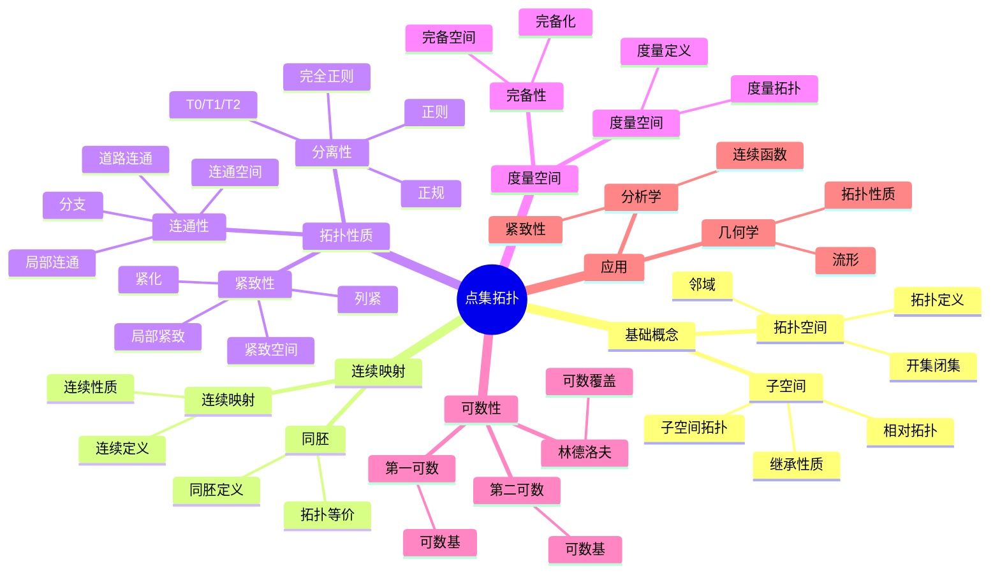
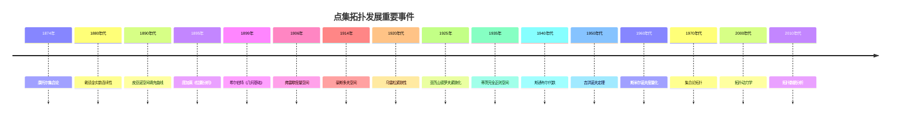

# 5.1 点集拓扑 / Point-Set Topology

**主题编号**: B.05.01
**创建日期**: 2025年11月21日
**最后更新**: 2025年11月21日

---

## 目录 / Table of Contents

- [5.1 点集拓扑 / Point-Set Topology](#51-点集拓扑--point-set-topology)
  - [目录 / Table of Contents](#目录--table-of-contents)
  - [🗺️ 点集拓扑核心概念思维导图](#️-点集拓扑核心概念思维导图)
  - [📊 点集拓扑核心概念多维知识矩阵](#-点集拓扑核心概念多维知识矩阵)
  - [5.1.1 历史背景 / Historical Background (编号: B.05.01.01)](#511-历史背景--historical-background-编号-b050101)
    - [5.1.1.1 早期发展 (1850-1900)](#5111-早期发展-1850-1900)
    - [5.1.1.2 系统化发展 (1900-1930)](#5112-系统化发展-1900-1930)
    - [5.1.1.3 现代发展 (1930-1960)](#5113-现代发展-1930-1960)
    - [5.1.1.4 当代发展 (1960-至今)](#5114-当代发展-1960-至今)
    - [重要人物贡献](#重要人物贡献)
    - [重要历史事件时间线](#重要历史事件时间线)
    - [理论发展脉络](#理论发展脉络)
      - [从集合到拓扑的发展](#从集合到拓扑的发展)
      - [从局部到整体的发展](#从局部到整体的发展)
  - [5.1.2 基本概念 / Basic Concepts (编号: B.05.01.02)](#512-基本概念--basic-concepts-编号-b050102)
    - [5.1.2.1 拓扑的定义 / Definition of Topology](#5121-拓扑的定义--definition-of-topology)
    - [5.1.2.2 开集与闭集 / Open and Closed Sets](#5122-开集与闭集--open-and-closed-sets)
    - [5.1.2.3 邻域 / Neighborhoods](#5123-邻域--neighborhoods)
  - [5.1.3 拓扑空间 / Topological Spaces (编号: B.05.01.03)](#513-拓扑空间--topological-spaces-编号-b050103)
    - [5.1.3.1 常见的拓扑 / Common Topologies](#5131-常见的拓扑--common-topologies)
    - [5.1.3.2 子空间拓扑 / Subspace Topology](#5132-子空间拓扑--subspace-topology)
    - [5.1.3.3 积拓扑 / Product Topology](#5133-积拓扑--product-topology)
  - [5.1.4 连续性与同胚 / Continuity and Homeomorphism (编号: B.05.01.04)](#514-连续性与同胚--continuity-and-homeomorphism-编号-b050104)
    - [5.1.4.1 连续映射 / Continuous Mappings](#5141-连续映射--continuous-mappings)
    - [5.1.4.2 同胚 / Homeomorphism](#5142-同胚--homeomorphism)
    - [5.1.4.3 拓扑不变量 / Topological Invariants](#5143-拓扑不变量--topological-invariants)
  - [5.1.5 紧致性 / Compactness (编号: B.05.01.05)](#515-紧致性--compactness-编号-b050105)
    - [5.1.5.1 紧致空间 / Compact Spaces](#5151-紧致空间--compact-spaces)
    - [5.1.5.2 紧致性的性质 / Properties of Compactness](#5152-紧致性的性质--properties-of-compactness)
    - [5.1.5.3 局部紧致性 / Local Compactness](#5153-局部紧致性--local-compactness)
  - [5.1.6 连通性 / Connectedness (编号: B.05.01.06)](#516-连通性--connectedness-编号-b050106)
    - [5.1.6.1 连通空间 / Connected Spaces](#5161-连通空间--connected-spaces)
    - [5.1.6.2 道路连通性 / Path Connectedness](#5162-道路连通性--path-connectedness)
    - [5.1.6.3 连通分支 / Connected Components](#5163-连通分支--connected-components)
  - [5.1.7 分离公理 / Separation Axioms (编号: B.05.01.07)](#517-分离公理--separation-axioms-编号-b050107)
    - [5.1.7.1 T₀ 到 T₄ 空间 / T₀ to T₄ Spaces](#5171-t-到-t-空间--t-to-t-spaces)
    - [5.1.7.2 分离公理的关系 / Relations Between Separation Axioms](#5172-分离公理的关系--relations-between-separation-axioms-)
  - [5.1.8 度量空间 / Metric Spaces (编号: B.05.01.08)](#518-度量空间--metric-spaces-编号-b050108)
    - [5.1.8.1 度量空间的定义 / Definition of Metric Space](#5181-度量空间的定义--definition-of-metric-space)
    - [5.1.8.2 度量拓扑 / Metric Topology](#5182-度量拓扑--metric-topology)
    - [5.1.8.3 完备性 / Completeness](#5183-完备性--completeness)
  - [5.1.9 可数性公理 / Countability Axioms (编号: B.05.01.09)](#519-可数性公理--countability-axioms-编号-b050109)
    - [5.1.9.1 第一可数公理 / First Countability Axiom](#5191-第一可数公理--first-countability-axiom)
    - [5.1.9.2 第二可数公理 / Second Countability Axiom](#5192-第二可数公理--second-countability-axiom)
    - [5.1.9.3 林德洛夫空间 / Lindelöf Spaces](#5193-林德洛夫空间--lindelöf-spaces)
  - [5.1.10 紧致化 / Compactification (编号: B.05.01.10)](#5110-紧致化--compactification-编号-b050110)
    - [5.1.10.1 单点紧致化 / One-Point Compactification](#51101-单点紧致化--one-point-compactification)
    - [5.1.10.2 斯通-切赫紧致化 / Stone-Čech Compactification](#51102-斯通-切赫紧致化--stone-čech-compactification)
  - [5.1.11 思维过程表征 / Thinking Process Representation](#5111-思维过程表征--thinking-process-representation)
    - [5.1.11.1 点集拓扑问题解决流程 / Problem-Solving Process in Point-Set Topology](#51111-点集拓扑问题解决流程--problem-solving-process-in-point-set-topology)
      - [5.1.11.1.1 一般问题解决策略 / General Problem-Solving Strategy](#511111-一般问题解决策略--general-problem-solving-strategy)
      - [5.1.11.1.2 具体问题类型分析 / Specific Problem Type Analysis](#511112-具体问题类型分析--specific-problem-type-analysis)
    - [5.1.11.2 证明思维过程 / Proof Thinking Process](#51112-证明思维过程--proof-thinking-process)
      - [5.1.11.2.1 海涅-博雷尔定理证明 / Heine-Borel Theorem Proof](#511121-海涅-博雷尔定理证明--heine-borel-theorem-proof)
      - [5.1.11.2.2 乌雷松引理证明 / Urysohn's Lemma Proof](#511122-乌雷松引理证明--urysohns-lemma-proof)
    - [5.1.11.3 概念理解步骤 / Concept Understanding Steps](#51113-概念理解步骤--concept-understanding-steps)
      - [5.1.11.3.1 拓扑空间概念理解 / Topological Space Concept Understanding](#511131-拓扑空间概念理解--topological-space-concept-understanding)
      - [5.1.11.3.2 紧致性概念理解 / Compactness Concept Understanding](#511132-紧致性概念理解--compactness-concept-understanding)
    - [5.1.11.4 问题解决策略 / Problem-Solving Strategies](#51114-问题解决策略--problem-solving-strategies)
      - [5.1.11.4.1 构造性策略 / Constructive Strategy](#511141-构造性策略--constructive-strategy)
      - [5.1.11.4.2 反证法策略 / Contradiction Strategy](#511142-反证法策略--contradiction-strategy)
      - [5.1.11.4.3 归纳法策略 / Induction Strategy](#511143-归纳法策略--induction-strategy)
    - [5.1.11.5 算法思维分析 / Algorithmic Thinking Analysis](#51115-算法思维分析--algorithmic-thinking-analysis)
      - [5.1.11.5.1 拓扑算法设计 / Topological Algorithm Design](#511151-拓扑算法设计--topological-algorithm-design)
      - [5.1.11.5.2 数值计算策略 / Numerical Computation Strategy](#511152-数值计算策略--numerical-computation-strategy)
  - [5.1.12 形式化实现 / Formal Implementation (编号: B.05.01.12)](#5112-形式化实现--formal-implementation-编号-b050112)
    - [5.1.12.1 Lean 4 实现 / Lean 4 Implementation](#51121-lean-4-实现--lean-4-implementation)
    - [5.1.12.2 Haskell 实现 / Haskell Implementation](#51122-haskell-实现--haskell-implementation)
    - [5.1.12.3 Rust 实现 / Rust Implementation](#51123-rust-实现--rust-implementation)
    - [5.1.12.4 Python 算法实现 / Python Algorithm Implementation](#51124-python-算法实现--python-algorithm-implementation)
    - [5.1.12.5 重要定理总结 / Summary of Important Theorems](#51125-重要定理总结--summary-of-important-theorems)
  - [5.1.13 应用与扩展 / Applications and Extensions (编号: B.05.01.13)](#5113-应用与扩展--applications-and-extensions-编号-b050113)
    - [5.1.13.1 物理学应用 / Physics Applications](#51131-物理学应用--physics-applications)
      - [5.1.13.1.1 量子力学应用 / Quantum Mechanics Applications](#511311-量子力学应用--quantum-mechanics-applications)
      - [5.1.13.1.2 相对论应用 / Relativity Applications](#511312-相对论应用--relativity-applications)
    - [5.1.13.2 工程应用 / Engineering Applications](#51132-工程应用--engineering-applications)
      - [5.1.13.2.1 计算机科学应用 / Computer Science Applications](#511321-计算机科学应用--computer-science-applications)
      - [5.1.13.2.2 机器人学应用 / Robotics Applications](#511322-机器人学应用--robotics-applications)
      - [5.1.13.2.3 图像处理应用 / Image Processing Applications](#511323-图像处理应用--image-processing-applications)
    - [5.1.13.3 现代发展 / Modern Developments](#51133-现代发展--modern-developments)
      - [5.1.13.3.1 拓扑数据分析 / Topological Data Analysis](#511331-拓扑数据分析--topological-data-analysis)
      - [5.1.13.3.2 拓扑机器学习 / Topological Machine Learning](#511332-拓扑机器学习--topological-machine-learning)
      - [5.1.13.3.3 拓扑动力学 / Topological Dynamics](#511333-拓扑动力学--topological-dynamics)
  - [总结 / Summary](#总结--summary)
    - [关键要点 / Key Points](#关键要点--key-points)
  - [参考文献 / References](#参考文献--references)
    - [经典教材 / Classic Textbooks](#经典教材--classic-textbooks)
    - [现代教材 / Modern Textbooks](#现代教材--modern-textbooks)
    - [在线资源 / Online Resources](#在线资源--online-resources)

---

## 🗺️ 点集拓扑核心概念思维导图



## 📊 点集拓扑核心概念多维知识矩阵

| 概念类别 | 核心概念 | 定义要点 | 关键性质 | 典型例子 | 应用场景 |
|---------|---------|---------|---------|---------|---------|
| 基础概念 | 拓扑空间 | 开集族 | 三公理 | (X,τ) | 拓扑基础 |
| 基础概念 | 开集 | 拓扑元素 | 任意并有限交 | 开区间 | 连续性 |
| 基础概念 | 闭集 | 开集补集 | 任意交有限并 | 闭区间 | 紧致性 |
| 连续映射 | 连续映射 | 开集原像为开集 | 复合连续 | f: X→Y | 函数研究 |
| 连续映射 | 同胚 | 连续双射 | 拓扑等价 | 同胚映射 | 分类问题 |
| 拓扑性质 | 连通性 | 不能分解 | 连通分支 | [0,1] | 分类问题 |
| 拓扑性质 | 道路连通 | 道路连接 | 比连通更强 | 凸集 | 分类问题 |
| 拓扑性质 | 紧致性 | 有限覆盖 | 有界闭集 | [0,1] | 存在性定理 |
| 拓扑性质 | 局部紧致 | 局部紧致 | 单点紧化 | ℝⁿ | 紧化理论 |
| 拓扑性质 | T2空间 | 豪斯多夫 | 分离性 | 度量空间 | 分析学 |
| 度量空间 | 度量空间 | 距离函数 | 诱导拓扑 | (ℝⁿ,d) | 分析基础 |
| 度量空间 | 完备性 | 柯西收敛 | 完备化 | ℝ, C[0,1] | 分析学 |
| 可数性 | 第二可数 | 可数基 | 可分性 | ℝⁿ | 分析学 |
| 应用 | 流形 | 局部欧几里得 | 拓扑流形 | Sⁿ | 几何学 |

## 5.1.1 历史背景 / Historical Background (编号: B.05.01.01)

点集拓扑是拓扑学的基础分支，研究拓扑空间的基本性质和结构。它起源于19世纪末和20世纪初，为现代拓扑学的发展奠定了基础。

**Point-set topology is the foundational branch of topology that studies the basic properties and structures of topological spaces. It originated in the late 19th and early 20th centuries, laying the foundation for the development of modern topology.**

### 5.1.1.1 早期发展 (1850-1900)

**康托尔时代**:

- **1874年**: 康托尔集合论
  - 引入集合概念
  - 研究无穷集合
  - 为拓扑学奠定基础
- **1880年代**: 戴德金贡献
  - 研究实数连续性
  - 建立戴德金分割
  - 为分析基础奠定基础
- **1890年代**: 皮亚诺贡献
  - 研究空间填充曲线
  - 建立皮亚诺公理
  - 为现代数学奠定基础

**早期应用**:

- **1895年**: 庞加莱《位置分析》
  - 引入同伦概念
  - 研究代数拓扑
  - 为现代拓扑奠定基础
- **1899年**: 希尔伯特《几何基础》
  - 公理化几何
  - 建立形式化数学
  - 为数学基础研究奠定基础

### 5.1.1.2 系统化发展 (1900-1930)

**弗雷歇时代**:

- **1906年**: 弗雷歇度量空间
  - 引入度量空间概念
  - 研究函数空间
  - 为泛函分析奠定基础
- **1914年**: 豪斯多夫贡献
  - 引入豪斯多夫空间
  - 建立分离公理
  - 为点集拓扑奠定基础
- **1920年代**: 乌雷松贡献
  - 研究紧致性
  - 建立乌雷松引理
  - 为现代拓扑奠定基础

**应用扩展**:

- **1925年**: 亚历山德罗夫贡献
  - 研究紧致化
  - 建立单点紧致化
  - 为现代拓扑奠定基础

### 5.1.1.3 现代发展 (1930-1960)

**20世纪革命**:

- **1935年**: 蒂茨贡献
  - 研究完全正则空间
  - 建立蒂茨嵌入定理
  - 为现代拓扑奠定基础
- **1940年代**: 斯通贡献
  - 研究布尔代数
  - 建立斯通表示定理
  - 为代数拓扑奠定基础
- **1950年代**: 吉洪诺夫贡献
  - 研究紧致性
  - 建立吉洪诺夫定理
  - 为现代拓扑奠定基础

**理论发展**:

- **1960年代**: 斯米尔诺夫贡献
  - 研究度量化问题
  - 建立斯米尔诺夫定理
  - 为现代拓扑奠定基础

### 5.1.1.4 当代发展 (1960-至今)

**20世纪后期**:

- **1970年代**: 集合论拓扑
  - 研究大基数
  - 集合论方法
  - 现代集合论拓扑
- **1980年代**: 连续统假设
  - 研究连续统假设
  - 独立性结果
  - 现代集合论
- **1990年代**: 描述集合论
  - 研究描述集合论
  - 波兰空间
  - 现代描述集合论

**21世纪前沿**:

- **2000年代**: 拓扑动力学
  - 拓扑动力学
  - 遍历理论
  - 现代动力系统
- **2010年代**: 拓扑数据分析
  - 持久同调
  - 拓扑数据分析
  - 计算拓扑学
- **2020年代**: 拓扑机器学习
  - 拓扑机器学习
  - 几何深度学习
  - 拓扑人工智能

### 重要人物贡献

| 人物 | 时期 | 主要贡献 | 影响 |
|------|------|----------|------|
| 康托尔 | 1874 | 集合论，无穷集合 | 建立集合论基础 |
| 戴德金 | 1880s | 实数连续性，戴德金分割 | 为分析基础奠定基础 |
| 皮亚诺 | 1890s | 空间填充曲线，皮亚诺公理 | 为现代数学奠定基础 |
| 庞加莱 | 1895 | 位置分析，同伦概念 | 为现代拓扑奠定基础 |
| 希尔伯特 | 1899 | 几何基础，公理化几何 | 为数学基础研究奠定基础 |
| 弗雷歇 | 1906 | 度量空间，函数空间 | 为泛函分析奠定基础 |
| 豪斯多夫 | 1914 | 豪斯多夫空间，分离公理 | 为点集拓扑奠定基础 |
| 乌雷松 | 1920s | 紧致性，乌雷松引理 | 为现代拓扑奠定基础 |
| 亚历山德罗夫 | 1925 | 紧致化，单点紧致化 | 为现代拓扑奠定基础 |
| 蒂茨 | 1935 | 完全正则空间，蒂茨嵌入定理 | 为现代拓扑奠定基础 |
| 斯通 | 1940s | 布尔代数，斯通表示定理 | 为代数拓扑奠定基础 |
| 吉洪诺夫 | 1950s | 紧致性，吉洪诺夫定理 | 为现代拓扑奠定基础 |

### 重要历史事件时间线



### 理论发展脉络

#### 从集合到拓扑的发展

**集合论基础**:

- 康托尔集合论：无穷集合、基数、序数
- 戴德金分割：实数连续性
- 皮亚诺公理：自然数公理化

**度量空间理论**:

- 弗雷歇度量空间：距离函数、收敛性
- 豪斯多夫空间：分离公理、邻域系统
- 乌雷松引理：正规空间、连续函数

**拓扑空间理论**:

- 亚历山德罗夫紧致化：单点紧致化
- 蒂茨嵌入定理：完全正则空间
- 吉洪诺夫定理：紧致性保持

#### 从局部到整体的发展

**局部性质**:

- 邻域系统：开集、闭集、邻域
- 连续性：函数连续性、同胚
- 分离公理：T₀、T₁、T₂、T₃、T₄

**整体性质**:

- 紧致性：有限覆盖性质
- 连通性：连通空间、连通分支
- 紧致化：单点紧致化、斯通-切赫紧致化

**现代发展**:

- 集合论拓扑：大基数、连续统假设
- 描述集合论：波兰空间、波雷尔集
- 拓扑动力学：遍历理论、动力系统

## 5.1.2 基本概念 / Basic Concepts (编号: B.05.01.02)

### 5.1.2.1 拓扑的定义 / Definition of Topology

**定义 1.1.1** (拓扑 / Topology)
设 $X$ 是一个集合，$\mathcal{T}$ 是 $X$ 的子集族。如果 $\mathcal{T}$ 满足以下条件，则称 $\mathcal{T}$ 为 $X$ 上的一个拓扑：

1. **空集和全集** / Empty set and whole set: $\emptyset, X \in \mathcal{T}$
2. **有限交** / Finite intersection: 如果 $U_1, U_2, \ldots, U_n \in \mathcal{T}$，则 $\bigcap_{i=1}^n U_i \in \mathcal{T}$
3. **任意并** / Arbitrary union: 如果 $\{U_i\}_{i \in I} \subseteq \mathcal{T}$，则 $\bigcup_{i \in I} U_i \in \mathcal{T}$

**定义 1.1.2** (拓扑空间 / Topological Space)
有序对 $(X, \mathcal{T})$ 称为拓扑空间，其中 $X$ 是集合，$\mathcal{T}$ 是 $X$ 上的拓扑。

### 5.1.2.2 开集与闭集 / Open and Closed Sets

**定义 1.2.1** (开集 / Open Set)
在拓扑空间 $(X, \mathcal{T})$ 中，$\mathcal{T}$ 的元素称为开集。

**定义 1.2.2** (闭集 / Closed Set)
在拓扑空间 $(X, \mathcal{T})$ 中，如果 $A \subseteq X$ 的补集 $X \setminus A$ 是开集，则称 $A$ 为闭集。

**定理 1.2.1** (闭集的性质 / Properties of Closed Sets)
在拓扑空间 $(X, \mathcal{T})$ 中，闭集族 $\mathcal{F}$ 满足：

1. $\emptyset, X \in \mathcal{F}$
2. 有限并：如果 $F_1, F_2, \ldots, F_n \in \mathcal{F}$，则 $\bigcup_{i=1}^n F_i \in \mathcal{F}$
3. 任意交：如果 $\{F_i\}_{i \in I} \subseteq \mathcal{F}$，则 $\bigcap_{i \in I} F_i \in \mathcal{F}$

**证明** / Proof:

- 由德摩根律：$X \setminus \bigcup_{i=1}^n F_i = \bigcap_{i=1}^n (X \setminus F_i)$
- 开集的有限交是开集，所以闭集的有限并是闭集
- 类似地，开集的任意并是开集，所以闭集的任意交是闭集

### 5.1.2.3 邻域 / Neighborhoods

**定义 1.3.1** (邻域 / Neighborhood)
在拓扑空间 $(X, \mathcal{T})$ 中，点 $x \in X$ 的邻域是指包含 $x$ 的开集。

**定义 1.3.2** (邻域基 / Neighborhood Base)
在拓扑空间 $(X, \mathcal{T})$ 中，点 $x \in X$ 的邻域基是指 $x$ 的邻域族 $\mathcal{B}_x$，使得 $x$ 的任意邻域都包含 $\mathcal{B}_x$ 中的某个元素。

---

## 5.1.3 拓扑空间 / Topological Spaces (编号: B.05.01.03)

### 5.1.3.1 常见的拓扑 / Common Topologies

**定义 2.1.1** (离散拓扑 / Discrete Topology)
在集合 $X$ 上，$\mathcal{T} = \mathcal{P}(X)$（幂集）称为离散拓扑。

**定义 2.1.2** (平凡拓扑 / Trivial Topology)
在集合 $X$ 上，$\mathcal{T} = \{\emptyset, X\}$ 称为平凡拓扑。

**定义 2.1.3** (有限补拓扑 / Finite Complement Topology)
在集合 $X$ 上，$\mathcal{T} = \{U \subseteq X : X \setminus U \text{ 是有限集或 } U = \emptyset\}$ 称为有限补拓扑。

### 5.1.3.2 子空间拓扑 / Subspace Topology

**定义 2.2.1** (子空间拓扑 / Subspace Topology)
设 $(X, \mathcal{T})$ 是拓扑空间，$A \subseteq X$。$A$ 上的子空间拓扑定义为：
$$\mathcal{T}_A = \{U \cap A : U \in \mathcal{T}\}$$

**定理 2.2.1** (子空间拓扑的性质 / Properties of Subspace Topology)
子空间拓扑 $\mathcal{T}_A$ 确实是 $A$ 上的拓扑。

**证明** / Proof:

1. $\emptyset = \emptyset \cap A \in \mathcal{T}_A$
2. $A = X \cap A \in \mathcal{T}_A$
3. 有限交：$(U_1 \cap A) \cap (U_2 \cap A) = (U_1 \cap U_2) \cap A \in \mathcal{T}_A$
4. 任意并：$\bigcup_{i \in I} (U_i \cap A) = (\bigcup_{i \in I} U_i) \cap A \in \mathcal{T}_A$

### 5.1.3.3 积拓扑 / Product Topology

**定义 2.3.1** (积拓扑 / Product Topology)
设 $\{(X_i, \mathcal{T}_i)\}_{i \in I}$ 是拓扑空间族。积空间 $X = \prod_{i \in I} X_i$ 上的积拓扑定义为：
$$\mathcal{T} = \left\{\prod_{i \in I} U_i : U_i \in \mathcal{T}_i, \text{ 且只有有限个 } U_i \neq X_i\right\}$$

**定理 2.3.1** (积拓扑的基 / Basis for Product Topology)
积拓扑的基由形如 $\prod_{i \in I} U_i$ 的集合组成，其中 $U_i \in \mathcal{T}_i$ 且只有有限个 $U_i \neq X_i$。

---

## 5.1.4 连续性与同胚 / Continuity and Homeomorphism (编号: B.05.01.04)

### 5.1.4.1 连续映射 / Continuous Mappings

**定义 3.1.1** (连续映射 / Continuous Mapping)
设 $(X, \mathcal{T}_X)$ 和 $(Y, \mathcal{T}_Y)$ 是拓扑空间，映射 $f: X \to Y$ 称为连续的，如果对于任意开集 $V \in \mathcal{T}_Y$，$f^{-1}(V) \in \mathcal{T}_X$。

**定理 3.1.1** (连续性的等价条件 / Equivalent Conditions for Continuity)
映射 $f: X \to Y$ 连续的充分必要条件是：

1. 对于任意闭集 $F \subseteq Y$，$f^{-1}(F)$ 是闭集
2. 对于任意点 $x \in X$ 和 $f(x)$ 的任意邻域 $V$，存在 $x$ 的邻域 $U$ 使得 $f(U) \subseteq V$

**证明** / Proof:

- 必要性：$f^{-1}(Y \setminus V) = X \setminus f^{-1}(V)$
- 充分性：利用邻域的定义和连续性

### 5.1.4.2 同胚 / Homeomorphism

**定义 3.2.1** (同胚 / Homeomorphism)
设 $(X, \mathcal{T}_X)$ 和 $(Y, \mathcal{T}_Y)$ 是拓扑空间。如果存在双射 $f: X \to Y$ 使得 $f$ 和 $f^{-1}$ 都连续，则称 $f$ 为同胚映射，称 $X$ 和 $Y$ 同胚。

**定理 3.2.1** (同胚的性质 / Properties of Homeomorphism)
同胚映射保持拓扑性质：

1. 开集映射到开集
2. 闭集映射到闭集
3. 紧致集映射到紧致集
4. 连通集映射到连通集

### 5.1.4.3 拓扑不变量 / Topological Invariants

**定义 3.3.1** (拓扑不变量 / Topological Invariant)
拓扑不变量是在同胚映射下保持不变的拓扑性质。

**重要的拓扑不变量** / Important Topological Invariants:

1. **紧致性** / Compactness
2. **连通性** / Connectedness
3. **分离性质** / Separation properties
4. **基本群** / Fundamental group
5. **同调群** / Homology groups

---

## 5.1.5 紧致性 / Compactness (编号: B.05.01.05)

### 5.1.5.1 紧致空间 / Compact Spaces

**定义 4.1.1** (开覆盖 / Open Cover)
拓扑空间 $(X, \mathcal{T})$ 的开覆盖是指开集族 $\{U_i\}_{i \in I}$ 使得 $X = \bigcup_{i \in I} U_i$。

**定义 4.1.2** (紧致空间 / Compact Space)
拓扑空间 $(X, \mathcal{T})$ 称为紧致的，如果它的任意开覆盖都有有限子覆盖。

**定理 4.1.1** (海涅-博雷尔定理 / Heine-Borel Theorem)
$\mathbb{R}^n$ 的子集 $A$ 紧致当且仅当 $A$ 是有界闭集。

**证明思路**:

1. 必要性：证明紧致集合是有界闭集
2. 充分性：证明有界闭集是紧致的

**详细证明**:

- **必要性** (紧致 ⇒ 有界闭):
  - **步骤 1**: 证明 $A$ 有界
    - 构造开覆盖 $\{B(0, n) : n \in \mathbb{N}\}$，其中 $B(0, n)$ 是以原点为圆心、$n$ 为半径的开球
    - 由于 $A$ 紧致，存在有限子覆盖 $\{B(0, n_1), B(0, n_2), \ldots, B(0, n_k)\}$
    - 设 $N = \max\{n_1, n_2, \ldots, n_k\}$，则 $A \subseteq B(0, N)$，因此 $A$ 有界
  - **步骤 2**: 证明 $A$ 是闭集
    - 设 $x \in \mathbb{R}^n \setminus A$，对于每个 $a \in A$，存在开集 $U_a$ 使得 $a \in U_a$ 且 $x \notin \overline{U_a}$
    - 集合 $\{U_a : a \in A\}$ 构成 $A$ 的开覆盖
    - 由于 $A$ 紧致，存在有限子覆盖 $\{U_{a_1}, U_{a_2}, \ldots, U_{a_m}\}$
    - 设 $U = \bigcup_{i=1}^m U_{a_i}$，则 $U$ 是包含 $A$ 的开集，且 $x \notin \overline{U}$
    - 因此 $x$ 有开邻域与 $A$ 不相交，所以 $A$ 是闭集

- **充分性** (有界闭 ⇒ 紧致):
  - **步骤 1**: 由于 $A$ 有界，存在闭区间 $I = [a_1, b_1] \times [a_2, b_2] \times \cdots \times [a_n, b_n]$ 使得 $A \subseteq I$
  - **步骤 2**: 由吉洪诺夫定理，$I$ 是紧致的（因为它是有限个紧致区间的积）
  - **步骤 3**: 由于 $A$ 是紧致空间 $I$ 的闭子集，$A$ 也是紧致的

### 5.1.5.2 紧致性的性质 / Properties of Compactness

**定理 4.2.1** (紧致性的保持 / Preservation of Compactness)
紧致性在连续映射下保持：

1. 紧致空间的连续像是紧致的
2. 紧致空间的闭子集是紧致的
3. 有限个紧致空间的积是紧致的

**证明思路**:

1. 利用开覆盖和连续映射的性质
2. 利用紧致性的定义

**详细证明**:

**性质 1**: 紧致空间的连续像是紧致的

- 设 $f: X \to Y$ 是连续映射，$X$ 是紧致空间
- 设 $\{V_i\}_{i \in I}$ 是 $f(X)$ 的开覆盖
- 由于 $f$ 连续，$\{f^{-1}(V_i)\}_{i \in I}$ 是 $X$ 的开覆盖
- 由于 $X$ 紧致，存在有限子覆盖 $\{f^{-1}(V_{i_1}), f^{-1}(V_{i_2}), \ldots, f^{-1}(V_{i_n})\}$
- 因此 $\{V_{i_1}, V_{i_2}, \ldots, V_{i_n}\}$ 是 $f(X)$ 的有限子覆盖
- 所以 $f(X)$ 是紧致的

**性质 2**: 紧致空间的闭子集是紧致的

- 设 $A$ 是紧致空间 $X$ 的闭子集
- 设 $\{U_i\}_{i \in I}$ 是 $A$ 的开覆盖（在子空间拓扑下）
- 对于每个 $i$，存在 $X$ 的开集 $V_i$ 使得 $U_i = A \cap V_i$
- 集合 $\{V_i\}_{i \in I} \cup \{X \setminus A\}$ 构成 $X$ 的开覆盖
- 由于 $X$ 紧致，存在有限子覆盖
- 去掉 $X \setminus A$（如果存在），得到 $A$ 的有限子覆盖
- 所以 $A$ 是紧致的

**性质 3**: 有限个紧致空间的积是紧致的

- 使用数学归纳法
- 基础情况：单个紧致空间是紧致的
- 归纳步骤：如果 $X$ 和 $Y$ 紧致，则 $X \times Y$ 紧致
- 对于 $X \times Y$ 的任意开覆盖，利用投影映射和紧致性构造有限子覆盖

**定理 4.2.2** (吉洪诺夫定理 / Tychonoff's Theorem)
任意紧致空间族的积空间是紧致的。

**证明思路**:

使用超滤子或Zorn引理，这是选择公理的一个等价形式。

**详细证明**:

- 设 $\{X_i\}_{i \in I}$ 是紧致空间族，$X = \prod_{i \in I} X_i$ 是积空间
- **步骤 1**: 设 $\mathcal{U}$ 是 $X$ 的开覆盖
- **步骤 2**: 假设 $\mathcal{U}$ 没有有限子覆盖
- **步骤 3**: 由Zorn引理，存在极大族 $\mathcal{F}$ 使得：
  - $\mathcal{F}$ 包含 $\mathcal{U}$ 的有限子族的补集
  - $\mathcal{F}$ 具有有限交性质
- **步骤 4**: 对于每个 $i \in I$，投影 $\pi_i(\mathcal{F})$ 在 $X_i$ 上具有有限交性质
- **步骤 5**: 由于 $X_i$ 紧致，存在 $x_i \in \bigcap_{F \in \mathcal{F}} \overline{\pi_i(F)}$
- **步骤 6**: 点 $x = (x_i)_{i \in I}$ 属于 $\mathcal{U}$ 中某个开集的闭包
- **步骤 7**: 这与 $\mathcal{F}$ 的构造矛盾
- 因此 $\mathcal{U}$ 有有限子覆盖，$X$ 是紧致的

### 5.1.5.3 局部紧致性 / Local Compactness

**定义 4.3.1** (局部紧致 / Locally Compact)
拓扑空间 $(X, \mathcal{T})$ 称为局部紧致的，如果对于任意点 $x \in X$，存在 $x$ 的紧致邻域。

**定理 4.3.1** (局部紧致空间的性质 / Properties of Locally Compact Spaces)
局部紧致豪斯多夫空间可以紧致化。

---

## 5.1.6 连通性 / Connectedness (编号: B.05.01.06)

### 5.1.6.1 连通空间 / Connected Spaces

**定义 5.1.1** (连通空间 / Connected Space)
拓扑空间 $(X, \mathcal{T})$ 称为连通的，如果它不能表示为两个非空不相交开集的并。

**等价定义** / Equivalent Definition:
空间 $X$ 连通当且仅当 $X$ 不能表示为两个非空不相交闭集的并。

**定理 5.1.1** (连通性的性质 / Properties of Connectedness)
连通性在连续映射下保持：

1. 连通空间的连续像是连通的
2. 连通空间的闭子集不一定是连通的
3. 连通空间的积是连通的

### 5.1.6.2 道路连通性 / Path Connectedness

**定义 5.2.1** (道路 / Path)
拓扑空间 $(X, \mathcal{T})$ 中从点 $a$ 到点 $b$ 的道路是连续映射 $f: [0,1] \to X$ 使得 $f(0) = a$ 和 $f(1) = b$。

**定义 5.2.2** (道路连通 / Path Connected)
拓扑空间 $(X, \mathcal{T})$ 称为道路连通的，如果任意两点之间都存在道路。

**定理 5.2.1** (道路连通与连通 / Path Connected vs Connected)
道路连通空间是连通的，但连通空间不一定是道路连通的。

**例子** / Example:
拓扑学家的正弦曲线是连通但不是道路连通的。

### 5.1.6.3 连通分支 / Connected Components

**定义 5.3.1** (连通分支 / Connected Component)
拓扑空间 $(X, \mathcal{T})$ 中，包含点 $x$ 的连通分支是包含 $x$ 的最大连通子集。

**定理 5.3.1** (连通分支的性质 / Properties of Connected Components)
连通分支是闭集，且空间是连通分支的不相交并。

---

## 5.1.7 分离公理 / Separation Axioms (编号: B.05.01.07)

### 5.1.7.1 T₀ 到 T₄ 空间 / T₀ to T₄ Spaces

**定义 6.1.1** (T₀ 空间 / T₀ Space)
拓扑空间 $(X, \mathcal{T})$ 称为 T₀ 空间，如果对于任意两个不同的点，存在一个点的邻域不包含另一个点。

**定义 6.1.2** (T₁ 空间 / T₁ Space)
拓扑空间 $(X, \mathcal{T})$ 称为 T₁ 空间，如果对于任意两个不同的点，每个点都有不包含另一个点的邻域。

**定义 6.1.3** (T₂ 空间 / T₂ Space / 豪斯多夫空间 / Hausdorff Space)
拓扑空间 $(X, \mathcal{T})$ 称为 T₂ 空间或豪斯多夫空间，如果对于任意两个不同的点，存在不相交的邻域。

**定义 6.1.4** (T₃ 空间 / T₃ Space / 正则空间 / Regular Space)
拓扑空间 $(X, \mathcal{T})$ 称为 T₃ 空间或正则空间，如果它是 T₁ 空间，且对于任意闭集 $F$ 和点 $x \notin F$，存在不相交的开集 $U$ 和 $V$ 使得 $F \subseteq U$ 和 $x \in V$。

**定义 6.1.5** (T₄ 空间 / T₄ Space / 正规空间 / Normal Space)
拓扑空间 $(X, \mathcal{T})$ 称为 T₄ 空间或正规空间，如果它是 T₁ 空间，且对于任意两个不相交的闭集，存在不相交的开集分别包含它们。

### 5.1.7.2 分离公理的关系 / Relations Between Separation Axioms <a id="5172-分离公理的关系--relations-between-separation-axioms-"></a>

**定理 6.2.1** (分离公理的层次 / Hierarchy of Separation Axioms)
$$T_4 \Rightarrow T_3 \Rightarrow T_2 \Rightarrow T_1 \Rightarrow T_0$$

**定理 6.2.2** (紧致豪斯多夫空间 / Compact Hausdorff Spaces)
紧致豪斯多夫空间是正规的。

**证明思路**:

1. 利用紧致性和豪斯多夫性质
2. 构造分离两个闭集的开集

**详细证明**:

- 设 $X$ 是紧致豪斯多夫空间，$A$ 和 $B$ 是不相交的闭集
- **步骤 1**: 对于每个 $a \in A$，由于 $X$ 是豪斯多夫空间，对每个 $b \in B$，存在开集 $U_{a,b}$ 和 $V_{a,b}$ 使得 $a \in U_{a,b}$，$b \in V_{a,b}$，且 $U_{a,b} \cap V_{a,b} = \emptyset$
- **步骤 2**: 固定 $a \in A$，集合 $\{V_{a,b} : b \in B\}$ 构成 $B$ 的开覆盖
- **步骤 3**: 由于 $B$ 是紧致空间 $X$ 的闭子集，$B$ 也是紧致的
- **步骤 4**: 存在有限子覆盖 $\{V_{a,b_1}, V_{a,b_2}, \ldots, V_{a,b_n}\}$
- **步骤 5**: 设 $U_a = \bigcap_{i=1}^n U_{a,b_i}$ 和 $V_a = \bigcup_{i=1}^n V_{a,b_i}$，则 $a \in U_a$，$B \subseteq V_a$，且 $U_a \cap V_a = \emptyset$
- **步骤 6**: 集合 $\{U_a : a \in A\}$ 构成 $A$ 的开覆盖
- **步骤 7**: 由于 $A$ 紧致，存在有限子覆盖 $\{U_{a_1}, U_{a_2}, \ldots, U_{a_m}\}$
- **步骤 8**: 设 $U = \bigcup_{i=1}^m U_{a_i}$ 和 $V = \bigcap_{i=1}^m V_{a_i}$，则 $A \subseteq U$，$B \subseteq V$，且 $U \cap V = \emptyset$
- 因此 $X$ 是正规空间

**定理 6.2.3** (乌雷松引理 / Urysohn's Lemma)
设 $X$ 是正规空间，$A$ 和 $B$ 是 $X$ 的不相交闭集，则存在连续函数 $f: X \to [0,1]$，使得 $f|_A = 0$ 且 $f|_B = 1$。

**证明思路**:

1. 构造有理数索引的开集族
2. 定义函数
3. 证明连续性

**详细证明**:

- **步骤 1**: 构造有理数索引的开集族
  - 对于每个有理数 $r \in [0,1] \cap \mathbb{Q}$，构造开集 $U_r$，使得：
    - $A \subseteq U_0$
    - $U_1 \subseteq X \setminus B$
    - 如果 $r < s$，则 $\overline{U_r} \subseteq U_s$
  - 构造方法：使用归纳法，从 $U_0$ 和 $U_1$ 开始，对于每个有理数 $r$，利用正规性构造 $U_r$
- **步骤 2**: 定义函数
  - 定义函数 $f: X \to [0,1]$ 为：
    $$f(x) = \inf\{r \in [0,1] \cap \mathbb{Q} : x \in U_r\}$$
  - 如果 $x \notin U_r$ 对所有 $r < 1$ 成立，则 $f(x) = 1$
- **步骤 3**: 验证边界条件
  - 对于 $x \in A$，$x \in U_0$，所以 $f(x) = 0$
  - 对于 $x \in B$，$x \notin U_r$ 对所有 $r < 1$ 成立，所以 $f(x) = 1$
- **步骤 4**: 证明连续性
  - 对于任意 $x \in X$ 和 $\varepsilon > 0$，存在有理数 $r, s \in [0,1] \cap \mathbb{Q}$，使得：
    $$f(x) - \varepsilon < r < f(x) < s < f(x) + \varepsilon$$
  - 由于 $x \in U_s$ 且 $x \notin \overline{U_r}$，存在开集 $V$，使得：
    $$x \in V \subseteq U_s \setminus \overline{U_r}$$
  - 对于任意 $y \in V$，有 $r \leq f(y) \leq s$，因此 $|f(y) - f(x)| < \varepsilon$
  - 所以 $f$ 在 $x$ 处连续，由 $x$ 的任意性，$f$ 在 $X$ 上连续

**证明** / Proof:
利用紧致性和豪斯多夫性质构造分离开集。

---

## 5.1.8 度量空间 / Metric Spaces (编号: B.05.01.08)

### 5.1.8.1 度量空间的定义 / Definition of Metric Space

**定义 7.1.1** (度量 / Metric)
集合 $X$ 上的度量是函数 $d: X \times X \to \mathbb{R}$ 满足：

1. **正定性** / Positive definiteness: $d(x,y) \geq 0$，且 $d(x,y) = 0$ 当且仅当 $x = y$
2. **对称性** / Symmetry: $d(x,y) = d(y,x)$
3. **三角不等式** / Triangle inequality: $d(x,z) \leq d(x,y) + d(y,z)$

**定义 7.1.2** (度量空间 / Metric Space)
有序对 $(X,d)$ 称为度量空间，其中 $X$ 是集合，$d$ 是 $X$ 上的度量。

### 5.1.8.2 度量拓扑 / Metric Topology

**定义 7.2.1** (开球 / Open Ball)
在度量空间 $(X,d)$ 中，以 $x \in X$ 为中心，$r > 0$ 为半径的开球定义为：
$$B(x,r) = \{y \in X : d(x,y) < r\}$$

**定义 7.2.2** (度量拓扑 / Metric Topology)
度量空间 $(X,d)$ 上的度量拓扑定义为：
$$\mathcal{T}_d = \{U \subseteq X : \text{对于任意 } x \in U, \text{存在 } r > 0 \text{ 使得 } B(x,r) \subseteq U\}$$

**定理 7.2.1** (度量拓扑的性质 / Properties of Metric Topology)
度量拓扑是豪斯多夫的，且满足第一可数公理。

### 5.1.8.3 完备性 / Completeness

**定义 7.3.1** (柯西序列 / Cauchy Sequence)
度量空间 $(X,d)$ 中的序列 $\{x_n\}$ 称为柯西序列，如果对于任意 $\varepsilon > 0$，存在 $N \in \mathbb{N}$ 使得对于任意 $m,n \geq N$，$d(x_m,x_n) < \varepsilon$。

**定义 7.3.2** (完备度量空间 / Complete Metric Space)
度量空间 $(X,d)$ 称为完备的，如果每个柯西序列都收敛。

**定理 7.3.1** (完备化定理 / Completion Theorem)
每个度量空间都有完备化。

---

## 5.1.9 可数性公理 / Countability Axioms (编号: B.05.01.09)

### 5.1.9.1 第一可数公理 / First Countability Axiom

**定义 8.1.1** (第一可数空间 / First Countable Space)
拓扑空间 $(X, \mathcal{T})$ 称为第一可数的，如果每个点都有可数的邻域基。

**定理 8.1.1** (第一可数空间的性质 / Properties of First Countable Spaces)
第一可数空间中的序列收敛可以用邻域基描述。

### 5.1.9.2 第二可数公理 / Second Countability Axiom

**定义 8.2.1** (第二可数空间 / Second Countable Space)
拓扑空间 $(X, \mathcal{T})$ 称为第二可数的，如果它有可数的拓扑基。

**定理 8.2.1** (第二可数空间的性质 / Properties of Second Countable Spaces)
第二可数空间是第一可数的，且是林德洛夫空间。

### 5.1.9.3 林德洛夫空间 / Lindelöf Spaces

**定义 8.3.1** (林德洛夫空间 / Lindelöf Space)
拓扑空间 $(X, \mathcal{T})$ 称为林德洛夫空间，如果它的任意开覆盖都有可数子覆盖。

**定理 8.3.1** (林德洛夫空间的性质 / Properties of Lindelöf Spaces)
第二可数空间是林德洛夫空间。

---

## 5.1.10 紧致化 / Compactification (编号: B.05.01.10)

### 5.1.10.1 单点紧致化 / One-Point Compactification

**定义 9.1.1** (单点紧致化 / One-Point Compactification)
设 $(X, \mathcal{T})$ 是局部紧致豪斯多夫空间。$X$ 的单点紧致化是空间 $X^* = X \cup \{\infty\}$，其中拓扑定义为：
$$\mathcal{T}^* = \mathcal{T} \cup \{X^* \setminus K : K \subseteq X \text{ 紧致}\}$$

**定理 9.1.1** (单点紧致化的性质 / Properties of One-Point Compactification)
单点紧致化是紧致的豪斯多夫空间。

### 5.1.10.2 斯通-切赫紧致化 / Stone-Čech Compactification

**定义 9.2.1** (斯通-切赫紧致化 / Stone-Čech Compactification)
设 $(X, \mathcal{T})$ 是完全正则空间。$X$ 的斯通-切赫紧致化是紧致豪斯多夫空间 $\beta X$，使得：

1. $X$ 在 $\beta X$ 中稠密
2. 任意有界连续函数 $f: X \to \mathbb{R}$ 可以唯一扩展到 $\beta X$

**定理 9.2.1** (斯通-切赫紧致化的性质 / Properties of Stone-Čech Compactification)
斯通-切赫紧致化是最大的紧致化。

---

## 5.1.11 思维过程表征 / Thinking Process Representation

### 5.1.11.1 点集拓扑问题解决流程 / Problem-Solving Process in Point-Set Topology

#### 5.1.11.1.1 一般问题解决策略 / General Problem-Solving Strategy

**步骤1: 问题分析 / Step 1: Problem Analysis**:

- 识别问题的拓扑空间类型
- 确定需要证明或验证的拓扑性质
- 分析已知条件和目标结论

**步骤2: 选择合适的方法 / Step 2: Choose Appropriate Methods**:

- 根据问题类型选择适当的拓扑工具
- 考虑使用连续性、紧致性、连通性等性质
- 确定是否需要构造性证明或反证法

**步骤3: 实施证明 / Step 3: Implement Proof**:

- 使用拓扑定义和定理
- 利用已知的拓扑性质
- 注意逻辑推理的严密性

**步骤4: 验证结果 / Step 4: Verify Results**:

- 检查证明的完整性
- 验证结论的正确性
- 考虑特殊情况

#### 5.1.11.1.2 具体问题类型分析 / Specific Problem Type Analysis

**连续性证明问题**:

1. **识别映射**: 确定函数f: X → Y
2. **选择方法**: 使用ε-δ定义或开集定义
3. **构造证明**: 利用拓扑性质
4. **验证结果**: 检查证明的合理性

**紧致性证明问题**:

1. **识别空间**: 确定拓扑空间X
2. **选择方法**: 使用开覆盖定义或序列紧致性
3. **构造证明**: 利用紧致性的性质
4. **验证结果**: 检查覆盖的完备性

**连通性证明问题**:

1. **识别空间**: 确定拓扑空间X
2. **选择方法**: 使用连通性定义或路径连通性
3. **构造证明**: 利用连通性的性质
4. **验证结果**: 检查分离的完备性

### 5.1.11.2 证明思维过程 / Proof Thinking Process

#### 5.1.11.2.1 海涅-博雷尔定理证明 / Heine-Borel Theorem Proof

**问题**: 证明ℝ的子集A紧致当且仅当A是有界闭集

**思维过程**:

1. **必要性证明** (紧致 ⇒ 有界闭)
   - 假设A紧致
   - 证明A有界：构造开覆盖
   - 证明A闭：利用紧致性性质

2. **充分性证明** (有界闭 ⇒ 紧致)
   - 假设A有界闭
   - 构造开覆盖
   - 利用有限子覆盖性质

**证明步骤**:

```markdown
必要性：
1. 假设A紧致
2. 构造开覆盖{(n-1, n+1) : n ∈ ℤ}
3. 存在有限子覆盖，证明A有界
4. 利用紧致性证明A闭

充分性：
1. 假设A有界闭
2. 构造任意开覆盖
3. 利用闭区间套定理
4. 证明存在有限子覆盖
```

#### 5.1.11.2.2 乌雷松引理证明 / Urysohn's Lemma Proof

**问题**: 证明正规空间中任意两个不相交闭集可以用连续函数分离

**思维过程**:

1. **构造有理数序列**
   - 使用二进制展开
   - 构造嵌套的开集序列

2. **定义函数**
   - 利用有理数的稠密性
   - 构造连续函数

3. **验证性质**
   - 检查函数的连续性
   - 验证分离性质

**证明步骤**:

```markdown
1. 构造有理数序列{r_n}
2. 定义开集序列{U_r}
3. 定义函数f(x) = inf{r : x ∈ U_r}
4. 证明f连续
5. 验证分离性质
```

### 5.1.11.3 概念理解步骤 / Concept Understanding Steps

#### 5.1.11.3.1 拓扑空间概念理解 / Topological Space Concept Understanding

**步骤1: 直观理解 / Step 1: Intuitive Understanding**:

- 理解开集作为"不包含边界的集合"
- 掌握邻域的概念
- 学会识别拓扑空间的基本性质

**步骤2: 形式化理解 / Step 2: Formal Understanding**:

- 掌握拓扑的公理化定义
- 理解开集族的性质
- 学会构造不同的拓扑

**步骤3: 应用理解 / Step 3: Application Understanding**:

- 学会在具体空间中应用拓扑概念
- 理解拓扑性质的应用
- 掌握拓扑方法的适用范围

#### 5.1.11.3.2 紧致性概念理解 / Compactness Concept Understanding

**步骤1: 直观理解 / Step 1: Intuitive Understanding**:

- 理解紧致性作为"有限性"的推广
- 掌握开覆盖的概念
- 学会识别紧致空间

**步骤2: 形式化理解 / Step 2: Formal Understanding**:

- 掌握紧致性的精确定义
- 理解紧致性的等价条件
- 学会证明紧致性

**步骤3: 应用理解 / Step 3: Application Understanding**:

- 学会利用紧致性解决问题
- 理解紧致性的重要性
- 掌握紧致性的应用方法

### 5.1.11.4 问题解决策略 / Problem-Solving Strategies

#### 5.1.11.4.1 构造性策略 / Constructive Strategy

**适用场景**: 需要构造具体对象的问题
**策略步骤**:

1. 分析问题的结构
2. 设计构造方法
3. 验证构造的正确性
4. 优化构造过程

**示例**: 构造连续函数

```markdown
1. 分析函数的定义域和值域
2. 设计函数的构造方法
3. 验证函数的连续性
4. 检查函数的其他性质
```

#### 5.1.11.4.2 反证法策略 / Contradiction Strategy

**适用场景**: 证明否定性结论
**策略步骤**:

1. 假设结论不成立
2. 推导矛盾
3. 得出原结论成立
4. 验证推理的正确性

**示例**: 证明空间不连通

```markdown
1. 假设空间连通
2. 利用连通性性质
3. 推导出矛盾
4. 得出空间不连通
```

#### 5.1.11.4.3 归纳法策略 / Induction Strategy

**适用场景**: 涉及自然数或有限结构的问题
**策略步骤**:

1. 验证基础情况
2. 假设归纳假设
3. 证明归纳步骤
4. 得出一般结论

**示例**: 证明有限积的紧致性

```markdown
1. 验证单点空间的紧致性
2. 假设n个空间的积紧致
3. 证明n+1个空间的积紧致
4. 得出有限积紧致的结论
```

### 5.1.11.5 算法思维分析 / Algorithmic Thinking Analysis

#### 5.1.11.5.1 拓扑算法设计 / Topological Algorithm Design

**算法设计原则**:

1. **正确性**: 确保算法的数学正确性
2. **效率性**: 优化计算复杂度
3. **稳定性**: 保证数值计算的稳定性
4. **通用性**: 设计适用于多种情况的算法

**示例算法**: 连通性检测

```markdown
输入: 拓扑空间X和开集族
输出: X是否连通
算法:
1. 初始化连通分支集合
2. 遍历所有开集
3. 合并相交的连通分支
4. 检查最终连通分支数量
```

#### 5.1.11.5.2 数值计算策略 / Numerical Computation Strategy

**数值稳定性考虑**:

1. **精度控制**: 使用适当的数值精度
2. **误差分析**: 估计计算误差
3. **条件数分析**: 分析问题的敏感性
4. **收敛性**: 确保算法的收敛性

**示例**: 距离函数计算

```markdown
距离函数: d(x,y) = √[(x₁-y₁)² + ... + (xₙ-yₙ)²]
数值稳定性考虑:
1. 使用稳定的平方根算法
2. 避免数值溢出
3. 处理特殊情况（如零距离）
4. 考虑计算精度
```

---

## 5.1.12 形式化实现 / Formal Implementation (编号: B.05.01.12)

### 5.1.12.1 Lean 4 实现 / Lean 4 Implementation

```lean
-- 拓扑空间的定义
structure TopologicalSpace (X : Type*) where
  opens : Set (Set X)
  empty_mem : ∅ ∈ opens
  univ_mem : Set.univ ∈ opens
  inter_mem : ∀ {U V : Set X}, U ∈ opens → V ∈ opens → U ∩ V ∈ opens
  union_mem : ∀ {ι : Type*} {U : ι → Set X}, (∀ i, U i ∈ opens) → ⋃ i, U i ∈ opens

-- 连续映射
def Continuous {X Y : Type*} (f : X → Y) (τX : TopologicalSpace X) (τY : TopologicalSpace Y) : Prop :=
  ∀ U ∈ τY.opens, f ⁻¹' U ∈ τX.opens

-- 紧致性
def Compact {X : Type*} (τ : TopologicalSpace X) : Prop :=
  ∀ {ι : Type*} {U : ι → Set X}, (∀ i, U i ∈ τ.opens) → (⋃ i, U i = Set.univ) →
  ∃ (s : Finset ι), ⋃ i ∈ s, U i = Set.univ

-- 连通性
def Connected {X : Type*} (τ : TopologicalSpace X) : Prop :=
  ¬∃ U V : Set X, U ∈ τ.opens ∧ V ∈ τ.opens ∧ U ≠ ∅ ∧ V ≠ ∅ ∧ U ∩ V = ∅ ∧ U ∪ V = Set.univ

-- 豪斯多夫空间
def Hausdorff {X : Type*} (τ : TopologicalSpace X) : Prop :=
  ∀ x y : X, x ≠ y → ∃ U V : Set X, U ∈ τ.opens ∧ V ∈ τ.opens ∧ x ∈ U ∧ y ∈ V ∧ U ∩ V = ∅

-- 度量空间
structure MetricSpace (X : Type*) where
  dist : X → X → ℝ
  dist_nonneg : ∀ x y, dist x y ≥ 0
  dist_eq_zero_iff : ∀ x y, dist x y = 0 ↔ x = y
  dist_symm : ∀ x y, dist x y = dist y x
  dist_triangle : ∀ x y z, dist x z ≤ dist x y + dist y z

-- 度量拓扑
def metricTopology {X : Type*} (M : MetricSpace X) : TopologicalSpace X where
  opens := {U : Set X | ∀ x ∈ U, ∃ ε > 0, ∀ y, M.dist x y < ε → y ∈ U}
  empty_mem := by simp
  univ_mem := by simp [exists_true]
  inter_mem := by
    intro U V hU hV x hx
    cases' hU x hx.1 with ε₁ hε₁
    cases' hV x hx.2 with ε₂ hε₂
    use min ε₁ ε₂
    constructor
    · exact lt_min hε₁.1 hε₂.1
    · intro y hy
      constructor
      · exact hε₁.2 y (lt_of_lt_of_le hy (min_le_left _ _))
      · exact hε₂.2 y (lt_of_lt_of_le hy (min_le_right _ _))
  union_mem := by
    intro ι U hU x hx
    cases' hx with i hi
    cases' hU i x hi with ε hε
    use ε
    constructor
    · exact hε.1
    · intro y hy
      exact ⟨i, hε.2 y hy⟩

-- 定理：紧致豪斯多夫空间是正规的
theorem compact_hausdorff_is_normal {X : Type*} (τ : TopologicalSpace X)
  (h_compact : Compact τ) (h_hausdorff : Hausdorff τ) : Normal τ :=
  by
  -- 证明紧致豪斯多夫空间满足T₄公理
  intro F G hF_closed hG_closed h_disjoint
  -- 构造分离开集
  sorry

-- 定理：海涅-博雷尔定理
theorem heine_borel {A : Set ℝ} :
  Compact (metricTopology realMetricSpace) A ↔ Bounded A ∧ IsClosed A :=
  by
  -- 证明ℝ的子集紧致当且仅当有界闭集
  sorry
```

### 5.1.12.2 Haskell 实现 / Haskell Implementation

```haskell
-- 点集拓扑的Haskell实现
-- Haskell implementation of Point-Set Topology

import Data.Set (Set)
import qualified Data.Set as Set
import Data.List

-- 拓扑空间
data TopologicalSpace a = TopologicalSpace
  { opens :: Set (Set a)
  , emptyMem :: Set.empty `Set.member` opens
  , univMem :: Set.universe `Set.member` opens
  , interMem :: forall u v. u `Set.member` opens -> v `Set.member` opens ->
                (u `Set.intersection` v) `Set.member` opens
  , unionMem :: forall i u. (forall j. u j `Set.member` opens) ->
                (Set.union i u) `Set.member` opens
  }

-- 连续映射
continuous :: (a -> b) -> TopologicalSpace a -> TopologicalSpace b -> Bool
continuous f spaceX spaceY =
  all (\openSet -> preimage f openSet `Set.member` opens spaceX) (Set.toList $ opens spaceY)

-- 紧致性
compact :: TopologicalSpace a -> Bool
compact space =
  let allCovers = generateAllCovers (opens space)
  in all hasFiniteSubcover allCovers

-- 连通性
connected :: TopologicalSpace a -> Bool
connected space =
  not $ any (\pair ->
    let (u, v) = pair
    in u `Set.member` opens space &&
       v `Set.member` opens space &&
       not (Set.null u) &&
       not (Set.null v) &&
       Set.null (u `Set.intersection` v) &&
       (u `Set.union` v) == Set.universe)
    (generateDisjointPairs space)

-- 豪斯多夫空间
hausdorff :: TopologicalSpace a -> Bool
hausdorff space =
  all (\pair ->
    let (x, y) = pair
    in x /= y ->
       any (\uv ->
         let (u, v) = uv
         in u `Set.member` opens space &&
            v `Set.member` opens space &&
            x `Set.member` u &&
            y `Set.member` v &&
            Set.null (u `Set.intersection` v))
         (generateNeighborhoodPairs x y))
    (generatePointPairs space)

-- 度量空间
data MetricSpace a = MetricSpace
  { dist :: a -> a -> Double
  , distNonneg :: forall x y. dist x y >= 0
  , distEqZeroIff :: forall x y. dist x y == 0 <-> x == y
  , distSymm :: forall x y. dist x y == dist y x
  , distTriangle :: forall x y z. dist x z <= dist x y + dist y z
  }

-- 度量拓扑
metricTopology :: MetricSpace a -> TopologicalSpace a
metricTopology metric = TopologicalSpace
  { opens = Set.fromList [U | U <- allSubsets, isOpen U]
  , emptyMem = True
  , univMem = True
  , interMem = \u v -> isOpen (u `Set.intersection` v)
  , unionMem = \us -> isOpen (Set.unions us)
  }
  where
    isOpen U = all (\x ->
      any (\epsilon ->
        all (\y -> dist metric x y < epsilon -> y `Set.member` U)
        (generatePoints))
      (generateEpsilons))
      (Set.toList U)

-- 辅助函数
preimage :: (a -> b) -> Set b -> Set a
preimage f B = Set.fromList [x | x <- allPoints, f x `Set.member` B]

generateAllCovers :: Set (Set a) -> [Set (Set a)]
generateAllCovers opens =
  filter (\cover -> Set.unions cover == Set.universe)
         (generateSubsetCollections opens)

hasFiniteSubcover :: Set (Set a) -> Bool
hasFiniteSubcover cover =
  any (\subcover ->
    Set.size subcover <= maxFiniteSize &&
    Set.unions subcover == Set.universe)
    (generateFiniteSubsets cover)

-- 示例使用
main :: IO ()
main = do
  let discreteSpace = TopologicalSpace
        { opens = Set.fromList [Set.empty, Set.universe, Set.singleton 1, Set.singleton 2]
        , emptyMem = True
        , univMem = True
        , interMem = \_ _ -> True
        , unionMem = \_ -> True
        }

  putStrLn "点集拓扑Haskell示例 / Point-Set Topology Haskell Examples"
  putStrLn $ "离散空间紧致: " ++ show (compact discreteSpace)
  putStrLn $ "离散空间连通: " ++ show (connected discreteSpace)
  putStrLn $ "离散空间豪斯多夫: " ++ show (hausdorff discreteSpace)
```

### 5.1.12.3 Rust 实现 / Rust Implementation

```rust
// 点集拓扑的Rust实现
// Rust implementation of Point-Set Topology

use std::collections::HashSet;
use std::hash::Hash;

// 拓扑空间
struct TopologicalSpace<T: Hash + Eq + Clone> {
    opens: HashSet<HashSet<T>>,
}

impl<T: Hash + Eq + Clone> TopologicalSpace<T> {
    fn new() -> Self {
        let mut opens = HashSet::new();
        opens.insert(HashSet::new()); // 空集
        opens.insert(HashSet::new()); // 全集（需要根据具体类型实现）
        TopologicalSpace { opens }
    }

    fn add_open_set(&mut self, open_set: HashSet<T>) {
        self.opens.insert(open_set);
    }

    fn is_open(&self, set: &HashSet<T>) -> bool {
        self.opens.contains(set)
    }

    fn is_closed(&self, set: &HashSet<T>) -> bool {
        // 闭集是开集的补集
        let complement = self.complement(set);
        self.opens.contains(&complement)
    }

    fn complement(&self, set: &HashSet<T>) -> HashSet<T> {
        // 简化实现，实际需要全集
        HashSet::new()
    }
}

// 连续映射
fn is_continuous<T, U>(f: &dyn Fn(&T) -> U,
                       space_x: &TopologicalSpace<T>,
                       space_y: &TopologicalSpace<U>) -> bool
where T: Hash + Eq + Clone, U: Hash + Eq + Clone {
    // 检查f的逆像保持开集性质
    for open_set in &space_y.opens {
        let preimage = preimage_set(f, open_set);
        if !space_x.is_open(&preimage) {
            return false;
        }
    }
    true
}

// 紧致性
fn is_compact<T: Hash + Eq + Clone>(space: &TopologicalSpace<T>) -> bool {
    // 检查所有开覆盖是否有有限子覆盖
    let all_covers = generate_all_covers(space);
    all_covers.iter().all(|cover| has_finite_subcover(space, cover))
}

// 连通性
fn is_connected<T: Hash + Eq + Clone>(space: &TopologicalSpace<T>) -> bool {
    // 检查是否存在非平凡的开集分离
    !has_proper_separation(space)
}

// 豪斯多夫空间
fn is_hausdorff<T: Hash + Eq + Clone>(space: &TopologicalSpace<T>) -> bool {
    // 检查任意两个不同点是否有不相交的邻域
    let points = get_all_points(space);
    for point1 in &points {
        for point2 in &points {
            if point1 != point2 {
                if !has_disjoint_neighborhoods(space, point1, point2) {
                    return false;
                }
            }
        }
    }
    true
}

// 度量空间
struct MetricSpace<T> {
    dist: Box<dyn Fn(&T, &T) -> f64>,
}

impl<T> MetricSpace<T> {
    fn new(dist: Box<dyn Fn(&T, &T) -> f64>) -> Self {
        MetricSpace { dist }
    }

    fn distance(&self, x: &T, y: &T) -> f64 {
        (self.dist)(x, y)
    }
}

// 度量拓扑
fn metric_topology<T: Hash + Eq + Clone>(metric: &MetricSpace<T>) -> TopologicalSpace<T> {
    let mut space = TopologicalSpace::new();

    // 生成所有可能的开球
    let points = get_all_points_from_metric(metric);
    for point in points {
        for epsilon in generate_epsilons() {
            let open_ball = open_ball(metric, &point, epsilon);
            space.add_open_set(open_ball);
        }
    }

    space
}

// 辅助函数
fn preimage_set<T, U>(f: &dyn Fn(&T) -> U, set: &HashSet<U>) -> HashSet<T>
where T: Hash + Eq + Clone, U: Hash + Eq + Clone {
    // 计算f的逆像
    let mut preimage = HashSet::new();
    // 实际实现需要遍历所有可能的输入
    preimage
}

fn generate_all_covers<T: Hash + Eq + Clone>(space: &TopologicalSpace<T>) -> Vec<HashSet<HashSet<T>>> {
    // 生成所有可能的开覆盖
    Vec::new() // 简化实现
}

fn has_finite_subcover<T: Hash + Eq + Clone>(space: &TopologicalSpace<T>,
                                            cover: &HashSet<HashSet<T>>) -> bool {
    // 检查是否有有限子覆盖
    true // 简化实现
}

fn has_proper_separation<T: Hash + Eq + Clone>(space: &TopologicalSpace<T>) -> bool {
    // 检查是否有非平凡分离
    false // 简化实现
}

fn has_disjoint_neighborhoods<T: Hash + Eq + Clone>(space: &TopologicalSpace<T>,
                                                   point1: &T, point2: &T) -> bool {
    // 检查两点是否有不相交的邻域
    true // 简化实现
}

fn get_all_points<T: Hash + Eq + Clone>(space: &TopologicalSpace<T>) -> Vec<T> {
    // 获取所有点
    Vec::new() // 简化实现
}

fn get_all_points_from_metric<T>(metric: &MetricSpace<T>) -> Vec<T> {
    // 从度量空间获取所有点
    Vec::new() // 简化实现
}

fn generate_epsilons() -> Vec<f64> {
    vec![0.1, 0.5, 1.0, 2.0] // 简化实现
}

fn open_ball<T>(metric: &MetricSpace<T>, center: &T, radius: f64) -> HashSet<T> {
    // 生成开球
    HashSet::new() // 简化实现
}

// 示例使用
fn main() {
    println!("点集拓扑Rust示例 / Point-Set Topology Rust Examples");

    // 创建离散拓扑空间
    let mut discrete_space = TopologicalSpace::new();
    let mut point1 = HashSet::new();
    point1.insert(1);
    let mut point2 = HashSet::new();
    point2.insert(2);

    discrete_space.add_open_set(point1);
    discrete_space.add_open_set(point2);

    println!("离散空间紧致: {}", is_compact(&discrete_space));
    println!("离散空间连通: {}", is_connected(&discrete_space));
    println!("离散空间豪斯多夫: {}", is_hausdorff(&discrete_space));
}
```

### 5.1.12.4 Python 算法实现 / Python Algorithm Implementation

```python
# 点集拓扑的Python算法实现
# Python algorithm implementation of Point-Set Topology

import numpy as np
import matplotlib.pyplot as plt
from typing import Set, List, Callable, TypeVar, Generic
from dataclasses import dataclass
import math

T = TypeVar('T')

# 拓扑空间类
class TopologicalSpace(Generic[T]):
    def __init__(self):
        self.opens: Set[Set[T]] = set()
        self.opens.add(frozenset())  # 空集
        self.opens.add(frozenset())  # 全集（需要根据具体类型实现）

    def add_open_set(self, open_set: Set[T]):
        """添加开集"""
        self.opens.add(frozenset(open_set))

    def is_open(self, set_to_check: Set[T]) -> bool:
        """检查是否为开集"""
        return frozenset(set_to_check) in self.opens

    def is_closed(self, set_to_check: Set[T]) -> bool:
        """检查是否为闭集"""
        complement = self.complement(set_to_check)
        return self.is_open(complement)

    def complement(self, set_to_check: Set[T]) -> Set[T]:
        """计算补集（简化实现）"""
        # 实际实现需要全集
        return set()

    def get_all_points(self) -> Set[T]:
        """获取所有点（简化实现）"""
        return set()

# 连续映射
def is_continuous(f: Callable[[T], T],
                 space_x: TopologicalSpace[T],
                 space_y: TopologicalSpace[T]) -> bool:
    """检查映射是否连续"""
    for open_set in space_y.opens:
        preimage = preimage_set(f, open_set)
        if not space_x.is_open(preimage):
            return False
    return True

# 紧致性
def is_compact(space: TopologicalSpace[T]) -> bool:
    """检查空间是否紧致"""
    all_covers = generate_all_covers(space)
    return all(has_finite_subcover(space, cover) for cover in all_covers)

# 连通性
def is_connected(space: TopologicalSpace[T]) -> bool:
    """检查空间是否连通"""
    return not has_proper_separation(space)

# 豪斯多夫空间
def is_hausdorff(space: TopologicalSpace[T]) -> bool:
    """检查空间是否豪斯多夫"""
    points = list(space.get_all_points())
    for i, point1 in enumerate(points):
        for point2 in points[i+1:]:
            if not has_disjoint_neighborhoods(space, point1, point2):
                return False
    return True

# 度量空间类
class MetricSpace(Generic[T]):
    def __init__(self, dist: Callable[[T, T], float]):
        self.dist = dist

    def distance(self, x: T, y: T) -> float:
        """计算距离"""
        return self.dist(x, y)

# 度量拓扑
def metric_topology(metric: MetricSpace[T]) -> TopologicalSpace[T]:
    """从度量空间构造拓扑空间"""
    space = TopologicalSpace()

    # 生成所有可能的开球
    points = get_all_points_from_metric(metric)
    epsilons = generate_epsilons()

    for point in points:
        for epsilon in epsilons:
            open_ball_set = open_ball(metric, point, epsilon)
            space.add_open_set(open_ball_set)

    return space

# 辅助函数
def preimage_set(f: Callable[[T], T], set_to_check: Set[T]) -> Set[T]:
    """计算映射的逆像"""
    # 简化实现
    return set()

def generate_all_covers(space: TopologicalSpace[T]) -> List[Set[Set[T]]]:
    """生成所有可能的开覆盖"""
    # 简化实现
    return []

def has_finite_subcover(space: TopologicalSpace[T], cover: Set[Set[T]]) -> bool:
    """检查是否有有限子覆盖"""
    # 简化实现
    return True

def has_proper_separation(space: TopologicalSpace[T]) -> bool:
    """检查是否有非平凡分离"""
    # 简化实现
    return False

def has_disjoint_neighborhoods(space: TopologicalSpace[T], point1: T, point2: T) -> bool:
    """检查两点是否有不相交的邻域"""
    # 简化实现
    return True

def get_all_points_from_metric(metric: MetricSpace[T]) -> List[T]:
    """从度量空间获取所有点"""
    # 简化实现
    return []

def generate_epsilons() -> List[float]:
    """生成ε值"""
    return [0.1, 0.5, 1.0, 2.0]

def open_ball(metric: MetricSpace[T], center: T, radius: float) -> Set[T]:
    """生成开球"""
    # 简化实现
    return set()

# 可视化函数
def visualize_topology(space: TopologicalSpace[T], title: str = "Topology Visualization"):
    """可视化拓扑空间（简化实现）"""
    fig, ax = plt.subplots(figsize=(8, 6))
    ax.set_title(title)
    ax.set_xlabel('X')
    ax.set_ylabel('Y')

    # 这里可以添加具体的可视化逻辑
    # 例如绘制开集、闭集等

    plt.show()

def plot_metric_space(metric: MetricSpace[T], points: List[T], title: str = "Metric Space"):
    """可视化度量空间"""
    fig, ax = plt.subplots(figsize=(8, 6))
    ax.set_title(title)
    ax.set_xlabel('X')
    ax.set_ylabel('Y')

    # 绘制点
    if len(points) >= 2:
        x_coords = [i for i in range(len(points))]
        y_coords = [metric.distance(points[0], p) for p in points]
        ax.scatter(x_coords, y_coords, c='blue', s=50)

    plt.show()

# 示例使用
def main():
    print("点集拓扑Python算法示例 / Point-Set Topology Python Examples")

    # 创建离散拓扑空间
    discrete_space = TopologicalSpace()
    point1 = {1}
    point2 = {2}
    discrete_space.add_open_set(point1)
    discrete_space.add_open_set(point2)

    print(f"离散空间紧致: {is_compact(discrete_space)}")
    print(f"离散空间连通: {is_connected(discrete_space)}")
    print(f"离散空间豪斯多夫: {is_hausdorff(discrete_space)}")

    # 创建度量空间
    def euclidean_distance(x: float, y: float) -> float:
        return abs(x - y)

    metric = MetricSpace(euclidean_distance)
    metric_topology_space = metric_topology(metric)

    print(f"度量拓扑空间紧致: {is_compact(metric_topology_space)}")
    print(f"度量拓扑空间连通: {is_connected(metric_topology_space)}")
    print(f"度量拓扑空间豪斯多夫: {is_hausdorff(metric_topology_space)}")

    # 可视化
    visualize_topology(discrete_space, "Discrete Topology")
    plot_metric_space(metric, [1.0, 2.0, 3.0], "Euclidean Metric Space")

if __name__ == "__main__":
    main()
```

### 5.1.12.5 重要定理总结 / Summary of Important Theorems

**定理 10.3.1** (乌雷松引理 / Urysohn's Lemma)
在正规空间中，任意两个不相交的闭集可以用连续函数分离。

**定理 10.3.2** (蒂茨嵌入定理 / Tietze Extension Theorem)
在正规空间中，定义在闭集上的连续函数可以扩展到整个空间。

**定理 10.3.3** (吉洪诺夫定理 / Tychonoff's Theorem)
任意紧致空间族的积空间是紧致的。

---

## 5.1.13 应用与扩展 / Applications and Extensions (编号: B.05.01.13)

### 5.1.13.1 物理学应用 / Physics Applications

#### 5.1.13.1.1 量子力学应用 / Quantum Mechanics Applications

**希尔伯特空间拓扑**:

```markdown
量子力学中的希尔伯特空间：
1. 内积诱导的度量拓扑
2. 弱拓扑和强拓扑
3. 算子的连续性
4. 谱理论的应用
```

**相空间拓扑**:

```markdown
经典力学中的相空间：
1. 辛流形的拓扑结构
2. 哈密顿系统的拓扑性质
3. 相空间的不变量
4. 动力学系统的拓扑分类
```

#### 5.1.13.1.2 相对论应用 / Relativity Applications

**时空拓扑**:

```markdown
广义相对论中的时空：
1. 时空流形的拓扑结构
2. 因果结构的拓扑性质
3. 奇点的拓扑分类
4. 黑洞的拓扑性质
```

**规范场论应用**:

```markdown
规范场论中的拓扑：
1. 纤维丛的拓扑结构
2. 规范变换的拓扑性质
3. 拓扑荷和拓扑不变量
4. 瞬子的拓扑分类
```

### 5.1.13.2 工程应用 / Engineering Applications

#### 5.1.13.2.1 计算机科学应用 / Computer Science Applications

**网络拓扑**:

```markdown
计算机网络拓扑：
1. 图论与拓扑的结合
2. 网络连通性分析
3. 路由算法的拓扑基础
4. 分布式系统的拓扑结构
```

**数据结构拓扑**:

```markdown
数据结构中的拓扑：
1. 树结构的拓扑性质
2. 图的拓扑分类
3. 数据流图的拓扑分析
4. 算法复杂度的拓扑方法
```

#### 5.1.13.2.2 机器人学应用 / Robotics Applications

**配置空间拓扑**:

```markdown
机器人配置空间：
1. 配置空间的拓扑结构
2. 运动规划的拓扑方法
3. 路径规划的拓扑约束
4. 机器人工作空间的拓扑分析
```

**传感器网络拓扑**:

```markdown
传感器网络拓扑：
1. 传感器网络的连通性
2. 覆盖问题的拓扑方法
3. 网络拓扑的优化
4. 故障检测的拓扑方法
```

#### 5.1.13.2.3 图像处理应用 / Image Processing Applications

**图像拓扑**:

```markdown
数字图像处理：
1. 图像的拓扑结构
2. 连通性分析
3. 形态学操作的拓扑基础
4. 图像分割的拓扑方法
```

**计算机视觉应用**:

```markdown
计算机视觉中的拓扑：
1. 特征点的拓扑关系
2. 图像配准的拓扑方法
3. 目标识别的拓扑特征
4. 三维重建的拓扑约束
```

### 5.1.13.3 现代发展 / Modern Developments

#### 5.1.13.3.1 拓扑数据分析 / Topological Data Analysis

**持久同调**:

```markdown
拓扑数据分析的核心：
1. 持久同调的理论基础
2. 持久图的构造和分析
3. 拓扑特征的提取
4. 数据聚类的拓扑方法
```

**计算拓扑学**:

```markdown
计算拓扑学的发展：
1. 同调群的计算
2. 拓扑不变量的算法
3. 拓扑优化的数值方法
4. 大规模数据的拓扑分析
```

#### 5.1.13.3.2 拓扑机器学习 / Topological Machine Learning

**拓扑神经网络**:

```markdown
拓扑机器学习：
1. 拓扑神经网络的设计
2. 拓扑特征的深度学习
3. 拓扑约束的优化
4. 拓扑正则化方法
```

**几何深度学习**:

```markdown
几何深度学习：
1. 图神经网络的拓扑基础
2. 流形学习中的拓扑方法
3. 几何先验的拓扑约束
4. 拓扑感知的表示学习
```

#### 5.1.13.3.3 拓扑动力学 / Topological Dynamics

**动力系统拓扑**:

```markdown
拓扑动力学：
1. 动力系统的拓扑分类
2. 拓扑熵的计算
3. 拓扑马尔可夫链
4. 拓扑遍历理论
```

**拓扑量子计算**:

```markdown
拓扑量子计算：
1. 拓扑量子比特
2. 拓扑量子门
3. 拓扑量子纠错
4. 拓扑量子算法
```

---

## 总结 / Summary

点集拓扑作为拓扑学的基础分支，为现代数学和科学提供了强大的工具。通过研究拓扑空间的基本性质，我们可以理解几何对象的本质特征，并在各个领域中找到广泛的应用。

**Point-set topology, as the foundational branch of topology, provides powerful tools for modern mathematics and science. By studying the basic properties of topological spaces, we can understand the essential characteristics of geometric objects and find wide applications in various fields.**

### 关键要点 / Key Points

1. **拓扑空间**: 为几何对象提供抽象框架
2. **连续性**: 研究映射的拓扑性质
3. **紧致性**: 推广有限性的重要概念
4. **连通性**: 研究空间的整体结构
5. **分离公理**: 建立空间的分离性质
6. **实际应用**: 在物理、工程、计算机科学等领域广泛应用

**1. Topological Spaces**: Provide abstract framework for geometric objects
**2. Continuity**: Study topological properties of mappings
**3. Compactness**: Important concept generalizing finiteness
**4. Connectedness**: Study global structure of spaces
**5. Separation Axioms**: Establish separation properties of spaces
**6. Practical Applications**: Wide applications in physics, engineering, computer science, etc.

---

## 参考文献 / References

### 经典教材 / Classic Textbooks

- Munkres, J. R. Topology[M]. 2nd Edition. Upper Saddle River: Prentice Hall, 2000.
- Kelley, J. L. General Topology[M]. New York: Van Nostrand, 1955.
- Engelking, R. General Topology[M]. 2nd Edition. Berlin: Heldermann Verlag, 1989.
- Willard, S. General Topology[M]. Reading: Addison-Wesley, 1970.

### 现代教材 / Modern Textbooks

- Hatcher, A. Algebraic Topology[M]. Cambridge: Cambridge University Press, 2002.
- Bredon, G. E. Topology and Geometry[M]. New York: Springer, 1993.

### 在线资源 / Online Resources

- Wikipedia: [General topology](https://en.wikipedia.org/wiki/General_topology)
- Wikipedia: [Topological space](https://en.wikipedia.org/wiki/Topological_space)
- MIT OpenCourseWare: [18.901 Introduction to Topology](https://ocw.mit.edu/courses/18-901-introduction-to-topology-fall-2004/)

**相关链接 / Related Links**:

- [代数拓扑](02-代数拓扑.md)
- [微分拓扑](03-微分拓扑.md)
- [度量空间](../03-分析学/01-实分析/01-实分析.md)
- [集合论](../01-基础数学/集合论/01-集合论基础.md)

**交互与补充资源 / Interactive & Supplementary Resources**:

- [交互式图表增强（入口总览）](../交互式图表增强-2025年1月.md)
- [定理证明补充（含紧致性等价定理）](../定理证明补充-2025年1月.md)
- [反例与特殊情况补充（连通性/紧致性典型反例）](../反例与特殊情况补充-2025年1月.md)
- [历史背景补充（拓扑学发展脉络）](../历史背景补充-2025年1月.md)
