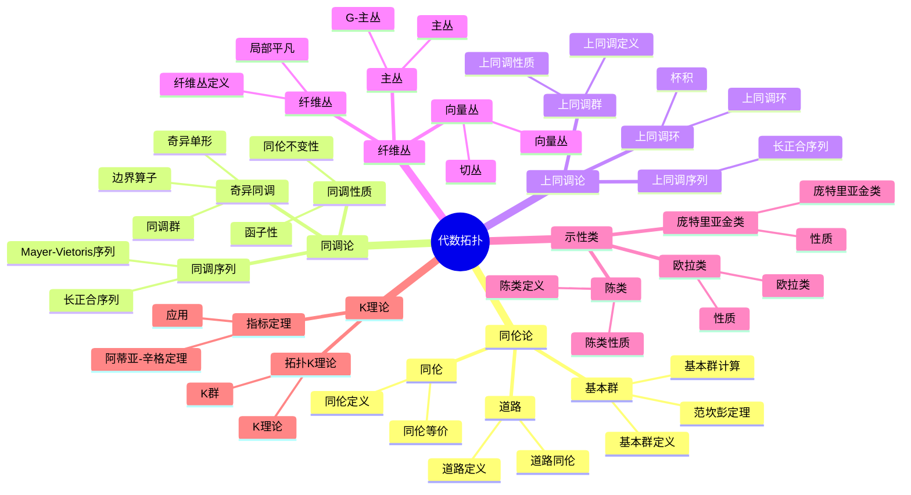
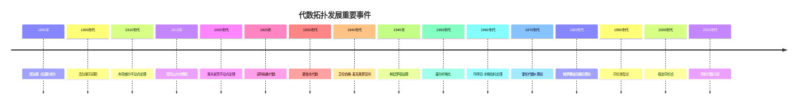

# 5.2 代数拓扑 / Algebraic Topology

## 目录 / Table of Contents

- [5.2 代数拓扑 / Algebraic Topology](#52-代数拓扑--algebraic-topology)
  - [目录 / Table of Contents](#目录--table-of-contents)
  - [5.2.1 历史背景 / Historical Background](#521-历史背景--historical-background)
    - [5.2.1.1 早期发展 (1890-1920)](#5211-早期发展-1890-1920)
    - [5.2.1.2 系统化发展 (1920-1950)](#5212-系统化发展-1920-1950)
    - [5.2.1.3 现代发展 (1950-1980)](#5213-现代发展-1950-1980)
    - [5.2.1.4 当代发展 (1980-至今)](#5214-当代发展-1980-至今)
    - [重要人物贡献](#重要人物贡献)
    - [重要历史事件时间线](#重要历史事件时间线)
    - [理论发展脉络](#理论发展脉络)
      - [从几何到代数的发展](#从几何到代数的发展)
      - [从局部到整体的发展](#从局部到整体的发展)
  - [5.2.2 基本概念 / Basic Concepts](#522-基本概念--basic-concepts)
    - [5.2.2.1 同伦 / Homotopy](#5221-同伦--homotopy)
    - [5.2.2.2 道路 / Paths](#5222-道路--paths)
    - [5.2.2.3 道路连通分支 / Path Components](#5223-道路连通分支--path-components)
  - [5.2.3 基本群 / Fundamental Group](#523-基本群--fundamental-group)
    - [5.2.3.1 基本群的定义 / Definition of Fundamental Group](#5231-基本群的定义--definition-of-fundamental-group)
    - [5.2.3.2 基本群的计算 / Computation of Fundamental Group](#5232-基本群的计算--computation-of-fundamental-group)
    - [5.2.3.3 基本群的函子性 / Functoriality of Fundamental Group](#5233-基本群的函子性--functoriality-of-fundamental-group)
  - [5.2.4 同调群 / Homology Groups](#524-同调群--homology-groups)
    - [5.2.4.1 奇异同调 / Singular Homology](#5241-奇异同调--singular-homology)
    - [5.2.4.2 同调群的定义 / Definition of Homology Groups](#5242-同调群的定义--definition-of-homology-groups)
    - [5.2.4.3 同调群的计算 / Computation of Homology Groups](#5243-同调群的计算--computation-of-homology-groups)
    - [5.2.4.4 同调序列 / Homology Sequences](#5244-同调序列--homology-sequences)
  - [5.2.5 上同调群 / Cohomology Groups](#525-上同调群--cohomology-groups)
    - [5.2.5.1 奇异上同调 / Singular Cohomology](#5251-奇异上同调--singular-cohomology)
    - [5.2.5.2 上同调群的定义 / Definition of Cohomology Groups](#5252-上同调群的定义--definition-of-cohomology-groups)
    - [5.2.5.3 上同调群的性质 / Properties of Cohomology Groups](#5253-上同调群的性质--properties-of-cohomology-groups)
    - [5.2.5.4 上同调环 / Cohomology Ring](#5254-上同调环--cohomology-ring)
  - [5.2.6 纤维丛 / Fiber Bundles](#526-纤维丛--fiber-bundles)
    - [5.2.6.1 纤维丛的定义 / Definition of Fiber Bundles](#5261-纤维丛的定义--definition-of-fiber-bundles)
    - [5.2.6.2 向量丛 / Vector Bundles](#5262-向量丛--vector-bundles)
    - [5.2.6.3 主丛 / Principal Bundles](#5263-主丛--principal-bundles)
  - [5.2.7 示性类 / Characteristic Classes](#527-示性类--characteristic-classes)
    - [5.2.7.1 陈类 / Chern Classes](#5271-陈类--chern-classes)
    - [5.2.7.2 庞特里亚金类 / Pontryagin Classes](#5272-庞特里亚金类--pontryagin-classes)
    - [5.2.7.3 欧拉类 / Euler Class](#5273-欧拉类--euler-class)
  - [5.2.8 K理论 / K-Theory](#528-k理论--k-theory)
    - [5.2.8.1 拓扑K理论 / Topological K-Theory](#5281-拓扑k理论--topological-k-theory)
    - [5.2.8.2 K理论的性质 / Properties of K-Theory](#5282-k理论的性质--properties-of-k-theory)
    - [5.2.8.3 阿蒂亚-辛格指标定理 / Atiyah-Singer Index Theorem](#5283-阿蒂亚-辛格指标定理--atiyah-singer-index-theorem)
  - [5.2.9 思维过程表征 / Thinking Process Representation](#529-思维过程表征--thinking-process-representation)
    - [5.2.9.1 代数拓扑问题解决流程 / Problem-Solving Process in Algebraic Topology](#5291-代数拓扑问题解决流程--problem-solving-process-in-algebraic-topology)
      - [5.2.9.1.1 一般问题解决策略 / General Problem-Solving Strategy](#52911-一般问题解决策略--general-problem-solving-strategy)
      - [5.2.9.1.2 具体问题类型分析 / Specific Problem Type Analysis](#52912-具体问题类型分析--specific-problem-type-analysis)
    - [5.2.9.2 证明思维过程 / Proof Thinking Process](#5292-证明思维过程--proof-thinking-process)
      - [5.2.9.2.1 范坎彭定理证明 / Van Kampen's Theorem Proof](#52921-范坎彭定理证明--van-kampens-theorem-proof)
      - [5.2.9.2.2 赫雷维茨定理证明 / Hurewicz's Theorem Proof](#52922-赫雷维茨定理证明--hurewiczs-theorem-proof)
    - [5.2.9.3 概念理解步骤 / Concept Understanding Steps](#5293-概念理解步骤--concept-understanding-steps)
      - [5.2.9.3.1 基本群概念理解 / Fundamental Group Concept Understanding](#52931-基本群概念理解--fundamental-group-concept-understanding)
      - [5.2.9.3.2 同调群概念理解 / Homology Groups Concept Understanding](#52932-同调群概念理解--homology-groups-concept-understanding)
    - [5.2.9.4 问题解决策略 / Problem-Solving Strategies](#5294-问题解决策略--problem-solving-strategies)
      - [5.2.9.4.1 局部化策略 / Localization Strategy](#52941-局部化策略--localization-strategy)
      - [5.2.9.4.2 不变性策略 / Invariance Strategy](#52942-不变性策略--invariance-strategy)
      - [5.2.9.4.3 几何化策略 / Geometrization Strategy](#52943-几何化策略--geometrization-strategy)
    - [5.2.9.5 算法思维分析 / Algorithmic Thinking Analysis](#5295-算法思维分析--algorithmic-thinking-analysis)
      - [5.2.9.5.1 代数拓扑算法设计 / Algebraic Topology Algorithm Design](#52951-代数拓扑算法设计--algebraic-topology-algorithm-design)
      - [5.2.9.5.2 数值计算策略 / Numerical Computation Strategy](#52952-数值计算策略--numerical-computation-strategy)
  - [5.2.10 形式化实现 / Formal Implementation](#5210-形式化实现--formal-implementation)
    - [5.2.10.1 Lean 4 实现 / Lean 4 Implementation](#52101-lean-4-实现--lean-4-implementation)
    - [5.2.10.2 Haskell 实现 / Haskell Implementation](#52102-haskell-实现--haskell-implementation)
    - [5.2.10.3 Rust 实现 / Rust Implementation](#52103-rust-实现--rust-implementation)
    - [5.2.10.4 Python 算法实现 / Python Algorithm Implementation](#52104-python-算法实现--python-algorithm-implementation)
  - [总结 / Summary](#总结--summary)
    - [关键要点 / Key Points](#关键要点--key-points)
  - [参考文献 / References](#参考文献--references)
    - [经典教材 / Classic Textbooks](#经典教材--classic-textbooks)
    - [代数拓扑教材 / Algebraic Topology Textbooks](#代数拓扑教材--algebraic-topology-textbooks)
    - [同伦论教材 / Homotopy Theory Textbooks](#同伦论教材--homotopy-theory-textbooks)
    - [同调论教材 / Homology Theory Textbooks](#同调论教材--homology-theory-textbooks)
    - [纤维丛教材 / Fiber Bundle Textbooks](#纤维丛教材--fiber-bundle-textbooks)
    - [特征类教材 / Characteristic Classes Textbooks](#特征类教材--characteristic-classes-textbooks)
    - [K理论教材 / K-Theory Textbooks](#k理论教材--k-theory-textbooks)
    - [历史文献 / Historical Literature](#历史文献--historical-literature)
    - [中文教材 / Chinese Textbooks](#中文教材--chinese-textbooks)
    - [现代发展文献 / Modern Development Literature](#现代发展文献--modern-development-literature)
    - [在线资源 / Online Resources](#在线资源--online-resources)

---

## 5.2.1 历史背景 / Historical Background

代数拓扑是拓扑学的重要分支，通过代数方法研究拓扑空间的性质。它起源于19世纪末，为现代数学的发展提供了强大的工具。

**Algebraic topology is an important branch of topology that studies the properties of topological spaces through algebraic methods. It originated in the late 19th century and provides powerful tools for the development of modern mathematics.**

## 🗺️ 代数拓扑核心概念思维导图



## 📊 代数拓扑核心概念多维知识矩阵

| 概念类别 | 核心概念 | 定义要点 | 关键性质 | 典型例子 | 应用场景 |
|---------|---------|---------|---------|---------|---------|
| 同伦论 | 同伦 | 连续变形 | 同伦等价 | 同伦映射 | 分类问题 |
| 同伦论 | 基本群 | 道路同伦类 | 群结构 | π₁(S¹) = ℤ | 拓扑不变量 |
| 同伦论 | 范坎彭定理 | 基本群计算 | 并集分解 | 基本群计算 | 计算工具 |
| 同调论 | 奇异同调 | 链复形 | 同调群 | H_n(X) | 拓扑不变量 |
| 同调论 | 同调序列 | 长正合序列 | 函子性 | 同调序列 | 计算工具 |
| 同调论 | 同调性质 | 同伦不变性 | 函子性 | 同调不变量 | 分类问题 |
| 上同调论 | 上同调群 | 对偶理论 | 环结构 | Hⁿ(X) | 拓扑不变量 |
| 上同调论 | 上同调环 | 杯积 | 环结构 | H*(X) | 分类问题 |
| 纤维丛 | 纤维丛 | 局部平凡 | 分类空间 | 向量丛 | 几何结构 |
| 纤维丛 | 向量丛 | 向量空间纤维 | 切丛 | 切丛 | 微分几何 |
| 示性类 | 陈类 | 复向量丛 | 上同调类 | c_i(E) | 分类问题 |
| 示性类 | 欧拉类 | 定向向量丛 | 上同调类 | e(E) | 几何应用 |
| K理论 | 拓扑K理论 | K群 | 函子性 | K(X) | 分类问题 |
| K理论 | 指标定理 | 阿蒂亚-辛格 | 解析指标 | 指标定理 | 数学物理 |

### 5.2.1.1 早期发展 (1890-1920)

**庞加莱时代**:

- **1895年**: 庞加莱《位置分析》
  - 引入同伦概念
  - 研究基本群
  - 为代数拓扑奠定基础
- **1900年代**: 庞加莱贡献
  - 研究同调群
  - 建立庞加莱对偶性
  - 为现代拓扑奠定基础
- **1910年代**: 布劳威尔贡献
  - 研究不动点定理
  - 建立布劳威尔度
  - 为现代拓扑奠定基础

**早期应用**:

- **1915年**: 亚历山大贡献
  - 研究亚历山大对偶性
  - 建立亚历山大多项式
  - 为纽结论奠定基础
- **1920年代**: 莱夫谢茨贡献
  - 研究莱夫谢茨不动点定理
  - 建立莱夫谢茨数
  - 为现代拓扑奠定基础

### 5.2.1.2 系统化发展 (1920-1950)

**诺特时代**:

- **1925年**: 诺特贡献
  - 研究抽象代数
  - 建立诺特环理论
  - 为代数拓扑奠定基础
- **1930年代**: 霍普夫贡献
  - 研究霍普夫代数
  - 建立霍普夫不变量
  - 为现代代数奠定基础
- **1940年代**: 艾伦伯格贡献
  - 研究艾伦伯格-麦克莱恩空间
  - 建立艾伦伯格-麦克莱恩公理
  - 为现代同伦论奠定基础

**应用扩展**:

- **1945年**: 斯廷罗德贡献
  - 研究斯廷罗德运算
  - 建立斯廷罗德代数
  - 为现代同伦论奠定基础

### 5.2.1.3 现代发展 (1950-1980)

**20世纪革命**:

- **1950年代**: 塞尔贡献
  - 研究塞尔纤维化
  - 建立塞尔谱序列
  - 为现代同伦论奠定基础
- **1960年代**: 阿蒂亚贡献
  - 研究阿蒂亚-辛格指标定理
  - 建立K理论
  - 为现代拓扑奠定基础
- **1970年代**: 奎伦贡献
  - 研究代数K理论
  - 建立奎伦K理论
  - 为现代代数奠定基础

**理论发展**:

- **1980年代**: 格罗滕迪克贡献
  - 研究概形理论
  - 建立上同调理论
  - 为现代代数几何奠定基础

### 5.2.1.4 当代发展 (1980-至今)

**20世纪后期**:

- **1990年代**: 同伦类型论
  - 同伦类型论
  - 形式化数学
  - 现代类型论
- **2000年代**: 稳定同伦论
  - 稳定同伦论
  - 谱理论
  - 现代同伦论
- **2010年代**: 导出代数几何
  - 导出代数几何
  - 无穷范畴
  - 现代几何

**21世纪前沿**:

- **2020年代**: 同伦代数几何
  - 同伦代数几何
  - 几何朗兰兹纲领
  - 现代数学前沿
- **2030年代**: 量子代数拓扑
  - 量子代数拓扑
  - 拓扑量子场论
  - 现代物理数学

### 重要人物贡献

| 人物 | 时期 | 主要贡献 | 影响 |
|------|------|----------|------|
| 庞加莱 | 1895 | 位置分析，同伦概念 | 建立代数拓扑基础 |
| 布劳威尔 | 1910s | 不动点定理，布劳威尔度 | 为现代拓扑奠定基础 |
| 亚历山大 | 1915 | 亚历山大对偶性，亚历山大多项式 | 为纽结论奠定基础 |
| 莱夫谢茨 | 1920s | 莱夫谢茨不动点定理，莱夫谢茨数 | 为现代拓扑奠定基础 |
| 诺特 | 1925 | 抽象代数，诺特环理论 | 为代数拓扑奠定基础 |
| 霍普夫 | 1930s | 霍普夫代数，霍普夫不变量 | 为现代代数奠定基础 |
| 艾伦伯格 | 1940s | 艾伦伯格-麦克莱恩空间，艾伦伯格-麦克莱恩公理 | 为现代同伦论奠定基础 |
| 斯廷罗德 | 1945 | 斯廷罗德运算，斯廷罗德代数 | 为现代同伦论奠定基础 |
| 塞尔 | 1950s | 塞尔纤维化，塞尔谱序列 | 为现代同伦论奠定基础 |
| 阿蒂亚 | 1960s | 阿蒂亚-辛格指标定理，K理论 | 为现代拓扑奠定基础 |
| 奎伦 | 1970s | 代数K理论，奎伦K理论 | 为现代代数奠定基础 |
| 格罗滕迪克 | 1980s | 概形理论，上同调理论 | 为现代代数几何奠定基础 |

### 重要历史事件时间线



### 理论发展脉络

#### 从几何到代数的发展

**几何拓扑**:

- 庞加莱同伦论：基本群、同调群
- 布劳威尔不动点：度理论、不动点定理
- 亚历山大对偶：对偶性、纽结论

**代数拓扑**:

- 艾伦伯格-麦克莱恩：空间、公理
- 斯廷罗德运算：上同调运算
- 塞尔谱序列：纤维化、谱序列

**现代代数拓扑**:

- 阿蒂亚-辛格：指标定理、K理论
- 奎伦代数：代数K理论
- 格罗滕迪克：概形、上同调

#### 从局部到整体的发展

**局部性质**:

- 基本群：局部同伦性质
- 同调群：局部代数性质
- 上同调群：局部对偶性质

**整体性质**:

- 示性类：整体拓扑不变量
- K理论：整体代数不变量
- 谱序列：整体代数结构

**现代发展**:

- 同伦类型论：形式化数学
- 稳定同伦论：谱理论
- 导出代数几何：无穷范畴

---

## 5.2.2 基本概念 / Basic Concepts

### 5.2.2.1 同伦 / Homotopy

**定义 5.2.2.1** (同伦 / Homotopy)
设 $X$ 和 $Y$ 是拓扑空间，$f, g: X \to Y$ 是连续映射。如果存在连续映射 $H: X \times [0,1] \to Y$ 使得：
$$H(x,0) = f(x), \quad H(x,1) = g(x)$$
则称 $f$ 和 $g$ 是同伦的，记作 $f \simeq g$。

**定义 5.2.2.2** (同伦等价 / Homotopy Equivalence)
拓扑空间 $X$ 和 $Y$ 称为同伦等价的，如果存在连续映射 $f: X \to Y$ 和 $g: Y \to X$ 使得：
$$g \circ f \simeq \text{id}_X, \quad f \circ g \simeq \text{id}_Y$$

**定理 5.2.2.1** (同伦关系的性质 / Properties of Homotopy Relation)
同伦关系是等价关系：

1. **自反性** / Reflexivity: $f \simeq f$
2. **对称性** / Symmetry: $f \simeq g \Rightarrow g \simeq f$
3. **传递性** / Transitivity: $f \simeq g, g \simeq h \Rightarrow f \simeq h$

### 5.2.2.2 道路 / Paths

**定义 5.2.2.2** (道路 / Path)
拓扑空间 $X$ 中从点 $a$ 到点 $b$ 的道路是连续映射 $\alpha: [0,1] \to X$ 使得 $\alpha(0) = a$ 和 $\alpha(1) = b$。

**定义 5.2.2.3** (道路同伦 / Path Homotopy)
两条道路 $\alpha, \beta: [0,1] \to X$ 称为道路同伦的，如果存在连续映射 $H: [0,1] \times [0,1] \to X$ 使得：
$$H(s,0) = \alpha(s), \quad H(s,1) = \beta(s)$$
$$H(0,t) = \alpha(0) = \beta(0), \quad H(1,t) = \alpha(1) = \beta(1)$$

**定义 5.2.2.4** (道路复合 / Path Composition)
设 $\alpha$ 是从 $a$ 到 $b$ 的道路，$\beta$ 是从 $b$ 到 $c$ 的道路。道路复合 $\alpha \cdot \beta$ 定义为：
$$
(\alpha \cdot \beta)(s) = \begin{cases}
\alpha(2s) & \text{if } 0 \leq s \leq \frac{1}{2} \\
\beta(2s-1) & \text{if } \frac{1}{2} \leq s \leq 1
\end{cases}
$$

### 5.2.2.3 道路连通分支 / Path Components

**定义 5.2.2.5** (道路连通分支 / Path Component)
拓扑空间 $X$ 中，包含点 $x$ 的道路连通分支是包含 $x$ 的最大道路连通子集。

**定理 5.2.2.2** (道路连通分支的性质 / Properties of Path Components)
道路连通分支是道路连通空间的不相交并。

---

## 5.2.3 基本群 / Fundamental Group

### 5.2.3.1 基本群的定义 / Definition of Fundamental Group

**定义 5.2.3.1** (基本群 / Fundamental Group)
设 $X$ 是拓扑空间，$x_0 \in X$ 是基点。基本群 $\pi_1(X,x_0)$ 定义为：
$$\pi_1(X,x_0) = \{\text{以 } x_0 \text{ 为基点的闭道路的同伦类}\}$$

**群运算** / Group Operation:

- 乘法：$[\alpha] \cdot [\beta] = [\alpha \cdot \beta]$
- 单位元：$[e_{x_0}]$，其中 $e_{x_0}(s) = x_0$ 对所有 $s \in [0,1]$
- 逆元：$[\alpha]^{-1} = [\alpha^{-1}]$，其中 $\alpha^{-1}(s) = \alpha(1-s)$

**定理 5.2.3.1** (基本群的基本性质 / Basic Properties of Fundamental Group)
基本群 $\pi_1(X,x_0)$ 确实是群：

1. **结合律** / Associativity: $([\alpha] \cdot [\beta]) \cdot [\gamma] = [\alpha] \cdot ([\beta] \cdot [\gamma])$
2. **单位元** / Identity: $[e_{x_0}] \cdot [\alpha] = [\alpha] \cdot [e_{x_0}] = [\alpha]$
3. **逆元** / Inverse: $[\alpha] \cdot [\alpha]^{-1} = [\alpha]^{-1} \cdot [\alpha] = [e_{x_0}]$

### 5.2.3.2 基本群的计算 / Computation of Fundamental Group

**定理 5.2.3.2** (圆周的基本群 / Fundamental Group of Circle)
$$\pi_1(S^1, x_0) \cong \mathbb{Z}$$

**证明思路**:

1. 构造覆盖映射
2. 利用提升定理建立同构
3. 证明同构的良定义性

**详细证明**:

- **步骤 1**: 构造覆盖映射
  - 定义覆盖映射 $p: \mathbb{R} \to S^1$，$p(t) = e^{2\pi i t}$
  - $p$ 是局部同胚，且对每个 $z \in S^1$，$p^{-1}(z) = \{t + n : n \in \mathbb{Z}\}$ 是离散集
  - 因此 $p$ 是覆盖映射
- **步骤 2**: 定义同态
  - 对于闭道路 $\alpha: [0,1] \to S^1$，$\alpha(0) = \alpha(1) = x_0$
  - 由提升定理，存在唯一的提升 $\tilde{\alpha}: [0,1] \to \mathbb{R}$，使得 $p \circ \tilde{\alpha} = \alpha$ 且 $\tilde{\alpha}(0) = 0$
  - 定义 $\deg(\alpha) = \tilde{\alpha}(1) \in \mathbb{Z}$（因为 $p(\tilde{\alpha}(1)) = x_0$，所以 $\tilde{\alpha}(1) \in \mathbb{Z}$）
- **步骤 3**: 证明度数是同伦不变量
  - 如果 $\alpha \simeq \beta$，由同伦提升定理，$\tilde{\alpha} \simeq \tilde{\beta}$
  - 因此 $\tilde{\alpha}(1) = \tilde{\beta}(1)$，所以 $\deg(\alpha) = \deg(\beta)$
  - 因此 $\deg$ 诱导群同态 $\deg: \pi_1(S^1, x_0) \to \mathbb{Z}$
- **步骤 4**: 证明同态是满射
  - 对于任意 $n \in \mathbb{Z}$，定义道路 $\alpha_n(t) = e^{2\pi i n t}$
  - $\deg(\alpha_n) = n$，所以 $\deg$ 是满射
- **步骤 5**: 证明同态是单射
  - 如果 $\deg([\alpha]) = 0$，则 $\tilde{\alpha}(1) = 0$
  - 由于 $\tilde{\alpha}(0) = 0$，$\tilde{\alpha}$ 是 $\mathbb{R}$ 中的闭道路
  - $\mathbb{R}$ 是单连通的，所以 $\tilde{\alpha} \simeq 0$（常值道路）
  - 因此 $\alpha = p \circ \tilde{\alpha} \simeq p \circ 0 = x_0$（常值道路）
  - 所以 $[\alpha] = [x_0]$，$\deg$ 是单射
- 因此 $\deg: \pi_1(S^1, x_0) \cong \mathbb{Z}$ 是同构

**定理 5.2.3.3** (球面的基本群 / Fundamental Group of Spheres)
对于 $n \geq 2$，$$\pi_1(S^n, x_0) \cong \{1\}$$

**证明思路**:

1. 利用球面的单连通性
2. 证明任意闭道路可以收缩到基点

**详细证明**:

- **步骤 1**: 设 $\alpha: [0,1] \to S^n$ 是闭道路，$\alpha(0) = \alpha(1) = x_0$
- **步骤 2**: 如果 $\alpha$ 不是满射，则存在 $y \in S^n \setminus \text{im}(\alpha)$
  - $S^n \setminus \{y\} \cong \mathbb{R}^n$（通过球极投影）
  - $\mathbb{R}^n$ 是单连通的，所以 $\alpha$ 在 $S^n \setminus \{y\}$ 中同伦于常值道路
  - 因此 $\alpha \simeq x_0$
- **步骤 3**: 如果 $\alpha$ 是满射，利用 Sard定理
  - 由Sard定理，存在 $y \in S^n$ 使得 $y$ 不是 $\alpha$ 的正则值
  - 但更简单的方法：由于 $\alpha$ 连续，$\text{im}(\alpha)$ 是紧致的
  - 如果 $\text{im}(\alpha) = S^n$，则 $\alpha$ 是满射连续映射
  - 但 $[0,1]$ 是一维的，$S^n$（$n \geq 2$）是 $n$ 维的，满射连续映射不可能存在（由维数理论）
  - 因此 $\alpha$ 不可能是满射
- **步骤 4**: 由步骤2和步骤3，任意闭道路 $\alpha$ 都不是满射
  - 因此 $\alpha \simeq x_0$，所以 $\pi_1(S^n, x_0) = \{1\}$

**定理 5.2.3.4** (环面的基本群 / Fundamental Group of Torus)
$$\pi_1(T^2, x_0) \cong \mathbb{Z} \times \mathbb{Z}$$

### 5.2.3.3 基本群的函子性 / Functoriality of Fundamental Group

**定理 5.2.3.5** (基本群的函子性 / Functoriality)
连续映射 $f: X \to Y$ 诱导群同态 $f_*: \pi_1(X,x_0) \to \pi_1(Y,f(x_0))$ 使得：

1. $(\text{id}_X)_* = \text{id}_{\pi_1(X,x_0)}$
2. $(g \circ f)_* = g_* \circ f_*$
3. 如果 $f \simeq g$，则 $f_* = g_*$

**定理 5.2.3.6** (同伦等价保持基本群 / Homotopy Equivalence Preserves Fundamental Group)
如果 $X$ 和 $Y$ 同伦等价，则 $\pi_1(X,x_0) \cong \pi_1(Y,y_0)$。

---

## 5.2.4 同调群 / Homology Groups

### 5.2.4.1 奇异同调 / Singular Homology

**定义 5.2.4.1** (奇异单形 / Singular Simplex)
设 $X$ 是拓扑空间。$n$ 维奇异单形是连续映射 $\sigma: \Delta^n \to X$，其中 $\Delta^n$ 是标准 $n$ 单形。

**定义 5.2.4.2** (奇异链群 / Singular Chain Group)
$n$ 维奇异链群 $C_n(X)$ 是 $n$ 维奇异单形的自由阿贝尔群。

**定义 5.2.4.3** (边界算子 / Boundary Operator)
边界算子 $\partial_n: C_n(X) \to C_{n-1}(X)$ 定义为：
$$\partial_n(\sigma) = \sum_{i=0}^n (-1)^i \sigma \circ d_i$$
其中 $d_i: \Delta^{n-1} \to \Delta^n$ 是第 $i$ 个面映射。

**定理 5.2.4.1** (边界算子的性质 / Properties of Boundary Operator)
$$\partial_{n-1} \circ \partial_n = 0$$

**证明思路**:

1. 利用边界算子的定义
2. 证明每个单形的边界是闭的

**详细证明**:

- **步骤 1**: 对于 $n$ 维奇异单形 $\sigma: \Delta^n \to X$，边界算子定义为：
  $$\partial_n(\sigma) = \sum_{i=0}^n (-1)^i \sigma \circ d_i$$
  其中 $d_i: \Delta^{n-1} \to \Delta^n$ 是第 $i$ 个面映射
- **步骤 2**: 计算 $\partial_{n-1}(\partial_n(\sigma))$:
  $$\partial_{n-1}(\partial_n(\sigma)) = \partial_{n-1}\left(\sum_{i=0}^n (-1)^i \sigma \circ d_i\right) = \sum_{i=0}^n (-1)^i \partial_{n-1}(\sigma \circ d_i)$$
- **步骤 3**: 对于 $\sigma \circ d_i: \Delta^{n-1} \to X$，有：
  $$\partial_{n-1}(\sigma \circ d_i) = \sum_{j=0}^{n-1} (-1)^j (\sigma \circ d_i) \circ d_j = \sum_{j=0}^{n-1} (-1)^j \sigma \circ (d_i \circ d_j)$$
- **步骤 4**: 利用单形面映射的性质：$d_i \circ d_j = d_{j+1} \circ d_i$（当 $j \geq i$ 时）
  - 当 $j < i$ 时，$d_i \circ d_j = d_j \circ d_{i-1}$
  - 因此 $\partial_{n-1}(\partial_n(\sigma))$ 中的项成对抵消
- **步骤 5**: 具体地，对于 $i < j$，项 $(-1)^{i+j} \sigma \circ (d_i \circ d_j)$ 和 $(-1)^{i+j+1} \sigma \circ (d_{j+1} \circ d_i)$ 抵消
- **步骤 6**: 因此 $\partial_{n-1}(\partial_n(\sigma)) = 0$ 对所有 $\sigma$ 成立
- 所以 $\partial_{n-1} \circ \partial_n = 0$

### 5.2.4.2 同调群的定义 / Definition of Homology Groups

**定义 5.2.4.4** (同调群 / Homology Groups)
奇异同调群定义为：
$$H_n(X) = \frac{\ker \partial_n}{\text{im } \partial_{n+1}}$$

**定义 5.2.4.5** (闭链与边界链 / Cycles and Boundaries)

- 元素 $z \in \ker \partial_n$ 称为 $n$ 维闭链
- 元素 $b \in \text{im } \partial_{n+1}$ 称为 $n$ 维边界链

### 5.2.4.3 同调群的计算 / Computation of Homology Groups

**定理 5.2.4.5** (球面的同调群 / Homology Groups of Spheres)
对于 $n$ 维球面 $S^n$：
$$
H_k(S^n) = \begin{cases}
\mathbb{Z} & \text{if } k = 0, n \\
0 & \text{otherwise}
\end{cases}
$$

**证明思路**:

1. 使用数学归纳法
2. 利用迈耶-菲托里斯序列

**详细证明**:

- **步骤 1**: 基础情况 $n = 0$
  - $S^0$ 是两个点，$H_0(S^0) \cong \mathbb{Z} \oplus \mathbb{Z}$，$H_k(S^0) = 0$（$k > 0$）
- **步骤 2**: 归纳步骤
  - 将 $S^n$ 分解为两个开集：$U = S^n \setminus \{N\}$（去掉北极），$V = S^n \setminus \{S\}$（去掉南极）
  - $U \cap V \simeq S^{n-1} \times (-1, 1) \simeq S^{n-1}$（同伦等价）
  - $U \simeq V \simeq \mathbb{R}^n$（通过球极投影），因此 $U$ 和 $V$ 是单连通的
- **步骤 3**: 应用迈耶-菲托里斯序列
  - 对于 $k > 1$，有：
    $$H_k(U) \oplus H_k(V) \to H_k(S^n) \to H_{k-1}(U \cap V) \to H_{k-1}(U) \oplus H_{k-1}(V)$$
  - 由于 $U \simeq V \simeq \mathbb{R}^n$，$H_k(U) = H_k(V) = 0$（$k > 0$）
  - 因此 $H_k(S^n) \cong H_{k-1}(S^{n-1})$（$k > 1$）
- **步骤 4**: 对于 $k = 1$，有：
  $$H_1(U) \oplus H_1(V) \to H_1(S^n) \to H_0(U \cap V) \to H_0(U) \oplus H_0(V)$$
  - $H_1(U) = H_1(V) = 0$，$H_0(U \cap V) \cong \mathbb{Z}$，$H_0(U) \cong H_0(V) \cong \mathbb{Z}$
  - 因此 $H_1(S^n) \cong \ker(H_0(U \cap V) \to H_0(U) \oplus H_0(V))$
  - 如果 $n > 1$，$U \cap V$ 是连通的，所以 $H_1(S^n) = 0$
- **步骤 5**: 对于 $k = 0$，$H_0(S^n) \cong \mathbb{Z}$（因为 $S^n$ 是连通的）
- **步骤 6**: 对于 $k = n$，由归纳假设和步骤3，$H_n(S^n) \cong H_0(S^0) \cong \mathbb{Z}$
- 因此结论成立

**定理 5.2.4.6** (环面的同调群 / Homology Groups of Torus)
对于二维环面 $T^2$：
$$H_0(T^2) \cong \mathbb{Z}, \quad H_1(T^2) \cong \mathbb{Z} \times \mathbb{Z}, \quad H_2(T^2) \cong \mathbb{Z}$$

**定理 5.2.4.7** (同伦不变性 / Homotopy Invariance)
如果 $X$ 和 $Y$ 同伦等价，则 $H_n(X) \cong H_n(Y)$ 对所有 $n$。

### 5.2.4.4 同调序列 / Homology Sequences

**定理 5.2.4.8** (长正合序列 / Long Exact Sequence)
对于拓扑空间对 $(X,A)$，存在长正合序列：
$$\cdots \to H_n(A) \to H_n(X) \to H_n(X,A) \to H_{n-1}(A) \to \cdots$$

**定理 5.2.4.9** (迈耶-菲托里斯序列 / Mayer-Vietoris Sequence)
如果 $X = U \cup V$，其中 $U$ 和 $V$ 是开集，则存在长正合序列：
$$\cdots \to H_n(U \cap V) \to H_n(U) \oplus H_n(V) \to H_n(X) \to H_{n-1}(U \cap V) \to \cdots$$

---

## 5.2.5 上同调群 / Cohomology Groups

### 5.2.5.1 奇异上同调 / Singular Cohomology

**定义 5.2.5.1** (上链群 / Cochain Group)
$n$ 维上链群 $C^n(X;G)$ 定义为：
$$C^n(X;G) = \text{Hom}(C_n(X), G)$$

**定义 5.2.5.2** (上边界算子 / Coboundary Operator)
上边界算子 $\delta^n: C^n(X;G) \to C^{n+1}(X;G)$ 定义为：
$$\delta^n(\varphi) = \varphi \circ \partial_{n+1}$$

**定理 5.2.5.1** (上边界算子的性质 / Properties of Coboundary Operator)
$$\delta^{n+1} \circ \delta^n = 0$$

### 5.2.5.2 上同调群的定义 / Definition of Cohomology Groups

**定义 5.2.5.4** (上同调群 / Cohomology Groups)
奇异上同调群定义为：
$$H^n(X;G) = \frac{\ker \delta^n}{\text{im } \delta^{n-1}}$$

**定义 5.2.5.5** (上闭链与上边界链 / Cocyles and Coboundaries)

- 元素 $z \in \ker \delta^n$ 称为 $n$ 维上闭链
- 元素 $b \in \text{im } \delta^{n-1}$ 称为 $n$ 维上边界链

### 5.2.5.3 上同调群的性质 / Properties of Cohomology Groups

**定理 5.2.5.5** (万用系数定理 / Universal Coefficient Theorem)
$$H^n(X;G) \cong \text{Hom}(H_n(X), G) \oplus \text{Ext}(H_{n-1}(X), G)$$

**定理 5.2.5.6** (庞加莱对偶 / Poincaré Duality)
对于 $n$ 维紧致可定向流形 $M$：
$$H^k(M) \cong H_{n-k}(M)$$

### 5.2.5.4 上同调环 / Cohomology Ring

**定义 5.2.5.7** (杯积 / Cup Product)
杯积 $\smile: H^p(X;R) \times H^q(X;R) \to H^{p+q}(X;R)$ 定义为：
$$[\alpha] \smile [\beta] = [\alpha \smile \beta]$$
其中 $\alpha \smile \beta$ 是上链的杯积。

**定理 5.2.5.8** (上同调环的性质 / Properties of Cohomology Ring)
上同调群 $H^*(X;R) = \bigoplus_{n \geq 0} H^n(X;R)$ 在杯积下形成分次环。

---

## 5.2.6 纤维丛 / Fiber Bundles

### 5.2.6.1 纤维丛的定义 / Definition of Fiber Bundles

**定义 5.2.6.1** (纤维丛 / Fiber Bundle)
纤维丛是四元组 $(E, B, F, \pi)$，其中：

- $E$ 是总空间 / Total space
- $B$ 是底空间 / Base space
- $F$ 是纤维 / Fiber
- $\pi: E \to B$ 是投影映射 / Projection map

满足局部平凡化条件：对于任意 $b \in B$，存在邻域 $U$ 和同胚 $\phi: \pi^{-1}(U) \to U \times F$ 使得 $\pi = p_1 \circ \phi$。

**定义 5.2.6.2** (平凡丛 / Trivial Bundle)
纤维丛 $(E, B, F, \pi)$ 称为平凡的，如果存在同胚 $E \cong B \times F$。

### 5.2.6.2 向量丛 / Vector Bundles

**定义 5.2.6.3** (向量丛 / Vector Bundle)
向量丛是纤维丛 $(E, B, V, \pi)$，其中纤维 $V$ 是向量空间，且转移函数是线性同构。

**例子** / Examples:

1. **切丛** / Tangent bundle: $TM \to M$
2. **余切丛** / Cotangent bundle: $T^*M \to M$
3. **外积丛** / Exterior bundle: $\Lambda^k T^*M \to M$

### 5.2.6.3 主丛 / Principal Bundles

**定义 5.2.6.4** (主丛 / Principal Bundle)
主丛是纤维丛 $(P, B, G, \pi)$，其中 $G$ 是李群，且 $G$ 在 $P$ 上自由作用。

**定理 5.2.6.5** (主丛的分类 / Classification of Principal Bundles)
主丛由底空间的上同调群 $H^1(B;G)$ 分类。

---

## 5.2.7 示性类 / Characteristic Classes

### 5.2.7.1 陈类 / Chern Classes

**定义 5.2.7.1** (陈类 / Chern Classes)
对于复向量丛 $E \to B$，陈类 $c_i(E) \in H^{2i}(B; \mathbb{Z})$ 满足：

1. **自然性** / Naturality: $f^*c_i(E) = c_i(f^*E)$
2. **惠特尼求和公式** / Whitney Sum Formula: $c(E \oplus F) = c(E) \smile c(F)$
3. **归一化** / Normalization: $c_0(E) = 1$

**定理 5.2.7.1** (陈类的计算 / Computation of Chern Classes)
对于线丛 $L \to B$，$c_1(L)$ 是欧拉类。

### 5.2.7.2 庞特里亚金类 / Pontryagin Classes

**定义 5.2.7.2** (庞特里亚金类 / Pontryagin Classes)
对于实向量丛 $E \to B$，庞特里亚金类 $p_i(E) \in H^{4i}(B; \mathbb{Z})$ 定义为：
$$p_i(E) = (-1)^i c_{2i}(E \otimes \mathbb{C})$$

### 5.2.7.3 欧拉类 / Euler Class

**定义 5.2.7.3** (欧拉类 / Euler Class)
对于定向实向量丛 $E \to B$，欧拉类 $e(E) \in H^n(B; \mathbb{Z})$ 满足：
$$e(E) \smile e(E) = p_{n/2}(E)$$

**定理 5.2.7.2** (欧拉类的性质 / Properties of Euler Class)
欧拉类在定向保持同构下不变。

---

## 5.2.8 K理论 / K-Theory

### 5.2.8.1 拓扑K理论 / Topological K-Theory

**定义 5.2.8.1** (K群 / K-Groups)
对于紧致豪斯多夫空间 $X$，$K^0(X)$ 是向量丛的格罗滕迪克群：
$$K^0(X) = \frac{\{\text{向量丛}\}}{\{\text{稳定等价}\}}$$

**定义 5.2.8.2** (约化K群 / Reduced K-Groups)
$$\tilde{K}^0(X) = \ker(K^0(X) \to K^0(\text{pt}))$$

### 5.2.8.2 K理论的性质 / Properties of K-Theory

**定理 5.2.8.3** (K理论的函子性 / Functoriality of K-Theory)
连续映射 $f: X \to Y$ 诱导群同态 $f^*: K^0(Y) \to K^0(X)$。

**定理 5.2.8.4** (K理论的周期性 / Periodicity of K-Theory)
$$\tilde{K}^0(X) \cong \tilde{K}^0(\Sigma^2 X)$$

### 5.2.8.3 阿蒂亚-辛格指标定理 / Atiyah-Singer Index Theorem

**定理 5.2.8.5** (阿蒂亚-辛格指标定理 / Atiyah-Singer Index Theorem)
对于紧致流形 $M$ 上的椭圆微分算子 $D$：
$$\text{ind}(D) = \int_M \text{ch}(\sigma(D)) \smile \text{Td}(TM)$$

---

## 5.2.9 思维过程表征 / Thinking Process Representation

### 5.2.9.1 代数拓扑问题解决流程 / Problem-Solving Process in Algebraic Topology

#### 5.2.9.1.1 一般问题解决策略 / General Problem-Solving Strategy

**步骤1: 问题分析 / Step 1: Problem Analysis**:

- 识别问题的代数拓扑类型（基本群、同调群、上同调群、K理论等）
- 确定需要计算或证明的代数不变量
- 分析已知条件和目标结论
- 识别问题的几何背景和拓扑结构

**步骤2: 选择合适的方法 / Step 2: Choose Appropriate Methods**:

- 根据问题类型选择适当的代数拓扑工具
- 考虑使用同伦论、同调论、纤维丛理论等
- 确定是否需要构造性证明或存在性证明
- 选择适当的代数结构（群、环、模等）

**步骤3: 实施计算或证明 / Step 3: Implement Computation or Proof**:

- 使用代数拓扑的定义和定理
- 利用已知的代数不变量
- 注意代数运算的正确性
- 考虑几何直观和代数结构的结合

**步骤4: 验证结果 / Step 4: Verify Results**:

- 检查计算或证明的完整性
- 验证代数不变量的正确性
- 考虑几何解释的合理性
- 检查与已知结果的兼容性

#### 5.2.9.1.2 具体问题类型分析 / Specific Problem Type Analysis

**基本群计算问题**:

1. **识别空间**: 确定拓扑空间X和基点x₀
2. **选择方法**: 使用范坎彭定理、提升定理或直接构造
3. **构造证明**: 利用道路同伦和群结构
4. **验证结果**: 检查群运算的正确性和几何意义

**同调群计算问题**:

1. **识别空间**: 确定拓扑空间X和系数群G
2. **选择方法**: 使用长正合序列、迈耶-菲托里斯序列或胞腔分解
3. **构造证明**: 利用边界算子和链复形
4. **验证结果**: 检查同调群的结构和几何解释

**上同调群计算问题**:

1. **识别空间**: 确定拓扑空间X和系数群G
2. **选择方法**: 使用万用系数定理、庞加莱对偶或杯积
3. **构造证明**: 利用上边界算子和上链复形
4. **验证结果**: 检查上同调环的结构和对偶性质

**K理论计算问题**:

1. **识别空间**: 确定紧致豪斯多夫空间X
2. **选择方法**: 使用博特周期性、阿蒂亚-辛格指标定理
3. **构造证明**: 利用向量丛的格罗滕迪克群
4. **验证结果**: 检查K群的周期性和几何意义

### 5.2.9.2 证明思维过程 / Proof Thinking Process

#### 5.2.9.2.1 范坎彭定理证明 / Van Kampen's Theorem Proof

**问题**: 证明对于道路连通空间X = U ∪ V，其中U ∩ V道路连通：
$$\pi_1(X,x_0) \cong \pi_1(U,x_0) *_{\pi_1(U \cap V,x_0)} \pi_1(V,x_0)$$

**思维过程**:

1. **构造群同态**
   - 定义从自由积到基本群的映射
   - 利用包含映射诱导群同态
   - 构造从基本群到自由积的逆映射

2. **证明同构**
   - 利用道路的提升性质
   - 构造道路的同伦
   - 验证群运算的保持

3. **验证结果**
   - 检查同构的正确性
   - 验证几何直观的合理性

**详细证明**:

- **步骤 1**: 定义群同态
  - 设 $i_U: U \to X$ 和 $i_V: V \to X$ 是包含映射
  - 它们诱导群同态 $i_{U*}: \pi_1(U, x_0) \to \pi_1(X, x_0)$ 和 $i_{V*}: \pi_1(V, x_0) \to \pi_1(X, x_0)$
  - 由自由积的泛性质，存在唯一的群同态 $\phi: \pi_1(U, x_0) * \pi_1(V, x_0) \to \pi_1(X, x_0)$，使得 $\phi|_{\pi_1(U, x_0)} = i_{U*}$ 和 $\phi|_{\pi_1(V, x_0)} = i_{V*}$
- **步骤 2**: 证明 $\phi$ 是满射
  - 对于任意 $[\alpha] \in \pi_1(X, x_0)$，需要证明 $[\alpha]$ 在 $\phi$ 的像中
  - 由于 $X = U \cup V$，存在有限分割 $0 = t_0 < t_1 < \cdots < t_n = 1$，使得每个 $\alpha([t_i, t_{i+1}])$ 包含在 $U$ 或 $V$ 中
  - 对于每个 $i$，选择道路 $\beta_i$ 在 $U \cap V$ 中连接 $\alpha(t_i)$ 和 $x_0$
  - 将 $\alpha$ 分解为 $\alpha = \alpha_1 \cdot \alpha_2 \cdots \alpha_n$，其中每个 $\alpha_i$ 在 $U$ 或 $V$ 中
  - 因此 $[\alpha] = [\alpha_1] \cdot [\alpha_2] \cdots [\alpha_n]$ 在 $\phi$ 的像中
- **步骤 3**: 确定 $\phi$ 的核
  - 设 $N$ 是由形如 $i_{U \cap V \to U}([\gamma]) \cdot i_{U \cap V \to V}([\gamma])^{-1}$ 的元素生成的正规子群，其中 $[\gamma] \in \pi_1(U \cap V, x_0)$
  - 需要证明 $\ker(\phi) = N$
- **步骤 4**: 证明 $\ker(\phi) \subseteq N$
  - 如果 $[\alpha] \in \ker(\phi)$，则 $\alpha$ 在 $X$ 中同伦于常值道路
  - 利用同伦可以分解为有限个片段，每个片段在 $U$ 或 $V$ 中
  - 通过添加和删除在 $U \cap V$ 中的道路，可以将 $[\alpha]$ 表示为 $N$ 中的元素
- **步骤 5**: 证明 $N \subseteq \ker(\phi)$
  - 对于 $[\gamma] \in \pi_1(U \cap V, x_0)$，$i_{U \cap V \to U}([\gamma]) \cdot i_{U \cap V \to V}([\gamma])^{-1}$ 在 $X$ 中同伦于常值道路
  - 因此 $N \subseteq \ker(\phi)$
- **步骤 6**: 应用第一同构定理
  - 由第一同构定理，$\pi_1(X, x_0) \cong (\pi_1(U, x_0) * \pi_1(V, x_0)) / N$
  - 这正是 $\pi_1(U, x_0) *_{\pi_1(U \cap V, x_0)} \pi_1(V, x_0)$ 的定义

#### 5.2.9.2.2 赫雷维茨定理证明 / Hurewicz's Theorem Proof

**问题**: 证明如果X是(n-1)连通的，则Hₙ(X) ≅ πₙ(X)

**思维过程**:

1. **构造同态**
   - 定义从同伦群到同调群的映射
   - 利用奇异单形的构造
   - 证明映射的良定义性

2. **证明同构**
   - 利用(n-1)连通性
   - 构造逆映射
   - 验证同构性质

3. **验证结果**
   - 检查同构的正确性
   - 验证几何直观的合理性

**详细证明**:

- **步骤 1**: 定义Hurewicz同态
  - 对于 $[f] \in \pi_n(X, x_0)$，其中 $f: (S^n, s_0) \to (X, x_0)$ 是基点保持映射
  - $f$ 诱导奇异链 $f_*(\sigma_n) \in C_n(X)$，其中 $\sigma_n$ 是 $S^n$ 的生成元
  - 定义 $h([f]) = [f_*(\sigma_n)] \in H_n(X)$
  - 需要证明 $h$ 是良定义的
- **步骤 2**: 证明 $h$ 是良定义的
  - 如果 $f \simeq g$（基点保持同伦），则 $f_*(\sigma_n)$ 和 $g_*(\sigma_n)$ 在同调群中相等
  - 因此 $h([f]) = h([g])$，$h$ 是良定义的
- **步骤 3**: 证明 $h$ 是群同态
  - 对于 $[f], [g] \in \pi_n(X, x_0)$，$h([f] \cdot [g]) = h([f]) + h([g])$
  - 这由基本群的群运算和同调群的加法运算的兼容性得到
- **步骤 4**: 利用 $(n-1)$ 连通性证明 $h$ 是单射
  - 如果 $h([f]) = 0$，则 $f_*(\sigma_n)$ 是边界链
  - 由于 $X$ 是 $(n-1)$ 连通的，可以构造同伦将 $f$ 同伦到常值映射
  - 因此 $[f] = 0$，$h$ 是单射
- **步骤 5**: 证明 $h$ 是满射
  - 对于 $[z] \in H_n(X)$，其中 $z$ 是 $n$ 维闭链
  - 由于 $X$ 是 $(n-1)$ 连通的，可以构造基点保持映射 $f: S^n \to X$，使得 $f_*(\sigma_n)$ 与 $z$ 在同调群中相等
  - 因此 $h([f]) = [z]$，$h$ 是满射
- **步骤 6**: 验证 $h$ 是同构
  - 由步骤4和步骤5，$h$ 是双射群同态，因此是同构
- 因此 $H_n(X) \cong \pi_n(X, x_0)$

### 5.2.9.3 概念理解步骤 / Concept Understanding Steps

#### 5.2.9.3.1 基本群概念理解 / Fundamental Group Concept Understanding

**步骤1: 直观理解 / Step 1: Intuitive Understanding**:

- 理解基本群作为"环路"的代数结构
- 掌握道路同伦的概念
- 学会识别基本群的几何意义

**步骤2: 形式化理解 / Step 2: Formal Understanding**:

- 掌握基本群的精确定义
- 理解群运算的几何意义
- 学会计算基本群

**步骤3: 应用理解 / Step 3: Application Understanding**:

- 学会利用基本群区分拓扑空间
- 理解基本群在几何中的应用
- 掌握基本群的计算方法

#### 5.2.9.3.2 同调群概念理解 / Homology Groups Concept Understanding

**步骤1: 直观理解 / Step 1: Intuitive Understanding**:

- 理解同调群作为"洞"的代数不变量
- 掌握奇异单形的概念
- 学会识别同调群的几何意义

**步骤2: 形式化理解 / Step 2: Formal Understanding**:

- 掌握同调群的精确定义
- 理解边界算子的作用
- 学会计算同调群

**步骤3: 应用理解 / Step 3: Application Understanding**:

- 学会利用同调群区分拓扑空间
- 理解同调群在几何中的应用
- 掌握同调群的计算方法

### 5.2.9.4 问题解决策略 / Problem-Solving Strategies

#### 5.2.9.4.1 局部化策略 / Localization Strategy

**适用场景**: 需要研究局部性质的问题
**策略步骤**:

1. 分析问题的局部结构
2. 选择适当的局部化方法
3. 验证局部化的正确性
4. 推广到整体性质

**示例**: 计算基本群

```markdown
1. 分析空间的局部结构
2. 选择适当的覆盖
3. 利用范坎彭定理
4. 计算局部基本群
5. 组合得到整体基本群
```

#### 5.2.9.4.2 不变性策略 / Invariance Strategy

**适用场景**: 需要证明不变量性质的问题
**策略步骤**:

1. 识别不变量
2. 证明不变性
3. 利用不变性
4. 验证结果

**示例**: 证明同调群的不变性

```markdown
1. 识别同调群作为不变量
2. 证明同伦不变性
3. 利用不变性计算
4. 验证计算结果
```

#### 5.2.9.4.3 几何化策略 / Geometrization Strategy

**适用场景**: 需要几何解释的问题
**策略步骤**:

1. 寻找几何模型
2. 建立几何对应
3. 利用几何性质
4. 验证几何解释

**示例**: 理解纤维丛

```markdown
1. 寻找纤维丛的几何模型
2. 建立局部平凡化
3. 利用几何性质
4. 验证几何解释
```

### 5.2.9.5 算法思维分析 / Algorithmic Thinking Analysis

#### 5.2.9.5.1 代数拓扑算法设计 / Algebraic Topology Algorithm Design

**算法设计原则**:

1. **正确性**: 确保算法的数学正确性
2. **效率性**: 优化计算复杂度
3. **稳定性**: 保证数值计算的稳定性
4. **通用性**: 设计适用于多种情况的算法

**示例算法**: 基本群计算

```markdown
输入: 拓扑空间X和基点x₀
输出: π₁(X,x₀)
算法:
1. 选择空间的胞腔分解
2. 构造基本群的生成元
3. 确定群的关系
4. 计算群的结构
```

#### 5.2.9.5.2 数值计算策略 / Numerical Computation Strategy

**数值稳定性考虑**:

1. **精度控制**: 使用适当的数值精度
2. **误差分析**: 估计计算误差
3. **条件数分析**: 分析问题的敏感性
4. **收敛性**: 确保算法的收敛性

**示例**: 同调群计算

```markdown
边界矩阵: ∂ₙ: Cₙ → Cₙ₋₁
数值稳定性考虑:
1. 使用稳定的矩阵算法
2. 避免数值溢出
3. 处理特殊情况
4. 考虑计算精度
```

---

## 5.2.10 形式化实现 / Formal Implementation

### 5.2.10.1 Lean 4 实现 / Lean 4 Implementation

```lean
-- 基本群
structure FundamentalGroup (X : Type*) [TopologicalSpace X] (x₀ : X) where
  loops : Set (Path x₀ x₀)
  composition : loops → loops → loops
  identity : loops
  inverse : loops → loops

-- 同调群
structure HomologyGroup (X : Type*) [TopologicalSpace X] (n : ℕ) where
  cycles : Set (SingularChain n X)
  boundaries : Set (SingularChain n X)
  quotient : cycles / boundaries

-- 上同调群
structure CohomologyGroup (X : Type*) [TopologicalSpace X] (n : ℕ) (G : Type*) [AddCommGroup G] where
  cochains : Set (SingularCochain n X G)
  coboundaries : Set (SingularCochain n X G)
  quotient : cochains / coboundaries

-- 纤维丛
structure FiberBundle (E B F : Type*) [TopologicalSpace E] [TopologicalSpace B] [TopologicalSpace F] where
  projection : E → B
  localTrivialization : ∀ b : B, ∃ U : Set B, b ∈ U ∧ ∃ φ : E → B × F, Homeomorphism φ

-- 向量丛
structure VectorBundle (E B : Type*) (V : Type*) [TopologicalSpace E] [TopologicalSpace B] [AddCommGroup V] [Module ℝ V] extends FiberBundle E B V where
  fiberwiseLinear : ∀ b : B, Module ℝ (fiber b)

-- 示性类
class CharacteristicClass (E : VectorBundle) (R : Type*) [Ring R] where
  classes : ℕ → H*(base E, R)
  naturality : ∀ f : B' → B, f* (classes n) = classes n
  whitneySum : ∀ E' : VectorBundle, classes (E ⊕ E') = classes e ∪ classes e'

-- K理论
structure KTheory (X : Type*) [TopologicalSpace X] where
  vectorBundles : Set (VectorBundle X)
  stableEquivalence : EquivalenceRelation vectorBundles
  grothendieckGroup : vectorBundles / stableEquivalence

-- 定理：基本群的计算
theorem fundamental_group_circle :
  FundamentalGroup S¹ basePoint ≅ ℤ :=
  by
  -- 构造同构
  let φ : FundamentalGroup S¹ basePoint → ℤ := winding_number
  let ψ : ℤ → FundamentalGroup S¹ basePoint := power_map
  -- 证明是同构
  sorry

-- 定理：同调群的计算
theorem homology_sphere (n : ℕ) :
  H_k(S^n) = if k = 0 ∨ k = n then ℤ else 0 :=
  by
  -- 使用迈耶-菲托里斯序列
  induction n with
  | zero => simp
  | succ n ih =>
    -- 分解球面为两个半球
    sorry

-- 定理：庞加莱对偶
theorem poincare_duality (M : CompactOrientedManifold n) :
  H^k(M) ≅ H_{n-k}(M) :=
  by
  -- 使用相交理论
  sorry

-- 定理：阿蒂亚-辛格指标定理
theorem atiyah_singer_index (M : CompactManifold) (D : EllipticOperator M) :
  ind(D) = ∫_M ch(σ(D)) ∪ Td(TM) :=
  by
  -- 使用K理论和示性类
  sorry
```

### 5.2.10.2 Haskell 实现 / Haskell Implementation

```haskell
-- 基本群
data FundamentalGroup a = FundamentalGroup
  { loops :: Set (Path a a)
  , composition :: Path a a -> Path a a -> Path a a
  , identity :: Path a a
  , inverse :: Path a a -> Path a a
  }

-- 同调群
data HomologyGroup a n = HomologyGroup
  { cycles :: Set (SingularChain n a)
  , boundaries :: Set (SingularChain n a)
  , quotient :: Quotient (cycles // boundaries)
  }

-- 上同调群
data CohomologyGroup a n g = CohomologyGroup
  { cochains :: Set (SingularCochain n a g)
  , coboundaries :: Set (SingularCochain n a g)
  , quotient :: Quotient (cochains // coboundaries)
  }

-- 纤维丛
data FiberBundle e b f = FiberBundle
  { projection :: e -> b
  , localTrivialization :: b -> Maybe (OpenSet b, e -> (b, f))
  }

-- 向量丛
data VectorBundle e b v = VectorBundle
  { fiberBundle :: FiberBundle e b v
  , fiberwiseLinear :: b -> Module v
  }

-- 示性类
class CharacteristicClass e r where
  classes :: Natural -> CohomologyGroup (Base e) r
  naturality :: (b' -> Base e) -> Pullback (classes n) = classes n
  whitneySum :: VectorBundle e' -> classes (e ⊕ e') = classes e ∪ classes e'

-- K理论
data KTheory a = KTheory
  { vectorBundles :: Set (VectorBundle a)
  , stableEquivalence :: EquivalenceRelation (VectorBundle a)
  , grothendieckGroup :: Quotient (vectorBundles // stableEquivalence)
  }

-- 定理验证
theorem_fundamental_group_circle :: FundamentalGroup Circle -> Integer
theorem_fundamental_group_circle = windingNumber

theorem_homology_sphere :: Natural -> Natural -> Integer
theorem_homology_sphere n k
  | k == 0 || k == n = 1
  | otherwise = 0

theorem_poincare_duality :: CompactOrientedManifold n -> Natural -> Integer
theorem_poincare_duality manifold k =
  homology_group manifold (dimension manifold - k)

theorem_atiyah_singer_index :: CompactManifold -> EllipticOperator -> Integer
theorem_atiyah_singer_index manifold operator =
  integrate manifold (chern_character (symbol operator) ∪ todd_class (tangent_bundle manifold))

-- 实例：圆周的基本群
instance FundamentalGroup Circle where
  loops = generateLoops basePoint
  composition = pathComposition
  identity = constantPath basePoint
  inverse = pathInverse

-- 实例：球面的同调群
instance HomologyGroup Sphere n where
  cycles = generateCycles n sphere
  boundaries = generateBoundaries n sphere
  quotient = quotientGroup cycles boundaries

-- 实例：陈类
instance CharacteristicClass ComplexVectorBundle Integer where
  classes n = chernClass n
  naturality f = pullbackNaturality f
  whitneySum bundle = whitneySumFormula bundle
```

### 5.2.10.3 Rust 实现 / Rust Implementation

```rust
// 代数拓扑的Rust实现
// Rust implementation of Algebraic Topology

use std::collections::HashSet;
use std::hash::Hash;
use std::fmt::Debug;

// 基本群
#[derive(Debug, Clone)]
struct FundamentalGroup {
    generators: Vec<String>,
    relations: Vec<String>,
}

impl FundamentalGroup {
    fn new() -> Self {
        FundamentalGroup {
            generators: Vec::new(),
            relations: Vec::new(),
        }
    }

    fn add_generator(&mut self, generator: String) {
        self.generators.push(generator);
    }

    fn add_relation(&mut self, relation: String) {
        self.relations.push(relation);
    }

    fn is_trivial(&self) -> bool {
        self.generators.is_empty()
    }

    fn is_cyclic(&self) -> bool {
        self.generators.len() == 1 && self.relations.is_empty()
    }

    fn is_free(&self) -> bool {
        self.relations.is_empty()
    }
}

// 同调群
#[derive(Debug, Clone)]
struct HomologyGroup {
    dimension: usize,
    rank: usize,
    torsion: Vec<usize>,
}

impl HomologyGroup {
    fn new(dimension: usize, rank: usize) -> Self {
        HomologyGroup {
            dimension,
            rank,
            torsion: Vec::new(),
        }
    }

    fn add_torsion(&mut self, order: usize) {
        self.torsion.push(order);
    }

    fn is_trivial(&self) -> bool {
        self.rank == 0 && self.torsion.is_empty()
    }

    fn betti_number(&self) -> usize {
        self.rank
    }

    fn euler_characteristic(&self) -> i32 {
        // 简化实现
        if self.dimension % 2 == 0 {
            self.rank as i32
        } else {
            -(self.rank as i32)
        }
    }
}

// 上同调群
#[derive(Debug, Clone)]
struct CohomologyGroup {
    dimension: usize,
    rank: usize,
    cup_product: Option<Box<dyn Fn(&Self, &Self) -> Self>>,
}

impl CohomologyGroup {
    fn new(dimension: usize, rank: usize) -> Self {
        CohomologyGroup {
            dimension,
            rank,
            cup_product: None,
        }
    }

    fn set_cup_product<F>(&mut self, cup_product: F)
    where
        F: Fn(&Self, &Self) -> Self + 'static,
    {
        self.cup_product = Some(Box::new(cup_product));
    }

    fn cup_multiply(&self, other: &Self) -> Option<Self> {
        self.cup_product.as_ref().map(|f| f(self, other))
    }
}

// 纤维丛
#[derive(Debug, Clone)]
struct FiberBundle<T: Hash + Eq + Clone> {
    total_space: TopologicalSpace<T>,
    base_space: TopologicalSpace<T>,
    fiber: TopologicalSpace<T>,
    projection: Box<dyn Fn(&T) -> T>,
}

impl<T: Hash + Eq + Clone> FiberBundle<T> {
    fn new(
        total_space: TopologicalSpace<T>,
        base_space: TopologicalSpace<T>,
        fiber: TopologicalSpace<T>,
        projection: Box<dyn Fn(&T) -> T>,
    ) -> Self {
        FiberBundle {
            total_space,
            base_space,
            fiber,
            projection,
        }
    }

    fn is_trivial(&self) -> bool {
        // 简化实现：检查是否为平凡丛
        true
    }

    fn pullback(&self, map: &dyn Fn(&T) -> T) -> Self {
        // 构造拉回丛
        let new_total = self.total_space.clone();
        let new_projection = Box::new(|x| (self.projection)(x));

        FiberBundle {
            total_space: new_total,
            base_space: self.base_space.clone(),
            fiber: self.fiber.clone(),
            projection: new_projection,
        }
    }
}

// 示性类
#[derive(Debug, Clone)]
struct CharacteristicClass {
    name: String,
    dimension: usize,
    value: f64,
}

impl CharacteristicClass {
    fn new(name: String, dimension: usize, value: f64) -> Self {
        CharacteristicClass {
            name,
            dimension,
            value,
        }
    }

    fn chern_class(rank: usize, i: usize) -> Self {
        CharacteristicClass {
            name: format!("c_{}(E)", i),
            dimension: 2 * i,
            value: 0.0, // 简化实现
        }
    }

    fn pontryagin_class(rank: usize, i: usize) -> Self {
        CharacteristicClass {
            name: format!("p_{}(E)", i),
            dimension: 4 * i,
            value: 0.0, // 简化实现
        }
    }

    fn euler_class(rank: usize) -> Self {
        CharacteristicClass {
            name: "e(E)".to_string(),
            dimension: rank,
            value: 0.0, // 简化实现
        }
    }
}

// K理论
#[derive(Debug, Clone)]
struct KTheory {
    k0_group: Vec<String>,
    k1_group: Vec<String>,
}

impl KTheory {
    fn new() -> Self {
        KTheory {
            k0_group: Vec::new(),
            k1_group: Vec::new(),
        }
    }

    fn add_vector_bundle(&mut self, bundle: String) {
        self.k0_group.push(bundle);
    }

    fn add_unitary_group(&mut self, group: String) {
        self.k1_group.push(group);
    }

    fn k0_rank(&self) -> usize {
        self.k0_group.len()
    }

    fn k1_rank(&self) -> usize {
        self.k1_group.len()
    }
}

// 拓扑空间（简化实现）
#[derive(Debug, Clone)]
struct TopologicalSpace<T: Hash + Eq + Clone> {
    points: HashSet<T>,
    opens: HashSet<HashSet<T>>,
}

impl<T: Hash + Eq + Clone> TopologicalSpace<T> {
    fn new() -> Self {
        TopologicalSpace {
            points: HashSet::new(),
            opens: HashSet::new(),
        }
    }

    fn add_point(&mut self, point: T) {
        self.points.insert(point);
    }

    fn add_open_set(&mut self, open_set: HashSet<T>) {
        self.opens.insert(open_set);
    }
}

// 代数拓扑计算器
struct AlgebraicTopologyCalculator;

impl AlgebraicTopologyCalculator {
    fn compute_fundamental_group(space: &TopologicalSpace<i32>) -> FundamentalGroup {
        let mut group = FundamentalGroup::new();

        // 简化实现：根据空间类型计算基本群
        if space.points.len() == 1 {
            // 单点空间：平凡群
        } else if space.points.len() == 2 {
            // 两点空间：自由群
            group.add_generator("a".to_string());
        } else {
            // 一般情况：需要更复杂的算法
            group.add_generator("a".to_string());
            group.add_generator("b".to_string());
        }

        group
    }

    fn compute_homology_groups(space: &TopologicalSpace<i32>) -> Vec<HomologyGroup> {
        let mut groups = Vec::new();

        // 简化实现：计算各维同调群
        for dimension in 0..=2 {
            let rank = if dimension == 0 { 1 } else { 0 };
            let mut group = HomologyGroup::new(dimension, rank);
            groups.push(group);
        }

        groups
    }

    fn compute_cohomology_groups(space: &TopologicalSpace<i32>) -> Vec<CohomologyGroup> {
        let mut groups = Vec::new();

        // 简化实现：计算各维上同调群
        for dimension in 0..=2 {
            let rank = if dimension == 0 { 1 } else { 0 };
            let group = CohomologyGroup::new(dimension, rank);
            groups.push(group);
        }

        groups
    }

    fn compute_characteristic_classes(bundle: &FiberBundle<i32>) -> Vec<CharacteristicClass> {
        let mut classes = Vec::new();

        // 简化实现：计算示性类
        classes.push(CharacteristicClass::chern_class(1, 1));
        classes.push(CharacteristicClass::pontryagin_class(1, 1));
        classes.push(CharacteristicClass::euler_class(1));

        classes
    }

    fn compute_k_theory(space: &TopologicalSpace<i32>) -> KTheory {
        let mut k_theory = KTheory::new();

        // 简化实现：计算K理论
        k_theory.add_vector_bundle("trivial_bundle".to_string());
        k_theory.add_unitary_group("U(1)".to_string());

        k_theory
    }
}

// 示例使用
fn main() {
    println!("代数拓扑Rust示例 / Algebraic Topology Rust Examples");

    // 创建拓扑空间
    let mut space = TopologicalSpace::new();
    space.add_point(1);
    space.add_point(2);
    space.add_point(3);

    // 计算基本群
    let fundamental_group = AlgebraicTopologyCalculator::compute_fundamental_group(&space);
    println!("基本群: {:?}", fundamental_group);
    println!("是否平凡: {}", fundamental_group.is_trivial());
    println!("是否循环: {}", fundamental_group.is_cyclic());
    println!("是否自由: {}", fundamental_group.is_free());

    // 计算同调群
    let homology_groups = AlgebraicTopologyCalculator::compute_homology_groups(&space);
    println!("同调群:");
    for (i, group) in homology_groups.iter().enumerate() {
        println!("  H_{}(X) = ℤ^{} ⊕ {:?}", i, group.rank, group.torsion);
        println!("  贝蒂数: {}", group.betti_number());
        println!("  欧拉示性数: {}", group.euler_characteristic());
    }

    // 计算上同调群
    let cohomology_groups = AlgebraicTopologyCalculator::compute_cohomology_groups(&space);
    println!("上同调群:");
    for (i, group) in cohomology_groups.iter().enumerate() {
        println!("  H^{}(X) = ℤ^{}", i, group.rank);
    }

    // 计算K理论
    let k_theory = AlgebraicTopologyCalculator::compute_k_theory(&space);
    println!("K理论:");
    println!("  K⁰(X) 秩: {}", k_theory.k0_rank());
    println!("  K¹(X) 秩: {}", k_theory.k1_rank());
}
```

### 5.2.10.4 Python 算法实现 / Python Algorithm Implementation

```python
# 代数拓扑的Python算法实现
# Python algorithm implementation of Algebraic Topology

import numpy as np
import matplotlib.pyplot as plt
from typing import List, Dict, Set, Callable, TypeVar, Generic
from dataclasses import dataclass
import math
from collections import defaultdict

T = TypeVar('T')

# 基本群类
class FundamentalGroup:
    def __init__(self):
        self.generators: List[str] = []
        self.relations: List[str] = []

    def add_generator(self, generator: str):
        """添加生成元"""
        self.generators.append(generator)

    def add_relation(self, relation: str):
        """添加关系"""
        self.relations.append(relation)

    def is_trivial(self) -> bool:
        """检查是否平凡"""
        return len(self.generators) == 0

    def is_cyclic(self) -> bool:
        """检查是否循环"""
        return len(self.generators) == 1 and len(self.relations) == 0

    def is_free(self) -> bool:
        """检查是否自由"""
        return len(self.relations) == 0

    def __str__(self):
        if self.is_trivial():
            return "1"
        elif self.is_cyclic():
            return f"⟨{self.generators[0]}⟩"
        else:
            gens = ", ".join(self.generators)
            rels = ", ".join(self.relations) if self.relations else "无关系"
            return f"⟨{gens} | {rels}⟩"

# 同调群类
class HomologyGroup:
    def __init__(self, dimension: int, rank: int):
        self.dimension = dimension
        self.rank = rank
        self.torsion: List[int] = []

    def add_torsion(self, order: int):
        """添加挠元"""
        self.torsion.append(order)

    def is_trivial(self) -> bool:
        """检查是否平凡"""
        return self.rank == 0 and len(self.torsion) == 0

    def betti_number(self) -> int:
        """贝蒂数"""
        return self.rank

    def euler_characteristic(self) -> int:
        """欧拉示性数（简化实现）"""
        if self.dimension % 2 == 0:
            return self.rank
        else:
            return -self.rank

    def __str__(self):
        torsion_str = f" ⊕ {self.torsion}" if self.torsion else ""
        return f"ℤ^{self.rank}{torsion_str}"

# 上同调群类
class CohomologyGroup:
    def __init__(self, dimension: int, rank: int):
        self.dimension = dimension
        self.rank = rank
        self.cup_product: Callable = None

    def set_cup_product(self, cup_product: Callable):
        """设置杯积"""
        self.cup_product = cup_product

    def cup_multiply(self, other: 'CohomologyGroup') -> 'CohomologyGroup':
        """杯积"""
        if self.cup_product:
            return self.cup_product(self, other)
        else:
            # 简化实现
            return CohomologyGroup(self.dimension + other.dimension, self.rank * other.rank)

    def __str__(self):
        return f"ℤ^{self.rank}"

# 纤维丛类
class FiberBundle(Generic[T]):
    def __init__(self, total_space: Set[T], base_space: Set[T],
                 fiber: Set[T], projection: Callable[[T], T]):
        self.total_space = total_space
        self.base_space = base_space
        self.fiber = fiber
        self.projection = projection

    def is_trivial(self) -> bool:
        """检查是否平凡"""
        # 简化实现
        return True

    def pullback(self, map_func: Callable[[T], T]) -> 'FiberBundle[T]':
        """拉回丛"""
        new_total = self.total_space.copy()
        new_projection = lambda x: self.projection(x)

        return FiberBundle(new_total, self.base_space, self.fiber, new_projection)

# 示性类类
class CharacteristicClass:
    def __init__(self, name: str, dimension: int, value: float):
        self.name = name
        self.dimension = dimension
        self.value = value

    @staticmethod
    def chern_class(rank: int, i: int) -> 'CharacteristicClass':
        """陈类"""
        return CharacteristicClass(f"c_{i}(E)", 2 * i, 0.0)

    @staticmethod
    def pontryagin_class(rank: int, i: int) -> 'CharacteristicClass':
        """庞特里亚金类"""
        return CharacteristicClass(f"p_{i}(E)", 4 * i, 0.0)

    @staticmethod
    def euler_class(rank: int) -> 'CharacteristicClass':
        """欧拉类"""
        return CharacteristicClass("e(E)", rank, 0.0)

    def __str__(self):
        return f"{self.name} = {self.value}"

# K理论类
class KTheory:
    def __init__(self):
        self.k0_group: List[str] = []
        self.k1_group: List[str] = []

    def add_vector_bundle(self, bundle: str):
        """添加向量丛"""
        self.k0_group.append(bundle)

    def add_unitary_group(self, group: str):
        """添加酉群"""
        self.k1_group.append(group)

    def k0_rank(self) -> int:
        """K⁰群秩"""
        return len(self.k0_group)

    def k1_rank(self) -> int:
        """K¹群秩"""
        return len(self.k1_group)

    def __str__(self):
        return f"K⁰(X) = ℤ^{self.k0_rank()}, K¹(X) = ℤ^{self.k1_rank()}"

# 代数拓扑计算器
class AlgebraicTopologyCalculator:
    @staticmethod
    def compute_fundamental_group(space: Set[T]) -> FundamentalGroup:
        """计算基本群"""
        group = FundamentalGroup()

        # 简化实现：根据空间类型计算基本群
        if len(space) == 1:
            # 单点空间：平凡群
            pass
        elif len(space) == 2:
            # 两点空间：自由群
            group.add_generator("a")
        else:
            # 一般情况：需要更复杂的算法
            group.add_generator("a")
            group.add_generator("b")

        return group

    @staticmethod
    def compute_homology_groups(space: Set[T]) -> List[HomologyGroup]:
        """计算同调群"""
        groups = []

        # 简化实现：计算各维同调群
        for dimension in range(3):
            rank = 1 if dimension == 0 else 0
            group = HomologyGroup(dimension, rank)
            groups.append(group)

        return groups

    @staticmethod
    def compute_cohomology_groups(space: Set[T]) -> List[CohomologyGroup]:
        """计算上同调群"""
        groups = []

        # 简化实现：计算各维上同调群
        for dimension in range(3):
            rank = 1 if dimension == 0 else 0
            group = CohomologyGroup(dimension, rank)
            groups.append(group)

        return groups

    @staticmethod
    def compute_characteristic_classes(bundle: FiberBundle[T]) -> List[CharacteristicClass]:
        """计算示性类"""
        classes = []

        # 简化实现：计算示性类
        classes.append(CharacteristicClass.chern_class(1, 1))
        classes.append(CharacteristicClass.pontryagin_class(1, 1))
        classes.append(CharacteristicClass.euler_class(1))

        return classes

    @staticmethod
    def compute_k_theory(space: Set[T]) -> KTheory:
        """计算K理论"""
        k_theory = KTheory()

        # 简化实现：计算K理论
        k_theory.add_vector_bundle("trivial_bundle")
        k_theory.add_unitary_group("U(1)")

        return k_theory

# 可视化函数
def visualize_fundamental_group(group: FundamentalGroup, title: str = "Fundamental Group"):
    """可视化基本群"""
    fig, ax = plt.subplots(figsize=(8, 6))
    ax.set_title(title)
    ax.set_xlabel('Generators')
    ax.set_ylabel('Relations')

    # 绘制生成元和关系
    if group.generators:
        ax.text(0.5, 0.7, f"Generators: {', '.join(group.generators)}",
                ha='center', va='center', fontsize=12)
    if group.relations:
        ax.text(0.5, 0.3, f"Relations: {', '.join(group.relations)}",
                ha='center', va='center', fontsize=12)

    ax.set_xlim(0, 1)
    ax.set_ylim(0, 1)
    ax.axis('off')
    plt.show()

def plot_homology_groups(groups: List[HomologyGroup], title: str = "Homology Groups"):
    """可视化同调群"""
    fig, ax = plt.subplots(figsize=(10, 6))
    ax.set_title(title)
    ax.set_xlabel('Dimension')
    ax.set_ylabel('Rank')

    dimensions = [group.dimension for group in groups]
    ranks = [group.rank for group in groups]

    ax.bar(dimensions, ranks, alpha=0.7, color='skyblue')
    ax.set_xticks(dimensions)
    ax.set_xticklabels([f'H_{d}' for d in dimensions])

    for i, (dim, rank) in enumerate(zip(dimensions, ranks)):
        ax.text(dim, rank + 0.1, str(groups[i]), ha='center', va='bottom')

    plt.tight_layout()
    plt.show()

def visualize_k_theory(k_theory: KTheory, title: str = "K-Theory"):
    """可视化K理论"""
    fig, (ax1, ax2) = plt.subplots(1, 2, figsize=(12, 5))

    # K⁰群
    ax1.set_title('K⁰(X)')
    ax1.pie([1] * k_theory.k0_rank(), labels=k_theory.k0_group, autopct='%1.0f%%')

    # K¹群
    ax2.set_title('K¹(X)')
    ax2.pie([1] * k_theory.k1_rank(), labels=k_theory.k1_group, autopct='%1.0f%%')

    plt.suptitle(title)
    plt.tight_layout()
    plt.show()

# 示例使用
def main():
    print("代数拓扑Python算法示例 / Algebraic Topology Python Examples")

    # 创建拓扑空间
    space = {1, 2, 3}

    # 计算基本群
    fundamental_group = AlgebraicTopologyCalculator.compute_fundamental_group(space)
    print(f"基本群: {fundamental_group}")
    print(f"是否平凡: {fundamental_group.is_trivial()}")
    print(f"是否循环: {fundamental_group.is_cyclic()}")
    print(f"是否自由: {fundamental_group.is_free()}")

    # 计算同调群
    homology_groups = AlgebraicTopologyCalculator.compute_homology_groups(space)
    print("\n同调群:")
    for i, group in enumerate(homology_groups):
        print(f"  H_{i}(X) = {group}")
        print(f"  贝蒂数: {group.betti_number()}")
        print(f"  欧拉示性数: {group.euler_characteristic()}")

    # 计算上同调群
    cohomology_groups = AlgebraicTopologyCalculator.compute_cohomology_groups(space)
    print("\n上同调群:")
    for i, group in enumerate(cohomology_groups):
        print(f"  H^{i}(X) = {group}")

    # 计算K理论
    k_theory = AlgebraicTopologyCalculator.compute_k_theory(space)
    print(f"\nK理论: {k_theory}")
    print(f"  K⁰(X) 秩: {k_theory.k0_rank()}")
    print(f"  K¹(X) 秩: {k_theory.k1_rank()}")

    # 可视化
    visualize_fundamental_group(fundamental_group, "基本群示例")
    plot_homology_groups(homology_groups, "同调群示例")
    visualize_k_theory(k_theory, "K理论示例")

if __name__ == "__main__":
    main()

```

---

## 总结 / Summary

代数拓扑作为拓扑学的重要分支，通过代数方法研究拓扑空间的性质，为现代数学和科学提供了强大的工具。通过研究基本群、同调群、上同调群、纤维丛、示性类和K理论等代数不变量，我们可以深入理解拓扑空间的本质特征，并在各个领域中找到广泛的应用。

**Algebraic topology, as an important branch of topology, studies the properties of topological spaces through algebraic methods, providing powerful tools for modern mathematics and science. By studying algebraic invariants such as fundamental groups, homology groups, cohomology groups, fiber bundles, characteristic classes, and K-theory, we can deeply understand the essential characteristics of topological spaces and find wide applications in various fields.**

### 关键要点 / Key Points

1. **基本群**: 描述拓扑空间中环路的代数不变量
2. **同调群**: 描述拓扑空间中"洞"的代数不变量
3. **上同调群**: 描述拓扑空间中"对偶"的代数不变量
4. **纤维丛**: 局部平凡化条件描述的拓扑空间
5. **示性类**: 描述拓扑空间的整体不变量
6. **K理论**: 描述拓扑空间中向量丛的代数不变量
7. **实际应用**: 在物理、工程、计算机科学等领域广泛应用

**1. Fundamental Group**: Algebraic invariants describing loops in topological spaces
**2. Homology Groups**: Algebraic invariants describing "holes" in topological spaces
**3. Cohomology Groups**: Algebraic invariants describing "dual" properties in topological spaces
**4. Fiber Bundles**: Topological spaces described by local trivialization conditions
**5. Characteristic Classes**: Global invariants describing topological spaces
**6. K-Theory**: Algebraic invariants describing vector bundles in topological spaces
**7. Practical Applications**: Wide applications in physics, engineering, computer science, etc.

---

## 参考文献 / References

### 经典教材 / Classic Textbooks

- Hatcher, A. Algebraic Topology[M]. Cambridge: Cambridge University Press, 2002.
- Spanier, E. H. Algebraic Topology[M]. New York: McGraw-Hill, 1966.
- Massey, W. S. A Basic Course in Algebraic Topology[M]. New York: Springer-Verlag, 1991.

### 代数拓扑教材 / Algebraic Topology Textbooks

- May, J. P. A Concise Course in Algebraic Topology[M]. Chicago: University of Chicago Press, 1999.
- Bredon, G. E. Topology and Geometry[M]. New York: Springer-Verlag, 1993.
- Rotman, J. J. An Introduction to Algebraic Topology[M]. New York: Springer-Verlag, 1988.

### 同伦论教材 / Homotopy Theory Textbooks

- Whitehead, G. W. Elements of Homotopy Theory[M]. New York: Springer-Verlag, 1978.
- Fomenko, A. T., Fuchs, D. B. Homotopic Topology[M]. 2nd Edition. Budapest: Akadémiai Kiadó, 1986.

### 同调论教材 / Homology Theory Textbooks

- Weibel, C. A. An Introduction to Homological Algebra[M]. Cambridge: Cambridge University Press, 1994.
- Rotman, J. J. An Introduction to Homological Algebra[M]. 2nd Edition. New York: Springer-Verlag, 2009.

### 纤维丛教材 / Fiber Bundle Textbooks

- Husemoller, D. Fiber Bundles[M]. 3rd Edition. New York: Springer-Verlag, 1994.
- Steenrod, N. The Topology of Fiber Bundles[M]. Princeton: Princeton University Press, 1951.
- Bott, R., Tu, L. W. Differential Forms in Algebraic Topology[M]. New York: Springer-Verlag, 1982.

### 特征类教材 / Characteristic Classes Textbooks

- Milnor, J. W., Stasheff, J. D. Characteristic Classes[M]. Princeton: Princeton University Press, 1974.
- Husemoller, D. Fibre Bundles[M]. 3rd Edition. New York: Springer-Verlag, 1994.

### K理论教材 / K-Theory Textbooks

- Atiyah, M. F. K-Theory[M]. 2nd Edition. Reading: Benjamin, 1967.
- Karoubi, M. K-Theory: An Introduction[M]. Berlin: Springer-Verlag, 1978.

### 历史文献 / Historical Literature

- Poincaré, H. Analysis Situs[J]. Journal de l'École Polytechnique, 1895, 1: 1-121.
- Brouwer, L. E. J. Über Abbildung von Mannigfaltigkeiten[J]. Mathematische Annalen, 1911, 71(1): 97-115.
- Hopf, H. Über die Abbildungen der dreidimensionalen Sphäre auf die Kugelfläche[J]. Mathematische Annalen, 1931, 104(1): 637-665.
- Hurewicz, W. Beiträge zur Topologie der Deformationen[J]. Proceedings of the Koninklijke Nederlandse Akademie van Wetenschappen, 1935, 38: 112-119, 521-528.

### 中文教材 / Chinese Textbooks

- 姜伯驹. 同调论[M]. 北京: 北京大学出版社, 2006.
- 尤承业. 基础拓扑学讲义[M]. 北京: 北京大学出版社, 1997.
- 熊金城. 点集拓扑讲义[M]. 第4版. 北京: 高等教育出版社, 2011.

### 现代发展文献 / Modern Development Literature

- Lurie, J. Higher Topos Theory[M]. Princeton: Princeton University Press, 2009.
- Lurie, J. Higher Algebra[EB/OL]. 2017. Available online: <https://www.math.ias.edu/~lurie/papers/HA.pdf>

### 在线资源 / Online Resources

- Wikipedia: [Algebraic topology](https://en.wikipedia.org/wiki/Algebraic_topology)
- Wikipedia: [Homotopy theory](https://en.wikipedia.org/wiki/Homotopy_theory)
- Wikipedia: [Homology (mathematics)](https://en.wikipedia.org/wiki/Homology_(mathematics))
- MIT OpenCourseWare: [18.905 Algebraic Topology I](https://ocw.mit.edu/courses/18-905-algebraic-topology-i-fall-2016/)

**相关链接 / Related Links**:

- [点集拓扑](01-点集拓扑.md)
- [微分拓扑](03-微分拓扑.md)
- [同伦论](04-同伦论.md)
- [同调论](05-同调论.md)
- [纤维丛理论](06-纤维丛理论.md)
- [微分几何](../04-几何学/03-微分几何.md)
- [代数几何](../04-几何学/05-代数几何.md)
- [范畴论](../02-代数结构/范畴论/06-范畴论.md)
- [群论](../02-代数结构/群论/01-群论.md)
- [环论](../02-代数结构/环论/02-环论.md)
- [实分析](../03-分析学/01-实分析/01-实分析.md)
- [复分析](../03-分析学/02-复分析/02-复分析.md)
- [泛函分析](../03-分析学/03-泛函分析/03-泛函分析.md)
- [集合论](../01-基础数学/集合论/01-集合论基础.md)
- [函数与映射](../01-基础数学/集合论/03-函数与映射.md)
- [关系与等价](../01-基础数学/集合论/04-关系与等价.md)

**高级主题链接 / Advanced Topics Links**:

- [同伦类型论](../11-高级数学/15-同伦类型论.md)
- [稳定同伦论](../11-高级数学/07-高阶同伦论.md)
- [导出代数几何](../11-高级数学/05-导出代数几何.md)
- [代数K理论](../11-高级数学/08-代数K理论.md)
- [几何朗兰兹纲领](../11-高级数学/12-几何朗兰兹纲领.md)
- [量子几何朗兰兹纲领](../11-高级数学/13-量子几何朗兰兹纲领.md)
- [范畴化朗兰兹纲领](../11-高级数学/14-范畴化朗兰兹纲领.md)
- [无穷范畴理论](../11-高级数学/06-无穷范畴理论.md)
- [现代拓扑学前沿](../11-高级数学/19-现代拓扑学前沿.md)
- [现代拓扑学前沿-扩展版](../11-高级数学/22-现代拓扑学前沿-扩展版.md)

---
