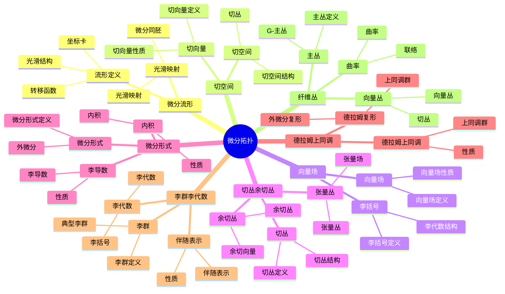

# 5.3 微分拓扑 / Differential Topology

**主题编号**: B.05.03
**创建日期**: 2025年11月21日
**最后更新**: 2025年11月21日

---

## 目录 / Table of Contents

- [5.3 微分拓扑 / Differential Topology](#53-微分拓扑--differential-topology)
  - [目录 / Table of Contents](#目录--table-of-contents)
  - [🗺️ 微分拓扑核心概念思维导图](#️-微分拓扑核心概念思维导图)
  - [📊 微分拓扑核心概念多维知识矩阵](#-微分拓扑核心概念多维知识矩阵)
  - [5.3.1 基本概念 / Basic Concepts (编号: B.05.03.01)](#531-基本概念--basic-concepts-编号-b050301)
    - [5.3.1.1 微分流形 / Differentiable Manifolds](#5311-微分流形--differentiable-manifolds)
    - [5.3.1.2 切空间 / Tangent Spaces](#5312-切空间--tangent-spaces)
    - [5.3.1.3 向量场 / Vector Fields](#5313-向量场--vector-fields)
  - [5.3.2 流形 / Manifolds (编号: B.05.03.02)](#532-流形--manifolds-编号-b050302)
    - [5.3.2.1 子流形 / Submanifolds](#5321-子流形--submanifolds)
    - [5.3.2.4 定向 / Orientation](#5324-定向--orientation)
    - [5.3.2.7 紧致性 / Compactness](#5327-紧致性--compactness)
  - [5.3.3 切丛与余切丛 / Tangent and Cotangent Bundles (编号: B.05.03.03)](#533-切丛与余切丛--tangent-and-cotangent-bundles-编号-b050303)
    - [5.3.3.1 切丛 / Tangent Bundle](#5331-切丛--tangent-bundle)
    - [5.3.3.4 余切丛 / Cotangent Bundle](#5334-余切丛--cotangent-bundle)
    - [5.3.3.7 张量丛 / Tensor Bundles](#5337-张量丛--tensor-bundles)
  - [5.3.4 微分形式 / Differential Forms (编号: B.05.03.04)](#534-微分形式--differential-forms-编号-b050304)
    - [5.3.4.1 微分形式的定义 / Definition of Differential Forms](#5341-微分形式的定义--definition-of-differential-forms)
    - [5.3.4.4 李导数 / Lie Derivative](#5344-李导数--lie-derivative)
    - [5.3.4.6 内积 / Interior Product](#5346-内积--interior-product)
  - [5.3.5 德拉姆上同调 / de Rham Cohomology (编号: B.05.03.05)](#535-德拉姆上同调--de-rham-cohomology-编号-b050305)
    - [5.3.5.1 德拉姆复形 / de Rham Complex](#5351-德拉姆复形--de-rham-complex)
    - [5.3.5.3 德拉姆上同调的计算 / Computation of de Rham Cohomology](#5353-德拉姆上同调的计算--computation-of-de-rham-cohomology)
    - [5.3.5.7 德拉姆上同调的函子性 / Functoriality of de Rham Cohomology](#5357-德拉姆上同调的函子性--functoriality-of-de-rham-cohomology)
  - [5.3.6 李群与李代数 / Lie Groups and Lie Algebras (编号: B.05.03.06)](#536-李群与李代数--lie-groups-and-lie-algebras-编号-b050306)
    - [5.3.6.1 李群 / Lie Groups](#5361-李群--lie-groups)
    - [5.3.6.3 李代数 / Lie Algebras](#5363-李代数--lie-algebras)
    - [5.3.6.6 伴随表示 / Adjoint Representation](#5366-伴随表示--adjoint-representation)
  - [5.3.7 纤维丛 / Fiber Bundles (编号: B.05.03.07)](#537-纤维丛--fiber-bundles-编号-b050307)
    - [5.3.7.1 主丛 / Principal Bundles](#5371-主丛--principal-bundles)
    - [5.3.7.4 向量丛 / Vector Bundles](#5374-向量丛--vector-bundles)
    - [5.3.7.6 曲率 / Curvature](#5376-曲率--curvature)
  - [5.3.8 形式化实现 / Formal Implementation (编号: B.05.03.08)](#538-形式化实现--formal-implementation-编号-b050308)
    - [5.3.8.1 Lean 4 实现 / Lean 4 Implementation](#5381-lean-4-实现--lean-4-implementation)
    - [5.3.8.2 Haskell 实现 / Haskell Implementation](#5382-haskell-实现--haskell-implementation)
    - [5.3.8.3 重要定理总结 / Summary of Important Theorems](#5383-重要定理总结--summary-of-important-theorems)
  - [参考文献 / References](#参考文献--references)
    - [经典教材 / Classic Textbooks](#经典教材--classic-textbooks)
    - [微分拓扑教材 / Differential Topology Textbooks](#微分拓扑教材--differential-topology-textbooks)
    - [微分形式教材 / Differential Forms Textbooks](#微分形式教材--differential-forms-textbooks)
    - [流形理论教材 / Manifold Theory Textbooks](#流形理论教材--manifold-theory-textbooks)
    - [历史文献 / Historical Literature](#历史文献--historical-literature)
    - [中文教材 / Chinese Textbooks](#中文教材--chinese-textbooks)
    - [现代发展文献 / Modern Development Literature](#现代发展文献--modern-development-literature)
    - [在线资源 / Online Resources](#在线资源--online-resources)

---

## 🗺️ 微分拓扑核心概念思维导图



## 📊 微分拓扑核心概念多维知识矩阵

| 概念类别 | 核心概念 | 定义要点 | 关键性质 | 典型例子 | 应用场景 |
|---------|---------|---------|---------|---------|---------|
| 微分流形 | 微分流形 | 坐标卡+转移函数 | 可微结构 | Sⁿ, ℝℙⁿ | 几何基础 |
| 微分流形 | 光滑映射 | 光滑性 | 复合光滑 | f: M→N | 流形映射 |
| 微分流形 | 微分同胚 | 光滑双射 | 同构 | 微分同胚 | 流形分类 |
| 切空间 | 切向量 | 导数算子 | 线性结构 | ∂/∂x^i | 向量场 |
| 切空间 | 切空间 | 切向量空间 | 线性结构 | T_pM | 向量场 |
| 切空间 | 切丛 | 切空间并 | 向量丛 | TM | 向量场 |
| 向量场 | 向量场 | 切丛截面 | 李括号 | X | 动力学 |
| 向量场 | 李括号 | 向量场运算 | 李代数 | [X,Y] | 动力学 |
| 切丛余切丛 | 余切丛 | 对偶丛 | 对偶结构 | T*M | 微分形式 |
| 切丛余切丛 | 张量丛 | 张量积 | 张量场 | 张量丛 | 几何结构 |
| 微分形式 | 微分形式 | 外代数 | 外微分 | ω | 积分理论 |
| 微分形式 | 外微分 | 外微分算子 | 复形 | d | 上同调 |
| 微分形式 | 李导数 | 沿向量场导数 | 李导数 | L_X | 几何应用 |
| 德拉姆上同调 | 德拉姆复形 | 外微分复形 | 上同调群 | Ω*(M) | 拓扑不变量 |
| 德拉姆上同调 | 德拉姆上同调 | 上同调群 | 同伦不变 | H_dR*(M) | 拓扑不变量 |
| 李群李代数 | 李群 | 群+流形 | 光滑结构 | GL(n), SO(n) | 对称性 |
| 李群李代数 | 伴随表示 | 伴随作用 | 表示 | Ad | 李群理论 |
| 纤维丛 | 主丛 | G-主丛 | 分类空间 | 主丛 | 规范理论 |
| 纤维丛 | 向量丛 | 向量空间纤维 | 切丛 | 向量丛 | 几何结构 |
| 应用 | 规范理论 | 主丛 | 规范场 | 规范理论 | 物理 |

## 5.3.1 基本概念 / Basic Concepts (编号: B.05.03.01)

### 5.3.1.1 微分流形 / Differentiable Manifolds

**定义 5.3.1.1** (微分流形 / Differentiable Manifold)
$n$ 维微分流形是拓扑空间 $M$ 和一族坐标卡 $\{(U_\alpha, \phi_\alpha)\}$ 使得：

1. $\{U_\alpha\}$ 是 $M$ 的开覆盖
2. $\phi_\alpha: U_\alpha \to \mathbb{R}^n$ 是同胚
3. 转移函数 $\phi_\beta \circ \phi_\alpha^{-1}: \phi_\alpha(U_\alpha \cap U_\beta) \to \phi_\beta(U_\alpha \cap U_\beta)$ 是 $C^\infty$ 的

**定义 5.3.1.2** (光滑映射 / Smooth Mapping)
映射 $f: M \to N$ 称为光滑的，如果对于任意坐标卡 $(U, \phi)$ 和 $(V, \psi)$，复合映射 $\psi \circ f \circ \phi^{-1}$ 是光滑的。

**定义 5.3.1.3** (微分同胚 / Diffeomorphism)
双射 $f: M \to N$ 称为微分同胚，如果 $f$ 和 $f^{-1}$ 都是光滑的。

### 5.3.1.2 切空间 / Tangent Spaces

**定义 5.3.1.4** (切向量 / Tangent Vector)
在点 $p \in M$ 的切向量是满足莱布尼茨法则的线性泛函 $X: C^\infty(M) \to \mathbb{R}$：
$$X(fg) = f(p)X(g) + g(p)X(f)$$

**定义 5.3.1.5** (切空间 / Tangent Space)
点 $p \in M$ 的切空间 $T_pM$ 是所有切向量的集合。

**定理 5.3.1.6** (切空间的结构 / Structure of Tangent Space)
$T_pM$ 是 $n$ 维向量空间，其中 $n = \dim M$。

**证明** / Proof:

- 在局部坐标 $(x^1, \ldots, x^n)$ 下，$\{\partial/\partial x^i\}$ 构成基
- 任意切向量可表示为 $X = \sum_{i=1}^n a^i \partial/\partial x^i$

### 5.3.1.3 向量场 / Vector Fields

**定义 5.3.1.7** (向量场 / Vector Field)
向量场是映射 $X: M \to TM$ 使得 $\pi \circ X = \text{id}_M$，其中 $\pi: TM \to M$ 是投影。

**定义 5.3.1.8** (李括号 / Lie Bracket)
向量场 $X$ 和 $Y$ 的李括号 $[X,Y]$ 定义为：
$$[X,Y](f) = X(Y(f)) - Y(X(f))$$

**定理 5.3.1.9** (李括号的性质 / Properties of Lie Bracket)
李括号满足：

1. **双线性** / Bilinearity: $[aX + bY, Z] = a[X,Z] + b[Y,Z]$
2. **反对称性** / Antisymmetry: $[X,Y] = -[Y,X]$
3. **雅可比恒等式** / Jacobi Identity: $[X,[Y,Z]] + [Y,[Z,X]] + [Z,[X,Y]] = 0$

---

## 5.3.2 流形 / Manifolds (编号: B.05.03.02)

### 5.3.2.1 子流形 / Submanifolds

**定义 5.3.2.1** (浸入 / Immersion)
光滑映射 $f: M \to N$ 称为浸入，如果 $df_p: T_pM \to T_{f(p)}N$ 是单射。

**定义 5.3.2.2** (嵌入 / Embedding)
浸入 $f: M \to N$ 称为嵌入，如果 $f$ 是到其像的同胚。

**定义 5.3.2.3** (子流形 / Submanifold)
$N \subseteq M$ 称为子流形，如果包含映射 $i: N \to M$ 是嵌入。

### 5.3.2.4 定向 / Orientation

**定义 5.3.2.4** (定向 / Orientation)
$n$ 维流形 $M$ 的定向是 $n$ 形式 $\omega$ 的等价类，其中 $\omega \sim \omega'$ 当且仅当 $\omega = f\omega'$，$f > 0$。

**定义 5.3.2.5** (可定向流形 / Orientable Manifold)
流形 $M$ 称为可定向的，如果存在非零的 $n$ 形式。

**定理 5.3.2.6** (定向的判别 / Criterion for Orientation)
流形 $M$ 可定向当且仅当转移函数的雅可比行列式处处为正。

### 5.3.2.7 紧致性 / Compactness

**定理 5.3.2.8** (紧致流形的性质 / Properties of Compact Manifolds)
紧致流形具有以下性质：

1. 存在有限坐标覆盖
2. 任意光滑函数有最大值和最小值
3. 任意向量场有积分曲线

**定理 5.3.2.9** (惠特尼嵌入定理 / Whitney Embedding Theorem)
任意 $n$ 维流形可以嵌入到 $\mathbb{R}^{2n}$ 中。

---

## 5.3.3 切丛与余切丛 / Tangent and Cotangent Bundles (编号: B.05.03.03)

### 5.3.3.1 切丛 / Tangent Bundle

**定义 5.3.3.1** (切丛 / Tangent Bundle)
切丛 $TM = \bigcup_{p \in M} T_pM$ 具有自然的流形结构。

**定理 5.3.3.2** (切丛的局部平凡化 / Local Trivialization of Tangent Bundle)
对于坐标邻域 $U$，存在同胚：
$$TU \cong U \times \mathbb{R}^n$$

**定义 5.3.3.3** (切丛的截面 / Section of Tangent Bundle)
切丛的截面是光滑映射 $X: M \to TM$ 使得 $\pi \circ X = \text{id}_M$。

### 5.3.3.4 余切丛 / Cotangent Bundle

**定义 5.3.3.4** (余切空间 / Cotangent Space)
点 $p \in M$ 的余切空间 $T_p^*M$ 是 $T_pM$ 的对偶空间。

**定义 5.3.3.5** (余切丛 / Cotangent Bundle)
余切丛 $T^*M = \bigcup_{p \in M} T_p^*M$ 具有自然的流形结构。

**定理 5.3.3.6** (余切丛的局部平凡化 / Local Trivialization of Cotangent Bundle)
对于坐标邻域 $U$，存在同胚：
$$T^*U \cong U \times (\mathbb{R}^n)^*$$

### 5.3.3.7 张量丛 / Tensor Bundles

**定义 5.3.3.7** (张量丛 / Tensor Bundle)
$(r,s)$ 型张量丛定义为：
$$T^r_s M = \bigotimes^r TM \otimes \bigotimes^s T^*M$$

**定义 5.3.3.8** (外积丛 / Exterior Bundle)
$k$ 次外积丛定义为：
$$\Lambda^k T^*M = \bigwedge^k T^*M$$

---

## 5.3.4 微分形式 / Differential Forms (编号: B.05.03.04)

### 5.3.4.1 微分形式的定义 / Definition of Differential Forms

**定义 5.3.4.1** (微分形式 / Differential Form)
$k$ 次微分形式是 $\Lambda^k T^*M$ 的光滑截面。

**定义 5.3.4.2** (外微分 / Exterior Derivative)
外微分算子 $d: \Omega^k(M) \to \Omega^{k+1}(M)$ 定义为：
$$d\omega = \sum_{i_1 < \cdots < i_k} \sum_{j=1}^n \frac{\partial a_{i_1 \cdots i_k}}{\partial x^j} dx^j \wedge dx^{i_1} \wedge \cdots \wedge dx^{i_k}$$

**定理 5.3.4.3** (外微分的性质 / Properties of Exterior Derivative)
外微分算子满足：

1. **线性性** / Linearity: $d(\alpha + \beta) = d\alpha + d\beta$
2. **莱布尼茨法则** / Leibniz Rule: $d(\alpha \wedge \beta) = d\alpha \wedge \beta + (-1)^k \alpha \wedge d\beta$
3. **幂零性** / Nilpotency: $d^2 = 0$

### 5.3.4.4 李导数 / Lie Derivative

**定义 5.3.4.4** (李导数 / Lie Derivative)
向量场 $X$ 的李导数 $\mathcal{L}_X: \Omega^k(M) \to \Omega^k(M)$ 定义为：
$$\mathcal{L}_X \omega = \lim_{t \to 0} \frac{\phi_t^* \omega - \omega}{t}$$
其中 $\phi_t$ 是 $X$ 的流。

**定理 5.3.4.5** (李导数的性质 / Properties of Lie Derivative)
李导数满足：

1. **线性性** / Linearity: $\mathcal{L}_X(\alpha + \beta) = \mathcal{L}_X \alpha + \mathcal{L}_X \beta$
2. **莱布尼茨法则** / Leibniz Rule: $\mathcal{L}_X(\alpha \wedge \beta) = \mathcal{L}_X \alpha \wedge \beta + \alpha \wedge \mathcal{L}_X \beta$
3. **嘉当公式** / Cartan Formula: $\mathcal{L}_X = d \circ i_X + i_X \circ d$

### 5.3.4.6 内积 / Interior Product

**定义 5.3.4.6** (内积 / Interior Product)
向量场 $X$ 的内积 $i_X: \Omega^k(M) \to \Omega^{k-1}(M)$ 定义为：
$$(i_X \omega)(X_1, \ldots, X_{k-1}) = \omega(X, X_1, \ldots, X_{k-1})$$

**定理 5.3.4.7** (内积的性质 / Properties of Interior Product)
内积满足：

1. **线性性** / Linearity: $i_{aX + bY} = a i_X + b i_Y$
2. **反导子性** / Antiderivation: $i_X(\alpha \wedge \beta) = i_X \alpha \wedge \beta + (-1)^k \alpha \wedge i_X \beta$

---

## 5.3.5 德拉姆上同调 / de Rham Cohomology (编号: B.05.03.05)

### 5.3.5.1 德拉姆复形 / de Rham Complex

**定义 5.3.5.1** (德拉姆复形 / de Rham Complex)
德拉姆复形是序列：
$$0 \to \Omega^0(M) \xrightarrow{d} \Omega^1(M) \xrightarrow{d} \cdots \xrightarrow{d} \Omega^n(M) \to 0$$

**定义 5.3.5.2** (德拉姆上同调 / de Rham Cohomology)
德拉姆上同调群定义为：
$$H^k_{dR}(M) = \frac{\ker d: \Omega^k(M) \to \Omega^{k+1}(M)}{\text{im } d: \Omega^{k-1}(M) \to \Omega^k(M)}$$

### 5.3.5.3 德拉姆上同调的计算 / Computation of de Rham Cohomology

**定理 5.3.5.4** (庞加莱引理 / Poincaré Lemma)
对于星形区域 $U \subseteq \mathbb{R}^n$，$H^k_{dR}(U) = 0$ 当 $k > 0$。

**定理 5.3.5.5** (球面的德拉姆上同调 / de Rham Cohomology of Spheres)
对于 $n$ 维球面 $S^n$：
$$
H^k_{dR}(S^n) = \begin{cases}
\mathbb{R} & \text{if } k = 0, n \\
0 & \text{otherwise}
\end{cases}
$$

**定理 5.3.5.6** (德拉姆定理 / de Rham's Theorem)
德拉姆上同调与奇异上同调同构：
$$H^k_{dR}(M) \cong H^k(M; \mathbb{R})$$

### 5.3.5.7 德拉姆上同调的函子性 / Functoriality of de Rham Cohomology

**定理 5.3.5.8** (德拉姆上同调的函子性 / Functoriality)
光滑映射 $f: M \to N$ 诱导同态 $f^*: H^k_{dR}(N) \to H^k_{dR}(M)$。

**定理 5.3.5.9** (同伦不变性 / Homotopy Invariance)
如果 $f \simeq g$，则 $f^* = g^*$。

---

## 5.3.6 李群与李代数 / Lie Groups and Lie Algebras (编号: B.05.03.06)

### 5.3.6.1 李群 / Lie Groups

**定义 5.3.6.1** (李群 / Lie Group)
李群是既是群又是流形的结构，其中群运算 $(g,h) \mapsto gh$ 和逆运算 $g \mapsto g^{-1}$ 都是光滑的。

**例子** / Examples:

1. **一般线性群** / General linear group: $GL(n,\mathbb{R})$
2. **特殊线性群** / Special linear group: $SL(n,\mathbb{R})$
3. **正交群** / Orthogonal group: $O(n)$
4. **酉群** / Unitary group: $U(n)$

**定理 5.3.6.2** (李群的基本性质 / Basic Properties of Lie Groups)
李群具有以下性质：

1. 左平移 $L_g: h \mapsto gh$ 是微分同胚
2. 单位元 $e$ 的切空间 $T_eG$ 是李代数
3. 指数映射 $\exp: T_eG \to G$ 是局部微分同胚

### 5.3.6.3 李代数 / Lie Algebras

**定义 5.3.6.3** (李代数 / Lie Algebra)
李代数是向量空间 $\mathfrak{g}$ 和双线性映射 $[\cdot,\cdot]: \mathfrak{g} \times \mathfrak{g} \to \mathfrak{g}$ 满足：

1. **反对称性** / Antisymmetry: $[X,Y] = -[Y,X]$
2. **雅可比恒等式** / Jacobi Identity: $[X,[Y,Z]] + [Y,[Z,X]] + [Z,[X,Y]] = 0$

**定义 5.3.6.4** (李群的李代数 / Lie Algebra of Lie Group)
李群 $G$ 的李代数 $\mathfrak{g} = T_eG$ 在李括号下形成李代数。

**定理 5.3.6.5** (李代数与李群的关系 / Relation between Lie Algebra and Lie Group)
李代数 $\mathfrak{g}$ 完全决定单位元邻域的李群结构。

### 5.3.6.6 伴随表示 / Adjoint Representation

**定义 5.3.6.6** (伴随表示 / Adjoint Representation)
李群 $G$ 的伴随表示 $\text{Ad}: G \to GL(\mathfrak{g})$ 定义为：
$$\text{Ad}(g)X = d(L_g \circ R_{g^{-1}})_e X$$

**定义 5.3.6.7** (伴随作用 / Adjoint Action)
李代数的伴随作用 $\text{ad}: \mathfrak{g} \to \text{End}(\mathfrak{g})$ 定义为：
$$\text{ad}(X)Y = [X,Y]$$

**定理 5.3.6.8** (伴随表示的性质 / Properties of Adjoint Representation)
$$\text{Ad}(\exp X) = \exp(\text{ad}(X))$$

---

## 5.3.7 纤维丛 / Fiber Bundles (编号: B.05.03.07)

### 5.3.7.1 主丛 / Principal Bundles

**定义 5.3.7.1** (主丛 / Principal Bundle)
主丛是纤维丛 $(P, M, G, \pi)$，其中 $G$ 是李群，且 $G$ 在 $P$ 上自由作用。

**定义 5.3.7.2** (联络 / Connection)
主丛上的联络是水平分布 $H \subseteq TP$ 使得：
$$T_pP = H_p \oplus V_p$$
其中 $V_p$ 是垂直空间。

**定理 5.3.7.3** (联络的存在性 / Existence of Connection)
任意主丛上都存在联络。

### 5.3.7.4 向量丛 / Vector Bundles

**定义 5.3.7.4** (向量丛 / Vector Bundle)
向量丛是纤维丛 $(E, M, V, \pi)$，其中纤维 $V$ 是向量空间。

**定义 5.3.7.5** (协变导数 / Covariant Derivative)
向量丛上的协变导数是算子 $\nabla: \Gamma(E) \to \Gamma(T^*M \otimes E)$ 满足：

1. **线性性** / Linearity: $\nabla(fs) = df \otimes s + f \nabla s$
2. **莱布尼茨法则** / Leibniz Rule: $\nabla_X(fs) = X(f)s + f \nabla_X s$

### 5.3.7.6 曲率 / Curvature

**定义 5.3.7.6** (曲率 / Curvature)
联络的曲率 $F$ 定义为：
$$F(X,Y) = \nabla_X \nabla_Y - \nabla_Y \nabla_X - \nabla_{[X,Y]}$$

**定理 5.3.7.7** (比安基恒等式 / Bianchi Identity)
$$dF + [A,F] = 0$$
其中 $A$ 是联络形式。

---

## 5.3.8 形式化实现 / Formal Implementation (编号: B.05.03.08)

### 5.3.8.1 Lean 4 实现 / Lean 4 Implementation

```lean
-- 微分流形
structure DifferentiableManifold (M : Type*) [TopologicalSpace M] where
  dimension : ℕ
  charts : Set (Chart M)
  smoothTransition : ∀ c₁ c₂ : Chart M, c₁ ∈ charts → c₂ ∈ charts →
    Smooth (transition c₁ c₂)

-- 切空间
structure TangentSpace (M : Type*) [Manifold M] (p : M) where
  vectors : Set (TangentVector M p)
  addition : TangentVector M p → TangentVector M p → TangentVector M p
  scalarMultiplication : ℝ → TangentVector M p → TangentVector M p

-- 切丛
structure TangentBundle (M : Type*) [Manifold M] where
  totalSpace : Type*
  projection : totalSpace → M
  fiber : ∀ p : M, TangentSpace M p
  localTrivialization : ∀ p : M, ∃ U : OpenSet M, p ∈ U ∧
    ∃ φ : totalSpace → M × ℝ^n, Homeomorphism φ

-- 微分形式
structure DifferentialForm (M : Type*) [Manifold M] (k : ℕ) where
  forms : Set (k-Form M)
  exteriorDerivative : k-Form M → (k+1)-Form M
  wedgeProduct : k-Form M → l-Form M → (k+l)-Form M

-- 德拉姆上同调
structure DeRhamCohomology (M : Type*) [Manifold M] where
  forms : ℕ → Set (DifferentialForm M)
  exteriorDerivative : ∀ k, forms k → forms (k+1)
  cohomology : ∀ k, Quotient (ker (exteriorDerivative k) / im (exteriorDerivative (k-1)))

-- 李群
structure LieGroup (G : Type*) [Manifold G] [Group G] where
  multiplication : G → G → G
  inverse : G → G
  smoothMultiplication : Smooth (uncurry multiplication)
  smoothInverse : Smooth inverse

-- 李代数
structure LieAlgebra (𝔤 : Type*) [AddCommGroup 𝔤] where
  bracket : 𝔤 → 𝔤 → 𝔤
  antisymmetry : ∀ X Y, bracket X Y = -bracket Y X
  jacobiIdentity : ∀ X Y Z, bracket X (bracket Y Z) + bracket Y (bracket Z X) + bracket Z (bracket X Y) = 0

-- 定理：庞加莱引理
theorem poincare_lemma (U : StarShapedSet ℝ^n) (k : ℕ) (hk : k > 0) :
  H^k_{dR}(U) = 0 :=
  by
  -- 构造同伦算子
  let h : Ω^k(U) → Ω^{k-1}(U) := homotopy_operator
  -- 证明 d ∘ h + h ∘ d = id
  sorry

-- 定理：德拉姆定理
theorem de_rham_theorem (M : Manifold) (k : ℕ) :
  H^k_{dR}(M) ≅ H^k(M, ℝ) :=
  by
  -- 构造同构映射
  let φ : H^k_{dR}(M) → H^k(M, ℝ) := integration_map
  -- 证明是同构
  sorry

-- 定理：李群与李代数的对应
theorem lie_group_algebra_correspondence (G : LieGroup) :
  LieAlgebra (T_e G) :=
  by
  -- 定义李括号
  let bracket : T_e G → T_e G → T_e G := lie_bracket
  -- 验证李代数公理
  sorry

```

### 5.3.8.2 Haskell 实现 / Haskell Implementation

```haskell
-- 微分流形
data DifferentiableManifold a = DifferentiableManifold
  { dimension :: Natural
  , charts :: Set (Chart a)
  , smoothTransition :: Chart a -> Chart a -> Bool
  }

-- 切空间
data TangentSpace a p = TangentSpace
  { vectors :: Set (TangentVector a p)
  , addition :: TangentVector a p -> TangentVector a p -> TangentVector a p
  , scalarMultiplication :: Double -> TangentVector a p -> TangentVector a p
  }

-- 切丛
data TangentBundle a = TangentBundle
  { totalSpace :: Type
  , projection :: totalSpace -> a
  , fiber :: a -> TangentSpace a
  , localTrivialization :: a -> Maybe (OpenSet a, totalSpace -> (a, Vector Double))
  }

-- 微分形式
data DifferentialForm a k = DifferentialForm
  { forms :: Set (k-Form a)
  , exteriorDerivative :: k-Form a -> (k+1)-Form a
  , wedgeProduct :: k-Form a -> l-Form a -> (k+l)-Form a
  }

-- 德拉姆上同调
data DeRhamCohomology a = DeRhamCohomology
  { forms :: Natural -> Set (DifferentialForm a)
  , exteriorDerivative :: Natural -> DifferentialForm a -> DifferentialForm a
  , cohomology :: Natural -> Quotient (Kernel (exteriorDerivative k) / Image (exteriorDerivative (k-1)))
  }

-- 李群
data LieGroup a = LieGroup
  { manifold :: Manifold a
  , group :: Group a
  , multiplication :: a -> a -> a
  , inverse :: a -> a
  , smoothMultiplication :: Smooth (uncurry multiplication)
  , smoothInverse :: Smooth inverse
  }

-- 李代数
data LieAlgebra a = LieAlgebra
  { addCommGroup :: AddCommGroup a
  , bracket :: a -> a -> a
  , antisymmetry :: a -> a -> bracket x y = negate (bracket y x)
  , jacobiIdentity :: a -> a -> a -> bracket x (bracket y z) + bracket y (bracket z x) + bracket z (bracket x y) = zero
  }

-- 定理验证
theorem_poincare_lemma :: StarShapedSet -> Natural -> Bool
theorem_poincare_lemma u k =
  k > 0 ==> de_rham_cohomology u k == zero_group

theorem_de_rham_theorem :: Manifold -> Natural -> Bool
theorem_de_rham_theorem manifold k =
  de_rham_cohomology manifold k == singular_cohomology manifold k real_field

theorem_lie_group_algebra :: LieGroup -> Bool
theorem_lie_group_algebra group =
  is_lie_algebra (tangent_space_at_identity group)

-- 实例：球面
instance Manifold Sphere where
  dimension = n
  charts = generateCharts sphere
  smoothTransition = checkSmoothTransition

-- 实例：李群
instance LieGroup GLn where
  multiplication = matrixMultiplication
  inverse = matrixInverse
  smoothMultiplication = checkSmoothMultiplication
  smoothInverse = checkSmoothInverse

-- 实例：李代数
instance LieAlgebra gln where
  bracket = matrixCommutator
  antisymmetry = matrixAntisymmetry
  jacobiIdentity = matrixJacobiIdentity

```

### 5.3.8.3 重要定理总结 / Summary of Important Theorems

**定理 5.3.8.1** (斯托克斯定理 / Stokes's Theorem)
对于紧致定向流形 $M$ 和 $(n-1)$ 形式 $\omega$：
$$\int_M d\omega = \int_{\partial M} \omega$$

**定理 5.3.8.2** (庞加莱对偶 / Poincaré Duality)
对于紧致可定向 $n$ 维流形 $M$：
$$H^k_{dR}(M) \cong H^{n-k}_{dR}(M)$$

**定理 5.3.8.3** (霍奇分解定理 / Hodge Decomposition Theorem)
对于紧致黎曼流形 $M$：
$$\Omega^k(M) = \mathcal{H}^k(M) \oplus d\Omega^{k-1}(M) \oplus \delta\Omega^{k+1}(M)$$

**定理 5.3.8.4** (陈-韦伊理论 / Chern-Weil Theory)
示性类可以用曲率形式表示。

---

## 参考文献 / References

### 经典教材 / Classic Textbooks

- Guillemin, V., Pollack, A. Differential Topology[M]. Providence: AMS Chelsea Publishing, 2010.
- Milnor, J. W. Topology from the Differentiable Viewpoint[M]. Princeton: Princeton University Press, 1997.
- Warner, F. W. Foundations of Differentiable Manifolds and Lie Groups[M]. New York: Springer-Verlag, 1983.

### 微分拓扑教材 / Differential Topology Textbooks

- Hirsch, M. W. Differential Topology[M]. New York: Springer-Verlag, 1976.
- Lee, J. M. Introduction to Smooth Manifolds[M]. 2nd Edition. New York: Springer-Verlag, 2013.
- Kosinski, A. A. Differential Manifolds[M]. Boston: Academic Press, 1993.

### 微分形式教材 / Differential Forms Textbooks

- Bott, R., Tu, L. W. Differential Forms in Algebraic Topology[M]. New York: Springer-Verlag, 1982.
- Morita, S. Geometry of Differential Forms[M]. Providence: American Mathematical Society, 2001.

### 流形理论教材 / Manifold Theory Textbooks

- Spivak, M. A Comprehensive Introduction to Differential Geometry[M]. 5 vols. Wilmington: Publish or Perish, 1979.
- Boothby, W. M. An Introduction to Differentiable Manifolds and Riemannian Geometry[M]. 2nd Edition. Orlando: Academic Press, 1986.

### 历史文献 / Historical Literature

- Poincaré, H. Analysis Situs[J]. Journal de l'École Polytechnique, 1895, 1: 1-121.
- Whitney, H. Differentiable Manifolds[J]. Annals of Mathematics, 1936, 37(3): 645-680.
- Milnor, J. W. On Manifolds Homeomorphic to the 7-Sphere[J]. Annals of Mathematics, 1956, 64(2): 399-405.

### 中文教材 / Chinese Textbooks

- 陈省身, 陈维桓. 微分几何讲义[M]. 第2版. 北京: 北京大学出版社, 2001.
- 徐森林, 薛春华. 微分流形[M]. 北京: 高等教育出版社, 2004.

### 现代发展文献 / Modern Development Literature

- Donaldson, S. K. An Application of Gauge Theory to Four-Dimensional Topology[J]. Journal of Differential Geometry, 1983, 18(2): 279-315.
- Freedman, M. H. The Topology of Four-Manifolds[J]. Journal of Differential Geometry, 1982, 17(3): 357-453.

### 在线资源 / Online Resources

- Wikipedia: [Differential topology](https://en.wikipedia.org/wiki/Differential_topology)
- Wikipedia: [Differentiable manifold](https://en.wikipedia.org/wiki/Differentiable_manifold)
- MIT OpenCourseWare: [18.965 Geometry of Manifolds](https://ocw.mit.edu/courses/18-965-geometry-of-manifolds-fall-2004/)

---

**相关链接** / Related Links:

- [点集拓扑](./01-点集拓扑.md)
- [代数拓扑](./02-代数拓扑.md)
- [同伦论](./04-同伦论.md)
- [同调论](./05-同调论.md)
