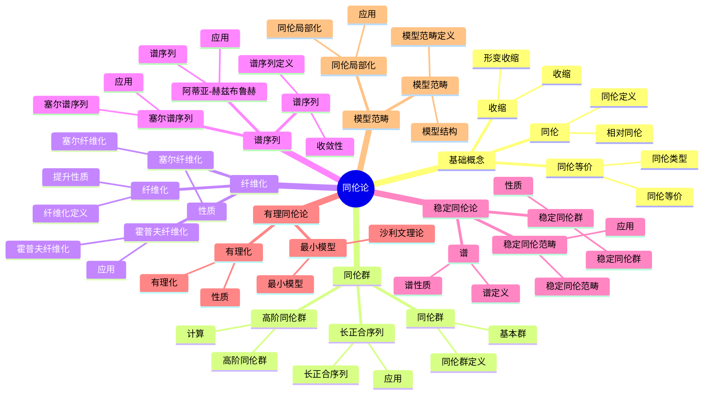

# 5.4 同伦论 / Homotopy Theory

## 目录 / Table of Contents

- [5.4 同伦论 / Homotopy Theory](#54-同伦论--homotopy-theory)
  - [目录 / Table of Contents](#目录--table-of-contents)
  - [5.4.1 基本概念 / Basic Concepts](#541-基本概念--basic-concepts)
    - [5.4.1.1 同伦 / Homotopy](#5411-同伦--homotopy)
    - [5.4.1.2 同伦等价 / Homotopy Equivalence](#5412-同伦等价--homotopy-equivalence)
    - [5.4.1.3 收缩 / Retraction](#5413-收缩--retraction)
  - [5.4.2 同伦群 / Homotopy Groups](#542-同伦群--homotopy-groups)
    - [5.4.2.1 同伦群的定义 / Definition of Homotopy Groups](#5421-同伦群的定义--definition-of-homotopy-groups)
    - [5.4.2.2 同伦群的计算 / Computation of Homotopy Groups](#5422-同伦群的计算--computation-of-homotopy-groups)
    - [5.4.2.3 长正合序列 / Long Exact Sequences](#5423-长正合序列--long-exact-sequences)
  - [5.4.3 纤维化 / Fibrations](#543-纤维化--fibrations)
    - [5.4.3.1 纤维化的定义 / Definition of Fibrations](#5431-纤维化的定义--definition-of-fibrations)
    - [5.4.3.2 塞尔纤维化 / Serre Fibrations](#5432-塞尔纤维化--serre-fibrations)
    - [5.4.3.3 霍普夫纤维化 / Hopf Fibration](#5433-霍普夫纤维化--hopf-fibration)
  - [5.4.4 谱序列 / Spectral Sequences](#544-谱序列--spectral-sequences)
    - [5.4.4.1 谱序列的定义 / Definition of Spectral Sequences](#5441-谱序列的定义--definition-of-spectral-sequences)
    - [5.4.4.2 塞尔谱序列 / Serre Spectral Sequence](#5442-塞尔谱序列--serre-spectral-sequence)
    - [5.4.4.3 阿蒂亚-赫兹布鲁赫谱序列 / Atiyah-Hirzebruch Spectral Sequence](#5443-阿蒂亚-赫兹布鲁赫谱序列--atiyah-hirzebruch-spectral-sequence)
  - [5.4.5 稳定同伦论 / Stable Homotopy Theory](#545-稳定同伦论--stable-homotopy-theory)
    - [5.4.5.1 稳定同伦群 / Stable Homotopy Groups](#5451-稳定同伦群--stable-homotopy-groups)
    - [5.4.5.2 谱 / Spectra](#5452-谱--spectra)
    - [5.4.5.3 稳定同伦范畴 / Stable Homotopy Category](#5453-稳定同伦范畴--stable-homotopy-category)
  - [5.4.6 有理同伦论 / Rational Homotopy Theory](#546-有理同伦论--rational-homotopy-theory)
    - [5.4.6.1 有理化 / Rationalization](#5461-有理化--rationalization)
    - [5.4.6.2 最小模型 / Minimal Models](#5462-最小模型--minimal-models)
    - [5.4.6.3 沙利文理论 / Sullivan's Theory](#5463-沙利文理论--sullivans-theory)
  - [5.4.7 模型范畴 / Model Categories](#547-模型范畴--model-categories)
    - [5.4.7.1 模型范畴的定义 / Definition of Model Categories](#5471-模型范畴的定义--definition-of-model-categories)
    - [5.4.7.2 拓扑空间的模型结构 / Model Structure on Topological Spaces](#5472-拓扑空间的模型结构--model-structure-on-topological-spaces)
    - [5.4.7.3 同伦局部化 / Homotopy Localization](#5473-同伦局部化--homotopy-localization)
  - [5.4.8 形式化实现 / Formal Implementation](#548-形式化实现--formal-implementation)
    - [5.4.8.1 Lean 4 实现 / Lean 4 Implementation](#5481-lean-4-实现--lean-4-implementation)
    - [5.4.8.2 Haskell 实现 / Haskell Implementation](#5482-haskell-实现--haskell-implementation)
    - [5.4.8.3 重要定理总结 / Summary of Important Theorems](#5483-重要定理总结--summary-of-important-theorems)
  - [参考文献 / References](#参考文献--references)
    - [经典教材 / Classic Textbooks](#经典教材--classic-textbooks)
    - [同伦论教材 / Homotopy Theory Textbooks](#同伦论教材--homotopy-theory-textbooks)
    - [稳定同伦论教材 / Stable Homotopy Theory Textbooks](#稳定同伦论教材--stable-homotopy-theory-textbooks)
    - [同伦群教材 / Homotopy Groups Textbooks](#同伦群教材--homotopy-groups-textbooks)
    - [历史文献 / Historical Literature](#历史文献--historical-literature)
    - [中文教材 / Chinese Textbooks](#中文教材--chinese-textbooks)
    - [现代发展文献 / Modern Development Literature](#现代发展文献--modern-development-literature)
    - [在线资源 / Online Resources](#在线资源--online-resources)

---

## 🗺️ 同伦论核心概念思维导图



## 📊 同伦论核心概念多维知识矩阵

| 概念类别 | 核心概念 | 定义要点 | 关键性质 | 典型例子 | 应用场景 |
|---------|---------|---------|---------|---------|---------|
| 基础概念 | 同伦 | 连续变形 | 等价关系 | f≃g | 分类问题 |
| 基础概念 | 同伦等价 | 同伦双射 | 同伦类型 | X≃Y | 分类问题 |
| 基础概念 | 形变收缩 | 收缩同伦 | 同伦等价 | 形变收缩 | 分类问题 |
| 同伦群 | 同伦群 | 球面映射同伦类 | 群结构 | π_n(X) | 拓扑不变量 |
| 同伦群 | 基本群 | 一维同伦群 | 群结构 | π_1(X) | 拓扑不变量 |
| 同伦群 | 高阶同伦群 | 高维同伦群 | 阿贝尔群 | π_n(X) | 拓扑不变量 |
| 同伦群 | 长正合序列 | 纤维化序列 | 正合性 | 长正合序列 | 计算工具 |
| 纤维化 | 纤维化 | 提升性质 | 同伦性质 | 纤维化 | 几何结构 |
| 纤维化 | 塞尔纤维化 | 弱纤维化 | 同伦性质 | 塞尔纤维化 | 几何结构 |
| 纤维化 | 霍普夫纤维化 | S³→S² | 非平凡 | 霍普夫纤维化 | 几何应用 |
| 谱序列 | 谱序列 | 收敛序列 | 计算工具 | 谱序列 | 计算工具 |
| 谱序列 | 塞尔谱序列 | 纤维化谱序列 | 计算同伦群 | 塞尔谱序列 | 计算工具 |
| 稳定同伦论 | 稳定同伦群 | 稳定化 | 稳定性 | π_n^s | 稳定理论 |
| 稳定同伦论 | 谱 | 稳定对象 | 稳定同伦 | 谱 | 稳定理论 |
| 稳定同伦论 | 稳定同伦范畴 | 稳定范畴 | 三角范畴 | 稳定同伦范畴 | 现代数学 |
| 有理同伦论 | 有理化 | 有理化 | 简化 | 有理化 | 计算工具 |
| 有理同伦论 | 最小模型 | 最小模型 | 沙利文理论 | 最小模型 | 计算工具 |
| 模型范畴 | 模型范畴 | 模型结构 | 同伦理论 | 模型范畴 | 现代数学 |
| 应用 | 代数拓扑 | 同伦群 | 分类问题 | 同伦群 | 拓扑学 |

## 5.4.1 基本概念 / Basic Concepts

### 5.4.1.1 同伦 / Homotopy

**定义 5.4.1.1** (同伦 / Homotopy)
设 $X$ 和 $Y$ 是拓扑空间，$f, g: X \to Y$ 是连续映射。同伦是连续映射 $H: X \times I \to Y$ 使得：
$$H(x,0) = f(x), \quad H(x,1) = g(x)$$
记作 $f \simeq g$。

**定义 5.4.1.2** (相对同伦 / Relative Homotopy)
如果 $A \subseteq X$ 且 $H(a,t) = f(a) = g(a)$ 对所有 $a \in A$ 和 $t \in I$，则称 $f$ 和 $g$ 相对于 $A$ 同伦，记作 $f \simeq g \text{ rel } A$。

**定理 5.4.1.1** (同伦关系的性质 / Properties of Homotopy Relation)
同伦关系是等价关系：

1. **自反性** / Reflexivity: $f \simeq f$
2. **对称性** / Symmetry: $f \simeq g \Rightarrow g \simeq f$
3. **传递性** / Transitivity: $f \simeq g, g \simeq h \Rightarrow f \simeq h$

### 5.4.1.2 同伦等价 / Homotopy Equivalence

**定义 5.4.1.2** (同伦等价 / Homotopy Equivalence)
映射 $f: X \to Y$ 称为同伦等价，如果存在映射 $g: Y \to X$ 使得：
$$g \circ f \simeq \text{id}_X, \quad f \circ g \simeq \text{id}_Y$$

**定义 5.4.1.3** (同伦类型 / Homotopy Type)
如果存在同伦等价 $f: X \to Y$，则称 $X$ 和 $Y$ 具有相同的同伦类型。

**定理 5.4.1.2** (同伦等价的性质 / Properties of Homotopy Equivalence)
同伦等价保持：

1. 同伦群
2. 同调群
3. 上同调群
4. 基本群

### 5.4.1.3 收缩 / Retraction

**定义 5.4.1.3** (收缩 / Retraction)
映射 $r: X \to A$ 称为收缩，如果 $r|_A = \text{id}_A$。

**定义 5.4.1.4** (形变收缩 / Deformation Retraction)
同伦 $H: X \times I \to X$ 称为形变收缩，如果：
$$H(x,0) = x, \quad H(x,1) \in A, \quad H(a,t) = a \text{ for } a \in A$$

**定理 5.4.1.3** (形变收缩的性质 / Properties of Deformation Retraction)
如果 $A$ 是 $X$ 的形变收缩，则 $X$ 和 $A$ 同伦等价。

---

## 5.4.2 同伦群 / Homotopy Groups

### 5.4.2.1 同伦群的定义 / Definition of Homotopy Groups

**定义 5.4.2.1** (同伦群 / Homotopy Groups)
对于 $n \geq 1$，$n$ 阶同伦群定义为：
$$\pi_n(X,x_0) = \{[f] : f: (S^n, *) \to (X, x_0)\}$$

**群运算** / Group Operation:

- 对于 $n = 1$：道路复合
- 对于 $n \geq 2$：点积 $[\alpha] \cdot [\beta] = [\alpha \cdot \beta]$

**定理 5.4.2.1** (同伦群的基本性质 / Basic Properties of Homotopy Groups)
同伦群具有以下性质：

1. $\pi_n(X,x_0)$ 是阿贝尔群（$n \geq 2$）
2. $\pi_1(X,x_0)$ 一般不是阿贝尔群
3. 同伦等价保持同伦群

### 5.4.2.2 同伦群的计算 / Computation of Homotopy Groups

**定理 5.4.2.2** (球面的同伦群 / Homotopy Groups of Spheres)
对于 $n$ 维球面 $S^n$：
$$
\pi_k(S^n) = \begin{cases}
\mathbb{Z} & \text{if } k = n \\
0 & \text{if } k < n \\
\text{复杂} & \text{if } k > n
\end{cases}
$$

**定理 5.4.2.3** (圆周的同伦群 / Homotopy Groups of Circle)
$$\pi_1(S^1) \cong \mathbb{Z}, \quad \pi_n(S^1) = 0 \text{ for } n \geq 2$$

**定理 5.4.2.4** (乘积空间的同伦群 / Homotopy Groups of Product Spaces)
$$\pi_n(X \times Y, (x_0,y_0)) \cong \pi_n(X,x_0) \times \pi_n(Y,y_0)$$

### 5.4.2.3 长正合序列 / Long Exact Sequences

**定理 5.4.2.5** (同伦群的长正合序列 / Long Exact Sequence of Homotopy Groups)
对于纤维丛 $F \to E \to B$，存在长正合序列：
$$\cdots \to \pi_n(F) \to \pi_n(E) \to \pi_n(B) \to \pi_{n-1}(F) \to \cdots$$

**定理 5.4.2.6** (相对同伦群 / Relative Homotopy Groups)
对于空间对 $(X,A)$，存在长正合序列：
$$\cdots \to \pi_n(A) \to \pi_n(X) \to \pi_n(X,A) \to \pi_{n-1}(A) \to \cdots$$

---

## 5.4.3 纤维化 / Fibrations

### 5.4.3.1 纤维化的定义 / Definition of Fibrations

**定义 5.4.3.1** (纤维化 / Fibration)
映射 $p: E \to B$ 称为纤维化，如果对于任意空间 $X$ 和同伦 $H: X \times I \to B$，以及映射 $f: X \to E$ 使得 $p \circ f = H(\cdot,0)$，存在提升 $\tilde{H}: X \times I \to E$ 使得 $p \circ \tilde{H} = H$ 且 $\tilde{H}(\cdot,0) = f$。

**定义 5.4.3.2** (纤维 / Fiber)
纤维化 $p: E \to B$ 的纤维是 $F = p^{-1}(b_0)$，其中 $b_0 \in B$。

**定理 5.4.3.1** (纤维化的同伦提升 / Homotopy Lifting Property)
纤维化具有同伦提升性质。

### 5.4.3.2 塞尔纤维化 / Serre Fibrations

**定义 5.4.3.3** (塞尔纤维化 / Serre Fibration)
映射 $p: E \to B$ 称为塞尔纤维化，如果对于任意 CW 复形 $X$ 和同伦 $H: X \times I \to B$，以及映射 $f: X \to E$ 使得 $p \circ f = H(\cdot,0)$，存在提升 $\tilde{H}: X \times I \to E$。

**定理 5.4.3.4** (塞尔纤维化的性质 / Properties of Serre Fibrations)
塞尔纤维化具有以下性质：

1. 纤维的弱同伦类型不依赖于基点
2. 存在长正合序列
3. 保持弱同伦等价

### 5.4.3.3 霍普夫纤维化 / Hopf Fibration

**定义 5.4.3.5** (霍普夫纤维化 / Hopf Fibration)
霍普夫纤维化是映射 $S^3 \to S^2$ 定义为：
$$(z_1, z_2) \mapsto \frac{z_1}{z_2}$$

**定理 5.4.3.6** (霍普夫纤维化的性质 / Properties of Hopf Fibration)
霍普夫纤维化是纤维化，纤维是 $S^1$。

**定理 5.4.3.7** (霍普夫不变量的计算 / Computation of Hopf Invariant)
霍普夫不变量 $h: \pi_3(S^2) \to \mathbb{Z}$ 是同构。

---

## 5.4.4 谱序列 / Spectral Sequences

### 5.4.4.1 谱序列的定义 / Definition of Spectral Sequences

**定义 5.4.4.1** (谱序列 / Spectral Sequence)
谱序列是三元组 $(E_r, d_r, \alpha_r)$，其中：

- $E_r$ 是分次阿贝尔群
- $d_r: E_r \to E_r$ 是微分算子
- $\alpha_r: H(E_r, d_r) \to E_{r+1}$ 是同构

**定义 5.4.4.2** (收敛 / Convergence)
谱序列收敛到 $H$，如果存在 $r_0$ 使得 $E_r = E_\infty$ 对所有 $r \geq r_0$，且 $E_\infty$ 与 $H$ 的某个过滤相关。

### 5.4.4.2 塞尔谱序列 / Serre Spectral Sequence

**定理 5.4.4.3** (塞尔谱序列 / Serre Spectral Sequence)
对于纤维化 $F \to E \to B$，存在谱序列：
$$E^2_{p,q} = H_p(B; H_q(F)) \Rightarrow H_{p+q}(E)$$

**定理 5.4.4.4** (塞尔谱序列的微分 / Differentials in Serre Spectral Sequence)
微分算子 $d_r: E^r_{p,q} \to E^r_{p-r,q+r-1}$ 满足：
$$d_r^2 = 0$$

### 5.4.4.3 阿蒂亚-赫兹布鲁赫谱序列 / Atiyah-Hirzebruch Spectral Sequence

**定理 5.4.4.5** (阿蒂亚-赫兹布鲁赫谱序列 / Atiyah-Hirzebruch Spectral Sequence)
对于 CW 复形 $X$ 和广义同调理论 $h_*$，存在谱序列：
$$E^2_{p,q} = H_p(X; h_q(\text{pt})) \Rightarrow h_{p+q}(X)$$

**定理 5.4.4.6** (阿蒂亚-赫兹布鲁赫谱序列的应用 / Applications)
阿蒂亚-赫兹布鲁赫谱序列用于计算：

1. K 理论
2. 配边理论
3. 稳定同伦群

---

## 5.4.5 稳定同伦论 / Stable Homotopy Theory

### 5.4.5.1 稳定同伦群 / Stable Homotopy Groups

**定义 5.4.5.1** (稳定同伦群 / Stable Homotopy Groups)
稳定同伦群定义为：
$$\pi_n^s(X) = \lim_{k \to \infty} \pi_{n+k}(\Sigma^k X)$$

**定义 5.4.5.2** (稳定化 / Stabilization)
稳定化映射 $S: \pi_n(X) \to \pi_n^s(X)$ 定义为：
$$S([f]) = [\Sigma f]$$

**定理 5.4.5.3** (稳定同伦群的性质 / Properties of Stable Homotopy Groups)
稳定同伦群具有以下性质：

1. 阿贝尔群
2. 满足庞加莱对偶
3. 满足迈耶-菲托里斯序列

### 5.4.5.2 谱 / Spectra

**定义 5.4.5.4** (谱 / Spectrum)
谱是序列 $\{E_n\}$ 和映射 $\sigma_n: \Sigma E_n \to E_{n+1}$。

**定义 5.4.5.5** (欧米茄谱 / Omega Spectrum)
谱 $E$ 称为欧米茄谱，如果存在弱同伦等价 $\epsilon_n: E_n \to \Omega E_{n+1}$。

**定理 5.4.5.6** (谱的同调理论 / Homology Theory of Spectra)
谱 $E$ 定义广义同调理论：
$$E_n(X) = [X, E_n]$$

### 5.4.5.3 稳定同伦范畴 / Stable Homotopy Category

**定义 5.4.5.7** (稳定同伦范畴 / Stable Homotopy Category)
稳定同伦范畴的对象是谱，态射是稳定同伦类。

**定理 5.4.5.8** (稳定同伦范畴的性质 / Properties of Stable Homotopy Category)
稳定同伦范畴是三角范畴，具有：

1. 移位函子 $\Sigma$
2. 三角
3. 八面体公理

---

## 5.4.6 有理同伦论 / Rational Homotopy Theory

### 5.4.6.1 有理化 / Rationalization

**定义 5.4.6.1** (有理化 / Rationalization)
空间 $X$ 的有理化是映射 $X \to X_\mathbb{Q}$ 使得：
$$\pi_n(X_\mathbb{Q}) \cong \pi_n(X) \otimes \mathbb{Q}$$

**定义 5.4.6.2** (有理同伦类型 / Rational Homotopy Type)
两个空间具有相同的有理同伦类型，如果它们的有理化同伦等价。

**定理 5.4.6.3** (有理化的性质 / Properties of Rationalization)
有理化保持：

1. 同伦群的有理化
2. 同调群的有理化
3. 上同调群的有理化

### 5.4.6.2 最小模型 / Minimal Models

**定义 5.4.6.4** (最小模型 / Minimal Model)
空间 $X$ 的最小模型是微分分次代数 $(\Lambda V, d)$ 使得：
$$H^*(\Lambda V, d) \cong H^*(X; \mathbb{Q})$$

**定义 5.4.6.5** (形式空间 / Formal Space)
空间 $X$ 称为形式的，如果它的最小模型是形式微分代数。

**定理 5.4.6.7** (最小模型的存在性 / Existence of Minimal Models)
任意有限 CW 复形都有最小模型。

### 5.4.6.3 沙利文理论 / Sullivan's Theory

**定理 5.4.6.8** (沙利文对应 / Sullivan Correspondence)
有理同伦类型与最小模型之间存在一一对应。

**定理 5.4.6.9** (形式空间的特征 / Characterization of Formal Spaces)
空间 $X$ 是形式的当且仅当它的最小模型是形式微分代数。

---

## 5.4.7 模型范畴 / Model Categories

### 5.4.7.1 模型范畴的定义 / Definition of Model Categories

**定义 5.4.7.1** (模型范畴 / Model Category)
模型范畴是范畴 $\mathcal{C}$ 和三个类 $\mathcal{W}, \mathcal{Cof}, \mathcal{Fib}$ 满足：

1. **闭包性质** / Closure Properties
2. **提升性质** / Lifting Properties
3. **分解性质** / Factorization Properties

**定义 5.4.7.2** (弱等价 / Weak Equivalence)
$\mathcal{W}$ 中的态射称为弱等价。

**定义 5.4.7.3** (上纤维化 / Cofibration)
$\mathcal{Cof}$ 中的态射称为上纤维化。

**定义 5.4.7.4** (纤维化 / Fibration)
$\mathcal{Fib}$ 中的态射称为纤维化。

### 5.4.7.2 拓扑空间的模型结构 / Model Structure on Topological Spaces

**定理 5.4.7.5** (拓扑空间的模型结构 / Model Structure on Top)
拓扑空间范畴具有模型结构：

1. **弱等价** / Weak Equivalences: 弱同伦等价
2. **上纤维化** / Cofibrations: 相对 CW 复形包含
3. **纤维化** / Fibrations: 塞尔纤维化

**定理 5.4.7.6** (模型范畴的性质 / Properties of Model Categories)
模型范畴具有：

1. 同伦极限
2. 同伦余极限
3. 同伦函子

### 5.4.7.3 同伦局部化 / Homotopy Localization

**定义 5.4.7.7** (同伦局部化 / Homotopy Localization)
模型范畴 $\mathcal{C}$ 的同伦局部化是范畴 $\text{Ho}(\mathcal{C})$，其中对象相同，态射是同伦类。

**定理 5.4.7.8** (同伦局部化的性质 / Properties of Homotopy Localization)
同伦局部化具有：

1. 同伦极限
2. 同伦余极限
3. 三角结构

---

## 5.4.8 形式化实现 / Formal Implementation

### 5.4.8.1 Lean 4 实现 / Lean 4 Implementation

```lean
-- 同伦
structure Homotopy {X Y : Type*} [TopologicalSpace X] [TopologicalSpace Y] (f g : X → Y) where
  map : X × I → Y
  left : ∀ x, map (x, 0) = f x
  right : ∀ x, map (x, 1) = g x
  continuous : Continuous map

-- 同伦群
structure HomotopyGroup (X : Type*) [TopologicalSpace X] (n : ℕ) (x₀ : X) where
  maps : Set (S^n → X)
  basepoint : ∀ f, f basepoint = x₀
  homotopyClasses : Quotient (homotopy_relation n x₀)
  groupStructure : Group (homotopyClasses)

-- 纤维化
structure Fibration (E B : Type*) [TopologicalSpace E] [TopologicalSpace B] where
  projection : E → B
  homotopyLifting : ∀ X : Type*, ∀ H : X × I → B, ∀ f : X → E,
    p ∘ f = H(·, 0) → ∃ H̃ : X × I → E, p ∘ H̃ = H ∧ H̃(·, 0) = f

-- 谱序列
structure SpectralSequence where
  pages : ℕ → GradedAbelianGroup
  differentials : ℕ → GradedAbelianGroup → GradedAbelianGroup
  convergence : ∃ r₀, ∀ r ≥ r₀, pages r = pages ∞

-- 稳定同伦群
structure StableHomotopyGroup (X : Type*) [TopologicalSpace X] (n : ℕ) where
  groups : ℕ → HomotopyGroup (Σ^k X) (n + k) basepoint
  stabilization : ∀ k, HomotopyGroup X n basepoint → HomotopyGroup (Σ^k X) (n + k) basepoint
  limit : DirectLimit groups

-- 谱
structure Spectrum where
  spaces : ℕ → Type*
  structureMaps : ∀ n, Σ spaces n → spaces (n + 1)
  weakEquivalences : ∀ n, spaces n → Ω spaces (n + 1)

-- 有理同伦论
structure RationalHomotopyTheory (X : Type*) [TopologicalSpace X] where
  rationalization : X → X_ℚ
  rationalHomotopyGroups : ∀ n, π_n(X_ℚ) ≅ π_n(X) ⊗ ℚ
  minimalModel : DifferentialGradedAlgebra
  sullivanCorrespondence : RationalHomotopyType ↔ MinimalModel

-- 模型范畴
structure ModelCategory (𝒞 : Type*) [Category 𝒞] where
  weakEquivalences : Set (Morphism 𝒞)
  cofibrations : Set (Morphism 𝒞)
  fibrations : Set (Morphism 𝒞)
  liftingProperties : ∀ f ∈ cofibrations, ∀ g ∈ fibrations,
    hasLiftingProperty f g
  factorizationProperties : ∀ f, ∃ g h, f = h ∘ g ∧ g ∈ cofibrations ∧ h ∈ fibrations

-- 定理：同伦群的长正合序列
theorem homotopy_long_exact_sequence (F : Type*) (E : Type*) (B : Type*)
  [TopologicalSpace F] [TopologicalSpace E] [TopologicalSpace B]
  (fibration : Fibration E B) (fiber : F) :
  LongExactSequence (π_n F) (π_n E) (π_n B) :=
  by
  -- 构造长正合序列
  let boundary : π_n B → π_{n-1} F := boundary_map
  -- 证明正合性
  sorry

-- 定理：塞尔谱序列
theorem serre_spectral_sequence (F : Type*) (E : Type*) (B : Type*)
  [TopologicalSpace F] [TopologicalSpace E] [TopologicalSpace B]
  (fibration : Fibration E B) :
  SpectralSequence (H_p(B, H_q(F))) (H_{p+q}(E)) :=
  by
  -- 构造谱序列
  let E² : ℕ × ℕ → AbelianGroup := serre_E2
  -- 证明收敛性
  sorry

-- 定理：稳定同伦群
theorem stable_homotopy_groups (X : Type*) [TopologicalSpace X] (n : ℕ) :
  StableHomotopyGroup X n ≅ DirectLimit (λ k, π_{n+k}(Σ^k X)) :=
  by
  -- 构造同构
  let φ : StableHomotopyGroup X n → DirectLimit := stabilization_map
  -- 证明是同构
  sorry
```

### 5.4.8.2 Haskell 实现 / Haskell Implementation

```haskell
-- 同伦
data Homotopy x y = Homotopy
  { map :: (x, Interval) -> y
  , left :: x -> map (x, 0) = f x
  , right :: x -> map (x, 1) = g x
  , continuous :: Continuous map
  }

-- 同伦群
data HomotopyGroup x n basepoint = HomotopyGroup
  { maps :: Set (Sphere n -> x)
  , basepoint :: Sphere n -> x -> basepoint
  , homotopyClasses :: Quotient (HomotopyRelation n basepoint)
  , groupStructure :: Group (homotopyClasses)
  }

-- 纤维化
data Fibration e b = Fibration
  { projection :: e -> b
  , homotopyLifting :: forall x. (x -> Interval -> b) -> (x -> e) ->
      Maybe (x -> Interval -> e)
  }

-- 谱序列
data SpectralSequence = SpectralSequence
  { pages :: Natural -> GradedAbelianGroup
  , differentials :: Natural -> GradedAbelianGroup -> GradedAbelianGroup
  , convergence :: Natural -> pages r = pages infinity
  }

-- 稳定同伦群
data StableHomotopyGroup x n = StableHomotopyGroup
  { groups :: Natural -> HomotopyGroup (Suspension k x) (n + k) basepoint
  , stabilization :: Natural -> HomotopyGroup x n basepoint -> HomotopyGroup (Suspension k x) (n + k) basepoint
  , limit :: DirectLimit groups
  }

-- 谱
data Spectrum = Spectrum
  { spaces :: Natural -> Type
  , structureMaps :: Natural -> Suspension (spaces n) -> spaces (n + 1)
  , weakEquivalences :: Natural -> spaces n -> LoopSpace (spaces (n + 1))
  }

-- 有理同伦论
data RationalHomotopyTheory x = RationalHomotopyTheory
  { rationalization :: x -> x_Rational
  , rationalHomotopyGroups :: Natural -> π_n(x_Rational) ≅ π_n(x) ⊗ ℚ
  , minimalModel :: DifferentialGradedAlgebra
  , sullivanCorrespondence :: RationalHomotopyType ↔ MinimalModel
  }

-- 模型范畴
data ModelCategory c = ModelCategory
  { weakEquivalences :: Set (Morphism c)
  , cofibrations :: Set (Morphism c)
  , fibrations :: Set (Morphism c)
  , liftingProperties :: Morphism c -> Morphism c -> Bool
  , factorizationProperties :: Morphism c -> (Morphism c, Morphism c)
  }

-- 定理验证
theorem_homotopy_long_exact_sequence :: Fibration e b -> Fiber f ->
  LongExactSequence (π_n f) (π_n e) (π_n b)
theorem_homotopy_long_exact_sequence fibration fiber =
  construct_long_exact_sequence fibration fiber

theorem_serre_spectral_sequence :: Fibration e b ->
  SpectralSequence (H_p(b, H_q(f))) (H_{p+q}(e))
theorem_serre_spectral_sequence fibration =
  construct_serre_spectral_sequence fibration

theorem_stable_homotopy_groups :: TopologicalSpace x -> Natural ->
  StableHomotopyGroup x n ≅ DirectLimit (λ k -> π_{n+k}(Σ^k x))
theorem_stable_homotopy_groups space n =
  construct_stabilization_isomorphism space n

-- 实例：球面的同伦群
instance HomotopyGroup Sphere n basepoint where
  maps = generateSphereMaps n
  basepoint = sphereBasepoint
  homotopyClasses = quotientByHomotopy
  groupStructure = sphereGroupStructure

-- 实例：霍普夫纤维化
instance Fibration HopfFibration where
  projection = hopfProjection
  homotopyLifting = hopfHomotopyLifting

-- 实例：稳定同伦群
instance StableHomotopyGroup TopologicalSpace n where
  groups = generateStableGroups
  stabilization = stabilizationMap
  limit = directLimit groups
```

### 5.4.8.3 重要定理总结 / Summary of Important Theorems

**定理 5.4.8.1** (弗雷德霍姆定理 / Freudenthal's Theorem)
对于 $(n-1)$ 连通空间 $X$，稳定化映射 $S: \pi_k(X) \to \pi_k^s(X)$ 是：

1. 满射，如果 $k \leq 2n-2$
2. 同构，如果 $k \leq 2n-3$

**定理 5.4.8.2** (怀特黑德定理 / Whitehead's Theorem)
如果 $f: X \to Y$ 诱导所有同伦群的同构，则 $f$ 是弱同伦等价。

**定理 5.4.8.3** (霍普夫不变量定理 / Hopf Invariant Theorem)
霍普夫不变量 $h: \pi_3(S^2) \to \mathbb{Z}$ 是同构。

**定理 5.4.8.4** (亚当斯谱序列 / Adams Spectral Sequence)
存在谱序列：
$$E_2^{s,t} = \text{Ext}^{s,t}_{A_p}(\mathbb{F}_p, \mathbb{F}_p) \Rightarrow \pi_{t-s}^s(S^0)_p$$

---

## 参考文献 / References

### 经典教材 / Classic Textbooks

- Whitehead, G. W. Elements of Homotopy Theory[M]. New York: Springer-Verlag, 1978.
- May, J. P. A Concise Course in Algebraic Topology[M]. Chicago: University of Chicago Press, 1999.

### 同伦论教材 / Homotopy Theory Textbooks

- Félix, Y., Halperin, S., Thomas, J. C. Rational Homotopy Theory[M]. New York: Springer-Verlag, 2001.
- Fomenko, A. T., Fuchs, D. B. Homotopic Topology[M]. 2nd Edition. Budapest: Akadémiai Kiadó, 1986.

### 稳定同伦论教材 / Stable Homotopy Theory Textbooks

- Adams, J. F. Stable Homotopy and Generalised Homology[M]. Chicago: University of Chicago Press, 1974.
- Ravenel, D. C. Complex Cobordism and Stable Homotopy Groups of Spheres[M]. Orlando: Academic Press, 1986.

### 同伦群教材 / Homotopy Groups Textbooks

- Toda, H. Composition Methods in Homotopy Groups of Spheres[M]. Princeton: Princeton University Press, 1962.
- Serre, J.-P. Homologie singulière des espaces fibrés[J]. Annals of Mathematics, 1951, 54(3): 425-505.

### 历史文献 / Historical Literature

- Poincaré, H. Analysis Situs[J]. Journal de l'École Polytechnique, 1895, 1: 1-121.
- Hurewicz, W. Beiträge zur Topologie der Deformationen[J]. Proceedings of the Koninklijke Nederlandse Akademie van Wetenschappen, 1935, 38: 112-119, 521-528.
- Hopf, H. Über die Abbildungen der dreidimensionalen Sphäre auf die Kugelfläche[J]. Mathematische Annalen, 1931, 104(1): 637-665.

### 中文教材 / Chinese Textbooks

- 姜伯驹. 同调论[M]. 北京: 北京大学出版社, 2006.
- 尤承业. 基础拓扑学讲义[M]. 北京: 北京大学出版社, 1997.

### 现代发展文献 / Modern Development Literature

- Lurie, J. Higher Topos Theory[M]. Princeton: Princeton University Press, 2009.
- Lurie, J. Higher Algebra[EB/OL]. 2017. Available online: <https://www.math.ias.edu/~lurie/papers/HA.pdf>

### 在线资源 / Online Resources

- Wikipedia: [Homotopy theory](https://en.wikipedia.org/wiki/Homotopy_theory)
- Wikipedia: [Homotopy group](https://en.wikipedia.org/wiki/Homotopy_group)
- MIT OpenCourseWare: [18.905 Algebraic Topology I](https://ocw.mit.edu/courses/18-905-algebraic-topology-i-fall-2016/)

---

**相关链接** / Related Links:

- [点集拓扑](./01-点集拓扑.md)
- [代数拓扑](./02-代数拓扑.md)
- [微分拓扑](./03-微分拓扑.md)
- [同调论](./05-同调论.md)
