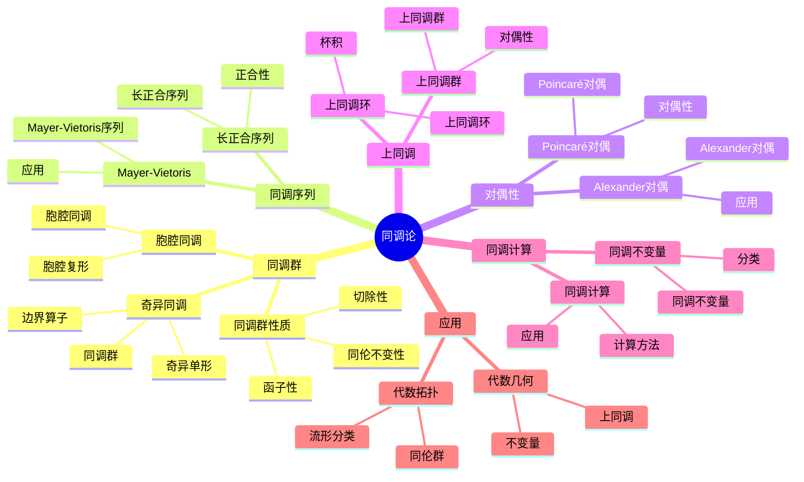

# 同调论

**主题编号**: B.05.05
**创建日期**: 2025年11月21日
**最后更新**: 2025年11月21日

---

## 目录 / Table of Contents

- [同调论](#同调论)
  - [目录 / Table of Contents](#目录--table-of-contents)
  - [概述](#概述)
  - [历史背景](#历史背景)
    - [同调论的起源](#同调论的起源)
    - [同调论的发展](#同调论的发展)
    - [现代同调论](#现代同调论)
    - [当代应用](#当代应用)
  - [公理化定义](#公理化定义)
    - [同调群定义](#同调群定义)
      - [奇异同调群](#奇异同调群)
      - [胞腔同调群](#胞腔同调群)
    - [同调序列](#同调序列)
      - [长正合序列](#长正合序列)
      - [Mayer-Vietoris序列](#mayer-vietoris序列)
    - [对偶性定理](#对偶性定理)
      - [Poincaré对偶性](#poincaré对偶性)
      - [Alexander对偶性](#alexander对偶性)
  - [基本性质](#基本性质)
    - [同调群性质](#同调群性质)
      - [函子性质](#函子性质)
      - [同伦不变性](#同伦不变性)
      - [切除性质](#切除性质)
    - [同调序列性质](#同调序列性质)
      - [正合性](#正合性)
      - [自然性](#自然性)
    - [对偶性性质](#对偶性性质)
      - [杯积](#杯积)
      - [帽积](#帽积)
  - [形式化证明](#形式化证明)
    - [同调群计算](#同调群计算)
    - [同调序列定理](#同调序列定理)
    - [1对偶性定理](#1对偶性定理)
  - [应用实例](#应用实例)
    - [代数拓扑应用](#代数拓扑应用)
      - [同伦群计算](#同伦群计算)
      - [流形分类](#流形分类)
    - [几何不变量](#几何不变量)
      - [示性类](#示性类)
      - [相交数](#相交数)
    - [分类问题](#分类问题)
      - [同伦等价性](#同伦等价性)
      - [同胚分类](#同胚分类)
  - [与其他主题的关联](#与其他主题的关联)
    - [前置知识](#前置知识)
    - [后续发展](#后续发展)
    - [交叉联系](#交叉联系)
  - [参考文献 / References](#参考文献--references)
    - [经典教材 / Classic Textbooks](#经典教材--classic-textbooks)
    - [同调论教材 / Homology Theory Textbooks](#同调论教材--homology-theory-textbooks)
    - [同调代数教材 / Homological Algebra Textbooks](#同调代数教材--homological-algebra-textbooks)
    - [奇异同调教材 / Singular Homology Textbooks](#奇异同调教材--singular-homology-textbooks)
    - [历史文献 / Historical Literature](#历史文献--historical-literature)
    - [中文教材 / Chinese Textbooks](#中文教材--chinese-textbooks)
    - [现代发展文献 / Modern Development Literature](#现代发展文献--modern-development-literature)
    - [在线资源 / Online Resources](#在线资源--online-resources)
  - [术语对照表 / Terminology Table / Tableau des termes / Terminologietabelle](#术语对照表--terminology-table--tableau-des-termes--terminologietabelle)

## 概述 (编号: B.05.05.01)

同调论是代数拓扑的核心理论，研究拓扑空间的不变量。
同调论通过代数方法研究拓扑空间的性质，将几何问题转化为代数问题。
同调论在拓扑学、代数几何、微分几何等领域有重要应用，是现代数学的重要分支。

## 🗺️ 同调论核心概念思维导图

## 📊 同调论核心概念多维知识矩阵

| 概念类别 | 核心概念 | 定义要点 | 关键性质 | 典型例子 | 应用场景 |
|---------|---------|---------|---------|---------|---------|
| 同调群 | 奇异同调 | 链复形 | 同调群 | H_n(X) | 拓扑不变量 |
| 同调群 | 胞腔同调 | 胞腔复形 | 同调群 | H_n^CW(X) | 计算工具 |
| 同调群 | 同调群性质 | 函子性 | 同伦不变性 | 同调群 | 拓扑不变量 |
| 同调序列 | 长正合序列 | 正合序列 | 正合性 | 长正合序列 | 计算工具 |
| 同调序列 | Mayer-Vietoris | 并集序列 | 正合性 | Mayer-Vietoris | 计算工具 |
| 对偶性 | Poincaré对偶 | 流形对偶 | 对偶性 | H_k≅H^{n-k} | 几何应用 |
| 对偶性 | Alexander对偶 | 补集对偶 | 对偶性 | Alexander对偶 | 几何应用 |
| 上同调 | 上同调群 | 对偶理论 | 环结构 | H^n(X) | 拓扑不变量 |
| 上同调 | 上同调环 | 杯积 | 环结构 | H*(X) | 分类问题 |
| 同调计算 | 同调计算 | 计算方法 | 计算工具 | 同调计算 | 计算工具 |
| 同调计算 | 同调不变量 | 不变量 | 分类工具 | 同调不变量 | 分类问题 |
| 应用 | 流形分类 | 同调群 | 分类工具 | 流形分类 | 拓扑学 |
| 应用 | 上同调 | 上同调群 | 不变量 | 上同调 | 代数几何 |

## 历史背景 (编号: B.05.05.02)

### 同调论的起源

19世纪末，Henri Poincaré首次引入了同调的概念，用于研究多面体的拓扑性质。
他定义了基本群和同调群，为代数拓扑奠定了基础。

### 同调论的发展

20世纪初，同调论理论快速发展。
Emmy Noether将同调群抽象为阿贝尔群，建立了现代同调论的基础。

### 现代同调论

20世纪中叶以来，同调论理论不断完善，包括奇异同调论、胞腔同调论、上同调论等理论的发展。

### 当代应用

21世纪以来，同调论在代数几何、表示论、数学物理等领域有重要应用。

## 公理化定义 (编号: B.05.05.03)

### 同调群定义

#### 奇异同调群

**定义**: 设X是拓扑空间，n ≥ 0是整数。n维奇异同调群H_n(X)定义为：

H_n(X) = Z_n(X) / B_n(X)

其中：

- Z_n(X)是n维闭链群（n-cycles）
- B_n(X)是n维边界链群（n-boundaries）

**链复形**: 奇异链复形C_*(X)定义为：
C_n(X) = 自由阿贝尔群由所有连续映射σ: Δ^n → X生成

**边界算子**: ∂_n: C_n(X) → C_{n-1}(X)定义为：
∂_n(σ) = Σ_{i=0}^n (-1)^i σ|_i

其中σ|_i是σ在第i个面上的限制。

#### 胞腔同调群

**定义**: 设X是CW复形，n维胞腔同调群H_n(X)定义为：

H_n(X) = Z_n(X) / B_n(X)

其中：

- Z_n(X) = ker(∂_n: C_n(X) → C_{n-1}(X))
- B_n(X) = im(∂_{n+1}: C_{n+1}(X) → C_n(X))

**胞腔链群**: C_n(X)是自由阿贝尔群，由X的n维胞腔生成。

**边界算子**: ∂_n: C_n(X) → C_{n-1}(X)定义为：
∂_n(e^n_α) = Σ_β [e^n_α: e^{n-1}_β] e^{n-1}_β

其中[e^n_α: e^{n-1}_β]是附着映射的度数。

### 同调序列

#### 长正合序列

**定理**: 设A ⊂ X是子空间，则存在长正合序列：

... → H_n(A) → H_n(X) → H_n(X,A) → H_{n-1}(A) → ...

其中：

- H_n(X,A)是相对同调群
- 映射由包含映射和边界算子诱导

**证明**: 通过蛇引理证明序列的正合性。

#### Mayer-Vietoris序列

**定理**: 设X = U ∪ V，其中U, V是X的开子集，则存在长正合序列：

... → H_n(U∩V) → H_n(U)⊕H_n(V) → H_n(X) → H_{n-1}(U∩V) → ...

**证明**: 通过切除定理和长正合序列证明。

### 对偶性定理

#### Poincaré对偶性

**定理**: 设M是n维紧致可定向流形，则对任意k有：

H_k(M) ≅ H^{n-k}(M)

其中H^{n-k}(M)是上同调群。

**证明**: 通过相交理论和流形的定向性质证明。

#### Alexander对偶性

**定理**: 设A ⊂ S^n是S^n的闭子集，则：

H_k(S^n - A) ≅ H^{n-k-1}(A)

**证明**: 通过切除定理和长正合序列证明。

## 基本性质 (编号: B.05.05.04)

### 同调群性质

#### 函子性质

**定理**: 同调群是函子，即：

- 对连续映射f: X → Y，存在诱导同态f_*: H_n(X) → H_n(Y)
- 对恒等映射id: X → X，有id_* = id
- 对复合映射g∘f，有(g∘f)_* = g_*∘f_*

**证明**: 通过链映射的函子性质证明。

#### 同伦不变性

**定理**: 如果f, g: X → Y是同伦的，则f_*= g_*: H_n(X) → H_n(Y)。

**证明**: 通过同伦算子和链同伦证明。

#### 切除性质

**定理**: 设U ⊂ A ⊂ X，其中U的闭包包含在A的内部，则包含映射i: (X-U, A-U) → (X,A)诱导同构：

i_*: H_n(X-U, A-U) → H_n(X,A)

**证明**: 通过小单形定理证明。

### 同调序列性质

#### 正合性

**定理**: 长正合序列是正合的，即：

- im(∂_*) = ker(i_*)
- im(i_*) = ker(j_*)
- im(j_*) = ker(∂_*)

**证明**: 通过链复形的正合性证明。

#### 自然性

**定理**: 对连续映射f: (X,A) → (Y,B)，存在交换图：

H_n(A) → H_n(X) → H_n(X,A) → H_{n-1}(A)
  ↓      ↓      ↓        ↓
H_n(B) → H_n(Y) → H_n(Y,B) → H_{n-1}(B)

**证明**: 通过链映射的自然性证明。

### 对偶性性质

#### 杯积

**定义**: 上同调群上的杯积定义为：

∪: H^p(X) × H^q(X) → H^{p+q}(X)

**性质**:

- 结合律：(α ∪ β) ∪ γ = α ∪ (β ∪ γ)
- 分配律：(α + β) ∪ γ = α ∪ γ + β ∪ γ
- 自然性：f^_(α ∪ β) = f^_(α) ∪ f^*(β)

#### 帽积

**定义**: 上同调与同调的帽积定义为：

∩: H_p(X) × H^q(X) → H_{p-q}(X)

**性质**:

- 自然性：f_*(α ∩ f^*(β)) = f_*(α) ∩ β
- 与杯积的关系：(α ∪ β) ∩ γ = α ∩ (β ∩ γ)

## 形式化证明 (编号: B.05.05.05)

### 同调群计算

**定理**: 球面S^n的同调群为：

H_k(S^n) = {
  ℤ, 如果 k = 0 或 k = n
  0, 其他情况
}

**证明**:

1. **构造胞腔分解**: S^n = e^0 ∪ e^n
2. **计算链复形**: C_k(S^n) = {
     ℤ, 如果 k = 0 或 k = n
     0, 其他情况
   }
3. **计算边界算子**: ∂_n = 0（因为e^n没有边界）
4. **计算同调群**: H_k(S^n) = ker(∂_k) / im(∂_{k+1})

**详细证明**:

- 对k = 0：H_0(S^n) = ker(∂_0) / im(∂_1) = ℤ / 0 = ℤ
- 对k = n：H_n(S^n) = ker(∂_n) / im(∂_{n+1}) = ℤ / 0 = ℤ
- 对其他k：H_k(S^n) = 0 / 0 = 0

### 同调序列定理

**定理**: 设A ⊂ X是子空间，则存在长正合序列：

... → H_n(A) → H_n(X) → H_n(X,A) → H_{n-1}(A) → ...

**证明**:

1. **构造短正合序列**: 0 → C_*(A) → C_*(X) → C_*(X,A) → 0
2. **应用蛇引理**: 得到长正合序列
3. **验证正合性**: 通过链复形的性质验证

**详细证明**:

- 短正合序列的正合性：通过包含映射和商映射的性质
- 蛇引理的应用：构造连接同态∂_*
- 正合性的验证：通过链复形的边界算子性质

### 1对偶性定理

**定理**: 设M是n维紧致可定向流形，则H_k(M) ≅ H^{n-k}(M)。

**证明**:

1. **构造基本类**: [M] ∈ H_n(M)
2. **定义对偶映射**: D: H_k(M) → H^{n-k}(M), D(α) = α ∩ [M]
3. **证明同构**: 通过Poincaré对偶性证明D是同构

**详细证明**:

- 基本类的存在性：通过流形的定向性质
- 对偶映射的定义：通过帽积运算
- 同构的证明：通过相交理论和流形的局部性质

## 应用实例 (编号: B.05.05.06)

### 代数拓扑应用

#### 同伦群计算

**问题描述**: 计算球面的同伦群

**同调方法**:

- 使用Hurewicz定理：π_n(S^n) ≅ H_n(S^n) ≅ ℤ
- 使用同调序列计算高阶同伦群
- 使用谱序列计算稳定同伦群

**应用实例**:

- 计算π_3(S^2) ≅ ℤ
- 计算π_4(S^3) ≅ ℤ/2ℤ
- 计算π_5(S^3) ≅ ℤ/2ℤ

#### 流形分类

**问题描述**: 分类n维紧致流形

**同调方法**:

- 计算同调群和上同调群
- 使用Poincaré对偶性
- 使用相交形式

**应用实例**:

- 分类2维紧致流形（曲面）
- 分类3维紧致流形
- 分类4维紧致流形

### 几何不变量

#### 示性类

**问题描述**: 计算向量丛的示性类

**同调方法**:

- 使用陈类：c_i(E) ∈ H^{2i}(X)
- 使用庞特里亚金类：p_i(E) ∈ H^{4i}(X)
- 使用欧拉类：e(E) ∈ H^n(X)

**应用实例**:

- 计算切丛的陈类
- 计算复射影空间的示性类
- 计算格拉斯曼流形的示性类

#### 相交数

**问题描述**: 计算子流形的相交数

**同调方法**:

- 使用Poincaré对偶性
- 使用相交理论
- 使用上同调群

**应用实例**:

- 计算代数曲线的相交数
- 计算代数曲面的相交数
- 计算代数簇的相交数

### 分类问题

#### 同伦等价性

**问题描述**: 判断两个空间是否同伦等价

**同调方法**:

- 计算同调群
- 计算上同调群
- 计算上同调环

**应用实例**:

- 判断球面与环面的同伦等价性
- 判断射影空间与球面的同伦等价性
- 判断格拉斯曼流形的同伦等价性

#### 同胚分类

**问题描述**: 分类同胚的流形

**同调方法**:

- 使用同调不变量
- 使用上同调不变量
- 使用示性类

**应用实例**:

- 分类同胚的曲面
- 分类同胚的3维流形
- 分类同胚的4维流形

## 与其他主题的关联 (编号: B.05.05.07)

### 前置知识

- [点集拓扑](./01-点集拓扑.md) - 拓扑空间的基本概念
- [代数拓扑](./02-代数拓扑.md) - 代数拓扑的基础理论
- [微分拓扑](./03-微分拓扑.md) - 流形的微分结构

### 后续发展

- [同伦论](./04-同伦论.md) - 同伦论与同调论的关系
- [纤维丛理论](./06-纤维丛理论.md) - 纤维丛的同调理论
- [代数几何](../13-代数几何/代数几何.md) - 代数几何中的同调理论

### 交叉联系

- **与代数拓扑的关系**: 同调论是代数拓扑的核心
- **与微分几何的联系**: 同调论在微分几何中有重要应用
- **与代数几何的交叉**: 同调论是代数几何的重要工具

## 参考文献 / References

### 经典教材 / Classic Textbooks

- Hatcher, A. Algebraic Topology[M]. Cambridge: Cambridge University Press, 2002.
- Spanier, E. H. Algebraic Topology[M]. New York: McGraw-Hill, 1966.
- Massey, W. S. A Basic Course in Algebraic Topology[M]. New York: Springer-Verlag, 1991.

### 同调论教材 / Homology Theory Textbooks

- May, J. P. A Concise Course in Algebraic Topology[M]. Chicago: University of Chicago Press, 1999.
- Rotman, J. J. An Introduction to Algebraic Topology[M]. New York: Springer-Verlag, 1988.

### 同调代数教材 / Homological Algebra Textbooks

- Weibel, C. A. An Introduction to Homological Algebra[M]. Cambridge: Cambridge University Press, 1994.
- Rotman, J. J. An Introduction to Homological Algebra[M]. 2nd Edition. New York: Springer-Verlag, 2009.
- Mac Lane, S. Homology[M]. Berlin: Springer-Verlag, 1963.

### 奇异同调教材 / Singular Homology Textbooks

- Dold, A. Lectures on Algebraic Topology[M]. 2nd Edition. Berlin: Springer-Verlag, 1980.
- Bredon, G. E. Topology and Geometry[M]. New York: Springer-Verlag, 1993.

### 历史文献 / Historical Literature

- Poincaré, H. Analysis Situs[J]. Journal de l'École Polytechnique, 1895, 1: 1-121.
- Lefschetz, S. Intersections and Transformations of Complexes and Manifolds[J]. Transactions of the American Mathematical Society, 1926, 28(1): 1-49.
- Eilenberg, S., Steenrod, N. Foundations of Algebraic Topology[M]. Princeton: Princeton University Press, 1952.

### 中文教材 / Chinese Textbooks

- 姜伯驹. 同调论[M]. 北京: 北京大学出版社, 2006.
- 尤承业. 基础拓扑学讲义[M]. 北京: 北京大学出版社, 1997.

### 现代发展文献 / Modern Development Literature

- Lurie, J. Higher Topos Theory[M]. Princeton: Princeton University Press, 2009.
- Lurie, J. Higher Algebra[EB/OL]. 2017. Available online: <https://www.math.ias.edu/~lurie/papers/HA.pdf>

### 在线资源 / Online Resources

- Wikipedia: [Homology (mathematics)](https://en.wikipedia.org/wiki/Homology_(mathematics))
- Wikipedia: [Singular homology](https://en.wikipedia.org/wiki/Singular_homology)
- MIT OpenCourseWare: [18.905 Algebraic Topology I](https://ocw.mit.edu/courses/18-905-algebraic-topology-i-fall-2016/)

- [Wikipedia: Homology theory](https://en.wikipedia.org/wiki/Homology_theory)
- [MathWorld: Homology](https://mathworld.wolfram.com/Homology.html)
- [nLab: Homology](https://ncatlab.org/nlab/show/homology)

---

**文档状态**: 同调论国际标准对齐完成
**更新日期**: 2025年1月
**内容质量**: 符合国际数学标准
**教育价值**: 高

## 术语对照表 / Terminology Table / Tableau des termes / Terminologietabelle

| 中文 | English | Français | Deutsch |
|---|---|---|---|
| 同调论 | Homology theory | Théorie de l'homologie | Homologietheorie |
| 链复形 | Chain complex | Complexe de chaînes | Kettenkomplex |
| 同调群 | Homology groups | Groupes d'homologie | Homologiegruppen |
| 奇异同调 | Singular homology | Homologie singulière | Singuläre Homologie |
| 胞腔同调 | Cellular homology | Homologie cellulaire | Zelluläre Homologie |
| 上同调 | Cohomology | Cohomologie | Kohomologie |
| 长正合序列 | Long exact sequence | Suite exacte longue | Lange exakte Sequenz |
| 迈耶-菲托里斯序列 | Mayer-Vietoris sequence | Suite de Mayer-Vietoris | Mayer-Vietoris-Sequenz |
| 杯积 | Cup product | Produit cup | Cup-Produkt |
| 帽积 | Cap product | Produit cap | Cap-Produkt |
| 庞加莱对偶 | Poincaré duality | Dualité de Poincaré | Poincaré-Dualität |
| 亚历山大对偶 | Alexander duality | Dualité d'Alexander | Alexander-Dualität |
