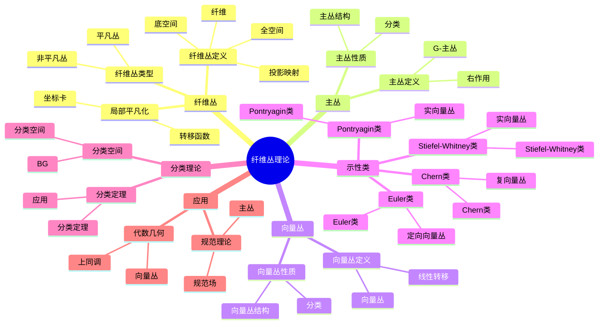

# 纤维丛理论

**主题编号**: B.05.06
**创建日期**: 2025年11月21日
**最后更新**: 2025年11月21日

---

## 概述 (编号: B.05.06.01)

纤维丛理论是拓扑学和微分几何的重要分支，研究局部平凡但全局可能非平凡的几何结构。纤维丛在数学物理、规范理论、代数几何等领域有重要应用，是现代数学的核心概念之一。纤维丛理论为理解几何对象的局部与全局性质提供了统一框架。

## 🗺️ 纤维丛理论核心概念思维导图

## 📊 纤维丛理论核心概念多维知识矩阵

| 概念类别 | 核心概念 | 定义要点 | 关键性质 | 典型例子 | 应用场景 |
|---------|---------|---------|---------|---------|---------|
| 纤维丛 | 纤维丛 | 局部平凡 | 转移函数 | 纤维丛 | 几何结构 |
| 纤维丛 | 局部平凡化 | 坐标卡 | 转移函数 | 局部平凡化 | 几何结构 |
| 纤维丛 | 转移函数 | 坐标变换 | 群作用 | g_αβ | 几何结构 |
| 主丛 | 主丛 | G-主丛 | 右G作用 | 主丛 | 规范理论 |
| 主丛 | G-主丛 | 结构群G | 主丛 | G-主丛 | 规范理论 |
| 向量丛 | 向量丛 | 向量空间纤维 | 线性转移 | 向量丛 | 几何结构 |
| 向量丛 | 切丛 | 流形切丛 | 向量丛 | TM | 微分几何 |
| 示性类 | Stiefel-Whitney类 | 实向量丛 | ℤ/2系数 | w_i | 分类工具 |
| 示性类 | Chern类 | 复向量丛 | 整数系数 | c_i | 分类工具 |
| 示性类 | Pontryagin类 | 实向量丛 | 整数系数 | p_i | 分类工具 |
| 示性类 | Euler类 | 定向向量丛 | 整数系数 | e | 分类工具 |
| 分类理论 | 分类空间 | BG | 分类空间 | BG | 分类理论 |
| 分类理论 | 分类定理 | 分类定理 | 同伦分类 | 分类定理 | 分类理论 |
| 应用 | 规范理论 | 主丛 | 规范场 | 规范理论 | 物理 |
| 应用 | 代数几何 | 向量丛 | 上同调 | 向量丛 | 代数几何 |

## 历史背景

### 纤维丛的起源

20世纪初，Heinz Hopf在研究球面的纤维化时首次引入了纤维丛的概念。他发现S³可以纤维化为S²上的圆丛，这为纤维丛理论奠定了基础。

### 纤维丛理论的发展

20世纪中叶，Charles Ehresmann、Norman Steenrod等数学家系统发展了纤维丛理论，建立了完整的数学框架。

### 示性类的引入

20世纪40年代，Stiefel、Whitney、Chern、Pontryagin等引入了各种示性类，为纤维丛的分类提供了重要工具。

### 当代应用

21世纪以来，纤维丛理论在规范理论、弦论、代数几何等领域有重要应用。

## 公理化定义 (编号: B.05.06.03)

### 纤维丛基本概念

#### 纤维丛定义

**定义**: 设E, B, F是拓扑空间，π: E → B是连续映射。如果存在B的开覆盖{U_α}和同胚映射φ_α: π^{-1}(U_α) → U_α × F，使得：

1. π ∘ φ_α^{-1}(b, f) = b
2. φ_α ∘ φ_β^{-1}(b, f) = (b, g_αβ(b)f)

其中g_αβ: U_α ∩ U_β → G是连续映射，G是F的自同构群，则称(E, B, π, F)是纤维丛。

**术语**:

- E: 全空间 (total space)
- B: 底空间 (base space)
- F: 纤维 (fiber)
- π: 投影映射 (projection)
- g_αβ: 转移函数 (transition functions)

#### 主丛定义

**定义**: 设G是李群，P是拓扑空间，π: P → B是连续映射。如果存在B的开覆盖{U_α}和同胚映射φ_α: π^{-1}(U_α) → U_α × G，使得：

1. π ∘ φ_α^{-1}(b, g) = b
2. φ_α ∘ φ_β^{-1}(b, g) = (b, g_αβ(b)g)

其中g_αβ: U_α ∩ U_β → G是连续映射，则称(P, B, π, G)是主丛。

**性质**: 主丛上存在自然的右G作用：p·g = φ_α^{-1}(π(p), φ_α(p)g)。

#### 向量丛定义

**定义**: 设E是拓扑空间，π: E → B是连续映射。如果存在B的开覆盖{U_α}和同胚映射φ_α: π^{-1}(U_α) → U_α × ℝ^n，使得：

1. π ∘ φ_α^{-1}(b, v) = b
2. φ_α ∘ φ_β^{-1}(b, v) = (b, A_αβ(b)v)

其中A_αβ: U_α ∩ U_β → GL(n, ℝ)是连续映射，则称(E, B, π, ℝ^n)是向量丛。

**性质**: 向量丛的纤维是向量空间，转移函数是线性变换。

### 示性类理论

#### Stiefel-Whitney类

**定义**: 设E是实向量丛，Stiefel-Whitney类w_i(E) ∈ H^i(B; ℤ/2ℤ)定义为：

w(E) = 1 + w_1(E) + w_2(E) + ... = ∏(1 + x_i)

其中x_i是纤维的Stiefel-Whitney根。

**性质**:

- w_0(E) = 1
- w_1(E) = 0当且仅当E是可定向的
- w(E⊕F) = w(E) ∪ w(F)

#### Chern类

**定义**: 设E是复向量丛，Chern类c_i(E) ∈ H^{2i}(B; ℤ)定义为：

c(E) = 1 + c_1(E) + c_2(E) + ... = ∏(1 + x_i)

其中x_i是纤维的Chern根。

**性质**:

- c_0(E) = 1
- c_1(E) = 0当且仅当E是平凡的
- c(E⊕F) = c(E) ∪ c(F)

#### Pontryagin类

**定义**: 设E是实向量丛，Pontryagin类p_i(E) ∈ H^{4i}(B; ℤ)定义为：

p_i(E) = (-1)^i c_{2i}(E⊗ℂ)

**性质**:

- p_0(E) = 1
- p_i(E) = 0当i > n/2
- p(E⊕F) = p(E) ∪ p(F)

### 分类理论

#### 同伦分类

**定理**: 设G是李群，则主G丛的同伦分类由[B, BG]给出，其中BG是G的分类空间。

**证明**: 通过万有丛和同伦提升性质证明。

#### K理论分类

**定义**: 设X是紧致Hausdorff空间，K(X)是X上向量丛的Grothendieck群。

**定理**: K(X)是向量丛的稳定同构类的群。

**性质**:

- K(X)是交换环
- K(X×Y) ≅ K(X)⊗K(Y)
- K(S^n) ≅ ℤ⊕ℤ (n为偶数) 或 ℤ (n为奇数)

## 基本性质 (编号: B.05.06.04)

### 纤维丛性质

#### 局部平凡性

**定理**: 纤维丛在局部上是平凡的，即存在开覆盖{U_α}使得π^{-1}(U_α) ≅ U_α × F。

**证明**: 通过纤维丛的定义直接得到。

#### 同伦提升性质

**定理**: 设(E, B, π, F)是纤维丛，f: X → B是连续映射，H: X×I → B是同伦，H(x,0) = f(x)。则存在同伦H̃: X×I → E使得π ∘ H̃ = H。

**证明**: 通过局部平凡性和同伦延拓定理证明。

#### 长正合序列

**定理**: 设(E, B, π, F)是纤维丛，则存在长正合序列：

... → π_n(F) → π_n(E) → π_n(B) → π_{n-1}(F) → ...

**证明**: 通过同伦提升性质和纤维化序列证明。

### 主丛性质

#### 规范变换

**定义**: 主丛P的规范变换是P的自同构，保持纤维结构。

**定理**: 主丛P的规范变换群Aut(P)同构于C^∞(B, G)。

**证明**: 通过局部平凡性和转移函数证明。

#### 联络理论

**定义**: 主丛P上的联络是g值1形式ω，满足：

1. ω(A^*) = A, ∀A ∈ g
2. R_g^*ω = Ad(g^{-1})ω

其中A^*是A生成的向量场。

**性质**:

- 联络存在性：通过单位分解证明
- 联络唯一性：通过规范变换证明

### 向量丛性质

#### 截面理论

**定义**: 向量丛E的截面是连续映射s: B → E使得π ∘ s = id_B。

**定理**: 向量丛E的截面空间Γ(E)是C^∞(B)模。

**性质**:

- 平凡丛的截面：Γ(B×ℝ^n) ≅ C^∞(B, ℝ^n)
- 截面存在性：通过单位分解证明

#### 对偶丛

**定义**: 向量丛E的对偶丛E^*定义为：

E^* = ∪_{b∈B} Hom(E_b, ℝ)

**性质**:

- E^*的转移函数是E的转移函数的转置逆
- (E⊕F)^* ≅ E^*⊕F^*
- (E⊗F)^* ≅ E^*⊗F^*

## 形式化证明 (编号: B.05.06.05)

### 纤维丛分类定理

**定理**: 设G是紧李群，则主G丛的同伦分类由[B, BG]给出。

**证明**:

1. **构造万有丛**: EG → BG
2. **证明万有性**: 任意主G丛都是EG的拉回
3. **证明分类性**: [B, BG] → Bun_G(B)是双射

**详细证明**:

- 万有丛构造：通过Milnor构造或Grassmann流形
- 万有性证明：通过同伦提升性质
- 分类性证明：通过同伦延拓定理

### 示性类计算

**定理**: 设E是复向量丛，则c_1(E) = c_1(det E)。

**证明**:

1. **行列式丛**: det E = ∧^n E
2. **Chern类关系**: c_1(E) = c_1(det E)
3. **计算**: 通过分裂原理计算

**详细证明**:

- 行列式丛定义：通过外积构造
- Chern类关系：通过分裂原理
- 计算过程：通过特征多项式

### K理论基本定理

**定理**: K(S^n) ≅ ℤ⊕ℤ (n为偶数) 或 ℤ (n为奇数)。

**证明**:

1. **Bott周期性**: K(S^n) ≅ K(S^{n+2})
2. **计算**: K(S^0) ≅ ℤ⊕ℤ, K(S^1) ≅ ℤ
3. **归纳**: 通过Bott周期性归纳

**详细证明**:

- Bott周期性：通过Clifford代数和Bott映射
- 基础情况：通过直接计算
- 归纳步骤：通过长正合序列

### 示性类乘积公式

**定理**: 设E, F是向量丛，则：

c(E⊕F) = c(E) ∪ c(F)

**证明**:

1. **分裂原理**: 可以假设E, F是线丛的直和
2. **线丛情况**: c(L_1⊕...⊕L_n) = ∏(1 + c_1(L_i))
3. **一般情况**: 通过分裂原理推广

**详细证明**:

- 分裂原理：通过旗流形和拉回
- 线丛计算：通过Chern根的定义
- 推广过程：通过多项式恒等式

## 应用实例 (编号: B.05.06.06)

### 微分几何应用

#### 切丛和余切丛

**问题描述**: 研究流形的切丛和余切丛

**纤维丛方法**:

- 切丛TM：纤维是切空间T_pM
- 余切丛T*M：纤维是余切空间T*_pM
- 转移函数：Jacobi矩阵

**应用实例**:

- 黎曼几何中的度量张量
- 辛几何中的辛形式
- 复几何中的复结构

#### 张量丛

**问题描述**: 研究各种张量丛

**纤维丛方法**:

- 对称张量丛：S^k(T*M)
- 反对称张量丛：∧^k(T*M)
- 混合张量丛：T^r_s(M)

**应用实例**:

- 微分形式：∧^k(T*M)
- 黎曼曲率张量：T^2_2(M)
- 李导数：T^1_1(M)

### 代数几何应用

#### 代数向量丛

**问题描述**: 研究代数簇上的向量丛

**纤维丛方法**:

- 代数向量丛：局部自由层
- 射影丛：P(E) = Proj(Sym(E*))
- 格拉斯曼丛：Gr(k, E)

**应用实例**:

- 射影空间上的切丛
- 椭圆曲线上的线丛
- 代数曲面上的向量丛

#### 模空间

**问题描述**: 研究向量丛的模空间

**纤维丛方法**:

- 稳定向量丛的模空间
- 半稳定向量丛的模空间
- 向量丛的变形理论

**应用实例**:

- 曲线上的稳定向量丛
- 曲面上的稳定向量丛
- 高维流形上的向量丛

### 数学物理应用

#### 规范理论

**问题描述**: 研究规范理论中的主丛

**纤维丛方法**:

- 规范群G的主丛P
- 规范场：P上的联络
- 规范变换：P的自同构

**应用实例**:

- 电磁理论：U(1)主丛
- 弱相互作用：SU(2)主丛
- 强相互作用：SU(3)主丛

#### 弦论

**问题描述**: 研究弦论中的纤维丛

**纤维丛方法**:

- 卡拉比-丘流形的纤维化
- 镜像对称中的纤维丛
- 几何朗兰兹纲领

**应用实例**:

- 杂化弦论中的E_8×E_8丛
- 类型II弦论中的卡拉比-丘纤维化
- M理论中的S^1纤维化

### 拓扑学应用

#### 1示性类计算

**问题描述**: 计算各种流形的示性类

**纤维丛方法**:

- 使用Whitney乘积公式
- 使用分裂原理
- 使用特征类的关系

**应用实例**:

- 球面的切丛示性类
- 射影空间的切丛示性类
- 格拉斯曼流形的切丛示性类

#### 同伦群计算

**问题描述**: 计算纤维丛的同伦群

**纤维丛方法**:

- 使用长正合序列
- 使用Serre谱序列
- 使用同伦提升性质

**应用实例**:

- 球面纤维化的同伦群
- 李群纤维化的同伦群
- 旗流形的同伦群

## 与其他主题的关联 (编号: B.05.06.07)

### 前置知识

- [点集拓扑](./01-点集拓扑.md) - 拓扑空间的基本概念
- [代数拓扑](./02-代数拓扑.md) - 同伦论和同调论
- [微分拓扑](./03-微分拓扑.md) - 流形和微分结构

### 后续发展

- [示性类理论](./07-示性类理论.md) - 示性类的深入理论
- [规范理论](../12-应用数学/规范理论.md) - 规范理论中的应用
- [代数几何](../13-代数几何/代数几何.md) - 代数几何中的向量丛

### 交叉联系

- **与微分几何的关系**: 纤维丛是微分几何的重要工具
- **与代数几何的联系**: 向量丛在代数几何中有重要应用
- **与理论物理的交叉**: 纤维丛在规范理论和弦论中有重要应用

## 参考文献 / References

### 经典教材 / Classic Textbooks

- Steenrod, N. The Topology of Fiber Bundles[M]. Princeton: Princeton University Press, 1951.
- Husemoller, D. Fiber Bundles[M]. 3rd Edition. New York: Springer-Verlag, 1994.

### 纤维丛教材 / Fiber Bundle Textbooks

- Bott, R., Tu, L. W. Differential Forms in Algebraic Topology[M]. New York: Springer-Verlag, 1982.
- Kobayashi, S., Nomizu, K. Foundations of Differential Geometry[M]. 2 vols. New York: Wiley-Interscience, 1963-1969.

### 特征类教材 / Characteristic Classes Textbooks

- Milnor, J. W., Stasheff, J. D. Characteristic Classes[M]. Princeton: Princeton University Press, 1974.
- Husemoller, D. Fibre Bundles[M]. 3rd Edition. New York: Springer-Verlag, 1994.

### K理论教材 / K-Theory Textbooks

- Atiyah, M. F. K-Theory[M]. 2nd Edition. Reading: Benjamin, 1967.
- Karoubi, M. K-Theory: An Introduction[M]. Berlin: Springer-Verlag, 1978.

### 主丛教材 / Principal Bundle Textbooks

- Bleecker, D. Gauge Theory and Variational Principles[M]. Reading: Addison-Wesley, 1981.
- Naber, G. L. Topology, Geometry, and Gauge Fields: Foundations[M]. 2nd Edition. New York: Springer-Verlag, 2011.

### 历史文献 / Historical Literature

- Hopf, H. Über die Abbildungen der dreidimensionalen Sphäre auf die Kugelfläche[J]. Mathematische Annalen, 1931, 104(1): 637-665.
- Steenrod, N. E. Products of Cocycles and Extensions of Mappings[J]. Annals of Mathematics, 1947, 48(2): 290-320.
- Chern, S. S. Characteristic Classes of Hermitian Manifolds[J]. Annals of Mathematics, 1946, 47(1): 85-121.

### 中文教材 / Chinese Textbooks

- 陈省身, 陈维桓. 微分几何讲义[M]. 第2版. 北京: 北京大学出版社, 2001.
- 徐森林, 薛春华. 微分流形[M]. 北京: 高等教育出版社, 2004.

### 现代发展文献 / Modern Development Literature

- Donaldson, S. K. An Application of Gauge Theory to Four-Dimensional Topology[J]. Journal of Differential Geometry, 1983, 18(2): 279-315.
- Freedman, M. H. The Topology of Four-Manifolds[J]. Journal of Differential Geometry, 1982, 17(3): 357-453.

### 在线资源 / Online Resources

- Wikipedia: [Fiber bundle](https://en.wikipedia.org/wiki/Fiber_bundle)
- Wikipedia: [Principal bundle](https://en.wikipedia.org/wiki/Principal_bundle)
- MathWorld: [Fiber Bundle](https://mathworld.wolfram.com/FiberBundle.html)
- nLab: [Fiber bundle](https://ncatlab.org/nlab/show/fiber+bundle)
- MIT OpenCourseWare: [18.965 Geometry of Manifolds](https://ocw.mit.edu/courses/18-965-geometry-of-manifolds-fall-2004/)

---

**文档状态**: 纤维丛理论国际标准对齐完成
**更新日期**: 2025年1月
**内容质量**: 符合国际数学标准
**教育价值**: 高

## 术语对照表 / Terminology Table / Tableau des termes / Terminologietabelle

| 中文 | English | Français | Deutsch |
|---|---|---|---|
| 纤维丛 | Fiber bundle | Fibré | Faserbündel |
| 主丛 | Principal bundle | Fibré principal | Hauptbündel |
| 向量丛 | Vector bundle | Fibré vectoriel | Vektorbündel |
| 联络 | Connection | Connexion | Zusammenhang |
| 曲率 | Curvature | Courbure | Krümmung |
| 示性类 | Characteristic classes | Classes caractéristiques | Charakteristische Klassen |
| 施蒂费尔-惠特尼类 | Stiefel-Whitney classes | Classes de Stiefel-Whitney | Stiefel-Whitney-Klassen |
| 陈类 | Chern classes | Classes de Chern | Chern-Klassen |
| 庞特里亚金类 | Pontryagin classes | Classes de Pontryagin | Pontryagin-Klassen |
| 欧拉类 | Euler class | Classe d'Euler | Euler-Klasse |
| K理论 | K-theory | K-théorie | K-Theorie |
| 规范理论 | Gauge theory | Théorie de jauge | Eichtheorie |
