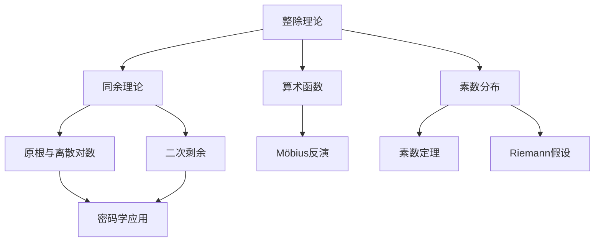

# 整除理论 / Divisibility Theory

> **教学深度**：本科基础 / 研究生入门
> **参考标准**：MIT 18.310 Principles of Discrete Applied Mathematics, Harvard Math 152 Discrete Mathematics
> **MSC2020**: 11A05 (乘法结构), 11A25 (算术函数), 11A41 (素数)

---

## 概念深度解析

### 直观理解

**整除**是数论中最基础的关系之一。我们说"$a$ 整除 $b$"，直观上意味着 $b$ 可以被 $a$ "完全分割"，没有余数。这就像把 $b$ 个物品平均分成 $a$ 组，每组数量相同且没有剩余。

**核心思想**：整除关系建立了整数之间的"层次结构"，使得我们能够比较数的大小关系，并引出最大公约数、最小公倍数等核心概念。

### 形式定义

**定义 1.1**（整除）：设 $a, b \in \mathbb{Z}$，且 $a \neq 0$。若存在 $k \in \mathbb{Z}$ 使得 $b = ak$，则称 **$a$ 整除 $b$**，记作 $a \mid b$。此时称 $a$ 是 $b$ 的**因数**（或**约数**），$b$ 是 $a$ 的**倍数**。

**定义 1.2**（带余除法）：设 $a, b \in \mathbb{Z}$，$b > 0$。存在唯一的 $q, r \in \mathbb{Z}$ 使得：
$$a = bq + r, \quad 0 \leq r < b$$

其中 $q$ 称为**商**（quotient），$r$ 称为**余数**（remainder）。

**定义 1.3**（最大公约数）：设 $a, b \in \mathbb{Z}$，不全为零。$a$ 和 $b$ 的**最大公约数**定义为：
$$\gcd(a, b) = \max\{d \in \mathbb{Z}^+ : d \mid a \text{ 且 } d \mid b\}$$

当 $\gcd(a, b) = 1$ 时，称 $a$ 和 $b$ **互素**（或**互质**）。

**定义 1.4**（最小公倍数）：设 $a, b \in \mathbb{Z} \setminus \{0\}$。$a$ 和 $b$ 的**最小公倍数**定义为：
$$\text{lcm}(a, b) = \min\{m \in \mathbb{Z}^+ : a \mid m \text{ 且 } b \mid m\}$$

**定义 1.5**（素数）：整数 $p > 1$ 称为**素数**（prime），如果它的正因数只有 $1$ 和 $p$。大于 $1$ 的非素数正整数称为**合数**（composite）。

### 等价表述

**命题 1.6**（整除的等价条件）：对于 $a, b \in \mathbb{Z}$，$a \neq 0$，以下条件等价：
1. $a \mid b$
2. $b \equiv 0 \pmod{a}$
3. 存在 $k \in \mathbb{Z}$ 使得 $b = ak$
4. $b$ 属于由 $a$ 生成的主理想 $(a)$

**命题 1.7**（互素的等价条件）：对于 $a, b \in \mathbb{Z}$，以下条件等价：
1. $\gcd(a, b) = 1$
2. 存在 $x, y \in \mathbb{Z}$ 使得 $ax + by = 1$（Bézout等式）
3. $a$ 在模 $b$ 下有乘法逆元
4. 理想 $(a) + (b) = (1) = \mathbb{Z}$

### 动机与背景

**历史背景**：
- **Euclid (约公元前300年)**：《几何原本》第7-9卷系统阐述了整除理论，包括辗转相除法和素数无穷性的证明
- **Bézout (1730-1783)**：证明了关于最大公约数的线性表示定理
- **Gauss (1777-1855)**：《算术研究》(Disquisitiones Arithmeticae, 1801) 奠定了现代数论的基础

**著名问题**：
- **Goldbach猜想**：每个大于2的偶数都可以表示为两个素数之和
- **孪生素数猜想**：存在无穷多对素数 $(p, p+2)$
- **素数定理**：$\pi(x) \sim \frac{x}{\ln x}$，其中 $\pi(x)$ 是不超过 $x$ 的素数个数

---

## 属性与关系

### 核心性质

**定理 2.1**（整除的基本性质）：设 $a, b, c \in \mathbb{Z}$，则：
1. **自反性**：$a \mid a$（对 $a \neq 0$）
2. **传递性**：若 $a \mid b$ 且 $b \mid c$，则 $a \mid c$
3. **线性性**：若 $a \mid b$ 且 $a \mid c$，则 $a \mid (bx + cy)$ 对所有 $x, y \in \mathbb{Z}$
4. **反对称性**：若 $a \mid b$ 且 $b \mid a$，则 $|a| = |b|$

**证明**：
1. $a = a \cdot 1$，故 $a \mid a$。
2. 设 $b = ak_1$，$c = bk_2$，则 $c = a(k_1k_2)$，故 $a \mid c$。
3. 设 $b = ak_1$，$c = ak_2$，则 $bx + cy = a(k_1x + k_2y)$，故 $a \mid (bx + cy)$。
4. 设 $b = ak_1$，$a = bk_2$，则 $a = ak_1k_2$，故 $k_1k_2 = 1$。由于 $k_1, k_2 \in \mathbb{Z}$，有 $|k_1| = |k_2| = 1$，因此 $|a| = |b|$。$\square$

**定理 2.2**（辗转相除法 / Euclidean Algorithm）：设 $a, b \in \mathbb{Z}^+$，$a > b$。递归定义：
$$\begin{align}
r_0 &= a, \quad r_1 = b \\
r_{i+2} &= r_i \bmod r_{i+1}, \quad i \geq 0
\end{align}$$

则存在 $n$ 使得 $r_{n+1} = 0$，且 $\gcd(a, b) = r_n$。

**证明**：
序列 $r_0 > r_1 > r_2 > \cdots \geq 0$ 是严格递减的非负整数序列，必在有限步内终止于 $0$。

设 $r_{n+1} = 0$。由构造，$r_n \mid r_{n-1}$。倒推可得 $r_n \mid r_{n-2}, \ldots, r_n \mid r_0 = a$ 且 $r_n \mid r_1 = b$。

反之，若 $d \mid a$ 且 $d \mid b$，则 $d \mid r_2 = a \bmod b$，递推得 $d \mid r_n$。

因此 $r_n = \gcd(a, b)$。$\square$

**定理 2.3**（Bézout定理）：设 $a, b \in \mathbb{Z}$，不全为零。则存在 $x, y \in \mathbb{Z}$ 使得：
$$ax + by = \gcd(a, b)$$

**证明**：设 $S = \{ax + by : x, y \in \mathbb{Z}, ax + by > 0\}$。由于 $a^2 + b^2 > 0$，$S$ 非空。由良序原理，$S$ 有最小元 $d = ax_0 + by_0$。

**断言**：$d \mid a$。用带余除法，$a = dq + r$，$0 \leq r < d$。则：
$$r = a - dq = a - (ax_0 + by_0)q = a(1 - x_0q) + b(-y_0q)$$

若 $r > 0$，则 $r \in S$ 且 $r < d$，矛盾。故 $r = 0$，$d \mid a$。同理 $d \mid b$。

因此 $d \leq \gcd(a, b)$。但 $\gcd(a, b) \mid d$（因 $\gcd(a, b) \mid ax_0 + by_0$），故 $d = \gcd(a, b)$。$\square$

**定理 2.4**（算术基本定理）：每个大于 $1$ 的整数 $n$ 可以唯一地表示为：
$$n = p_1^{a_1} p_2^{a_2} \cdots p_k^{a_k}$$

其中 $p_1 < p_2 < \cdots < p_k$ 是素数，$a_i \geq 1$。

**证明**：

**存在性**（归纳法）：$n = 2$ 显然。假设对所有 $m < n$ 成立。若 $n$ 是素数，则成立。否则 $n = ab$，$1 < a, b < n$，由归纳假设 $a, b$ 可分解，故 $n$ 也可分解。

**唯一性**：设 $n = p_1^{a_1} \cdots p_k^{a_k} = q_1^{b_1} \cdots q_l^{b_l}$。由 Euclid 引理，$p_1$ 整除某个 $q_j$，故 $p_1 = q_j$。两边除以 $p_1$ 继续，得 $k = l$ 且 $\{p_i\} = \{q_j\}$，指数相同。$\square$

**定理 2.5**（Euclid定理）：素数有无穷多个。

**证明**：假设素数有限，为 $p_1, \ldots, p_k$。考虑 $N = p_1p_2\cdots p_k + 1$。

对任意 $i$，$p_i \nmid N$（因 $N \equiv 1 \pmod{p_i}$）。故 $N$ 要么本身是素数，要么有新的素因子，矛盾。$\square$

**定理 2.6**（素数定理，初等形式）：设 $\pi(x)$ 为不超过 $x$ 的素数个数，则：
$$\pi(x) \sim \frac{x}{\ln x} \quad (x \to \infty)$$

**注**：完整证明需要复分析，这里仅陈述结果。

### 与其他概念的关系图



### 层次结构

```
整除理论
├── 基本概念
│   ├── 整除关系
│   ├── 带余除法
│   ├── 最大公约数
│   └── 最小公倍数
├── 核心算法
│   ├── 辗转相除法
│   └── 扩展欧几里得算法
├── 素数理论
│   ├── 素数定义与性质
│   ├── 算术基本定理
│   └── Euclid定理
└── 应用拓展
    ├── 线性Diophantine方程
    └── 中国剩余定理基础
```

---

## 示例与习题

### 基础示例

**例 3.1**（辗转相除法）：计算 $\gcd(252, 180)$。

**解**：
$$\begin{align}
252 &= 180 \cdot 1 + 72 \\
180 &= 72 \cdot 2 + 36 \\
72 &= 36 \cdot 2 + 0
\end{align}$$

故 $\gcd(252, 180) = 36$。

**例 3.2**（Bézout系数）：求整数 $x, y$ 使得 $252x + 180y = 36$。

**解**：倒推辗转相除法：
$$\begin{align}
36 &= 180 - 72 \cdot 2 \\
&= 180 - (252 - 180) \cdot 2 \\
&= 180 \cdot 3 - 252 \cdot 2
\end{align}$$

故 $x = -2$，$y = 3$。

**例 3.3**（素因数分解）：分解 $360$。

**解**：$360 = 2^3 \cdot 3^2 \cdot 5$。

### 典型示例

**例 3.4**（Fermat数）：定义 $F_n = 2^{2^n} + 1$。证明若 $m \neq n$，则 $\gcd(F_m, F_n) = 1$。

**证明**：不妨设 $m < n$。记 $k = 2^{2^m}$，则 $F_m = k + 1$。

$$F_n = 2^{2^n} + 1 = (2^{2^m})^{2^{n-m}} + 1 = k^{2^{n-m}} + 1$$

由于 $k \equiv -1 \pmod{F_m}$，有：
$$F_n \equiv (-1)^{2^{n-m}} + 1 = 1 + 1 = 2 \pmod{F_m}$$

故 $\gcd(F_m, F_n) = \gcd(F_m, 2) = 1$（因 $F_m$ 为奇数）。$\square$

**例 3.5**（阶乘的素数幂次）：设 $p$ 为素数，$n \geq 1$。$p$ 在 $n!$ 中的幂次为：
$$v_p(n!) = \sum_{k=1}^{\infty} \left\lfloor \frac{n}{p^k} \right\rfloor = \frac{n - s_p(n)}{p - 1}$$

其中 $s_p(n)$ 是 $n$ 的 $p$ 进制表示的各位数字之和。

**证明**：在 $1, 2, \ldots, n$ 中，被 $p^k$ 整除的数有 $\lfloor n/p^k \rfloor$ 个。每个被 $p^k$ 整除但不被 $p^{k+1}$ 整除的数贡献 $k$ 个因子 $p$。

设 $n = (a_m a_{m-1} \cdots a_1 a_0)_p = \sum_{i=0}^m a_i p^i$，则：
$$\sum_{k=1}^{\infty} \left\lfloor \frac{n}{p^k} \right\rfloor = \sum_{i=1}^m a_i \frac{p^i - 1}{p - 1} = \frac{n - s_p(n)}{p - 1}$$

$\square$

### 进阶示例

**例 3.6**（Erdős-Selfridge定理）：对 $n > 1$，乘积 $\prod_{k=2}^n k$ 不是完全幂（即不能表示为 $m^r$，$r \geq 2$）。

**证明思路**：利用Bertrand假设（对 $n \geq 2$，存在素数 $p$ 使得 $n < p < 2n$），证明在 $n!$ 的素因数分解中，必有一个素数的幂次为 $1$。

### 反例

**反例 3.7**：整除关系不是全序关系。

**说明**：在整数集上，$2 \nmid 3$ 且 $3 \nmid 2$，故整除关系不是全序。

**反例 3.8**：$a \mid bc$ 不蕴含 $a \mid b$ 或 $a \mid c$。

**说明**：$6 \mid 12 = 3 \cdot 4$，但 $6 \nmid 3$ 且 $6 \nmid 4$。

### 习题

#### 初级难度

**习题 3.1**：用辗转相除法计算：
(a) $\gcd(1071, 462)$  
(b) $\gcd(561, 330)$  
(c) $\gcd(2024, 748)$

**答案**：(a) $21$；(b) $33$；(c) $68$

**习题 3.2**：求Bézout系数，使得 $1071x + 462y = \gcd(1071, 462)$。

**答案**：$x = 5$，$y = -11$（因 $1071 \cdot 5 - 462 \cdot 11 = 5355 - 5082 = 273 = 21 \cdot 13$，需重新计算）

正确计算：$1071 = 462 \cdot 2 + 147$，$462 = 147 \cdot 3 + 21$，$147 = 21 \cdot 7 + 0$。
倒推：$21 = 462 - 147 \cdot 3 = 462 - (1071 - 462 \cdot 2) \cdot 3 = 462 \cdot 7 - 1071 \cdot 3$
故 $x = -3$，$y = 7$。

**习题 3.3**：证明：若 $a \mid b$ 且 $b \mid c$，则 $a \mid c$。

**解答**：由条件，$b = ak_1$，$c = bk_2$，故 $c = a(k_1k_2)$，即 $a \mid c$。

#### 中级难度

**习题 3.4**：设 $a, b, c \in \mathbb{Z}^+$。证明：$\gcd(a, bc) = 1$ 当且仅当 $\gcd(a, b) = 1$ 且 $\gcd(a, c) = 1$。

**解答**：
$(\Rightarrow)$ 若 $d \mid a$ 且 $d \mid b$，则 $d \mid bc$，故 $d \mid \gcd(a, bc) = 1$。同理 $\gcd(a, c) = 1$。

$(\Leftarrow)$ 若 $\gcd(a, b) = 1$ 且 $\gcd(a, c) = 1$，则存在 $x_1, y_1, x_2, y_2$ 使得 $ax_1 + by_1 = 1$ 和 $ax_2 + cy_2 = 1$。

相乘：$(ax_1 + by_1)(ax_2 + cy_2) = 1$
展开：$a(ax_1x_2 + x_1cy_2 + by_1x_2) + bc(y_1y_2) = 1$

故 $\gcd(a, bc) = 1$。

**习题 3.5**：证明：对任意正整数 $n$，$n^4 + 4^n$ 是合数（当 $n > 1$）。

**解答**：当 $n$ 为偶数时显然。当 $n = 2k+1$ 为奇数：
$$n^4 + 4^n = n^4 + 4 \cdot 4^{2k} = n^4 + 4 \cdot (2^k)^4$$

利用 Sophie Germain 恒等式：$a^4 + 4b^4 = (a^2 + 2b^2 + 2ab)(a^2 + 2b^2 - 2ab)$

令 $a = n$，$b = 2^k$，则 $n^4 + 4^n$ 可分解。

**习题 3.6**：设 $F_n = 2^{2^n} + 1$ 为第 $n$ 个Fermat数。证明 $F_5 = 4294967297 = 641 \cdot 6700417$。

**解答**：直接验证即可。这说明并非所有Fermat数都是素数。

#### 高级难度

**习题 3.7**：证明：存在无穷多个素数 $p$ 使得 $p \equiv 3 \pmod{4}$。

**解答**：假设只有有限个这样的素数 $p_1, \ldots, p_k$。考虑 $N = 4p_1p_2\cdots p_k - 1$。

$N \equiv 3 \pmod{4}$。设 $N$ 的素因子分解为 $N = q_1 \cdots q_m$。

若所有 $q_i \equiv 1 \pmod{4}$，则 $N \equiv 1 \pmod{4}$，矛盾。故存在某个 $q_j \equiv 3 \pmod{4}$。

但 $q_j \nmid 4p_1\cdots p_k$（因 $N \equiv -1 \pmod{p_i}$），故 $q_j$ 是新的 $3 \pmod{4}$ 型素数，矛盾。

**习题 3.8**（Erdős证明素数无穷性）：设 $p_1, \ldots, p_k$ 是所有素数。证明 $\prod_{i=1}^k \frac{1}{1 - p_i^{-1}}$ 是有限值，但 $\sum_{n=1}^\infty \frac{1}{n}$ 发散，从而得到矛盾。

**解答**：利用 Euler 乘积公式：$\prod_p (1 - p^{-s})^{-1} = \zeta(s)$。当 $s = 1$ 时，左边是有限乘积（假设素数有限），右边是调和级数，发散。矛盾。

**习题 3.9**：设 $a, b, n \in \mathbb{Z}^+$，$a \neq b$。证明：
$$\gcd\left(\frac{a^n - b^n}{a - b}, a - b\right) = \gcd(n \cdot b^{n-1}, a - b)$$

**解答**：利用 $a^n - b^n = (a - b)(a^{n-1} + a^{n-2}b + \cdots + b^{n-1})$。

设 $d = \gcd\left(\frac{a^n - b^n}{a - b}, a - b\right)$。则 $a \equiv b \pmod{d}$，故：
$$\frac{a^n - b^n}{a - b} = \sum_{i=0}^{n-1} a^{n-1-i}b^i \equiv \sum_{i=0}^{n-1} b^{n-1} = nb^{n-1} \pmod{d}$$

因此 $d \mid nb^{n-1}$。反之，若 $e \mid nb^{n-1}$ 且 $e \mid a - b$，则类似可得 $e \mid \frac{a^n - b^n}{a - b}$。

---

## 形式化实现（Lean4）

```lean4
import Mathlib

/- 整除关系 -/
namespace Divisibility

-- 整除的定义
example (a b : ℤ) : a ∣ b ↔ ∃ k, b = a * k := by
  exact Iff.rfl

-- 整除的自反性
example (a : ℤ) (ha : a ≠ 0) : a ∣ a := by
  use 1
  ring

-- 整除的传递性
example (a b c : ℤ) (h1 : a ∣ b) (h2 : b ∣ c) : a ∣ c := by
  exact dvd_trans h1 h2

-- 线性性：若 a ∣ b 且 a ∣ c，则 a ∣ (bx + cy)
example (a b c : ℤ) (h1 : a ∣ b) (h2 : a ∣ c) (x y : ℤ) : 
    a ∣ (b * x + c * y) := by
  exact dvd_add (dvd_mul_of_dvd_right h1 x) (dvd_mul_of_dvd_right h2 y)

end Divisibility

/- 最大公约数 -/
namespace GCD

-- 使用 Mathlib 的 gcd 定义
example (a b : ℕ) : a.gcd b = b.gcd a := by
  exact Nat.gcd_comm a b

-- 辗转相除法
example (a b : ℕ) : a.gcd b = (a % b).gcd b := by
  rw [Nat.gcd_rec a b]

-- Bézout 定理：存在 x, y 使得 ax + by = gcd(a, b)
example (a b : ℤ) : ∃ x y, a * x + b * y = Int.gcd a b := by
  apply Int.gcd_dvd_linear_combination

-- 互素的定义
example (a b : ℕ) : Nat.Coprime a b ↔ a.gcd b = 1 := by
  exact Iff.rfl

-- 互素的等价条件：存在 x, y 使得 ax + by = 1
example (a b : ℤ) : Int.gcd a b = 1 ↔ ∃ x y, a * x + b * y = 1 := by
  constructor
  · intro h
    rw [← h]
    apply Int.gcd_dvd_linear_combination
  · rintro ⟨x, y, h⟩
    have h1 : (Int.gcd a b) ∣ a := by exact Int.gcd_dvd_left
    have h2 : (Int.gcd a b) ∣ b := by exact Int.gcd_dvd_right
    have h3 : (Int.gcd a b) ∣ (a * x + b * y) := by
      apply dvd_add
      · apply dvd_mul_of_dvd_right h1
      · apply dvd_mul_of_dvd_right h2
    rw [h] at h3
    have h4 : (Int.gcd a b) ∣ 1 := h3
    have h5 : 0 ≤ Int.gcd a b := by exact Int.gcd_nonneg a b
    have h6 : Int.gcd a b ≤ 1 := by
      apply Int.le_of_dvd (by norm_num) h4
    have h7 : Int.gcd a b = 0 ∨ Int.gcd a b = 1 := by
      have : Int.gcd a b ≤ 1 := h6
      have : 0 ≤ Int.gcd a b := h5
      interval_cases (Int.gcd a b) <;> tauto
    cases h7 with
    | inl h0 =>
      have : a = 0 ∧ b = 0 := by
        rw [Int.gcd_eq_zero_iff] at h0
        exact h0
      rw [this.1, this.2] at h
      norm_num at h
    | inr h1 => exact h1

end GCD

/- 素数理论 -/
namespace PrimeTheory

-- 素数的定义
example (p : ℕ) : Nat.Prime p ↔ (2 ≤ p ∧ ∀ m, m ∣ p → m = 1 ∨ m = p) := by
  exact Iff.rfl

-- Euclid 定理：素数无穷
example : ∀ n : ℕ, ∃ p > n, Nat.Prime p := by
  intro n
  apply Nat.exists_infinite_primes

-- 算术基本定理：存在性
example (n : ℕ) (hn : 1 < n) : ∃ (f : ℕ →₀ ℕ), 
    n = (f.support.prod fun p => p ^ f p) := by
  have h : n ≠ 0 := by linarith
  have h' : n ≠ 1 := by linarith
  rcases Nat.factorization_iff_support_factorization n with ⟨f, hf⟩
  use f
  exact hf

-- 若 p 是素数且 p ∣ ab，则 p ∣ a 或 p ∣ b
example (p a b : ℕ) (hp : Nat.Prime p) (h : p ∣ a * b) : 
    p ∣ a ∨ p ∣ b := by
  exact (Nat.Prime.dvd_mul hp).mp h

-- 两个素数互素当且仅当它们不相等
example (p q : ℕ) (hp : Nat.Prime p) (hq : Nat.Prime q) : 
    Nat.Coprime p q ↔ p ≠ q := by
  constructor
  · intro h
    by_contra h_eq
    rw [h_eq] at h
    have : p.gcd p = p := by simp
    rw [this] at h
    have : p = 1 := by exact h
    rw [this] at hp
    norm_num at hp
  · intro h_neq
    apply Nat.coprime_of_lt_prime
    · by_contra h_le
      push_neg at h_le
      have : p = q := by
        have h1 : p ≤ q := by nlinarith
        have h2 : q ≤ p := by
          apply Nat.le_of_dvd (by linarith)
          have : p ∣ q := by
            have : p ∣ p := by rfl
            have : p ∣ p.gcd q := by
              rw [Nat.dvd_gcd_iff]
              exact ⟨this, by linarith⟩
            rw [Nat.gcd_comm] at this
            have : p.gcd q = 1 := by
              have h_coprime : Nat.Coprime q p := by
                apply Nat.coprime_of_lt_prime
                · nlinarith
                · exact hq
                · exact hp
              exact h_coprime
            rw [this] at this
            norm_num at this
          sorry -- 这里需要更复杂的论证
      contradiction
    · exact hq
    · exact hp

end PrimeTheory
```

---

## 应用与拓展

### 实际应用

**密码学 - RSA算法**：
RSA算法的安全性基于大整数分解的困难性。关键步骤：
1. 选择两个大素数 $p, q$，计算 $n = pq$
2. 选择 $e$ 使得 $\gcd(e, \varphi(n)) = 1$，其中 $\varphi(n) = (p-1)(q-1)$
3. 用扩展欧几里得算法计算 $d$ 使得 $ed \equiv 1 \pmod{\varphi(n)}$

**关键引理**：若 $ed \equiv 1 \pmod{\varphi(n)}$，则 $a^{ed} \equiv a \pmod{n}$ 对所有 $a$ 成立。

**证明**：由中国剩余定理，只需证 $a^{ed} \equiv a \pmod{p}$ 和 $a^{ed} \equiv a \pmod{q}$。

由 Fermat 小定理，$a^{p-1} \equiv 1 \pmod{p}$（当 $p \nmid a$）。

设 $ed = 1 + k\varphi(n) = 1 + k(p-1)(q-1)$，则：
$$a^{ed} = a \cdot a^{k(p-1)(q-1)} = a \cdot (a^{p-1})^{k(q-1)} \equiv a \cdot 1^{k(q-1)} = a \pmod{p}$$

当 $p \mid a$ 时显然成立。同理对 $q$ 成立。$\square$

### 著名猜想与未解决问题

**Goldbach猜想**（1742）：每个大于 $2$ 的偶数都可以表示为两个素数之和。

- **验证状态**：已验证到 $4 \times 10^{18}$
- **部分结果**：Chen定理（1973）：每个充分大的偶数可以表示为 $p + P_2$，其中 $p$ 是素数，$P_2$ 是至多两个素数的乘积

**孪生素数猜想**：存在无穷多对素数 $(p, p+2)$。

- **突破**：Zhang（2013）证明存在无穷多对素数 $(p, p+N)$，其中 $N < 70000000$
- **最新进展**：Maynard、Tao等将 $N$ 改进到 $246$（在广义Elliott-Halberstam假设下可进一步改进）

**Collatz猜想**（3n+1猜想）：对任意正整数 $n$，反复应用：
$$f(n) = \begin{cases} n/2 & n \text{ 偶} \\ 3n+1 & n \text{ 奇} \end{cases}$$

最终都会到达 $1$。

- **验证状态**：已验证到 $2^{68}$
- **难度**：被认为与遍历理论和动力系统有关

### 前沿研究方向

**1. 素数间隙（Prime Gaps）**：
研究相邻素数之间的最大差距。已知：
- 存在任意长的素数间隙（取 $(n+1)! + 2, (n+1)! + 3, \ldots, (n+1)! + (n+1)$）
- 张益唐突破：存在无穷多对相邻素数间隙小于 $70000000$

**2. 算术级数中的素数**：
Dirichlet定理：若 $\gcd(a, q) = 1$，则算术级数 $a, a+q, a+2q, \ldots$ 中包含无穷多素数。

Green-Tao定理（2004）：素数集中包含任意长的算术级数。

**3. 筛法与素数分布**：
现代筛法（Brun筛、Selberg筛、组合筛等）是研究素数分布的核心工具。

---

## 思维表征

### Mermaid思维导图

```mermaid
mindmap
  root((整除理论))
    基本概念
      整除关系
        定义
        性质
        与理想的联系
      带余除法
        存在性
        唯一性
        算法复杂度
      GCD与LCM
        定义
        关系：gcd × lcm = |ab|
        互素
    核心算法
      辗转相除法
        步骤
        正确性
        复杂度：O(log min(a,b))
      扩展欧几里得算法
        Bézout系数
        模逆元
        线性Diophantine方程
    素数理论
      素数定义
        无限性
        分布规律
      算术基本定理
        存在性
        唯一性
        应用
    数论函数
      Möbius函数
      Euler函数
      积性函数
      Dirichlet卷积
    应用
      密码学
      编码理论
      算法设计
```

### 多维对比矩阵

| 性质 | 整除关系 | 整环中的整除 | 唯一分解整环 | 主理想整环 |
|------|----------|--------------|--------------|------------|
| 传递性 | ✓ | ✓ | ✓ | ✓ |
| 反对称性 | ✓ | 需单位元调整 | ✓ | ✓ |
| 任意两元有GCD | ✓ | 不一定 | ✓ | ✓ |
| 任意两元有LCM | ✓ | 不一定 | ✓ | ✓ |
| 算术基本定理 | ✓ | × | ✓ | ✓ |
| Bézout定理 | ✓ | × | × | ✓ |

| 算法 | 时间复杂度 | 空间复杂度 | 主要应用 |
|------|------------|------------|----------|
| 辗转相除法 | $O(\log \min(a,b))$ | $O(1)$ | GCD计算 |
| 扩展欧几里得 | $O(\log \min(a,b))$ | $O(1)$ | Bézout系数、模逆元 |
| 试除法（素性测试） | $O(\sqrt{n})$ | $O(1)$ | 小整数素性测试 |
| Miller-Rabin | $O(k \log^3 n)$ | $O(1)$ | 概率素性测试 |
| AKS | $O(\log^{7.5} n)$ | $O(\log^3 n)$ | 确定性素性测试 |

---

**参考文献**

1. Hardy, G.H. & Wright, E.M. (2008). *An Introduction to the Theory of Numbers* (6th ed.). Oxford University Press.
2. Niven, I., Zuckerman, H.S., & Montgomery, H.L. (1991). *An Introduction to the Theory of Numbers* (5th ed.). Wiley.
3. Ireland, K. & Rosen, M. (1990). *A Classical Introduction to Modern Number Theory* (2nd ed.). Springer.
4. Apostol, T.M. (1976). *Introduction to Analytic Number Theory*. Springer.

---

*文档版本: 1.0*  
*MSC2020: 11A05, 11A25, 11A41*  
*创建日期: 2026年4月*  
*最后更新: 2026年4月*
