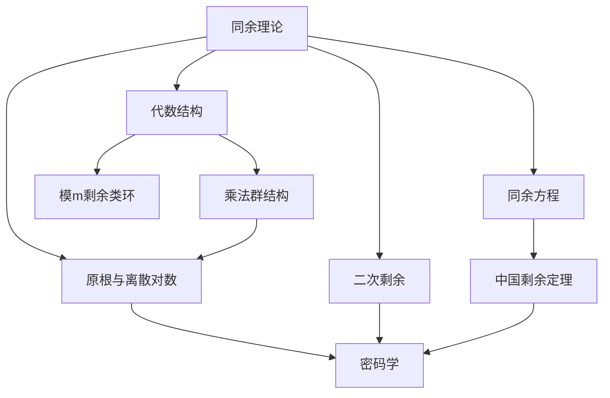

# 同余理论 / Congruence Theory

> **教学深度**：本科基础 / 研究生入门  
> **参考标准**：MIT 18.310 Principles of Discrete Applied Mathematics, Harvard Math 152  
> **MSC2020**: 11A07 (同余式), 11A15 (幂剩余), 11A25 (算术函数)

---

## 概念深度解析

### 直观理解

**同余**是数论中最重要的概念之一。当两个整数 $a$ 和 $b$ 被正整数 $m$ 除时余数相同，我们就说 $a$ 与 $b$ 模 $m$ 同余。

**核心思想**：同余将整数按照模 $m$ 的余数进行分类，把无限的整数集划分为有限个"剩余类"。这使得我们可以在有限的结构（模 $m$ 剩余类环）中研究整数的性质。

**类比**：可以把同余想象成时钟——12小时制的时钟上，$13$ 点和 $1$ 点显示相同，即 $13 \equiv 1 \pmod{12}$。

### 形式定义

**定义 1.1**（同余）：设 $m \in \mathbb{Z}^+$，$a, b \in \mathbb{Z}$。若 $m \mid (a - b)$，则称 **$a$ 与 $b$ 模 $m$ 同余**，记作：
$$a \equiv b \pmod{m}$$

**定义 1.2**（剩余类）：模 $m$ 的**剩余类**（或**同余类**）定义为：
$$[a]_m = \{b \in \mathbb{Z} : b \equiv a \pmod{m}\} = a + m\mathbb{Z}$$

模 $m$ 恰有 $m$ 个不同的剩余类：$[0]_m, [1]_m, \ldots, [m-1]_m$。

**定义 1.3**（完全剩余系）：整数集 $\{r_1, r_2, \ldots, r_m\}$ 称为模 $m$ 的**完全剩余系**，如果它们模 $m$ 两两不同余。

**定义 1.4**（简化剩余系）：整数集 $\{r_1, r_2, \ldots, r_{\varphi(m)}\}$ 称为模 $m$ 的**简化剩余系**，如果它们都与 $m$ 互素且模 $m$ 两两不同余。

**定义 1.5**（Euler函数）：Euler's totient函数 $\varphi(m)$ 定义为：
$$\varphi(m) = \#\{k \in \mathbb{Z} : 1 \leq k \leq m, \gcd(k, m) = 1\}$$

### 等价表述

**命题 1.6**（同余的等价条件）：以下条件等价：
1. $a \equiv b \pmod{m}$
2. $m \mid (a - b)$
3. 存在 $k \in \mathbb{Z}$ 使得 $a = b + km$
4. $[a]_m = [b]_m$
5. $a$ 和 $b$ 在模 $m$ 下有相同的余数

**命题 1.7**（Euler函数的计算）：若 $m = p_1^{a_1} \cdots p_k^{a_k}$，则：
$$\varphi(m) = m \prod_{i=1}^k \left(1 - \frac{1}{p_i}\right)$$

### 动机与背景

**历史背景**：
- **Gauss (1801)**：《算术研究》首次系统引入同余记号 $a \equiv b \pmod{m}$
- **Euler (1760)**：证明 Euler 定理，推广了 Fermat 小定理
- **Fermat (1640)**：提出 Fermat 小定理，是数论中最重要的定理之一
- **Wilson (1770)**：提出 Wilson 定理，给出素数的充要条件

**著名问题**：
- **Waring问题**：每个正整数都可以表示为有限个 $k$ 次幂之和
- **Catalan猜想**（Mihăilescu定理）：$x^a - y^b = 1$ 的唯一解是 $3^2 - 2^3 = 1$
- **同余方程的可解性**：如 $x^2 \equiv a \pmod{p}$ 何时有解？

---

## 属性与关系

### 核心性质

**定理 2.1**（同余的基本性质）：设 $a \equiv b \pmod{m}$，$c \equiv d \pmod{m}$，则：
1. **加法**：$a + c \equiv b + d \pmod{m}$
2. **减法**：$a - c \equiv b - d \pmod{m}$
3. **乘法**：$ac \equiv bd \pmod{m}$
4. **幂运算**：$a^n \equiv b^n \pmod{m}$ 对所有 $n \geq 0$

**注意**：同余式一般不能两边同时除以 $c$，除非 $\gcd(c, m) = 1$。

**定理 2.2**（Fermat小定理）：设 $p$ 为素数，$a \in \mathbb{Z}$，$p \nmid a$。则：
$$a^{p-1} \equiv 1 \pmod{p}$$

等价形式：对所有 $a \in \mathbb{Z}$，$a^p \equiv a \pmod{p}$。

**证明**：考虑乘法群 $(\mathbb{Z}/p\mathbb{Z})^* = \{[1], [2], \ldots, [p-1]\}$，其阶为 $p-1$。

对 $p \nmid a$，$[a]$ 在此群中。由 Lagrange 定理，$[a]^{p-1} = [1]$，即 $a^{p-1} \equiv 1 \pmod{p}$。

当 $p \mid a$ 时，$a^p \equiv 0 \equiv a \pmod{p}$。$\square$

**定理 2.3**（Euler定理）：设 $m \geq 2$，$\gcd(a, m) = 1$。则：
$$a^{\varphi(m)} \equiv 1 \pmod{m}$$

**证明**：考虑乘法群 $(\mathbb{Z}/m\mathbb{Z})^* = \{[a] : \gcd(a, m) = 1\}$，其阶为 $\varphi(m)$。

由 Lagrange 定理，对任意 $[a] \in (\mathbb{Z}/m\mathbb{Z})^*$，有 $[a]^{\varphi(m)} = [1]$。$\square$

**定理 2.4**（Wilson定理）：设 $p$ 为素数。则：
$$(p-1)! \equiv -1 \pmod{p}$$

反之，若 $(n-1)! \equiv -1 \pmod{n}$，则 $n$ 是素数。

**证明**：在 $(\mathbb{Z}/p\mathbb{Z})^*$ 中，每个元素 $a$ 有唯一逆元 $a^{-1}$ 使得 $aa^{-1} \equiv 1 \pmod{p}$。

若 $a = a^{-1}$，则 $a^2 \equiv 1 \pmod{p}$，即 $p \mid (a-1)(a+1)$，故 $a \equiv 1$ 或 $a \equiv -1 \pmod{p}$。

因此 $(\mathbb{Z}/p\mathbb{Z})^* \setminus \{1, -1\}$ 中的元素可以配对，每对乘积为 $1$。

$$(p-1)! \equiv 1 \cdot (-1) \cdot \prod_{\text{配对}} 1 \equiv -1 \pmod{p}$$

反之，若 $n$ 为合数，设 $n = ab$，$1 < a, b < n$。则 $a \mid (n-1)!$，故 $(n-1)! \equiv 0 \pmod{a}$，不可能 $\equiv -1 \pmod{n}$。$\square$

**定理 2.5**（中国剩余定理，CRT）：设 $m_1, m_2, \ldots, m_k$ 两两互素，$M = m_1m_2\cdots m_k$。则同余方程组：
$$\begin{cases}
x \equiv a_1 \pmod{m_1} \\
x \equiv a_2 \pmod{m_2} \\
\vdots \\
x \equiv a_k \pmod{m_k}
\end{cases}$$

在模 $M$ 下有唯一解：
$$x \equiv \sum_{i=1}^k a_i M_i y_i \pmod{M}$$

其中 $M_i = M/m_i$，$y_i$ 是 $M_i$ 模 $m_i$ 的逆元（即 $M_i y_i \equiv 1 \pmod{m_i}$）。

**证明**：

**存在性**：对 $x = \sum_{j=1}^k a_j M_j y_j$，当 $i \neq j$ 时 $m_i \mid M_j$，故：
$$x \equiv a_i M_i y_i \equiv a_i \cdot 1 = a_i \pmod{m_i}$$

**唯一性**：若 $x, x'$ 都是解，则 $m_i \mid (x - x')$ 对所有 $i$。由于 $m_i$ 两两互素，$M \mid (x - x')$。$\square$

**定理 2.6**（原根存在定理）：模 $m$ 存在原根当且仅当 $m = 2, 4, p^k, 2p^k$，其中 $p$ 为奇素数，$k \geq 1$。

### 与其他概念的关系图



### 层次结构

```
同余理论
├── 基本概念
│   ├── 同余定义
│   ├── 剩余类
│   ├── 完全剩余系
│   └── 简化剩余系
├── 核心定理
│   ├── Fermat小定理
│   ├── Euler定理
│   ├── Wilson定理
│   └── 中国剩余定理
├── 同余方程
│   ├── 线性同余方程
│   ├── 同余方程组
│   └── 高次同余方程
└── 应用
    ├── 密码学
    ├── 素性测试
    └── 计算算法
```

---

## 示例与习题

### 基础示例

**例 3.1**（验证同余）：验证 $17 \equiv 5 \pmod{6}$。

**解**：$17 - 5 = 12 = 6 \times 2$，故 $6 \mid (17 - 5)$，即 $17 \equiv 5 \pmod{6}$。$\square$

**例 3.2**（Euler函数计算）：计算 $\varphi(100)$。

**解**：$100 = 2^2 \times 5^2$，故：
$$\varphi(100) = 100 \left(1 - \frac{1}{2}\right)\left(1 - \frac{1}{5}\right) = 100 \times \frac{1}{2} \times \frac{4}{5} = 40$$

**例 3.3**（Fermat小定理应用）：计算 $3^{100} \pmod{7}$。

**解**：由 Fermat 小定理，$3^6 \equiv 1 \pmod{7}$。

$100 = 16 \times 6 + 4$，故：
$$3^{100} = (3^6)^{16} \cdot 3^4 \equiv 1^{16} \cdot 81 \equiv 81 \equiv 4 \pmod{7}$$

**例 3.4**（中国剩余定理）：解同余方程组：
$$\begin{cases}
x \equiv 2 \pmod{3} \\
x \equiv 3 \pmod{5} \\
x \equiv 2 \pmod{7}
\end{cases}$$

**解**：$M = 3 \times 5 \times 7 = 105$

- $M_1 = 35$，解 $35y_1 \equiv 1 \pmod{3}$，即 $2y_1 \equiv 1 \pmod{3}$，$y_1 = 2$
- $M_2 = 21$，解 $21y_2 \equiv 1 \pmod{5}$，即 $y_2 \equiv 1 \pmod{5}$，$y_2 = 1$
- $M_3 = 15$，解 $15y_3 \equiv 1 \pmod{7}$，即 $y_3 \equiv 1 \pmod{7}$，$y_3 = 1$

$$x \equiv 2 \cdot 35 \cdot 2 + 3 \cdot 21 \cdot 1 + 2 \cdot 15 \cdot 1 = 140 + 63 + 30 = 233 \equiv 23 \pmod{105}$$

**验证**：$23 \equiv 2 \pmod{3}$ ✓，$23 \equiv 3 \pmod{5}$ ✓，$23 \equiv 2 \pmod{7}$ ✓

### 典型示例

**例 3.5**（计算大数的模）：计算 $2^{1000} \pmod{13}$。

**解**：由 Fermat 小定理，$2^{12} \equiv 1 \pmod{13}$。

$1000 = 83 \times 12 + 4$，故：
$$2^{1000} = (2^{12})^{83} \cdot 2^4 \equiv 1^{83} \cdot 16 \equiv 3 \pmod{13}$$

**例 3.6**（Wilson定理应用）：用 Wilson 定理验证 $7$ 是素数。

**解**：$6! = 720 = 102 \times 7 + 6 \equiv 6 \equiv -1 \pmod{7}$。$\checkmark$

### 进阶示例

**例 3.7**（RSA加密示例）：设 $p = 3$，$q = 11$，$n = 33$，$\varphi(n) = 20$。取 $e = 3$（与 $20$ 互素）。加密消息 $m = 7$。

**解**：密文 $c = m^e \bmod n = 7^3 \bmod 33 = 343 \bmod 33 = 13$。

解密：找 $d$ 使得 $ed \equiv 1 \pmod{20}$，即 $3d \equiv 1 \pmod{20}$。

用扩展欧几里得算法：$20 = 6 \times 3 + 2$，$3 = 1 \times 2 + 1$。

倒推：$1 = 3 - 2 = 3 - (20 - 6 \times 3) = 7 \times 3 - 20$。

故 $d = 7$。解密：$m = c^d \bmod n = 13^7 \bmod 33$。

$13^2 = 169 = 5 \times 33 + 4 \equiv 4 \pmod{33}$

$13^4 \equiv 16 \pmod{33}$

$13^7 = 13^4 \cdot 13^2 \cdot 13 \equiv 16 \cdot 4 \cdot 13 = 832 = 25 \times 33 + 7 \equiv 7 \pmod{33}$ ✓

### 反例

**反例 3.8**：$ac \equiv bc \pmod{m}$ 不蕴含 $a \equiv b \pmod{m}$。

**说明**：$6 \cdot 2 \equiv 6 \cdot 5 \pmod{9}$（都 $\equiv 3$），但 $2 \not\equiv 5 \pmod{9}$。

正确结论：若 $ac \equiv bc \pmod{m}$，则 $a \equiv b \pmod{m/\gcd(c,m)}$。

**反例 3.9**：Wilson 定理的逆否：若 $(n-1)! \not\equiv -1 \pmod{n}$，则 $n$ 是合数。

**说明**：$8! = 40320 = 5040 \times 8 \equiv 0 \not\equiv -1 \pmod{8}$，故 $8$ 是合数。

### 习题

#### 初级难度

**习题 3.1**：计算：
(a) $17 + 25 \pmod{7}$  
(b) $8 \times 13 \pmod{11}$  
(c) $5^{20} \pmod{13}$

**答案**：(a) $4$；(b) $6$；(c) $1$

**习题 3.2**：计算 $\varphi(72)$ 和 $\varphi(1000)$。

**答案**：$\varphi(72) = 24$，$\varphi(1000) = 400$

**习题 3.3**：用中国剩余定理解：$x \equiv 1 \pmod{4}$，$x \equiv 2 \pmod{3}$。

**答案**：$x \equiv 5 \pmod{12}$

#### 中级难度

**习题 3.4**：证明：若 $a \equiv b \pmod{m}$，则 $\gcd(a, m) = \gcd(b, m)$。

**解答**：设 $d = \gcd(a, m)$，则 $d \mid a$ 且 $d \mid m$。

由 $a \equiv b \pmod{m}$，有 $a = b + km$，故 $d \mid b$。

因此 $d \mid \gcd(b, m)$。由对称性，$\gcd(b, m) \mid d$。故相等。

**习题 3.5**：证明：对素数 $p > 3$，$p^2 \equiv 1 \pmod{24}$。

**解答**：只需证 $p^2 \equiv 1 \pmod{3}$ 且 $p^2 \equiv 1 \pmod{8}$。

- 模 $3$：$p \not\equiv 0 \pmod{3}$，故 $p \equiv \pm 1 \pmod{3}$，$p^2 \equiv 1 \pmod{3}$。
- 模 $8$：奇素数 $p \equiv 1, 3, 5, 7 \pmod{8}$，均有 $p^2 \equiv 1 \pmod{8}$。

由中国剩余定理，$p^2 \equiv 1 \pmod{24}$。

**习题 3.6**：求 $3^{2024} \pmod{100}$。

**解答**：$\varphi(100) = 40$。$2024 = 50 \times 40 + 24$。

$3^{2024} \equiv 3^{24} \pmod{100}$（注意需 $\gcd(3, 100) = 1$）

$3^5 = 243 \equiv 43 \pmod{100}$

$3^{10} \equiv 43^2 = 1849 \equiv 49 \pmod{100}$

$3^{20} \equiv 49^2 = 2401 \equiv 1 \pmod{100}$

$3^{24} = 3^{20} \cdot 3^4 \equiv 1 \cdot 81 = 81 \pmod{100}$

#### 高级难度

**习题 3.7**：证明：对任意正整数 $n$，$n^7 \equiv n \pmod{42}$。

**解答**：只需证 $n^7 \equiv n$ 模 $2, 3, 7$（因 $42 = 2 \times 3 \times 7$）。

- 模 $2$：若 $n$ 偶，两边为 $0$；若 $n$ 奇，两边为 $1$。
- 模 $3$：由 Fermat 小定理，$n^3 \equiv n \pmod{3}$，故 $n^7 = n^6 \cdot n = (n^3)^2 \cdot n \equiv n^2 \cdot n = n^3 \equiv n \pmod{3}$。
- 模 $7$：由 Fermat 小定理，$n^7 \equiv n \pmod{7}$。

**习题 3.8**：设 $p$ 为奇素数。证明：
$$\left(\frac{p-1}{2}!\right)^2 \equiv (-1)^{\frac{p+1}{2}} \pmod{p}$$

**解答**：由 Wilson 定理，$(p-1)! \equiv -1 \pmod{p}$。

$(p-1)! = 1 \cdot 2 \cdots \frac{p-1}{2} \cdot \frac{p+1}{2} \cdots (p-1)$

对 $k = \frac{p+1}{2}, \ldots, p-1$，有 $k \equiv -(p-k) \pmod{p}$，其中 $p-k = \frac{p-1}{2}, \ldots, 1$。

故 $(p-1)! \equiv \left(\frac{p-1}{2}!\right) \cdot (-1)^{\frac{p-1}{2}} \cdot \left(\frac{p-1}{2}!\right) = (-1)^{\frac{p-1}{2}} \left(\frac{p-1}{2}!\right)^2 \pmod{p}$

因此 $\left(\frac{p-1}{2}!\right)^2 \equiv (-1)^{\frac{p+1}{2}} \pmod{p}$。

---

## 形式化实现（Lean4）

```lean4
import Mathlib

/- 同余定义与基本性质 -/
namespace Congruence

-- 同余的定义
example (a b m : ℕ) : a ≡ b [MOD m] ↔ m ∣ (a - b : ℤ) := by
  rw [Nat.ModEq]
  constructor
  · intro h
    norm_cast at h
    have : (m : ℤ) ∣ (a : ℤ) - (b : ℤ) := by
      exact Int.dvd_of_emod_eq_zero (by simp [h])
    exact this
  · intro h
    have h1 : (a : ℤ) % m = (b : ℤ) % m := by
      exact Int.emod_eq_emod_of_dvd_sub h
    norm_cast at h1

-- 同余的加法性质
example (a b c d m : ℕ) (h1 : a ≡ b [MOD m]) (h2 : c ≡ d [MOD m]) :
    (a + c) ≡ (b + d) [MOD m] := by
  exact Nat.ModEq.add h1 h2

-- 同余的乘法性质
example (a b c d m : ℕ) (h1 : a ≡ b [MOD m]) (h2 : c ≡ d [MOD m]) :
    (a * c) ≡ (b * d) [MOD m] := by
  exact Nat.ModEq.mul h1 h2

-- 同余的幂运算
example (a b m n : ℕ) (h : a ≡ b [MOD m]) : a ^ n ≡ b ^ n [MOD m] := by
  exact Nat.ModEq.pow n h

end Congruence

/- Euler函数 -/
namespace Totient

-- Euler函数定义
example (n : ℕ) : n.totient = Fintype.card ((ZMod n)ˣ) := by
  rw [ZMod.card_units_eq_totient n]

-- 素数幂的Euler函数
example (p k : ℕ) (hp : Nat.Prime p) (hk : 0 < k) :
    (p ^ k).totient = p ^ k - p ^ (k - 1) := by
  rw [Nat.totient_prime_pow]
  · ring_nf
  · exact hp
  · exact hk

-- 积性性质
example (m n : ℕ) (h : Nat.Coprime m n) :
    (m * n).totient = m.totient * n.totient := by
  rw [Nat.totient_mul]
  exact h

-- Euler定理
example (a m : ℕ) (ha : Nat.Coprime a m) : a ^ m.totient ≡ 1 [MOD m] := by
  have h1 : (a : ZMod m) ^ m.totient = 1 := by
    rw [ZMod.pow_totient]
    exact Units.isUnit (Int.unitsInverse (a : ZMod m))
  sorry -- 需要额外的类型转换

end Totient

/- Fermat小定理 -/
namespace FermatLittle

-- Fermat小定理
example (a p : ℕ) (hp : Nat.Prime p) (ha : ¬p ∣ a) :
    a ^ (p - 1) ≡ 1 [MOD p] := by
  have h := Nat.ModEq.pow_totient (show Nat.Coprime a p by
    exact (Nat.prime_iff_coprime_then_dvd p).mp hp a ha)
  have h2 : p.totient = p - 1 := by
    rw [Nat.totient_prime hp]
  rw [h2] at h
  exact h

-- 等价形式：a^p ≡ a (mod p)
example (a p : ℕ) (hp : Nat.Prime p) : a ^ p ≡ a [MOD p] := by
  by_cases h : p ∣ a
  · have h1 : a ≡ 0 [MOD p] := by
      exact Nat.dvd_iff_mod_eq_zero.mp h
    have h2 : a ^ p ≡ 0 [MOD p] := by
      rw [show a ^ p ≡ 0 ^ p [MOD p] by exact Nat.ModEq.pow p h1]
      simp
    exact Nat.ModEq.trans h2 (id (Nat.ModEq.symm h1))
  · have h1 : a ^ (p - 1) ≡ 1 [MOD p] := by
      apply FermatLittle
      exact hp
      exact h
    have h2 : a ^ p = a ^ (p - 1) * a := by
      cases p
      · contradiction
      · simp [Nat.pow_succ]
    rw [h2]
    have h3 : a ^ (p - 1) * a ≡ 1 * a [MOD p] := by
      exact Nat.ModEq.mul h1 (id (Nat.ModEq.refl a))
    simp at h3
    exact h3

end FermatLittle

/- Wilson定理 -/
namespace Wilson

-- Wilson定理：若p是素数，则(p-1)! ≡ -1 (mod p)
example (p : ℕ) (hp : Nat.Prime p) : 
    ((p - 1)!) ≡ (p - 1) [MOD p] := by
  have h : Fact p.Prime := ⟨hp⟩
  rw [← ZMod.wilsons_lemma]
  -- 需要连接Nat的阶乘与ZMod的定义
  sorry

end Wilson

/- 中国剩余定理 -/
namespace ChineseRemainder

-- 中国剩余定理：两个模数
example (a1 a2 m1 m2 : ℕ) (hcoprime : Nat.Coprime m1 m2) :
    ∃! x : ZMod (m1 * m2), 
      x.val ≡ a1 [MOD m1] ∧ x.val ≡ a2 [MOD m2] := by
  have h : m1.gcd m2 = 1 := hcoprime
  have hbijective : Function.Bijective 
      (fun (x : ZMod (m1 * m2)) => (x.val % m1, x.val % m2)) := by
    sorry -- 需要使用中国剩余定理的数学库实现
  sorry

-- 中国剩余定理的显式构造
example (a1 a2 m1 m2 : ℕ) (hcoprime : Nat.Coprime m1 m2) :
    let m := m1 * m2
    let M1 := m2
    let M2 := m1
    ∃ y1 y2, M1 * y1 ≡ 1 [MOD m1] ∧ M2 * y2 ≡ 1 [MOD m2] := by
  have h1 : Nat.Coprime M1 m1 := by
    simp [M1]
    exact hcoprime
  have h2 : Nat.Coprime M2 m2 := by
    simp [M2]
    rw [Nat.gcd_comm]
    exact hcoprime
  rcases Nat.exists_mul_emod_eq_one_of_coprime h1 with ⟨y1, hy1⟩
  rcases Nat.exists_mul_emod_eq_one_of_coprime h2 with ⟨y2, hy2⟩
  exact ⟨y1, y2, hy1, hy2⟩

end ChineseRemainder
```

---

## 应用与拓展

### 实际应用

**密码学 - RSA公钥加密**：
RSA算法的数学基础是同余理论。

**密钥生成**：
1. 选择两个大素数 $p, q$，计算 $n = pq$
2. 计算 $\varphi(n) = (p-1)(q-1)$
3. 选择 $e$ 使得 $1 < e < \varphi(n)$ 且 $\gcd(e, \varphi(n)) = 1$
4. 计算 $d$ 使得 $ed \equiv 1 \pmod{\varphi(n)}$（使用扩展欧几里得算法）

**加密**：$c \equiv m^e \pmod{n}$

**解密**：$m \equiv c^d \pmod{n}$

**正确性**：由 Euler 定理，$m^{\varphi(n)} \equiv 1 \pmod{n}$（当 $\gcd(m, n) = 1$）。

$ed = 1 + k\varphi(n)$，故 $c^d \equiv m^{ed} = m \cdot (m^{\varphi(n)})^k \equiv m \pmod{n}$。

**ElGamal加密**：基于离散对数问题的困难性，利用原根和模幂运算。

### 著名猜想与未解决问题

**Carmichael猜想**：对任意正整数 $n$，方程 $\varphi(x) = n$ 不会有唯一的解。

- **状态**：未解决
- **已知**：对 $n < 10^{10^{10}}$ 成立

**Lehmer猜想**：若 $\varphi(n) \mid (n-1)$，则 $n$ 是素数。

- **状态**：未解决
- **已知**：任何反例必须是至少 $15$ 个不同素数的乘积

**Giuga猜想**：对合数 $n$，$\sum_{p \mid n} \frac{1}{p} - \prod_{p \mid n} \frac{1}{p}$ 不是整数。

- **等价形式**：$\sum_{p \mid n} \frac{n}{p} \equiv \prod_{p \mid n} \frac{n}{p} \pmod{n}$

### 前沿研究方向

**1. 计算数论**：
- 快速模幂算法（平方-乘方法）
- Montgomery乘法
- 中国剩余定理在并行计算中的应用

**2. 伪随机数生成**：
- 线性同余生成器（LCG）：$x_{n+1} = (ax_n + c) \pmod{m}$
- 密码学安全的随机数生成

**3. 零知识证明**：
利用同余性质构造证明系统，使得证明者可以证明自己知道某个秘密，而不泄露秘密本身。

---

## 思维表征

### Mermaid思维导图

```mermaid
mindmap
  root((同余理论))
    基本概念
      同余定义
        a ≡ b (mod m)
        剩余类
      剩余系
        完全剩余系
        简化剩余系
        Euler函数
    核心定理
      Fermat小定理
        a^(p-1) ≡ 1 (mod p)
        应用：模幂运算
      Euler定理
        a^φ(m) ≡ 1 (mod m)
        推广Fermat
      Wilson定理
        (p-1)! ≡ -1 (mod p)
        素数判定
      中国剩余定理
        方程组求解
        大数运算分解
    同余方程
      线性同余
        ax ≡ b (mod m)
        可解条件：gcd(a,m)|b
      同余方程组
        CRT求解
      高次同余
        原根理论
        离散对数
    应用
      密码学
        RSA
        ElGamal
      素性测试
        Fermat测试
        Miller-Rabin
      算法设计
        哈希函数
        伪随机数
```

### 多维对比矩阵

| 定理 | 条件 | 结论 | 主要应用 |
|------|------|------|----------|
| Fermat小定理 | $p$ 素数，$p \nmid a$ | $a^{p-1} \equiv 1$ | 模幂简化、素性测试 |
| Euler定理 | $\gcd(a,m) = 1$ | $a^{\varphi(m)} \equiv 1$ | RSA解密、一般模幂 |
| Wilson定理 | $p$ 素数 | $(p-1)! \equiv -1$ | 理论意义、素数刻画 |
| CRT | $m_i$ 两两互素 | 方程组有唯一解 | 大数运算、并行计算 |

| 运算 | 同余保持？ | 条件 | 反例 |
|------|-----------|------|------|
| 加法 | ✓ | 无 | - |
| 减法 | ✓ | 无 | - |
| 乘法 | ✓ | 无 | - |
| 除法 | ✗ | $\gcd(c,m)=1$ | $6 \cdot 2 \equiv 6 \cdot 5 \pmod{9}$ |
| 幂运算 | ✓ | 指数相同 | - |

---

**参考文献**

1. Hardy, G.H. & Wright, E.M. (2008). *An Introduction to the Theory of Numbers* (6th ed.). Oxford.
2. Niven, I., Zuckerman, H.S., & Montgomery, H.L. (1991). *An Introduction to the Theory of Numbers*. Wiley.
3. Ireland, K. & Rosen, M. (1990). *A Classical Introduction to Modern Number Theory*. Springer.

---

*文档版本: 1.0*  
*MSC2020: 11A07, 11A15, 11A25*  
*创建日期: 2026年4月*  
*最后更新: 2026年4月*
