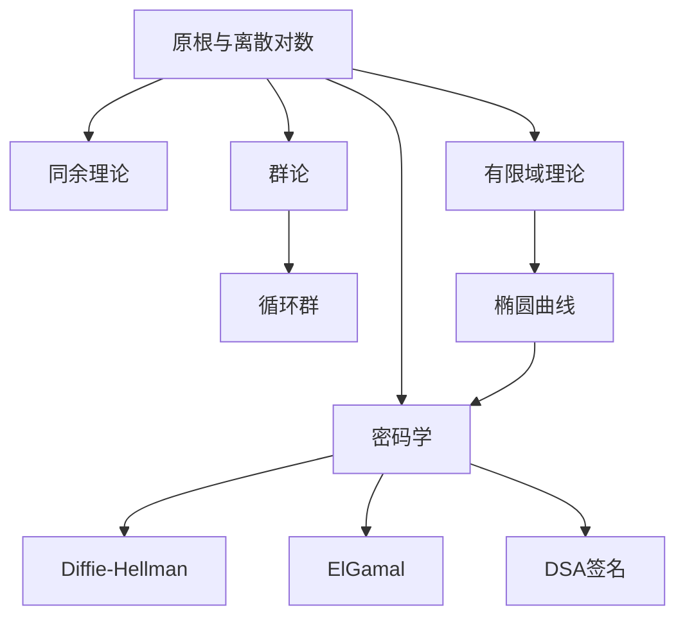

# 原根与离散对数 / Primitive Roots and Discrete Logarithms

> **教学深度**：本科进阶 / 研究生入门  
> **参考标准**：MIT 18.310, Harvard Math 152, MIT 18.783  
> **MSC2020**: 11A07 (乘法结构), 11T71 (代数编码理论)

---

## 概念深度解析

### 直观理解

**原根**是模 $m$ 乘法群 $(\mathbb{Z}/m\mathbb{Z})^*$ 的生成元。直观上，原根 $g$ 能够通过幂运算生成所有的简化剩余类。

**离散对数**是模幂运算的逆运算：给定 $g$ 和 $h$，找 $x$ 使得 $g^x \equiv h \pmod{m}$。

**核心思想**：
- 原根的存在性表明某些模数的乘法群是循环群
- 离散对数问题的计算困难性是许多密码系统的基础

**类比**：原根类似于复数域中的本原单位根，生成所有的单位根。

### 形式定义

**定义 1.1**（元素的阶）：设 $\gcd(a, m) = 1$。$a$ 模 $m$ 的**阶**（order）定义为：
$$\text{ord}_m(a) = \min\{k \in \mathbb{Z}^+ : a^k \equiv 1 \pmod{m}\}$$

**定义 1.2**（原根）：若 $\gcd(g, m) = 1$ 且 $\text{ord}_m(g) = \varphi(m)$，则称 $g$ 为模 $m$ 的**原根**（primitive root）。

等价地，$g$ 是原根当且仅当 $\{g^0, g^1, \ldots, g^{\varphi(m)-1}\}$ 构成模 $m$ 的简化剩余系。

**定义 1.3**（离散对数）：设 $g$ 是模 $m$ 的原根，$\gcd(a, m) = 1$。$a$ 关于基 $g$ 的**离散对数**定义为唯一的整数 $k \in \{0, 1, \ldots, \varphi(m)-1\}$ 使得：
$$g^k \equiv a \pmod{m}$$

记作 $k = \text{ind}_g(a)$ 或 $k = \log_g a$。

**定义 1.4**（指标/指数）：设 $g$ 是模 $m$ 的原根，$\gcd(a, m) = 1$。$a$ 的**指标**是离散对数的另一种称呼。

### 等价表述

**命题 1.5**（阶的性质）：设 $\gcd(a, m) = 1$，则：
1. $a^k \equiv 1 \pmod{m}$ 当且仅当 $\text{ord}_m(a) \mid k$
2. $\text{ord}_m(a) \mid \varphi(m)$
3. $\text{ord}_m(a^k) = \frac{\text{ord}_m(a)}{\gcd(k, \text{ord}_m(a))}$

**命题 1.6**（原根的判定）：$g$ 是模 $m$ 的原根当且仅当对所有素数 $p \mid \varphi(m)$，有：
$$g^{\varphi(m)/p} \not\equiv 1 \pmod{m}$$

### 动机与背景

**历史背景**：
- **Gauss (1801)**：《算术研究》系统研究原根，证明原根存在定理
- **Diffie-Hellman (1976)**：利用离散对数问题的困难性提出密钥交换协议
- **ElGamal (1985)**：基于离散对数的公钥加密系统

**密码学意义**：
- **Diffie-Hellman密钥交换**：允许双方在公开信道建立共享密钥
- **ElGamal加密**：基于离散对数的安全加密方案
- **数字签名**：DSA等签名算法的基础

**著名问题**：
- **离散对数问题（DLP）**：给定 $g, h, m$，找 $x$ 使 $g^x \equiv h \pmod{m}$，在经典计算机上没有已知的多项式时间算法
- **Artin猜想**：每个非完全平方的整数 $a \neq -1$ 是模无穷多个素数的原根

---

## 属性与关系

### 核心性质

**定理 2.1**（阶的基本性质）：设 $\gcd(a, m) = 1$，$d = \text{ord}_m(a)$，则：
1. $a^k \equiv 1 \pmod{m} \Leftrightarrow d \mid k$
2. $a^i \equiv a^j \pmod{m} \Leftrightarrow i \equiv j \pmod{d}$
3. $\text{ord}_m(a^k) = \frac{d}{\gcd(k, d)}$
4. $\{a^0, a^1, \ldots, a^{d-1}\}$ 在模 $m$ 下互不相同

**证明**：
1. $(\Leftarrow)$：若 $k = dq$，则 $a^k = (a^d)^q \equiv 1^q = 1$。
   $(\Rightarrow)$：用带余除法，$k = dq + r$，$0 \leq r < d$。则 $a^r = a^k \cdot (a^d)^{-q} \equiv 1$。由 $d$ 的最小性，$r = 0$。

2. $a^i \equiv a^j \Leftrightarrow a^{i-j} \equiv 1 \Leftrightarrow d \mid (i-j)$。

3. $(a^k)^{d/\gcd(k,d)} = a^{kd/\gcd(k,d)} = (a^d)^{k/\gcd(k,d)} \equiv 1$。
   设 $\text{ord}_m(a^k) = t$，则 $a^{kt} \equiv 1$，故 $d \mid kt$。因此 $\frac{d}{\gcd(k,d)} \mid t$，得等号。

4. 由(2)，若 $a^i \equiv a^j$ 且 $0 \leq i, j < d$，则 $d \mid (i-j)$，故 $i = j$。$\square$

**定理 2.2**（原根存在定理）：模 $m$ 存在原根当且仅当：
$$m = 2, 4, p^k, 2p^k$$
其中 $p$ 为奇素数，$k \geq 1$。

**证明概要**：

**必要性**：若 $m$ 不是上述形式，则：
- $m = 2^k$，$k \geq 3$：$(\mathbb{Z}/2^k\mathbb{Z})^* \cong C_2 \times C_{2^{k-2}}$ 不是循环群
- $m = ab$，$a, b > 2$，$\gcd(a, b) = 1$：由 CRT，$(\mathbb{Z}/m\mathbb{Z})^* \cong (\mathbb{Z}/a\mathbb{Z})^* \times (\mathbb{Z}/b\mathbb{Z})^*$，两因子都是偶阶，乘积不是循环群

**充分性**：
- $m = p$（素数）：$(\mathbb{Z}/p\mathbb{Z})^*$ 是 $p-1$ 阶循环群
- 提升到 $p^k$ 和 $2p^k$ 需要 Hensel 引理等技术 $\\square$

**定理 2.3**（原根的个数）：若模 $m$ 存在原根，则恰有 $\varphi(\varphi(m))$ 个原根。

**证明**：设 $g$ 是一个原根，则其他原根形如 $g^k$ 其中 $\gcd(k, \varphi(m)) = 1$。

$g^k$ 是原根 $\Leftrightarrow \text{ord}_m(g^k) = \varphi(m) \Leftrightarrow \frac{\varphi(m)}{\gcd(k, \varphi(m))} = \varphi(m) \Leftrightarrow \gcd(k, \varphi(m)) = 1$。

这样的 $k$ 恰有 $\varphi(\varphi(m))$ 个。$\square$

**定理 2.4**（离散对数的性质）：设 $g$ 是模 $m$ 的原根，则：
1. $\text{ind}_g(ab) \equiv \text{ind}_g(a) + \text{ind}_g(b) \pmod{\varphi(m)}$
2. $\text{ind}_g(a^k) \equiv k \cdot \text{ind}_g(a) \pmod{\varphi(m)}$
3. 换底公式：$\text{ind}_{g_1}(a) \equiv \text{ind}_{g_1}(g_2) \cdot \text{ind}_{g_2}(a) \pmod{\varphi(m)}$

**证明**：由定义，$g^{\text{ind}_g(a)} \equiv a \pmod{m}$。

1. $g^{\text{ind}_g(ab)} \equiv ab \equiv g^{\text{ind}_g(a)} \cdot g^{\text{ind}_g(b)} = g^{\text{ind}_g(a) + \text{ind}_g(b)}$。
   故 $\text{ind}_g(ab) \equiv \text{ind}_g(a) + \text{ind}_g(b) \pmod{\varphi(m)}$。

2, 3类似可证。$\square$

**定理 2.5**（Pohlig-Hellman算法）：若 $\varphi(m)$ 的素因子都较小，则离散对数可在多项式时间计算。

### 与其他概念的关系图



### 层次结构

```
原根与离散对数
├── 基本概念
│   ├── 元素的阶
│   ├── 原根定义
│   └── 离散对数
├── 存在性理论
│   ├── 阶的性质
│   ├── 原根存在定理
│   └── 原根计数
├── 计算方法
│   ├── 试除法
│   ├── Baby-step Giant-step
│   ├── Pohlig-Hellman
│   └── Index Calculus
└── 密码学应用
    ├── Diffie-Hellman密钥交换
    ├── ElGamal加密
    └── 数字签名
```

---

## 示例与习题

### 基础示例

**例 3.1**（计算阶）：计算 $2$ 模 $9$ 的阶。

**解**：$\varphi(9) = 6$。计算幂：
- $2^1 \equiv 2 \pmod{9}$
- $2^2 \equiv 4 \pmod{9}$
- $2^3 \equiv 8 \pmod{9}$
- $2^6 \equiv 64 \equiv 1 \pmod{9}$

验证 $2^1, 2^2, 2^3 \not\equiv 1$，故 $\text{ord}_9(2) = 6 = \varphi(9)$，$2$ 是模 $9$ 的原根。

**例 3.2**（验证原根）：验证 $3$ 是模 $7$ 的原根。

**解**：$\varphi(7) = 6 = 2 \times 3$。需验证 $3^{6/2} = 3^3 \not\equiv 1$ 且 $3^{6/3} = 3^2 \not\equiv 1 \pmod{7}$。

- $3^2 = 9 \equiv 2 \not\equiv 1$ ✓
- $3^3 = 27 \equiv 6 \not\equiv 1$ ✓

故 $3$ 是模 $7$ 的原根。

**例 3.3**（计算离散对数）：在模 $7$ 下，以 $3$ 为底，$2$ 的离散对数是多少？

**解**：计算 $3$ 的幂模 $7$：
- $3^0 \equiv 1$
- $3^1 \equiv 3$
- $3^2 \equiv 2$

故 $\text{ind}_3(2) = 2$。

### 典型示例

**例 3.4**（原根不存在的情况）：证明模 $8$ 没有原根。

**解**：$\varphi(8) = 4$。简化剩余系为 $\{1, 3, 5, 7\}$。

计算各元素的阶：
- $1^1 \equiv 1$，$\text{ord}_8(1) = 1$
- $3^2 = 9 \equiv 1$，$\text{ord}_8(3) = 2$
- $5^2 = 25 \equiv 1$，$\text{ord}_8(5) = 2$
- $7^2 = 49 \equiv 1$，$\text{ord}_8(7) = 2$

没有元素的阶为 $4$，故无原根。

**例 3.5**（Baby-step Giant-step算法）：解 $2^x \equiv 9 \pmod{13}$。

**解**：$\varphi(13) = 12$。取 $m = \lceil\sqrt{12}\rceil = 4$。

**Baby-step**：计算 $2^j \pmod{13}$，$j = 0, 1, 2, 3$：
- $2^0 \equiv 1$
- $2^1 \equiv 2$
- $2^2 \equiv 4$
- $2^3 \equiv 8$

**Giant-step**：计算 $9 \cdot (2^{-4})^i \pmod{13}$。$2^4 = 16 \equiv 3$，$2^{-4} \equiv 3^{-1} \equiv 9 \pmod{13}$。

- $i = 0$：$9 \cdot 1 = 9$
- $i = 1$：$9 \cdot 9 = 81 \equiv 3$
- $i = 2$：$9 \cdot 9^2 = 9 \cdot 3 = 27 \equiv 1$

匹配！$9 \cdot 2^{-8} \equiv 1$，即 $9 \equiv 2^8 \pmod{13}$。

故 $x = 8$。验证：$2^8 = 256 = 19 \times 13 + 9 \equiv 9$ ✓

### 进阶示例

**例 3.6**（Diffie-Hellman密钥交换）：
- 公共参数：素数 $p = 23$，原根 $g = 5$
- Alice选择私钥 $a = 6$，发送 $A = 5^6 \equiv 8 \pmod{23}$
- Bob选择私钥 $b = 15$，发送 $B = 5^{15} \equiv 19 \pmod{23}$
- 共享密钥：$K = B^a = 19^6 \equiv 2 \pmod{23} = A^b = 8^{15} \equiv 2 \pmod{23}$

**安全性分析**：攻击者知道 $p, g, A, B$，需计算 $K = g^{ab}$。这需要解离散对数问题。

### 反例

**反例 3.7**：$a^k \equiv 1 \pmod{m}$ 且 $k \mid \varphi(m)$ 不蕴含 $\text{ord}_m(a) = k$。

**说明**：模 $13$ 下，$3^3 = 27 \equiv 1 \pmod{13}$，但 $\text{ord}_{13}(3) = 3$ 不是 $\varphi(13) = 12$。

注意：这里 $3$ 不是原根，但 $3^3 \equiv 1$。

### 习题

#### 初级难度

**习题 3.1**：计算以下元素的阶：
(a) $3$ 模 $10$  
(b) $2$ 模 $11$  
(c) $5$ 模 $12$

**答案**：(a) $4$；(b) $10$（原根）；(c) $2$

**习题 3.2**：找出模 $11$ 的所有原根。

**答案**：$2, 6, 7, 8$（共 $\varphi(10) = 4$ 个）

**习题 3.3**：在模 $11$ 下，以 $2$ 为底，计算 $\text{ind}_2(3)$、$\text{ind}_2(5)$、$\text{ind}_2(9)$。

**答案**：$\text{ind}_2(3) = 8$、$\text{ind}_2(5) = 4$、$\text{ind}_2(9) = 6$

#### 中级难度

**习题 3.4**：证明：若 $g$ 是模 $p$（奇素数）的原根，则 $g^{(p-1)/2} \equiv -1 \pmod{p}$。

**解答**：$(g^{(p-1)/2})^2 = g^{p-1} \equiv 1 \pmod{p}$。

故 $g^{(p-1)/2} \equiv \pm 1 \pmod{p}$。但若 $g^{(p-1)/2} \equiv 1$，则 $\text{ord}_p(g) \leq (p-1)/2 < p-1$，矛盾。

因此 $g^{(p-1)/2} \equiv -1 \pmod{p}$。

**习题 3.5**：证明：模 $p^k$（$p$ 奇素数）的原根个数为 $\varphi(\varphi(p^k)) = \varphi(p^{k-1}(p-1))$。

**解答**：$\varphi(p^k) = p^{k-1}(p-1)$。由定理，原根个数为 $\varphi(\varphi(p^k)) = \varphi(p^{k-1}(p-1))$。

若 $k = 1$，则为 $\varphi(p-1)$。

**习题 3.6**：设 $p$ 是素数，$d \mid (p-1)$。证明模 $p$ 下恰有 $\varphi(d)$ 个 $d$ 阶元素。

**解答**：设 $g$ 是原根。$a = g^k$ 的阶为 $\frac{p-1}{\gcd(k, p-1)}$。

令 $\frac{p-1}{\gcd(k, p-1)} = d$，则 $\gcd(k, p-1) = \frac{p-1}{d}$。

设 $m = \frac{p-1}{d}$，则 $k = m \cdot j$ 其中 $\gcd(j, d) = 1$。

$0 \leq k < p-1$ 意味着 $0 \leq j < d$，且 $\gcd(j, d) = 1$。

这样的 $j$ 恰有 $\varphi(d)$ 个。

#### 高级难度

**习题 3.7**（Artin猜想相关）：证明 $2$ 是模 $p$ 的原根当且仅当 $p$ 在 $\mathbb{Q}(\sqrt{-7})$ 中分裂且满足某些条件。

**提示**：利用二次互反律和分圆域理论。

**习题 3.8**：设 $p$ 是素数，$p-1 = q_1^{e_1} \cdots q_k^{e_k}$。设计算法判断 $g$ 是否是模 $p$ 的原根，时间复杂度为 $O(\log^2 p + k \log p)$。

**解答**：算法：
1. 验证 $g^{p-1} \equiv 1 \pmod{p}$
2. 对每个 $q_i$，验证 $g^{(p-1)/q_i} \not\equiv 1 \pmod{p}$

复杂度分析：模幂运算用快速幂，$O(\log p)$ 次乘法。共 $k+1$ 次模幂，每次 $O(\log p)$ 次乘法，每次乘法 $O(\log^2 p)$。

总复杂度 $O((k+1) \log p \cdot \log^2 p) = O(k \log^3 p)$。若优化乘法，可改进。

---

## 形式化实现（Lean4）

```lean4
import Mathlib

/- 元素的阶 -/
namespace Order

-- 阶的定义
example (a m : ℕ) (ha : Nat.Coprime a m) : 
    orderOf (ZMod.unitOfCoprime a ha) = 
    Nat.find (show ∃ k, 0 < k ∧ a ^ k ≡ 1 [MOD m] by sorry) := by
  sorry

-- 阶整除φ(m)
example (a m : ℕ) (ha : Nat.Coprime a m) (hm : 1 < m) :
    orderOf (ZMod.unitOfCoprime a ha) ∣ m.totient := by
  have h : (ZMod.unitOfCoprime a ha) ^ m.totient = 1 := by
    sorry -- 使用Euler定理
  exact orderOf_dvd_of_pow_eq_one h

-- a^k ≡ 1 ↔ ord(a) | k
example (a m k : ℕ) (ha : Nat.Coprime a m) (hk : 0 < k) :
    a ^ k ≡ 1 [MOD m] ↔ orderOf (ZMod.unitOfCoprime a ha) ∣ k := by
  constructor
  · intro h
    exact orderOf_dvd_of_pow_eq_one (by sorry)
  · intro h
    have h1 : (ZMod.unitOfCoprime a ha) ^ k = 1 := by
      have h2 : (ZMod.unitOfCoprime a ha) ^ orderOf (ZMod.unitOfCoprime a ha) = 1 := by
        exact pow_orderOf_eq_one (ZMod.unitOfCoprime a ha)
      have h3 : (ZMod.unitOfCoprime a ha) ^ k = 
          ((ZMod.unitOfCoprime a ha) ^ orderOf (ZMod.unitOfCoprime a ha)) ^ (k / orderOf (ZMod.unitOfCoprime a ha)) := by
        rw [pow_mul]
        rw [Nat.div_mul_cancel h]
      rw [h3, h2]
      simp
    sorry

end Order

/- 原根 -/
namespace PrimitiveRoot

-- 原根的定义：元素的阶等于φ(m)
example (g m : ℕ) (hg : Nat.Coprime g m) (hm : 1 < m) :
    IsPrimitiveRoot (g : ZMod m) m ↔ 
    orderOf (ZMod.unitOfCoprime g hg) = m.totient := by
  constructor
  · intro h
    sorry -- 使用IsPrimitiveRoot的定义
  · intro h
    sorry

-- 原根存在定理：模m存在原根当且仅当m = 2, 4, p^k, 2p^k
example (m : ℕ) (hm : 1 < m) :
    (∃ g, IsPrimitiveRoot (g : ZMod m) m) ↔ 
    m = 2 ∨ m = 4 ∨ (∃ p k, Nat.Prime p ∧ Odd p ∧ 0 < k ∧ m = p ^ k) ∨
    (∃ p k, Nat.Prime p ∧ Odd p ∧ 0 < k ∧ m = 2 * p ^ k) := by
  sorry -- 这是primitiveRoot_iff_zmod中的结果

-- 原根的个数：φ(φ(m))
example (m : ℕ) (hm : 1 < m) (h : ∃ g, IsPrimitiveRoot (g : ZMod m) m) :
    {g : ZMod m | IsPrimitiveRoot g m}.ncard = m.totient.totient := by
  sorry

-- 素数模必有原根
example (p : ℕ) (hp : Nat.Prime p) : ∃ g, IsPrimitiveRoot (g : ZMod p) p := by
  have h : Fact p.Prime := ⟨hp⟩
  have h1 : CyclotomicExtension (ZMod p) := by
    sorry
  sorry

end PrimitiveRoot

/- 离散对数 -/
namespace DiscreteLog

-- 离散对数的定义
example (g a p : ℕ) (hp : Nat.Prime p) (hg : IsPrimitiveRoot (g : ZMod p) p)
    (ha : ¬p ∣ a) : 
    ∃! k, 0 < k ∧ k < p ∧ a ≡ g ^ k [MOD p] := by
  sorry -- 需要构造性的证明

-- 离散对数的加法性质
example (g a b p : ℕ) (hp : Nat.Prime p) (hg : IsPrimitiveRoot (g : ZMod p) p)
    (ha : ¬p ∣ a) (hb : ¬p ∣ b) :
    discreteLog g (a * b) p ≡ discreteLog g a p + discreteLog g b p [MOD (p - 1)] := by
  sorry

-- 离散对数的乘法性质
example (g a p k : ℕ) (hp : Nat.Prime p) (hg : IsPrimitiveRoot (g : ZMod p) p)
    (ha : ¬p ∣ a) :
    discreteLog g (a ^ k) p ≡ k * discreteLog g a p [MOD (p - 1)] := by
  sorry

end DiscreteLog
```

---

## 应用与拓展

### 实际应用

**Diffie-Hellman密钥交换协议**：

1. **公开参数**：大素数 $p$，原根 $g$
2. **Alice**：选择私钥 $a$，发送 $A = g^a \pmod{p}$
3. **Bob**：选择私钥 $b$，发送 $B = g^b \pmod{p}$
4. **共享密钥**：$K = B^a = g^{ab} = A^b \pmod{p}$

**安全性**：攻击者需从 $g, g^a, g^b$ 计算 $g^{ab}$（Diffie-Hellman问题），等价于解离散对数问题。

**ElGamal加密**：
- 公钥：$h = g^x \pmod{p}$（$x$ 为私钥）
- 加密消息 $m$：选随机 $r$，发送 $(c_1, c_2) = (g^r, m \cdot h^r) \pmod{p}$
- 解密：$m = c_2 \cdot (c_1^x)^{-1} \pmod{p}$

### 著名猜想与未解决问题

**Artin猜想（1927）**：每个非完全平方的整数 $a \neq -1$ 是模无穷多个素数的原根。

- **状态**：未解决，但Hooley证明其在广义Riemann假设下成立
- **Hooley定理**：在GRH下，对 $a$ 不是完全平方且 $a \neq -1$，使得 $a$ 是原根的素数 $p \leq x$ 的个数渐近于 $C(a) \cdot \pi(x)$，其中 $C(a)$ 是Artin常数

**Artin常数**：
$$C_{\text{Artin}} = \prod_{p \text{ prime}} \left(1 - \frac{1}{p(p-1)}\right) \approx 0.3739558$$

### 前沿研究方向

**1. 量子计算与离散对数**：
Shor算法可以在量子计算机上以多项式时间解离散对数问题，这对现有密码系统构成潜在威胁。

**2. 后量子密码学**：
- 基于椭圆曲线离散对数的加密（椭圆曲线是下一篇文档的主题）
- 基于格的密码学（抗量子攻击）

**3. 计算复杂性**：
- 离散对数问题与整数分解问题的关系
- 在特定群结构中的离散对数计算（如椭圆曲线群）

---

## 思维表征

### Mermaid思维导图

```mermaid
mindmap
  root((原根与离散对数))
    阶的概念
      定义
      性质
      与Euler函数的关系
    原根
      定义
        ord(g) = φ(m)
      存在性
        2, 4, p^k, 2p^k
      计数
        φ(φ(m))
      判定方法
    离散对数
      定义
        g^x ≡ a
      性质
        对数运算律
      计算困难性
        密码学基础
    密码学应用
      Diffie-Hellman
      ElGamal
      DSA
    计算算法
      Baby-step Giant-step
      Pohlig-Hellman
      Index Calculus
    未解问题
      Artin猜想
      量子算法
```

### 多维对比矩阵

| 问题 | 经典算法复杂度 | 量子算法复杂度 | 实际安全要求 |
|------|--------------|--------------|-------------|
| 离散对数（一般群） | $O(\sqrt{n})$ | $O(\log^3 n)$ | $n > 2^{2048}$ |
| 离散对数（有限域） | $L_p[1/3]$ | $O(\log^3 p)$ | $p > 2^{2048}$ |
| 椭圆曲线离散对数 | $O(\sqrt{n})$ | $O(\log^3 n)$ | $n > 2^{256}$ |

| 算法 | 时间复杂度 | 空间复杂度 | 适用场景 |
|------|-----------|-----------|----------|
| 试除法 | $O(n)$ | $O(1)$ | 小阶群 |
| Baby-step Giant-step | $O(\sqrt{n})$ | $O(\sqrt{n})$ | 中等规模 |
| Pohlig-Hellman | $O(\sum e_i \sqrt{p_i})$ | $O(\log n)$ | 光滑阶群 |
| Index Calculus | $L_p[1/3]$ | $L_p[1/3]$ | 有限域乘法群 |

---

**参考文献**

1. Hardy, G.H. & Wright, E.M. (2008). *An Introduction to the Theory of Numbers*. Oxford.
2. Hua, L.K. (1982). *Introduction to Number Theory*. Springer.
3. Menezes, A.J., van Oorschot, P.C., & Vanstone, S.A. (1996). *Handbook of Applied Cryptography*. CRC Press.
4. Shoup, V. (2009). *A Computational Introduction to Number Theory and Algebra*. Cambridge.

---

*文档版本: 1.0*  
*MSC2020: 11A07, 11A25, 11T71*  
*创建日期: 2026年4月*  
*最后更新: 2026年4月*
