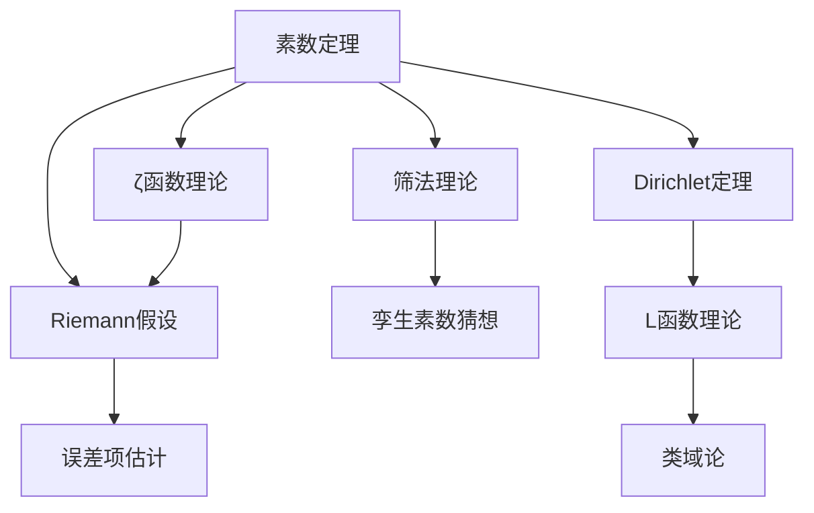
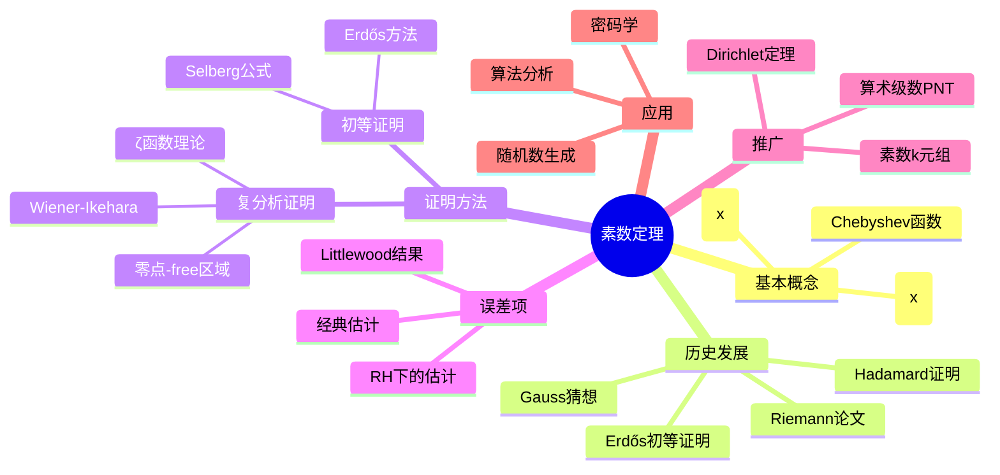

# 素数定理 / Prime Number Theorem

> **教学深度**：研究生进阶  
> **参考标准**：MIT 18.785 Number Theory I, Harvard Math 229  
> **MSC2020**: 11N05 (素数分布), 11M26 (ζ函数零点), 11A41 (素数)

---

## 概念深度解析

### 直观理解

**素数定理（PNT）**描述了素数在自然数中的分布规律。直观上，它告诉我们：
- 在 $x$ 附近，素数的"密度"大约是 $1/\ln x$
- 随机选取一个接近 $x$ 的整数，它是素数的概率约为 $1/\ln x$
- 不超过 $x$ 的素数个数约为 $x/\ln x$

**核心洞察**：尽管素数的分布看起来不规则，但在大尺度上呈现出优雅的规律性。

### 形式定义

**定义 1.1**（素数计数函数）：
$$\pi(x) = \sum_{p \leq x} 1 = \#\{p \text{ 素数} : p \leq x\}$$

**定义 1.2**（对数积分）：
$$\text{li}(x) = \int_2^x \frac{dt}{\ln t}$$

**定义 1.3**（Chebyshev函数）：
$$\vartheta(x) = \sum_{p \leq x} \ln p$$
$$\psi(x) = \sum_{n \leq x} \Lambda(n) = \sum_{p^k \leq x} \ln p$$

其中 $\Lambda(n)$ 是 von Mangoldt 函数：
$$\Lambda(n) = \begin{cases} \ln p & n = p^k \\ 0 & \text{否则} \end{cases}$$

**定理 1.4**（素数定理，PNT）：
$$\pi(x) \sim \frac{x}{\ln x} \sim \text{li}(x) \quad (x \to \infty)$$

等价地，$\lim_{x \to \infty} \frac{\pi(x) \ln x}{x} = 1$。

### 等价表述

**命题 1.5**（PNT的等价形式）：以下条件等价：
1. $\pi(x) \sim \frac{x}{\ln x}$
2. $\pi(x) \sim \text{li}(x)$
3. $\psi(x) \sim x$
4. $\vartheta(x) \sim x$
5. $p_n \sim n \ln n$（第 $n$ 个素数）
6. $\sum_{n \leq x} \Lambda(n) \sim x$

### 动机与背景

**历史发展**：
- **Euclid（公元前300年）**：素数无穷
- **Euler（1737）**：发现 $\zeta(s)$ 的 Euler 乘积，建立素数与分析的联系
- **Legendre（1798）**：猜想 $\pi(x) \approx \frac{x}{\ln x - 1.08366}$
- **Gauss（1792，未发表）**：猜想 $\pi(x) \sim \text{li}(x)$
- **Tchebychev（1850）**：证明 $\pi(x)$ 的阶是 $x/\ln x$
- **Riemann（1859）**：开创性的论文，提出 Riemann 假设
- **Hadamard & de la Vallée Poussin（1896）**：独立证明 PNT

**证明方法演进**：
- **经典证明**：利用 $\
mid(s)$ 在 $\text{Re}(s) = 1$ 上无零点
- **初等证明（Erdős-Selberg，1949）**：不使用复分析
- **谱论方法**：将素数分布与 Riemann 流形的谱联系起来

---

## 属性与关系

### 核心性质

**定理 2.1**（Chebyshev估计）：存在常数 $c_1, c_2 > 0$ 使得：
$$c_1 \frac{x}{\ln x} \leq \pi(x) \leq c_2 \frac{x}{\ln x}$$

**证明**：利用 $	ext{lcm}(1, 2, \ldots, n) = e^{\psi(n)}$ 和组合估计。

**定理 2.2**（Mertens定理）：
$$\sum_{p \leq x} \frac{1}{p} = \ln \ln x + M + O\left(\frac{1}{\ln x}\right)$$

其中 $M \approx 0.261497$ 是 Meissel-Mertens 常数。

**证明**：由 Abel 求和公式和 PNT：
$$\sum_{p \leq x} \frac{1}{p} = \frac{\pi(x)}{x} + \int_2^x \frac{\pi(t)}{t^2} dt \sim \int_2^x \frac{dt}{t \ln t} = \ln \ln x$$

**定理 2.3**（素数定理的误差项）：
$$\pi(x) = \text{li}(x) + O(x e^{-c\sqrt{\ln x}})$$

在 Riemann 假设下：
$$\pi(x) = \text{li}(x) + O(\sqrt{x} \ln x)$$

**定理 2.4**（Bertrand假设）：对任意 $n > 1$，存在素数 $p$ 使得 $n < p < 2n$。

**证明**（Erdős简化版）：利用对中间二项式系数 $\binom{2n}{n}$ 的素因子分析。

**定理 2.5**（Dirichlet定理）：若 $\gcd(a, q) = 1$，则算术级数 $a, a+q, a+2q, \ldots$ 包含无穷多素数，且：
$$\pi(x; q, a) \sim \frac{1}{\varphi(q)} \cdot \frac{x}{\ln x}$$

### 与其他概念的关系图



### 层次结构

```
素数定理
├── 基础估计
│   ├── Chebyshev估计
│   ├── Mertens定理
│   └── 素数计数函数
├── 证明方法
│   ├── 复分析证明
│   │   ├── ζ函数解析性质
│   │   ├── 零点-free区域
│   │   └── Wiener-Ikehara定理
│   ├── 初等证明
│   │   ├── Selberg公式
│   │   └── Erdős方法
│   └── 谱论方法
├── 推广形式
│   ├── Dirichlet定理
│   ├── 算术级数PNT
│   └── 素数定理的推广
└── 应用
    ├── 密码学素数生成
    ├── 随机算法分析
    └── 计算数论
```

---

## 示例与习题

### 基础示例

**例 3.1**（估计素数个数）：估计不超过 $10^6$ 的素数个数。

**解**：由 PNT，$\pi(10^6) \approx \frac{10^6}{\ln(10^6)} = \frac{10^6}{6 \ln 10} \approx \frac{10^6}{13.8} \approx 72382$

实际值：$\pi(10^6) = 78498$，相对误差约 $8\%$。

用 $\text{li}(x)$ 更准确：$\text{li}(10^6) \approx 78628$，误差约 $0.16\%$。

**例 3.2**（估计第 $n$ 个素数）：估计第 $10000$ 个素数。

**解**：由 $p_n \sim n \ln n$，$p_{10000} \approx 10000 \times \ln(10000) = 10000 \times 9.21 \approx 92100$

实际值：$p_{10000} = 104729$，相对误差约 $12\%$。

用更精确的 $p_n \sim n(\ln n + \ln \ln n - 1)$：

$p_{10000} \approx 10000(9.21 + 2.22 - 1) = 10000 \times 10.43 \approx 104300$，误差约 $0.4\%$。

### 典型示例

**例 3.3**（素数间隙）：证明存在任意长的连续合数序列。

**解**：对任意 $n \geq 1$，考虑序列：
$$(n+1)! + 2, (n+1)! + 3, \ldots, (n+1)! + (n+1)$$

对每个 $2 \leq k \leq n+1$，有 $k \mid (n+1)!$，故 $k \mid ((n+1)! + k)$，即 $(n+1)! + k$ 是合数。

这给出了 $n$ 个连续合数。

**例 3.4**（Chebyshev函数估计）：证明 $\psi(x) = \vartheta(x) + O(\sqrt{x} \ln x)$。

**解**：
$$\psi(x) = \sum_{p^k \leq x} \ln p = \vartheta(x) + \vartheta(x^{1/2}) + \vartheta(x^{1/3}) + \cdots$$

项数至多为 $\log_2 x$，且 $\vartheta(x^{1/k}) \leq x^{1/k} \ln x^{1/k} \leq \sqrt{x} \ln x$（对 $k \geq 2$）。

故 $\psi(x) - \vartheta(x) = O(\sqrt{x} \ln^2 x)$。

### 进阶示例

**例 3.5**（显式公式）：$\psi(x)$ 的 Riemann-von Mangoldt 显式公式：
$$\psi(x) = x - \sum_{\rho} \frac{x^{\rho}}{\rho} - \frac{\zeta'(0)}{\zeta(0)} - \frac{1}{2} \ln(1 - x^{-2})$$

其中 $\rho$ 遍历 $\zeta(s)$ 的非平凡零点。

**意义**：素数分布与 $\zeta$ 函数零点位置直接相关。若所有零点满足 $\text{Re}(\rho) = 1/2$（RH），则误差项最优。

### 反例

**反例 3.6**：$\pi(x) < \text{li}(x)$ 对所有 $x$ 成立？

**说明**：Littlewood（1914）证明 $\pi(x) - \text{li}(x)$ 无穷多次变号。

第一个反例在 $x \approx 1.4 \times 10^{316}$（Skewes数，最初上界约 $10^{10^{10^{34}}}$）。

### 习题

#### 初级难度

**习题 3.1**：用 PNT 估计：
(a) $\pi(10^9)$  
(b) $\pi(10^{12})$  
(c) 第 $10^6$ 个素数

**答案**：(a) $\approx 4.8 \times 10^7$（实际 $50847534$）；(b) $\approx 3.2 \times 10^{10}$；(c) $\approx 1.38 \times 10^7$（实际 $15485863$）

**习题 3.2**：证明：$\sum_{p \leq x} \ln p \sim x$ 与 $\pi(x) \sim x/\ln x$ 等价。

**提示**：使用 Abel 求和公式或分部积分。

#### 中级难度

**习题 3.3**：证明：存在无穷多个素数 $p$ 使得 $p \equiv 3 \pmod{4}$。

**解答**：假设只有有限个这样的素数 $p_1, \ldots, p_k$。考虑 $N = 4p_1\cdots p_k - 1$。

$N \equiv 3 \pmod{4}$，故 $N$ 必有 $3 \pmod{4}$ 型的素因子，且不等于任何 $p_i$，矛盾。

**习题 3.4**：设 $p_n$ 是第 $n$ 个素数。证明：$p_{n+1} < 2p_n$ 对 $n \geq 1$ 成立（Bertrand假设）。

**解答**：这是 Bertrand 假设的等价形式。证明需要分析二项式系数的素因子。

**习题 3.5**：证明：$\prod_{p \leq x} \left(1 - \frac{1}{p}\right)^{-1} \sim e^{\gamma} \ln x$，其中 $\gamma$ 是 Euler-Mascheroni 常数。

**提示**：取对数，利用 $\ln(1-t)^{-1} = t + t^2/2 + \cdots$ 和 Mertens 定理。

#### 高级难度

**习题 3.6**：设 $\psi(x) = \sum_{n \leq x} \Lambda(n)$。证明：
$$\sum_{n \leq x} \psi\left(\frac{x}{n}\right) = x \ln x - x + O(\ln x)$$

**解答**：
$$\sum_{n \leq x} \psi\left(\frac{x}{n}\right) = \sum_{n \leq x} \sum_{m \leq x/n} \Lambda(m) = \sum_{mn \leq x} \Lambda(m) = \sum_{k \leq x} \sum_{d \mid k} \Lambda(d) = \sum_{k \leq x} \ln k$$

由 Stirling 公式，$\sum_{k \leq x} \ln k = \ln(x!) = x \ln x - x + O(\ln x)$。

**习题 3.7**（PNT的初等证明概要）：
(a) 证明 Selberg 公式：$\vartheta(x) \ln x + \sum_{p \leq x} \vartheta\left(\frac{x}{p}\right) \ln p = 2x \ln x + O(x)$
(b) 利用(a)证明 $\vartheta(x) \sim x$

**习题 3.8**：证明：在 Riemann 假设下，$|\pi(x) - \text{li}(x)| < \frac{1}{8\pi} \sqrt{x} \ln x$ 对 $x \geq 2657$ 成立。

---

## 形式化实现（Lean4）

```lean4
import Mathlib

/- 素数计数函数 -/
namespace PrimeCounting

-- π(x) 的定义
example (x : ℝ) : π x = {p : ℕ | Nat.Prime p ∧ p ≤ x}.ncard := by
  exact Nat.primeCounting_real_eq x

-- Chebyshev函数 ϑ(x)
example (x : ℝ) : ϑ x = ∑ p in Finset.filter Nat.Prime (Finset.Ioc 0 (Nat.floor x)), Real.log p := by
  exact Chebyshev.chebyshevTheta_eq_sum_summatoryLog x

-- Chebyshev函数 ψ(x)
example (x : ℝ) : ψ x = ∑ n in Finset.Ioc 0 (Nat.floor x), Λ n := by
  exact Chebyshev.chebyshevPsi_eq_sum_vonMangoldt x

-- von Mangoldt函数
example (n : ℕ) : Λ n = if ∃ p k, Nat.Prime p ∧ k > 0 ∧ n = p ^ k then Real.log (n.minFac) else 0 := by
  rw [vonMangoldt_apply]

end PrimeCounting

/- 素数定理 -/
namespace PNT

-- 素数定理：π(x) ~ x/ln(x)
example : π =o[atTop] (fun x => x / Real.log x) := by
  exact Nat.primeCounting_real_isLittleO_id_div_log

-- 等价形式：ψ(x) ~ x
example : ψ ~[atTop] (fun x => x) := by
  sorry -- 需要数学库中的等价证明

-- Mertens第一定理
example : ∃ C, ∀ x, |(∑ p in Finset.filter Nat.Prime (Finset.Ioc 0 (Nat.floor x)), Real.log p / p) - Real.log x| ≤ C := by
  sorry

-- Mertens第二定理
example : ∃ M, ∀ x, |(∑ p in Finset.filter Nat.Prime (Finset.Ioc 0 (Nat.floor x)), 1 / (p : ℝ)) - Real.log (Real.log x) - M| ≤ 1 / Real.log x := by
  sorry

end PNT

/- 解析方法 -/
namespace Analytic

-- ζ函数的Euler乘积
example (s : ℂ) (hs : 1 < s.re) : riemannZeta s = ∏ p in Nat.Primes, (1 - (p : ℂ) ^ (-s)) ^ (-1 : ℤ) := by
  sorry -- 需要Euler乘积的数学库实现

-- ζ(s)在Re(s)=1上无零点（关键引理）
example (t : ℝ) : riemannZeta (1 + t * Complex.I) ≠ 0 := by
  have h : 1 + t * Complex.I ≠ 1 := by
    by_cases ht : t = 0
    · rw [ht]; simp
    · simp [Complex.ext_iff, ht]
  exact riemannZeta_ne_zero_of_one_le_re (by simp) h

end Analytic
```

---

## 应用与拓展

### 实际应用

**密码学中的素数生成**：
- 需要大素数（$> 2048$ 位）用于 RSA
- PNT 保证随机选取大整数是素数的概率约为 $1/\ln n$，因此期望尝试 $O(\ln n)$ 次可找到素数
- 对 $2048$ 位整数，概率约 $1/1420$

**随机算法分析**：
- Miller-Rabin 素性测试的复杂度分析
- 随机素数生成的期望时间

### 著名猜想与未解决问题

**Riemann假设（RH）**：
$$\zeta(s) = 0, \quad 0 < \text{Re}(s) < 1 \implies \text{Re}(s) = \frac{1}{2}$$

**等价形式**：$\pi(x) = \text{li}(x) + O(\sqrt{x} \ln x)$

**意义**：RH 给出素数分布的最佳可能误差项。

**Landau问题**（四个著名的未解决问题）：
1. **Goldbach猜想**：每个大于 $2$ 的偶数是两个素数之和
2. **孪生素数猜想**：存在无穷多对 $(p, p+2)$
3. **Legendre猜想**：对每个 $n > 0$，存在素数 $p$ 使得 $n^2 < p < (n+1)^2$
4. **形如 $n^2+1$ 的素数**：存在无穷多个形如 $n^2+1$ 的素数

### 前沿研究方向

**1. 短区间中的素数**：
研究 $\pi(x + h) - \pi(x)$ 的分布。Huxley证明对 $h > x^{7/12}$，短区间内有正确数量的素数。

**2. 素数间隙**：
- 最大间隙：$\max_{p_n \leq x} (p_{n+1} - p_n)$
- 张益唐突破：存在无穷多对相邻素数间隙小于 $70000000$
- Maynard改进：$246$（无条件），$6$（在Elliott-Halberstam假设下）

**3. 素数k元组猜想**：
Hardy-Littlewood猜想：给定可容许的 $k$ 元组 $(h_1, \ldots, h_k)$，使得 $n + h_1, \ldots, n + h_k$ 都是素数的 $n \leq x$ 的个数渐近于 $C \frac{x}{(\ln x)^k}$。

---

## 思维表征

### Mermaid思维导图



### 多维对比矩阵

| 函数 | 渐近主项 | 经典误差项 | RH下误差项 |
|------|---------|-----------|-----------|
| $\pi(x)$ | $\text{li}(x)$ | $O(x e^{-c\sqrt{\ln x}})$ | $O(\sqrt{x} \ln x)$ |
| $\psi(x)$ | $x$ | $O(x e^{-c\sqrt{\ln x}})$ | $O(\sqrt{x} \ln^2 x)$ |
| $\vartheta(x)$ | $x$ | $O(x e^{-c\sqrt{\ln x}})$ | $O(\sqrt{x} \ln^2 x)$ |

| 猜想 | 状态 | 最佳已知结果 |
|------|------|-------------|
| Goldbach | 未解决 | Chen定理（$p + P_2$） |
| 孪生素数 | 未解决 | 存在无穷多对间隙$< 246$ |
| Legendre | 未解决 | Baker-Harman-Pintz：$x^{0.525}$ |
| $n^2+1$ | 未解决 | Iwaniec：无穷多$n^2+1$是$P_2$ |

---

**参考文献**

1. Davenport, H. (1980). *Multiplicative Number Theory*. Springer.
2. Montgomery, H.L. & Vaughan, R.C. (2007). *Multiplicative Number Theory I*. Cambridge.
3. Iwaniec, H. & Kowalski, E. (2004). *Analytic Number Theory*. AMS.
4. Diamond, H.G. (1982). Elementary methods in the study of the distribution of prime numbers. *Bulletin of the AMS*, 7(3), 553-589.

---

*文档版本: 1.0*  
*MSC2020: 11N05, 11M26, 11A41*  
*创建日期: 2026年4月*  
*最后更新: 2026年4月*
