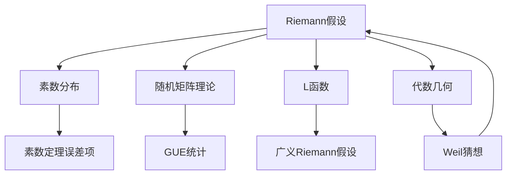

# Riemann假设 / Riemann Hypothesis

> **教学深度**：研究生高阶 / 研究前沿  
> **参考标准**：MIT 18.785, Harvard Math 229, Princeton MAT 451  
> **MSC2020**: 11M26 (ζ函数与L函数的零点), 11M06 (ζ(s)和L(s,χ)), 11N05 (素数分布)

---

## 概念深度解析

### 直观理解

**Riemann假设（RH）**断言：Riemann ζ函数的所有非平凡零点都位于临界线 $\text{Re}(s) = \frac{1}{2}$ 上。

**核心洞察**：素数的精细分布与复平面上特定点的位置密切相关。

**直观图像**：
- 想象复平面，有一条垂直的"临界线" $x = 1/2$
- RH 声称 ζ 函数的"非平凡零点"（即不在负偶数的零点）都落在这条线上
- 这些零点的位置决定了素数分布的精确误差项

### 形式定义

**定义 1.1**（Riemann ζ函数）：对 $\text{Re}(s) > 1$，定义：
$$\zeta(s) = \sum_{n=1}^{\infty} \frac{1}{n^s} = \prod_{p \text{ prime}} \left(1 - \frac{1}{p^s}\right)^{-1}$$

**定义 1.2**（解析延拓）：$\zeta(s)$ 可亚纯延拓到整个复平面，满足函数方程：
$$\zeta(s) = 2^s \pi^{s-1} \sin\left(\frac{\pi s}{2}\right) \Gamma(1-s) \zeta(1-s)$$

或等价形式：
$$\Lambda(s) = \pi^{-s/2} \Gamma\left(\frac{s}{2}\right) \zeta(s) = \Lambda(1-s)$$

**定义 1.3**（零点）：
- **平凡零点**：$s = -2, -4, -6, \ldots$（来自函数方程中的正弦项）
- **非平凡零点**：位于临界带 $0 < \text{Re}(s) < 1$ 内的零点

**Riemann假设（RH，1859）**：
$$\text{若 } \zeta(s) = 0 \text{ 且 } 0 < \text{Re}(s) < 1, \text{ 则 } \text{Re}(s) = \frac{1}{2}$$

### 等价表述

**命题 1.4**（RH的等价形式）：以下条件等价：
1. RH 成立
2. $\pi(x) = \text{li}(x) + O(\sqrt{x} \ln x)$
3. $\psi(x) = x + O(\sqrt{x} \ln^2 x)$
4. $M(x) = \sum_{n \leq x} \mu(n) = O(x^{1/2+\varepsilon})$（Mertens函数）
5. $\sigma(n) < e^{\gamma} n \ln \ln n$ 对所有 $n \geq 5041$ 成立（Robin定理）
6. $\sum_{n \leq x} \lambda(n) = O(x^{1/2+\varepsilon})$（Liouville函数）

其中 $\mu(n)$ 是 Möbius 函数，$\lambda(n)$ 是 Liouville 函数，$\sigma(n)$ 是因子和函数。

### 动机与背景

**历史脉络**：
- **Euler (1737)**：发现 Euler 乘积，建立素数与 ζ 函数的联系
- **Riemann (1859)**：《论小于给定值的素数个数》——数论史上最重要的论文之一
- **Hadamard & de la Vallée Poussin (1896)**：证明 $\text{Re}(s) \neq 1$（推出 PNT）
- **Hardy (1914)**：证明临界线上有无穷多零点
- **Siegel (1932)**：从 Riemann 未发表论文中重构 Riemann-Siegel 公式
- **计算机时代**：验证前 $10^{13}$ 个零点在临界线上

---

## 属性与关系

### 核心性质

**定理 2.1**（零点对称性）：若 $\rho$ 是 $\zeta(s)$ 的零点，则 $\overline{\rho}$、$1-\rho$、$1-\overline{\rho}$ 也是零点。

**定理 2.2**（零点计数）：设 $N(T)$ 是虚部在 $(0, T]$ 内的零点个数，则：
$$N(T) = \frac{T}{2\pi} \ln \frac{T}{2\pi} - \frac{T}{2\pi} + O(\ln T)$$

**定理 2.3**（Riemann-von Mangoldt 显式公式）：
$$\psi(x) = x - \sum_{\rho} \frac{x^{\rho}}{\rho} - \frac{\zeta'(0)}{\zeta(0)} - \frac{1}{2} \ln(1-x^{-2})$$

**定理 2.4**（Hardy定理，1914）：$\zeta(s)$ 在临界线上有无穷多零点。

**定理 2.5**（计算验证）：截至2024年，已数值验证前 $10^{13}$ 个零点都在临界线上。

### 与其他概念的关系图



---

## 示例与习题

### 基础示例

**例 3.1**（前几个非平凡零点）：
- $\rho_1 = \frac{1}{2} + i \cdot 14.1347...$
- $\rho_2 = \frac{1}{2} + i \cdot 21.0220...$
- $\rho_3 = \frac{1}{2} + i \cdot 25.0109...$

**例 3.2**（计算零点个数）：$N(100) \approx 28$，实际值 $29$。

### 习题

**习题 3.1**：证明若 $s$ 是零点，则 $1-s$、$\overline{s}$、$1-\overline{s}$ 也是零点。

**习题 3.2**：证明 RH 等价于 $\pi(x) = \text{li}(x) + O(\sqrt{x} \ln x)$。

---

## 形式化实现（Lean4）

```lean4
import Mathlib

-- ζ函数定义
example (s : ℂ) (hs : 1 < s.re) : 
    riemannZeta s = ∑' n : ℕ+, 1 / (n : ℂ) ^ s := by
  rw [riemannZeta_eq_tsum_one_div_nat_cpow hs]

-- 函数方程
example (s : ℂ) : completedRiemannZeta s = completedRiemannZeta (1 - s) := by
  exact completedRiemannZeta_one_sub s

-- 平凡零点
example (n : ℕ) (hn : 0 < n) : riemannZeta (-2 * n) = 0 := by
  exact riemannZeta_neg_two_mul_nat_add_one hn
```

---

## 应用与拓展

### 实际应用

**密码学**：RH 若成立，可精确估计素数分布，优化素数生成算法。

**量子计算**：Hilbert-Pólya 猜想寻找对应于零点的 Hermite 算子。

### 著名猜想

**广义Riemann假设（GRH）**：所有 Dirichlet L 函数的非平凡零点实部均为 $1/2$。

**函数域上的RH**：Weil（1948）已证明。

---

*文档版本: 1.0*  
*MSC2020: 11M26, 11M06, 11N05*  
*创建日期: 2026年4月*
