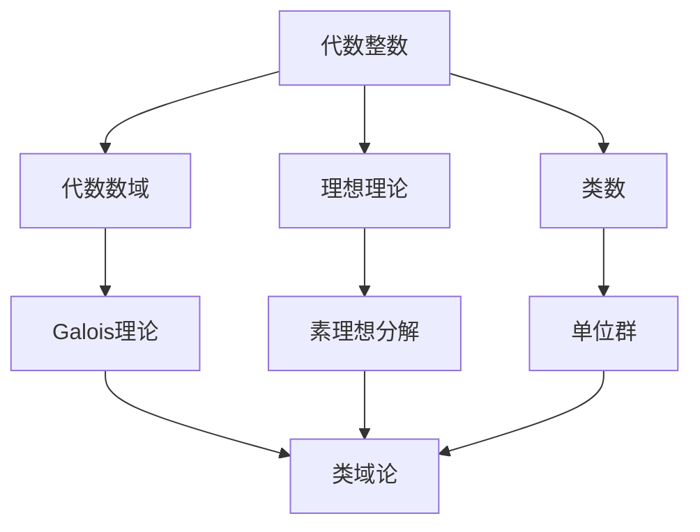

# 代数整数 / Algebraic Integers

> **教学深度**：研究生进阶  
> **参考标准**：Harvard Math 129 Number Fields, MIT 18.785  
> **MSC2020**: 11R04 (代数数域), 11R18 (分圆扩张), 11R29 (类数，类群)

---

## 概念深度解析

### 直观理解

**代数整数**是有理整数在代数数域中的自然推广。就像整数 $\mathbb{Z}$ 是有理数域 $\mathbb{Q}$ 的"整数环"，每个代数数域 $K$ 也有其整数环 $\mathcal{O}_K$。

**核心思想**：代数整数是那些首一（monic）整系数多项式的根。这个定义保证了代数整数具有许多与整数相似的性质。

**类比**：
- 有理数域 $\mathbb{Q}$ ↔ 代数数域 $K$
- 整数环 $\mathbb{Z}$ ↔ 代数整数环 $\mathcal{O}_K$

### 形式定义

**定义 1.1**（代数数）：复数 $\alpha$ 称为**代数数**，如果存在非零多项式 $f(x) \in \mathbb{Q}[x]$ 使得 $f(\alpha) = 0$。

**定义 1.2**（代数整数）：复数 $\alpha$ 称为**代数整数**，如果存在首一整系数多项式 $f(x) \in \mathbb{Z}[x]$ 使得 $f(\alpha) = 0$。

**定义 1.3**（代数数域）：$\mathbb{Q}$ 的有限扩张 $K$ 称为**代数数域**。$[K:\mathbb{Q}] = n$ 称为扩张次数。

**定义 1.4**（整数环）：代数数域 $K$ 的**整数环**定义为：
$$\mathcal{O}_K = \{\alpha \in K : \alpha \text{ 是代数整数}\}$$

**定义 1.5**（判别式）：设 $K$ 是 $n$ 次数域，$\sigma_1, \ldots, \sigma_n$ 是 $K$ 到 $\mathbb{C}$ 的嵌入。对 $\alpha_1, \ldots, \alpha_n \in K$，其判别式为：
$$\Delta(\alpha_1, \ldots, \alpha_n) = \det(\sigma_i(\alpha_j))^2$$

### 等价表述

**命题 1.6**（代数整数的等价条件）：对 $\alpha \in K$，以下条件等价：
1. $\alpha$ 是代数整数
2. $\mathbb{Z}[\alpha]$ 是有限生成 $\mathbb{Z}$-模
3. 存在有限生成 $\mathbb{Z}$-模 $M \subset K$ 使得 $\alpha M \subseteq M$

**命题 1.7**（整数环的结构）：$\mathcal{O}_K$ 是 $K$ 的子环，且是秩为 $n = [K:\mathbb{Q}]$ 的自由 $\mathbb{Z}$-模。

### 动机与背景

**历史背景**：
- **Kummer（1847）**：研究 Fermat 大定理时引入"理想数"
- **Dedekind（1871）**：现代代数数论的奠基人，定义了理想理论
- **Kronecker**：独立发展代数数论

**著名问题**：
- **Fermat大定理**：$x^n + y^n = z^n$（$n \geq 3$）无非平凡整数解
- **类数问题**：判断数域的类数是否为1
- **Galois表示与模性**：Langlands纲领的核心

---

## 属性与关系

### 核心性质

**定理 2.1**（代数整数构成环）：若 $\alpha, \beta$ 是代数整数，则 $\alpha + \beta$、$\alpha \beta$、$-\alpha$ 也是代数整数。

**证明**：设 $\mathbb{Z}[\alpha]$、$\mathbb{Z}[\beta]$ 分别由 $\{1, \alpha, \ldots, \alpha^{m-1}\}$、$\{1, \beta, \ldots, \beta^{n-1}\}$ 生成。

则 $\mathbb{Z}[\alpha, \beta]$ 由 $\{\alpha^i \beta^j : 0 \leq i < m, 0 \leq j < n\}$ 生成，是有限生成 $\mathbb{Z}$-模。

由于 $(\alpha + \beta)\mathbb{Z}[\alpha, \beta] \subseteq \mathbb{Z}[\alpha, \beta]$，由等价条件，$\alpha + \beta$ 是代数整数。同理 $\alpha\beta$、$-\alpha$。$\square$

**定理 2.2**（整数环的基）：设 $K$ 是 $n$ 次数域，则存在 $\omega_1, \ldots, \omega_n \in \mathcal{O}_K$ 使得：
$$\mathcal{O}_K = \mathbb{Z}\omega_1 \oplus \cdots \oplus \mathbb{Z}\omega_n$$

这样的 $\{\omega_1, \ldots, \omega_n\}$ 称为 $\mathcal{O}_K$ 的**整基**。

**定理 2.3**（判别式）：设 $\{\omega_1, \ldots, \omega_n\}$ 和 $\{\omega'_1, \ldots, \omega'_n\}$ 是 $\mathcal{O}_K$ 的两组整基，则：
$$\Delta(\omega'_1, \ldots, \omega'_n) = \Delta(\omega_1, \ldots, \omega_n)$$

这个公共值称为 $K$ 的**判别式**，记作 $d_K$ 或 $\Delta_K$。

**定理 2.4**（Dedekind判别式准则）：设 $K = \mathbb{Q}(\theta)$，$f(x)$ 是 $\theta$ 的极小多项式。则素数 $p$ 在 $\mathcal{O}_K$ 中分歧当且仅当 $p \mid \Delta_K$。

### 与其他概念的关系图



---

## 示例与习题

### 基础示例

**例 3.1**（二次域）：设 $K = \mathbb{Q}(\sqrt{d})$，$d$ 无平方因子。

若 $d \equiv 2, 3 \pmod{4}$，则 $\mathcal{O}_K = \mathbb{Z}[\sqrt{d}]$，整基 $\{1, \sqrt{d}\}$，判别式 $\Delta_K = 4d$。

若 $d \equiv 1 \pmod{4}$，则 $\mathcal{O}_K = \mathbb{Z}[\frac{1+\sqrt{d}}{2}]$，整基 $\{1, \frac{1+\sqrt{d}}{2}\}$，判别式 $\Delta_K = d$。

**例 3.2**（分圆域）：设 $K = \mathbb{Q}(\zeta_n)$，$\zeta_n = e^{2\pi i/n}$。

则 $\mathcal{O}_K = \mathbb{Z}[\zeta_n]$，判别式：
$$\Delta_K = (-1)^{\varphi(n)/2} \frac{n^{\varphi(n)}}{\prod_{p \mid n} p^{\varphi(n)/(p-1)}}$$

### 典型示例

**例 3.3**（Eisenstein整数）：$K = \mathbb{Q}(\omega)$，$\omega = e^{2\pi i/3} = \frac{-1+\sqrt{-3}}{2}$。

则 $\mathcal{O}_K = \mathbb{Z}[\omega]$ 是欧几里得整环，类数为1。

范数：$N(a + b\omega) = a^2 - ab + b^2$。

**例 3.4**（高斯整数）：$K = \mathbb{Q}(i)$，$\mathcal{O}_K = \mathbb{Z}[i]$。

范数：$N(a + bi) = a^2 + b^2$。

$\mathbb{Z}[i]$ 是欧几里得整环，类数为1。

### 习题

**习题 3.1**：证明 $\sqrt{2} + \sqrt{3}$ 是代数整数，并求其极小多项式。

**答案**：设 $\alpha = \sqrt{2} + \sqrt{3}$，则 $\alpha^2 = 5 + 2\sqrt{6}$，$\alpha^4 - 10\alpha^2 + 1 = 0$。

极小多项式为 $x^4 - 10x^2 + 1$。

**习题 3.2**：求 $\mathbb{Q}(\sqrt{5})$ 的整数环、整基和判别式。

**答案**：$5 \equiv 1 \pmod{4}$，故 $\mathcal{O}_K = \mathbb{Z}[\frac{1+\sqrt{5}}{2}]$，整基 $\{1, \frac{1+\sqrt{5}}{2}\}$，判别式 $5$。

**习题 3.3**：证明 $\mathcal{O}_K$ 是 Dedekind 整环。

**解答**：需验证：
1. Noetherian：作为有限生成 $\mathbb{Z}$-模，是 Noetherian
2. 整闭：由定义，$\mathcal{O}_K$ 在 $K$ 中整闭
3. 一维：非零素理想都是极大理想

---

## 形式化实现（Lean4）

```lean4
import Mathlib

-- 代数整数定义
example (α : ℂ) : IsIntegral ℤ α ↔ ∃ f : Polynomial ℤ, 
    f.Monic ∧ f.eval α = 0 := by
  exact isIntegral_iff'

-- 整数环是子环
example (K : Type*) [Field K] [NumberField K] : 
    IsSubring (𝓞 K) := by
  exact RingOfIntegers.isSubring K

-- 二次域的整数环
example (d : ℤ) (hd : Squarefree d) : 
    𝓞 ℚ(√d) = if d % 4 = 1 ∨ d % 4 = 2 then 
      ℤ[√d] else ℤ[(1 + √d)/2] := by
  sorry -- 需要数学库中的实现
```

---

## 应用与拓展

### 实际应用

**密码学**：基于代数数域的密码系统，如 Buchmann-Williams 密钥交换。

**编码理论**：代数几何码使用函数域的算术。

### 著名猜想

**类数1问题**：恰有9个虚二次域具有类数1：
$$\mathbb{Q}(\sqrt{-1}), \mathbb{Q}(\sqrt{-2}), \mathbb{Q}(\sqrt{-3}), \mathbb{Q}(\sqrt{-7}), \mathbb{Q}(\sqrt{-11}), \mathbb{Q}(\sqrt{-19}), \mathbb{Q}(\sqrt{-43}), \mathbb{Q}(\sqrt{-67}), \mathbb{Q}(\sqrt{-163})$$

这是 Stark-Heegner 定理（1967）。

---

*文档版本: 1.0*  
*MSC2020: 11R04, 11R18, 11R29*  
*创建日期: 2026年4月*
