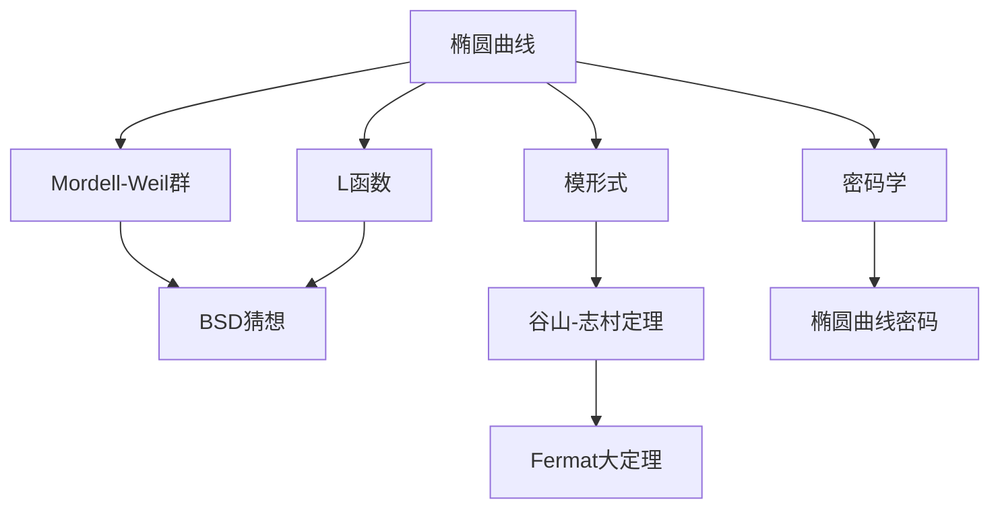

# 椭圆曲线 / Elliptic Curves

> **教学深度**：研究生高阶  
> **参考标准**：Harvard Math 259X, MIT 18.783, Princeton MAT 455  
> **MSC2020**: 11G05 (椭圆曲线整体域), 11G07 (椭圆曲线局部域), 14H52 (椭圆曲线代数几何)

---

## 概念深度解析

### 直观理解

**椭圆曲线**是亏格为1的代数曲线，具有一个指定的点（原点）。它不仅是代数几何的基本对象，也是数论的核心工具。

**核心思想**：椭圆曲线上的点构成一个Abel群，这种群结构使其成为研究Diophantine方程和构造密码系统的有力工具。

**几何图像**：复数域上，椭圆曲线是环面的代数化；有理数域上，它是具有丰富算术结构的曲线。

### 形式定义

**定义 1.1**（椭圆曲线）：域 $K$ 上的**椭圆曲线**是非奇异射影曲线，由 Weierstrass 方程给出：
$$E : y^2 + a_1xy + a_3y = x^3 + a_2x^2 + a_4x + a_6$$

或简化的形式（当 $\text{char}(K) \neq 2, 3$）：
$$E : y^2 = x^3 + Ax + B$$

要求判别式 $\Delta = -16(4A^3 + 27B^2) \neq 0$（保证非奇异）。

**定义 1.2**（群结构）：椭圆曲线 $E(K)$ 上的点构成 Abel 群，运算规则：
- 单位元：无穷远点 $\mathcal{O}$
- 逆元：$-(x, y) = (x, -y)$
- 加法：三点共线之和为零

**定义 1.3**（j-不变量）：
$$j(E) = 1728 \frac{4A^3}{4A^3 + 27B^2}$$

两椭圆曲线在代数闭域上同构当且仅当 $j$ 相同。

### 等价表述

**命题 1.4**（群结构的代数公式）：设 $P = (x_1, y_1)$，$Q = (x_2, y_2)$，则 $P + Q = (x_3, y_3)$：

若 $x_1 \neq x_2$：
$$\lambda = \frac{y_2 - y_1}{x_2 - x_1}, \quad \nu = y_1 - \lambda x_1$$

若 $P = Q$：
$$\lambda = \frac{3x_1^2 + A}{2y_1}, \quad \nu = y_1 - \lambda x_1$$

则：
$$x_3 = \lambda^2 - x_1 - x_2, \quad y_3 = -\lambda x_3 - \nu$$

### 动机与背景

**历史脉络**：
- **Diophantus（约250年）**：研究椭圆曲线上的有理点
- **Poincaré（1901）**：证明 Mordell-Weil 定理
- **Mordell（1922）**：证明有理数域上椭圆曲线有理点群是有限生成
- **Weil（1929）**：推广到任意数域
- **Wiles（1995）**：证明 Fermat 大定理（通过证明半稳定椭圆曲线的模性）

**BSD猜想**：椭圆曲线最重要的问题之一，连接算术与分析。

---

## 属性与关系

### 核心性质

**定理 2.1**（Mordell-Weil定理）：设 $E$ 是数域 $K$ 上的椭圆曲线，则 $E(K)$ 是有限生成 Abel 群：
$$E(K) \cong E(K)_{\text{tors}} \oplus \mathbb{Z}^r$$

其中 $E(K)_{\text{tors}}$ 是有限挠子群，$r$ 是秩（rank）。

**定理 2.2**（挠子群结构，Mazur定理）：设 $E$ 是 $\mathbb{Q}$ 上的椭圆曲线，则 $E(\mathbb{Q})_{\text{tors}}$ 同构于以下之一：
$$\mathbb{Z}/n\mathbb{Z}, \quad 1 \leq n \leq 10 \text{ 或 } n = 12$$
$$\mathbb{Z}/2\mathbb{Z} \times \mathbb{Z}/2n\mathbb{Z}, \quad 1 \leq n \leq 4$$

**定理 2.3**（椭圆曲线的 L-函数）：设 $E/\mathbb{Q}$，定义：
$$L(E, s) = \prod_{p \text{ good}} (1 - a_p p^{-s} + p^{1-2s})^{-1} \prod_{p \text{ bad}} (1 - a_p p^{-s})^{-1}$$

其中 $a_p = p + 1 - \#E(\mathbb{F}_p)$。

**定理 2.4**（BSD猜想，弱形式）：
$$\text{ord}_{s=1} L(E, s) = \text{rank}(E(\mathbb{Q}))$$

### 与其他概念的关系图



---

## 示例与习题

### 基础示例

**例 3.1**（具体椭圆曲线）：$E : y^2 = x^3 - x$

- 判别式 $\Delta = 64 \neq 0$
- $j = 1728$
- 复乘：$\mathbb{Z}[i]$

**例 3.2**（点加法）：在 $E : y^2 = x^3 + 1$ 上，$P = (0, 1)$，$Q = (2, 3)$。

计算 $P + Q$：
$$\lambda = \frac{3-1}{2-0} = 1, \quad x_3 = 1 - 0 - 2 = -1, \quad y_3 = -1 \cdot (-1) - 1 = 0$$

故 $P + Q = (-1, 0)$。

### 典型示例

**例 3.3**（同余数问题）：正整数 $n$ 称为**同余数**，如果存在有理边长的直角三角形面积为 $n$。

等价于椭圆曲线 $E_n : y^2 = x^3 - n^2x$ 有非平凡有理点。

**例 3.4**（Fermat大定理）：$x^n + y^n = z^n$（$n \geq 3$）无非平凡解。

Frey曲线：若存在解，则 $E : y^2 = x(x - a^n)(x + b^n)$ 是半稳定椭圆曲线。

Wiles 证明此类曲线是模的，但 Ribet 证明这样的曲线不能是模的，矛盾。

### 习题

**习题 3.1**：证明椭圆曲线的群运算满足结合律。

**提示**：利用代数几何中的 Riemann-Roch 定理或显式计算。

**习题 3.2**：在 $E : y^2 = x^3 - x$ 上，验证 $2 \cdot (0, 0) = \mathcal{O}$。

**答案**：$\lambda = \frac{-1}{0}$ 趋于无穷，故 $2P = \mathcal{O}$。

**习题 3.3**：计算 $\#E(\mathbb{F}_5)$ 对 $E : y^2 = x^3 + 1$。

**答案**：枚举 $x \in \{0, 1, 2, 3, 4\}$，检查 $x^3 + 1$ 是否为二次剩余。

---

## 形式化实现（Lean4）

```lean4
import Mathlib

-- 椭圆曲线的Weierstrass方程
example {K : Type*} [Field K] (A B : K) : 
    EllipticCurve K :=
  EllipticCurve.ofJ 0  -- 简化示例

-- 点加法公式
example {K : Type*} [Field K] [DecidableEq K] (E : EllipticCurve K) 
    (P Q : E.toProjective) : E.toProjective :=
  P + Q  -- 使用定义的群运算

-- Mordell-Weil定理声明
example (E : EllipticCurve ℚ) : 
    Module.Finite ℤ (E.ℚ) ∧ Module.rank ℤ (E.ℚ) < \aleph_0 := by
  sorry -- 需要MordellWeil定理的形式化
```

---

## 应用与拓展

### 实际应用

**密码学 - ECC**：
- 密钥长度短于 RSA（256位 ECC ≈ 3072位 RSA）
- ECDSA 用于比特币签名
- ECDH 密钥交换

**安全性基于**：椭圆曲线离散对数问题（ECDLP）的困难性。

### 著名猜想

**BSD猜想（Birch and Swinnerton-Dyer）**：
$$L(E, s) \sim C(s-1)^r, \quad r = \text{rank}(E(\mathbb{Q}))$$

其中 $C$ 包含挠子群、Sha群、周期等算术信息。

**状态**：Clay 千禧年难题之一。已知对 $r = 0, 1$ 成立（Gross-Zagier, Kolyvagin）。

---

*文档版本: 1.0*  
*MSC2020: 11G05, 11G07, 14H52*  
*创建日期: 2026年4月*
