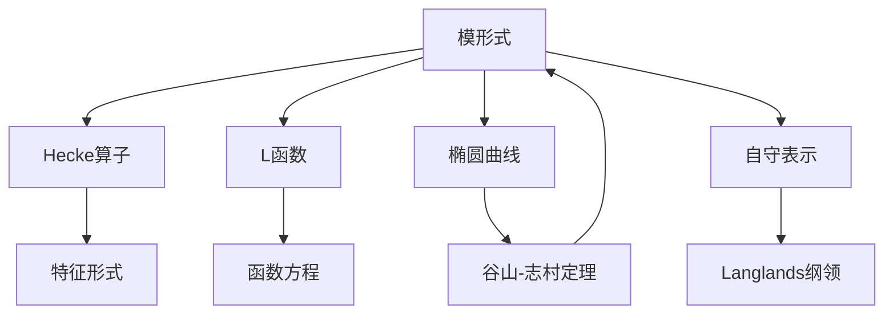

# 模形式 / Modular Forms

> **教学深度**：研究生高阶  
> **参考标准**：Harvard Math 259X, Princeton MAT 419, MIT 18.785  
> **MSC2020**: 11F11 (全纯模形式), 11F12 (Maass形式), 11F66 (Langlands纲领)

---

## 概念深度解析

### 直观理解

**模形式**是上半平面上的全纯函数，满足特定的变换性质。它们是高度对称的函数，其 Fourier 系数蕴含深刻的算术信息。

**核心思想**：模形式是作用在上半平面 $\mathbb{H}$ 上的模群 $SL_2(\mathbb{Z})$（或其同余子群）的不变量的推广。

**历史视角**：模形式源于椭圆函数的研究，但现代模形式理论已成为连接数论、代数几何、表示论和物理学的桥梁。

### 形式定义

**定义 1.1**（模群）：**模群**定义为：
$$\Gamma = SL_2(\mathbb{Z}) = \left\{\begin{pmatrix} a & b \\ c & d \end{pmatrix} : a, b, c, d \in \mathbb{Z}, ad - bc = 1\right\}$$

模群作用在上半平面 $\mathbb{H} = \{z \in \mathbb{C} : \text{Im}(z) > 0\}$ 上：
$$\gamma z = \frac{az + b}{cz + d}, \quad \gamma = \begin{pmatrix} a & b \\ c & d \end{pmatrix}$$

**定义 1.2**（模形式）：权为 $k$ 的**模形式**是全纯函数 $f : \mathbb{H} \to \mathbb{C}$ 满足：
1. **变换性**：$f(\gamma z) = (cz + d)^k f(z)$ 对所有 $\gamma \in SL_2(\mathbb{Z})$
2. **全纯性**：$f$ 在 $\mathbb{H}$ 上全纯
3. **在无穷远全纯**：$f$ 在 $i\infty$ 处有 Fourier 展开 $f(z) = \sum_{n=0}^{\infty} a_n q^n$，其中 $q = e^{2\pi i z}$

若 $a_0 = 0$，称 $f$ 为**尖点形式**（cusp form）。

**定义 1.3**（Eisenstein级数）：权为 $k \geq 4$ 偶数的**Eisenstein级数**：
$$G_k(z) = \sum_{(m,n) \neq (0,0)} \frac{1}{(mz + n)^k}$$

归一化 Eisenstein 级数：$E_k(z) = \frac{1}{2\zeta(k)} G_k(z) = 1 - \frac{2k}{B_k} \sum_{n=1}^{\infty} \sigma_{k-1}(n) q^n$

其中 $B_k$ 是 Bernoulli 数，$\sigma_{k-1}(n) = \sum_{d \mid n} d^{k-1}$。

**定义 1.4**（判别式模形式）：
$$\Delta(z) = \frac{E_4(z)^3 - E_6(z)^2}{1728} = q \prod_{n=1}^{\infty} (1 - q^n)^{24} = \sum_{n=1}^{\infty} \tau(n) q^n$$

其中 $\tau(n)$ 是 Ramanujan tau 函数。

### 等价表述

**命题 1.5**（模形式的维数）：权为 $k$ 的模形式空间 $M_k$ 的维数：
$$\dim M_k = \begin{cases} \lfloor k/12 \rfloor + 1 & k \not\equiv 2 \pmod{12} \\ \lfloor k/12 \rfloor & k \equiv 2 \pmod{12} \end{cases}$$

**命题 1.6**（尖点形式）：$S_k = \{f \in M_k : a_0 = 0\}$，则 $M_k = S_k \oplus \mathbb{C}E_k$（$k \geq 4$ 偶数）。

### 动机与背景

**历史脉络**：
- **Jacobi、Abel（19世纪初）**：椭圆函数理论
- **Poincaré（1880s）**：自守函数的一般理论
- **Ramanujan（1916）**：发现 tau 函数的深刻性质
- **Hecke（1930s）**：系统理论，Hecke算子
- **Taniyama、Shimura、Weil（1955-1967）**：模性与椭圆曲线的联系
- **Wiles（1995）**：证明谷山-志村猜想（半稳定情形），推出 Fermat 大定理

**谷山-志村猜想**（已证明为定理）：每个有理椭圆曲线都是模的。

---

## 属性与关系

### 核心性质

**定理 2.1**（模形式的乘法性）：$M_* = \bigoplus_{k} M_k$ 是分次环，由 $E_4$ 和 $E_6$ 生成：
$$M_* = \mathbb{C}[E_4, E_6]$$

**定理 2.2**（Hecke算子）：对素数 $p$，定义 Hecke 算子 $T_p$：
$$(T_p f)(z) = p^{k-1} f(pz) + \frac{1}{p} \sum_{j=0}^{p-1} f\left(\frac{z+j}{p}\right)$$

Hecke 算子保持 $M_k$ 和 $S_k$，是自伴的，彼此可交换。

**定理 2.3**（Hecke特征形式）：存在 $S_k$ 的由 Hecke 特征形式组成的基。若 $f$ 是归一化 Hecke 特征形式，则：
$$T_n f = a_n f, \quad a_{mn} = a_m a_n \text{（当 }\gcd(m,n)=1\text{）}$$

**定理 2.4**（谷山-志村定理）：设 $E/\mathbb{Q}$ 是椭圆曲线，导子为 $N$，则存在权 2 水平 $N$ 的 Hecke 特征形式 $f$ 使得：
$$L(E, s) = L(f, s)$$

即 $a_p(E) = a_p(f)$ 对所有素数 $p$ 成立。

### 与其他概念的关系图



---

## 示例与习题

### 基础示例

**例 3.1**（Eisenstein级数）：
$$E_4(z) = 1 + 240 \sum_{n=1}^{\infty} \sigma_3(n) q^n = 1 + 240q + 2160q^2 + \cdots$$

$$E_6(z) = 1 - 504 \sum_{n=1}^{\infty} \sigma_5(n) q^n = 1 - 504q - 16632q^2 - \cdots$$

**例 3.2**（模判别式）：
$$\Delta(z) = q - 24q^2 + 252q^3 - 1472q^4 + \cdots = \sum_{n=1}^{\infty} \tau(n) q^n$$

Ramanujan 猜想（Deligne 定理）：$|\tau(p)| \leq 2p^{11/2}$。

### 典型示例

**例 3.3**（权 12 尖点形式）：$S_{12} = \mathbb{C}\Delta$，一维空间。

**例 3.4**（椭圆曲线的模形式）：椭圆曲线 $E : y^2 + y = x^3 - x^2$（导子 11）对应权 2 水平 11 的模形式：
$$f(z) = q \prod_{n=1}^{\infty} (1 - q^n)^2 (1 - q^{11n})^2$$

### 习题

**习题 3.1**：证明 $E_4$ 和 $E_6$ 是模形式，权分别为 4 和 6。

**习题 3.2**：验证 $\Delta = (E_4^3 - E_6^2)/1728$ 是权 12 尖点形式。

**习题 3.3**：证明 $\dim M_{12} = 2$，$\dim S_{12} = 1$。

---

## 形式化实现（Lean4）

```lean4
import Mathlib

-- 模形式空间的声明
example (k : ℤ) : Type _ :=
  ModularForm SL(2, ℤ) k  -- 权为k的模形式空间

-- Eisenstein级数
example (k : ℕ) (hk : 4 ≤ k) (h even k) : 
    EisensteinSeries k ∈ ModularForm SL(2, ℤ) k := by
  sorry

-- Hecke算子
example (p : ℕ) (hp : Nat.Prime p) (k : ℤ) : 
    HeckeOperator p k : ModularForm SL(2, ℤ) k →ₗ[ℂ] ModularForm SL(2, ℤ) k := by
  sorry
```

---

## 应用与拓展

### 实际应用

**密码学**：基于模形式的密码系统研究。

**物理学**：弦理论、共形场论中的模不变性。

### 著名猜想

**Langlands纲领**：将模形式推广到自守形式，建立数论与表示论的统一框架。

**Serre猜想**（已证明）：二维 Galois 表示来自模形式。

---

*文档版本: 1.0*  
*MSC2020: 11F11, 11F12, 11F66*  
*创建日期: 2026年4月*
