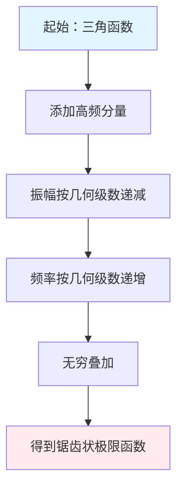
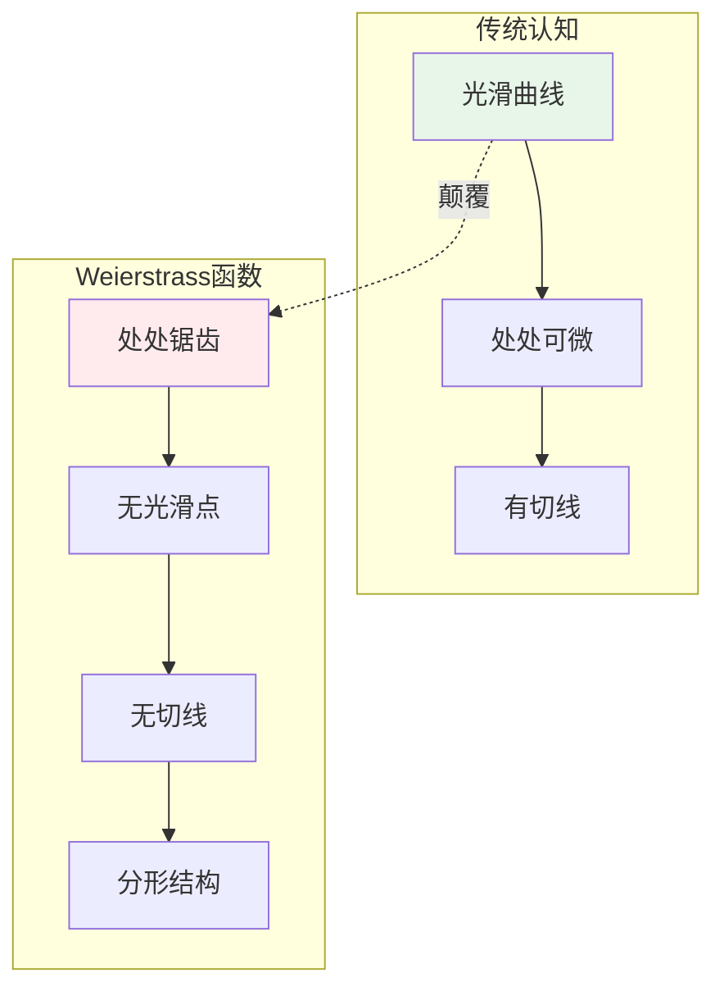
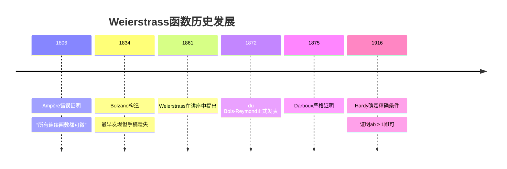
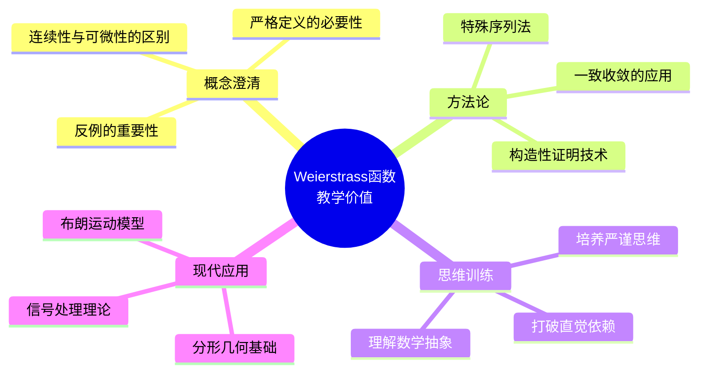
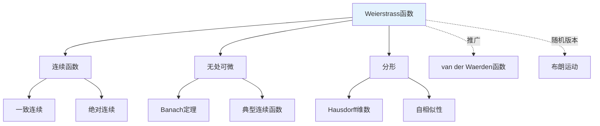

# 连续但无处可微函数详解（Weierstrass函数）

## 概述

Weierstrass函数是数学史上第一个被严格证明的**连续但处处不可微**的函数，它彻底颠覆了人们对"连续函数必然可微"的直观认知，成为分析学中最具革命性的反例之一。

---

## 1. 构造方法详解

### 1.1 经典定义

**Weierstrass函数**定义为无穷级数：

$$W(x) = \sum_{n=0}^{\infty} a^n \cos(b^n \pi x)$$

其中参数满足：

- $0 < a < 1$（确保级数收敛）
- $b$ 为正奇数整数
- $ab > 1 + \frac{3\pi}{2}$（保证不可微性）

### 1.2 构造思想

**核心思想**：通过叠加无穷多个振荡越来越剧烈但振幅越来越小的余弦波，构造出"处处锯齿"的极限函数。

### 1.3 变体形式

| 变体 | 表达式 | 特点 |
|------|--------|------|
| **原始形式** | $\sum a^n \cos(b^n \pi x)$ | Weierstrass经典形式 |
| **正弦版本** | $\sum a^n \sin(b^n \pi x)$ | 等价性质 |
| **复数形式** | $\sum a^n e^{i b^n \pi x}$ | 便于傅里叶分析 |

---

## 2. 验证过程逐步推导

### 2.1 连续性证明

**定理**：$W(x)$ 在 $\mathbb{R}$ 上连续。

**证明**：

**第一步：一致收敛性**

对于所有 $x \in \mathbb{R}$，有：
$$|a^n \cos(b^n \pi x)| \leq a^n$$

由于 $0 < a < 1$，级数 $\sum_{n=0}^{\infty} a^n = \frac{1}{1-a}$ 收敛。

由**Weierstrass M-判别法**，原级数一致收敛。

**第二步：连续性传递**

每个部分和 $S_N(x) = \sum_{n=0}^{N} a^n \cos(b^n \pi x)$ 是连续的（有限个连续函数之和）。

一致收敛的连续函数序列的极限函数连续。

**结论**：$W(x)$ 在 $\mathbb{R}$ 上连续。 $\blacksquare$

### 2.2 处处不可微性证明

**定理**：$W(x)$ 在任意点 $x_0 \in \mathbb{R}$ 处不可微。

**证明概要**：

**第一步：考察差商**

对任意 $x_0$，考虑差商：
$$\frac{W(x) - W(x_0)}{x - x_0} = \sum_{n=0}^{\infty} a^n \frac{\cos(b^n \pi x) - \cos(b^n \pi x_0)}{x - x_0}$$

**第二步：构造特殊序列**

对每个 $m \in \mathbb{N}$，选择 $x_m$ 使得：

- $b^m \pi x_m = b^m \pi x_0 + \frac{\pi}{2}$（使余弦变化最大）
- 即 $x_m = x_0 + \frac{1}{2b^m}$

**第三步：分析各部分贡献**

将求和分为两部分：
$$W(x_m) - W(x_0) = \underbrace{\sum_{n=0}^{m-1}}_{\text{低频部分}} + \underbrace{\sum_{n=m}^{\infty}}_{\text{高频部分}}$$

**低频部分估计**（$n < m$）：
$$\left|\sum_{n=0}^{m-1} a^n [\cos(b^n \pi x_m) - \cos(b^n \pi x_0)]\right| \leq \sum_{n=0}^{m-1} a^n \cdot b^n \pi |x_m - x_0| \cdot b^{m-n}$$

**高频部分分析**（$n \geq m$）：
由于 $b$ 是奇数，$b^n x_m$ 与 $b^n x_0$ 的关系保持特定相位差。

**第四步：导出矛盾**

通过条件 $ab > 1 + \frac{3\pi}{2}$，可以证明：
$$\left|\frac{W(x_m) - W(x_0)}{x_m - x_0}\right| \to \infty \quad \text{当 } m \to \infty$$

因此极限不存在，$W(x)$ 在 $x_0$ 处不可微。 $\blacksquare$

### 2.3 验证流程图

---

## 3. 直观解释

### 3.1 为什么"病态"？

### 3.2 几何直观

**放大观察**：

- 在任何尺度下观察，函数都呈现相似的"锯齿"结构
- 不存在任何区间使函数"平滑"
- 局部结构与整体结构具有自相似性（分形特征）

**物理类比**：
想象一个理想的海岸线——无论从多高的位置观察，都看不到平滑的直线，只有无穷无尽的细节。

### 3.3 关键洞察

| 直觉误区 | 数学现实 |
|---------|---------|
| 连续 = 平滑 | 连续 $\neq$ 可微 |
| 可画出的曲线可微 | 存在不可画的连续函数 |
| 自然界函数都良好 | 病态函数与良态函数一样"多" |

---

## 4. 历史背景

### 4.1 时间线

### 4.2 关键人物

**Karl Weierstrass (1815-1897)**

- 德国数学家，"现代分析学之父"
- 1872年在柏林科学院宣读论文
- 旨在批评"直观证明"的不可靠性
- 强调严格 $\varepsilon$-$\delta$ 定义的重要性

**历史意义**：

- 结束了"连续函数必可微"的错误认知
- 推动了分析学的严格化运动
- 为实变函数论的发展奠定基础

---

## 5. 教学价值

### 5.1 为什么要学这个？

### 5.2 学习路径建议

1. **前置知识**：
   - 一致收敛与函数项级数
   - 连续性严格定义
   - 可微性概念

2. **核心理解**：
   - 构造动机
   - 证明技巧
   - 直观把握

3. **拓展延伸**：
   - 分形维度计算
   - Holder连续性
   - 现代推广

### 5.3 常见误解澄清

| 误解 | 正确理解 |
|------|---------|
| "病态函数不常见" | 无处可微函数在连续函数空间中稠密 |
| "实际中不会出现" | 布朗运动轨迹无处可微 |
| "纯粹理论构造" | 在信号处理、金融数学中有应用 |

---

## 6. 相关概念网络

---

## 7. 参考与延伸阅读

- Weierstrass, K. (1872). "Über continuirliche Functionen eines reellen Arguments, die für keinen Werth des letzteren einen bestimmten Differentialquotienten besitzen."
- Hardy, G.H. (1916). "Weierstrass's non-differentiable function." *Trans. Amer. Math. Soc.*
- 推荐阅读：
  - 《实分析》Royden, Chapter 7
  - 《分形几何》Falconer, Chapter 11

---

## 8. 练习与思考

1. **验证练习**：证明当 $a = \frac{1}{2}$，$b = 3$ 时，条件 $ab > 1 + \frac{3\pi}{2}$ 满足。

2. **对比分析**：比较 Weierstrass 函数与 van der Waerden 函数的构造异同。

3. **深入思考**：为什么 Weierstrass 函数具有分形特征？计算其 Box 维数。

---

*文档版本：v1.0 | 创建日期：2026-04-09 | 分类：分析学反例 | MSC: 26A27*
