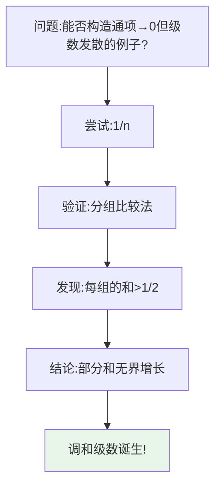
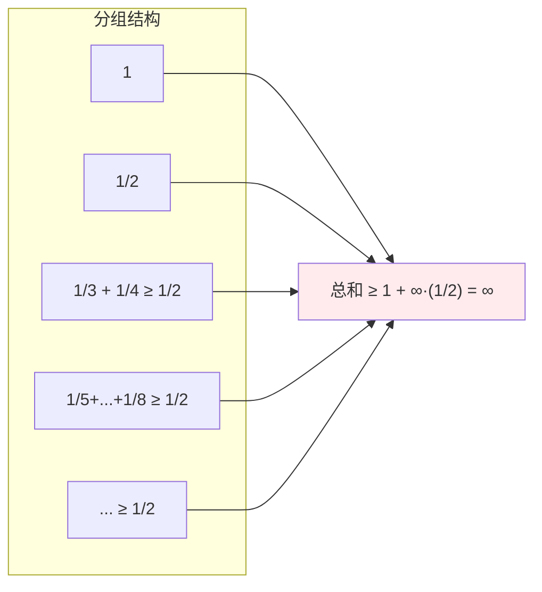
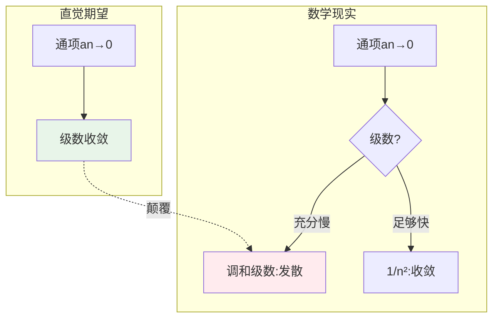
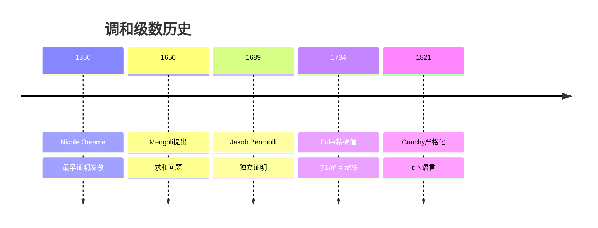
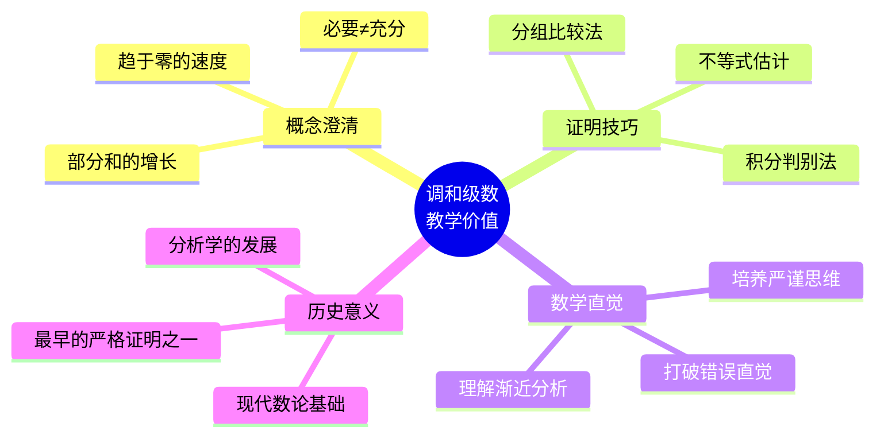
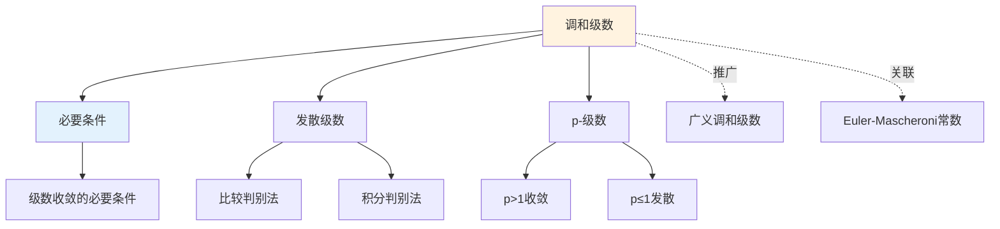

# 发散但通项趋于零的级数

## 概述

调和级数 $\sum_{n=1}^{\infty} \frac{1}{n}$ 是分析学中最经典、最具教学价值的反例之一。它完美地展示了：**通项趋于零只是级数收敛的必要条件，而非充分条件**。这个反例彻底澄清了初学者对级数收敛的常见误解。

---

## 1. 构造方法详解

### 1.1 经典形式

**调和级数**：
$$H = \sum_{n=1}^{\infty} \frac{1}{n} = 1 + \frac{1}{2} + \frac{1}{3} + \frac{1}{4} + \cdots$$

### 1.2 推广形式

| 级数类型 | 表达式 | 参数范围 | 收敛性 |
|---------|--------|---------|--------|
| **p-级数** | $\sum \frac{1}{n^p}$ | $p = 1$ | **发散** |
| p-级数 | $\sum \frac{1}{n^p}$ | $p > 1$ | 收敛 |
| p-级数 | $\sum \frac{1}{n^p}$ | $p \leq 1$ | 发散 |
| 广义调和 | $\sum \frac{1}{n \ln n}$ | - | 发散 |
| 广义调和 | $\sum \frac{1}{n (\ln n)^2}$ | - | 收敛 |

### 1.3 构造思想

---

## 2. 验证过程逐步推导

### 2.1 发散性证明（分组法）

**定理**：调和级数 $\sum_{n=1}^{\infty} \frac{1}{n}$ 发散。

**证明**：

**第一步：分组构造**

将级数按 $2$ 的幂次分组：

$$\begin{aligned}
H &= 1 + \frac{1}{2} + \underbrace{\left(\frac{1}{3} + \frac{1}{4}\right)}_{2^1 \text{项}} + \underbrace{\left(\frac{1}{5} + \frac{1}{6} + \frac{1}{7} + \frac{1}{8}\right)}_{2^2 \text{项}} + \cdots \\
&\quad + \underbrace{\left(\frac{1}{2^{k-1}+1} + \cdots + \frac{1}{2^k}\right)}_{2^{k-1} \text{项}} + \cdots
\end{aligned}$$

**第二步：每组下界估计**

对于第 $k$ 组（$k \geq 1$）：

$$\sum_{n=2^{k-1}+1}^{2^k} \frac{1}{n} \geq \sum_{n=2^{k-1}+1}^{2^k} \frac{1}{2^k} = 2^{k-1} \cdot \frac{1}{2^k} = \frac{1}{2}$$

**第三步：部分和估计**

前 $2^k$ 项部分和：

$$S_{2^k} = \sum_{n=1}^{2^k} \frac{1}{n} \geq 1 + \frac{1}{2} + \underbrace{\frac{1}{2} + \frac{1}{2} + \cdots + \frac{1}{2}}_{(k-1) \text{个}} = 1 + \frac{k}{2}$$

**第四步：发散结论**

当 $k \to \infty$ 时：
$$S_{2^k} \geq 1 + \frac{k}{2} \to +\infty$$

因此，调和级数发散。 $\blacksquare$

### 2.2 证明可视化

### 2.3 积分判别法验证

**另证**：利用积分判别法

考虑函数 $f(x) = \frac{1}{x}$，它在 $[1, +\infty)$ 上正值、连续、递减。

$$\int_1^{\infty} \frac{1}{x} dx = \lim_{b \to \infty} \ln b = +\infty$$

由于积分发散，级数也发散。 $\blacksquare$

### 2.4 证明方法对比

| 方法 | 核心思想 | 优点 | 局限性 |
|-----|---------|------|--------|
| **分组比较法** | 每组和 ≥ 1/2 | 直观、初等 | 仅适用于特定形式 |
| 积分判别法 | 与反常积分比较 | 适用范围广 | 需要函数单调递减 |
| Cauchy凝聚 | 压缩后判别 | 处理对数级数 | 需要正项递减 |

---

## 3. 直观解释

### 3.1 为什么"病态"？

### 3.2 关键洞察：趋于零的"速度"

级数收敛不仅要求通项趋于零，还要求趋于零的**速度足够快**：

$$\sum \frac{1}{n} \text{ 发散} \quad \text{vs} \quad \sum \frac{1}{n^2} \text{ 收敛}$$

差异在于：
- $\frac{1}{n}$ 趋于零的速度"太慢"
- 累积效应导致总和无界增长

### 3.3 物理解释

**类比**：往水池注水
- 每次加入的水量（$1/n$）确实在减少
- 但减少得不够快
- 无限次添加后，总水量仍趋于无穷

---

## 4. 历史背景

### 4.1 时间线

### 4.2 关键人物

**Nicole Oresme (1320-1382)**
- 法国哲学家、数学家
- 约1350年给出第一个严格证明
- 使用的就是上述分组比较法

**Jakob Bernoulli (1654-1705)**
- 瑞士数学家，伯努利家族成员
- 在《猜度术》(1713)中独立证明
- 提出了著名的伯努利数

### 4.3 Euler的贡献

虽然调和级数本身发散，Euler 发现其**变形**有特殊性质：

$$\sum_{n=1}^{\infty} \frac{1}{n^s} = \zeta(s)$$

这就是著名的**Riemann ζ函数**，在数论中至关重要。

---

## 5. 教学价值

### 5.1 为什么要学这个？

### 5.2 学习要点

| 误解 | 正确理解 |
|-----|---------|
| "通项趋于零则收敛" | 必要条件，非充分条件 |
| "发散意味着部分和爆炸" | 调和级数发散极慢（对数增长） |
| "收敛速度相同" | p-级数收敛速度随p变化 |

### 5.3 渐进性质

调和级数的部分和有渐近表达式：

$$H_n = \sum_{k=1}^{n} \frac{1}{k} = \ln n + \gamma + \frac{1}{2n} - O\left(\frac{1}{n^2}\right)$$

其中 $\gamma \approx 0.5772$ 是**Euler-Mascheroni常数**。

---

## 6. 相关概念网络

---

## 7. 变体与拓展

### 7.1 交错调和级数

$$\sum_{n=1}^{\infty} \frac{(-1)^{n+1}}{n} = 1 - \frac{1}{2} + \frac{1}{3} - \frac{1}{4} + \cdots = \ln 2$$

**关键区别**：交错级数满足 Leibniz 判别法条件，因此收敛。

### 7.2 删除特定项的调和级数

**例**：删除所有含数字9的项

$$\sum_{n \text{不含}9} \frac{1}{n} < \infty$$

**结论**：删除"足够多"的项可使级数收敛！

---

## 8. 参考与延伸阅读

- Oresme, N. (约1350). *Questiones super Geometriam Euclidis*
- Dunham, W. (1990). *Journey Through Genius*, Chapter 3
- Havil, J. (2003). *Gamma: Exploring Euler's Constant*

---

## 9. 练习与思考

1. **验证练习**：用 Cauchy 凝聚判别法证明 $\sum \frac{1}{n}$ 发散。

2. **对比分析**：比较 $\sum \frac{1}{n}$ 与 $\sum \frac{1}{n \ln n}$ 的发散速度。

3. **深入思考**：证明调和级数的部分和 $H_n$ 永远不会是整数（$n > 1$）。

4. **拓展问题**：研究 $\sum_{p \text{ prime}} \frac{1}{p}$ 的收敛性。

---

*文档版本：v1.0 | 创建日期：2026-04-09 | 分类：分析学反例 | MSC: 40A05*
