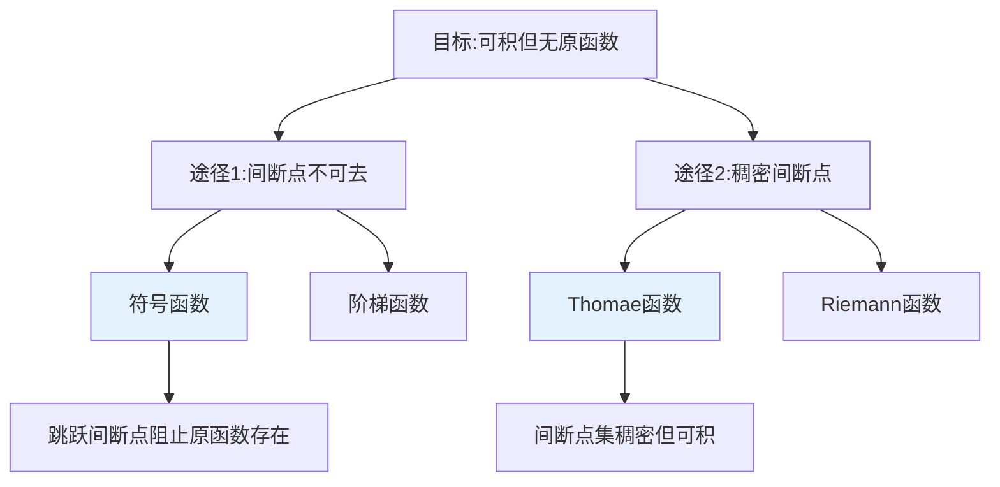
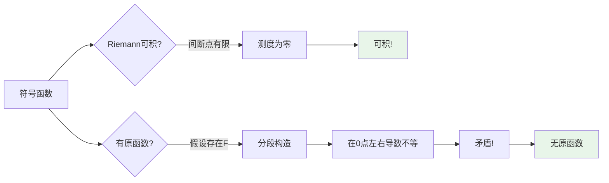
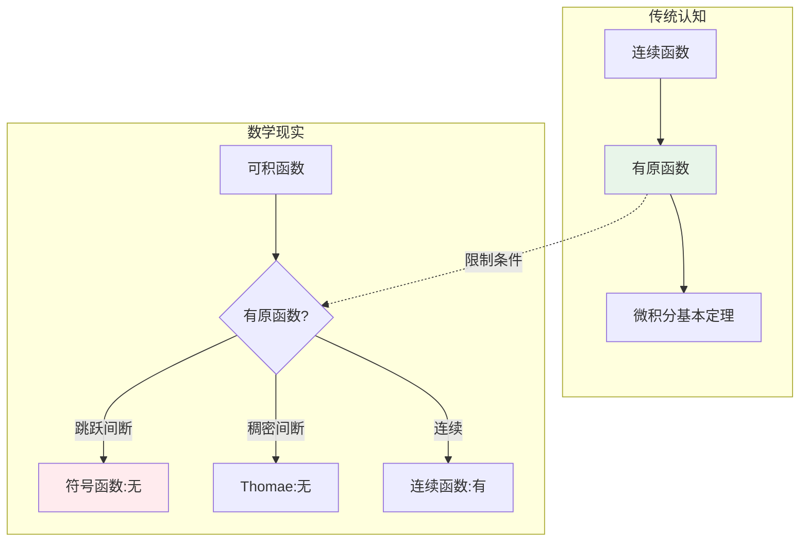
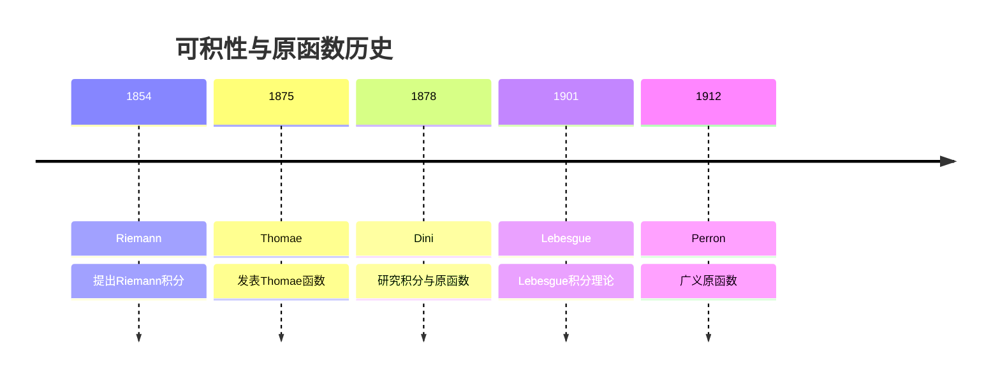
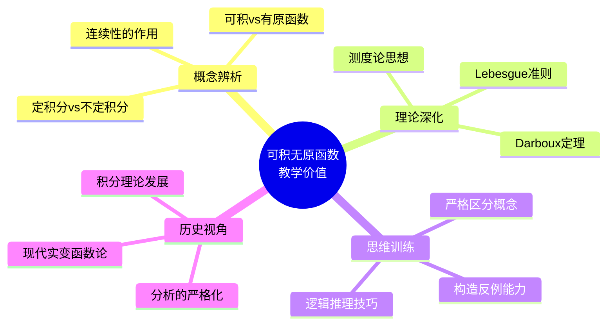
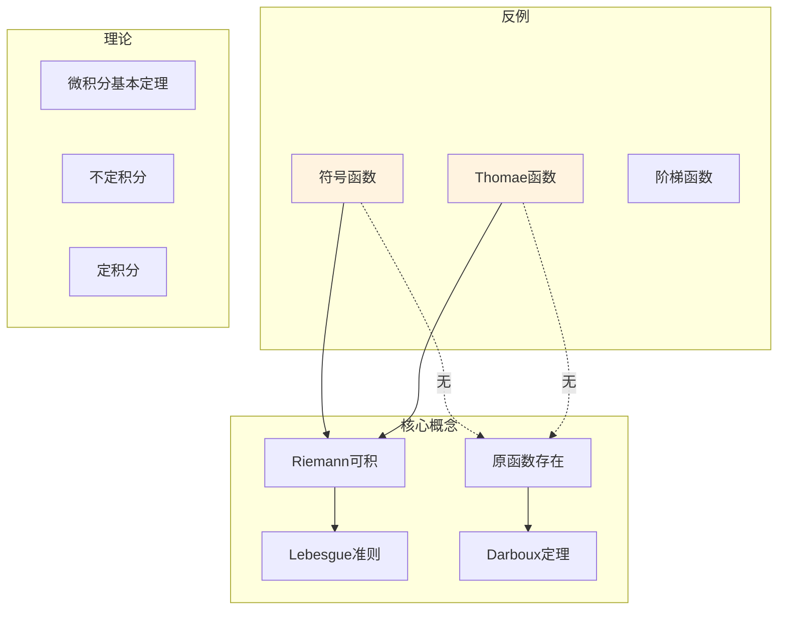

# 可积但无原函数的函数

## 概述

微积分基本定理建立了定积分与原函数之间的桥梁：若 $f$ 有原函数 $F$，则 $\int_a^b f(x)dx = F(b) - F(a)$。然而，存在一类"病态"函数——它们**Riemann可积**，却**不存在原函数**。这一反例深刻揭示了定积分与不定积分之间的本质区别。

---

## 1. 构造方法详解

### 1.1 经典反例

**符号函数（Sign Function）**：

$$f(x) = \text{sgn}(x) = \begin{cases}
1, & x > 0 \\
0, & x = 0 \\
-1, & x < 0
\end{cases}$$

**Thomae函数（ popcorn function）**：

$$f(x) = \begin{cases}
\frac{1}{q}, & x = \frac{p}{q} \in \mathbb{Q} \text{（既约分数）} \\
0, & x \notin \mathbb{Q}
\end{cases}$$

### 1.2 构造思想

### 1.3 各类反例对比

| 反例 | 间断点类型 | 间断点集 | Riemann可积 | 原函数存在 |
|-----|-----------|---------|------------|-----------|
| **符号函数** | 跳跃间断 | 单点 | ✓ | ✗ |
| **阶梯函数** | 跳跃间断 | 有限点 | ✓ | ✗ |
| **Thomae函数** | 可去间断 | 稠密集（ℚ） | ✓ | ✗ |
| Dirichlet函数 | 本质间断 | 处处 | ✗ | ✗ |

---

## 2. 验证过程逐步推导

### 2.1 符号函数案例

**定理**：$f(x) = \text{sgn}(x)$ 在 $[-1, 1]$ 上 Riemann 可积，但无原函数。

#### 第一部分：Riemann 可积性

**证明**：

**第一步：分析间断点**

$\text{sgn}(x)$ 仅在 $x = 0$ 处间断（跳跃间断）。

**第二步：应用 Lebesgue 准则**

Riemann 可积的 Lebesgue 准则：有界函数 $f$ 在 $[a,b]$ 上 Riemann 可积当且仅当其不连续点集的测度为零。

- 间断点集 $\{0\}$ 是有限集
- 有限集的 Lebesgue 测度为 0

**结论**：$\text{sgn}(x)$ 在 $[-1, 1]$ 上 Riemann 可积。 $\blacksquare$

#### 第二部分：无原函数

**证明**：

**第一步：反设存在原函数**

假设存在可微函数 $F$ 使得 $F'(x) = \text{sgn}(x)$ 对所有 $x \in [-1, 1]$ 成立。

**第二步：分析 $F$ 在 $x = 0$ 的性质**

对于 $x > 0$：$F'(x) = 1$，故 $F(x) = x + C_1$

对于 $x < 0$：$F'(x) = -1$，故 $F(x) = -x + C_2$

**第三步：导出矛盾**

$F$ 必须在 $x = 0$ 处可微，因此连续：
$$\lim_{x \to 0^+} F(x) = \lim_{x \to 0^-} F(x) = F(0)$$

这要求 $C_1 = C_2$。

但此时：
$$F'(0) = \lim_{h \to 0} \frac{F(h) - F(0)}{h}$$

右极限：$\lim_{h \to 0^+} \frac{h}{h} = 1$

左极限：$\lim_{h \to 0^-} \frac{-h}{h} = -1$

左右极限不相等，故 $F'(0)$ 不存在，矛盾！ $\blacksquare$

### 2.2 证明流程图

### 2.3 Thomae 函数案例

**定理**：Thomae 函数 $f$ 在 $[0, 1]$ 上 Riemann 可积，但无原函数。

#### 可积性证明

**证明**：

**第一步：分析间断点**

- 在有理点 $x = p/q$（既约）：$f(x) = 1/q > 0$
- 在无理点：$f(x) = 0$

对于任意有理点 $x_0 = p/q$，取无理点列 $x_n \to x_0$：
$$\lim_{n \to \infty} f(x_n) = 0 \neq \frac{1}{q} = f(x_0)$$

因此，**所有有理点都是间断点**。

**第二步：验证连续性**

在无理点 $x_0$：

对任意 $\varepsilon > 0$，满足 $1/q \geq \varepsilon$ 的 $q$ 只有有限个。

因此，在 $x_0$ 附近（除去有限个点），$f(x) < \varepsilon$。

故 $\lim_{x \to x_0} f(x) = 0 = f(x_0)$，无理点连续。

**第三步：应用 Lebesgue 准则**

- 间断点集 = $\mathbb{Q} \cap [0,1]$（可数集）
- 可数集的测度为 0

**结论**：Thomae 函数 Riemann 可积。 $\blacksquare$

#### 无原函数证明

**证明**：

假设存在原函数 $F$ 使得 $F' = f$。

由 Darboux 定理（导函数的介值性），$F'$ 必须具有介值性质。

但 Thomae 函数的值域为 $\{0\} \cup \{1/n : n \in \mathbb{N}^+\}$。

取 $a = 0$，$b = 1$，不存在 $c$ 使得 $f(c) = 1/2$。

因此 $f$ 不具有介值性质，不可能是某个函数的导数。 $\blacksquare$

---

## 3. 直观解释

### 3.1 为什么"病态"？

### 3.2 核心区别

| 概念 | 定义 | 关键条件 |
|-----|------|---------|
| **定积分** | 极限 $\lim_{\|P\| \to 0} \sum f(\xi_i)\Delta x_i$ | 可积性条件 |
| **不定积分** | 求原函数 $F$ 使得 $F' = f$ | 导函数性质 |

**关键洞察**：
- 定积分允许"少量"间断点
- 原函数要求导数在每一点存在
- 跳跃间断点阻止原函数存在

### 3.3 几何直观

**符号函数**：
- 图像在 $x=0$ 处"跳跃"
- 原函数的图像会有"尖角"
- 尖角处不可微

**Thomae 函数**：
- 在无理点"连续着地"
- 在有理点"尖峰突起"
- 整体"几乎"为零但处处不零

---

## 4. 历史背景

### 4.1 时间线

### 4.2 关键人物

**Johann Thomae (1840-1921)**
- 德国数学家
- 1870年提出"popcorn function"
- 研究超几何级数和椭圆函数

**Gaston Darboux (1842-1917)**
- 法国数学家
- 证明导函数的介值定理（Darboux定理）
- 该定理是判断原函数存在性的关键工具

### 4.3 理论发展

**Darboux 定理（1875）**：
若 $f$ 在区间 $I$ 上可微，则 $f'$ 具有介值性质。

**推论**：具有跳跃间断的函数不可能是导函数。

---

## 5. 教学价值

### 5.1 为什么要学这个？

### 5.2 常见误解澄清

| 误解 | 正确理解 |
|-----|---------|
| "可积 = 有原函数" | 两者不等价 |
| "间断函数不可积" | Lebesgue可积允许间断点集测度为零 |
| "导函数必连续" | 导函数可能有第二类间断点 |

### 5.3 学习建议

1. **区分概念**：明确"可积"与"有原函数"的定义差异
2. **掌握准则**：Lebesgue可积准则、Darboux定理
3. **构造练习**：尝试构造更多反例
4. **拓展学习**：了解 Lebesgue 积分理论

---

## 6. 相关概念网络

---

## 7. 现代推广

### 7.1 Lebesgue 积分

Lebesgue 积分理论彻底解决了可积性问题：

**定理**：若 $f$ 在 $[a,b]$ 上 Lebesgue 可积，则函数
$$F(x) = \int_a^x f(t) dt$$

在 $[a,b]$ 上**几乎处处可微**，且 $F'(x) = f(x)$ a.e.。

### 7.2 广义原函数

对于没有经典原函数的函数，可定义：
- **绝对连续函数**
- **有界变差函数**
- **Perron 积分**、**Denjoy 积分**

---

## 8. 参考与延伸阅读

- Thomae, J. (1870). "Ein Beitrag zur Theorie der Riemann'schen Integral."
- Darboux, G. (1875). "Mémoire sur les fonctions discontinues."
- Royden, H.L. *Real Analysis*, Chapter 5

---

## 9. 练习与思考

1. **验证练习**：证明 $f(x) = |x|$ 在 $[-1, 1]$ 上有原函数，但在 $x=0$ 处不可微。

2. **构造练习**：构造一个在 $[0, 1]$ 上有可数个间断点但无原函数的函数。

3. **深入思考**：若 $f$ 在 $[a,b]$ 上连续，是否一定有原函数？证明或举反例。

4. **拓展问题**：研究 Volterra 函数——连续、有导数但导数无界不可积的函数。

---

*文档版本：v1.0 | 创建日期：2026-04-09 | 分类：分析学反例 | MSC: 26A42, 26A24*
