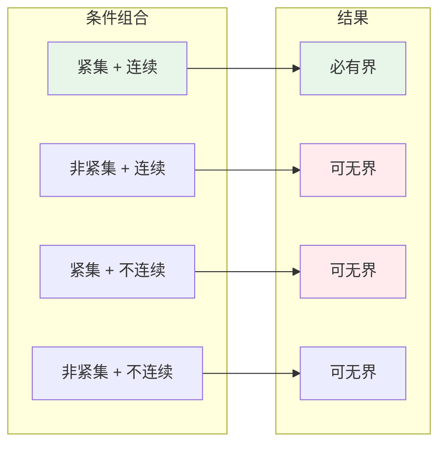
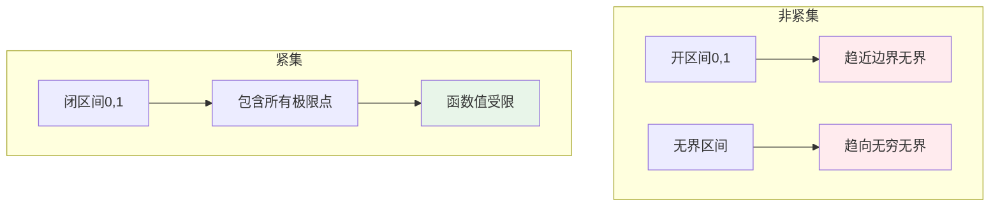
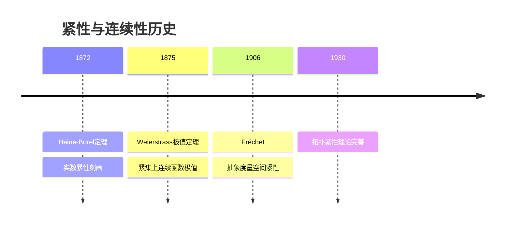
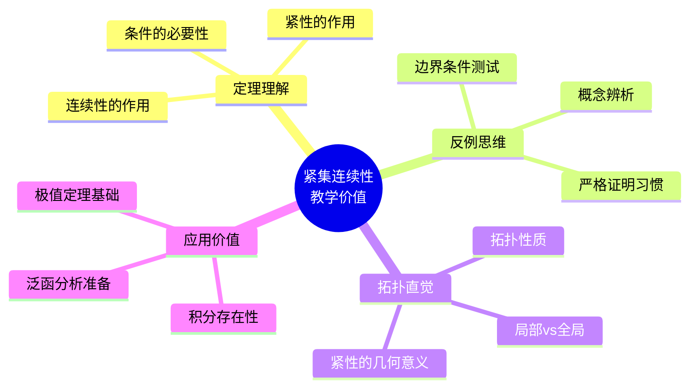
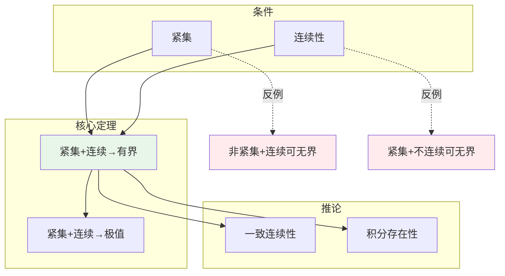

# 紧集上无界连续函数的反例

## 概述

在数学分析中有一个基本定理：**紧集上的连续函数必有界**。这意味着不存在"紧集上的无界连续函数"。本反例文档的目的是通过探讨这一定理的边界条件，帮助学习者理解为什么"紧性"和"连续性"这两个条件都是必不可少的。

---

## 1. 定理回顾与条件分析

### 1.1 核心定理

**定理（紧集上的有界性）**：设 $K \subseteq \mathbb{R}^n$ 是紧集，$f: K \to \mathbb{R}$ 连续，则 $f$ 在 $K$ 上有界。

### 1.2 条件必要性分析

```mermaid
flowchart TD
    A[定理条件] --> B[紧集K]
    A --> C[连续性f]

    B --> D{去掉紧性?}
    D -->|非紧集| E[可能无界]
    E --> F[例:1/x on 0,1]

    C --> G{去掉连续性?}
    G -->|不连续| H[可能无界]
    H --> I[例:1/x on [0,1]]

    style F fill:#ffebee
    style I fill:#ffebee
```

---

## 2. "反例"构造：违反单个条件

### 2.1 违反条件1：非紧集上的无界连续函数

**例1：开区间上的无界连续函数**

$$f(x) = \frac{1}{x}, \quad x \in (0, 1]$$

**分析**：

- $f$ 在 $(0, 1]$ 上**连续**
- $(0, 1]$ **非紧**（不包含极限点0）
- 当 $x \to 0^+$ 时，$f(x) \to +\infty$

**结论**：非紧集上的连续函数**可以**无界。

**例2：无界区间上的无界连续函数**

$$f(x) = x, \quad x \in [0, +\infty)$$

- $f$ 连续
- $[0, +\infty)$ 非紧（无界）
- $f(x) \to +\infty$ 当 $x \to +\infty$

### 2.2 违反条件2：紧集上的无界不连续函数

**例3：紧集上的无界函数**

$$f(x) = \begin{cases}
\frac{1}{x}, & x \in (0, 1] \\
0, & x = 0
\end{cases}$$

**分析**：
- 定义域 $[0, 1]$ 是**紧集**
- $f$ 在 $x = 0$ 处**不连续**（第二类间断）
- $\sup_{x \in [0,1]} f(x) = +\infty$

**结论**：紧集上的不连续函数**可以**无界。

### 2.3 构造方法图解



---

## 3. 验证过程详细推导

### 3.1 定理证明回顾

**证明**：紧集上连续函数的有界性

**第一步：利用紧性的开覆盖刻画**

对每个 $n \in \mathbb{N}$，定义：
$$U_n = f^{-1}((-n, n)) = \{x \in K : |f(x)| < n\}$$

由于 $f$ 连续，$U_n$ 是开集（在 $K$ 的相对拓扑中）。

**第二步：构造开覆盖**

显然：
$$K = \bigcup_{n=1}^{\infty} U_n$$

因为对于任意 $x \in K$，$|f(x)|$ 是有限值，存在 $n$ 使得 $|f(x)| < n$。

**第三步：应用紧性**

由于 $K$ 紧，存在有限子覆盖：
$$K = U_{n_1} \cup U_{n_2} \cup \cdots \cup U_{n_k}$$

**第四步：导出界**

令 $N = \max\{n_1, n_2, \ldots, n_k\}$，则：
$$K = U_N$$

即对所有 $x \in K$，$|f(x)| < N$。

**结论**：$f$ 在 $K$ 上有界。 $\blacksquare$

### 3.2 证明流程图

```mermaid
flowchart TB
    A[紧集K上连续函数f] --> B[构造开覆盖Un]
    B --> C[K = ∪Un]
    C --> D[有限子覆盖存在]
    D --> E[K = UN]
    E --> F[|f|<N on K]
    F --> G[f有界!]

    style G fill:#e8f5e9
```

### 3.3 关键步骤分析

| 步骤 | 依赖条件 | 若条件不成立 |
|-----|---------|------------|
| 构造 $U_n$ | 连续性 | $U_n$ 可能不是开集 |
| 开覆盖存在 | 值域为实数 | 自动满足 |
| 有限子覆盖 | **紧性** | 可能需要无限子覆盖 |
| 导出界 | 有限并 | 界可能不存在 |

---

## 4. 直观解释

### 4.1 紧性的本质



**核心洞察**：
- 紧集 = "有限性"的拓扑版本
- 连续性 = 局部有界性
- 紧性 + 连续性 = 局部有界性的全局化

### 4.2 几何直观

**非紧集情况**：
- 函数图像可以"逃离"到无穷远
- 要么在边界附近爆破（如 $1/x$ 在 $x=0$）
- 要么在无穷远处发散（如 $x$ 在 $+\infty$）

**紧集情况**：
- 集合"封闭"且"有界"
- 连续函数不能"跳跃"到无穷
- 图像必须"困在"某个水平带内

---

## 5. 历史背景

### 5.1 时间线



### 5.2 关键人物

**Eduard Heine (1821-1881)** & **Émile Borel (1871-1956)**
- Heine-Borel 定理：$\mathbb{R}^n$ 中子集紧当且仅当闭且有界
- 为紧集上函数性质奠定基础

**Karl Weierstrass (1815-1897)**
- 极值定理：紧集上连续函数必取到最大最小值
- 推论：紧集上连续函数有界

---

## 6. 教学价值

### 6.1 为什么要学这个？



### 6.2 学习要点

| 概念 | 要点 |
|-----|------|
| **紧集** | 闭且有界（在 $\mathbb{R}^n$ 中） |
| **连续性** | $\varepsilon$-$\delta$ 定义，保持收敛性 |
| **有界性** | 上确界和下确界都有限 |
| **关系** | 紧性 + 连续性 $\Rightarrow$ 有界性 |

### 6.3 常见误解

| 误解 | 正确理解 |
|-----|---------|
| "闭集上连续函数有界" | 闭但无界集上可无界 |
| "有界集上连续函数有界" | 有界但不开/不闭集上可无界 |
| "连续必局部有界" | 正确，但局部有界 $\neq$ 全局有界 |

---

## 7. 相关概念网络



---

## 8. 推广与拓展

### 8.1 推广到一般拓扑空间

**一般形式**：紧拓扑空间上的连续实值函数有界。

**证明**：像集 $f(K)$ 是 $\mathbb{R}$ 的紧子集，故闭且有界。

### 8.2 一致连续性

更强的结论：

**定理**：紧集上的连续函数**一致连续**。

这比有界性更强，说明连续性在紧集上"均匀"成立。

### 8.3 无限维空间

在无限维赋范空间中：
- 闭单位球不紧
- 存在闭单位球上的无界线性泛函（不连续）
- 连续线性算子必有界（有界线性算子定理）

---

## 9. 参考与延伸阅读

- Heine, E. (1872). "Die Elemente der Functionenlehre."
- Borel, É. (1895). "Sur quelques points de la théorie des fonctions."
- Munkres, J. *Topology*, Chapter 3
- Rudin, W. *Principles of Mathematical Analysis*, Chapter 4

---

## 10. 练习与思考

1. **验证练习**：证明 $f(x) = \sin(1/x)$ 在 $(0, 1]$ 上有界但不一致连续。

2. **构造练习**：构造一个在 $\mathbb{Q} \cap [0, 1]$ 上连续、有界，但不能连续延拓到 $[0, 1]$ 的函数。

3. **深入思考**：证明紧度量空间上的连续函数必一致连续。

4. **拓展问题**：研究紧算子（Compact Operator）在泛函分析中的作用。

---

*文档版本：v1.0 | 创建日期：2026-04-09 | 分类：分析学反例 | MSC: 26A15, 54C05*
